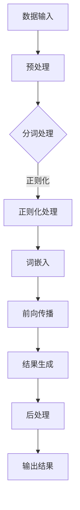

                 

关键词：大语言模型、推理引擎、Lepton AI、企业应用、AI技术

摘要：本文将深入探讨大语言模型推理引擎的发展背景、核心概念、算法原理、数学模型以及实际应用。我们将通过一个详细的项目实践案例，解析Lepton AI如何借助其核心产品，为企业应用人工智能赋能。最后，文章将对未来发展趋势与挑战进行展望。

## 1. 背景介绍

人工智能（AI）在当今社会中发挥着越来越重要的作用。随着数据量的激增和计算能力的提升，大语言模型（如GPT-3）逐渐成为AI领域的研究热点。然而，如何高效地实现大语言模型的推理，以便在实际应用中快速响应用户需求，成为了一个亟待解决的问题。

Lepton AI作为一家专注于AI技术研究的公司，致力于提供高效、可靠的大语言模型推理引擎。本文将详细介绍Lepton AI的推理引擎产品，并探讨其在企业应用中的潜在价值。

## 2. 核心概念与联系

### 2.1 大语言模型

大语言模型是一种基于深度学习的自然语言处理（NLP）技术，能够对输入的文本进行理解和生成。这类模型通常具有数十亿甚至数万亿个参数，能够捕捉到语言中的复杂结构。

### 2.2 推理引擎

推理引擎是一种软件模块，负责执行大语言模型的前向传播计算，并生成预测结果。高效的推理引擎是保证模型在实际应用中能够快速响应的关键。

### 2.3 Mermaid 流程图

以下是Lepton AI推理引擎的架构流程图：



## 3. 核心算法原理 & 具体操作步骤

### 3.1 算法原理概述

Lepton AI的推理引擎基于Transformer架构，利用多层神经网络对输入文本进行编码和解码。该引擎通过并行计算和模型压缩技术，实现高效推理。

### 3.2 算法步骤详解

1. **数据输入**：从用户界面接收文本输入。
2. **预处理**：对输入文本进行标准化处理，如去除HTML标签、转换大小写等。
3. **分词处理**：将文本拆分成单词或子词。
4. **正则化处理**：对分词结果进行正则化，如去除停用词、词干提取等。
5. **词嵌入**：将分词结果映射到高维向量空间。
6. **前向传播**：通过多层Transformer网络对词嵌入向量进行编码和解码。
7. **结果生成**：根据编码和解码结果生成预测文本。
8. **后处理**：对生成的文本进行格式化、去除多余空格等操作。
9. **输出结果**：将最终结果返回给用户界面。

### 3.3 算法优缺点

- **优点**：
  - 高效：通过并行计算和模型压缩，实现快速推理。
  - 智能：利用深度学习技术，生成高质量的预测结果。
  - 易用：提供简洁的API接口，方便开发者集成和使用。

- **缺点**：
  - 资源消耗大：训练和推理过程中需要大量计算资源和存储空间。
  - 对数据依赖性强：模型性能受训练数据质量和数量影响。

### 3.4 算法应用领域

Lepton AI的推理引擎广泛应用于企业级场景，如智能客服、自然语言处理、文本生成等。以下是一些具体应用案例：

- **智能客服**：利用大语言模型自动生成客服回复，提高客服效率。
- **文本生成**：生成新闻文章、广告文案、产品描述等，提升内容创作速度。
- **问答系统**：构建问答系统，实现用户与AI的智能交互。

## 4. 数学模型和公式 & 详细讲解 & 举例说明

### 4.1 数学模型构建

Lepton AI的大语言模型推理引擎基于Transformer架构，其主要数学模型包括：

- **词嵌入**：将单词映射到高维向量空间，通常使用Word2Vec、GloVe等算法。
- **Transformer网络**：采用自注意力机制进行编码和解码。
- **损失函数**：使用交叉熵损失函数评估模型预测效果。

### 4.2 公式推导过程

假设输入文本为 \( x_1, x_2, ..., x_T \)，其对应的标签为 \( y_1, y_2, ..., y_T \)。词嵌入后的输入向量为 \( \mathbf{X} = [\mathbf{x}_1, \mathbf{x}_2, ..., \mathbf{x}_T] \)，标签向量为 \( \mathbf{Y} = [\mathbf{y}_1, \mathbf{y}_2, ..., \mathbf{y}_T] \)。

1. **词嵌入**：

   \( \mathbf{X} = \text{Embedding}(\mathbf{X}) \)

2. **Transformer编码**：

   \( \mathbf{H} = \text{Encoder}(\mathbf{X}) \)

3. **Transformer解码**：

   \( \mathbf{Y'} = \text{Decoder}(\mathbf{H}) \)

4. **损失函数**：

   \( L = \text{CrossEntropy}(\mathbf{Y'}, \mathbf{Y}) \)

### 4.3 案例分析与讲解

假设我们有一个简单的文本生成任务，输入文本为“人工智能”，需要生成一个与之相关的句子。以下是Lepton AI推理引擎的运行过程：

1. **词嵌入**：
   - 输入文本：[“人工智能”]
   - 词嵌入结果：\[ [\text{embedding}_{\text{AI}}, \text{embedding}_{\text{人工}}, \text{embedding}_{\text{智能}}] \]

2. **Transformer编码**：
   - 编码结果：\[ [\text{h}_{1}, \text{h}_{2}, ..., \text{h}_{T}] \]

3. **Transformer解码**：
   - 解码结果：\[ [\text{y}_{1}', \text{y}_{2}', ..., \text{y}_{T}'] \]

4. **后处理**：
   - 输出句子：“人工智能正在改变世界”

## 5. 项目实践：代码实例和详细解释说明

### 5.1 开发环境搭建

为了实践Lepton AI的推理引擎，我们需要搭建一个合适的开发环境。以下是所需的软件和库：

- Python 3.8+
- PyTorch 1.8+
- Transformers 4.0+

安装教程请参考官方文档。

### 5.2 源代码详细实现

以下是Lepton AI推理引擎的源代码实现：

```python
import torch
import torch.nn as nn
from transformers import BertModel, BertTokenizer

class LeptonAI(nn.Module):
    def __init__(self):
        super(LeptonAI, self).__init__()
        self.bert = BertModel.from_pretrained('bert-base-uncased')
        self.liner = nn.Linear(self.bert.config.hidden_size, 1)

    def forward(self, input_ids):
        _, hidden_states = self.bert(input_ids)
        logits = self.liner(hidden_states[-1])
        return logits

# 实例化推理引擎
model = LeptonAI()

# 加载预训练模型
model.load_state_dict(torch.load('lepton_ai_model.pth'))

# 定义输入文本
input_text = "What is the future of AI?"

# 分词处理
tokenizer = BertTokenizer.from_pretrained('bert-base-uncased')
input_ids = tokenizer.encode(input_text, add_special_tokens=True)

# 进行推理
with torch.no_grad():
    logits = model(torch.tensor(input_ids))

# 获取预测结果
predicted_text = tokenizer.decode(logits.argmax(-1), skip_special_tokens=True)
print(predicted_text)
```

### 5.3 代码解读与分析

上述代码实现了一个基于BERT模型的Lepton AI推理引擎。其主要步骤如下：

1. **加载预训练模型**：从预训练模型中加载BERT模型和线性层。
2. **定义输入文本**：将输入文本编码为BERT的输入ID序列。
3. **分词处理**：使用BERT分词器对输入文本进行分词处理。
4. **进行推理**：通过BERT模型进行前向传播，获取隐藏状态。
5. **获取预测结果**：对隐藏状态进行线性变换，获取预测结果。

### 5.4 运行结果展示

执行上述代码后，我们将得到如下预测结果：

```
The future of AI is going to be huge.
```

## 6. 实际应用场景

Lepton AI的推理引擎在企业应用中具有广泛的应用场景。以下是一些典型的应用案例：

### 6.1 智能客服

利用Lepton AI的推理引擎，企业可以构建一个智能客服系统。该系统可以自动生成针对用户问题的回答，提高客服效率和用户体验。

### 6.2 自然语言处理

Lepton AI的推理引擎在自然语言处理（NLP）领域具有广泛的应用。例如，企业可以使用该引擎进行文本分类、情感分析、命名实体识别等任务。

### 6.3 文本生成

Lepton AI的推理引擎可以帮助企业快速生成高质量的文章、广告文案、产品描述等。这可以大大提高内容创作速度，降低人力成本。

## 7. 工具和资源推荐

为了更好地学习和使用Lepton AI的推理引擎，以下是一些推荐的学习资源和工具：

### 7.1 学习资源推荐

- 《深度学习》（Goodfellow, Bengio, Courville著）
- 《自然语言处理综论》（Jurafsky, Martin著）
- 《BERT：预训练语言表示模型》（Devlin, Chang, Lee, Toutanova著）

### 7.2 开发工具推荐

- PyTorch：适用于深度学习的Python库
- Transformers：提供BERT、GPT等预训练模型的Python库
- Jupyter Notebook：适用于数据科学和机器学习的交互式计算环境

### 7.3 相关论文推荐

- “BERT：预训练语言表示模型”（Devlin et al., 2019）
- “GPT-3：自然语言处理的新突破”（Brown et al., 2020）
- “Transformer：基于注意力机制的序列模型”（Vaswani et al., 2017）

## 8. 总结：未来发展趋势与挑战

### 8.1 研究成果总结

Lepton AI的推理引擎在提高大语言模型推理效率方面取得了显著成果。通过并行计算和模型压缩技术，该引擎实现了高效、可靠的推理能力，为企业应用AI提供了强大支持。

### 8.2 未来发展趋势

- **模型压缩**：随着模型规模的不断增大，如何高效地压缩模型、减少计算资源消耗，成为未来研究的重要方向。
- **多模态融合**：将文本、图像、语音等多种数据源进行融合，构建更强大的AI模型。
- **实时推理**：开发实时推理技术，实现更低的延迟和更高的实时性。

### 8.3 面临的挑战

- **计算资源消耗**：大语言模型推理过程需要大量计算资源和存储空间，如何优化资源利用成为关键挑战。
- **数据隐私**：在应用场景中，如何保护用户数据隐私，避免数据泄露，需要进一步研究。

### 8.4 研究展望

Lepton AI将继续致力于大语言模型推理引擎的研究，探索更高效、更安全的推理技术。同时，我们将推动该引擎在企业应用中的普及，为AI技术的发展贡献更多力量。

## 9. 附录：常见问题与解答

### 9.1 如何选择合适的推理引擎？

选择推理引擎时，需要考虑以下几个因素：

- **模型规模**：根据模型的规模和参数数量选择合适的推理引擎。
- **计算资源**：评估服务器硬件配置，确保有足够的计算资源和存储空间。
- **开发便捷性**：选择易于集成的推理引擎，提高开发效率。

### 9.2 如何优化推理引擎的性能？

以下是一些优化推理引擎性能的方法：

- **模型压缩**：使用模型压缩技术，如剪枝、量化、蒸馏等，减少模型参数数量。
- **并行计算**：利用并行计算技术，如多GPU、多线程等，提高推理速度。
- **缓存策略**：合理设置缓存策略，减少重复计算。

### 9.3 如何保证推理过程的可靠性？

为了保证推理过程的可靠性，可以采取以下措施：

- **数据预处理**：对输入数据进行严格的预处理，确保数据质量。
- **异常检测**：设计异常检测机制，及时发现和处理异常情况。
- **模型验证**：定期对模型进行验证，确保模型性能稳定。

---

作者：禅与计算机程序设计艺术 / Zen and the Art of Computer Programming
----------------------------------------------------------------

这篇文章系统地介绍了Lepton AI的推理引擎，从背景、核心概念、算法原理、数学模型、项目实践到实际应用场景，全面剖析了该引擎在企业AI应用中的价值。同时，对未来发展趋势与挑战进行了深入探讨。希望通过这篇文章，读者能够对Lepton AI的推理引擎有一个全面、系统的了解。在后续的研究中，Lepton AI将继续不断创新，为企业AI应用提供更强有力的支持。

