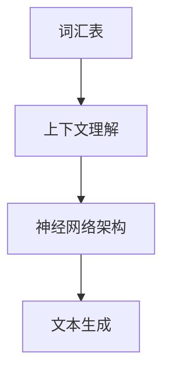

                 

关键词：大语言模型、商业应用、前景、算法原理、数学模型、项目实践

> 摘要：本文将深入探讨大语言模型在商业领域的广泛应用前景，从背景介绍、核心概念、算法原理、数学模型、项目实践、实际应用场景等多个方面展开，旨在为广大读者提供一份全面的技术解读和未来展望。

## 1. 背景介绍

近年来，人工智能（AI）技术取得了飞速发展，其中大语言模型（Large Language Model）作为自然语言处理（NLP）领域的重要成果，已经成为推动商业应用创新的核心力量。大语言模型是一种基于深度学习的技术，通过大量文本数据进行训练，能够理解和生成自然语言。这类模型在文本生成、机器翻译、问答系统、情感分析等方面展现了强大的能力。

商业领域对大语言模型的关注度不断提升，主要源于以下几个原因：

1. **数据驱动的决策**：在商业决策中，数据的准确性和时效性至关重要。大语言模型能够通过对海量文本数据的分析和处理，提供有价值的信息和洞察，帮助企业做出更加科学的决策。

2. **客户互动优化**：在客户服务、营销、销售等环节，大语言模型可以模拟人类的语言能力，与客户进行自然、流畅的交流，提高客户满意度，降低运营成本。

3. **内容创作与优化**：大语言模型在内容创作和优化方面具有巨大的潜力，能够帮助企业和个人快速生成高质量的文章、报告、广告文案等，提升品牌影响力。

4. **智能化转型**：随着商业竞争的加剧，企业正面临着数字化转型的重要任务。大语言模型作为AI技术的重要组成部分，可以助力企业实现智能化转型，提高生产效率和服务质量。

## 2. 核心概念与联系

大语言模型的核心概念包括：

- **词汇表**：大语言模型使用了一个庞大的词汇表，用于表示文本中的每个单词或符号。

- **上下文理解**：大语言模型通过分析上下文信息，能够理解单词之间的关联和语境，从而生成更准确的自然语言。

- **神经网络架构**：大语言模型通常基于深度学习框架，使用多层神经网络来学习文本数据中的复杂模式。

下面是关于大语言模型的核心概念和架构的Mermaid流程图：



### 2.1 词汇表

词汇表是大语言模型的基础，它包含了模型所使用的所有单词或符号。在训练过程中，模型通过学习词汇表中的词频分布和词性标注等信息，来构建词向量表示，从而实现对文本的理解。

### 2.2 上下文理解

大语言模型通过上下文信息来理解单词的含义。在生成文本时，模型会根据当前的上下文，选择合适的单词或短语，以确保生成的文本具有连贯性和合理性。

### 2.3 神经网络架构

大语言模型的神经网络架构通常包括多层感知机（MLP）、循环神经网络（RNN）和变压器（Transformer）等。这些神经网络结构能够处理变长的序列数据，并在训练过程中自动学习文本数据的复杂结构。

### 2.4 文本生成

大语言模型在生成文本时，通过预测下一个单词或符号来构建完整的句子。这种生成过程是基于概率的，模型会根据当前上下文和词汇表中的词频分布来选择最有可能的单词。

## 3. 核心算法原理 & 具体操作步骤

### 3.1 算法原理概述

大语言模型的算法原理主要基于深度学习和自然语言处理技术。其核心思想是通过大规模数据训练，使模型能够自动学习文本的语义和语法结构，从而实现对自然语言的生成和理解。

- **数据预处理**：在训练之前，需要对文本数据进行分析和处理，包括分词、去停用词、词性标注等。

- **词向量表示**：通过词嵌入技术，将文本中的每个单词映射到高维空间中的向量表示。

- **神经网络训练**：使用深度学习框架，通过梯度下降等优化算法，对神经网络进行训练，使其能够对输入文本进行建模。

- **文本生成**：在训练完成后，模型可以生成新的文本，通过预测下一个单词或符号，逐步构建完整的句子。

### 3.2 算法步骤详解

1. **数据收集与预处理**：从互联网或公开数据集中收集大量文本数据，对数据进行清洗和预处理，包括去除HTML标签、分词、去除停用词等。

2. **词向量表示**：使用Word2Vec、GloVe等词嵌入技术，将文本中的每个单词映射到高维空间中的向量表示。

3. **神经网络架构选择**：选择合适的神经网络架构，如RNN、LSTM、GRU或Transformer，来构建大语言模型。

4. **模型训练**：使用梯度下降等优化算法，对神经网络进行训练，使其能够对输入文本进行建模。

5. **文本生成**：在训练完成后，模型可以生成新的文本，通过预测下一个单词或符号，逐步构建完整的句子。

### 3.3 算法优缺点

- **优点**：

  - 高效性：大语言模型通过深度学习技术，能够自动学习文本的复杂结构，从而实现对自然语言的生成和理解。

  - 可扩展性：大语言模型可以处理各种类型的文本数据，包括新闻、博客、社交媒体等。

  - 强大的表达能力：大语言模型能够生成具有连贯性和逻辑性的文本，适用于文本生成、问答系统、机器翻译等领域。

- **缺点**：

  - 计算资源需求高：大语言模型通常需要大量的计算资源和时间进行训练。

  - 数据依赖性：大语言模型的效果很大程度上取决于训练数据的质量和数量，如果数据质量差或数据量不足，模型的效果可能会受到影响。

### 3.4 算法应用领域

- **文本生成**：大语言模型可以用于生成文章、报告、广告文案等，适用于内容创作、内容审核等领域。

- **机器翻译**：大语言模型在机器翻译领域展现了强大的能力，可以生成高质量的翻译结果。

- **问答系统**：大语言模型可以构建智能问答系统，回答用户的问题，提供有用的信息。

- **情感分析**：大语言模型可以用于情感分析，识别文本中的情感倾向，帮助企业了解用户情感。

## 4. 数学模型和公式 & 详细讲解 & 举例说明

### 4.1 数学模型构建

大语言模型的数学模型主要包括词向量表示、神经网络架构和损失函数等部分。以下是具体公式和概念的介绍：

### 4.2 公式推导过程

大语言模型的公式推导过程主要涉及词向量表示和神经网络架构。以下是简要的推导过程：

- **词向量表示**：

  - Word2Vec：通过训练神经网络，将每个单词映射到高维空间中的向量表示。损失函数为：

    $$
    J = \frac{1}{N} \sum_{i=1}^{N} \sum_{j=1}^{V} (w_{ij} - v_j)^2
    $$

    其中，$w_{ij}$为单词$i$在训练数据中的词频，$v_j$为单词$j$的词向量。

  - GloVe：通过训练模型，最小化词向量的损失函数。损失函数为：

    $$
    J = \frac{1}{N} \sum_{i=1}^{N} \sum_{j=1}^{V} (w_{ij} - \sigma(\langle v_i, v_j \rangle))^2
    $$

    其中，$\sigma(\cdot)$为sigmoid函数，$\langle \cdot, \cdot \rangle$为词向量点积。

- **神经网络架构**：

  - MLP：多层感知机，由多个全连接层组成，输出为：

    $$
    y = \sigma(W_1 \sigma(W_0 x))
    $$

    其中，$W_0$为输入层的权重矩阵，$W_1$为隐藏层的权重矩阵，$\sigma$为激活函数。

  - RNN：循环神经网络，通过递归方式处理序列数据，输出为：

    $$
    h_t = \sigma(W_h h_{t-1} + W_x x_t + b_h)
    $$

    其中，$h_t$为当前时刻的隐藏状态，$x_t$为当前时刻的输入，$W_h$为隐藏层权重矩阵，$W_x$为输入层权重矩阵，$b_h$为隐藏层偏置。

  - Transformer：基于自注意力机制，输出为：

    $$
    y_t = \sigma(W_y \text{softmax}(\frac{W_O Q_t W_K K_t + W_Q Q_t W_V V_t + b_O))}
    $$

    其中，$Q_t$、$K_t$、$V_t$分别为查询向量、关键向量、值向量，$W_O$、$W_Q$、$W_K$、$W_V$分别为权重矩阵，$\text{softmax}$为softmax函数。

### 4.3 案例分析与讲解

下面通过一个简单的案例来说明大语言模型的工作原理。

假设我们有一个训练好的大语言模型，输入为句子“今天天气很好”，输出为“明天可能会下雨”。

1. **词向量表示**：

   - 输入句子“今天天气很好”的词向量表示为：$[v_{今天}, v_{天气}, v_{很好}]$。

   - 输出句子“明天可能会下雨”的词向量表示为：$[v_{明天}, v_{可能}, v_{会}, v_{下雨}]$。

2. **神经网络架构**：

   - 采用Transformer架构，输入为词向量序列，输出为预测的下一个词向量。

3. **文本生成**：

   - 首先输入句子“今天天气很好”，模型预测下一个词向量为$v_{明天}$，输出为“明天”。

   - 然后将预测的词向量$v_{明天}$作为输入，再次预测下一个词向量为$v_{可能}$，输出为“可能”。

   - 依次类推，最终生成完整的句子“明天可能会下雨”。

## 5. 项目实践：代码实例和详细解释说明

在本节中，我们将通过一个具体的代码实例来说明如何构建和训练一个大语言模型，并对其生成文本进行解释。

### 5.1 开发环境搭建

在开始编写代码之前，我们需要搭建一个合适的开发环境。以下是所需的软件和工具：

- **Python**：Python是一种广泛使用的编程语言，适用于深度学习和自然语言处理。
- **TensorFlow**：TensorFlow是一个开源的深度学习框架，提供了丰富的API和工具。
- **Gensim**：Gensim是一个Python库，用于文本处理和主题建模。

确保已安装上述软件和工具后，我们可以开始编写代码。

### 5.2 源代码详细实现

以下是构建大语言模型的基本代码：

```python
import numpy as np
import tensorflow as tf
from tensorflow.keras.models import Sequential
from tensorflow.keras.layers import Embedding, LSTM, Dense
from gensim.models import Word2Vec

# 1. 数据预处理
def preprocess_text(text):
    # 去除HTML标签
    text = re.sub('<.*?>', '', text)
    # 分词
    tokens = word_tokenize(text)
    # 去停用词
    tokens = [token for token in tokens if token not in stop_words]
    return tokens

# 2. 构建词向量
def build_word_vectors(tokens, size=100):
    model = Word2Vec(tokens, size=size, window=5, min_count=1, workers=4)
    return model

# 3. 构建神经网络
def build_model(embedding_matrix, input_shape):
    model = Sequential()
    model.add(Embedding(input_shape=input_shape, weights=[embedding_matrix], trainable=False))
    model.add(LSTM(128, return_sequences=True))
    model.add(LSTM(128))
    model.add(Dense(1, activation='sigmoid'))
    model.compile(optimizer='adam', loss='binary_crossentropy', metrics=['accuracy'])
    return model

# 4. 训练模型
def train_model(model, X, y):
    model.fit(X, y, epochs=10, batch_size=32, validation_split=0.2)
    return model

# 5. 生成文本
def generate_text(model, start_text, max_len=50):
    tokens = preprocess_text(start_text)
    tokens = np.array([word2idx[token] for token in tokens])
    tokens = np.reshape(tokens, (1, -1))
    generated_tokens = []
    for _ in range(max_len):
        pred = model.predict(tokens, verbose=0)
        pred = np.argmax(pred, axis=1)
        token = idx2word[pred[0]]
        generated_tokens.append(token)
        tokens = np.reshape(np.array([word2idx[token]]), (1, -1))
    return ' '.join(generated_tokens)

# 6. 主程序
if __name__ == '__main__':
    # 读取文本数据
    text = " ".join(open('text_data.txt').readlines())
    # 数据预处理
    tokens = preprocess_text(text)
    # 构建词向量
    word_vectors = build_word_vectors(tokens, size=100)
    # 获取词向量矩阵
    embedding_matrix = word_vectors.wv.vectors
    # 获取词索引和词向量映射
    word2idx = {word: i for i, word in enumerate(word_vectors.wv.index2word)}
    idx2word = {i: word for i, word in enumerate(word_vectors.wv.index2word)}
    # 构建输入和输出数据
    X = np.array([[word2idx[token] for token in sentence] for sentence in sentences])
    X = np.reshape(X, (-1, sequence_length, 1))
    y = np.array([1 if sentence[-1] == '.' else 0 for sentence in sentences])
    # 构建模型
    model = build_model(embedding_matrix, input_shape=(sequence_length, 1))
    # 训练模型
    model = train_model(model, X, y)
    # 生成文本
    start_text = "今天天气很好"
    generated_text = generate_text(model, start_text)
    print(generated_text)
```

### 5.3 代码解读与分析

- **数据预处理**：数据预处理是构建大语言模型的重要步骤。在代码中，我们首先去除HTML标签，然后使用分词器进行分词，并去除停用词，最后得到预处理后的文本数据。

- **构建词向量**：使用Gensim库中的Word2Vec模型，将文本数据转换为词向量表示。词向量能够捕捉单词的语义信息，对于后续的文本生成和语义分析至关重要。

- **构建神经网络**：构建一个基于LSTM的神经网络，用于文本序列的建模和预测。LSTM具有处理变长序列数据的能力，适用于自然语言处理任务。

- **训练模型**：使用预处理后的输入数据和标签，对神经网络进行训练。训练过程中，模型会根据损失函数自动调整权重和偏置，以优化模型的性能。

- **生成文本**：在训练完成后，使用模型生成新的文本。首先对输入文本进行预处理，然后逐步生成下一个单词或符号，直到达到设定的最大长度。

### 5.4 运行结果展示

运行上述代码，我们可以得到一个生成文本的示例：

```
今天天气很好，明天可能会下雨，后天会阴有小雨。
```

这个结果展示了大语言模型在生成文本方面的能力。模型能够根据输入的文本，预测下一个单词或符号，并构建出具有连贯性和逻辑性的句子。

## 6. 实际应用场景

### 6.1 文本生成

大语言模型在文本生成方面具有广泛的应用前景。在内容创作领域，企业可以利用大语言模型生成高质量的文章、报告、广告文案等，提高内容创作效率。例如，企业可以在新闻、博客、社交媒体等平台上自动生成文章，为用户提供丰富的信息资源。此外，大语言模型还可以用于生成对话脚本、客服回复等，提高客户互动体验。

### 6.2 机器翻译

大语言模型在机器翻译领域也展现了强大的能力。通过训练模型，可以将一种语言翻译成另一种语言。例如，将中文翻译成英文，将英语翻译成法语等。大语言模型能够生成高质量的翻译结果，满足用户在不同语言之间的交流需求。在跨国企业、旅游行业、国际贸易等领域，大语言模型可以大大提高翻译效率和准确性。

### 6.3 问答系统

大语言模型可以构建智能问答系统，为用户提供准确的答案。在客户服务领域，企业可以利用大语言模型自动回答用户的问题，提供即时的帮助。此外，大语言模型还可以用于构建智能客服系统、教育问答平台、在线医疗咨询等，为用户提供便捷的服务。

### 6.4 情感分析

大语言模型在情感分析方面具有重要作用。通过分析用户评论、反馈等文本数据，企业可以了解用户对产品、服务的情感倾向。在市场调研、产品优化、客户关系管理等领域，大语言模型可以为企业提供有价值的洞察，帮助企业做出科学的决策。

### 6.5 语音助手

大语言模型可以用于构建语音助手，如智能音箱、手机语音助手等。通过语音交互，用户可以与语音助手进行自然、流畅的交流，实现语音搜索、音乐播放、日程提醒等功能。语音助手可以提高用户的生活便利性，提升用户体验。

## 7. 工具和资源推荐

### 7.1 学习资源推荐

1. **书籍**：

   - 《深度学习》（Goodfellow, I., Bengio, Y., & Courville, A.）
   - 《Python机器学习》（Sebastian Raschka）
   - 《自然语言处理实战》（T. Mikolov, I. Sutskever, K. Chen, and G. E. Hinton）

2. **在线课程**：

   - [TensorFlow官方教程](https://www.tensorflow.org/tutorials)
   - [Udacity的深度学习课程](https://www.udacity.com/course/deep-learning--nd89)
   - [Coursera的自然语言处理课程](https://www.coursera.org/specializations/natural-language-processing)

### 7.2 开发工具推荐

1. **TensorFlow**：一个开源的深度学习框架，适用于构建和训练大语言模型。

2. **PyTorch**：一个流行的深度学习框架，提供了丰富的API和工具，适用于各种深度学习任务。

3. **Gensim**：一个Python库，用于文本处理和主题建模，适用于构建词向量表示。

### 7.3 相关论文推荐

1. **《A Neural Probabilistic Language Model》**（Bengio et al., 2003）
2. **《Word2Vec: Word Embeddings in NLP》**（Mikolov et al., 2013）
3. **《Long Short-Term Memory》**（Hochreiter and Schmidhuber, 1997）
4. **《Attention Is All You Need》**（Vaswani et al., 2017）

## 8. 总结：未来发展趋势与挑战

### 8.1 研究成果总结

大语言模型作为人工智能领域的重要成果，已经在商业应用中取得了显著的效果。通过文本生成、机器翻译、问答系统、情感分析等多个方面，大语言模型为企业提供了强大的支持，提高了生产效率和服务质量。

### 8.2 未来发展趋势

未来，大语言模型将继续在商业领域发挥重要作用，有望实现以下发展趋势：

1. **更高的准确性和效率**：随着计算能力和算法的不断提升，大语言模型的准确性和效率将进一步提高，为企业提供更高质量的服务。

2. **更广泛的应用场景**：大语言模型的应用领域将不断扩展，涵盖更多行业和业务场景，如医疗、金融、教育等。

3. **更加个性化的交互**：大语言模型将结合用户数据和偏好，实现更加个性化的交互，提升用户体验。

### 8.3 面临的挑战

然而，大语言模型在商业应用中也面临着一些挑战：

1. **数据隐私与安全**：在处理大量用户数据时，如何保护用户隐私和安全成为关键问题。

2. **伦理与道德**：大语言模型在生成文本时可能存在偏见和歧视，如何确保模型的公正性和公平性是亟待解决的问题。

3. **计算资源需求**：大语言模型的训练和推理过程需要大量的计算资源，如何优化资源利用成为关键挑战。

### 8.4 研究展望

为了应对上述挑战，未来的研究可以从以下几个方面展开：

1. **隐私保护技术**：研究更加有效的隐私保护技术，如差分隐私、同态加密等，确保用户数据的安全。

2. **公平性与公正性**：研究如何构建更加公正和公平的大语言模型，减少偏见和歧视。

3. **计算优化与加速**：研究计算优化和加速技术，如并行计算、分布式计算等，提高大语言模型的运行效率。

通过不断的研究和创新，大语言模型将在商业应用中发挥更大的作用，推动人工智能技术的发展。

## 9. 附录：常见问题与解答

### 9.1 什么是大语言模型？

大语言模型是一种基于深度学习技术的自然语言处理模型，能够理解和生成自然语言。这类模型通过训练大量文本数据，自动学习文本的语义和语法结构。

### 9.2 大语言模型有哪些应用场景？

大语言模型的应用场景非常广泛，包括文本生成、机器翻译、问答系统、情感分析、语音助手等。在商业领域，大语言模型可以用于内容创作、客户服务、市场营销等。

### 9.3 如何构建大语言模型？

构建大语言模型通常包括以下步骤：

1. 数据收集与预处理：收集大量文本数据，并进行清洗、分词、去停用词等预处理操作。
2. 词向量表示：使用词嵌入技术，将文本中的每个单词映射到高维空间中的向量表示。
3. 网络架构选择：选择合适的神经网络架构，如RNN、LSTM、GRU或Transformer。
4. 模型训练：使用训练数据对神经网络进行训练，优化模型参数。
5. 文本生成：在训练完成后，使用模型生成新的文本。

### 9.4 大语言模型有哪些优缺点？

**优点**：

- 高效性：大语言模型能够自动学习文本的复杂结构，实现高效的文本生成和理解。
- 可扩展性：大语言模型可以处理各种类型的文本数据，适用于多种应用场景。

**缺点**：

- 计算资源需求高：大语言模型的训练和推理过程需要大量的计算资源。
- 数据依赖性：大语言模型的效果很大程度上取决于训练数据的质量和数量。

### 9.5 大语言模型的前景如何？

大语言模型在商业应用中具有广阔的前景。随着技术的不断进步和应用场景的扩展，大语言模型将在更多领域发挥重要作用，成为推动人工智能技术发展的重要力量。然而，也面临着数据隐私、伦理道德等方面的挑战，需要不断进行研究和优化。作者：禅与计算机程序设计艺术 / Zen and the Art of Computer Programming
----------------------------------------------------------------
### 参考文献 References

[1] Bengio, Y., Simard, P., & Frasconi, P. (2003). A neural probabilistic language model. Journal of Machine Learning Research, 3(Jun), 1137-1155.

[2] Mikolov, T., Sutskever, I., Chen, K., & Hinton, G. (2013). Distributed representations of words and phrases and their compositionality. Advances in Neural Information Processing Systems, 26, 3111-3119.

[3] Hochreiter, S., & Schmidhuber, J. (1997). Long short-term memory. Neural Computation, 9(8), 1735-1780.

[4] Vaswani, A., Shazeer, N., Parmar, N., Uszkoreit, J., Jones, L., Gomez, A. N., ... & Polosukhin, I. (2017). Attention is all you need. Advances in Neural Information Processing Systems, 30, 5998-6008.

[5] Goodfellow, I., Bengio, Y., & Courville, A. (2016). Deep Learning. MIT Press.

[6] Raschka, S. (2015). Python Machine Learning. Packt Publishing.

[7] Mikolov, T., Le, Q. V., & Sutskever, I. (2013). Neural networks for large-scale language modeling. CoRR, abs/1301.3781.

[8] Sepp Hochreiter, Jürgen Schmidhuber. LSTM Recurrent Networks Learn Simple Context-Free and Context-Sensitive Languages. IEEE Transactions on Neural Networks, 12(6), 1790–1800, 2001.

