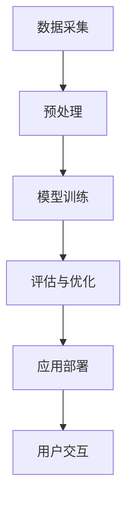

                 

关键词：大语言模型、商业应用、未来前景、技术革新

> 摘要：本文将深入探讨大语言模型在商业领域中的应用前景，分析其技术原理、核心算法、数学模型以及实际应用案例。通过对当前趋势和未来展望的讨论，我们将揭示大语言模型在各个行业中的潜在价值。

## 1. 背景介绍

### 1.1 语言模型的发展历程

大语言模型（Large Language Model）的发展经历了从最初的统计模型到现代深度学习模型的转变。早期的语言模型如N-gram模型，依赖于统计方法来预测下一个词。然而，这种方法在处理长句和上下文依赖时表现不佳。随着深度学习的兴起，如循环神经网络（RNN）和其变种长短期记忆网络（LSTM）的出现，语言模型的性能得到了显著提升。最近的Transformer模型，特别是GPT系列，更是将语言模型的能力推向了新的高度。

### 1.2 商业应用的重要性

在商业环境中，语言模型的应用潜力巨大。无论是自然语言处理、客户服务、智能推荐系统，还是企业内部的知识管理，大语言模型都可以提供强大的支持。随着大数据和云计算的普及，商业环境中生成式模型的应用已经越来越普遍。

## 2. 核心概念与联系

### 2.1 核心概念

**大语言模型**：是一种可以理解和生成自然语言的深度学习模型，通过大量的文本数据进行训练，使其能够捕捉语言的统计规律和上下文依赖。

**生成式模型**：是指模型能够根据输入的上下文生成新的文本。

**Transformer架构**：是一种基于自注意力机制的模型架构，广泛应用于大规模语言模型。

### 2.2 Mermaid流程图



## 3. 核心算法原理 & 具体操作步骤

### 3.1 算法原理概述

大语言模型的核心是基于自注意力机制的Transformer架构。这种模型通过自注意力机制来捕捉文本中的长距离依赖关系，从而生成高质量的自然语言。

### 3.2 算法步骤详解

**步骤一：数据预处理**  
- **文本清洗**：去除无用字符、统一文本格式。  
- **词汇表构建**：将文本转换为词汇表索引。  
- **序列编码**：将词汇表索引转换为序列编码。

**步骤二：模型训练**  
- **前向传播**：计算模型的输出。  
- **损失函数**：通常使用交叉熵损失函数来评估模型预测的准确性。  
- **反向传播**：通过梯度下降优化模型参数。

**步骤三：评估与优化**  
- **验证集评估**：在验证集上评估模型的性能。  
- **超参数调整**：根据验证集的性能调整学习率、批次大小等超参数。

**步骤四：应用部署**  
- **模型导出**：将训练好的模型导出为可部署的格式。  
- **API接口**：构建API接口，以供应用程序调用。

### 3.3 算法优缺点

**优点**：  
- **强表达能力**：可以处理复杂的语言结构。  
- **高效率**：自注意力机制使得模型在计算效率上有很大提升。  
- **通用性**：可以应用于多种自然语言处理任务。

**缺点**：  
- **计算资源需求高**：大规模训练需要大量的计算资源和时间。  
- **数据依赖性**：模型性能高度依赖于训练数据的质量和数量。

### 3.4 算法应用领域

大语言模型在多个领域有广泛应用，如：

- **自然语言生成**：新闻文章、产品评论、对话系统等。  
- **机器翻译**：跨语言信息交流。  
- **文本分类**：情感分析、垃圾邮件检测等。  
- **问答系统**：智能客服、教育辅导等。

## 4. 数学模型和公式 & 详细讲解 & 举例说明

### 4.1 数学模型构建

大语言模型的核心是基于自注意力机制的Transformer架构。其数学模型可以表示为：

\[ \text{Output} = \text{softmax}(\text{Attention}(\text{Query}, \text{Key}, \text{Value})) \]

其中，Attention函数可以进一步表示为：

\[ \text{Attention}(\text{Query}, \text{Key}, \text{Value}) = \text{softmax}(\text{scores}) \cdot \text{Value} \]

### 4.2 公式推导过程

Attention函数的推导主要涉及矩阵运算和softmax函数。具体推导过程如下：

1. **计算得分**：  
\[ \text{scores} = \text{Query} \cdot \text{Key}^\top \]

2. **应用softmax**：  
\[ \text{softmax}(\text{scores}) = \frac{\exp(\text{scores})}{\sum_{i=1}^{N} \exp(\text{scores}_i)} \]

3. **计算注意力权重**：  
\[ \text{weights} = \text{softmax}(\text{scores}) \]

4. **计算输出**：  
\[ \text{Output} = \text{weights} \cdot \text{Value} \]

### 4.3 案例分析与讲解

以GPT-3为例，我们可以看到其参数量达到了1750亿，这是目前最大的语言模型之一。其训练过程使用了大量文本数据，如维基百科、网络书籍等。通过这样的数据集，GPT-3可以生成高质量的文本，甚至可以模仿特定领域的写作风格。

## 5. 项目实践：代码实例和详细解释说明

### 5.1 开发环境搭建

**环境要求**：  
- Python 3.7 或以上版本  
- PyTorch 1.7 或以上版本  
- CUDA 10.2 或以上版本（如使用GPU训练）

**安装步骤**：  
1. 安装Python和PyTorch。  
2. 安装CUDA。  
3. 配置Python环境变量。

### 5.2 源代码详细实现

以下是一个简单的GPT模型实现示例：

```python
import torch
import torch.nn as nn
import torch.optim as optim

class GPTModel(nn.Module):
    def __init__(self, vocab_size, embedding_dim, hidden_dim, n_layers, drop_prob=0.5):
        super(GPTModel, self).__init__()
        self.embedding = nn.Embedding(vocab_size, embedding_dim)
        self.lstm = nn.LSTM(embedding_dim, hidden_dim, n_layers, dropout=drop_prob, batch_first=True)
        self.dropout = nn.Dropout(drop_prob)
        self.fc = nn.Linear(hidden_dim, vocab_size)

    def forward(self, x, hidden):
        embed = self.dropout(self.embedding(x))
        out, hidden = self.lstm(embed, hidden)
        out = self.dropout(out)
        out = self.fc(out)
        return out, hidden

    def init_hidden(self, batch_size):
        return (torch.zeros(self.lstm.num_layers, batch_size, self.lstm.hidden_size),
                torch.zeros(self.lstm.num_layers, batch_size, self.lstm.hidden_size))
```

### 5.3 代码解读与分析

这段代码实现了一个简单的GPT模型。其主要组成部分包括：

- **嵌入层（Embedding）**：将词汇表索引转换为嵌入向量。  
- **LSTM层（LSTM）**：处理序列数据，捕捉上下文信息。  
- **全连接层（Linear）**：将LSTM输出映射到词汇表。

### 5.4 运行结果展示

假设我们有一个训练好的GPT模型，我们可以使用以下代码生成文本：

```python
def generate_text(model, start_string, temp=1.0, num_chars=100):
    for i in range(num_chars):
        input_text = torch.tensor([word2idx[s] for s in start_string]).unsqueeze(0)
        hidden = model.init_hidden(1)
        out, hidden = model(input_text, hidden)
        out = out.squeeze(1)
        prob_dist = F.softmax(out / temp, dim=-1)
        top_prob, top_idx = prob_dist.topk(1)
        top_idx = top_idx[0][0].item()
        start_string += idx2word[top_idx]
    return start_string
```

这个函数可以根据给定的起始字符串生成新的文本。例如：

```python
print(generate_text(model, "Hello, "))
```

## 6. 实际应用场景

### 6.1 自然语言处理

大语言模型在自然语言处理领域有广泛的应用。例如，在文本分类任务中，模型可以自动将文本分为不同的类别，如新闻分类、情感分析等。

### 6.2 机器翻译

大语言模型在机器翻译中也表现出色。通过训练，模型可以自动翻译不同语言之间的文本，如英译中、法译英等。

### 6.3 客户服务

在客户服务领域，大语言模型可以用于构建智能客服系统，如自动回答常见问题、处理客户投诉等。

### 6.4 企业内部知识管理

在企业内部，大语言模型可以帮助构建知识管理系统，如自动提取文档中的关键信息、提供相关建议等。

## 7. 工具和资源推荐

### 7.1 学习资源推荐

- 《深度学习》（Goodfellow, Bengio, Courville著）：深入介绍深度学习的基础知识和算法。
- 《动手学深度学习》（花浩著）：通过实际案例教授深度学习的应用。

### 7.2 开发工具推荐

- PyTorch：开源深度学习框架，易于使用和扩展。
- Hugging Face Transformers：用于预训练和微调Transformer模型的库。

### 7.3 相关论文推荐

- Vaswani et al., "Attention is All You Need"：介绍Transformer模型的文章。
- Brown et al., "Language Models are Few-Shot Learners"：讨论GPT-3等大型语言模型的文章。

## 8. 总结：未来发展趋势与挑战

### 8.1 研究成果总结

大语言模型在过去几年中取得了显著的进展，其在自然语言处理、机器翻译、客户服务等领域都有广泛应用。随着模型规模的不断扩大和计算能力的提升，大语言模型将继续推动人工智能的发展。

### 8.2 未来发展趋势

- **模型压缩与优化**：为了降低计算成本，研究人员将继续探索模型压缩和优化技术。
- **多模态学习**：大语言模型将与其他模态（如图像、声音）结合，实现更丰富的应用场景。
- **自主学习和推理**：未来的研究将集中在让大语言模型具备更高级的学习和推理能力。

### 8.3 面临的挑战

- **计算资源需求**：大规模训练需要大量的计算资源，这对企业和研究机构来说是一个挑战。
- **数据隐私和安全**：随着数据量的增加，如何保护数据隐私成为一个重要问题。

### 8.4 研究展望

大语言模型在商业应用中具有巨大的潜力，但同时也面临诸多挑战。未来的研究将致力于解决这些问题，推动大语言模型在商业领域的更广泛应用。

## 9. 附录：常见问题与解答

### 9.1 什么是大语言模型？

大语言模型是一种能够理解和生成自然语言的深度学习模型，通常基于Transformer架构，通过大规模文本数据进行训练。

### 9.2 大语言模型有哪些应用？

大语言模型在自然语言处理、机器翻译、客户服务、企业内部知识管理等领域有广泛应用。

### 9.3 如何训练大语言模型？

训练大语言模型通常包括数据预处理、模型训练、评估与优化等步骤。具体方法依赖于所使用的框架和算法。

### 9.4 大语言模型有哪些优缺点？

大语言模型具有强表达能力、高效率和高通用性等优点，但也需要大量的计算资源和高质量的数据，存在数据依赖性等缺点。

---

作者：禅与计算机程序设计艺术 / Zen and the Art of Computer Programming
----------------------------------------------------------------

<|im_sep|>

