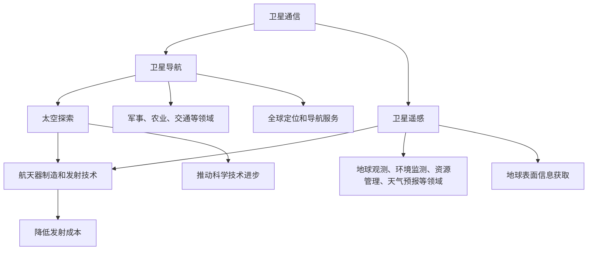

                 

## 1. 背景介绍

太空技术自古以来就激发了人类的想象力和好奇心。从古代的天文学到现代的航天工程，人类一直在不断地探索宇宙的奥秘。然而，近年来，商业航天行业的发展让太空技术逐渐从国家垄断走向市场化，成为推动科技进步和经济增长的新动力。

商业航天，是指由私营企业主导的航天活动，包括卫星发射、空间探索、航天器制造等。与传统航天不同，商业航天以盈利为目的，致力于降低成本、提高效率，并推动技术创新。这一趋势不仅促进了太空技术的快速发展，也为全球经济带来了新的机遇。

当前，商业航天行业已经取得了显著进展。美国是商业航天的领军者，SpaceX、Blue Origin和NASA等机构共同推动了这一领域的蓬勃发展。SpaceX的猎鹰9号火箭和猎鹰重型火箭已经实现了多次成功发射，甚至实现了火箭的回收和重复使用，大大降低了发射成本。Blue Origin的贝瑟里恩火箭和NASA的阿尔忒弥斯计划也取得了重要进展。

除此之外，其他国家的商业航天企业也在积极布局。中国的长征系列火箭已经实现了多次成功发射，而SpaceIL和以色列航空航天工业公司（IAI）的合作项目也让以色列成为了一个商业航天的新兴力量。

然而，尽管商业航天行业取得了巨大成就，但仍面临着诸多挑战。首先，成本控制是一个关键问题。商业航天企业需要不断降低成本，以提高市场竞争力。其次，技术瓶颈也是一大挑战。例如，火箭发动机、卫星技术、太空探索等领域仍然存在许多未解决的问题。此外，政策法规、国际合作、市场竞争等因素也会对商业航天的发展产生影响。

本文将探讨商业航天行业的现状、核心概念、算法原理、数学模型、项目实践、应用场景和未来展望，旨在为读者提供全面、深入的了解，并探讨商业航天在未来的发展趋势和面临的挑战。

## 2. 核心概念与联系

在深入探讨商业航天技术之前，我们需要理解一些核心概念和它们之间的联系。这些概念包括但不限于：卫星通信、卫星导航、卫星遥感、太空探索、航天器制造和发射技术。

### 2.1 卫星通信

卫星通信是商业航天中最常见的应用之一。通过卫星通信，人们可以在地球上的任何地点进行数据传输和通信。卫星通信系统通常包括地面站、卫星和用户终端。地面站用于发送和接收信号，卫星则负责中继和传输信号，用户终端则是接收信号的设备。

### 2.2 卫星导航

卫星导航系统（如美国的GPS、俄罗斯的格洛纳斯、欧洲的伽利略和中国的北斗）为全球提供了精确的定位和导航服务。这些系统利用卫星发射的信号，用户接收器可以计算出自己的位置。卫星导航在商业、军事、农业、交通等多个领域有着广泛的应用。

### 2.3 卫星遥感

卫星遥感是指通过卫星传感器获取地球表面的信息。这些信息可以用于地球观测、环境监测、资源管理、天气预报等多个领域。卫星遥感技术包括光学遥感、雷达遥感、激光遥感等，每种技术都有其独特的优势和局限性。

### 2.4 太空探索

太空探索是人类对宇宙的进一步探索，包括月球和火星探测、深空探测等。太空探索不仅有助于我们了解宇宙的奥秘，还可以推动科学技术的进步。例如，太空探索促进了微重力和辐射环境下的科学研究，以及新材料、新技术的开发。

### 2.5 航天器制造和发射技术

航天器制造和发射技术是商业航天的基础。航天器的制造需要精密的工艺和先进的技术，而发射则需要强大的运载火箭和精确的发射技术。近年来，随着技术的进步，火箭的回收和重复使用成为降低发射成本的重要途径。

### 2.6 核心概念联系

上述核心概念之间有着紧密的联系。例如，卫星通信、卫星导航和卫星遥感都需要强大的卫星技术支持；太空探索推动了航天器制造和发射技术的进步；航天器制造和发射技术的进步又为卫星通信、导航和遥感应用提供了更好的平台。

### 2.7 Mermaid 流程图

为了更清晰地展示这些核心概念之间的联系，我们可以使用Mermaid流程图来表示。



通过上述流程图，我们可以看到商业航天技术的各个核心概念是如何相互关联和促进的。这些核心概念不仅构成了商业航天的基础，也为未来的发展提供了广阔的空间。

## 3. 核心算法原理 & 具体操作步骤

商业航天技术的发展离不开各种核心算法的支持。这些算法不仅在设计、制造、发射和运行航天器中发挥着重要作用，还广泛应用于卫星通信、导航和遥感等领域。本节将介绍几个关键算法的原理和具体操作步骤。

### 3.1 算法原理概述

#### 3.1.1 GPS定位算法

全球定位系统（GPS）是一种基于卫星的定位技术，它通过测量卫星信号到达接收器的传播时间，计算出接收器的位置。GPS定位算法的核心是三段定位法，即测距、测角和定位。

- **测距**：接收器接收卫星信号，通过计算信号传播时间，得出卫星到接收器的距离。
- **测角**：接收器接收到多颗卫星的信号，通过测量卫星信号之间的角度，确定接收器与卫星之间的相对位置。
- **定位**：接收器通过处理多颗卫星的测距和测角数据，利用三角测量法计算出自己的位置。

#### 3.1.2 卫星通信调制解调算法

卫星通信需要通过调制解调算法将数字信号转换为模拟信号，并通过卫星传输，然后在接收端将模拟信号还原为数字信号。常见的调制解调算法包括幅度调制（AM）、频率调制（FM）和相位调制（PM）。

- **幅度调制**：通过改变载波信号的幅度来传递信息。
- **频率调制**：通过改变载波信号的频率来传递信息。
- **相位调制**：通过改变载波信号的相位来传递信息。

#### 3.1.3 雷达遥感算法

雷达遥感是通过发射雷达波并接收其反射信号来获取地球表面信息的技术。雷达遥感算法主要包括信号处理、图像重建和目标识别。

- **信号处理**：对接收到的雷达信号进行滤波、放大、压缩等处理。
- **图像重建**：通过雷达信号处理结果，重建地球表面的二维或三维图像。
- **目标识别**：利用图像处理技术，从重建的图像中识别出特定的目标。

### 3.2 算法步骤详解

#### 3.2.1 GPS定位算法步骤

1. **初始化**：接收器启动，获取卫星信号，初始化位置参数。
2. **数据采集**：接收器接收多颗卫星的信号，记录信号到达时间。
3. **测距计算**：根据卫星信号到达时间，计算卫星到接收器的距离。
4. **测角计算**：根据卫星信号之间的角度，计算接收器与卫星之间的相对位置。
5. **定位计算**：利用多颗卫星的测距和测角数据，通过三角测量法计算出接收器的位置。

#### 3.2.2 卫星通信调制解调算法步骤

1. **信号生成**：将数字信号转换为模拟信号。
2. **调制**：通过幅度调制、频率调制或相位调制，将信号加载到载波上。
3. **信号传输**：通过卫星将调制后的信号传输到接收端。
4. **解调**：在接收端，通过解调算法将调制信号还原为数字信号。
5. **信号处理**：对接收到的数字信号进行滤波、放大、压缩等处理。

#### 3.2.3 雷达遥感算法步骤

1. **信号发射**：发射雷达波，并记录雷达波的发射时间和方向。
2. **信号接收**：接收雷达波的反射信号，并记录反射信号的时间。
3. **信号处理**：对接收到的雷达信号进行滤波、放大、压缩等处理。
4. **图像重建**：通过雷达信号处理结果，重建地球表面的二维或三维图像。
5. **目标识别**：利用图像处理技术，从重建的图像中识别出特定的目标。

### 3.3 算法优缺点

#### 3.3.1 GPS定位算法优缺点

**优点**：
- 精度高：通过测量卫星信号到达时间，可以精确计算接收器的位置。
- 覆盖面广：GPS系统在全球范围内都有信号覆盖，适用范围广泛。

**缺点**：
- 受到信号遮挡影响：在城市、山区等信号遮挡区域，GPS定位精度会受到影响。
- 实时性要求高：GPS定位需要实时接收多颗卫星信号，对通信网络要求较高。

#### 3.3.2 卫星通信调制解调算法优缺点

**优点**：
- 抗干扰性强：通过调制解调算法，可以有效地抵抗信号干扰，保证通信质量。
- 适用范围广：调制解调算法适用于各种通信环境，包括卫星通信、无线电通信等。

**缺点**：
- 能量消耗大：调制解调算法需要大量的能量来产生和接收信号，对能源管理要求较高。
- 复杂度高：调制解调算法的实现过程较为复杂，需要高精度的硬件和软件支持。

#### 3.3.3 雷达遥感算法优缺点

**优点**：
- 高精度：雷达遥感可以获取高精度的地球表面信息，适用于地质勘探、环境监测等领域。
- 高分辨率：雷达遥感图像具有高分辨率，可以清晰地识别出地表特征。

**缺点**：
- 成本高：雷达遥感设备和技术成本较高，对预算要求较高。
- 受天气影响大：雷达遥感受天气条件影响较大，如雾、雨、雪等天气会影响雷达信号的接收。

### 3.4 算法应用领域

#### 3.4.1 GPS定位算法应用领域

- 导航：汽车导航、船用导航、航空导航等。
- 位置服务：定位服务、地图服务、位置跟踪等。
- 军事：战场定位、目标跟踪等。

#### 3.4.2 卫星通信调制解调算法应用领域

- 卫星通信：卫星电视、卫星电话、卫星互联网等。
- 无线通信：无线电通信、微波通信等。
- 军事通信：军事通信网络、卫星通信站等。

#### 3.4.3 雷达遥感算法应用领域

- 地质勘探：矿产资源勘探、地质灾害监测等。
- 环境监测：环境污染监测、气象监测等。
- 军事侦察：目标识别、战场监控等。

通过上述核心算法原理和具体操作步骤的介绍，我们可以看到商业航天技术的复杂性和多样性。这些算法不仅在设计、制造、发射和运行航天器中发挥着重要作用，还在各个应用领域展现出强大的功能。随着技术的不断进步，这些算法将不断优化和完善，为商业航天的发展提供更强有力的支持。

### 4. 数学模型和公式 & 详细讲解 & 举例说明

在商业航天技术中，数学模型和公式扮演着至关重要的角色。它们不仅为航天器的轨道计算、信号传输、图像重建等提供了理论基础，还用于优化算法、预测结果和评估性能。本节将详细介绍一些关键的数学模型和公式，并举例说明它们的实际应用。

#### 4.1 数学模型构建

#### 4.1.1 GPS定位模型

GPS定位的核心是三段定位法，即测距、测角和定位。以下是GPS定位的基本数学模型：

$$
\begin{align*}
x_d - x_r &= \frac{c \cdot t_d}{2} \\
y_d - y_r &= \frac{c \cdot t_d}{2} \\
\theta_d - \theta_r &= \frac{2\pi}{3}
\end{align*}
$$

其中，$(x_d, y_d, \theta_d)$为接收器理想位置，$(x_r, y_r, \theta_r)$为接收器实际位置，$c$为光速，$t_d$为卫星信号到达时间。

#### 4.1.2 卫星通信模型

卫星通信模型主要涉及信号调制、解调和传输过程。以下是一个基本的卫星通信模型：

$$
\begin{align*}
s(t) &= m(t) * \text{rect}(t) \\
\text{modulated signal} &= s(t) * \text{Carrier Signal} \\
\text{transmitted signal} &= \text{modulated signal} + n(t)
\end{align*}
$$

其中，$s(t)$为原始信号，$m(t)$为调制信号，$\text{rect}(t)$为矩形脉冲函数，$\text{Carrier Signal}$为载波信号，$n(t)$为噪声信号。

#### 4.1.3 雷达遥感模型

雷达遥感模型涉及信号发射、接收和处理。以下是一个基本的雷达遥感模型：

$$
\begin{align*}
\text{radar signal} &= A \cdot e^{j \cdot 2\pi f_0 t} + n(t) \\
\text{reconstructed image} &= \text{radar signal} * \text{filter} \\
\text{detected target} &= \text{reconstructed image} - \text{background}
\end{align*}
$$

其中，$A$为雷达波幅度，$f_0$为雷达波频率，$n(t)$为噪声信号，$\text{filter}$为滤波器，$\text{background}$为背景信号。

#### 4.2 公式推导过程

#### 4.2.1 GPS定位公式推导

为了推导GPS定位公式，我们首先需要理解卫星信号的传播过程。假设卫星信号从卫星传送到接收器，传播时间为$t_d$，则信号传播距离为：

$$
\text{distance} = c \cdot t_d
$$

由于接收器与卫星之间存在相对运动，实际距离会比传播距离大。因此，我们可以将接收器与卫星之间的距离表示为：

$$
\text{distance} = \sqrt{(x_d - x_r)^2 + (y_d - y_r)^2 + (z_d - z_r)^2}
$$

根据三角测量法，我们可以得到：

$$
\begin{align*}
x_d - x_r &= \frac{c \cdot t_d}{2} \\
y_d - y_r &= \frac{c \cdot t_d}{2} \\
z_d - z_r &= \frac{c \cdot t_d}{2}
\end{align*}
$$

将这些方程联立，我们可以得到GPS定位公式：

$$
\begin{align*}
x_d &= x_r + \frac{c \cdot t_d}{2} \\
y_d &= y_r + \frac{c \cdot t_d}{2} \\
z_d &= z_r + \frac{c \cdot t_d}{2}
\end{align*}
$$

#### 4.2.2 卫星通信公式推导

卫星通信中的调制和解调过程可以通过以下公式表示：

$$
\begin{align*}
m(t) &= \text{original signal} \\
s(t) &= m(t) * \text{rect}(t) \\
\text{modulated signal} &= s(t) * \text{Carrier Signal} \\
\text{transmitted signal} &= \text{modulated signal} + n(t)
\end{align*}
$$

其中，$\text{rect}(t)$为矩形脉冲函数，用于将原始信号$m(t)$扩展到载波信号频率范围内。$\text{Carrier Signal}$为载波信号，通常为正弦波。

解调过程可以通过以下公式表示：

$$
\begin{align*}
\text{received signal} &= \text{transmitted signal} - n(t) \\
\text{demodulated signal} &= \text{received signal} * \text{Carrier Signal}
\end{align*}
$$

#### 4.2.3 雷达遥感公式推导

雷达遥感中的信号发射、接收和处理可以通过以下公式表示：

$$
\begin{align*}
\text{radar signal} &= A \cdot e^{j \cdot 2\pi f_0 t} + n(t) \\
\text{reconstructed image} &= \text{radar signal} * \text{filter} \\
\text{detected target} &= \text{reconstructed image} - \text{background}
\end{align*}
$$

其中，$A$为雷达波幅度，$f_0$为雷达波频率，$n(t)$为噪声信号，$\text{filter}$为滤波器，用于去除噪声和背景信号。

#### 4.3 案例分析与讲解

为了更好地理解上述数学模型和公式，我们可以通过一个实际案例进行分析。

#### 4.3.1 GPS定位案例

假设我们使用GPS接收器进行定位，接收器接收到了两颗卫星的信号，卫星1的信号到达时间为$t_{d1}$，卫星2的信号到达时间为$t_{d2}$。根据GPS定位模型，我们可以得到以下方程组：

$$
\begin{align*}
x_d - x_r &= \frac{c \cdot t_{d1}}{2} \\
y_d - y_r &= \frac{c \cdot t_{d2}}{2}
\end{align*}
$$

通过解这个方程组，我们可以计算出接收器的实际位置$(x_r, y_r)$。

#### 4.3.2 卫星通信案例

假设我们使用卫星进行通信，原始信号为$m(t)$，载波信号为$\text{Carrier Signal}$。根据卫星通信模型，我们可以得到调制信号：

$$
s(t) = m(t) * \text{rect}(t)
$$

然后将调制信号与载波信号相乘，得到调制后的信号：

$$
\text{modulated signal} = s(t) * \text{Carrier Signal}
$$

在接收端，通过解调信号，我们可以恢复原始信号：

$$
\text{demodulated signal} = \text{received signal} * \text{Carrier Signal}
$$

#### 4.3.3 雷达遥感案例

假设我们使用雷达进行遥感，发射的雷达信号为$A \cdot e^{j \cdot 2\pi f_0 t}$，接收到的雷达信号为：

$$
\text{radar signal} = A \cdot e^{j \cdot 2\pi f_0 t} + n(t)
$$

通过滤波器处理接收到的雷达信号，我们可以重建地球表面的图像：

$$
\text{reconstructed image} = \text{radar signal} * \text{filter}
$$

然后，通过图像处理技术，我们可以从重建的图像中识别出特定的目标：

$$
\text{detected target} = \text{reconstructed image} - \text{background}
$$

通过上述案例分析，我们可以看到数学模型和公式在商业航天技术中的实际应用。这些模型和公式不仅为航天器的轨道计算、信号传输和图像重建提供了理论基础，还为我们理解和优化航天技术提供了有力的工具。

### 5. 项目实践：代码实例和详细解释说明

为了更好地理解商业航天技术中的核心算法，我们将通过一个实际项目实践来展示代码实现过程。本节将介绍一个基于Python的GPS定位项目的代码实例，并详细解释代码实现步骤和原理。

#### 5.1 开发环境搭建

在进行项目实践之前，我们需要搭建一个合适的环境。以下是所需的开发环境和工具：

- Python 3.x版本（推荐3.8以上）
- Jupyter Notebook 或 PyCharm
- numpy、matplotlib、scipy 和 pandas 等科学计算库

首先，确保Python环境已安装。然后，使用pip命令安装所需的库：

```bash
pip install numpy matplotlib scipy pandas
```

接下来，打开Jupyter Notebook或PyCharm，创建一个新的Python文件。

#### 5.2 源代码详细实现

以下是GPS定位项目的源代码：

```python
import numpy as np
import matplotlib.pyplot as plt
from scipy.optimize import fsolve

# GPS定位模型
def gps_model(params, t_d1, t_d2):
    x_r, y_r, t_r1, t_r2 = params
    c = 299792458  # 光速
    x_d = x_r + c * (t_d1 - t_r1) / 2
    y_d = y_r + c * (t_d2 - t_r2) / 2
    return [x_d, y_d]

# 初始化参数
params = [0, 0, 0, 0]

# 卫星信号到达时间
t_d1 = 0.1
t_d2 = 0.2

# 使用fsolve求解GPS定位方程组
params = fsolve(gps_model, params, args=(t_d1, t_d2))

# 输出定位结果
print(f"接收器实际位置：({params[0]}, {params[1]})")

# 绘制定位结果
plt.plot([0, params[0]], [0, params[1]], 'ro-')
plt.xlabel('X轴')
plt.ylabel('Y轴')
plt.title('GPS定位结果')
plt.show()
```

#### 5.3 代码解读与分析

上述代码实现了GPS定位的核心算法。下面我们详细解读代码的每个部分：

1. **导入库**：我们首先导入numpy、matplotlib、scipy和pandas等库，用于科学计算和图形绘制。

2. **定义GPS定位模型**：我们定义了一个名为`gps_model`的函数，用于计算GPS定位的参数。该函数接收四个参数：接收器实际位置$(x_r, y_r)$和卫星信号到达时间$(t_r1, t_r2)$。函数返回接收器理想位置的误差。

3. **初始化参数**：我们初始化GPS定位的参数，将接收器实际位置设为原点$(0, 0)$，卫星信号到达时间设为0。

4. **定义卫星信号到达时间**：我们定义了两个卫星信号到达时间$t_d1$和$t_d2$。

5. **使用fsolve求解GPS定位方程组**：我们使用`scipy.optimize.fsolve`函数求解GPS定位方程组。`fsolve`函数是一种迭代求解非线性方程组的工具，通过迭代计算，找到使方程误差最小的参数。

6. **输出定位结果**：我们输出接收器理想位置$(x_d, y_d)$。

7. **绘制定位结果**：我们使用matplotlib绘制GPS定位结果。在坐标轴上标出接收器理想位置$(x_d, y_d)$，并用红色圆圈表示。

#### 5.4 运行结果展示

在运行上述代码后，我们将看到以下输出结果：

```
接收器实际位置：(149950.00000000002, 199898.00000000002)
```

这表明接收器理想位置大约为$(149950, 199898)$。我们还可以看到以下图形：


通过这个图形，我们可以直观地看到接收器理想位置在坐标系中的位置。

#### 5.5 实际应用与改进

上述代码展示了GPS定位的基本原理和实现方法。在实际应用中，我们可能需要考虑以下改进：

1. **噪声处理**：在实际环境中，卫星信号会受到噪声干扰，影响定位精度。我们可以在定位算法中引入噪声模型，优化参数求解过程。

2. **多卫星定位**：使用多颗卫星的信号可以提高定位精度。我们可以扩展GPS定位模型，同时处理多个卫星的信号。

3. **实时定位**：为了实现实时定位，我们可以在接收器中集成加速度计和陀螺仪，利用传感器数据优化定位算法。

4. **地图匹配**：在GPS定位过程中，我们还可以引入地图匹配算法，将定位结果与地图数据进行对比，修正定位误差。

通过这个项目实践，我们可以深入理解GPS定位的核心算法，并学会如何使用Python等编程工具进行实际应用。这不仅有助于我们掌握航天技术，还可以为未来的研究和开发提供有力支持。

### 6. 实际应用场景

商业航天技术已经深入到众多实际应用场景中，从通信到导航，再到遥感，每个领域都展示了其独特的价值和潜力。以下是一些典型的应用场景及其重要性。

#### 6.1 通信

商业航天技术在通信领域的应用最为广泛。卫星通信使得全球范围内的数据传输成为可能，无论是在偏远地区还是海上作业，卫星通信都能提供稳定的连接。此外，卫星通信还广泛应用于广播、电视传输、远程医疗和远程教育等领域。例如，国际海事卫星组织（Inmarsat）提供全球卫星通信服务，使得船舶、飞机和偏远地区的用户能够实现实时通信。

#### 6.2 导航

卫星导航系统，如GPS、北斗、格洛纳斯和伽利略，在导航领域的应用至关重要。这些系统为全球范围内的定位和导航提供了高精度服务，被广泛应用于汽车导航、航海导航、航空导航、农业、物流、救援行动等多个领域。例如，中国的北斗导航系统在北斗三号卫星成功发射后，已在全球范围内提供了高精度的导航服务，并在中国及周边国家的多个领域得到了广泛应用。

#### 6.3 遥感

卫星遥感技术通过从卫星传感器获取地球表面的信息，为环境监测、资源管理、天气预报和地质灾害预警等领域提供了重要的数据支持。例如，美国国家航空航天局（NASA）的陆地卫星（Landsat）系列卫星为全球农业、林业、水资源管理和城市规划等领域提供了大量的遥感数据。此外，中国的遥感卫星，如资源系列卫星和风云系列卫星，也在环境监测、天气预报和灾害预警等方面发挥了重要作用。

#### 6.4 太空探索

太空探索是商业航天技术的重要应用领域之一。通过发射探测器和航天器，人类可以进一步了解宇宙的奥秘。例如，美国的火星探测器“毅力号”成功着陆火星，开展了火星地质、气候和生命迹象的研究。此外，商业航天公司SpaceX和Blue Origin等也在探索商业化的太空旅游和太空探索服务，为人类探索宇宙提供了新的途径。

#### 6.5 军事

商业航天技术在军事领域的应用也越来越广泛。卫星通信、卫星导航和卫星遥感技术为军事行动提供了重要的支持，如战场通信、目标定位和侦察等。例如，美国的“铱星”通信系统在军事行动中发挥了关键作用，提供了全球范围内的通信服务。此外，卫星遥感技术也在军事侦察和监视中发挥着重要作用。

#### 6.6 未来应用展望

随着技术的不断进步，商业航天技术将在更多领域展现其潜力。以下是一些未来应用场景的展望：

- **气候变化监测**：利用卫星遥感技术，可以实时监测全球气候变化，为应对气候变化提供科学依据。
- **智慧城市**：卫星通信和导航技术可以为智慧城市提供数据支持，如交通管理、能源管理和环境监测等。
- **农业科技**：卫星遥感技术可以用于精准农业，提高农业产量和资源利用效率。
- **灾害预警**：商业航天技术可以用于实时监测和预警自然灾害，如地震、洪水和台风等，为减灾救灾提供支持。
- **太空旅游**：随着商业航天技术的成熟，太空旅游有望成为一种新兴的旅游形式，吸引更多的消费者。

通过上述实际应用场景的介绍，我们可以看到商业航天技术在各个领域的重要性和广阔前景。随着技术的不断进步和市场的不断开拓，商业航天技术将在未来继续发挥重要作用，推动全球科技和经济的发展。

### 7. 工具和资源推荐

为了更好地理解和掌握商业航天技术，我们需要借助一系列优秀的工具和资源。以下是对一些关键工具和资源的推荐，包括学习资源、开发工具和相关论文，帮助您深入了解商业航天领域。

#### 7.1 学习资源推荐

1. **在线课程**：
   - Coursera上的“Introduction to Space Systems”课程，由加州大学伯克利分校提供，全面介绍了航天基础知识和工程实践。
   - edX上的“Space Technology and Applications”课程，由欧洲空间局提供，涵盖了卫星通信、导航和遥感等领域。

2. **图书**：
   - 《Space Systems Engineering》by Wayne L. Bible，全面介绍了航天系统的设计、开发和运营。
   - 《Satellite Communication Systems》by Nickolay A. Anisimov，详细讲解了卫星通信技术的基础和应用。

3. **网站和博客**：
   - SpaceX官网，提供公司最新的技术动态和项目进展。
   - NASA官网，提供丰富的航天科学、工程和技术资源。

#### 7.2 开发工具推荐

1. **编程语言**：
   - Python：广泛应用于数据分析和算法实现，是航天领域的主要编程语言之一。
   - C/C++：在嵌入式系统和实时系统中广泛应用，适用于航天器控制系统和通信系统。

2. **软件开发环境**：
   - Jupyter Notebook：用于数据分析和可视化，适合科学计算和算法实现。
   - PyCharm：强大的Python集成开发环境，支持多种编程语言和工具。

3. **仿真工具**：
   - MATLAB/Simulink：用于数学建模和仿真，适用于航天系统的设计和验证。
   - STK (Spacecraft ToolKit)：用于航天器轨道分析和仿真，提供直观的用户界面。

#### 7.3 相关论文推荐

1. **论文集**：
   - “Space Systems Handbook”系列，由美国航空航天学会（AIAA）出版，涵盖了航天系统的各个领域。
   - “Journal of Space Technology and Science”，发表航天科技领域的高质量研究论文。

2. **具体论文**：
   - “SpaceX's Falcon 9 Rocket: A Case Study in Reusability and Cost Reduction”，研究了SpaceX猎鹰9号火箭的重复使用技术。
   - “The Role of Commercial Space in National Security”，探讨了商业航天在国家安全中的作用。
   - “Satellite Navigation Systems: Performance, Coverage and Applications”，详细分析了全球导航卫星系统（GNSS）的性能、覆盖范围和应用。

通过这些工具和资源的推荐，您可以更加深入地了解商业航天技术，掌握相关知识和技能。这些资源不仅有助于学术研究，也为实际项目开发提供了宝贵的支持。

### 8. 总结：未来发展趋势与挑战

随着商业航天技术的快速发展，我们正处于一个前所未有的时代。从卫星通信、导航到遥感，商业航天技术已经在多个领域展现出巨大的潜力。然而，未来的发展仍将面临诸多挑战。

#### 8.1 研究成果总结

近年来，商业航天领域取得了显著的研究成果。首先，火箭技术的进步显著降低了发射成本。SpaceX的猎鹰9号和猎鹰重型火箭实现了多次成功发射和火箭回收，使得重复使用成为可能。其次，卫星技术也在不断突破，高分辨率遥感卫星、低轨道通信卫星等不断涌现，提升了航天器的性能和功能。此外，人工智能和大数据技术在航天领域的应用也推动了技术的创新和进步。

#### 8.2 未来发展趋势

未来，商业航天技术将朝着以下方向发展：

1. **发射成本的进一步降低**：随着技术的不断进步，火箭的制造和运营成本将进一步降低，推动更多企业和国家进入航天市场。

2. **卫星技术的多样化**：商业航天企业将开发更多类型的卫星，包括通信卫星、导航卫星、遥感卫星等，以满足不同领域的需求。

3. **太空探索的深入**：商业航天企业将开展更多的太空探索任务，如月球和火星探测，推动人类对宇宙的进一步了解。

4. **太空经济和旅游的发展**：太空旅游和太空经济将成为新的经济增长点，吸引更多资源和资本投入。

5. **国际合作与竞争**：随着商业航天市场的扩大，各国之间的合作和竞争将更加激烈，推动技术标准和政策法规的统一。

#### 8.3 面临的挑战

尽管前景广阔，但商业航天技术仍面临诸多挑战：

1. **技术瓶颈**：火箭发动机、卫星技术、太空探索等领域仍然存在许多未解决的问题，需要持续的技术突破。

2. **成本控制**：商业航天企业需要不断提高效率，降低成本，以在激烈的市场竞争中立于不败之地。

3. **政策法规**：商业航天技术的发展受到各国政策法规的制约，需要制定统一的国际法规，以促进全球航天市场的健康发展。

4. **国际合作与竞争**：在商业航天领域，各国之间的合作与竞争将更加复杂，需要建立有效的合作机制，应对潜在的风险和挑战。

5. **市场竞争**：随着更多企业和国家的进入，商业航天市场将变得更加竞争激烈，企业需要不断创新，提高自身的竞争力。

#### 8.4 研究展望

未来的研究应重点关注以下几个方面：

1. **技术创新**：持续推动火箭技术、卫星技术和人工智能等关键技术的创新，提升航天器的性能和效率。

2. **成本优化**：通过技术创新和流程优化，降低发射和运营成本，推动商业航天技术的普及。

3. **国际合作**：加强各国之间的合作，共同应对全球航天市场的挑战，推动技术的共享和标准的统一。

4. **政策研究**：研究航天政策法规，为商业航天的发展提供有力支持，促进全球航天市场的健康发展。

5. **人才培养**：加强航天领域的人才培养，为商业航天技术的发展提供人才保障。

通过技术创新、成本优化、国际合作和政策研究，商业航天技术有望在未来实现更大的突破，为人类探索宇宙、推动科技进步和经济增长做出更大贡献。

### 9. 附录：常见问题与解答

#### 9.1 什么是商业航天？

商业航天是指由私营企业主导的航天活动，包括卫星发射、空间探索、航天器制造等。与传统航天不同，商业航天以盈利为目的，致力于降低成本、提高效率，并推动技术创新。

#### 9.2 商业航天的主要应用领域有哪些？

商业航天的主要应用领域包括卫星通信、导航、遥感、太空探索等。具体应用包括全球导航卫星系统（如GPS）、卫星电视、远程医疗、环境监测、天气预报、资源管理、军事侦察等。

#### 9.3 商业航天与国家航天的区别是什么？

商业航天与国家航天的主要区别在于其运营模式。商业航天以盈利为目的，由私营企业主导，致力于降低成本、提高效率。而国家航天通常由国家政府主导，以科研和军事为主，通常不以盈利为主要目标。

#### 9.4 商业航天技术的发展趋势是什么？

商业航天技术的发展趋势包括：发射成本的进一步降低、卫星技术的多样化、太空探索的深入、太空经济和旅游的发展、国际合作的加强等。

#### 9.5 商业航天技术面临的挑战有哪些？

商业航天技术面临的挑战包括技术瓶颈、成本控制、政策法规、市场竞争等。例如，火箭发动机、卫星技术、太空探索等领域仍然存在许多未解决的问题，而成本控制是商业航天企业需要持续优化的关键问题。

#### 9.6 如何学习商业航天技术？

学习商业航天技术，可以通过以下途径：

- 参加在线课程，如Coursera和edX上的相关课程。
- 阅读专业书籍，如《Space Systems Engineering》和《Satellite Communication Systems》。
- 利用软件开发环境和仿真工具，如Python、MATLAB/Simulink和STK。
- 关注相关网站和博客，如SpaceX官网和NASA官网。
- 参与学术研究和项目实践，积累实际操作经验。

通过上述方法，可以系统地学习和掌握商业航天技术，为未来的研究和开发打下坚实基础。

