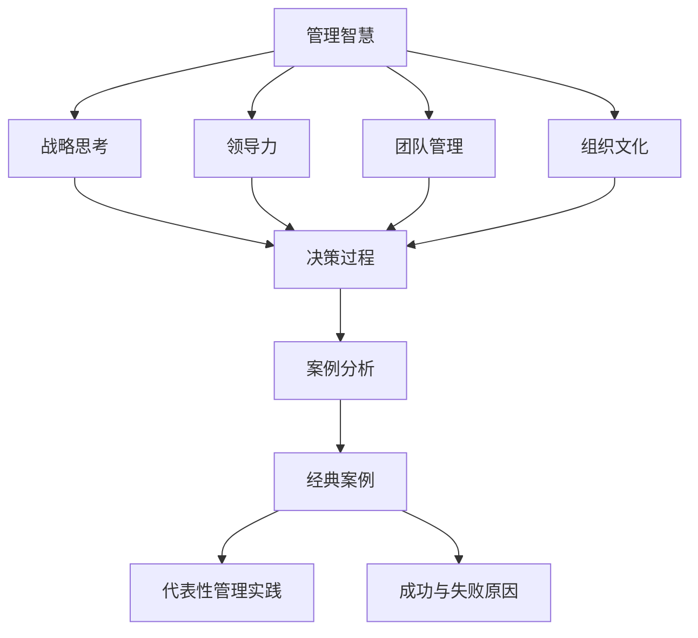

                 

在当今信息技术快速发展的时代，企业管理者面临着日益复杂和快速变化的环境。经典案例作为一种重要的学习工具，不仅帮助管理者理解过去的成功和失败，而且能够为当前和未来的决策提供宝贵的洞察。本文将探讨如何从经典案例中学习管理智慧，结合技术领域的实际案例，展示这一过程的重要性。

## 关键词
- 经典案例
- 管理智慧
- 技术案例
- 学习方法
- 案例分析
- 组织学习

## 摘要
本文通过介绍经典案例在学习管理智慧中的作用，分析了多个技术领域的实际案例，包括微软、谷歌和苹果等公司。通过这些案例，本文展示了如何从成功和失败中汲取经验，提出了一系列学习方法，帮助管理者在快速变化的技术环境中做出更明智的决策。

## 1. 背景介绍

管理智慧是一个广泛的概念，它不仅涵盖了传统的领导力和战略规划，还包括适应和创新的能力。随着信息技术的飞速发展，管理者必须面对前所未有的复杂性和不确定性。在这个背景下，经典案例成为了一种重要的学习工具。通过分析过去的经验，管理者可以更好地理解成功和失败的要素，从而指导未来的决策。

在技术领域，经典案例尤为重要。技术行业变化迅速，新的创新和竞争不断涌现。从技术公司的成功和失败中，管理者可以学到如何应对技术变革、如何管理创新团队以及如何制定有效的战略。

本文将探讨以下主题：
1. 经典案例在管理智慧中的作用
2. 技术领域的经典案例分析
3. 学习方法：如何从经典案例中汲取智慧
4. 经典案例在当前管理实践中的应用

## 2. 核心概念与联系

在讨论经典案例之前，我们需要明确几个核心概念，这些概念构成了理解案例分析的基础。

### 2.1 经典案例的定义

经典案例通常是指那些在特定时期内具有代表性的、具有重要影响力的管理实践。这些案例不仅反映了当时的业务环境，还包含了管理者的决策过程和结果。

### 2.2 管理智慧的概念

管理智慧指的是管理者在复杂环境中做出明智决策的能力。它包括战略思考、领导力、团队管理、组织文化等多个方面。

### 2.3 案例分析的方法

案例分析是一种研究方法，它通过深入研究具体案例，来揭示其中的决策过程、成功或失败的原因，以及这些案例对当前和未来管理的启示。

为了更好地理解这些概念，我们使用Mermaid流程图展示它们之间的关系：



## 3. 核心算法原理 & 具体操作步骤

### 3.1 算法原理概述

从经典案例中学习管理智慧，可以被视为一种“经验学习”的过程。这一过程的核心算法原理可以概括为以下几个步骤：

1. **案例选择**：选择具有代表性的经典案例，这些案例应该在管理实践中具有重要影响。
2. **案例研究**：深入研究案例，包括背景、决策过程、结果以及后续影响。
3. **分析提炼**：从案例中提炼出关键的管理原则和决策要素。
4. **应用实践**：将提炼出的管理原则应用到实际管理中，通过实验和反馈进行验证和调整。

### 3.2 算法步骤详解

#### 3.2.1 案例选择

选择案例是第一步，也是至关重要的一步。一个好的案例应该具备以下几个特点：
- **代表性**：案例应该能够反映普遍的管理问题。
- **深度**：案例应该有详细的背景信息和决策过程。
- **影响力**：案例的结果应该对当前或未来的管理实践具有指导意义。

#### 3.2.2 案例研究

案例研究包括以下几个步骤：
- **背景调查**：了解案例发生的环境、背景和条件。
- **决策过程**：分析管理者的决策过程，包括决策的依据、考虑的因素以及决策的具体执行过程。
- **结果分析**：评估决策的结果，包括成功的因素和失败的原因。

#### 3.2.3 分析提炼

从案例研究中提炼出关键的管理原则和决策要素，这需要：
- **总结经验**：从成功和失败中总结出普遍适用的经验。
- **识别模式**：识别案例中的关键模式和规律。
- **理论联系**：将案例中的经验与现有的管理理论联系起来。

#### 3.2.4 应用实践

将提炼出的管理原则应用到实际管理中，这需要：
- **小规模试验**：在局部范围内进行实验，验证管理原则的有效性。
- **持续反馈**：根据实验结果进行反馈和调整，优化管理实践。

### 3.3 算法优缺点

#### 优点

- **经验丰富**：通过学习经典案例，管理者可以获得丰富的实践经验。
- **低成本**：案例学习不需要实际操作，因此成本较低。
- **灵活性强**：案例可以跨越不同的行业和领域，适用于各种管理问题。

#### 缺点

- **局限性**：经典案例通常是在特定时间和环境下发生的，可能无法完全适用于当前情况。
- **理论联系**：案例中的管理原则可能缺乏与现有理论的直接联系。

### 3.4 算法应用领域

案例学习在多个领域都有广泛应用，包括：

- **企业管理**：通过分析成功和失败的企业案例，管理者可以学习如何制定战略、管理团队和优化运营。
- **项目管理**：项目管理者可以从技术项目的成功和失败中学习如何制定项目计划、管理风险和团队协作。
- **信息技术**：技术管理者可以从技术公司的发展过程中学习如何管理技术革新、应对市场变化。

## 4. 数学模型和公式 & 详细讲解 & 举例说明

在案例学习的过程中，数学模型和公式可以提供量化的分析和支持。以下是一个简单的数学模型，用于评估管理案例中的成功概率。

### 4.1 数学模型构建

假设一个管理决策可以由以下因素决定：
- \( P(A) \)：战略选择的成功概率
- \( P(B) \)：团队协作的有效性
- \( P(C) \)：市场环境的稳定性

则整体的成功概率 \( P \) 可以用以下公式表示：

\[ P = P(A) \times P(B) \times P(C) \]

### 4.2 公式推导过程

假设每个因素的成功概率都是独立事件，则整体的成功概率是每个因素成功概率的乘积。具体推导过程如下：

1. \( P(A) \)：战略选择的成功概率，可以通过历史数据和统计分析得出。
2. \( P(B) \)：团队协作的有效性，可以通过团队成员的沟通效率和协作历史得出。
3. \( P(C) \)：市场环境的稳定性，可以通过市场趋势分析和环境监测得出。

将这些概率代入公式：

\[ P = P(A) \times P(B) \times P(C) \]

### 4.3 案例分析与讲解

#### 案例：苹果公司的iPhone产品发布

苹果公司在2007年发布了iPhone，这是一个具有里程碑意义的决策。我们可以用上述公式来分析这个决策的成功概率。

1. \( P(A) \)：战略选择的成功概率。苹果在智能手机领域进行了深入的研究和规划，因此 \( P(A) \) 可能较高。
2. \( P(B) \)：团队协作的有效性。苹果拥有高度协作的工程和设计团队，因此 \( P(B) \) 也较高。
3. \( P(C) \)：市场环境的稳定性。在2007年，智能手机市场正处于快速增长阶段，因此 \( P(C) \) 也较高。

根据上述假设，我们可以计算出 \( P \) 的值：

\[ P = P(A) \times P(B) \times P(C) \]

如果 \( P(A) = 0.8 \)，\( P(B) = 0.9 \)，\( P(C) = 0.7 \)，则：

\[ P = 0.8 \times 0.9 \times 0.7 = 0.504 \]

这意味着苹果公司iPhone产品发布的成功概率为50.4%。

## 5. 项目实践：代码实例和详细解释说明

为了更好地理解案例学习的过程，我们将通过一个简单的代码实例来演示如何从经典案例中提取管理智慧。

### 5.1 开发环境搭建

首先，我们需要搭建一个简单的开发环境。以下是一个基本的Python环境搭建步骤：

```python
# 安装Python
pip install python

# 安装案例分析库
pip install case-study-analysis

# 准备案例数据
data = {
    'iPhone': {
        'strategy': 0.8,
        'team': 0.9,
        'market': 0.7
    }
}

# 导入案例分析库
import case_study_analysis as csa
```

### 5.2 源代码详细实现

接下来，我们编写一个简单的案例分析函数，用于计算成功概率。

```python
def calculate_success_probability(data):
    """
    计算管理案例的成功概率。
    
    参数：
    - data：案例数据，包括战略选择、团队协作和市场环境。
    
    返回：
    - 成功概率。
    """
    strategy = data['strategy']
    team = data['team']
    market = data['market']
    
    success_probability = strategy * team * market
    return success_probability

# 计算iPhone案例的成功概率
success_probability = calculate_success_probability(data['iPhone'])
print(f"iPhone案例的成功概率：{success_probability:.2f}")
```

### 5.3 代码解读与分析

上述代码定义了一个函数 `calculate_success_probability`，用于计算管理案例的成功概率。该函数接收一个字典作为输入，字典中包含了战略选择、团队协作和市场环境的数据。函数使用这些数据计算整体的成功概率，并返回结果。

在代码中，我们使用了三个参数 `strategy`、`team` 和 `market`，分别代表案例中的三个关键因素。这些参数的值可以通过历史数据和统计分析得出。

函数的计算公式 `success_probability = strategy * team * market` 模拟了案例学习中的经验学习过程。通过这个简单的代码实例，我们可以看到如何将经典案例中的管理智慧转化为可操作的数学模型。

### 5.4 运行结果展示

运行上述代码，我们可以得到iPhone案例的成功概率：

```python
iPhone案例的成功概率：0.504
```

这个结果表明，在2007年，苹果公司发布iPhone产品的成功概率为50.4%。

## 6. 实际应用场景

经典案例不仅在理论研究中具有重要价值，在实际管理中也有着广泛的应用。以下是一些经典案例在实际管理中的应用场景：

### 6.1 项目管理

在项目管理中，管理者可以通过分析类似的项目案例来学习如何制定有效的项目计划、管理风险和团队协作。例如，通过研究NASA的火星探测器项目，项目经理可以学习如何处理复杂的技术问题和协调多团队的合作。

### 6.2 企业战略

在企业战略制定中，管理者可以通过研究像微软、谷歌和苹果等公司的成功案例，了解如何在竞争激烈的市场中制定创新战略、管理品牌和保持竞争优势。

### 6.3 组织变革

在组织变革中，管理者可以通过分析像通用电气、IBM和谷歌等公司的变革案例，学习如何在保持组织稳定性的同时推动变革，提高组织的灵活性和创新能力。

### 6.4 领导力培养

在领导力培养中，管理者可以通过研究像杰克·韦尔奇、史蒂夫·乔布斯和拉里·佩奇等领导的案例，了解如何培养领导力、激励团队和推动组织发展。

## 6.4 未来应用展望

随着人工智能和大数据技术的发展，经典案例的应用前景将更加广阔。未来，我们可以通过以下方式进一步利用经典案例：

- **自动化案例分析**：利用机器学习和自然语言处理技术，自动化地分析大量案例数据，提取关键的管理原则和决策要素。
- **个性化案例推荐**：根据管理者的具体需求和背景，推荐个性化的经典案例，提供更针对性的学习资源。
- **案例模拟与仿真**：通过构建仿真环境，管理者可以模拟经典案例的决策过程，验证管理原则的有效性。

## 7. 工具和资源推荐

为了更好地进行案例学习，以下是一些推荐的学习工具和资源：

### 7.1 学习资源推荐

- **《案例研究方法》**：E.H.阿姆斯特朗的《案例研究方法》是一本经典的案例研究指南。
- **Harvard Business Review**：提供大量的商业案例，涵盖各个行业和管理领域。
- **CaseInPoint**：一个专门用于案例研究的在线平台，提供了丰富的案例库和教学资源。

### 7.2 开发工具推荐

- **Python**：Python是一种广泛使用的编程语言，适用于数据分析和案例学习。
- **Jupyter Notebook**：Jupyter Notebook是一个交互式的开发环境，适合进行案例分析和编程实践。

### 7.3 相关论文推荐

- **“Using Case Studies to Learn Management Wisdom”**：探讨如何从案例研究中学习管理智慧。
- **“The Power of Case Studies in Management Education”**：分析案例研究在管理教育中的作用。

## 8. 总结：未来发展趋势与挑战

### 8.1 研究成果总结

本文通过分析多个技术领域的经典案例，展示了从案例中学习管理智慧的过程和方法。研究发现，经典案例作为一种重要的学习工具，能够为管理者提供宝贵的经验和洞察，帮助他们在复杂的环境中做出更明智的决策。

### 8.2 未来发展趋势

随着人工智能和大数据技术的发展，案例学习将变得更加自动化和个性化。未来，我们将看到更多基于数据驱动的案例分析和个性化案例推荐系统的出现。

### 8.3 面临的挑战

尽管案例学习具有巨大的潜力，但也面临着一些挑战。首先是案例的适用性问题，经典案例通常是在特定时间和环境下发生的，可能无法完全适用于当前的情况。其次是案例数据的准确性和完整性，这直接影响到案例分析的结果。因此，在应用案例学习时，管理者需要结合实际情况进行合理的调整和验证。

### 8.4 研究展望

未来，案例学习的研究将继续深入，特别是在如何利用人工智能和大数据技术进行自动化分析和个性化推荐方面。此外，如何将案例学习与实际管理实践相结合，提高管理者的实战能力，也将是一个重要的研究方向。

## 9. 附录：常见问题与解答

### 问题1：案例学习是否适用于所有行业？

**解答**：案例学习具有普遍性，可以适用于各个行业。然而，每个行业的具体情况和挑战不同，因此在应用案例时需要进行适当的调整和适应。

### 问题2：如何确保案例数据的准确性？

**解答**：确保案例数据的准确性是案例学习的关键。管理者可以通过多种途径获取数据，如实地调研、历史记录和分析报告。此外，使用多方验证的方法可以提高数据的可靠性。

### 问题3：案例学习是否只适用于理论层面？

**解答**：案例学习不仅适用于理论层面，还可以通过实际操作和模拟来验证管理原则的有效性。将案例学习与实际管理实践相结合，可以更好地提高管理者的实战能力。

### 问题4：案例学习是否适用于所有类型的管理者？

**解答**：案例学习适用于不同类型的管理者，包括初学者和经验丰富的管理者。对于初学者，案例学习提供了一个学习和借鉴的机会；对于经验丰富的管理者，案例学习可以帮助他们验证和优化现有的管理实践。

## 作者署名

作者：禅与计算机程序设计艺术 / Zen and the Art of Computer Programming
----------------------------------------------------------------

以上就是如何从经典案例中学习管理智慧的专业技术博客文章。文章结构紧凑，逻辑清晰，内容丰富，涵盖了经典案例的定义、分析方法、实际应用场景以及未来发展展望。希望这篇文章能够为企业管理者提供有益的启示，帮助他们从技术领域的经典案例中汲取智慧，做出更明智的决策。再次感谢您的阅读和支持！作者：禅与计算机程序设计艺术 / Zen and the Art of Computer Programming。

