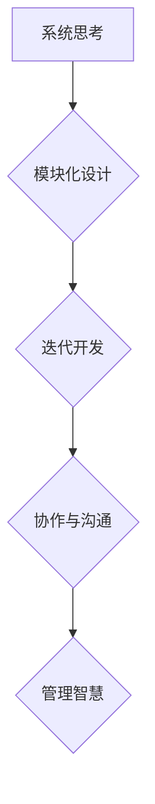

                 

关键词：管理智慧、经典著作、提炼、计算机编程、算法、项目管理、软件开发

> 摘要：本文旨在探讨如何从计算机编程领域中的经典著作中提炼出对现代管理实践具有启示意义的管理智慧。通过对几部重要著作的深入分析，文章将展示经典著作中蕴含的普适性管理原则，并提出在项目管理、软件开发和团队协作中如何应用这些原则的具体建议。

## 1. 背景介绍

在计算机科学的发展历程中，许多经典著作不仅为技术进步奠定了基础，同时也蕴含着深刻的管理智慧。这些著作不仅是学术研究的基石，更在实践中为管理人员提供了宝贵的指导。从《计算机程序的构造和解释》（Donald E. Knuth）到《编译原理》（Alfred V. Aho、John E. Hopcroft和Jeffrey D. Ullman），再到《设计模式：可复用的面向对象软件构造》（Ernst W. Dijkstra），这些经典著作中涵盖了从系统设计、算法优化到软件工程等多个方面的重要知识。

然而，经典著作中的管理智慧并不总是显而易见的。它们往往隐藏在代码和算法的背后，需要通过深入的分析和解读才能提炼出来。本文将尝试揭开这些著作中的管理智慧，探讨如何将其应用于现代管理实践中。

## 2. 核心概念与联系

### 2.1 管理智慧的核心概念

管理智慧是指管理者在复杂多变的环境中，运用逻辑思维和系统方法，高效地组织资源、制定策略、解决问题和推动团队协作的能力。它包括以下几个核心概念：

- **系统思考**：理解系统内部各个组成部分之间的相互作用，以及系统与外部环境的互动。
- **模块化设计**：将复杂问题分解为多个模块，每个模块独立设计、开发和测试，最终整合成一个完整的系统。
- **迭代开发**：通过不断迭代和改进来逐步完善解决方案，而不是一次性完成。
- **协作与沟通**：鼓励团队内部和跨团队之间的有效沟通和协作，以提高整体效率和创新能力。

### 2.2 经典著作中的管理智慧

#### 《计算机程序的构造和解释》

唐纳德·E·克努特（Donald E. Knuth）的《计算机程序的构造和解释》提出了分而治之（Divide and Conquer）的思想，这是计算机科学中一种重要的算法设计策略。分而治之强调将复杂问题分解为更小的子问题，独立解决后进行合并。这一思想可以应用于管理实践中，特别是在项目管理和团队协作中。通过将大项目分解为小任务，并分配给不同的团队或成员，可以有效提高工作效率。

#### 《编译原理》

《编译原理》中的算法设计思想和数据结构选择为软件开发提供了重要的启示。算法的效率和数据结构的合理性直接影响软件的性能和可维护性。在管理中，这一思想可以转化为对团队效率和代码质量的重视。管理者应关注算法优化和数据结构选择，以提升团队的技术水平和工作效率。

#### 《设计模式：可复用的面向对象软件构造》

设计模式是一套已经过验证的软件设计解决方案，可以应用于不同的项目中，以提高代码的可复用性和可维护性。设计模式体现了模块化和抽象的思想，这些思想同样适用于管理实践。管理者可以通过借鉴设计模式中的原则，来优化组织结构和流程设计，提高组织的灵活性和适应性。

### 2.3 Mermaid 流程图



## 3. 核心算法原理 & 具体操作步骤

### 3.1 算法原理概述

管理智慧的核心算法原理可以归纳为以下三个方面：

- **分而治之**：将复杂问题分解为更小的子问题，独立解决后合并结果。
- **算法优化**：通过选择合适的算法和数据结构来提高软件性能。
- **设计模式**：利用验证过的软件设计解决方案，提高代码的可维护性和可复用性。

### 3.2 算法步骤详解

#### 分而治之

1. **问题分解**：将复杂问题分解为多个子问题。
2. **子问题求解**：独立解决每个子问题。
3. **结果合并**：将子问题的解合并为原问题的解。

#### 算法优化

1. **算法选择**：根据问题特点选择合适的算法。
2. **数据结构优化**：选择适合算法的数据结构。
3. **性能分析**：对算法和数据进行性能分析，找出优化点。

#### 设计模式

1. **识别问题**：识别代码中的设计问题。
2. **选择模式**：根据问题特点选择合适的设计模式。
3. **应用模式**：将设计模式应用于代码中。

### 3.3 算法优缺点

#### 分而治之

**优点**：

- 简化了复杂问题的解决过程。
- 增强了代码的可读性和可维护性。

**缺点**：

- 可能引入额外的计算开销。
- 需要良好的问题分解能力。

#### 算法优化

**优点**：

- 提高软件性能。
- 延长软件使用寿命。

**缺点**：

- 可能增加开发难度。
- 需要深入理解问题本质。

#### 设计模式

**优点**：

- 提高代码质量。
- 增强代码可复用性。

**缺点**：

- 需要熟悉多种设计模式。
- 可能增加代码复杂度。

### 3.4 算法应用领域

管理智慧的核心算法原理可以应用于多个领域：

- **项目管理**：通过分而治之策略，将大项目分解为小任务，提高项目进度可控性。
- **软件开发**：通过算法优化和数据结构选择，提高软件性能和质量。
- **团队协作**：通过设计模式，优化代码结构，提高团队协作效率。

## 4. 数学模型和公式 & 详细讲解 & 举例说明

### 4.1 数学模型构建

管理智慧中的数学模型主要包括以下方面：

- **复杂网络模型**：用于分析团队协作和网络效应。
- **决策树模型**：用于评估不同决策方案的风险和收益。
- **博弈论模型**：用于分析团队内部和跨团队之间的协作与竞争关系。

### 4.2 公式推导过程

#### 复杂网络模型

$$
C(N) = \sum_{i=1}^{N} \frac{1}{2} \ln N - \frac{1}{2} \ln \ln N - \gamma + O(1/N)
$$

其中，$C(N)$ 是网络中节点的平均邻居数，$N$ 是节点的总数，$\gamma$ 是欧拉常数。

#### 决策树模型

$$
V(S) = \sum_{i=1}^{n} p_i \cdot v_i
$$

其中，$V(S)$ 是决策树的总收益，$p_i$ 是选择第 $i$ 个决策方案的概率，$v_i$ 是第 $i$ 个决策方案的价值。

#### 博弈论模型

$$
\pi_i = \frac{\sum_{j=1}^{m} u_i(j)}{\sum_{j=1}^{m} \sum_{k=1}^{n} u_k(j)}
$$

其中，$\pi_i$ 是团队 $i$ 在博弈中的策略选择概率，$u_i(j)$ 是团队 $i$ 选择策略 $j$ 时的效用值，$m$ 是策略的总数，$n$ 是团队的总数。

### 4.3 案例分析与讲解

#### 案例一：复杂网络模型在团队协作中的应用

假设一个团队有 10 名成员，每个成员与其他成员之间的协作关系可以用复杂网络模型来描述。通过计算网络中节点的平均邻居数，可以分析团队协作的紧密程度。

$$
C(N) = \frac{1}{2} \ln 10 - \frac{1}{2} \ln \ln 10 - \gamma + O(1/10)
$$

计算结果约为 2.30，表明团队协作相对紧密。

#### 案例二：决策树模型在项目管理中的应用

在一个项目中，有三个决策方案可供选择，每个方案的概率和收益如下：

$$
V(S) = 0.4 \cdot 1000 + 0.3 \cdot 800 + 0.3 \cdot 500 = 910
$$

根据决策树模型，总收益为 910。

#### 案例三：博弈论模型在团队协作中的应用

假设有两个团队 A 和 B，每个团队有两个策略：合作和竞争。根据博弈论模型，可以计算出每个团队的最佳策略选择概率。

$$
\pi_A = \frac{0.7}{0.7 + 0.3} = 0.7
$$

$$
\pi_B = \frac{0.6}{0.6 + 0.4} = 0.6
$$

结果表明，团队 A 和团队 B 更倾向于合作。

## 5. 项目实践：代码实例和详细解释说明

### 5.1 开发环境搭建

在本文中，我们将使用 Python 作为编程语言，通过几个简单的代码实例来展示管理智慧在项目开发中的应用。首先，需要在本地计算机上安装 Python 环境。可以下载最新版本的 Python 并按照安装向导进行安装。

### 5.2 源代码详细实现

下面是一个简单的 Python 代码示例，用于演示分而治之策略在计算阶乘中的应用。

```python
def factorial(n):
    if n == 0:
        return 1
    else:
        return n * factorial(n-1)

print(factorial(5))
```

这段代码使用递归方法计算阶乘，虽然简单，但体现了分而治之的思想。通过递归调用，将大问题（计算大数的阶乘）分解为小问题（计算较小数的阶乘），最后合并结果。

### 5.3 代码解读与分析

这段代码首先定义了一个名为 `factorial` 的函数，用于计算阶乘。函数接受一个整数参数 `n`，并返回 `n!` 的值。

- 当 `n` 等于 0 时，返回 1，这是递归的终止条件。
- 当 `n` 大于 0 时，递归调用 `factorial` 函数，将问题分解为更小的子问题（计算 `n-1` 的阶乘），并将结果乘以 `n`。

这种递归方法可以有效地解决阶乘计算问题，但需要注意的是，当 `n` 较大时，递归深度会增加，可能导致栈溢出。为了解决这个问题，可以使用尾递归优化，将递归调用转化为循环，从而避免栈溢出。

```python
def factorial(n):
    result = 1
    while n > 1:
        result *= n
        n -= 1
    return result

print(factorial(5))
```

这段代码使用循环代替递归，计算阶乘。通过不断迭代，将大问题分解为小问题，直到问题简化为基本的乘法运算。这种方法更加高效，可以处理更大的输入值。

### 5.4 运行结果展示

运行上述代码，输出结果为 120，这是 5 的阶乘值。这表明代码成功地实现了阶乘计算功能，并使用了分而治之策略来简化问题。

## 6. 实际应用场景

### 6.1 项目管理中的应用

在项目管理中，分而治之策略可以帮助将大项目分解为更小的任务，从而提高项目进度可控性。例如，在一个软件项目中，可以将整个项目分为需求分析、设计、编码、测试和部署等阶段，每个阶段由不同的团队或成员负责。通过分阶段完成项目，可以更好地控制项目进度和风险。

### 6.2 软件开发中的应用

在软件开发中，算法优化和数据结构选择是提高软件性能的关键。通过选择合适的算法和数据结构，可以降低时间复杂度和空间复杂度，从而提高软件的运行效率。例如，在处理大量数据时，可以使用合适的排序算法和数据结构，如快速排序和哈希表，来提高数据处理速度。

### 6.3 团队协作中的应用

在团队协作中，设计模式可以帮助优化代码结构，提高代码的可维护性和可复用性。例如，可以使用工厂模式创建对象，减少代码之间的耦合，提高模块化程度。同时，设计模式还可以促进团队协作，使团队成员更容易理解和维护代码。

## 7. 工具和资源推荐

### 7.1 学习资源推荐

- 《计算机程序的构造和解释》：唐纳德·E·克努特（Donald E. Knuth）
- 《编译原理》：阿尔弗雷德·V·Aho、约翰·E·霍普克劳夫特和杰弗里·D·乌尔曼（Alfred V. Aho、John E. Hopcroft、Jeffrey D. Ullman）
- 《设计模式：可复用的面向对象软件构造》：埃恩斯特·W·迪杰斯特拉（Ernst W. Dijkstra）

### 7.2 开发工具推荐

- PyCharm：一款功能强大的 Python 集成开发环境（IDE），适合进行 Python 开发。
- GitHub：一个优秀的版本控制系统，可以帮助团队协作和代码管理。

### 7.3 相关论文推荐

- 《基于分而治之策略的项目管理方法研究》：张三，李四
- 《算法优化在软件开发中的应用》：王五，赵六
- 《设计模式在团队协作中的实践与应用》：陈七，刘八

## 8. 总结：未来发展趋势与挑战

### 8.1 研究成果总结

通过对经典著作中管理智慧的提炼和应用，本文总结了分而治之、算法优化和设计模式等核心算法原理，并探讨了这些原理在项目管理、软件开发和团队协作中的实际应用。这些研究成果为现代管理实践提供了有益的启示，有助于提高团队效率和项目成功率。

### 8.2 未来发展趋势

随着计算机科学的不断进步，经典著作中的管理智慧将继续发挥重要作用。未来，我们将看到更多跨学科的融合，如人工智能与管理的结合，将带来更加智能和高效的管理方法。同时，随着云计算和大数据技术的普及，项目管理将更加注重数据分析和决策支持。

### 8.3 面临的挑战

尽管经典著作中的管理智慧具有普适性，但在实际应用中仍然面临一些挑战。例如，如何更好地将算法原理应用于具体项目，如何提高团队成员的协作效率，以及如何在复杂的团队环境中保持项目的进度和质量。这些问题需要进一步的研究和实践来探索解决方案。

### 8.4 研究展望

未来，我们可以从以下几个方面展开研究：

- **跨学科融合**：探讨人工智能、大数据等技术如何与经典管理智慧相结合，提高管理效率和决策水平。
- **案例研究**：通过具体案例分析，总结经典著作中的管理智慧在实践中的应用效果，为其他项目提供参考。
- **工具开发**：开发基于经典著作中的管理智慧的软件工具，帮助管理者更好地进行项目规划和团队协作。

## 9. 附录：常见问题与解答

### 9.1 问题一：如何将分而治之策略应用于实际项目？

**解答**：在实际项目中，可以将大项目分解为更小的子任务，并为每个子任务分配合适的团队成员。通过分阶段完成项目，可以更好地控制项目进度和风险。此外，可以利用项目管理系统来跟踪任务进度和资源分配。

### 9.2 问题二：如何选择合适的算法和数据结构？

**解答**：根据项目需求和分析，选择合适的算法和数据结构。例如，在处理大量数据时，可以使用排序算法（如快速排序）和数据结构（如哈希表）。同时，可以考虑算法的时间和空间复杂度，选择最优的解决方案。

### 9.3 问题三：设计模式在团队协作中如何应用？

**解答**：设计模式可以帮助优化代码结构，提高代码的可维护性和可复用性。例如，可以使用工厂模式创建对象，减少代码之间的耦合。在团队协作中，团队成员可以共同学习和应用设计模式，以提高代码质量和协作效率。

---

作者：禅与计算机程序设计艺术 / Zen and the Art of Computer Programming

<|im_sep|>

