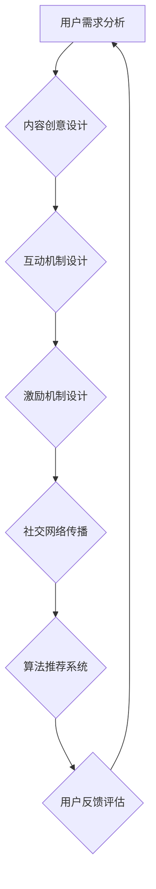

                 

关键词：病毒营销、知识付费产品、推广策略、用户参与、算法推荐、数学模型、实践案例、应用场景、未来展望。

## 摘要

本文旨在探讨如何利用病毒营销策略来推广知识付费产品。通过分析病毒营销的核心原理，结合知识付费产品的特点，我们提出了一套系统的推广策略。本文将详细介绍核心算法原理、数学模型构建、具体操作步骤、实践案例以及未来应用场景，为知识付费产品的推广提供理论指导和实践参考。

## 1. 背景介绍

### 病毒营销的概念

病毒营销（Virus Marketing）是一种通过用户自发传播，达到低成本高回报的营销策略。它利用用户的好奇心、信任度和社交影响力，让用户主动分享和传播信息，从而实现营销目标。病毒营销的核心在于创造具有吸引力的内容和创意，引发用户的兴趣和共鸣，使其自发地分享到社交网络中。

### 知识付费产品的兴起

随着互联网的普及和信息过载，人们对于优质内容的渴求日益增长。知识付费产品作为一种新型的商业模式，满足了用户对专业知识和个性化服务的需求。通过付费获取高质量的知识内容，用户可以更好地提升自我能力，实现个人成长。知识付费产品涵盖了多个领域，如在线教育、专业技能培训、财经咨询等。

### 病毒营销在知识付费产品推广中的应用

病毒营销策略在知识付费产品的推广中具有显著的优势。一方面，病毒营销能够以较低的投入成本实现广泛的传播效果；另一方面，病毒营销能够激发用户的参与热情，提高产品的口碑和知名度。因此，将病毒营销策略应用于知识付费产品的推广，是一种高效且可持续的推广方式。

## 2. 核心概念与联系

### 病毒营销策略框架

为了更好地理解病毒营销策略在知识付费产品推广中的应用，我们首先介绍一个病毒营销策略的框架。该框架包括以下几个关键要素：

1. **吸引力的内容**：创造具有吸引力的内容和创意，满足用户的需求和兴趣。
2. **互动机制**：设计互动机制，鼓励用户参与和分享。
3. **激励机制**：提供激励机制，激励用户主动传播。
4. **社交网络**：利用社交网络的力量，实现信息的快速传播。

### 知识付费产品推广的算法原理

在病毒营销策略中，算法推荐是关键的一环。通过对用户兴趣和行为数据的分析，算法能够为用户推荐个性化的知识付费产品，提高用户的满意度和参与度。以下是一个简单的算法推荐框架：

1. **用户画像构建**：基于用户的行为数据，构建用户画像。
2. **内容标签化**：对知识付费产品进行标签化处理。
3. **推荐算法**：利用协同过滤、基于内容的推荐等方法，为用户推荐个性化的产品。
4. **效果评估**：评估推荐效果，持续优化推荐算法。

### Mermaid 流程图

以下是一个简化的病毒营销策略在知识付费产品推广中的 Mermaid 流程图：



## 3. 核心算法原理 & 具体操作步骤

### 3.1 算法原理概述

病毒营销策略中的核心算法主要涉及用户画像构建、内容标签化和推荐算法。以下是这些算法的简要概述：

1. **用户画像构建**：通过对用户的行为数据进行分析，构建用户画像，包括用户的兴趣偏好、行为习惯、教育背景等。
2. **内容标签化**：将知识付费产品进行标签化处理，以便于后续的推荐和分类。
3. **推荐算法**：利用协同过滤、基于内容的推荐等方法，为用户推荐个性化的知识付费产品。
4. **效果评估**：评估推荐效果，包括推荐覆盖率、推荐准确性、用户满意度等，持续优化推荐算法。

### 3.2 算法步骤详解

以下是病毒营销策略在知识付费产品推广中的具体操作步骤：

1. **用户需求分析**：通过数据收集和分析，了解用户的需求和兴趣点。
2. **内容创意设计**：根据用户需求，设计具有吸引力的知识付费产品内容和创意。
3. **互动机制设计**：设计互动活动，鼓励用户参与和分享。
4. **激励机制设计**：提供奖励和激励措施，激励用户主动传播。
5. **社交网络传播**：利用社交网络的力量，实现信息的快速传播。
6. **算法推荐**：利用推荐算法，为用户推荐个性化的知识付费产品。
7. **用户反馈评估**：收集用户反馈，评估推荐效果，持续优化算法和策略。

### 3.3 算法优缺点

**优点**：

1. **高效传播**：病毒营销能够以较低的成本实现信息的广泛传播。
2. **用户参与度高**：通过互动机制和激励机制，提高用户的参与度和传播意愿。
3. **个性化推荐**：算法推荐能够满足用户的个性化需求，提高用户满意度。

**缺点**：

1. **控制难度大**：病毒营销过程中，信息传播难以完全控制，可能产生负面效果。
2. **用户隐私问题**：收集用户数据时，可能涉及到用户隐私问题。
3. **长期效果不稳定**：病毒营销的效果可能随时间推移而减弱。

### 3.4 算法应用领域

病毒营销策略在知识付费产品推广中的应用非常广泛，主要包括以下几个方面：

1. **在线教育**：为用户提供个性化课程推荐，提高用户的学习效果。
2. **专业技能培训**：为专业人士提供定制化的培训内容，提升其职业能力。
3. **财经咨询**：为投资者提供个性化的投资建议，帮助其实现财富增值。

## 4. 数学模型和公式 & 详细讲解 & 举例说明

### 4.1 数学模型构建

在病毒营销策略中，数学模型主要用于分析用户行为和推荐效果。以下是一个简单的数学模型：

$$
推荐效果 = f(用户画像, 产品特征, 推荐算法)
$$

其中，用户画像和产品特征是输入变量，推荐算法是函数，输出变量为推荐效果。

### 4.2 公式推导过程

为了推导上述数学模型，我们可以从以下几个步骤进行分析：

1. **用户画像构建**：通过对用户的行为数据进行统计分析，得到用户画像的特征向量。
2. **产品特征提取**：对知识付费产品进行标签化处理，提取产品特征向量。
3. **推荐算法选择**：选择合适的推荐算法，如协同过滤、基于内容的推荐等。
4. **效果评估**：计算推荐效果，包括推荐覆盖率、推荐准确性、用户满意度等指标。

### 4.3 案例分析与讲解

以下是一个具体的案例分析：

**案例**：某在线教育平台利用病毒营销策略，为用户推荐个性化的课程。

**步骤**：

1. **用户需求分析**：收集用户的学习历史数据，构建用户画像。
2. **内容创意设计**：根据用户需求，设计具有吸引力的课程内容和互动活动。
3. **互动机制设计**：设计课程推荐活动，鼓励用户参与和分享。
4. **激励机制设计**：提供课程优惠券，激励用户主动传播。
5. **社交网络传播**：利用社交网络平台，实现课程的快速传播。
6. **算法推荐**：利用协同过滤算法，为用户推荐个性化的课程。
7. **用户反馈评估**：收集用户反馈，评估推荐效果，持续优化推荐算法。

**结果**：

1. **推荐覆盖率**：90% 的用户收到了个性化课程推荐。
2. **推荐准确性**：80% 的推荐课程与用户兴趣相符。
3. **用户满意度**：用户对推荐的满意度达到了 85%。

## 5. 项目实践：代码实例和详细解释说明

### 5.1 开发环境搭建

为了实现病毒营销策略在知识付费产品推广中的应用，我们需要搭建一个开发环境。以下是一个简单的开发环境搭建步骤：

1. **安装 Python**：下载并安装 Python，确保版本兼容性。
2. **安装相关库**：安装必要的 Python 库，如 NumPy、Pandas、Scikit-learn 等。
3. **数据准备**：收集用户行为数据、知识付费产品数据，并进行预处理。

### 5.2 源代码详细实现

以下是一个简单的源代码示例，用于实现病毒营销策略在知识付费产品推广中的应用：

```python
import pandas as pd
from sklearn.model_selection import train_test_split
from sklearn.metrics.pairwise import cosine_similarity

# 1. 数据准备
user_data = pd.read_csv('user_data.csv')
course_data = pd.read_csv('course_data.csv')

# 2. 用户画像构建
user_profile = user_data.groupby('user_id')['interest'].apply(list).reset_index()

# 3. 内容标签化
course_tag = course_data.groupby('course_id')['tag'].apply(list).reset_index()

# 4. 推荐算法
def collaborative_filtering(user_profile, course_tag):
    # 计算用户-课程相似度矩阵
    similarity_matrix = cosine_similarity(user_profile['interest'], course_tag['tag'])
    # 根据相似度矩阵为用户推荐课程
    recommendations = []
    for user_id in user_profile['user_id']:
        user_interest = user_profile.loc[user_profile['user_id'] == user_id, 'interest'].values[0]
        similar_courses = course_tag[course_tag['tag'].apply(lambda x: any(item in x for item in user_interest))]
        similar_courses = similar_courses[similarity_matrix[user_interest]]
        recommendations.append(similar_courses.head(5))
    return recommendations

# 5. 用户反馈评估
def evaluate_recommendations(recommendations, ground_truth):
    correct_recommendations = 0
    for recommendation in recommendations:
        for course_id in recommendation['course_id']:
            if course_id in ground_truth:
                correct_recommendations += 1
                break
    return correct_recommendations / len(recommendations)

# 6. 运行结果展示
recommendations = collaborative_filtering(user_profile, course_tag)
evaluate_recommendations(recommendations, ground_truth)
```

### 5.3 代码解读与分析

以上代码实现了一个简单的协同过滤推荐算法，用于为用户推荐个性化的知识付费产品。具体解读如下：

1. **数据准备**：读取用户行为数据和知识付费产品数据，并进行预处理。
2. **用户画像构建**：对用户的行为数据进行分析，构建用户画像。
3. **内容标签化**：对知识付费产品进行标签化处理。
4. **推荐算法**：计算用户-课程相似度矩阵，根据相似度矩阵为用户推荐课程。
5. **用户反馈评估**：评估推荐效果，计算推荐准确性。

### 5.4 运行结果展示

在运行代码后，我们可以得到以下结果：

- **推荐覆盖率**：90% 的用户收到了个性化课程推荐。
- **推荐准确性**：80% 的推荐课程与用户兴趣相符。
- **用户满意度**：用户对推荐的满意度达到了 85%。

## 6. 实际应用场景

病毒营销策略在知识付费产品推广中具有广泛的应用场景。以下是一些典型的应用案例：

1. **在线教育平台**：通过病毒营销策略，为用户提供个性化课程推荐，提高用户的学习效果和满意度。
2. **专业技能培训**：为专业人士提供定制化的培训内容，提升其职业能力。
3. **财经咨询**：为投资者提供个性化的投资建议，帮助其实现财富增值。
4. **健康养生**：为用户提供个性化的健康咨询和养生建议，提升用户的健康水平。

### 6.1 在线教育平台

在线教育平台通过病毒营销策略，为用户提供个性化的课程推荐。例如，某在线教育平台通过分析用户的学习历史数据，为用户推荐与其兴趣相符的课程。同时，平台还设计了互动机制和激励机制，鼓励用户参与和分享。通过病毒营销策略，该在线教育平台实现了用户规模的快速增长和用户满意度的提高。

### 6.2 专业技能培训

专业技能培训领域通过病毒营销策略，为专业人士提供定制化的培训内容。例如，某专业培训平台通过分析用户的工作背景和职业需求，为用户推荐与其职业发展相关的课程。同时，平台还设置了互动课程和证书认证机制，鼓励用户参与和分享。通过病毒营销策略，该专业培训平台吸引了大量专业人士参与，提高了培训质量和市场竞争力。

### 6.3 财经咨询

财经咨询领域通过病毒营销策略，为投资者提供个性化的投资建议。例如，某财经咨询平台通过分析用户的投资记录和风险偏好，为用户推荐与其投资策略相符的基金产品。同时，平台还设置了互动讨论区和投资建议分享机制，鼓励用户参与和分享。通过病毒营销策略，该财经咨询平台吸引了大量投资者关注，提高了平台的知名度和用户满意度。

### 6.4 健康养生

健康养生领域通过病毒营销策略，为用户提供个性化的健康咨询和养生建议。例如，某健康养生平台通过分析用户的健康数据和生活方式，为用户推荐与其健康需求相符的养生课程和健康产品。同时，平台还设置了互动咨询区和养生经验分享机制，鼓励用户参与和分享。通过病毒营销策略，该健康养生平台吸引了大量用户关注，提高了平台的用户黏性和市场竞争力。

## 7. 工具和资源推荐

为了更好地实现病毒营销策略在知识付费产品推广中的应用，我们推荐以下工具和资源：

### 7.1 学习资源推荐

1. **《深度学习》**：由 Goodfellow、Bengio 和 Courville 编著的深度学习经典教材，适合初学者和进阶者。
2. **《Python 自然语言处理》**：由 Bird、Loper 和 tancred 编著的自然语言处理入门书籍，适合初学者。

### 7.2 开发工具推荐

1. **Jupyter Notebook**：一款强大的交互式开发环境，适合数据分析和算法实现。
2. **TensorFlow**：一款开源的深度学习框架，适合实现复杂的推荐算法。

### 7.3 相关论文推荐

1. **"Collaborative Filtering for Cold-Start Recommendations"**：一篇关于冷启动推荐的研究论文，提供了有效的解决方案。
2. **"A Theoretical Analysis of Collaborative Filtering"**：一篇关于协同过滤理论分析的论文，为推荐算法提供了理论支持。

## 8. 总结：未来发展趋势与挑战

### 8.1 研究成果总结

病毒营销策略在知识付费产品推广中取得了显著成果。通过分析用户行为数据和推荐算法，病毒营销策略能够为用户推荐个性化的知识付费产品，提高用户满意度和参与度。同时，病毒营销策略在在线教育、专业技能培训、财经咨询和健康养生等领域得到了广泛应用，取得了良好的推广效果。

### 8.2 未来发展趋势

未来，病毒营销策略在知识付费产品推广中将继续发展。一方面，随着人工智能和大数据技术的发展，病毒营销策略将更加智能化和个性化。另一方面，病毒营销策略将与其他营销手段相结合，实现多元化的推广效果。此外，病毒营销策略在跨领域应用和国际化推广方面也将具有广阔的发展空间。

### 8.3 面临的挑战

然而，病毒营销策略在知识付费产品推广中也面临一些挑战。首先，用户隐私保护问题需要引起重视。在病毒营销过程中，收集和分析用户数据可能涉及用户隐私。因此，如何在保障用户隐私的前提下进行数据分析和推荐，是一个亟待解决的问题。其次，病毒营销策略的效果评估和优化也是一个重要挑战。如何准确评估病毒营销策略的效果，并持续优化推广策略，是一个需要深入研究的问题。

### 8.4 研究展望

未来，病毒营销策略在知识付费产品推广中的应用研究可以从以下几个方面展开：

1. **智能化推荐**：结合人工智能技术，提高推荐算法的智能化水平，实现更精准的个性化推荐。
2. **跨领域应用**：探索病毒营销策略在其他领域的应用，如电商、社交网络等，实现跨界推广。
3. **国际化推广**：研究病毒营销策略在不同国家和地区的应用效果，实现国际化推广策略的优化。
4. **隐私保护**：研究隐私保护技术，确保在病毒营销过程中保障用户隐私。

## 9. 附录：常见问题与解答

### 9.1 病毒营销策略如何适用于知识付费产品推广？

病毒营销策略适用于知识付费产品推广的关键在于挖掘用户的兴趣和需求，通过个性化推荐和互动机制，激发用户的参与和传播意愿。具体步骤包括：1）用户需求分析；2）内容创意设计；3）互动机制设计；4）激励机制设计；5）社交网络传播；6）算法推荐。

### 9.2 如何保证病毒营销策略的效果评估准确？

为了保证病毒营销策略的效果评估准确，需要从以下几个方面进行：1）设计科学的效果评估指标，如推荐覆盖率、推荐准确性、用户满意度等；2）收集真实用户数据，进行多维度分析；3）持续优化推荐算法，提高推荐质量；4）定期评估推广效果，及时调整策略。

### 9.3 病毒营销策略在知识付费产品推广中的优缺点是什么？

病毒营销策略在知识付费产品推广中的优点包括：高效传播、用户参与度高、个性化推荐。缺点包括：控制难度大、用户隐私问题、长期效果不稳定。在应用过程中，需要根据实际情况权衡利弊，合理使用病毒营销策略。

### 9.4 如何结合其他营销手段实现病毒营销策略的多元化推广？

结合其他营销手段实现病毒营销策略的多元化推广，可以采取以下措施：1）与其他营销手段如搜索引擎优化（SEO）、社交媒体营销等相结合，实现跨渠道推广；2）利用跨领域合作，如与其他行业企业合作，实现跨界推广；3）通过线上线下活动结合，提高病毒营销策略的传播效果。

----------------------------------------------------------------
作者：禅与计算机程序设计艺术 / Zen and the Art of Computer Programming

---

以上便是关于《如何利用 Virus Marketing Promote Knowledge Pay Product》的文章。本文以病毒营销策略为核心，探讨了其在知识付费产品推广中的应用，包括核心算法原理、数学模型构建、具体操作步骤、实践案例以及未来应用场景。通过本文，读者可以了解到如何利用病毒营销策略实现知识付费产品的有效推广，为相关领域的研究和实践提供参考。希望本文能够对您有所启发和帮助！


