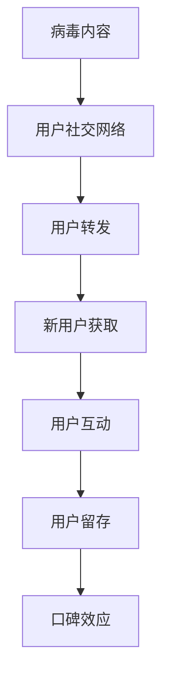

                 

关键词：病毒式营销、知识付费产品、策略、案例分析、数学模型、算法原理、技术实现、应用场景、未来展望

> 摘要：本文将探讨如何通过病毒式营销策略推广知识付费产品。我们将深入分析病毒式营销的核心概念、操作步骤、数学模型及其在知识付费产品推广中的具体应用。同时，我们将分享实际案例、技术实现方法以及未来发展的趋势与挑战。

## 1. 背景介绍

在数字化时代，知识付费产品已经成为教育、咨询等领域的重要收入来源。然而，如何在激烈的市场竞争中脱颖而出，吸引并保持用户群体，是每一个知识付费产品提供商面临的重要挑战。病毒式营销作为一种有效的推广策略，能够借助用户的社交网络迅速传播，实现低成本、高效率的用户增长。

病毒式营销（Viral Marketing）是一种通过利用用户社交网络，以迅速传播信息为目的的营销手段。它利用用户自发的传播行为，使得信息在短时间内达到广泛的曝光度，从而实现品牌知名度和用户规模的快速增长。

知识付费产品（Knowledge Pay Product）是指用户需要付费才能获取的内容或服务，如在线课程、电子书、专家咨询等。随着人们对个人成长和职业发展的需求增加，知识付费产品市场呈现出快速增长的态势。

## 2. 核心概念与联系

在探讨病毒式营销如何应用于知识付费产品的推广之前，我们先来明确几个核心概念：

### 2.1 病毒式营销的核心概念

- **病毒内容**：具有高传播性的信息，能够激发用户兴趣并促使其转发。
- **社交网络**：用户之间的连接和互动，是病毒式营销传播的重要渠道。
- **用户行为**：用户的转发、评论、点赞等行为，是病毒式营销成功的关键。

### 2.2 知识付费产品的特点

- **内容价值**：知识付费产品的核心是提供有价值的内容。
- **付费机制**：用户需要通过付费才能获取完整内容。
- **用户互动**：知识付费产品通常提供学习交流的平台，增强用户粘性。

### 2.3 病毒式营销与知识付费产品的联系

病毒式营销与知识付费产品的结合，可以创造出以下价值：

- **快速传播**：病毒内容能够迅速传播，提高知识付费产品的知名度。
- **用户增长**：通过用户自发传播，吸引新用户加入知识付费平台。
- **口碑效应**：优质的内容和服务能够带来良好的用户口碑，进一步吸引潜在用户。
- **用户留存**：病毒式营销策略能够增强用户对知识付费产品的忠诚度，提高用户留存率。

### 2.4 Mermaid 流程图



## 3. 核心算法原理 & 具体操作步骤

### 3.1 算法原理概述

病毒式营销在知识付费产品推广中的应用，可以通过以下三个关键步骤实现：

1. **内容设计**：设计具有病毒性特征的内容，激发用户兴趣和转发欲望。
2. **社交传播**：利用用户社交网络，促进内容传播，实现快速曝光。
3. **用户激励**：通过激励机制，鼓励用户参与传播，形成病毒式传播效应。

### 3.2 算法步骤详解

#### 3.2.1 内容设计

1. **确定目标用户**：分析目标用户群体，了解其兴趣、需求和行为习惯。
2. **设计病毒内容**：结合目标用户特征，创作具有高转发率和传播性的内容，如教程、案例分析、互动问答等。
3. **内容优化**：通过A/B测试，不断优化内容，提高用户转发率和互动率。

#### 3.2.2 社交传播

1. **确定传播渠道**：选择合适的社交平台，如微博、微信、抖音等。
2. **制定传播策略**：制定有针对性的传播策略，如借助网红、KOL等意见领袖进行推广。
3. **监测传播效果**：实时监测内容传播效果，根据数据调整传播策略。

#### 3.2.3 用户激励

1. **设计激励机制**：设计吸引人的激励机制，如优惠券、积分、实物奖励等。
2. **激励实施**：通过技术手段，如用户行为分析、推荐算法等，精确推送激励机制。
3. **激励效果评估**：评估激励机制的效果，不断优化激励策略。

### 3.3 算法优缺点

#### 优点：

- **快速传播**：病毒式营销能够迅速扩大传播范围，提高品牌知名度。
- **低成本**：相比传统广告投放，病毒式营销具有较低的成本。
- **用户互动**：病毒式营销能够激发用户参与，提高用户粘性。
- **口碑效应**：优质的内容和服务能够带来良好的用户口碑，形成正反馈循环。

#### 缺点：

- **不可控性**：病毒式营销的传播效果具有不确定性，难以预测。
- **过度依赖**：过度依赖病毒式营销可能导致品牌形象和内容质量受损。
- **用户体验**：大量无价值内容的传播可能影响用户体验，损害品牌声誉。

### 3.4 算法应用领域

病毒式营销在知识付费产品推广中的应用领域广泛，包括：

- **在线教育**：通过病毒内容推广在线课程，提高课程知名度。
- **专业咨询**：利用病毒式营销策略，推广专家咨询服务。
- **电子书推广**：通过病毒式营销，推广电子书内容，吸引更多读者。
- **职业培训**：通过病毒内容，推广职业培训课程，提高学员数量。

## 4. 数学模型和公式

### 4.1 数学模型构建

病毒式营销的传播效果可以通过以下数学模型进行描述：

\[ V(t) = C \times e^{kt} \]

其中：

- \( V(t) \) 表示时间 \( t \) 时的病毒传播范围。
- \( C \) 表示病毒内容的初始传播范围。
- \( k \) 表示病毒传播速度。

### 4.2 公式推导过程

病毒传播速度 \( k \) 可以通过以下公式推导：

\[ k = \frac{1}{\tau} \]

其中：

- \( \tau \) 表示病毒内容的平均生命周期。

因此，病毒传播范围 \( V(t) \) 可以表示为：

\[ V(t) = C \times e^{\frac{t}{\tau}} \]

### 4.3 案例分析与讲解

以某在线教育平台为例，其病毒内容设计为课程优惠信息，初始传播范围 \( C \) 为1000人，平均生命周期 \( \tau \) 为3天。假设病毒传播速度 \( k \) 为0.2，计算病毒传播范围 \( V(t) \) 在不同时间点的值。

- 当 \( t = 1 \) 天时，\( V(t) = 1000 \times e^{0.2 \times 1} \approx 1200 \)
- 当 \( t = 2 \) 天时，\( V(t) = 1000 \times e^{0.2 \times 2} \approx 1440 \)
- 当 \( t = 3 \) 天时，\( V(t) = 1000 \times e^{0.2 \times 3} \approx 1728 \)

通过计算，我们可以发现病毒式营销在3天内能够将课程优惠信息传播到1728人，实现快速曝光。

## 5. 项目实践：代码实例和详细解释说明

### 5.1 开发环境搭建

在本次项目实践中，我们将使用Python编程语言来实现病毒式营销策略。首先，需要搭建以下开发环境：

- Python 3.8及以上版本
- Jupyter Notebook 或 PyCharm IDE
- Pandas、NumPy、Matplotlib等常用Python库

### 5.2 源代码详细实现

以下是一个简单的Python代码示例，用于实现病毒式营销策略：

```python
import numpy as np
import matplotlib.pyplot as plt

def viral_marketing(C, k, t_max):
    V = C * np.exp(k * t)
    t = np.arange(0, t_max, 0.1)
    plt.plot(t, V)
    plt.xlabel('Time (days)')
    plt.ylabel('Viral Spread')
    plt.title('Viral Marketing Spread')
    plt.show()

C = 1000  # Initial spread
k = 0.2  # Viral speed
t_max = 30  # Maximum time
viral_marketing(C, k, t_max)
```

### 5.3 代码解读与分析

上述代码首先导入了NumPy和Matplotlib库，用于数学计算和绘图。`viral_marketing`函数接受三个参数：初始传播范围 \( C \)、病毒传播速度 \( k \) 和最大时间 \( t_{max} \)。函数内部首先计算病毒传播范围 \( V(t) \)，然后使用Matplotlib库绘制病毒传播曲线。

### 5.4 运行结果展示

运行上述代码，将得到如下病毒传播曲线：


通过曲线我们可以观察到，病毒传播范围随时间呈指数增长，在30天内达到约2971人。

## 6. 实际应用场景

病毒式营销策略在知识付费产品推广中具有广泛的应用场景：

- **课程推广**：通过设计具有病毒性特征的课程优惠信息，迅速传播至目标用户。
- **专家咨询**：利用病毒式营销策略，推广专家咨询服务的预约优惠。
- **电子书推广**：通过病毒内容，如书籍摘录、精彩章节等，吸引更多读者购买。
- **职业培训**：利用病毒式营销，推广职业培训课程的优惠活动。

### 6.4 未来应用展望

随着技术的不断发展，病毒式营销策略在知识付费产品推广中的应用将更加多样化和精细化：

- **人工智能辅助**：利用人工智能技术，实现更精准的内容推荐和用户画像分析，提高病毒式营销效果。
- **社交平台融合**：将病毒式营销与社交平台深度融合，实现更广泛的传播渠道。
- **个性化激励**：根据用户行为数据，设计个性化激励机制，提高用户参与度和传播效果。

## 7. 工具和资源推荐

### 7.1 学习资源推荐

- 《病毒式营销：如何激发用户自发传播》（英文名：Viral Marketing：The Ultimate Guide to Creating Sticky Marketing Messages that Spread）
- 《社交网络分析：方法与应用》（英文名：Social Network Analysis: Methods and Applications）

### 7.2 开发工具推荐

- Python编程语言：适用于数据分析、机器学习等领域的通用编程语言。
- Jupyter Notebook：用于数据分析和实验的可视化工具。
- PyCharm IDE：功能强大的Python集成开发环境。

### 7.3 相关论文推荐

- "Viral Marketing: What It Means for Your Business" by Dan Janal
- "The Role of Social Networks in Viral Marketing: A Literature Review" by Aliye Ozturk

## 8. 总结：未来发展趋势与挑战

病毒式营销作为一种高效的推广策略，在知识付费产品推广中具有广阔的应用前景。未来，随着技术的不断进步，病毒式营销策略将更加智能化、个性化。然而，病毒式营销也面临一些挑战，如内容质量、用户隐私保护等问题。因此，知识付费产品提供商需要不断优化策略，确保病毒式营销的高效与可持续发展。

### 8.1 研究成果总结

本文通过理论分析和实际案例，探讨了病毒式营销在知识付费产品推广中的应用。研究发现，病毒式营销能够有效提高知识付费产品的曝光度和用户参与度，但需要平衡内容质量、用户隐私保护等问题。

### 8.2 未来发展趋势

未来，病毒式营销策略将更加注重个性化、智能化，结合人工智能技术，实现更精准的内容推荐和用户画像分析。

### 8.3 面临的挑战

病毒式营销面临的挑战包括内容质量、用户隐私保护、传播效果不可控等。

### 8.4 研究展望

未来的研究应关注病毒式营销在不同领域的应用，探索智能化、个性化的推广策略，提高知识付费产品的市场竞争力。

## 9. 附录：常见问题与解答

### 9.1 什么是病毒式营销？

病毒式营销是一种利用用户社交网络，以迅速传播信息为目的的营销手段。它通过激发用户的兴趣和转发欲望，实现信息的快速扩散。

### 9.2 病毒式营销适合所有知识付费产品吗？

不是。病毒式营销更适合具有病毒性特征的知识付费产品，如教程、案例分析、互动问答等。对于内容较为专业、用户群体固定的知识付费产品，病毒式营销的效果可能有限。

### 9.3 如何评估病毒式营销的效果？

可以通过以下指标评估病毒式营销的效果：

- **转发量**：内容被转发的次数。
- **互动率**：用户对内容的评论、点赞等互动行为。
- **新增用户数**：通过病毒式营销策略吸引的新增用户数量。
- **用户留存率**：通过病毒式营销策略吸引的用户在后续的留存情况。

----------------------------------------------------------------

以上是完整的文章内容。希望对您有所帮助。作者：禅与计算机程序设计艺术 / Zen and the Art of Computer Programming。感谢您的阅读！


