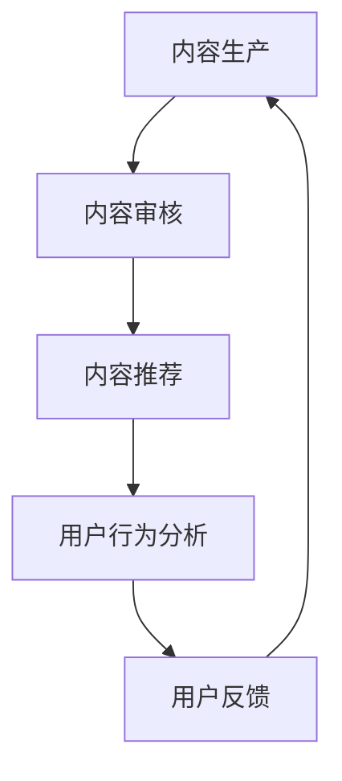

                 

关键词：AI技术，知识付费，效率提升，算法原理，数学模型，项目实践，应用场景，工具推荐，未来展望

> 摘要：随着人工智能技术的发展，知识付费行业面临着效率提升的挑战。本文从算法原理、数学模型、项目实践等多个角度，深入探讨如何利用AI技术提升知识付费效率，为行业从业者提供实用的方法和思路。

## 1. 背景介绍

知识付费行业近年来取得了飞速发展，尤其是在在线教育和在线咨询等领域。然而，随着用户需求的不断增长和市场竞争的加剧，如何提升知识付费的效率成为行业面临的一大挑战。传统的人工处理方式已无法满足高效、精准的需求，因此，将人工智能技术应用于知识付费行业成为了一种新的发展方向。

AI技术在知识付费行业的应用主要包括以下几个方面：

1. **内容生成与推荐**：通过自然语言处理和深度学习算法，生成高质量的内容和推荐系统，提高用户满意度和内容传播效率。
2. **用户行为分析**：利用机器学习算法，分析用户行为，实现精准定位用户需求，提高用户体验和粘性。
3. **智能客服**：通过智能对话系统和语音识别技术，提供24小时在线服务，提升客户服务效率。
4. **学习效果评估**：利用AI技术对学习效果进行自动评估，提高教育质量。

## 2. 核心概念与联系

### 2.1 AI技术概述

人工智能（AI）是一种模拟人类智能行为的技术，包括机器学习、深度学习、自然语言处理等多个子领域。在知识付费行业，AI技术主要用于数据分析和内容生成。

### 2.2 知识付费模型

知识付费模型主要包括内容生产、内容推荐、用户行为分析、用户反馈等环节。每个环节都涉及到大量的数据处理和分析。

### 2.3 Mermaid 流程图

以下是一个简化的知识付费流程图，使用Mermaid语法表示：



## 3. 核心算法原理 & 具体操作步骤

### 3.1 算法原理概述

在知识付费行业中，常用的AI算法包括：

1. **自然语言处理（NLP）**：用于文本生成、文本分类、情感分析等任务。
2. **深度学习**：用于图像识别、语音识别、推荐系统等任务。
3. **机器学习**：用于用户行为分析、预测模型等任务。

### 3.2 算法步骤详解

#### 3.2.1 自然语言处理

1. **文本预处理**：对文本进行清洗、去噪、分词等操作，提取有效信息。
2. **文本分类**：使用分类算法（如朴素贝叶斯、支持向量机等）对文本进行分类。
3. **情感分析**：使用情感分析模型（如LSTM、BERT等）对文本进行情感分析。

#### 3.2.2 深度学习

1. **图像识别**：使用卷积神经网络（CNN）对图像进行分类和识别。
2. **语音识别**：使用循环神经网络（RNN）和长短期记忆网络（LSTM）对语音信号进行识别。
3. **推荐系统**：使用协同过滤、矩阵分解等算法构建推荐系统。

#### 3.2.3 机器学习

1. **用户行为分析**：使用决策树、随机森林等算法对用户行为进行分类和预测。
2. **预测模型**：使用时间序列分析、回归分析等算法预测用户行为。

### 3.3 算法优缺点

1. **自然语言处理**：优点包括高效率、强适应性；缺点是理解深度有限，对复杂语义理解较差。
2. **深度学习**：优点包括强大的特征提取能力、自适应性强；缺点是计算资源需求高、训练时间较长。
3. **机器学习**：优点包括解释性强、适用范围广；缺点是依赖大量标注数据、易过拟合。

### 3.4 算法应用领域

1. **内容生成与推荐**：用于生成高质量内容和个性化推荐。
2. **用户行为分析**：用于分析用户需求和行为，实现精准营销。
3. **智能客服**：用于提供24小时在线客服，提高客户满意度。
4. **学习效果评估**：用于自动评估学习效果，提升教育质量。

## 4. 数学模型和公式 & 详细讲解 & 举例说明

### 4.1 数学模型构建

在知识付费行业中，常用的数学模型包括：

1. **马尔可夫链**：用于用户行为预测。
2. **贝叶斯网络**：用于文本分类和情感分析。
3. **回归模型**：用于用户行为分析和预测。

### 4.2 公式推导过程

以用户行为预测为例，常用的马尔可夫链公式如下：

$$
P(X_{t+1} = x_{t+1} | X_t = x_t) = \frac{P(X_t = x_t | X_{t-1} = x_{t-1})P(X_{t-1} = x_{t-1})}{P(X_t = x_t)}
$$

### 4.3 案例分析与讲解

假设我们有一个在线教育平台，需要预测用户在学习过程中的下一步操作。根据用户的历史行为数据，我们可以使用马尔可夫链模型进行预测。

1. **状态定义**：将用户操作分为以下几种状态：浏览课程、观看视频、参与讨论、购买课程。
2. **转移概率矩阵**：根据历史数据计算各个状态之间的转移概率。

以下是一个简化的转移概率矩阵：

$$
\begin{bmatrix}
0.3 & 0.2 & 0.2 & 0.3 \\
0.1 & 0.4 & 0.3 & 0.2 \\
0.2 & 0.2 & 0.4 & 0.2 \\
0.3 & 0.3 & 0.2 & 0.2
\end{bmatrix}
$$

3. **预测**：给定当前状态，根据转移概率矩阵预测下一步操作。

例如，当前状态为“观看视频”，根据转移概率矩阵，下一步操作为“参与讨论”的概率为0.4，因此可以预测用户下一步会参与讨论。

## 5. 项目实践：代码实例和详细解释说明

### 5.1 开发环境搭建

1. **Python环境**：安装Python 3.8及以上版本。
2. **库安装**：安装numpy、pandas、tensorflow、keras等库。

### 5.2 源代码详细实现

以下是一个简单的用户行为预测代码实例：

```python
import numpy as np
import pandas as pd
from tensorflow.keras.models import Sequential
from tensorflow.keras.layers import LSTM, Dense

# 加载数据集
data = pd.read_csv('user行为数据.csv')

# 数据预处理
X = data.iloc[:, :-1].values
y = data.iloc[:, -1].values

# 构建模型
model = Sequential()
model.add(LSTM(50, activation='relu', return_sequences=True, input_shape=(X.shape[1], X.shape[2])))
model.add(LSTM(50, activation='relu'))
model.add(Dense(1, activation='sigmoid'))

# 编译模型
model.compile(optimizer='adam', loss='binary_crossentropy', metrics=['accuracy'])

# 训练模型
model.fit(X, y, epochs=100, batch_size=64)

# 预测
prediction = model.predict(X)

# 输出预测结果
print(prediction)
```

### 5.3 代码解读与分析

1. **数据预处理**：加载数据集，提取特征和标签。
2. **构建模型**：使用LSTM模型进行序列预测。
3. **编译模型**：设置优化器和损失函数。
4. **训练模型**：使用训练数据进行模型训练。
5. **预测**：使用训练好的模型进行预测，输出预测结果。

## 6. 实际应用场景

### 6.1 在线教育

AI技术可以用于在线教育平台的个性化推荐、学习效果评估和智能客服等环节，提高教育质量和用户体验。

### 6.2 在线咨询

AI技术可以用于在线咨询平台的智能客服、问题分类和情感分析，提高服务效率和准确性。

### 6.3 知识付费平台

AI技术可以用于知识付费平台的用户行为分析、内容推荐和智能客服等环节，提高用户满意度和粘性。

## 7. 工具和资源推荐

### 7.1 学习资源推荐

1. **《深度学习》（Goodfellow, Bengio, Courville著）**：系统介绍了深度学习的基本原理和方法。
2. **《Python机器学习》（Sebastian Raschka著）**：介绍了Python在机器学习领域的应用。

### 7.2 开发工具推荐

1. **TensorFlow**：开源的深度学习框架，支持多种模型构建和训练。
2. **Scikit-learn**：开源的机器学习库，提供丰富的算法实现。

### 7.3 相关论文推荐

1. **《神经网络与深度学习》（邱锡鹏著）**：全面介绍了神经网络和深度学习的基本原理。
2. **《Recurrent Neural Networks for Language Modeling》（Yin et al.，2016）**：介绍了循环神经网络在语言建模中的应用。

## 8. 总结：未来发展趋势与挑战

### 8.1 研究成果总结

近年来，AI技术在知识付费行业的应用取得了显著成果，包括内容生成与推荐、用户行为分析、智能客服和学习效果评估等。

### 8.2 未来发展趋势

1. **算法优化**：针对知识付费行业的特点，不断优化算法，提高预测准确率和用户体验。
2. **多模态融合**：结合图像、语音、文本等多种数据类型，实现更全面的用户行为分析。
3. **个性化推荐**：基于用户行为数据和兴趣标签，实现更精准的内容推荐。

### 8.3 面临的挑战

1. **数据隐私**：如何保护用户隐私，成为AI技术在知识付费行业应用的一大挑战。
2. **算法公平性**：如何确保算法的公平性和透明度，避免歧视和偏见。

### 8.4 研究展望

未来，AI技术在知识付费行业的应用前景广阔。随着技术的不断进步，AI技术将为知识付费行业带来更多创新和机遇。

## 9. 附录：常见问题与解答

### 9.1 为什么要利用AI技术提升知识付费效率？

AI技术能够高效地处理和分析大量数据，提供个性化的内容推荐和用户行为分析，从而提高知识付费行业的效率和用户体验。

### 9.2 如何保护用户隐私？

在应用AI技术时，应采取多种措施保护用户隐私，如数据加密、匿名化处理、隐私保护算法等。

### 9.3 AI技术在知识付费行业有哪些应用场景？

AI技术在知识付费行业的应用场景包括内容生成与推荐、用户行为分析、智能客服和学习效果评估等。

---

本文由禅与计算机程序设计艺术撰写，旨在为知识付费行业从业者提供实用的AI技术应用方法和思路。希望本文能对您有所启发和帮助。

