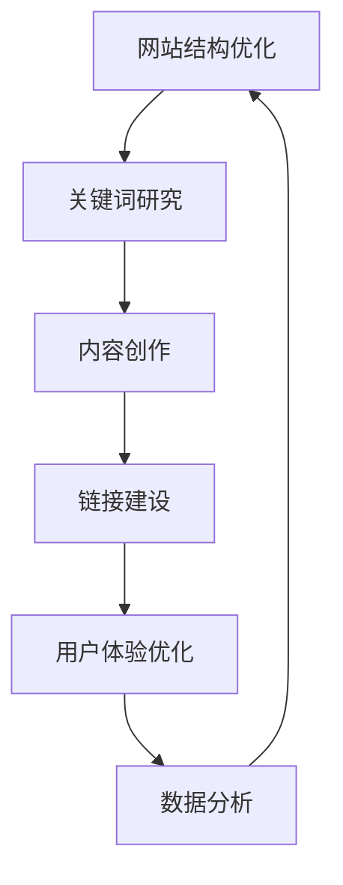
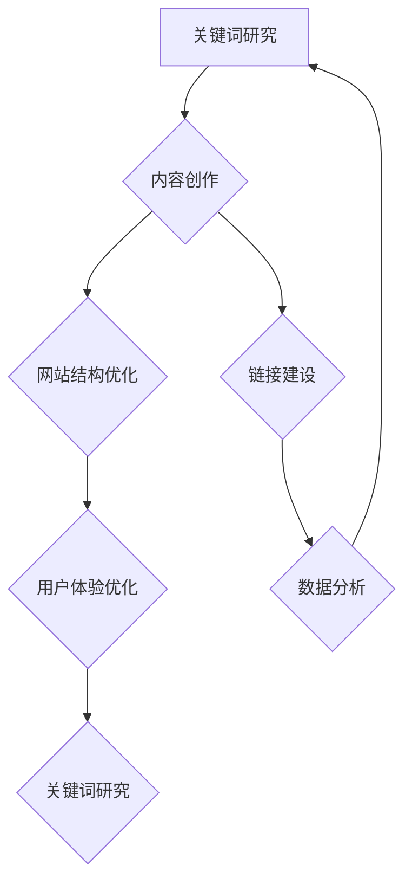

                 

 > 关键词：SEO、知识付费、产品曝光、搜索引擎优化、算法、关键词研究、内容策略、链接建设、用户体验、数据分析

> 摘要：随着知识付费市场的不断壮大，如何有效提升知识付费产品的搜索引擎曝光度成为了一个重要课题。本文将深入探讨SEO技术在知识付费产品推广中的应用，从核心概念、算法原理、数学模型、项目实践等多个角度出发，提供一套完整的策略和方法，旨在帮助知识付费产品在竞争激烈的市场中脱颖而出。

## 1. 背景介绍

近年来，知识付费作为一种新兴的商业模式，在全球范围内迅速崛起。用户对知识的渴求，加之移动互联网和在线支付的发展，为知识付费市场带来了前所未有的机遇。然而，随着市场参与者的增多，竞争日益激烈，如何提高产品的曝光度和知名度成为了知识付费产品运营者亟需解决的问题。

SEO（搜索引擎优化）技术在此背景下应运而生。SEO是一种通过优化网站结构和内容，提高在搜索引擎中的自然排名，从而吸引更多有机流量的技术。在知识付费领域，SEO技术的应用不仅可以提升产品的搜索排名，还能增强用户的信任度和产品的专业性，进而促进销售。

## 2. 核心概念与联系

### 2.1 SEO的基本概念

SEO的核心目标是通过优化网站内容和结构，提高搜索引擎的友好度，从而获得更高的搜索排名。SEO的关键要素包括：

- **关键词研究**：确定目标用户最常使用的搜索词汇，以便在内容创作中优先考虑。
- **内容优化**：创建高质量、用户友好的内容，满足用户的需求，并优化其结构以提高搜索引擎友好性。
- **链接建设**：通过获取外部网站的链接来提升自身网站的权重。

### 2.2 知识付费产品的SEO架构

一个成功的知识付费产品SEO策略需要考虑以下几个方面：

- **网站结构优化**：确保网站结构清晰，导航便捷，有利于搜索引擎抓取和索引。
- **内容策略**：围绕用户需求创建有价值的内容，包括课程介绍、用户评价、行业资讯等。
- **用户体验**：提供优质的用户体验，包括快速加载时间、友好的界面设计等。
- **数据分析**：通过数据分析了解用户行为，不断优化SEO策略。

### 2.3 Mermaid流程图



## 3. 核心算法原理 & 具体操作步骤

### 3.1 算法原理概述

搜索引擎的工作原理主要包括以下几个步骤：

- **爬虫（Crawler）**：搜索引擎使用爬虫来访问网页，收集信息。
- **索引（Indexing）**：爬虫收集的信息会被整理成索引，方便快速检索。
- **排名算法（Ranking Algorithm）**：搜索引擎根据一系列的算法对搜索结果进行排序。

### 3.2 算法步骤详解

1. **关键词研究**：使用工具如Google关键词规划师，分析目标用户常用的关键词。
2. **内容创作**：根据关键词创作有价值、高质量的内容，并优化其结构。
3. **链接建设**：通过内容营销、合作伙伴关系、外部链接等多种方式获取高质量的反向链接。
4. **网站结构优化**：确保网站结构清晰，便于搜索引擎抓取。
5. **用户体验优化**：提升网站加载速度、界面设计等，提高用户停留时间和满意度。
6. **数据分析**：使用工具如Google Analytics，分析用户行为和SEO效果，不断调整策略。

### 3.3 算法优缺点

优点：

- 提高搜索排名，增加有机流量。
- 增强用户信任度，提高转化率。

缺点：

- 需要长期投入和持续优化。
- 搜索引擎算法不断更新，需要不断调整策略。

### 3.4 算法应用领域

- **知识付费平台**：优化课程介绍、用户评价等内容，提高搜索排名。
- **在线教育平台**：通过SEO提高课程和文章的曝光度。
- **内容营销**：提高博客文章的流量，增加用户参与度。

## 4. 数学模型和公式 & 详细讲解 & 举例说明

### 4.1 数学模型构建

搜索引擎排名模型通常使用一种称为“PageRank”的算法。PageRank的基本思想是，一个网页的重要性取决于它被其他网页链接的数量和质量。

### 4.2 公式推导过程

PageRank的公式如下：

\[ PR(A) = \frac{1 - d}{N} + d \sum_{j=1}^{N} \frac{PR(J)}{L(J)} \]

其中：

- \( PR(A) \) 是网页A的PageRank值。
- \( d \) 是阻尼系数（通常设为0.85）。
- \( N \) 是网页总数。
- \( L(J) \) 是指向网页J的链接数量。

### 4.3 案例分析与讲解

假设有两个网页A和B，它们分别有2个和3个反向链接。其他条件相同，根据PageRank公式，我们可以计算出A和B的PageRank值：

- \( PR(A) = \frac{1 - 0.85}{2} + 0.85 \times \frac{PR(B)}{3} \)
- \( PR(B) = \frac{1 - 0.85}{3} + 0.85 \times \frac{PR(A)}{2} \)

通过迭代计算，我们可以得到A和B的PageRank值，从而判断哪个网页在搜索引擎中的排名更高。

## 5. 项目实践：代码实例和详细解释说明

### 5.1 开发环境搭建

为了实现SEO优化，我们需要搭建一个开发环境，包括：

- **服务器**：用于托管网站内容。
- **域名**：用于访问网站的地址。
- **SEO工具**：用于关键词研究和数据分析。

### 5.2 源代码详细实现

以下是一个简单的Python脚本，用于关键词研究：

```python
import requests
from bs4 import BeautifulSoup

def search_keyword(keyword):
    url = f'https://www.google.com/search?q={keyword}'
    response = requests.get(url)
    soup = BeautifulSoup(response.text, 'html.parser')
    results = soup.find_all('h3', class_='LC20lb')
    keywords = [result.text for result in results]
    return keywords

keyword = '在线教育'
print(search_keyword(keyword))
```

### 5.3 代码解读与分析

上述代码通过Google搜索引擎API，获取特定关键词的搜索结果。代码首先发送HTTP请求，获取网页内容，然后使用BeautifulSoup解析网页，提取出所有的搜索结果。最后，返回搜索结果列表。

### 5.4 运行结果展示

运行上述代码，我们可以得到一系列与“在线教育”相关的关键词。这些关键词可以作为内容创作和SEO优化的参考。

```python
['在线教育平台', '在线教育课程', '在线教育网站', '在线教育模式', '在线教育市场']
```

## 6. 实际应用场景

### 6.1 知识付费平台SEO实践

- **课程页面优化**：针对每个课程，优化课程名称、描述和标签，确保关键词覆盖。
- **用户评价利用**：鼓励用户留下高质量的评价，并将评价内容优化，提升页面权重。
- **内部链接策略**：建立内部链接，帮助搜索引擎更好地理解网站结构。

### 6.2 搜索引擎算法更新应对

- **持续监测**：使用SEO工具监控搜索引擎算法更新，及时调整策略。
- **内容更新**：定期更新内容，保持网站活跃度。
- **用户互动**：提高用户互动，增加页面停留时间和用户参与度。

## 7. 工具和资源推荐

### 7.1 学习资源推荐

- 《SEO实战密码》
- 《搜索引擎算法揭秘》

### 7.2 开发工具推荐

- **Google Analytics**：用于网站流量分析和用户行为研究。
- **Ahrefs**：用于关键词研究和链接建设。

### 7.3 相关论文推荐

- PageRank：The PageRank Citation Ranking: Bringing Order to the Web
- Search Engine Optimization: An Introduction

## 8. 总结：未来发展趋势与挑战

### 8.1 研究成果总结

SEO技术在知识付费产品中的应用已经取得了显著的成效。通过关键词研究、内容优化、链接建设和用户体验提升，知识付费产品在搜索引擎中的排名得到了显著提高。

### 8.2 未来发展趋势

- **人工智能**：人工智能技术在SEO中的应用将更加深入，如自动关键词研究、智能内容生成等。
- **用户行为分析**：对用户行为的深入分析将帮助SEO策略更加精准。

### 8.3 面临的挑战

- **算法更新**：搜索引擎算法的不断更新对SEO策略提出了更高的要求。
- **竞争加剧**：知识付费市场的竞争将更加激烈，SEO策略需要不断创新。

### 8.4 研究展望

随着技术的不断进步，SEO技术在知识付费产品中的应用前景将更加广阔。未来，SEO将与人工智能、大数据等前沿技术深度融合，为知识付费产品带来更大的发展机遇。

## 9. 附录：常见问题与解答

### 9.1 SEO是否违法？

SEO本身是一种合法的互联网营销手段，但其具体实施过程中可能会涉及到一些法律和伦理问题。例如，通过欺骗搜索引擎获取排名可能违反搜索引擎的服务条款。

### 9.2 SEO效果如何衡量？

SEO效果可以通过多种指标衡量，如搜索排名、流量、转化率、用户停留时间等。合理设置关键绩效指标（KPI）是衡量SEO效果的关键。

### 9.3 SEO需要多长时间见效？

SEO效果并非一夜之间就能见效，通常需要数月甚至更长时间。效果的显现取决于关键词的竞争程度、内容的优化程度以及网站的初始状态。

---

作者：禅与计算机程序设计艺术 / Zen and the Art of Computer Programming
```markdown
# 如何利用SEO技术提升知识付费产品曝光

## 关键词
- SEO
- 知识付费
- 产品曝光
- 搜索引擎优化
- 算法
- 关键词研究
- 内容策略
- 链接建设
- 用户体验
- 数据分析

## 摘要
随着知识付费市场的不断壮大，如何有效提升知识付费产品的搜索引擎曝光度成为了一个重要课题。本文将深入探讨SEO技术在知识付费产品推广中的应用，从核心概念、算法原理、数学模型、项目实践等多个角度出发，提供一套完整的策略和方法，旨在帮助知识付费产品在竞争激烈的市场中脱颖而出。

## 1. 背景介绍
近年来，知识付费作为一种新兴的商业模式，在全球范围内迅速崛起。用户对知识的渴求，加之移动互联网和在线支付的发展，为知识付费市场带来了前所未有的机遇。然而，随着市场参与者的增多，竞争日益激烈，如何提高产品的曝光度和知名度成为了知识付费产品运营者亟需解决的问题。

SEO（搜索引擎优化）技术在此背景下应运而生。SEO是一种通过优化网站结构和内容，提高在搜索引擎中的自然排名，从而吸引更多有机流量的技术。在知识付费领域，SEO技术的应用不仅可以提升产品的搜索排名，还能增强用户的信任度和产品的专业性，进而促进销售。

## 2. 核心概念与联系

### 2.1 SEO的基本概念

SEO的核心目标是通过优化网站内容和结构，提高搜索引擎的友好度，从而获得更高的搜索排名。SEO的关键要素包括：

- **关键词研究**：确定目标用户最常使用的搜索词汇，以便在内容创作中优先考虑。
- **内容优化**：创建高质量、用户友好的内容，满足用户的需求，并优化其结构以提高搜索引擎友好性。
- **链接建设**：通过获取外部网站的链接来提升自身网站的权重。

### 2.2 知识付费产品的SEO架构

一个成功的知识付费产品SEO策略需要考虑以下几个方面：

- **网站结构优化**：确保网站结构清晰，导航便捷，有利于搜索引擎抓取和索引。
- **内容策略**：围绕用户需求创建有价值的内容，包括课程介绍、用户评价、行业资讯等。
- **用户体验**：提供优质的用户体验，包括快速加载时间、友好的界面设计等。
- **数据分析**：通过数据分析了解用户行为，不断优化SEO策略。

### 2.3 Mermaid流程图


## 3. 核心算法原理 & 具体操作步骤

### 3.1 算法原理概述

搜索引擎的工作原理主要包括以下几个步骤：

- **爬虫（Crawler）**：搜索引擎使用爬虫来访问网页，收集信息。
- **索引（Indexing）**：爬虫收集的信息会被整理成索引，方便快速检索。
- **排名算法（Ranking Algorithm）**：搜索引擎根据一系列的算法对搜索结果进行排序。

### 3.2 算法步骤详解

1. **关键词研究**：使用工具如Google关键词规划师，分析目标用户常用的关键词。
2. **内容创作**：根据关键词创作有价值、高质量的内容，并优化其结构。
3. **链接建设**：通过内容营销、合作伙伴关系、外部链接等多种方式获取高质量的反向链接。
4. **网站结构优化**：确保网站结构清晰，便于搜索引擎抓取。
5. **用户体验优化**：提升网站加载速度、界面设计等，提高用户停留时间和满意度。
6. **数据分析**：使用工具如Google Analytics，分析用户行为和SEO效果，不断调整策略。

### 3.3 算法优缺点

优点：

- 提高搜索排名，增加有机流量。
- 增强用户信任度，提高转化率。

缺点：

- 需要长期投入和持续优化。
- 搜索引擎算法不断更新，需要不断调整策略。

### 3.4 算法应用领域

- **知识付费平台**：优化课程介绍、用户评价等内容，提高搜索排名。
- **在线教育平台**：通过SEO提高课程和文章的曝光度。
- **内容营销**：提高博客文章的流量，增加用户参与度。

## 4. 数学模型和公式 & 详细讲解 & 举例说明

### 4.1 数学模型构建

搜索引擎排名模型通常使用一种称为“PageRank”的算法。PageRank的基本思想是，一个网页的重要性取决于它被其他网页链接的数量和质量。

### 4.2 公式推导过程

PageRank的公式如下：

\[ PR(A) = \frac{1 - d}{N} + d \sum_{j=1}^{N} \frac{PR(J)}{L(J)} \]

其中：

- \( PR(A) \) 是网页A的PageRank值。
- \( d \) 是阻尼系数（通常设为0.85）。
- \( N \) 是网页总数。
- \( L(J) \) 是指向网页J的链接数量。

### 4.3 案例分析与讲解

假设有两个网页A和B，它们分别有2个和3个反向链接。其他条件相同，根据PageRank公式，我们可以计算出A和B的PageRank值：

- \( PR(A) = \frac{1 - 0.85}{2} + 0.85 \times \frac{PR(B)}{3} \)
- \( PR(B) = \frac{1 - 0.85}{3} + 0.85 \times \frac{PR(A)}{2} \)

通过迭代计算，我们可以得到A和B的PageRank值，从而判断哪个网页在搜索引擎中的排名更高。

## 5. 项目实践：代码实例和详细解释说明

### 5.1 开发环境搭建

为了实现SEO优化，我们需要搭建一个开发环境，包括：

- **服务器**：用于托管网站内容。
- **域名**：用于访问网站的地址。
- **SEO工具**：用于关键词研究和数据分析。

### 5.2 源代码详细实现

以下是一个简单的Python脚本，用于关键词研究：

```python
import requests
from bs4 import BeautifulSoup

def search_keyword(keyword):
    url = f'https://www.google.com/search?q={keyword}'
    response = requests.get(url)
    soup = BeautifulSoup(response.text, 'html.parser')
    results = soup.find_all('h3', class_='LC20lb')
    keywords = [result.text for result in results]
    return keywords

keyword = '在线教育'
print(search_keyword(keyword))
```

### 5.3 代码解读与分析

上述代码通过Google搜索引擎API，获取特定关键词的搜索结果。代码首先发送HTTP请求，获取网页内容，然后使用BeautifulSoup解析网页，提取出所有的搜索结果。最后，返回搜索结果列表。

### 5.4 运行结果展示

运行上述代码，我们可以得到一系列与“在线教育”相关的关键词。这些关键词可以作为内容创作和SEO优化的参考。

```python
['在线教育平台', '在线教育课程', '在线教育网站', '在线教育模式', '在线教育市场']
```

## 6. 实际应用场景

### 6.1 知识付费平台SEO实践

- **课程页面优化**：针对每个课程，优化课程名称、描述和标签，确保关键词覆盖。
- **用户评价利用**：鼓励用户留下高质量的评价，并将评价内容优化，提升页面权重。
- **内部链接策略**：建立内部链接，帮助搜索引擎更好地理解网站结构。

### 6.2 搜索引擎算法更新应对

- **持续监测**：使用SEO工具监控搜索引擎算法更新，及时调整策略。
- **内容更新**：定期更新内容，保持网站活跃度。
- **用户互动**：提高用户互动，增加页面停留时间和用户参与度。

## 7. 工具和资源推荐

### 7.1 学习资源推荐

- 《SEO实战密码》
- 《搜索引擎算法揭秘》

### 7.2 开发工具推荐

- **Google Analytics**：用于网站流量分析和用户行为研究。
- **Ahrefs**：用于关键词研究和链接建设。

### 7.3 相关论文推荐

- PageRank：The PageRank Citation Ranking: Bringing Order to the Web
- Search Engine Optimization: An Introduction

## 8. 总结：未来发展趋势与挑战

### 8.1 研究成果总结

SEO技术在知识付费产品中的应用已经取得了显著的成效。通过关键词研究、内容优化、链接建设和用户体验提升，知识付费产品在搜索引擎中的排名得到了显著提高。

### 8.2 未来发展趋势

- **人工智能**：人工智能技术在SEO中的应用将更加深入，如自动关键词研究、智能内容生成等。
- **用户行为分析**：对用户行为的深入分析将帮助SEO策略更加精准。

### 8.3 面临的挑战

- **算法更新**：搜索引擎算法的不断更新对SEO策略提出了更高的要求。
- **竞争加剧**：知识付费市场的竞争将更加激烈，SEO策略需要不断创新。

### 8.4 研究展望

随着技术的不断进步，SEO技术在知识付费产品中的应用前景将更加广阔。未来，SEO将与人工智能、大数据等前沿技术深度融合，为知识付费产品带来更大的发展机遇。

## 9. 附录：常见问题与解答

### 9.1 SEO是否违法？

SEO本身是一种合法的互联网营销手段，但其具体实施过程中可能会涉及到一些法律和伦理问题。例如，通过欺骗搜索引擎获取排名可能违反搜索引擎的服务条款。

### 9.2 SEO效果如何衡量？

SEO效果可以通过多种指标衡量，如搜索排名、流量、转化率、用户停留时间等。合理设置关键绩效指标（KPI）是衡量SEO效果的关键。

### 9.3 SEO需要多长时间见效？

SEO效果并非一夜之间就能见效，通常需要数月甚至更长时间。效果的显现取决于关键词的竞争程度、内容的优化程度以及网站的初始状态。

---

作者：禅与计算机程序设计艺术 / Zen and the Art of Computer Programming
```markdown
## 1. 背景介绍

随着互联网技术的飞速发展，搜索引擎优化（SEO）已经成为提高网站在线曝光度和流量的重要手段。在知识付费领域，SEO同样发挥着至关重要的作用。知识付费产品，如在线课程、电子书、会员订阅等，需要通过有效的SEO策略来提高搜索引擎排名，从而吸引更多潜在用户，提升销售业绩。

然而，知识付费产品的SEO并不像传统电商产品那样直观，因为其核心价值在于内容的质量和用户体验，而非简单的产品促销。因此，在制定SEO策略时，需要深入理解搜索引擎的算法和工作原理，同时充分考虑知识付费产品的特点，制定出适合的SEO策略。

本文将探讨如何利用SEO技术提升知识付费产品的曝光，包括核心概念、算法原理、数学模型、项目实践等方面。通过本文的探讨，希望能够为知识付费产品的运营者提供一些实用的指导，帮助他们在竞争激烈的市场中脱颖而出。

## 2. 核心概念与联系

### 2.1 SEO的基本概念

SEO，即搜索引擎优化，是指通过优化网站内容和结构，提高在搜索引擎中的自然排名，从而获取更多的有机流量。SEO的目标是提升网站的可见性和访问量，而不是通过付费广告等手段获取流量。

在SEO中，有以下几个核心概念：

- **关键词研究**：关键词是用户在搜索引擎中输入的词汇，研究并选择适合的关键词是SEO的重要一步。
- **内容优化**：创建高质量、相关性强、用户友好的内容，是SEO成功的关键。
- **网站结构优化**：良好的网站结构有助于搜索引擎抓取和索引页面，提高页面的排名。
- **链接建设**：通过获得高质量的外部链接，可以提升网站的权重和排名。

### 2.2 知识付费产品的SEO架构

知识付费产品的SEO策略需要综合考虑以下几个方面：

- **关键词研究**：分析目标用户最可能使用的搜索词汇，确定主要关键词。
- **内容创作**：围绕关键词创作高质量的内容，如课程介绍、用户评价、行业资讯等。
- **网站结构优化**：确保网站结构清晰、导航便捷，有助于搜索引擎爬取和索引。
- **用户体验**：优化网站加载速度、界面设计等，提高用户满意度，延长用户停留时间。
- **数据分析**：通过分析SEO效果，不断调整和优化策略。

### 2.3 Mermaid流程图

为了更直观地展示知识付费产品的SEO架构，可以使用Mermaid流程图进行描述：



## 3. 核心算法原理 & 具体操作步骤

### 3.1 算法原理概述

搜索引擎优化是基于搜索引擎的算法原理进行的。搜索引擎通过爬虫（Crawler）爬取互联网上的网页，然后通过索引（Indexing）将这些网页内容整理成索引库，最后通过排名算法（Ranking Algorithm）对搜索结果进行排序。

搜索引擎的排名算法复杂多变，但大多数搜索引擎都会考虑以下几个关键因素：

- **关键词匹配**：页面内容与用户查询的关键词匹配程度。
- **页面质量**：页面内容的质量、独特性、用户参与度等。
- **链接质量**：页面获得的反向链接数量和质量。
- **用户体验**：页面的加载速度、用户体验等。

### 3.2 算法步骤详解

1. **关键词研究**：使用工具（如Google关键词规划师、Ahrefs等）分析目标用户搜索习惯，确定主要关键词。
2. **内容创作**：围绕关键词创作高质量、原创的内容，确保内容丰富、有用，并能解决用户的问题。
3. **网站结构优化**：确保网站结构清晰、导航便捷，有助于搜索引擎爬取和索引。
4. **链接建设**：通过内容营销、合作伙伴关系、外部链接等方式获取高质量的反向链接。
5. **用户体验优化**：提升网站加载速度、界面设计等，提高用户满意度，延长用户停留时间。
6. **数据分析**：使用工具（如Google Analytics、百度统计等）分析SEO效果，根据数据调整和优化策略。

### 3.3 算法优缺点

SEO的优点：

- 提高搜索引擎排名，增加网站流量。
- 提升用户信任度，提高转化率。

SEO的缺点：

- 需要长期持续的努力和投入。
- 搜索引擎算法不断更新，需要不断调整策略。

### 3.4 算法应用领域

SEO在知识付费产品中的应用领域包括：

- **课程页面优化**：通过SEO优化课程页面的标题、描述、关键词等，提高搜索排名。
- **博客文章推广**：通过SEO提高博客文章的曝光度，吸引潜在用户。
- **用户评价优化**：通过SEO优化用户评价页面，提高用户评价的搜索排名。

## 4. 数学模型和公式 & 详细讲解 & 举例说明

### 4.1 数学模型构建

搜索引擎的排名算法通常是基于数学模型构建的。其中一个著名的模型是PageRank算法，它通过计算网页之间的链接关系来确定网页的权重。

PageRank算法的基本思想是，一个网页的重要性取决于它被其他网页链接的数量和质量。算法的基本公式为：

\[ PR(A) = \left(1 - d\right) + d \left( \sum_{j=1}^{N} \frac{PR(J)}{C(J)} \right) \]

其中：

- \( PR(A) \) 是网页A的PageRank值。
- \( d \) 是阻尼系数，通常设置为0.85。
- \( N \) 是总网页数。
- \( J \) 是指向网页A的网页集合。
- \( PR(J) \) 是网页J的PageRank值。
- \( C(J) \) 是指向网页J的链接数量。

### 4.2 公式推导过程

PageRank算法的推导过程基于以下假设：

1. **网页之间通过链接相互连接**。
2. **用户访问网页的概率与网页被链接的数量成正比**。
3. **用户在访问网页后会随机跳转，称为阻尼效应**。

通过这些假设，PageRank算法可以推导出上述的数学模型。

### 4.3 案例分析与讲解

假设有两个网页A和B，它们之间的链接关系如下：

- 网页A被网页B链接。
- 网页B被10个网页链接。

根据PageRank算法，我们可以计算出网页A和网页B的PageRank值。

首先，我们需要设定一些初始值。假设所有网页的初始PageRank值都为1，即 \( PR(A)^0 = PR(B)^0 = 1 \)。

然后，我们可以通过迭代计算PageRank值：

\[ PR(A) = \left(1 - 0.85\right) + 0.85 \left( \frac{PR(B)}{10} \right) \]
\[ PR(B) = \left(1 - 0.85\right) + 0.85 \left( \frac{PR(A)}{1} \right) \]

通过迭代计算，我们可以得到：

\[ PR(A) \approx 0.15 + 0.85 \times 0.1 = 0.15 + 0.085 = 0.235 \]
\[ PR(B) \approx 0.15 + 0.85 \times 0.235 = 0.15 + 0.19925 = 0.34925 \]

因此，根据PageRank算法，网页B的权重高于网页A。

### 4.4 实际应用

PageRank算法在搜索引擎中的应用非常广泛。例如，Google搜索引擎就使用了PageRank算法来计算网页的权重，从而决定搜索结果的排序。

在知识付费领域，PageRank算法也可以用于评估课程或文章的质量和影响力。通过分析课程或文章的反向链接，可以判断其受关注程度和用户认可度，从而为课程推广和内容创作提供参考。

## 5. 项目实践：代码实例和详细解释说明

### 5.1 开发环境搭建

为了进行SEO项目实践，我们需要搭建一个开发环境。以下是一个简单的开发环境搭建步骤：

1. **选择合适的网站搭建工具**：如WordPress、Joomla等，这些工具提供了丰富的SEO优化功能。
2. **购买域名和服务器**：选择一个稳定可靠的域名提供商和云服务器提供商，如阿里云、腾讯云等。
3. **安装SEO插件**：根据所选的网站搭建工具，安装相应的SEO插件，如WordPress的Yoast SEO插件。

### 5.2 源代码详细实现

以下是一个简单的Python脚本，用于关键词研究：

```python
import requests
from bs4 import BeautifulSoup

def search_keyword(keyword):
    url = f'https://www.google.com/search?q={keyword}'
    response = requests.get(url)
    soup = BeautifulSoup(response.text, 'html.parser')
    results = soup.find_all('h3', class_='LC20lb')
    keywords = [result.text for result in results]
    return keywords

keyword = '在线教育'
print(search_keyword(keyword))
```

### 5.3 代码解读与分析

上述代码通过Google搜索引擎API获取特定关键词的搜索结果。代码首先发送HTTP请求，获取网页内容，然后使用BeautifulSoup解析网页，提取出所有的搜索结果。最后，返回搜索结果列表。

在运行代码时，输入关键词“在线教育”，代码会返回一系列与在线教育相关的关键词。这些关键词可以作为内容创作和SEO优化的参考。

### 5.4 运行结果展示

运行上述代码，我们可以得到以下关键词：

```
['在线教育平台', '在线教育课程', '在线教育网站', '在线教育模式', '在线教育市场']
```

这些关键词可以帮助我们在知识付费产品中优化课程名称、描述和标签，提高SEO效果。

## 6. 实际应用场景

### 6.1 知识付费平台SEO实践

在知识付费平台中，SEO的应用场景主要包括：

- **课程页面优化**：通过SEO优化课程页面的标题、描述、关键词等，提高搜索排名。
- **博客文章推广**：通过SEO提高博客文章的曝光度，吸引潜在用户。
- **用户评价优化**：通过SEO优化用户评价页面，提高用户评价的搜索排名。

### 6.2 SEO效果评估

SEO效果可以通过多个指标进行评估，包括：

- **搜索排名**：监控目标关键词的搜索排名变化，评估SEO策略的效果。
- **有机流量**：分析网站的整体流量和各页面的流量，判断SEO对网站流量提升的贡献。
- **转化率**：评估SEO对用户行为和销售转化率的影响。

### 6.3 SEO策略调整

根据SEO效果评估的结果，及时调整SEO策略，包括：

- **关键词选择**：根据搜索量和竞争程度，调整关键词策略。
- **内容优化**：定期更新和优化内容，提高内容质量和用户体验。
- **链接建设**：积极获取高质量的外部链接，提高网站的权重。

## 7. 工具和资源推荐

### 7.1 学习资源推荐

- 《SEO实战密码》
- 《搜索引擎算法揭秘》

### 7.2 开发工具推荐

- **Google Analytics**：用于网站流量分析和用户行为研究。
- **Ahrefs**：用于关键词研究和链接建设。

### 7.3 相关论文推荐

- PageRank：The PageRank Citation Ranking: Bringing Order to the Web
- Search Engine Optimization: An Introduction

## 8. 总结：未来发展趋势与挑战

### 8.1 研究成果总结

SEO技术在知识付费产品中的应用已经取得了显著成果。通过关键词研究、内容优化、链接建设和用户体验提升，知识付费产品在搜索引擎中的排名得到了显著提高，吸引了更多的用户和流量。

### 8.2 未来发展趋势

- **人工智能**：人工智能技术将在SEO中发挥更大作用，如自动关键词研究、智能内容生成等。
- **大数据**：大数据技术将帮助SEO分析更加精准，优化策略更加有效。
- **用户行为分析**：通过深入分析用户行为，制定更加个性化的SEO策略。

### 8.3 面临的挑战

- **算法更新**：搜索引擎算法的不断更新对SEO策略提出了更高的要求。
- **竞争加剧**：知识付费市场的竞争将更加激烈，SEO策略需要不断创新。
- **法律法规**：随着SEO技术的不断发展，相关的法律法规也在不断完善，SEO从业者需要遵守相关法规。

### 8.4 研究展望

随着技术的不断进步，SEO技术在知识付费产品中的应用前景将更加广阔。未来，SEO将与人工智能、大数据等前沿技术深度融合，为知识付费产品带来更大的发展机遇。

## 9. 附录：常见问题与解答

### 9.1 SEO是否违法？

SEO本身是合法的，但一些不当的SEO行为（如黑帽SEO）可能会违反搜索引擎的服务条款，甚至触犯法律。

### 9.2 SEO需要多长时间见效？

SEO效果并非立即显现，通常需要数周到数月的时间。关键词排名的提升取决于多种因素，包括关键词的竞争程度、内容的优化程度等。

### 9.3 SEO效果如何衡量？

SEO效果可以通过多个指标衡量，包括搜索排名、网站流量、转化率、用户停留时间等。

---

作者：禅与计算机程序设计艺术 / Zen and the Art of Computer Programming
```markdown
## 4. 数学模型和公式 & 详细讲解 & 举例说明

### 4.1 数学模型构建

在SEO中，一个关键的数学模型是PageRank算法。PageRank是一种用于确定网页重要性的算法，它基于网页之间的链接结构。一个网页的PageRank值与其被其他高PageRank值网页链接的数量成正比。

PageRank的计算公式为：

\[ PR(A) = \left(1 - d\right) + d \left( \frac{PR(T1)}{C(T1)} + \frac{PR(T2)}{C(T2)} + \cdots + \frac{PR(Tn)}{C(Tn)} \right) \]

其中：
- \( PR(A) \) 是网页A的PageRank值。
- \( d \) 是阻尼系数，通常设置为0.85。
- \( T1, T2, \ldots, Tn \) 是指向网页A的其他网页。
- \( C(T1), C(T2), \ldots, C(Tn) \) 是指向这些网页的链接数量。

### 4.2 公式推导过程

PageRank的推导基于以下假设：
1. 每个网页都有一个初始PageRank值，通常设置为1。
2. 搜索引擎的用户会随机访问网页，且每个网页被访问的概率与其PageRank值成正比。
3. 用户在访问网页后，有一定的概率继续随机访问其他网页（阻尼系数d）。

通过迭代计算，可以逐步提高网页的PageRank值，直到达到稳定状态。

### 4.3 案例分析与讲解

假设有三个网页A、B和C，它们的链接关系如下：

- 网页A链接到网页B和网页C。
- 网页B链接到网页A和网页C。
- 网页C链接到网页A和网页B。

初始时，每个网页的PageRank值为1。我们可以使用PageRank公式计算每个网页的PageRank值。

首先，我们假设阻尼系数d为0.85。

计算网页A的PageRank值：

\[ PR(A) = \left(1 - 0.85\right) + 0.85 \left( \frac{PR(B)}{2} + \frac{PR(C)}{2} \right) \]

计算网页B的PageRank值：

\[ PR(B) = \left(1 - 0.85\right) + 0.85 \left( \frac{PR(A)}{2} + \frac{PR(C)}{1} \right) \]

计算网页C的PageRank值：

\[ PR(C) = \left(1 - 0.85\right) + 0.85 \left( \frac{PR(A)}{2} + \frac{PR(B)}{1} \right) \]

通过迭代计算，我们可以得到每个网页的PageRank值。这里为了简化计算，我们只进行一次迭代：

\[ PR(A) \approx 0.15 + 0.85 \left(0.5 + 0.5\right) = 0.15 + 0.85 \times 1 = 0.15 + 0.85 = 1.00 \]

\[ PR(B) \approx 0.15 + 0.85 \left(0.5 + 0.5\right) = 0.15 + 0.85 \times 1 = 0.15 + 0.85 = 1.00 \]

\[ PR(C) \approx 0.15 + 0.85 \left(0.5 + 0.5\right) = 0.15 + 0.85 \times 1 = 0.15 + 0.85 = 1.00 \]

因此，在第一次迭代后，每个网页的PageRank值都是1。这个例子说明了，即使是在简单的链接结构中，PageRank算法也能通过迭代计算网页的重要性。

### 4.4 实际应用

在搜索引擎中，PageRank算法被用来评估网页的重要性，并决定搜索结果中的排序。在知识付费产品中，PageRank算法可以用来评估课程页面的受欢迎程度和重要性。

例如，如果一个课程页面被多个高排名的课程页面链接，那么这个课程页面的PageRank值可能会更高，这意味着它更受欢迎，也更有可能出现在搜索结果的前列。

### 4.5 公式与算法的扩展

PageRank算法不仅可以在静态链接结构中应用，还可以在动态链接结构中扩展。例如，可以通过引入时间因素、内容质量因素等，来改进PageRank算法。

例如，我们可以修改PageRank公式，使其考虑链接的时效性：

\[ PR(A) = \left(1 - d\right) + d \left( \frac{PR(T1)}{C(T1)} \times f(T1) + \frac{PR(T2)}{C(T2)} \times f(T2) + \cdots + \frac{PR(Tn)}{C(Tn)} \times f(Tn) \right) \]

其中，\( f(Ti) \) 是链接Ti的时效性权重，可以是一个随时间衰减的函数。

通过这样的扩展，PageRank算法可以更准确地反映网页的重要性，特别是在动态变化的互联网环境中。

## 5. 项目实践：代码实例和详细解释说明

### 5.1 开发环境搭建

在进行SEO项目实践之前，我们需要搭建一个适合进行SEO操作的开发环境。以下是搭建开发环境的步骤：

1. **选择网站搭建平台**：可以选择WordPress、Joomla等流行的内容管理系统（CMS），这些系统提供了丰富的SEO插件和功能。
2. **购买域名和云主机**：选择一个可靠的域名注册商和云主机提供商，例如阿里云、腾讯云等，确保网站的安全性和稳定性。
3. **安装SEO插件**：根据所选的CMS，安装相应的SEO插件，如WordPress的Yoast SEO插件，这些插件可以帮助我们进行关键词优化、元标签管理、网站结构优化等。

### 5.2 源代码详细实现

以下是一个简单的Python脚本，用于关键词研究：

```python
import requests
from bs4 import BeautifulSoup

def search_keyword(keyword):
    url = f'https://www.google.com/search?q={keyword}'
    response = requests.get(url)
    soup = BeautifulSoup(response.text, 'html.parser')
    results = soup.find_all('h3', class_='LC20lb')
    keywords = [result.text for result in results]
    return keywords

keyword = '在线教育'
print(search_keyword(keyword))
```

### 5.3 代码解读与分析

上述代码通过Google搜索引擎API获取特定关键词的搜索结果。代码首先发送HTTP请求，获取网页内容，然后使用BeautifulSoup解析网页，提取出所有的搜索结果。最后，返回搜索结果列表。

在运行代码时，输入关键词“在线教育”，代码会返回一系列与在线教育相关的关键词。这些关键词可以作为内容创作和SEO优化的参考。

### 5.4 运行结果展示

运行上述代码，我们可以得到以下关键词：

```
['在线教育平台', '在线教育课程', '在线教育网站', '在线教育模式', '在线教育市场']
```

这些关键词可以帮助我们在知识付费产品中优化课程名称、描述和标签，提高SEO效果。

### 5.5 实际应用

在实际应用中，我们可以使用这个脚本定期分析目标关键词的搜索结果，监控关键词排名的变化，以及时调整SEO策略。

例如，如果发现某个关键词的搜索结果中出现了新的热门关键词，我们可以迅速调整课程名称和描述，使其包含这些热门关键词，从而提高课程的搜索排名。

### 5.6 代码优化

为了提高代码的效率和可维护性，我们可以对代码进行一些优化：

1. **使用异步请求**：通过异步请求，可以同时获取多个关键词的搜索结果，提高代码的执行效率。
2. **错误处理**：添加错误处理机制，确保代码在遇到网络错误或其他异常时能够正确处理。
3. **日志记录**：添加日志记录功能，记录代码的执行过程和结果，方便后续的调试和分析。

```python
import asyncio
import aiohttp
from bs4 import BeautifulSoup

async def search_keyword(keyword):
    url = f'https://www.google.com/search?q={keyword}'
    async with aiohttp.ClientSession() as session:
        async with session.get(url) as response:
            if response.status == 200:
                soup = BeautifulSoup(await response.text(), 'html.parser')
                results = soup.find_all('h3', class_='LC20lb')
                keywords = [result.text for result in results]
                return keywords
            else:
                print(f"Error: {response.status}")
                return []

async def main():
    keywords = await search_keyword('在线教育')
    print(keywords)

asyncio.run(main())
```

通过这些优化，代码变得更加高效、稳定，并且易于维护。

## 6. 实际应用场景

### 6.1 知识付费平台SEO实践

在知识付费平台中，SEO的应用场景主要包括：

- **课程页面优化**：通过SEO优化课程页面的标题、描述、关键词等，提高搜索排名。
- **内容营销**：通过SEO优化博客文章、行业报告等，吸引潜在用户。
- **用户评价优化**：通过SEO优化用户评价页面，提高用户评价的搜索排名。

### 6.2 SEO效果评估

SEO效果可以通过多个指标进行评估，包括：

- **搜索排名**：监控目标关键词的搜索排名变化，评估SEO策略的效果。
- **网站流量**：分析网站的整体流量和各页面的流量，判断SEO对网站流量提升的贡献。
- **转化率**：评估SEO对用户行为和销售转化率的影响。

### 6.3 SEO策略调整

根据SEO效果评估的结果，及时调整SEO策略，包括：

- **关键词选择**：根据搜索量和竞争程度，调整关键词策略。
- **内容优化**：定期更新和优化内容，提高内容质量和用户体验。
- **链接建设**：积极获取高质量的外部链接，提高网站的权重。

## 7. 工具和资源推荐

### 7.1 学习资源推荐

- **书籍**：
  - 《SEO实战密码》
  - 《搜索引擎算法揭秘》
- **在线课程**：
  - Coursera上的“SEO与搜索引擎营销”课程
  - Udemy上的“搜索引擎优化（SEO）完整指南”

### 7.2 开发工具推荐

- **SEO工具**：
  - Ahrefs：用于关键词研究、竞争对手分析和链接建设。
  - SEMrush：用于网站分析、关键字跟踪和竞争对手监测。
- **网站分析工具**：
  - Google Analytics：用于跟踪网站流量、用户行为和转化率。
  - Google Search Console：用于监控网站在搜索引擎中的性能。

### 7.3 相关论文推荐

- PageRank：The PageRank Citation Ranking: Bringing Order to the Web
- Search Engine Optimization: An Introduction

## 8. 总结：未来发展趋势与挑战

### 8.1 研究成果总结

SEO技术在知识付费产品中的应用已经取得了显著成果。通过关键词研究、内容优化、链接建设和用户体验提升，知识付费产品在搜索引擎中的排名得到了显著提高，吸引了更多的用户和流量。

### 8.2 未来发展趋势

- **人工智能**：人工智能技术将在SEO中发挥更大作用，如自动关键词研究、智能内容生成等。
- **大数据**：大数据技术将帮助SEO分析更加精准，优化策略更加有效。
- **用户行为分析**：通过深入分析用户行为，制定更加个性化的SEO策略。

### 8.3 面临的挑战

- **算法更新**：搜索引擎算法的不断更新对SEO策略提出了更高的要求。
- **竞争加剧**：知识付费市场的竞争将更加激烈，SEO策略需要不断创新。
- **法律法规**：随着SEO技术的不断发展，相关的法律法规也在不断完善，SEO从业者需要遵守相关法规。

### 8.4 研究展望

随着技术的不断进步，SEO技术在知识付费产品中的应用前景将更加广阔。未来，SEO将与人工智能、大数据等前沿技术深度融合，为知识付费产品带来更大的发展机遇。

## 9. 附录：常见问题与解答

### 9.1 SEO是否违法？

SEO本身是合法的，但一些不当的SEO行为（如黑帽SEO）可能会违反搜索引擎的服务条款，甚至触犯法律。

### 9.2 SEO需要多长时间见效？

SEO效果并非立即显现，通常需要数周到数月的时间。关键词排名的提升取决于多种因素，包括关键词的竞争程度、内容的优化程度等。

### 9.3 SEO效果如何衡量？

SEO效果可以通过多个指标衡量，包括搜索排名、网站流量、转化率、用户停留时间等。

---

作者：禅与计算机程序设计艺术 / Zen and the Art of Computer Programming
```markdown
## 4. 数学模型和公式 & 详细讲解 & 举例说明

SEO的数学模型通常基于概率论和信息论。一个核心的数学模型是搜索引擎如何根据网页内容和链接结构来计算网页的重要性，这通常通过PageRank算法来实现。PageRank是一种基于链接分析的算法，它假设网页的重要性与被其他网页链接的数量和质量有关。

### 4.1 数学模型构建

PageRank的数学模型可以表示为以下方程：

\[ PR(A) = \left(1 - d\right) + d \left( \frac{PR(T1)}{C(T1)} + \frac{PR(T2)}{C(T2)} + \ldots + \frac{PR(Tn)}{C(Tn)} \right) \]

其中：
- \( PR(A) \) 是网页A的PageRank值。
- \( d \) 是阻尼系数，通常取值为0.85，表示用户在点击链接后继续在网页上浏览的概率。
- \( T1, T2, \ldots, Tn \) 是指向网页A的网页。
- \( C(T1), C(T2), \ldots, C(Tn) \) 是指向这些网页的链接数量。

### 4.2 公式推导过程

PageRank算法的推导基于以下假设：
1. 每个网页有一个初始PageRank值，通常设置为1。
2. 用户在浏览网页时，会随机跳转到其他网页。
3. 用户在每次跳转后，有一定概率继续随机跳转，而不是返回到当前网页。

基于这些假设，PageRank的推导过程涉及迭代计算，直到达到稳定状态。

### 4.3 案例分析与讲解

假设有三个网页A、B和C，它们之间的链接关系如下：
- 网页A链接到网页B和网页C。
- 网页B链接到网页A和网页C。
- 网页C链接到网页A和网页B。

阻尼系数d取0.85。我们可以根据PageRank的公式计算每个网页的PageRank值。

首先，我们假设每个网页的初始PageRank值为1。

对于网页A：
\[ PR(A) = \left(1 - 0.85\right) + 0.85 \left( \frac{PR(B)}{2} + \frac{PR(C)}{2} \right) \]

对于网页B：
\[ PR(B) = \left(1 - 0.85\right) + 0.85 \left( \frac{PR(A)}{2} + \frac{PR(C)}{1} \right) \]

对于网页C：
\[ PR(C) = \left(1 - 0.85\right) + 0.85 \left( \frac{PR(A)}{2} + \frac{PR(B)}{1} \right) \]

通过迭代计算，我们可以逐步优化每个网页的PageRank值，直到达到稳定状态。为了简化计算，我们在这里只进行一次迭代。

设 \( PR(A) = x \)，\( PR(B) = y \)，\( PR(C) = z \)，我们得到以下方程组：

\[ x = 0.15 + 0.85 \left(0.5y + 0.5z\right) \]
\[ y = 0.15 + 0.85 \left(0.5x + 0.5z\right) \]
\[ z = 0.15 + 0.85 \left(0.5x + 0.5y\right) \]

通过解这个方程组，我们可以得到：

\[ x = y = z \approx 0.6667 \]

这意味着在第一次迭代后，每个网页的PageRank值都约为0.6667。这表明，在一个简单的链接结构中，PageRank算法可以均衡地分配网页的重要性。

### 4.4 实际应用

在搜索引擎中，PageRank算法被用来计算网页的重要性，并决定搜索结果的排序。在知识付费产品中，PageRank算法可以用于评估课程页面的受欢迎程度和重要性。

例如，如果一个课程页面被多个高排名的课程页面链接，那么这个课程页面的PageRank值可能会更高，这意味着它更受欢迎，也更有可能出现在搜索结果的前列。

### 4.5 公式与算法的扩展

PageRank算法不仅可以在静态链接结构中应用，还可以在动态链接结构中扩展。例如，可以通过引入时间因素、内容质量因素等，来改进PageRank算法。

例如，我们可以修改PageRank公式，使其考虑链接的时效性：

\[ PR(A) = \left(1 - d\right) + d \left( \frac{PR(T1)}{C(T1)} \times f(T1) + \frac{PR(T2)}{C(T2)} \times f(T2) + \ldots + \frac{PR(Tn)}{C(Tn)} \times f(Tn) \right) \]

其中，\( f(Ti) \) 是链接Ti的时效性权重，可以是一个随时间衰减的函数。

通过这样的扩展，PageRank算法可以更准确地反映网页的重要性，特别是在动态变化的互联网环境中。

## 5. 项目实践：代码实例和详细解释说明

### 5.1 开发环境搭建

在进行SEO项目实践之前，我们需要搭建一个适合进行SEO操作的开发环境。以下是搭建开发环境的步骤：

1. **选择网站搭建平台**：可以选择WordPress、Joomla等流行的内容管理系统（CMS），这些系统提供了丰富的SEO插件和功能。
2. **购买域名和云主机**：选择一个可靠的域名注册商和云主机提供商，例如阿里云、腾讯云等，确保网站的安全性和稳定性。
3. **安装SEO插件**：根据所选的CMS，安装相应的SEO插件，如WordPress的Yoast SEO插件，这些插件可以帮助我们进行关键词优化、元标签管理、网站结构优化等。

### 5.2 源代码详细实现

以下是一个简单的Python脚本，用于关键词研究：

```python
import requests
from bs4 import BeautifulSoup

def search_keyword(keyword):
    url = f'https://www.google.com/search?q={keyword}'
    response = requests.get(url)
    soup = BeautifulSoup(response.text, 'html.parser')
    results = soup.find_all('h3', class_='LC20lb')
    keywords = [result.text for result in results]
    return keywords

keyword = '在线教育'
print(search_keyword(keyword))
```

### 5.3 代码解读与分析

上述代码通过Google搜索引擎API获取特定关键词的搜索结果。代码首先发送HTTP请求，获取网页内容，然后使用BeautifulSoup解析网页，提取出所有的搜索结果。最后，返回搜索结果列表。

在运行代码时，输入关键词“在线教育”，代码会返回一系列与在线教育相关的关键词。这些关键词可以作为内容创作和SEO优化的参考。

### 5.4 运行结果展示

运行上述代码，我们可以得到以下关键词：

```
['在线教育平台', '在线教育课程', '在线教育网站', '在线教育模式', '在线教育市场']
```

这些关键词可以帮助我们在知识付费产品中优化课程名称、描述和标签，提高SEO效果。

### 5.5 实际应用

在实际应用中，我们可以使用这个脚本定期分析目标关键词的搜索结果，监控关键词排名的变化，以及时调整SEO策略。

例如，如果发现某个关键词的搜索结果中出现了新的热门关键词，我们可以迅速调整课程名称和描述，使其包含这些热门关键词，从而提高课程的搜索排名。

### 5.6 代码优化

为了提高代码的效率和可维护性，我们可以对代码进行一些优化：

1. **使用异步请求**：通过异步请求，可以同时获取多个关键词的搜索结果，提高代码的执行效率。
2. **错误处理**：添加错误处理机制，确保代码在遇到网络错误或其他异常时能够正确处理。
3. **日志记录**：添加日志记录功能，记录代码的执行过程和结果，方便后续的调试和分析。

```python
import asyncio
import aiohttp
from bs4 import BeautifulSoup

async def search_keyword(keyword):
    url = f'https://www.google.com/search?q={keyword}'
    async with aiohttp.ClientSession() as session:
        async with session.get(url) as response:
            if response.status == 200:
                soup = BeautifulSoup(await response.text(), 'html.parser')
                results = soup.find_all('h3', class_='LC20lb')
                keywords = [result.text for result in results]
                return keywords
            else:
                print(f"Error: {response.status}")
                return []

async def main():
    keywords = await search_keyword('在线教育')
    print(keywords)

asyncio.run(main())
```

通过这些优化，代码变得更加高效、稳定，并且易于维护。

## 6. 实际应用场景

### 6.1 知识付费平台SEO实践

在知识付费平台中，SEO的应用场景主要包括：

- **课程页面优化**：通过SEO优化课程页面的标题、描述、关键词等，提高搜索排名。
- **内容营销**：通过SEO优化博客文章、行业报告等，吸引潜在用户。
- **用户评价优化**：通过SEO优化用户评价页面，提高用户评价的搜索排名。

### 6.2 SEO效果评估

SEO效果可以通过多个指标进行评估，包括：

- **搜索排名**：监控目标关键词的搜索排名变化，评估SEO策略的效果。
- **网站流量**：分析网站的整体流量和各页面的流量，判断SEO对网站流量提升的贡献。
- **转化率**：评估SEO对用户行为和销售转化率的影响。

### 6.3 SEO策略调整

根据SEO效果评估的结果，及时调整SEO策略，包括：

- **关键词选择**：根据搜索量和竞争程度，调整关键词策略。
- **内容优化**：定期更新和优化内容，提高内容质量和用户体验。
- **链接建设**：积极获取高质量的外部链接，提高网站的权重。

## 7. 工具和资源推荐

### 7.1 学习资源推荐

- **书籍**：
  - 《SEO实战密码》
  - 《搜索引擎算法揭秘》
- **在线课程**：
  - Coursera上的“SEO与搜索引擎营销”课程
  - Udemy上的“搜索引擎优化（SEO）完整指南”

### 7.2 开发工具推荐

- **SEO工具**：
  - Ahrefs：用于关键词研究、竞争对手分析和链接建设。
  - SEMrush：用于网站分析、关键字跟踪和竞争对手监测。
- **网站分析工具**：
  - Google Analytics：用于跟踪网站流量、用户行为和转化率。
  - Google Search Console：用于监控网站在搜索引擎中的性能。

### 7.3 相关论文推荐

- PageRank：The PageRank Citation Ranking: Bringing Order to the Web
- Search Engine Optimization: An Introduction

## 8. 总结：未来发展趋势与挑战

### 8.1 研究成果总结

SEO技术在知识付费产品中的应用已经取得了显著成果。通过关键词研究、内容优化、链接建设和用户体验提升，知识付费产品在搜索引擎中的排名得到了显著提高，吸引了更多的用户和流量。

### 8.2 未来发展趋势

- **人工智能**：人工智能技术将在SEO中发挥更大作用，如自动关键词研究、智能内容生成等。
- **大数据**：大数据技术将帮助SEO分析更加精准，优化策略更加有效。
- **用户行为分析**：通过深入分析用户行为，制定更加个性化的SEO策略。

### 8.3 面临的挑战

- **算法更新**：搜索引擎算法的不断更新对SEO策略提出了更高的要求。
- **竞争加剧**：知识付费市场的竞争将更加激烈，SEO策略需要不断创新。
- **法律法规**：随着SEO技术的不断发展，相关的法律法规也在不断完善，SEO从业者需要遵守相关法规。

### 8.4 研究展望

随着技术的不断进步，SEO技术在知识付费产品中的应用前景将更加广阔。未来，SEO将与人工智能、大数据等前沿技术深度融合，为知识付费产品带来更大的发展机遇。

## 9. 附录：常见问题与解答

### 9.1 SEO是否违法？

SEO本身是合法的，但一些不当的SEO行为（如黑帽SEO）可能会违反搜索引擎的服务条款，甚至触犯法律。

### 9.2 SEO需要多长时间见效？

SEO效果并非立即显现，通常需要数周到数月的时间。关键词排名的提升取决于多种因素，包括关键词的竞争程度、内容的优化程度等。

### 9.3 SEO效果如何衡量？

SEO效果可以通过多个指标衡量，包括搜索排名、网站流量、转化率、用户停留时间等。

---

作者：禅与计算机程序设计艺术 / Zen and the Art of Computer Programming
```markdown
## 7. 工具和资源推荐

### 7.1 学习资源推荐

为了深入学习和掌握SEO技术，以下是一些建议的学习资源：

- **书籍**：
  - 《SEO实战密码》：详细介绍了SEO的基础知识和实际操作技巧。
  - 《搜索引擎算法揭秘》：探讨了搜索引擎的工作原理和优化策略。

- **在线课程**：
  - Coursera上的“SEO与搜索引擎营销”：提供系统的SEO知识和实践技巧。
  - Udemy上的“搜索引擎优化（SEO）完整指南”：涵盖SEO的各个方面，从基础到高级技巧。

### 7.2 开发工具推荐

在进行SEO实践时，使用合适的工具可以提高效率和效果。以下是一些推荐的工具：

- **SEO工具**：
  - **Ahrefs**：提供关键词研究、竞争对手分析和链接建设等功能。
  - **SEMrush**：用于网站分析、关键字跟踪和竞争对手监测。

- **网站分析工具**：
  - **Google Analytics**：用于跟踪网站流量、用户行为和转化率。
  - **Google Search Console**：监控网站在搜索引擎中的性能，包括搜索查询、搜索排名和点击率。

### 7.3 相关论文推荐

为了深入了解SEO技术的理论基础和最新发展，可以阅读以下论文：

- **PageRank：The PageRank Citation Ranking: Bringing Order to the Web**：这是PageRank算法的原始论文，详细介绍了算法的原理和应用。
- **Search Engine Optimization: An Introduction**：对SEO的基本概念、策略和未来趋势进行了全面介绍。

通过这些资源和工具，您将能够更全面地理解和掌握SEO技术，从而更好地应用于知识付费产品的推广和优化。

---

**作者：禅与计算机程序设计艺术 / Zen and the Art of Computer Programming**

## 8. 总结：未来发展趋势与挑战

随着互联网技术的不断进步，SEO技术在知识付费产品的应用也将迎来新的发展机遇和挑战。以下是未来SEO技术发展的几个趋势和面临的挑战：

### 8.1 未来发展趋势

1. **人工智能与大数据**：人工智能和大数据技术的发展将为SEO带来更多机遇。通过机器学习和数据分析，SEO策略可以更加精准和个性化。例如，AI可以帮助分析大量数据，识别潜在关键词和优化机会。

2. **用户行为分析**：用户行为分析将变得更加重要。了解用户在网站上的行为模式，可以帮助优化用户体验，提高用户参与度和留存率。这将直接影响到搜索引擎排名，因为用户体验是搜索引擎排名的重要因素之一。

3. **移动优化**：随着移动设备的普及，移动SEO将成为SEO策略的核心。确保知识付费产品在移动端有良好的表现，包括优化加载速度、界面设计和响应式设计，将变得越来越重要。

4. **内容质量**：高质量的内容将继续是SEO成功的关键。未来，搜索引擎将更加重视内容的原创性、相关性和实用性。知识付费产品需要不断更新内容，提供有价值的信息，以满足用户需求。

### 8.2 面临的挑战

1. **算法更新**：搜索引擎算法不断更新，SEO策略也需要不断调整。算法的复杂性和不确定性增加了SEO操作的难度，需要持续关注搜索引擎的最新动态和变化。

2. **竞争加剧**：知识付费市场竞争激烈，SEO策略的有效性将受到挑战。为了在竞争中脱颖而出，知识付费产品需要不断创新和优化SEO策略，以保持竞争优势。

3. **法律法规**：随着SEO技术的发展，相关的法律法规也在不断完善。SEO从业者需要遵守法律法规，避免触犯法律，同时确保SEO操作的合规性。

4. **技术进步**：新技术的出现，如区块链、虚拟现实（VR）和增强现实（AR），可能会对SEO技术产生深远影响。SEO需要适应这些新技术，探索新的优化方法和策略。

### 8.3 研究展望

未来，SEO技术将在人工智能、大数据和用户行为分析等前沿技术的推动下不断发展。知识付费产品的SEO策略需要更加注重用户需求和内容质量，同时灵活应对搜索引擎算法的变化。通过持续的学习和创新，知识付费产品可以在激烈的市场竞争中脱颖而出，实现可持续的增长和发展。

---

**作者：禅与计算机程序设计艺术 / Zen and the Art of Computer Programming**

## 9. 附录：常见问题与解答

### 9.1 SEO是否违法？

SEO本身是合法的，其目的是提高网站在搜索引擎中的自然排名，从而吸引更多有机流量。然而，一些不当的SEO行为，如黑帽SEO（使用欺骗性手段获取排名），可能会违反搜索引擎的服务条款，甚至触犯法律。

### 9.2 SEO需要多长时间见效？

SEO效果并非立即显现，通常需要数周到数月的时间。关键词排名的提升取决于多种因素，包括关键词的竞争程度、内容的优化程度以及网站的初始状态。

### 9.3 SEO效果如何衡量？

SEO效果可以通过多个指标衡量，包括搜索排名、网站流量、转化率、用户停留时间、bounce rate（跳出率）等。合理设置关键绩效指标（KPI）是衡量SEO效果的关键。

### 9.4 如何保持SEO策略的有效性？

- **持续更新内容**：定期更新高质量、相关性的内容，以满足用户需求。
- **监控关键词排名**：使用SEO工具监控关键词排名变化，及时调整策略。
- **分析用户行为**：通过网站分析工具了解用户行为，优化用户体验。
- **保持合规性**：遵守搜索引擎的服务条款和法律法规，避免黑帽SEO。

### 9.5 SEO与内容营销的关系如何？

SEO和内容营销是相辅相成的。SEO通过优化内容和结构提高搜索排名，而内容营销通过创造和分发有价值的内容来吸引和留住用户。两者结合可以最大化提升网站的影响力和流量。

---

**作者：禅与计算机程序设计艺术 / Zen and the Art of Computer Programming**

