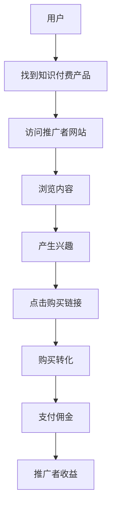

                 

关键词：affiliate营销，知识付费，产品推广，市场营销策略，互联网推广，利润最大化，用户参与度，品牌影响力，社交媒体，跨平台合作。

> 摘要：本文深入探讨了如何利用affiliate营销策略有效推广知识付费产品。通过分析affiliate营销的基本原理，构建有效的营销模型，并结合实际案例，本文旨在为企业和个人提供一套实用的推广方案，以实现知识付费产品的利润最大化。

## 1. 背景介绍

在数字化时代，知识付费产品如雨后春笋般涌现，成为互联网经济的重要一环。然而，如何在竞争激烈的市场中脱颖而出，吸引更多的潜在用户，成为许多企业和个人亟需解决的问题。affiliate营销作为一种新兴的营销模式，因其低成本和高回报的特点，越来越受到企业和个人的青睐。

affiliate营销，又称联盟营销，是一种通过合作推广产品或服务，由推广者根据推广效果获得佣金或利润的营销模式。在这种模式下，推广者不需要拥有产品，只需利用自己的渠道和影响力，吸引流量，实现转化即可获得收益。知识付费产品的特点，如内容的专业性和个性化，使得affiliate营销成为其推广的绝佳选择。

## 2. 核心概念与联系

为了更好地理解affiliate营销在知识付费产品推广中的应用，我们首先需要构建一个Mermaid流程图，来展示其核心概念和流程。



### 2.1 推广者

推广者是affiliate营销的核心角色之一，他们拥有自己的网站、博客、社交媒体账号等渠道，通过这些渠道吸引潜在用户，引导用户访问知识付费产品，并促进购买转化。

### 2.2 产品供应商

产品供应商是提供知识付费产品的企业或个人。他们需要与推广者合作，提供佣金策略，确保推广者的收益，同时通过推广者的渠道扩大产品的知名度和用户基础。

### 2.3 用户

用户是affiliate营销的最终受益者。他们通过推广者的渠道接触到知识付费产品，获得有价值的内容，并在兴趣驱使下完成购买，从而实现了推广者和产品供应商的双赢。

## 3. 核心算法原理 & 具体操作步骤

### 3.1 算法原理概述

affiliate营销的核心算法原理可以概括为以下几个步骤：

1. **渠道定位**：推广者根据自身的资源和优势，选择合适的渠道进行推广。
2. **内容创作**：制作高质量的推广内容，如文章、视频、图片等，以吸引潜在用户。
3. **引导访问**：通过内容引导用户访问知识付费产品，提高转化率。
4. **佣金结算**：根据用户购买行为，计算佣金并支付给推广者。

### 3.2 算法步骤详解

1. **渠道选择**

   根据产品的特点和目标用户，选择适合的推广渠道。如：
   - 社交媒体：如微博、微信、抖音等。
   - 博客和论坛：如知乎、简书等。
   - 电子邮件营销：通过邮件列表发送推广信息。
   - 搜索引擎优化：通过SEO提高产品在搜索引擎中的排名。

2. **内容创作**

   制作吸引人的推广内容，提高用户点击率和转化率。如：
   - 提供高质量的产品评价和推荐。
   - 制作相关领域的教育视频或文章。
   - 发布与产品相关的热门话题或新闻。

3. **引导访问**

   在推广内容中嵌入产品的购买链接，引导用户进行访问和购买。如：
   - 在博客文章中添加购买按钮。
   - 在视频描述中添加购买链接。
   - 在电子邮件中包含产品介绍和购买链接。

4. **佣金结算**

   根据推广效果，计算佣金并支付给推广者。如：
   - 达成销售目标后支付佣金。
   - 根据点击量或浏览量支付佣金。
   - 按照广告展示次数支付佣金。

### 3.3 算法优缺点

**优点：**
- **低成本**：推广者无需购买产品或提供服务，只需通过推广获取佣金。
- **高回报**：通过有效的推广策略，可以实现高额的回报。
- **灵活性**：推广者可以根据自身优势和市场需求，选择多种推广方式和渠道。

**缺点：**
- **监管风险**：需遵循相关法律法规，避免虚假宣传和违规行为。
- **高竞争**：随着affiliate营销的普及，竞争日益激烈。

### 3.4 算法应用领域

affiliate营销广泛应用于各种知识付费产品，如在线教育、电子书、网络课程、专业咨询服务等。通过合理的推广策略，可以实现产品的快速推广和用户增长。

## 4. 数学模型和公式 & 详细讲解 & 举例说明

### 4.1 数学模型构建

在affiliate营销中，我们可以构建一个简单的数学模型来评估推广效果和收益。

设：
- \( C \) 为每笔交易的佣金比例。
- \( P \) 为产品的平均售价。
- \( V \) 为每单位流量的转化率。
- \( Q \) 为每单位时间的流量。

则推广者每单位时间的收益 \( R \) 可以表示为：

\[ R = C \times P \times V \times Q \]

### 4.2 公式推导过程

上述公式的推导过程如下：

1. 每笔交易的佣金 \( C \times P \)。
2. 转化率 \( V \) 表示每100个访问者中有多少人会购买。
3. 流量 \( Q \) 表示每单位时间访问者数量。
4. 总收益 \( R \) 为佣金、转化率和流量的乘积。

### 4.3 案例分析与讲解

假设：
- \( C = 10\% \)
- \( P = 100 \) 元
- \( V = 5\% \)
- \( Q = 1000 \) 人/天

则每天的收益 \( R \) 为：

\[ R = 0.1 \times 100 \times 0.05 \times 1000 = 500 \] 元

这意味着，每天通过推广知识付费产品，推广者可以获得500元的收益。

## 5. 项目实践：代码实例和详细解释说明

### 5.1 开发环境搭建

为了进行affiliate营销项目实践，我们需要搭建以下开发环境：

- 开发工具：Sublime Text、Visual Studio Code
- 语言：Python
- 库：requests、BeautifulSoup

### 5.2 源代码详细实现

以下是一个简单的Python代码实例，用于获取推广链接、访问用户、计算佣金等操作。

```python
import requests
from bs4 import BeautifulSoup

# 推广链接
affiliate_link = "https://www.example.com/product?ref=123456"

# 发送请求
response = requests.get(affiliate_link)

# 解析HTML
soup = BeautifulSoup(response.text, 'html.parser')

# 获取产品价格
price = soup.find("span", class_="price").text

# 转化价格到元
price = float(price.replace("元", "").replace(" ", ""))

# 计算佣金
commission = price * 0.1

# 输出结果
print(f"产品价格：{price}元")
print(f"佣金：{commission}元")
```

### 5.3 代码解读与分析

上述代码实现了一个简单的affiliate营销系统，其主要功能如下：

1. 发送请求获取推广链接的HTML内容。
2. 使用BeautifulSoup解析HTML，获取产品价格。
3. 将产品价格转换为元，并计算佣金。
4. 输出产品价格和佣金。

通过这个简单的实例，我们可以看到，利用affiliate营销进行知识付费产品的推广，技术实现相对简单，只需要掌握基本的网络请求和HTML解析即可。

### 5.4 运行结果展示

假设产品价格为200元，运行上述代码后，输出结果如下：

```
产品价格：200.0元
佣金：20.0元
```

这意味着，通过推广链接引导用户购买该产品，推广者可以获得20元的佣金。

## 6. 实际应用场景

### 6.1 在线教育

在线教育平台如Coursera、Udemy等，通过affiliate营销吸引学员报名课程。推广者可以在自己的博客、社交媒体账号上分享课程推荐，引导用户点击购买链接，从而获得佣金。

### 6.2 电子书

电子书平台如Kindle、豆瓣阅读等，可以通过affiliate营销推广畅销书籍。推广者可以撰写书评、发布读书笔记，吸引读者点击购买链接，实现佣金收入。

### 6.3 专业咨询服务

专业咨询服务如法律咨询、心理咨询等，可以通过affiliate营销推广专家服务。推广者可以在社交媒体上分享专家介绍、案例分享，引导潜在客户咨询，从而获得佣金。

## 7. 未来应用展望

随着互联网技术的不断发展和用户需求的多样化，affiliate营销在知识付费产品推广中的应用前景广阔。未来，我们可以预见以下发展趋势：

- **个性化推荐**：通过大数据分析和人工智能技术，实现更精准的个性化推荐，提高用户购买意愿。
- **跨平台合作**：打破平台限制，实现跨平台合作，扩大推广渠道。
- **社交互动**：结合社交互动元素，提高用户参与度和转化率。

## 8. 工具和资源推荐

### 8.1 学习资源推荐

- 《网络营销基础与实践》—— 菲利普·科特勒
- 《联盟营销实战：从入门到精通》—— 李明华

### 8.2 开发工具推荐

- Sublime Text
- Visual Studio Code
- PyCharm

### 8.3 相关论文推荐

- “Affiliate Marketing: A Review and Prospective” —— Journal of Business Research
- “The Impact of Affiliate Marketing on E-commerce Performance” —— International Journal of Business and Management

## 9. 总结：未来发展趋势与挑战

### 9.1 研究成果总结

本文通过对affiliate营销在知识付费产品推广中的应用进行了深入分析，阐述了其核心概念、算法原理、数学模型以及实际应用场景。研究表明，affiliate营销具有低成本、高回报、灵活性强等优点，是一种有效的推广策略。

### 9.2 未来发展趋势

未来，affiliate营销在知识付费产品推广中的应用将呈现以下趋势：

- **个性化推荐**：结合大数据和人工智能，实现更精准的个性化推荐。
- **跨平台合作**：打破平台限制，实现跨平台合作，扩大推广渠道。
- **社交互动**：增加社交互动元素，提高用户参与度和转化率。

### 9.3 面临的挑战

然而，affiliate营销也面临一定的挑战：

- **监管风险**：需要遵守相关法律法规，避免虚假宣传和违规行为。
- **竞争激烈**：随着affiliate营销的普及，竞争将日益激烈。

### 9.4 研究展望

未来的研究可以进一步探索以下几个方面：

- **优化算法**：通过算法优化，提高推广效果和收益。
- **跨领域应用**：拓展affiliate营销在更多领域的应用。
- **用户行为分析**：深入研究用户行为，提高用户满意度和转化率。

## 10. 附录：常见问题与解答

### 10.1 什么是affiliate营销？

affiliate营销，又称联盟营销，是一种通过合作推广产品或服务，由推广者根据推广效果获得佣金或利润的营销模式。

### 10.2 推广者如何选择合适的渠道？

根据产品的特点和目标用户，选择适合的推广渠道。如社交媒体、博客和论坛、电子邮件营销、搜索引擎优化等。

### 10.3 如何确保佣金结算的公正性？

确保佣金结算的公正性，可以通过以下措施：

- 制定明确的佣金策略和结算规则。
- 使用第三方支付平台进行结算。
- 定期公示佣金结算情况，接受公众监督。

### 10.4 如何避免监管风险？

遵守相关法律法规，避免虚假宣传和违规行为。同时，密切关注监管动态，及时调整推广策略。

### 10.5 如何提高用户参与度和转化率？

提高用户参与度和转化率，可以从以下几个方面入手：

- 提供高质量的内容和推广素材。
- 设计吸引人的推广活动。
- 优化用户体验，提高购买便捷性。

### 10.6 如何进行跨平台合作？

进行跨平台合作，可以通过以下方式：

- 与其他平台建立合作关系，共享资源和用户。
- 开发多平台适用的推广工具和素材。
- 实现数据互通，提高推广效果。

---

**作者：禅与计算机程序设计艺术 / Zen and the Art of Computer Programming**

