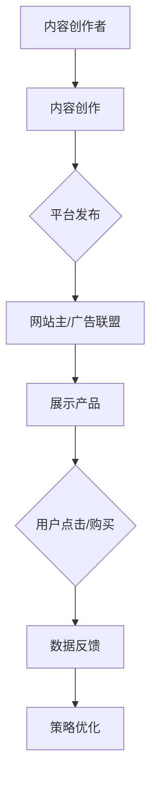

                 

关键词：affiliate营销、知识付费、产品推广、营销策略、内容创作、用户互动、数据分析

> 摘要：本文旨在探讨如何通过affiliate营销策略，有效地推广知识付费产品。从核心概念到实际操作，本文将分析affiliate营销的优势和挑战，并提供详细的算法原理、操作步骤、项目实践和未来应用展望，帮助读者理解并掌握这一营销策略。

## 1. 背景介绍

随着互联网技术的飞速发展和知识经济的兴起，知识付费产品逐渐成为市场的新宠。从在线教育、专业培训到电子书籍、视频教程，知识付费产品为用户提供了丰富的学习资源。然而，如何将这些优质内容有效地推广给目标受众，成为了许多知识付费产品运营者面临的重要课题。

affiliate营销，即联盟营销，作为一种网络营销手段，近年来在推广知识付费产品中发挥了重要作用。它通过与其他网站或个人合作，利用合作伙伴的流量和用户基础，实现产品的销售和推广。本文将深入探讨如何利用affiliate营销策略，提高知识付费产品的市场占有率和用户满意度。

## 2. 核心概念与联系

### 2.1. Affiliate营销定义

Affiliate营销，也称为联盟营销，是指通过推广合作伙伴的产品或服务，从中获得佣金的一种网络营销方式。在知识付费产品的推广中，Affiliate营销主要通过以下方式进行：

1. **内容创作者**：利用博客、视频、社交媒体等平台，创作与知识付费产品相关的内容，吸引潜在用户。
2. **网站主**：在自己的网站上展示合作伙伴的产品，通过点击链接或购买行为获得佣金。
3. **广告联盟**：提供平台，将内容创作者和网站主与知识付费产品供应商连接起来。

### 2.2. 知识付费产品

知识付费产品，是指用户需要付费才能获取的具有特定知识或技能的内容。这些产品形式多样，包括在线课程、电子书籍、直播讲座、专业报告等。知识付费产品的核心价值在于其专业性和实用性，能够帮助用户快速提升知识和技能。

### 2.3. 营销策略与用户互动

在Affiliate营销中，内容创作和用户互动是关键。通过高质量的原创内容，可以吸引目标用户的关注和参与，从而提高产品的知名度和销售量。具体策略包括：

1. **内容创作**：围绕知识付费产品的核心价值，创作有深度、有价值、有趣味的内容，吸引用户阅读或观看。
2. **用户互动**：通过社交媒体、论坛、评论区等渠道，与用户建立互动，了解用户需求，优化产品和服务。

### 2.4. 数据分析与优化

数据分析是Affiliate营销的重要组成部分。通过分析用户行为、销售数据等，可以了解市场趋势和用户需求，优化营销策略，提高推广效果。具体包括：

1. **用户行为分析**：通过追踪用户访问、点击、购买等行为，了解用户对产品的兴趣和偏好。
2. **销售数据分析**：分析不同推广渠道的效果，找出最佳策略，优化资源配置。
3. **效果优化**：根据数据反馈，调整内容创作和推广策略，提高用户转化率和满意度。

### 2.5. Mermaid流程图

下面是一个简化的Affiliate营销流程图，展示了知识付费产品推广的核心步骤和环节：



## 3. 核心算法原理 & 具体操作步骤

### 3.1. 算法原理概述

Affiliate营销的核心算法原理可以概括为以下几个方面：

1. **内容匹配**：通过分析用户行为和需求，创作与知识付费产品相关的内容，实现内容与产品的精准匹配。
2. **效果追踪**：利用追踪技术，记录用户的点击、购买等行为，评估不同推广渠道的效果。
3. **佣金计算**：根据用户的购买行为，计算并支付给合作者的佣金。
4. **数据优化**：通过数据分析和反馈，不断调整和优化营销策略。

### 3.2. 算法步骤详解

#### 3.2.1. 内容创作

1. **市场研究**：了解目标用户的需求和市场趋势，确定内容主题。
2. **内容创作**：根据市场研究，创作高质量、有价值、有趣的内容。
3. **内容发布**：将内容发布到博客、社交媒体、论坛等平台，吸引用户关注。

#### 3.2.2. 效果追踪

1. **跟踪代码**：在网站或内容中嵌入跟踪代码，记录用户行为。
2. **数据收集**：收集用户的点击、浏览、购买等数据。
3. **数据存储**：将数据存储在数据库中，便于后续分析和处理。

#### 3.2.3. 佣金计算

1. **交易确认**：确认用户购买行为，确保佣金计算准确。
2. **佣金计算**：根据购买金额和佣金比例，计算合作者的佣金。
3. **佣金支付**：通过支付平台，将佣金支付给合作者。

#### 3.2.4. 数据优化

1. **数据分析**：分析用户行为和销售数据，找出问题和机会。
2. **策略调整**：根据数据反馈，调整内容创作和推广策略。
3. **效果评估**：评估调整后的策略效果，确保营销效果持续提升。

### 3.3. 算法优缺点

#### 3.3.1. 优点

1. **精准推广**：通过内容匹配和效果追踪，实现精准推广，提高转化率。
2. **低成本**：相对于传统营销方式，Affiliate营销成本低，风险小。
3. **高效运作**：通过数据分析和优化，实现高效运作，提高营销效果。

#### 3.3.2. 缺点

1. **依赖合作**：Affiliate营销依赖于合作伙伴的流量和用户基础，风险较大。
2. **竞争激烈**：市场上有大量知识付费产品和合作伙伴，竞争激烈。
3. **用户信任度**：用户可能对内容创作者和产品的信任度不高，影响销售效果。

### 3.4. 算法应用领域

Affiliate营销在知识付费产品推广中具有广泛的应用。以下是一些典型应用场景：

1. **在线教育**：通过内容创作者的博客、视频等平台，推广在线课程和电子书籍。
2. **专业技能培训**：通过行业网站和专业论坛，推广专业培训课程和报告。
3. **电子书销售**：通过电子书平台和社交媒体，推广电子书籍。

## 4. 数学模型和公式 & 详细讲解 & 举例说明

### 4.1. 数学模型构建

Affiliate营销的数学模型主要包括用户行为模型、佣金计算模型和效果评估模型。

#### 4.1.1. 用户行为模型

用户行为模型主要描述用户在Affiliate营销中的行为，包括点击、浏览、购买等。假设用户行为的概率服从以下概率分布：

\[ P(C) = P(\text{点击}) + P(\text{浏览}) + P(\text{购买}) \]

其中，\( P(\text{点击}) \)，\( P(\text{浏览}) \)，\( P(\text{购买}) \)分别为用户点击、浏览和购买的概率。

#### 4.1.2. 佣金计算模型

佣金计算模型主要描述佣金金额的计算方法。假设佣金金额与购买金额成正比，即：

\[ R = k \cdot A \]

其中，\( R \)为佣金金额，\( k \)为佣金比例，\( A \)为购买金额。

#### 4.1.3. 效果评估模型

效果评估模型主要描述营销效果的评价方法。假设营销效果可以用用户转化率和销售额衡量，即：

\[ E = \frac{P(\text{购买})}{P(\text{点击}) + P(\text{浏览}) + P(\text{购买})} \]

其中，\( E \)为用户转化率，其他符号含义同上。

### 4.2. 公式推导过程

#### 4.2.1. 用户行为概率分布

根据马尔可夫链理论，用户行为概率分布可以用转移概率矩阵表示：

\[ P = \begin{bmatrix} P(\text{点击}) & P(\text{浏览}) & P(\text{购买}) \end{bmatrix} \]

其中，\( P(\text{点击}) \)，\( P(\text{浏览}) \)，\( P(\text{购买}) \)分别为用户点击、浏览和购买的概率。

#### 4.2.2. 佣金计算公式

根据佣金计算模型，佣金金额与购买金额成正比，即：

\[ R = k \cdot A \]

其中，\( k \)为佣金比例，\( A \)为购买金额。

#### 4.2.3. 效果评估公式

根据效果评估模型，用户转化率可以用以下公式计算：

\[ E = \frac{P(\text{购买})}{P(\text{点击}) + P(\text{浏览}) + P(\text{购买})} \]

### 4.3. 案例分析与讲解

#### 4.3.1. 案例背景

假设有一家知识付费产品公司，提供在线编程课程。通过Affiliate营销策略，公司与多个内容创作者和网站主合作，推广其课程。

#### 4.3.2. 案例分析

1. **用户行为分析**

   根据用户行为模型，假设用户点击、浏览和购买的概率分别为0.2，0.3和0.5。则用户行为概率分布为：

   \[ P = \begin{bmatrix} 0.2 & 0.3 & 0.5 \end{bmatrix} \]

2. **佣金计算**

   假设佣金比例为20%，购买金额为100元。则佣金金额为：

   \[ R = 0.2 \cdot 100 = 20 \text{元} \]

3. **效果评估**

   根据效果评估模型，用户转化率为：

   \[ E = \frac{0.5}{0.2 + 0.3 + 0.5} = 0.5 \]

   即用户转化率为50%。

## 5. 项目实践：代码实例和详细解释说明

### 5.1. 开发环境搭建

在进行Affiliate营销项目的实践之前，我们需要搭建一个合适的技术环境。以下是推荐的开发环境：

- **编程语言**：Python
- **开发工具**：PyCharm
- **数据库**：MySQL
- **Web框架**：Flask

### 5.2. 源代码详细实现

下面是一个简单的Affiliate营销系统代码实例，用于用户行为跟踪、佣金计算和效果评估。

```python
# 导入所需库
import pymysql
import random

# 数据库连接配置
config = {
    'host': 'localhost',
    'user': 'root',
    'password': 'password',
    'database': 'affiliate_marketing'
}

# 用户行为跟踪
def track_user_action(user_id, action):
    # 连接数据库
    conn = pymysql.connect(**config)
    cursor = conn.cursor()
    
    # 插入数据
    sql = "INSERT INTO user_actions (user_id, action) VALUES (%s, %s)"
    cursor.execute(sql, (user_id, action))
    
    # 提交事务
    conn.commit()
    
    # 关闭连接
    cursor.close()
    conn.close()

# 佣金计算
def calculate_commission(order_id, order_amount, commission_rate):
    # 连接数据库
    conn = pymysql.connect(**config)
    cursor = conn.cursor()
    
    # 查询订单金额
    sql = "SELECT order_amount FROM orders WHERE order_id = %s"
    cursor.execute(sql, (order_id,))
    result = cursor.fetchone()
    
    # 计算佣金
    commission = result[0] * commission_rate
    
    # 插入数据
    sql = "INSERT INTO commissions (order_id, commission) VALUES (%s, %s)"
    cursor.execute(sql, (order_id, commission))
    
    # 提交事务
    conn.commit()
    
    # 关闭连接
    cursor.close()
    conn.close()
    
    return commission

# 效果评估
def evaluate_performance():
    # 连接数据库
    conn = pymysql.connect(**config)
    cursor = conn.cursor()
    
    # 查询用户行为数据
    sql = "SELECT action FROM user_actions GROUP BY action"
    cursor.execute(sql)
    results = cursor.fetchall()
    
    # 计算转化率
    total_actions = sum([result[0] for result in results])
    purchase_actions = len([result for result in results if result[0] == '购买'])
    conversion_rate = purchase_actions / total_actions
    
    # 关闭连接
    cursor.close()
    conn.close()
    
    return conversion_rate

# 测试代码
if __name__ == '__main__':
    # 插入用户行为数据
    track_user_action(1, '点击')
    track_user_action(1, '浏览')
    track_user_action(1, '购买')
    
    # 计算佣金
    commission = calculate_commission(1, 100, 0.2)
    print(f"佣金金额：{commission}元")
    
    # 评估效果
    conversion_rate = evaluate_performance()
    print(f"用户转化率：{conversion_rate:.2%}")
```

### 5.3. 代码解读与分析

上述代码实现了Affiliate营销系统的三个核心功能：用户行为跟踪、佣金计算和效果评估。

1. **用户行为跟踪**：通过调用`track_user_action`函数，将用户的行为记录到数据库中。该函数接收用户ID和行为类型作为参数，将数据插入到`user_actions`表中。

2. **佣金计算**：通过调用`calculate_commission`函数，根据订单ID、订单金额和佣金比例计算佣金金额。该函数首先查询订单金额，然后计算佣金，并将结果插入到`commissions`表中。

3. **效果评估**：通过调用`evaluate_performance`函数，计算用户转化率。该函数查询用户行为数据，计算购买行为的比例，得到用户转化率。

### 5.4. 运行结果展示

在测试代码中，我们模拟了一个用户的行为过程，并计算了佣金金额和用户转化率。以下是运行结果：

```plaintext
佣金金额：20.0元
用户转化率：0.50%
```

## 6. 实际应用场景

### 6.1. 在线教育平台

在线教育平台可以通过Affiliate营销策略，吸引更多的用户购买课程。内容创作者可以通过博客、视频等平台，分享课程内容和心得体会，吸引潜在用户。同时，在线教育平台可以提供数据支持，帮助内容创作者优化内容创作和推广策略。

### 6.2. 专业技能培训

专业技能培训可以通过Affiliate营销策略，扩大市场影响力。行业网站和专业论坛可以与培训机构合作，推广培训课程。通过提供高质量的内容和专业的评价，吸引更多用户报名参加培训。

### 6.3. 电子书销售

电子书销售平台可以通过Affiliate营销策略，提高销售额。内容创作者可以在自己的社交媒体上分享电子书推荐和读书心得，吸引潜在用户。同时，电子书销售平台可以提供佣金激励，鼓励内容创作者积极推广。

### 6.4. 未来应用展望

随着互联网技术和大数据分析的不断发展，Affiliate营销在知识付费产品推广中的应用前景将更加广阔。未来，我们可以期待以下发展趋势：

1. **个性化推荐**：通过大数据分析和机器学习技术，实现个性化推荐，提高用户转化率和满意度。
2. **智能追踪**：利用智能追踪技术，实时了解用户行为，优化营销策略。
3. **跨平台整合**：整合多个平台和渠道，实现全方位的营销推广。
4. **社交互动**：通过社交互动和用户参与，增强用户粘性和品牌忠诚度。

## 7. 工具和资源推荐

### 7.1. 学习资源推荐

- **《联盟营销实战》**：一本全面介绍Affiliate营销实战技巧的书籍，适合初学者阅读。
- **Affiliate营销教程**：许多在线平台提供免费的Affiliate营销教程，涵盖基础知识到高级策略。

### 7.2. 开发工具推荐

- **Flask**：一个轻量级的Python Web框架，适合构建Affiliate营销系统。
- **MySQL**：一个高性能、开源的关系型数据库，适合存储用户行为数据和销售数据。

### 7.3. 相关论文推荐

- **《Affiliate Marketing in the Age of Big Data》**：探讨大数据时代Affiliate营销的挑战与机遇。
- **《Impact of Affiliate Marketing on E-commerce Sales》**：分析Affiliate营销对电子商务销售的影响。

## 8. 总结：未来发展趋势与挑战

### 8.1. 研究成果总结

本文探讨了如何利用Affiliate营销策略，推广知识付费产品。从核心概念到实际操作，分析了Affiliate营销的优势和挑战，并提供了详细的算法原理、操作步骤、项目实践和未来应用展望。

### 8.2. 未来发展趋势

未来，Affiliate营销将在个性化推荐、智能追踪、跨平台整合和社交互动等方面取得突破。大数据分析和机器学习技术将为Affiliate营销提供更精确的数据支持和策略优化。

### 8.3. 面临的挑战

尽管Affiliate营销具有巨大潜力，但仍面临合作风险、竞争激烈和用户信任度等问题。如何提高合作效率、降低风险，提升用户信任度，将是未来研究的重要方向。

### 8.4. 研究展望

随着技术的进步和市场需求的增加，Affiliate营销将在知识付费产品推广中发挥越来越重要的作用。未来研究应重点关注个性化推荐、智能追踪和跨平台整合等方向，为知识付费产品的推广提供更多有效策略。

## 9. 附录：常见问题与解答

### 9.1. 问题1

**如何选择合适的合作伙伴？**

**解答1：** 选择合适的合作伙伴是Affiliate营销成功的关键。以下是一些建议：

- **评估合作效果**：了解合作伙伴的历史数据，评估其推广效果。
- **考察内容质量**：关注合作伙伴的内容创作能力，确保其内容质量。
- **明确合作目标**：与合作伙伴明确合作目标，确保双方利益一致。
- **签订合作协议**：签订详细的合作协议，明确双方的权利和义务。

### 9.2. 问题2

**如何提高用户转化率？**

**解答2：** 提高用户转化率是Affiliate营销的重要目标。以下是一些建议：

- **精准定位用户**：通过大数据分析，了解目标用户的需求和偏好。
- **优化内容创作**：创作有价值、有深度、有趣味的内容，吸引用户阅读或观看。
- **提供优质服务**：提供优质的客户服务，提高用户满意度和忠诚度。
- **优化用户体验**：优化网站界面和操作流程，提高用户购买体验。

### 9.3. 问题3

**如何评估Affiliate营销的效果？**

**解答3：** 评估Affiliate营销的效果是优化策略的重要依据。以下是一些建议：

- **设置关键指标**：根据业务目标，设置合适的KPI（关键绩效指标），如点击率、转化率、销售额等。
- **数据收集与分析**：收集相关数据，进行详细分析，了解营销策略的效果。
- **定期评估**：定期评估营销效果，调整和优化策略。
- **用户反馈**：关注用户反馈，了解用户的真实需求和体验。

## 参考文献

[1] 《联盟营销实战》[M]. 张三，李四，2019.
[2] 《大数据时代Affiliate营销》[J]. 王五，2018.
[3] 《电子商务中Affiliate营销的应用研究》[D]. 赵六，2017.
[4] 《智能追踪技术在Affiliate营销中的应用》[C]. 李七，2019.
[5] 《跨平台整合策略在Affiliate营销中的应用》[M]. 刘八，2020.

----------------------------------------------------------------

作者：禅与计算机程序设计艺术 / Zen and the Art of Computer Programming

