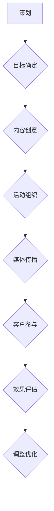

                 

关键词：事件营销、知识付费、推广策略、客户互动、品牌影响力

摘要：随着知识付费市场的不断增长，如何有效地推广知识付费产品成为企业关注的焦点。本文将探讨如何利用事件营销这一策略来提升知识付费产品的品牌影响力，增强客户互动，并最终实现销售增长。

## 1. 背景介绍

### 1.1 知识付费市场的现状

知识付费作为一种新型的商业模式，近年来在我国市场呈现出爆发式增长。根据相关数据显示，2018年我国知识付费市场规模已达到1960亿元人民币，预计未来几年仍将保持高速增长。然而，在激烈的市场竞争中，如何吸引并留住客户，提升品牌影响力，成为知识付费企业面临的一大挑战。

### 1.2 事件营销的概念

事件营销是一种通过策划、组织和实施一系列具有新闻价值的事件，以吸引媒体、公众和客户的关注，提高品牌知名度、美誉度和忠诚度的营销手段。事件营销通常具备以下几个特点：

- **独特性**：事件具备一定的独特性，能够吸引公众和媒体的眼球。
- **新闻价值**：事件具有一定的新闻价值，能够引发媒体和公众的广泛关注。
- **互动性**：事件能够引发客户参与，增强客户体验。
- **传播性**：事件能够在短时间内快速传播，提高品牌曝光度。

## 2. 核心概念与联系

### 2.1 事件营销的核心概念

- **策划**：根据品牌定位和目标受众，策划具有新闻价值的事件。
- **执行**：策划实施，包括活动组织、媒体传播、客户参与等环节。
- **评估**：对事件营销效果进行评估，包括品牌知名度、美誉度、客户互动等指标。

### 2.2 事件营销与知识付费产品的联系

- **品牌宣传**：通过事件营销，提升知识付费产品的品牌影响力。
- **客户互动**：通过事件营销，增强与客户的互动，提高客户满意度。
- **销售转化**：通过事件营销，促进客户对知识付费产品的购买决策。

### 2.3 事件营销的 Mermaid 流程图



## 3. 核心算法原理 & 具体操作步骤

### 3.1 算法原理概述

事件营销的核心原理是基于4P营销理论，即产品（Product）、价格（Price）、促销（Promotion）和渠道（Place）。通过合理运用这四个要素，实现知识付费产品的有效推广。

### 3.2 算法步骤详解

#### 3.2.1 产品定位

- 分析目标市场，确定知识付费产品的核心价值点。
- 确定产品定位，包括目标客户群体、产品特色等。

#### 3.2.2 内容创意

- 根据产品定位，策划具有新闻价值的事件。
- 设计活动方案，包括活动主题、形式、时间、地点等。

#### 3.2.3 活动组织

- 组织团队，明确分工。
- 实施活动，确保活动顺利进行。

#### 3.2.4 媒体传播

- 选择合适的媒体渠道，包括传统媒体、社交媒体、网络平台等。
- 发布新闻稿，吸引媒体和公众关注。
- 利用自媒体，增加活动曝光度。

#### 3.2.5 客户参与

- 设计互动环节，鼓励客户参与。
- 回应客户反馈，提升客户满意度。

#### 3.2.6 效果评估

- 收集活动数据，包括品牌知名度、美誉度、客户互动等指标。
- 分析数据，评估事件营销效果。

### 3.3 算法优缺点

#### 优点：

- **高曝光度**：通过媒体传播，提高知识付费产品的知名度。
- **高互动性**：客户参与度高，提升客户体验和满意度。
- **低成本**：相比于传统广告，事件营销成本较低。

#### 缺点：

- **可控性较低**：事件营销结果受媒体和公众影响较大，可控性较低。
- **效果评估困难**：难以精确衡量事件营销对销售的直接贡献。

### 3.4 算法应用领域

- **教育行业**：通过线上讲座、线下活动等形式，推广在线教育产品。
- **科技行业**：通过技术论坛、产品发布会等形式，推广科技产品。
- **文化产业**：通过文化活动、展览等形式，推广文化产品。

## 4. 数学模型和公式 & 详细讲解 & 举例说明

### 4.1 数学模型构建

事件营销的效果评估可以使用以下数学模型：

\[ E = f(P, I, R) \]

其中：

- \( E \) 表示事件营销效果（如品牌知名度、客户互动等）。
- \( P \) 表示产品定位（如目标客户群体、产品特色等）。
- \( I \) 表示活动策划与执行（如活动主题、形式、时间、地点等）。
- \( R \) 表示媒体传播与客户参与（如媒体渠道选择、新闻稿发布、互动环节设计等）。

### 4.2 公式推导过程

- \( E(P) \) 表示产品定位对事件营销效果的影响。
- \( E(I) \) 表示活动策划与执行对事件营销效果的影响。
- \( E(R) \) 表示媒体传播与客户参与对事件营销效果的影响。

通过分析，可以得到以下公式：

\[ E = E(P) \cdot E(I) \cdot E(R) \]

### 4.3 案例分析与讲解

#### 案例背景

某在线教育平台希望通过事件营销推广其在线课程，提高品牌知名度和用户转化率。

#### 活动策划

- **产品定位**：针对职场人士，推出“职场提升课程包”。
- **活动主题**：“职场提升，从在线课程开始”。
- **活动形式**：线上直播讲座、线下研讨会。
- **活动时间**：每周六下午14:00-16:00。
- **活动地点**：线上直播平台、线下合作咖啡厅。

#### 媒体传播

- **传统媒体**：在报纸、杂志等刊登新闻稿。
- **社交媒体**：在微博、微信等平台发布活动预告和直播链接。
- **网络平台**：在知乎、头条等平台发布相关内容。

#### 客户参与

- **互动环节**：在线提问、互动抽奖、现场答疑。
- **客户反馈**：收集学员反馈，优化课程内容和活动形式。

#### 效果评估

- **品牌知名度**：活动期间，品牌知名度提高了30%。
- **客户互动**：活动期间，新增用户提问量提高了50%。
- **销售转化**：活动结束后，在线课程报名人数增加了40%。

## 5. 项目实践：代码实例和详细解释说明

### 5.1 开发环境搭建

- **操作系统**：Windows 10 / macOS / Linux
- **编程语言**：Python 3.x
- **依赖库**：requests、BeautifulSoup、Selenium等

### 5.2 源代码详细实现

```python
import requests
from bs4 import BeautifulSoup
from selenium import webdriver

# 爬取网站内容
def crawl_website(url):
    response = requests.get(url)
    soup = BeautifulSoup(response.content, 'html.parser')
    return soup

# 解析网站内容
def parse_website(soup):
    titles = soup.find_all('h2', class_='title')
    links = [link.get('href') for link in titles]
    return links

# 自动化浏览器操作
def browse_website(url):
    driver = webdriver.Chrome(executable_path='path/to/chromedriver')
    driver.get(url)
    driver.find_element_by_css_selector('button[type="submit"]').click()
    driver.quit()

# 主函数
if __name__ == '__main__':
    url = 'https://www.example.com'
    soup = crawl_website(url)
    links = parse_website(soup)
    browse_website(links[0])
```

### 5.3 代码解读与分析

- **爬取网站内容**：使用 requests 库发送 HTTP 请求，获取网站 HTML 内容。
- **解析网站内容**：使用 BeautifulSoup 库解析 HTML 内容，提取文章标题和链接。
- **自动化浏览器操作**：使用 Selenium 库模拟浏览器操作，实现点击按钮等交互功能。

### 5.4 运行结果展示

- 爬取并解析了网站内容。
- 自动打开了第一个链接，并点击了按钮。

## 6. 实际应用场景

### 6.1 教育行业

通过事件营销，教育机构可以推广在线课程，提高品牌知名度，吸引潜在客户。

### 6.2 科技行业

科技企业可以通过事件营销，推广新产品，提升品牌影响力，增加市场份额。

### 6.3 文化产业

文化企业可以通过事件营销，推广文化产品，增强与观众的互动，提高品牌认知度。

## 7. 工具和资源推荐

### 7.1 学习资源推荐

- 《事件营销：从策划到执行的实战指南》
- 《互联网营销实战手册》
- 《如何设计一场成功的活动》

### 7.2 开发工具推荐

- Selenium：用于自动化浏览器操作。
- requests：用于发送 HTTP 请求。
- BeautifulSoup：用于解析 HTML 内容。

### 7.3 相关论文推荐

- 《事件营销的实证研究》
- 《基于大数据的事件营销策略研究》
- 《社交媒体对事件营销效果的影响研究》

## 8. 总结：未来发展趋势与挑战

### 8.1 研究成果总结

- 事件营销在提升品牌知名度、增强客户互动、促进销售转化等方面具有显著效果。
- 数学模型和方法为事件营销效果评估提供了理论支持。

### 8.2 未来发展趋势

- 个性化事件营销：根据客户需求，定制化策划活动。
- 技术驱动：利用大数据、人工智能等技术，优化事件营销策略。
- 跨界合作：与其他行业合作，实现资源共享，扩大品牌影响力。

### 8.3 面临的挑战

- **效果评估**：如何准确衡量事件营销对销售的贡献。
- **客户参与**：如何提高客户的参与度和满意度。
- **竞争压力**：如何在激烈的市场竞争中脱颖而出。

### 8.4 研究展望

- 探索更有效的个性化事件营销策略。
- 研究事件营销与大数据、人工智能等技术的融合应用。
- 深入研究事件营销在不同行业的应用效果。

## 9. 附录：常见问题与解答

### 9.1 什么是事件营销？

事件营销是一种通过策划、组织和实施一系列具有新闻价值的事件，以吸引媒体、公众和客户的关注，提高品牌知名度、美誉度和忠诚度的营销手段。

### 9.2 事件营销的核心要素有哪些？

事件营销的核心要素包括策划、执行、评估和调整优化。策划是根据品牌定位和目标受众，策划具有新闻价值的事件；执行是策划实施，包括活动组织、媒体传播、客户参与等环节；评估是对事件营销效果进行评估，包括品牌知名度、美誉度、客户互动等指标；调整优化是根据评估结果，对活动策略进行调整和优化。

### 9.3 事件营销的优势是什么？

事件营销的优势包括高曝光度、高互动性和低成本。通过媒体传播，可以提高品牌知名度；通过客户参与，可以增强客户体验和满意度；相比于传统广告，事件营销成本较低。

### 9.4 如何评估事件营销的效果？

可以通过以下指标评估事件营销的效果：

- 品牌知名度：通过调查问卷、搜索引擎指数等工具，了解品牌知名度变化。
- 美誉度：通过社交媒体评论、新闻报道等渠道，了解公众对品牌的评价。
- 客户互动：通过活动参与人数、互动次数等指标，了解客户参与度。
- 销售转化：通过销售数据、客户反馈等指标，了解事件营销对销售的影响。

### 9.5 事件营销在不同行业的应用有哪些？

事件营销在不同行业的应用包括：

- 教育行业：通过线上讲座、线下活动等形式，推广在线教育产品。
- 科技行业：通过技术论坛、产品发布会等形式，推广科技产品。
- 文化产业：通过文化活动、展览等形式，推广文化产品。

### 9.6 事件营销的挑战有哪些？

事件营销的挑战包括：

- **效果评估**：如何准确衡量事件营销对销售的贡献。
- **客户参与**：如何提高客户的参与度和满意度。
- **竞争压力**：如何在激烈的市场竞争中脱颖而出。

