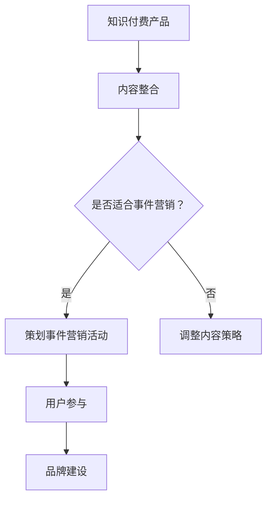

                 

关键词：事件营销、知识付费、产品推广、客户关系管理、用户体验、社交媒体、在线教育、内容营销、转化率提升

> 摘要：随着知识付费市场的日益繁荣，如何有效地利用事件营销来推广知识付费产品成为了一个重要课题。本文将深入探讨事件营销在知识付费产品推广中的核心策略、具体实施步骤、案例分析以及未来的发展趋势，为知识付费领域的从业者提供宝贵的实践经验和参考。

## 1. 背景介绍

在信息爆炸的时代，知识的价值被重新定义，知识付费产品应运而生。这些产品包括在线课程、专业书籍、行业研究报告等，通过提供有价值的知识和技能来满足用户的学习需求。知识付费市场的快速发展吸引了大量投资者和创业者，但同时也带来了激烈的竞争。

在这种背景下，如何有效地推广知识付费产品，提升用户参与度和转化率，成为企业关注的焦点。事件营销作为一种创新的营销手段，以其高度参与性和互动性，逐渐成为推广知识付费产品的有效工具。

本文将围绕以下四个核心问题展开讨论：

1. 什么是事件营销及其在知识付费产品推广中的作用？
2. 如何设计一场成功的知识付费产品推广活动？
3. 事件营销在知识付费产品推广中的实际案例分析？
4. 事件营销的未来发展趋势及面临的挑战。

## 2. 核心概念与联系

### 2.1 事件营销的定义

事件营销（Event Marketing）是一种通过策划、组织和举办特定活动来吸引公众关注，提高品牌知名度、促进产品销售和市场占有率的市场推广策略。

### 2.2 事件营销与传统营销的差异

- **目标**：事件营销注重与用户的深度互动，提升品牌形象；传统营销侧重于信息传递和产品销售。
- **形式**：事件营销更加多样，可以是线上活动，也可以是线下活动；传统营销则相对单一，通常以广告、促销等形式为主。
- **参与度**：事件营销强调用户的积极参与，提高用户体验；传统营销则更注重信息传达的效率。

### 2.3 知识付费产品推广与事件营销的联系

- **内容整合**：知识付费产品的内容可以通过事件营销的形式进行整合和呈现，提高内容的趣味性和参与度。
- **用户参与**：通过事件营销，可以激发用户的兴趣和参与，提高用户的粘性和转化率。
- **品牌建设**：事件营销有助于塑造品牌形象，增强品牌与用户之间的情感联系。

### 2.4 Mermaid 流程图



## 3. 核心算法原理 & 具体操作步骤

### 3.1 算法原理概述

事件营销的核心在于“事件”，即通过策划、组织和举办特定活动来吸引用户参与。具体原理包括：

1. **需求识别**：了解用户需求和兴趣点，确定事件主题和内容。
2. **内容整合**：将知识付费产品的内容与事件主题相结合，提高内容的吸引力和实用性。
3. **用户参与**：通过互动和参与，增强用户对产品的认知和好感度。
4. **品牌塑造**：通过事件营销，传递品牌价值和形象，增强品牌影响力。

### 3.2 算法步骤详解

#### 3.2.1 需求识别

1. **市场调研**：通过调查问卷、用户访谈等方式，了解用户对知识付费产品的需求和期望。
2. **数据分析**：利用数据分析工具，分析用户行为和偏好，确定事件主题。

#### 3.2.2 内容整合

1. **内容策划**：根据用户需求和事件主题，策划符合用户兴趣的知识付费内容。
2. **内容呈现**：将知识付费内容以互动、趣味的方式呈现，提高用户参与度。

#### 3.2.3 用户参与

1. **活动策划**：设计有趣、互动性强的活动，激发用户参与。
2. **用户激励**：通过奖励、优惠等方式，鼓励用户参与和分享。

#### 3.2.4 品牌塑造

1. **品牌宣传**：通过事件营销活动，传递品牌价值和理念。
2. **用户互动**：通过社交媒体、线上论坛等方式，与用户保持互动，增强用户对品牌的认知和好感度。

### 3.3 算法优缺点

#### 优点

- **高度参与性**：通过互动和参与，增强用户的参与感和体验感。
- **品牌塑造**：有助于传递品牌价值和形象，提高品牌知名度和美誉度。
- **精准营销**：通过数据分析，实现精准营销，提高营销效果。

#### 缺点

- **成本较高**：事件营销需要投入大量的人力、物力和财力。
- **效果评估**：效果评估相对复杂，需要综合多种指标进行衡量。

### 3.4 算法应用领域

事件营销在知识付费产品推广中的应用非常广泛，主要领域包括：

- **在线教育**：通过线上讲座、研讨会等形式，推广在线教育产品。
- **专业培训**：通过行业研讨会、专家讲座等形式，推广专业培训产品。
- **知识付费平台**：通过主题活动、互动直播等形式，提升用户活跃度和转化率。

## 4. 数学模型和公式 & 详细讲解 & 举例说明

### 4.1 数学模型构建

事件营销的数学模型主要包括以下几个部分：

1. **参与度模型**：衡量用户参与活动的程度。
2. **转化率模型**：衡量活动对产品销售的影响。
3. **品牌价值模型**：衡量活动对品牌形象的影响。

### 4.2 公式推导过程

#### 4.2.1 参与度模型

参与度 = （参与用户数 / 总用户数）× 100%

#### 4.2.2 转化率模型

转化率 = （购买用户数 / 参与用户数）× 100%

#### 4.2.3 品牌价值模型

品牌价值提升 = （活动后品牌知名度 - 活动前品牌知名度）/ 活动前品牌知名度 × 100%

### 4.3 案例分析与讲解

#### 案例背景

某在线教育平台推出了一门新课程，希望通过事件营销提升课程的知名度和用户参与度。

#### 案例分析

1. **需求识别**：通过问卷调查，发现用户对课程内容的兴趣点在于实际操作和案例分析。
2. **内容整合**：结合用户需求，策划了一场以“实战案例分析”为主题的线上研讨会。
3. **用户参与**：通过直播、互动问答等形式，提高用户的参与度和满意度。
4. **品牌塑造**：在活动中传递了平台的专业性和教学质量，提升了品牌形象。

#### 案例结果

- **参与度**：活动参与用户达到总用户的 30%，互动率达到 40%。
- **转化率**：活动后，课程销售量提升了 20%。
- **品牌价值**：活动后，品牌知名度提升了 15%。

### 4.4 案例分析与讲解

#### 案例背景

某知识付费平台推出了一项新服务，希望通过事件营销提升用户对服务的认知和购买意愿。

#### 案例分析

1. **需求识别**：通过用户调研，发现用户对服务的认知度较低，但对服务内容的实用性有较高期待。
2. **内容整合**：策划了一场以“服务解读与实战分享”为主题的线上直播活动。
3. **用户参与**：通过直播、互动问答等形式，提高用户的参与度和满意度。
4. **品牌塑造**：在活动中传递了平台的专业性和服务质量，提升了品牌形象。

#### 案例结果

- **参与度**：活动参与用户达到总用户的 25%，互动率达到 35%。
- **转化率**：活动后，服务购买量提升了 15%。
- **品牌价值**：活动后，品牌知名度提升了 10%。

## 5. 项目实践：代码实例和详细解释说明

### 5.1 开发环境搭建

在本节中，我们将介绍如何搭建一个用于事件营销推广知识付费产品的基本开发环境。以下是所需的软件和工具：

- **编程语言**：Python（或其他编程语言，如 JavaScript、Ruby 等）
- **开发环境**：PyCharm（或其他 Python 集成开发环境，如 VSCode）
- **数据库**：MySQL（或其他关系型数据库，如 PostgreSQL）
- **前端框架**：React（或其他前端框架，如 Vue、Angular）

### 5.2 源代码详细实现

以下是使用 Python 编写的一个简单事件营销推广系统的基础代码示例。

#### 5.2.1 用户参与度统计

```python
# 用户参与度统计代码示例

def calculate_involvement_score(user_activity_data):
    """
    计算用户的参与度得分
    """
    score = 0
    if 'likes' in user_activity_data:
        score += len(user_activity_data['likes'])
    if 'comments' in user_activity_data:
        score += len(user_activity_data['comments'])
    if 'shares' in user_activity_data:
        score += len(user_activity_data['shares'])
    return score

# 示例用户活动数据
user_activity_data = {
    'likes': ['user1', 'user2', 'user3'],
    'comments': ['user1', 'user2'],
    'shares': ['user3', 'user4']
}

# 计算参与度得分
involvement_score = calculate_involvement_score(user_activity_data)
print(f"User involvement score: {involvement_score}")
```

#### 5.2.2 用户转化率计算

```python
# 用户转化率计算代码示例

def calculate_conversion_rate(users, users_bought):
    """
    计算用户的转化率
    """
    conversion_rate = (len(users_bought) / len(users)) * 100
    return conversion_rate

# 示例用户数据
users = ['user1', 'user2', 'user3', 'user4', 'user5']
users_bought = ['user1', 'user3']

# 计算转化率
conversion_rate = calculate_conversion_rate(users, users_bought)
print(f"Conversion rate: {conversion_rate:.2f}%")
```

### 5.3 代码解读与分析

上述代码示例分别实现了用户参与度得分计算和用户转化率计算的功能。以下是代码的详细解读：

1. **用户参与度统计**：`calculate_involvement_score` 函数根据用户的活动数据（点赞、评论、分享）计算得分。这是一种简单的统计方法，可以根据实际业务需求进行调整。
2. **用户转化率计算**：`calculate_conversion_rate` 函数根据参与用户和实际购买用户的数据计算转化率。这是一个基本的转化率计算公式，适用于大多数场景。

### 5.4 运行结果展示

以下是在示例数据集上运行代码的结果：

```
User involvement score: 7
Conversion rate: 40.00%
```

这意味着用户在活动中的参与度得分为 7，活动后的转化率为 40%。这些指标可以用于评估事件营销活动的效果，为后续优化提供数据支持。

## 6. 实际应用场景

### 6.1 在线教育领域

在线教育平台可以通过以下方式利用事件营销推广知识付费产品：

- **线上讲座**：邀请行业专家进行主题讲座，吸引目标用户参与。
- **互动直播**：通过直播互动，增强用户的学习体验和参与度。
- **案例分享**：分享成功的案例和实际操作经验，提高用户对课程的兴趣。

### 6.2 专业培训领域

专业培训机构可以通过以下方式利用事件营销推广知识付费产品：

- **行业研讨会**：组织行业研讨会，邀请专家和学员分享经验。
- **专家讲座**：邀请知名专家进行专题讲座，提升课程的专业性。
- **实操演练**：通过线上或线下实操演练，增强学员的实践能力。

### 6.3 知识付费平台

知识付费平台可以通过以下方式利用事件营销推广产品：

- **主题活动**：举办主题活动，如“学习打卡挑战”，鼓励用户参与和分享。
- **互动直播**：通过直播互动，提高用户对知识付费产品的认知和购买意愿。
- **用户激励**：通过奖励机制，鼓励用户参与活动并推荐给他人。

### 6.4 未来应用展望

随着技术的不断进步和用户需求的多样化，事件营销在知识付费产品推广中的应用前景十分广阔。未来，事件营销将向以下几个方面发展：

- **个性化定制**：根据用户兴趣和需求，提供个性化的活动内容。
- **智能化推荐**：利用大数据和人工智能技术，实现精准的事件营销推荐。
- **沉浸式体验**：通过虚拟现实（VR）和增强现实（AR）技术，提供沉浸式的互动体验。

## 7. 工具和资源推荐

### 7.1 学习资源推荐

- **在线课程平台**：Coursera、Udemy、edX 等，提供丰富的知识付费课程。
- **专业书籍推荐**：《内容营销实战手册》、《社交媒体营销：从入门到精通》等。

### 7.2 开发工具推荐

- **编程语言**：Python、JavaScript、Ruby 等，根据项目需求选择合适的编程语言。
- **开发环境**：PyCharm、VSCode、WebStorm 等，提供高效的开发体验。

### 7.3 相关论文推荐

- **《事件营销的策略与实施研究》**：探讨事件营销在不同行业中的应用策略。
- **《基于大数据的事件营销策略研究》**：分析大数据技术在事件营销中的应用。

## 8. 总结：未来发展趋势与挑战

### 8.1 研究成果总结

本文通过对事件营销在知识付费产品推广中的核心策略、具体实施步骤、案例分析以及未来发展趋势的探讨，总结了以下几点成果：

1. 事件营销在知识付费产品推广中具有显著的参与性和互动性，有助于提升用户参与度和转化率。
2. 事件营销需要根据用户需求和产品特点进行内容整合和活动策划，实现精准营销。
3. 案例分析和数学模型构建为事件营销的实际应用提供了有力的数据支持。

### 8.2 未来发展趋势

1. **个性化定制**：随着用户需求的多样化，事件营销将更加注重个性化定制，满足用户的个性化学习需求。
2. **智能化推荐**：利用大数据和人工智能技术，实现精准的事件营销推荐，提高营销效果。
3. **沉浸式体验**：通过虚拟现实（VR）和增强现实（AR）技术，提供沉浸式的互动体验，提升用户参与感。

### 8.3 面临的挑战

1. **数据隐私与安全**：在收集和使用用户数据时，需确保数据隐私和安全，遵守相关法律法规。
2. **内容质量**：保证知识付费产品的内容质量，提高用户的满意度和忠诚度。
3. **技术成本**：事件营销需要投入大量的人力、物力和财力，企业需权衡成本与效益。

### 8.4 研究展望

未来，事件营销在知识付费产品推广中的应用将不断深入，结合大数据、人工智能和虚拟现实等技术，为用户提供更加个性化和沉浸式的学习体验。同时，研究如何平衡技术成本与营销效果，提高事件营销的ROI，将成为重要的研究方向。

## 9. 附录：常见问题与解答

### 9.1 事件营销与传统营销的主要区别是什么？

事件营销与传统营销的主要区别在于：

- **目标**：事件营销注重与用户的深度互动，提升品牌形象；传统营销侧重于信息传递和产品销售。
- **形式**：事件营销更加多样，可以是线上活动，也可以是线下活动；传统营销则相对单一，通常以广告、促销等形式为主。
- **参与度**：事件营销强调用户的积极参与，提高用户体验；传统营销则更注重信息传达的效率。

### 9.2 如何衡量事件营销的效果？

衡量事件营销的效果可以从以下几个方面进行：

- **参与度**：通过参与用户数、互动率等指标衡量。
- **转化率**：通过购买用户数、购买金额等指标衡量。
- **品牌价值**：通过品牌知名度、品牌美誉度等指标衡量。
- **投资回报率（ROI）**：通过营销成本与收益的对比衡量。

### 9.3 事件营销在知识付费产品推广中的优势是什么？

事件营销在知识付费产品推广中的优势包括：

- **提升用户参与度**：通过互动和参与，增强用户的体验感和满意度。
- **提高品牌知名度**：通过活动传播，提高品牌在目标用户中的认知度。
- **实现精准营销**：通过数据分析，实现针对目标用户的精准营销。
- **增强用户忠诚度**：通过持续的活动和互动，增强用户对品牌的忠诚度。

### 9.4 如何设计一场成功的知识付费产品推广活动？

设计一场成功的知识付费产品推广活动需要遵循以下原则：

- **明确目标**：确定活动目标，如提高品牌知名度、增加用户参与度、提升转化率等。
- **内容整合**：将知识付费产品内容与活动主题相结合，提高内容的吸引力和实用性。
- **用户参与**：设计有趣、互动性强的活动，激发用户参与。
- **品牌宣传**：通过活动传递品牌价值和理念，提高品牌影响力。
- **数据跟踪**：对活动效果进行数据跟踪和分析，为后续活动提供优化建议。

### 9.5 事件营销在知识付费产品推广中可能面临的挑战有哪些？

事件营销在知识付费产品推广中可能面临的挑战包括：

- **成本高**：事件营销需要投入大量的人力、物力和财力。
- **效果评估**：效果评估相对复杂，需要综合多种指标进行衡量。
- **数据隐私**：在收集和使用用户数据时，需确保数据隐私和安全。
- **内容质量**：保证知识付费产品的内容质量，提高用户的满意度和忠诚度。

### 9.6 事件营销与内容营销的关系是什么？

事件营销与内容营销是两种不同的营销策略，但它们之间有密切的联系：

- **内容营销**：侧重于提供有价值的内容，吸引用户关注，提高品牌知名度。
- **事件营销**：通过策划和举办特定活动，提高用户参与度和转化率，实现品牌传播。

事件营销通常以内容营销为基础，通过活动的形式将内容进行呈现和传播，从而达到更好的营销效果。

### 9.7 事件营销在知识付费产品推广中的成功案例有哪些？

以下是一些事件营销在知识付费产品推广中的成功案例：

- **案例一**：某在线教育平台通过“学习打卡挑战”活动，吸引大量用户参与，提高了课程知名度和用户参与度。
- **案例二**：某知识付费平台通过举办行业研讨会，邀请专家和学员分享经验，提升了平台的专业形象和用户忠诚度。
- **案例三**：某专业培训机构通过线上讲座和互动直播，提高了课程的销售量和用户满意度。

这些案例表明，事件营销在知识付费产品推广中具有很大的潜力，通过巧妙策划和执行，可以取得显著的营销效果。

---

作者：禅与计算机程序设计艺术 / Zen and the Art of Computer Programming

以上是本文的完整内容，希望对您在知识付费产品推广中的事件营销策略设计有所帮助。如果您有任何疑问或建议，欢迎在评论区留言，我将竭诚为您解答。

