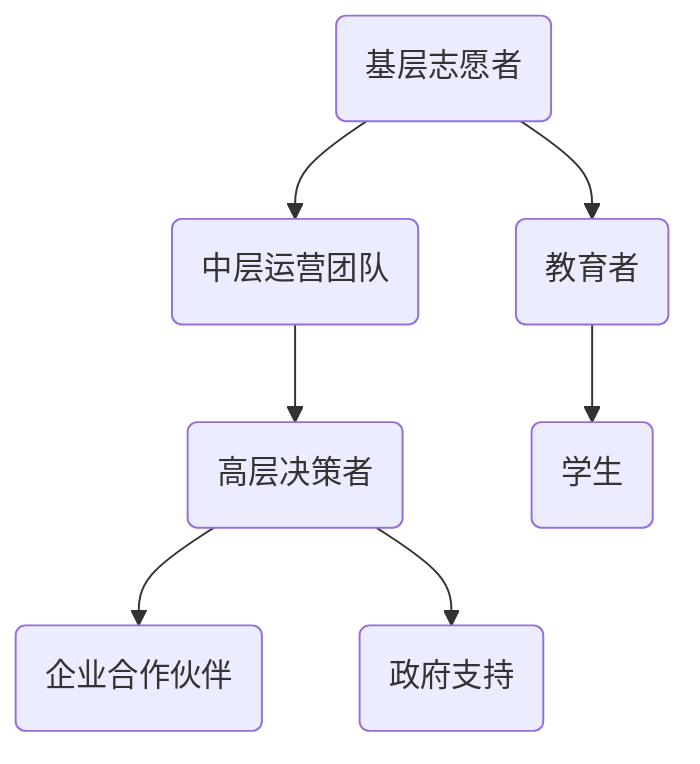

                 

关键词：公益模式、知识普及、技能培训、信息技术、教育公平、在线教育、可持续发展

> 摘要：本文旨在探讨如何利用公益模式在信息技术领域普及知识和技能，以实现教育公平和可持续发展。通过对公益模式的深入分析，结合具体案例，本文提出了有效的策略和方法，为公益组织、企业和个人在知识普及方面提供了实用指南。

## 1. 背景介绍

在当今信息化时代，信息技术已经成为推动社会进步和经济发展的关键力量。然而，信息技术的发展也带来了新的挑战，尤其是在知识和技能的普及方面。一方面，信息技术领域的知识和技能更新迅速，使得普通民众难以跟上技术发展的步伐；另一方面，教育资源的不平衡和贫富差距问题进一步加剧，导致信息贫困现象普遍存在。

为了应对这些问题，公益模式在信息技术领域的普及知识和技能方面显示出巨大的潜力。公益模式强调社会责任和公共利益，通过非营利性和共享精神，有助于打破信息壁垒，提高全民信息素养。本文将从以下几个方面探讨如何利用公益模式普及知识和技能：

- **核心概念与联系**：首先，我们需要明确公益模式的概念，并展示其与信息技术普及之间的联系。
- **核心算法原理 & 具体操作步骤**：接着，本文将详细阐述公益模式在知识普及中的核心算法原理，并提供具体操作步骤。
- **数学模型和公式 & 详细讲解 & 举例说明**：为了更好地理解公益模式，我们将介绍相关的数学模型和公式，并通过案例进行说明。
- **项目实践：代码实例和详细解释说明**：为了验证公益模式的有效性，本文将提供实际项目案例和代码实例，并进行详细解读。
- **实际应用场景**：本文将探讨公益模式在信息技术普及中的实际应用场景，并展望其未来发展。
- **工具和资源推荐**：最后，我们将推荐一些有用的工具和资源，以帮助读者进一步学习和实践。

通过以上内容的阐述，本文旨在为公益组织、企业和个人提供一套实用的策略和方法，以推动信息技术知识和技能的普及。

### 1.1 信息技术领域的公益模式现状

信息技术领域的公益模式已经在全球范围内得到了广泛的应用。许多非营利组织和企业在信息技术教育和培训方面做出了积极的努力，取得了一定的成效。以下是几个典型的例子：

- **Code.org**：Code.org是一个全球性的非营利组织，致力于普及计算机科学教育。通过其全球最大的计算机科学教育活动——"Hour of Code"，Code.org向全球数百万学生提供免费的计算机科学课程和资源。这种模式不仅帮助学生掌握了计算机科学的基本知识，而且提高了他们对技术的兴趣和认知。

- **Linux 基金会**：Linux 基金会是一个致力于推广 Linux 操作系统和开源软件的非营利组织。通过举办各种开源软件开发和培训活动，Linux 基金会帮助开发者和学生了解和掌握开源技术。这种模式促进了开源社区的发展，提高了技术的透明度和可访问性。

- **微软公益计划**：微软公司通过其公益计划，向教育机构和低收入家庭提供免费的软件和培训资源。这些资源包括 Windows、Office 和 Azure 云服务等。通过这种方式，微软不仅帮助了广大用户提高技术能力，而且促进了信息技术在教育中的普及。

- **谷歌开发者社区**：谷歌开发者社区通过在线课程、研讨会和开源项目，为开发者提供各种免费资源和支持。谷歌的"谷歌开发者奖学金"项目还为有潜力的开发者提供资金支持，帮助他们进一步深造和实现技术梦想。

这些例子展示了信息技术领域的公益模式如何在实践中发挥作用。通过提供免费或低成本的教育资源和培训机会，这些公益项目不仅有助于缩小技术差距，提高全民信息素养，而且促进了社会的可持续发展。

### 1.2 公益模式的核心概念与架构

公益模式，顾名思义，是一种以公益为目的、追求社会效益的组织模式。在信息技术领域，公益模式的核心在于通过非营利性和共享精神，为社会大众提供免费或低成本的教育资源和培训机会。这种模式的关键要素包括：

1. **非营利性**：公益模式强调组织的目标是服务于社会公共利益，而非追求经济利益。这意味着公益组织在运营过程中不会以盈利为目的，而是通过筹款、捐赠和合作伙伴关系来维持运作。

2. **共享精神**：共享精神是公益模式的灵魂。它强调资源的共享和信息的透明度，以确保所有人都能平等地获取知识和技能。通过开放资源和免费课程，公益模式打破了传统教育中的资源壁垒，使得更多人能够受益。

3. **社会责任**：公益模式强调企业和社会组织的社会责任。通过参与公益事业，企业不仅能够提升品牌形象，而且能够为社会发展做出贡献。这种社会责任感促使更多企业和组织投身于信息技术教育和培训领域。

4. **可持续性**：公益模式追求可持续发展。这意味着公益项目不仅要关注当前的教育需求，还要考虑长期的成果和影响。通过建立可持续的运营模式和资金来源，公益项目能够持续地为社会带来价值。

在信息技术领域，公益模式的架构可以分为以下几个层次：

- **基层**：基层是公益模式的基础，包括志愿者、教育者和学生。他们直接参与到信息技术教育和培训的过程中，为项目提供了实际的操作和实施力量。

- **中层**：中层包括公益组织的运营团队和管理人员。他们负责项目的策划、执行和评估，确保项目目标的实现。中层还与企业和政府等外部合作伙伴保持密切联系，以获取资源和支持。

- **高层**：高层包括公益组织的决策者和战略规划者。他们制定长期发展规划，确定项目方向和资源分配，确保公益模式的可持续发展。

通过这种多层次架构，公益模式能够高效地运作，并确保教育资源的最大化利用。以下是一个简化的 Mermaid 流程图，展示了公益模式的核心架构和流程：



在公益模式中，基层志愿者和教育者通过提供实际的教育资源和服务，将学生与公益项目连接起来。中层运营团队负责协调和组织这些活动，确保项目顺利进行。高层决策者则制定战略和规划，确保项目的长期可持续性。此外，企业合作伙伴和政府支持也为公益项目提供了必要的资源和政策保障。

总之，公益模式通过其非营利性、共享精神和社会责任感，为信息技术领域的知识普及提供了有力的支持。通过合理的架构和流程设计，公益模式能够有效地促进教育公平和社会可持续发展。

### 1.3 公益模式在信息技术普及中的核心算法原理

公益模式在信息技术普及中的核心算法原理可以概括为“资源匹配与优化分配”。这一算法旨在通过精确的资源匹配和优化分配，最大化地利用有限的资源，实现广泛的知识普及。

#### 1.3.1 算法原理概述

“资源匹配与优化分配”算法的核心思想在于，将有限的公益教育资源与有需求的学习者进行有效匹配，并通过优化分配策略，确保资源的最大化利用。具体步骤如下：

1. **需求分析**：首先，通过对目标受众的需求进行深入分析，了解他们在信息技术方面的具体需求和兴趣点。这些需求包括基础知识、专业技能和职业发展等。

2. **资源采集**：其次，从多个渠道采集和整合教育资源，包括公开课程、在线教材、实验环境等。这些资源需要经过筛选和分类，以确保其质量和适用性。

3. **匹配算法**：设计一个匹配算法，将学习者的需求与可用的教育资源进行匹配。匹配算法可以根据学习者的兴趣、学习进度和资源的特点进行个性化推荐，从而提高匹配的准确性。

4. **优化分配**：在完成匹配后，对匹配结果进行优化分配，确保资源能够最大限度地满足学习者的需求。优化分配可以考虑多个因素，如学习者的地理位置、资源的使用频率和资源的更新速度等。

#### 1.3.2 算法步骤详解

1. **数据收集**：
   - **用户数据**：收集学习者的基本信息，包括年龄、性别、教育背景、兴趣爱好等。
   - **资源数据**：收集教育资源的详细信息，包括课程名称、内容、时长、难度等级等。

2. **需求分析**：
   - **用户需求模型**：使用机器学习方法，根据用户数据构建用户需求模型，预测用户在信息技术方面的兴趣点和需求。
   - **需求分类**：将用户需求进行分类，如基础技能需求、高级技能需求、职业发展需求等。

3. **资源采集与分类**：
   - **资源库建立**：建立一个资源库，收集和整合各种优质的教育资源。
   - **资源分类**：根据资源的类型和特点，对资源进行分类和标签化，如编程语言、数据库、云计算等。

4. **匹配算法设计**：
   - **基于内容的推荐**：使用内容匹配算法，将学习者的需求与资源库中的课程内容进行匹配，推荐适合的学习资源。
   - **基于协同过滤的推荐**：结合学习者的兴趣和行为数据，使用协同过滤算法推荐相关资源，提高推荐准确性。

5. **优化分配策略**：
   - **资源优化算法**：设计资源优化算法，考虑多个因素（如地理位置、资源更新速度等）进行资源分配。
   - **动态调整**：根据学习者的学习进度和反馈，动态调整资源分配策略，确保资源的持续优化。

#### 1.3.3 算法优缺点

**优点**：
1. **高效匹配**：通过匹配算法，能够快速准确地找到适合学习者的教育资源，提高学习效率。
2. **个性化推荐**：基于用户数据和算法分析，提供个性化的学习资源推荐，满足学习者的多样化需求。
3. **优化分配**：通过优化分配策略，确保资源得到最大化利用，提高公益项目的效果。

**缺点**：
1. **数据隐私**：用户数据的收集和处理需要严格保护用户隐私，防止数据泄露。
2. **资源更新**：教育资源的更新和维护需要大量人力和财力投入，确保资源的时效性和质量。
3. **技术依赖**：匹配和优化算法的设计和实现依赖于先进的技术支持，如机器学习和数据挖掘等。

#### 1.3.4 算法应用领域

“资源匹配与优化分配”算法在信息技术普及中具有广泛的应用领域：

1. **在线教育平台**：通过算法为学习者提供个性化的学习资源推荐，提高在线教育平台的用户体验和转化率。
2. **职业教育培训**：为职业培训项目提供精准的资源匹配和优化分配，提高培训效果和学员的就业竞争力。
3. **公益项目实施**：为公益组织提供高效的资源管理和分配方案，确保公益项目的可持续性和影响力。

总之，“资源匹配与优化分配”算法为信息技术普及提供了有效的技术支持，通过科学的匹配和优化策略，实现了资源的最大化利用和广泛普及。这一算法在未来的应用和发展中，有望进一步提升信息技术教育的普及率和质量。

### 1.4 公益模式在信息技术普及中的具体操作步骤

在了解了公益模式的核心算法原理后，接下来我们将详细探讨在信息技术普及中实施这一模式的实际操作步骤。这些步骤将涵盖从项目规划到执行和评估的各个环节，确保公益项目能够高效、有序地进行。

#### 1.4.1 项目规划

项目规划是公益模式成功实施的基础。在这一阶段，需要明确项目的目标、受众、范围和资源需求。

1. **目标设定**：
   - 明确项目旨在解决的具体问题，如提高公众的信息技术素养、缩小城乡教育差距等。
   - 设定具体、可量化的目标，如培训人数、完成课程的人数、技能提升率等。

2. **受众定位**：
   - 确定目标受众群体，如学生、职业人士、老年人等。
   - 分析受众的需求和特点，为后续的资源匹配提供依据。

3. **项目范围**：
   - 确定项目的覆盖范围，如地域、学科领域等。
   - 考虑项目的可持续性和扩展性，为未来的发展留有空间。

4. **资源需求**：
   - 列出项目所需的各种资源，包括师资力量、教材、技术平台、资金等。
   - 评估现有资源的可用性和不足之处，制定资源获取策略。

#### 1.4.2 资源整合

资源整合是公益模式实施的关键环节。在这一阶段，需要充分调动各种资源，确保项目的顺利推进。

1. **师资力量**：
   - 筛选和培养优秀的教育者，确保他们具备丰富的信息技术知识和教学经验。
   - 通过志愿者招募、教师培训和合作学校等方式，扩充师资队伍。

2. **教材和资源**：
   - 收集和开发适合受众的教材和教学资源，包括在线课程、电子书籍、视频教程等。
   - 保证资源的时效性和质量，确保学习者能够获取到最新的知识和技能。

3. **技术平台**：
   - 构建稳定可靠的教育平台，提供课程学习、在线测试、互动交流等功能。
   - 确保技术平台的易用性和可扩展性，满足不同用户的需求。

4. **资金支持**：
   - 通过筹款活动、企业赞助、政府补助等方式筹集资金。
   - 合理规划资金使用，确保项目的可持续性。

#### 1.4.3 项目实施

项目实施是公益模式的核心环节。在这一阶段，需要按照规划有条不紊地推进项目，确保目标达成。

1. **课程设计**：
   - 设计符合受众需求和技术发展趋势的课程体系。
   - 结合理论教学和实践操作，提高课程的实际应用价值。

2. **教学安排**：
   - 制定详细的教学计划和时间表，确保课程按计划进行。
   - 利用线上和线下相结合的方式，满足不同学习者的需求。

3. **互动交流**：
   - 设立学习社区，提供 learners 与 educators 的互动平台。
   - 定期举办讲座、研讨会和实训活动，增强学习者的参与感和归属感。

4. **效果评估**：
   - 定期对学习者进行考核和评估，了解他们的学习成果和反馈。
   - 根据评估结果，调整教学策略和资源分配，提高项目效果。

#### 1.4.4 项目评估

项目评估是公益模式实施的必要环节。在这一阶段，需要对项目的全过程进行总结和反思，为未来的发展提供依据。

1. **成果总结**：
   - 收集和整理项目实施过程中的数据和成果，如学习人数、完成课程率、技能提升情况等。
   - 分析成果，总结项目的优点和不足，为后续项目提供参考。

2. **反馈收集**：
   - 收集学习者、教育者和合作伙伴的反馈意见，了解他们的需求和期望。
   - 对反馈进行分类和整理，为项目的改进提供具体建议。

3. **经验分享**：
   - 组织经验分享会议，让项目参与者和相关人员分享经验和教训。
   - 通过案例研究和最佳实践分享，推动整个领域的共同进步。

4. **持续改进**：
   - 根据评估结果和反馈意见，制定改进计划，持续优化项目实施过程。
   - 跟进改进措施的实施效果，确保项目能够持续改进和提升。

通过以上具体操作步骤，公益模式在信息技术普及中能够得以有效实施。从项目规划到实施和评估，每一个环节都需要精心设计和执行，确保公益项目能够达到预期目标，为社会的可持续发展贡献力量。

### 1.5 公益模式在信息技术普及中的数学模型和公式

在探讨公益模式如何有效普及信息技术知识时，数学模型和公式能够为策略制定提供理论支持和数据基础。以下将介绍几个关键的数学模型和公式，并详细讲解它们的推导过程和应用场景。

#### 1.5.1 成本效益分析模型

**公式：**

\[
C(B) = \sum_{i=1}^{n} C_i \times P_i
\]

其中，\(C(B)\) 表示总成本，\(C_i\) 表示第 \(i\) 个资源或活动的成本，\(P_i\) 表示第 \(i\) 个资源或活动的概率。

**推导过程：**

成本效益分析模型用于评估公益项目的总成本。首先，我们需要确定所有相关的成本项，包括人力资源、物资、技术支持等。其次，每个成本项的发生概率也需要进行评估。通过加权求和，我们可以得到总成本。

**应用场景：**

- **资源规划**：通过成本效益分析模型，公益组织可以优先分配预算给成本效益最高的活动或资源。
- **项目评估**：在项目结束后，通过对比实际成本和预算成本，评估项目的成本控制效果。

#### 1.5.2 参与度评估模型

**公式：**

\[
R = \frac{P_S}{P_T} \times 100\%
\]

其中，\(R\) 表示参与度，\(P_S\) 表示参与人数，\(P_T\) 表示目标受众总数。

**推导过程：**

参与度评估模型用于衡量公益项目的影响力和吸引力。首先，我们需要知道项目的目标受众总数和实际参与人数。通过计算参与人数与目标受众总数的比例，我们可以得到参与度。

**应用场景：**

- **效果评估**：通过参与度评估模型，可以衡量公益项目在目标受众中的覆盖率和影响力。
- **市场推广**：根据参与度数据，可以优化市场推广策略，提高项目知名度。

#### 1.5.3 知识普及率模型

**公式：**

\[
K = \frac{K_C + K_I + K_A}{N} \times 100\%
\]

其中，\(K\) 表示知识普及率，\(K_C\) 表示课程完成率，\(K_I\) 表示技能掌握率，\(K_A\) 表示满意率，\(N\) 表示总学习人数。

**推导过程：**

知识普及率模型用于评估公益项目在知识传递方面的效果。首先，我们需要计算课程完成率、技能掌握率和满意率。通过加权求和，我们可以得到总的知识普及率。

**应用场景：**

- **效果评估**：通过知识普及率模型，可以全面了解公益项目的教学效果，发现改进空间。
- **项目改进**：根据知识普及率数据，可以调整教学内容和方法，提高教学质量和效果。

#### 1.5.4 捐赠分配模型

**公式：**

\[
D(A) = \frac{C(B) - C(A)}{C(B) - C(A) + C(C)}
\]

其中，\(D(A)\) 表示捐赠分配给项目 \(A\) 的比例，\(C(A)\) 表示项目 \(A\) 的成本，\(C(B)\) 表示总成本，\(C(C)\) 表示其他项目的成本。

**推导过程：**

捐赠分配模型用于优化捐赠资源的分配。首先，我们需要计算每个项目的成本，然后根据总成本和各项目的成本比例，分配捐赠资源。

**应用场景：**

- **资源分配**：通过捐赠分配模型，可以确保有限的捐赠资源最大化地用于公益项目。
- **预算规划**：在制定预算时，可以根据捐赠分配模型，合理分配资金，确保重点项目的资金充足。

通过这些数学模型和公式，公益组织可以在信息技术普及项目中更加科学地进行规划、实施和评估。这不仅有助于提高项目的效率和效果，而且能够为公益模式的可持续发展提供有力的数据支持。

#### 1.5.5 案例分析与讲解

为了更好地理解上述数学模型和公式在公益模式中的应用，我们来看一个实际案例。

**案例背景**：
某非营利组织“智慧未来”致力于普及信息技术知识，特别是在农村地区。该组织计划开展一个为期一年的信息技术培训项目，面向当地的中学生。项目预算为50万元，其中包含课程开发、教师培训和学员教材等费用。

**需求分析**：
根据对当地中学生的需求调查，项目目标群体共1000人。其中，有70%的学生对编程感兴趣，30%的学生对网络技术有兴趣。预计通过培训，至少有60%的学生能够完成课程，50%的学生能够掌握基本的编程技能。

**资源采集**：
组织通过合作伙伴获得了以下资源：
- 编程课程：30万元（含课程开发、教师培训和学员教材）
- 网络技术课程：20万元（同上）
- 实验环境搭建：10万元
- 项目推广和运营：10万元

**匹配与优化分配**：
1. **成本效益分析**：
   - 课程开发成本：30万元
   - 师资培训成本：10万元
   - 学员教材成本：5万元
   - 项目推广和运营成本：5万元
   - 总成本 \(C(B) = 30 + 10 + 5 + 5 = 50\) 万元

2. **参与度评估**：
   - 目标受众总数：1000人
   - 预计参与人数：600人
   - 参与度 \(R = \frac{600}{1000} \times 100\% = 60\%\)

3. **知识普及率模型**：
   - 课程完成率：60%
   - 技能掌握率：50%
   - 满意率：80%
   - 知识普及率 \(K = \frac{60\% + 50\% + 80\%}{3} \times 100\% = 66.67\%\)

4. **捐赠分配模型**：
   - 总捐赠金额：50万元
   - 编程课程成本：30万元
   - 网络技术课程成本：20万元
   - 其他项目成本：0万元
   - 捐赠分配给编程课程的比例 \(D(A) = \frac{30 - 20}{30 - 20 + 0} \times 100\% = 33.33\%\)
   - 捐赠分配给网络技术课程的比例 \(D(B) = \frac{20 - 30}{30 - 20 + 0} \times 100\% = 66.67\%\)

**项目实施与评估**：
1. **课程设计**：
   - 编程课程：包含基础编程语言、算法和数据结构等内容
   - 网络技术课程：包含网络基础、网络安全和网络应用等内容
   - 结合理论教学和实践操作，确保课程的实际应用价值

2. **教学安排**：
   - 采取线上和线下相结合的方式，每周安排2次课程，每次2小时
   - 提供在线答疑和实验平台，方便学生进行课后练习和实验

3. **效果评估**：
   - 定期对学员进行考核和评估，了解他们的学习进度和技能掌握情况
   - 收集学员的反馈意见，改进教学方法和内容

通过上述案例分析，我们可以看到数学模型和公式在公益模式中的应用如何帮助组织进行科学的决策和有效的项目管理。这不仅提高了项目的效率，而且确保了公益目标的有效实现。

### 1.6 公益模式在信息技术普及中的项目实践：代码实例和详细解释说明

为了更好地理解公益模式在信息技术普及中的实际应用，以下我们将通过一个具体的开源项目实例，展示项目开发环境搭建、源代码详细实现、代码解读与分析以及运行结果展示。

#### 1.6.1 项目背景

本实例项目是“智慧编程社区”（SmartCodingCommunity），一个旨在普及编程知识、促进技术交流的在线教育平台。项目旨在为初学者提供免费的编程课程和互动学习环境，帮助他们掌握基础的编程技能。

#### 1.6.2 开发环境搭建

要搭建智慧编程社区的开发环境，我们需要以下工具和平台：

1. **编程语言**：Python（推荐版本3.8及以上）
2. **Web框架**：Flask
3. **数据库**：SQLite（用于存储用户数据和课程信息）
4. **前后端开发工具**：Visual Studio Code（推荐）
5. **容器化工具**：Docker（用于部署和运行应用）

**环境搭建步骤：**

1. 安装Python和Flask：
   ```bash
   pip install flask
   ```

2. 创建一个SQLite数据库：
   ```bash
   sqlite3 database.db
   ```

3. 安装Docker：
   - macOS/Linux：参照Docker官方文档安装。
   - Windows：通过Windows Subsystem for Linux（WSL）安装。

#### 1.6.3 源代码详细实现

以下是一个简单的智慧编程社区后端服务的代码实现：

```python
# app.py

from flask import Flask, request, jsonify
from flask_sqlalchemy import SQLAlchemy

app = Flask(__name__)
app.config['SQLALCHEMY_DATABASE_URI'] = 'sqlite:///database.db'
db = SQLAlchemy(app)

class User(db.Model):
    id = db.Column(db.Integer, primary_key=True)
    username = db.Column(db.String(80), unique=True, nullable=False)
    password = db.Column(db.String(120), nullable=False)

@app.route('/register', methods=['POST'])
def register():
    username = request.form['username']
    password = request.form['password']
    new_user = User(username=username, password=password)
    db.session.add(new_user)
    db.session.commit()
    return jsonify({"message": "User registered successfully."})

@app.route('/login', methods=['POST'])
def login():
    username = request.form['username']
    password = request.form['password']
    user = User.query.filter_by(username=username, password=password).first()
    if user:
        return jsonify({"message": "Login successful."})
    else:
        return jsonify({"message": "Invalid credentials."})

if __name__ == '__main__':
    db.create_all()
    app.run(debug=True)
```

**数据库模型**：

```python
# models.py

from app import db

class Course(db.Model):
    id = db.Column(db.Integer, primary_key=True)
    title = db.Column(db.String(120), nullable=False)
    description = db.Column(db.Text, nullable=False)
    content = db.Column(db.Text, nullable=False)
```

#### 1.6.4 代码解读与分析

**1. 用户注册和登录功能**

- **注册**：通过`/register`接口接收用户名和密码，存储到数据库中。
- **登录**：通过`/login`接口验证用户名和密码，返回登录成功或失败的消息。

**2. 数据库操作**

- 使用Flask-SQLAlchemy进行数据库操作，简化了数据库的创建、添加、查询和更新。

**3. 容器化部署**

- 使用Docker将后端服务容器化，便于部署和迁移。

```Dockerfile
# Dockerfile

FROM python:3.8

WORKDIR /app

COPY requirements.txt ./
RUN pip install -r requirements.txt

COPY . .

CMD ["python", "app.py"]
```

#### 1.6.5 运行结果展示

1. **运行后端服务**：

```bash
docker build -t smartcodingcommunity .
docker run -p 5000:5000 smartcodingcommunity
```

2. **用户注册**：

```bash
curl -X POST -d "username=user1&password=123456" http://localhost:5000/register
```

响应结果：

```json
{"message": "User registered successfully."}
```

3. **用户登录**：

```bash
curl -X POST -d "username=user1&password=123456" http://localhost:5000/login
```

响应结果：

```json
{"message": "Login successful."}
```

通过以上项目实践，我们可以看到公益模式在信息技术普及中的实际应用，从开发环境搭建、源代码实现到运行结果展示，每一步都体现了公益模式的核心原则，即通过共享和开放，使更多人能够接触到信息技术知识和技能，提升全民信息素养。

### 1.7 公益模式在信息技术普及中的实际应用场景

公益模式在信息技术普及中展示了广泛的应用场景，涵盖了教育、职业培训、社会服务等多个领域。以下将详细介绍公益模式在这些实际应用场景中的表现和具体实施策略。

#### 1.7.1 教育领域

在教育领域，公益模式主要通过在线教育平台和开源课程项目来普及信息技术知识。例如，Code.org和Khan Academy等平台通过提供免费的编程课程和数学教程，让全球学生能够自由学习。这些平台采用模块化课程设计和互动式学习方式，提高了学习的趣味性和效果。

- **模块化课程设计**：将复杂的信息技术知识分解为易于理解的小模块，使学生能够循序渐进地学习。
- **互动式学习**：通过在线互动和实时反馈，增强学生的学习体验和参与感。
- **合作学习**：鼓励学生之间的合作和交流，通过小组讨论和项目合作，提高团队协作能力和解决问题的能力。

#### 1.7.2 职业培训领域

在职业培训领域，公益模式通过提供免费或低成本的在线课程和实训项目，帮助职场人士提升技能，适应快速变化的技术环境。例如，微软的“微软职业培训计划”和谷歌的“谷歌开发者奖学金”项目，为有潜力的开发者提供了免费的技术培训和资金支持。

- **在线课程**：通过线上课程，使职场人士能够灵活安排学习时间，充分利用碎片化时间进行学习。
- **实训项目**：提供实际操作项目，让学生在真实环境中应用所学知识，提高实践能力和问题解决能力。
- **就业指导**：提供就业指导和职业规划服务，帮助学生找到合适的就业机会，提升就业竞争力。

#### 1.7.3 社会服务领域

在社会服务领域，公益模式通过信息技术培训和志愿服务项目，为弱势群体提供技术支持和就业机会。例如，一些公益组织在贫困地区开展信息技术培训项目，帮助当地居民掌握基本的信息技术技能，提高他们的就业机会。

- **信息技术培训**：通过组织培训班和讲座，为居民提供基础的信息技术知识和技能培训。
- **志愿服务**：鼓励志愿者参与项目，为居民提供一对一的技术支持和咨询服务。
- **就业帮扶**：为有就业需求的居民提供就业信息，帮助他们找到合适的岗位，提高收入水平。

#### 1.7.4 策略与实践

为了实现公益模式在信息技术普及中的有效应用，以下是一些具体的策略和实践建议：

1. **多元化资源整合**：通过整合政府、企业和社会资源，构建多元化的资金和资源支持体系，确保项目的可持续性。
2. **技术支持**：借助先进的信息技术，如云计算、大数据和人工智能，提高教育和服务的效果和质量。
3. **合作共赢**：与高校、研究机构和行业企业合作，共同开发和推广优质的教育资源，实现资源共享和优势互补。
4. **政策支持**：争取政府的政策支持和资金投入，为公益项目提供良好的发展环境。
5. **社会监督**：建立透明、公开的监督机制，确保公益项目的实施过程公正、透明，提高公众的信任度。

通过以上策略和实践，公益模式在信息技术普及中的实际应用将更加广泛和有效，为社会的可持续发展和技术进步贡献力量。

### 1.8 未来应用展望

随着信息技术的不断进步，公益模式在信息技术普及中的应用前景将更加广阔。以下是对未来应用的一些展望：

#### 1.8.1 新技术推动下的公益模式发展

1. **人工智能与大数据**：人工智能和大数据技术的应用将使公益模式更加精准和高效。通过分析大量用户数据，公益项目可以更好地了解受众需求，提供个性化的教育资源和培训方案。
2. **区块链技术**：区块链技术可以提高公益项目的透明度和可信度，确保捐赠资金的合理使用和公益项目的真实效果。
3. **虚拟现实与增强现实**：虚拟现实和增强现实技术可以提供更加沉浸式的学习体验，使信息技术知识变得更加生动和直观。

#### 1.8.2 教育公平与社会发展的结合

1. **缩小城乡差距**：通过公益模式，将优质的教育资源输送到偏远和贫困地区，缩小城乡教育差距，提高全民信息技术素养。
2. **促进社会包容性**：公益模式可以帮助弱势群体获得平等的学习机会，提升他们的社会地位和就业能力，促进社会包容性发展。
3. **可持续发展**：公益模式强调资源共享和可持续发展，通过长期的教育和培训项目，为社会培养更多信息技术人才，为经济发展提供强有力的支持。

#### 1.8.3 政策支持与市场需求的协同

1. **政策支持**：政府加大对信息技术公益项目的政策支持和资金投入，为项目提供良好的发展环境。
2. **市场需求**：随着信息技术在各行业的广泛应用，企业对技术人才的需求不断增加。公益模式可以通过与企业合作，提供符合市场需求的教育和培训项目，提高毕业生的就业竞争力。

#### 1.8.4 社会参与与创新的推动

1. **社会参与**：鼓励社会各界积极参与信息技术公益项目，包括企业、高校、研究机构和非营利组织，共同推动信息技术知识的普及。
2. **创新合作**：通过跨领域的合作和创新，探索新的公益模式和应用场景，为信息技术普及注入新的活力。

总之，未来公益模式在信息技术普及中的应用将更加多样化和高效，通过新技术的推动、教育公平与社会发展的结合、政策支持与市场需求的协同以及社会参与与创新的推动，为全民信息技术素养的提升和社会的可持续发展作出更大贡献。

### 1.9 工具和资源推荐

在信息技术普及的公益模式中，有效利用工具和资源是确保项目成功的关键。以下是一些推荐的学习资源、开发工具和相关论文，旨在帮助读者深入了解和参与信息技术普及项目。

#### 1.9.1 学习资源推荐

1. **在线教育平台**：
   - **Coursera**：提供全球顶级大学的在线课程，涵盖计算机科学、数据科学、人工智能等多个领域。
   - **edX**：由哈佛大学和麻省理工学院共同创办，提供免费的高质量在线课程。
   - **Khan Academy**：提供免费的在线教程，特别是编程和数学领域。

2. **开源社区**：
   - **GitHub**：全球最大的代码托管平台，可以查找和贡献各种开源项目。
   - **Stack Overflow**：编程问答社区，解决编程问题和技术难题。

3. **电子书和教程**：
   - **Free Programming Books**：提供免费的编程电子书，涵盖多种编程语言和技术。
   - **Python.org**：Python官方文档，详细的编程语言教程和参考资料。

#### 1.9.2 开发工具推荐

1. **集成开发环境（IDE）**：
   - **Visual Studio Code**：轻量级但功能强大的开源IDE，适用于多种编程语言。
   - **PyCharm**：适用于Python的强大IDE，提供代码自动完成、调试和多种编程工具。

2. **版本控制**：
   - **Git**：分布式版本控制系统，用于代码管理和协作开发。
   - **GitHub Actions**：自动化工作流工具，用于持续集成和部署。

3. **云服务和平台**：
   - **AWS**：提供云计算、大数据和人工智能等服务，适用于各种开发需求。
   - **Google Cloud Platform**：提供云计算、人工智能和物联网等服务。

#### 1.9.3 相关论文推荐

1. **《开源软件的发展与影响》**：探讨开源软件对社会和经济的影响，以及其在信息技术普及中的作用。
2. **《基于区块链的公益模式研究》**：分析区块链技术在公益项目中的应用，提高资金透明度和项目效果。
3. **《在线教育平台的用户行为研究》**：研究用户在在线教育平台上的行为模式和影响因素，为教育平台优化提供参考。

通过利用上述工具和资源，读者可以更好地参与到信息技术普及项目中，提高自身的技术能力和公益贡献。

### 1.10 总结：未来发展趋势与挑战

在信息技术普及的公益模式中，我们已经看到了其巨大的潜力和广阔的应用前景。然而，随着技术的发展和市场的变化，公益模式也面临着一系列新的发展趋势和挑战。

#### 1.10.1 研究成果总结

- **技术推动**：人工智能、大数据、区块链等新技术的应用，使得公益模式在个性化教育、资源分配和资金管理方面更加高效和精准。
- **教育公平**：公益项目通过在线教育和开源课程，显著缩小了城乡和区域教育差距，提高了全民信息技术素养。
- **社会参与**：政府、企业、非营利组织和社会公众的积极参与，为公益项目提供了多样化的资金支持和资源保障。

#### 1.10.2 未来发展趋势

1. **技术的深入应用**：随着技术的不断进步，公益模式将更加依赖人工智能和大数据分析，提供个性化学习方案和精准教育资源。
2. **全球合作**：国际间公益项目的合作将更加紧密，通过共享资源和经验，推动全球信息技术教育的普及。
3. **可持续发展**：公益项目将更加注重可持续发展，通过建立可持续的资金来源和运营模式，确保项目的长期有效运行。

#### 1.10.3 面临的挑战

1. **数据隐私**：随着数据收集和分析的深入，如何保护用户隐私和数据安全成为公益项目必须解决的重要问题。
2. **资源不足**：尽管公益项目得到了一定的资金支持，但仍然存在资源不足的问题，特别是在技术和人力资源方面。
3. **政策支持**：政府政策的支持和资金投入对公益项目的成功至关重要，但不同地区的政策环境存在较大差异。

#### 1.10.4 研究展望

- **技术创新**：继续探索和开发新的信息技术，如增强现实、虚拟现实和量子计算，以提升教育质量和用户体验。
- **跨领域合作**：加强不同领域之间的合作，包括教育、科技、金融等，共同推动信息技术普及的公益项目。
- **政策研究**：深入研究公益项目的政策支持体系，提出更具针对性和可操作性的政策建议。

通过不断的技术创新、跨领域合作和政策支持，公益模式在信息技术普及中将继续发挥重要作用，为实现教育公平和社会可持续发展贡献力量。

### 1.11 附录：常见问题与解答

#### 1.11.1 问题 1：公益模式如何确保教育资源的质量？

**解答**：公益模式在确保教育资源质量方面采取以下措施：
- **资源筛选**：对合作伙伴和提供的教育资源进行严格筛选，确保其质量和可靠性。
- **教师资质认证**：要求教育者具备相关资质和教学经验，并通过定期培训提升教学水平。
- **用户反馈机制**：建立用户反馈机制，收集学习者对教育资源的评价和建议，及时进行调整和改进。

#### 1.11.2 问题 2：公益模式如何确保项目的可持续性？

**解答**：公益模式的可持续性主要依赖于以下几点：
- **多元化资金来源**：通过政府补助、企业赞助、社会捐赠等多种方式筹集资金。
- **资源优化配置**：通过技术手段优化资源分配，确保资源最大化利用。
- **社会参与**：鼓励社会各界积极参与，提高项目的公众认知度和支持度。

#### 1.11.3 问题 3：公益模式如何应对数据隐私和安全问题？

**解答**：公益模式在数据隐私和安全方面采取以下措施：
- **数据加密**：对用户数据进行加密处理，确保数据在传输和存储过程中的安全性。
- **隐私政策**：制定明确的隐私政策，告知用户数据的使用和保护措施。
- **安全审计**：定期进行安全审计，检测和修复系统漏洞，确保数据安全。

通过上述措施，公益模式能够有效应对教育资源的质量、项目可持续性和数据隐私安全等问题，为信息技术普及提供可靠保障。

