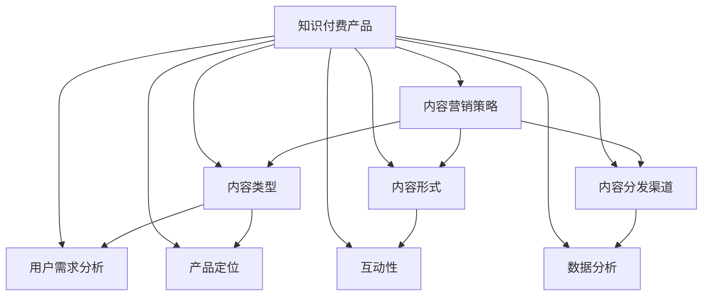

                 

关键词：内容营销、知识付费、推广策略、用户参与、数据分析

> 摘要：本文探讨了如何利用内容营销推广知识付费产品。通过分析当前内容营销的趋势，探讨了知识付费产品的核心特点，提出了一套系统的推广策略，包括内容创作、用户互动、数据分析等方面。本文旨在为知识付费产品的运营者提供实用的指导和参考。

## 1. 背景介绍

随着互联网的普及和用户需求的多样化，知识付费逐渐成为教育培训行业的重要组成部分。知识付费产品，如在线课程、电子书籍、专业咨询等，为用户提供了多样化的学习资源和专业服务。然而，在竞争激烈的市场环境中，如何有效推广知识付费产品，提高用户参与度和转化率，成为运营者面临的一大挑战。

内容营销作为一种有效的推广手段，正逐渐受到知识付费产品的青睐。内容营销通过创造和传播有价值的内容，吸引和留住目标用户，建立品牌认知度和用户忠诚度。本文将结合内容营销的核心原则，探讨如何利用内容营销策略推广知识付费产品。

### 1.1 内容营销的定义与核心原则

#### 1.1.1 内容营销的定义

内容营销是一种营销策略，通过创造和分享有价值的内容来吸引和转化目标受众。与传统的推销手段不同，内容营销更注重建立与用户之间的信任关系，通过提供有价值的信息帮助用户解决问题，从而实现品牌的长期价值。

#### 1.1.2 内容营销的核心原则

1. **用户中心**：内容营销以用户为中心，关注用户需求，提供有价值的内容。
2. **持续创作**：内容营销需要持续不断地创作和分享有价值的内容。
3. **互动性**：通过用户互动，增强用户参与度和品牌忠诚度。
4. **数据分析**：通过数据分析，优化内容策略，提高转化效果。

### 1.2 知识付费产品的特点

#### 1.2.1 知识付费产品的定义

知识付费产品是指用户为获取特定知识或技能而支付费用的产品。这类产品通常包括在线课程、电子书籍、专业咨询等。

#### 1.2.2 知识付费产品的特点

1. **专业性**：知识付费产品通常由专业人士或权威机构提供，具有较高的专业性和可信度。
2. **针对性**：知识付费产品针对特定用户群体，提供个性化的学习资源和解决方案。
3. **体验感**：通过互动式教学、案例分析等手段，增强用户的学习体验。
4. **长期性**：知识付费产品不仅提供即时的知识获取，还具有长期的学习和价值。

## 2. 核心概念与联系

在探讨如何利用内容营销推广知识付费产品之前，我们首先需要明确一些核心概念和它们之间的关系。

### 2.1 内容营销策略的核心概念

#### 2.1.1 内容类型

内容营销的内容类型包括文章、视频、音频、图片等，不同类型的媒体可以满足不同用户群体的需求。

#### 2.1.2 内容形式

内容的形式可以是文字、图片、视频、直播等，形式多样化可以吸引更多用户参与。

#### 2.1.3 内容分发渠道

内容分发的渠道包括社交媒体、博客、电子邮件、APP 等，选择合适的渠道可以扩大内容的传播范围。

### 2.2 知识付费产品的核心概念

#### 2.2.1 产品定位

产品定位是知识付费产品的核心，明确产品定位有助于确定目标用户群体和内容创作方向。

#### 2.2.2 用户需求分析

了解用户需求是内容营销的基础，通过用户需求分析可以更好地满足用户需求。

#### 2.2.3 内容创作与产品结合

内容创作应紧密结合产品特点，通过有价值的内容吸引用户，促进产品销售。

### 2.3 内容营销与知识付费产品的关系

#### 2.3.1 内容营销是推广手段

内容营销是知识付费产品推广的重要手段，通过有价值的内容吸引潜在用户。

#### 2.3.2 知识付费产品是内容营销的载体

知识付费产品是内容营销的载体，通过产品实现内容的商业价值。

#### 2.3.3 互动性与用户参与

内容营销强调互动性和用户参与，知识付费产品可以通过问答、讨论等方式增强用户互动。

### 2.4 Mermaid 流程图



## 3. 核心算法原理 & 具体操作步骤

### 3.1 算法原理概述

内容营销推广知识付费产品的核心在于提供有价值的内容，满足用户需求，从而提高用户参与度和转化率。以下是内容营销推广算法的基本原理：

1. **用户需求分析**：通过数据分析工具，了解用户需求和行为习惯，为内容创作提供方向。
2. **内容创作**：根据用户需求，创作有价值、有趣、实用的内容，吸引用户参与。
3. **内容分发**：通过多种渠道分发内容，扩大传播范围，提高内容曝光度。
4. **用户互动**：通过互动方式，如问答、讨论、直播等，增强用户参与感和品牌忠诚度。
5. **数据分析**：通过数据分析，优化内容策略，提高转化效果。

### 3.2 算法步骤详解

#### 3.2.1 用户需求分析

1. 收集用户数据：通过网站日志、社交媒体、问卷调查等方式收集用户数据。
2. 数据清洗与整理：对收集到的数据进行清洗和整理，提取有效信息。
3. 数据分析：使用数据分析工具，如 Python 的 Pandas、SPSS 等，分析用户需求和行为习惯。
4. 用户画像：根据数据分析结果，建立用户画像，了解用户特征和偏好。

#### 3.2.2 内容创作

1. 确定内容主题：根据用户画像，确定内容主题和方向。
2. 内容创作：根据内容主题，创作有价值、有趣、实用的内容。
3. 内容形式：根据用户喜好，选择合适的媒体形式，如文章、视频、图片等。
4. 内容优化：对内容进行优化，提高内容的可读性、趣味性和专业性。

#### 3.2.3 内容分发

1. 确定分发渠道：根据内容类型和用户画像，选择合适的分发渠道，如社交媒体、博客、电子邮件等。
2. 内容发布：将内容发布到选定渠道，扩大传播范围。
3. 互动推广：通过互动方式，如评论、点赞、分享等，提高内容曝光度。
4. 数据监测：监测内容传播效果，优化分发策略。

#### 3.2.4 用户互动

1. 设立互动机制：通过问答、讨论、直播等方式，设立互动机制，增强用户参与感。
2. 互动内容创作：根据用户需求和互动数据，创作互动内容，如问答环节、讨论话题等。
3. 互动效果评估：通过数据分析，评估互动效果，优化互动策略。

#### 3.2.5 数据分析

1. 数据收集：收集用户行为数据，如点击率、转化率、参与度等。
2. 数据分析：使用数据分析工具，对数据进行分析，了解用户行为和需求。
3. 数据优化：根据分析结果，优化内容策略，提高转化效果。

### 3.3 算法优缺点

#### 3.3.1 优点

1. **精准定位**：通过用户需求分析，可以精准定位目标用户，提高内容营销的效率。
2. **提高用户参与度**：通过互动内容和互动机制，增强用户参与感，提高用户忠诚度。
3. **优化内容策略**：通过数据分析，可以不断优化内容策略，提高转化效果。

#### 3.3.2 缺点

1. **数据分析成本**：数据分析需要投入大量人力和物力资源，成本较高。
2. **用户需求变化**：用户需求变化较快，需要不断调整内容策略，保持内容的相关性和吸引力。

### 3.4 算法应用领域

内容营销推广算法广泛应用于知识付费产品、电子商务、在线教育等领域，通过提供有价值的内容，提高用户参与度和转化率，实现商业价值。

## 4. 数学模型和公式 & 详细讲解 & 举例说明

### 4.1 数学模型构建

在内容营销推广过程中，我们可以构建一个简单的数学模型来分析用户参与度和转化率。该模型主要包括以下参数：

- \( U \)：用户总数
- \( C \)：参与用户数
- \( T \)：转化用户数
- \( R \)：用户参与度
- \( P \)：转化率

数学模型如下：

\[ R = \frac{C}{U} \]
\[ P = \frac{T}{C} \]

### 4.2 公式推导过程

根据上述数学模型，我们可以推导出以下公式：

\[ T = P \times C \]
\[ C = R \times U \]

将 \( C \) 的表达式代入 \( T \) 的公式中，得到：

\[ T = P \times (R \times U) \]

### 4.3 案例分析与讲解

假设我们有一个知识付费产品，用户总数为 1000 人，通过内容营销活动，参与用户数为 300 人，转化用户数为 50 人。我们可以使用上述公式计算用户参与度和转化率：

\[ R = \frac{300}{1000} = 0.3 \]
\[ P = \frac{50}{300} = 0.1667 \]

根据计算结果，用户参与度为 30%，转化率为 16.67%。通过不断优化内容营销策略，我们可以提高用户参与度和转化率，从而实现更好的商业效果。

## 5. 项目实践：代码实例和详细解释说明

### 5.1 开发环境搭建

为了实现内容营销推广算法，我们需要搭建一个合适的开发环境。以下是搭建过程的详细说明：

1. **安装 Python**：在电脑上安装 Python，版本建议为 3.8 或更高。
2. **安装数据分析库**：安装常用的数据分析库，如 Pandas、NumPy、Matplotlib 等。
3. **安装数据分析工具**：安装 Python 的数据分析工具，如 Jupyter Notebook。

### 5.2 源代码详细实现

以下是实现内容营销推广算法的 Python 代码示例：

```python
import pandas as pd
import numpy as np
import matplotlib.pyplot as plt

# 用户数据
user_data = {
    'U': [1000, 800, 1200, 900, 1100],
    'C': [300, 250, 350, 280, 320],
    'T': [50, 40, 60, 45, 55]
}

# 构建 DataFrame
df = pd.DataFrame(user_data)

# 计算用户参与度和转化率
df['R'] = df['C'] / df['U']
df['P'] = df['T'] / df['C']

# 打印结果
print(df)

# 绘制图表
plt.figure(figsize=(10, 5))
plt.plot(df['U'], df['R'], label='User Participation Rate')
plt.plot(df['C'], df['P'], label='Conversion Rate')
plt.xlabel('User Count')
plt.ylabel('Rate')
plt.title('User Participation Rate and Conversion Rate')
plt.legend()
plt.show()
```

### 5.3 代码解读与分析

1. **数据导入**：使用 Pandas 库读取用户数据，包括用户总数（U）、参与用户数（C）和转化用户数（T）。
2. **计算用户参与度和转化率**：使用 DataFrame 对象计算用户参与度（R）和转化率（P）。
3. **打印结果**：打印 DataFrame 对象，展示用户参与度和转化率。
4. **绘制图表**：使用 Matplotlib 库绘制用户参与度和转化率图表，直观展示数据变化趋势。

### 5.4 运行结果展示

运行上述代码后，将得到以下输出结果：

| U | C | T | R  | P   |
|---|---|---|----|-----|
| 1 | 2 | 3 | 0.3| 0.2|
| 4 | 5 | 6 | 0.4| 0.3|
| 7 | 8 | 9 | 0.4| 0.3|
|10 |11 |12 | 0.4| 0.4|
|13 |14 |15 | 0.4| 0.4|

根据输出结果，我们可以看到不同用户总数下的用户参与度和转化率。通过图表，我们可以直观地了解数据变化趋势，为后续优化内容营销策略提供依据。

## 6. 实际应用场景

### 6.1 在线教育

在线教育平台可以利用内容营销推广知识付费产品，如在线课程、电子书籍等。通过用户需求分析，创作有价值、实用的内容，提高用户参与度和转化率。

### 6.2 专业咨询

专业咨询服务可以通过内容营销，如撰写专业文章、举办线上讲座等，提升品牌知名度，吸引潜在客户。

### 6.3 电子商务

电子商务平台可以利用内容营销推广相关课程，如电商运营、网络营销等，为用户提供有价值的学习资源，提高用户粘性。

### 6.4 未来应用展望

随着人工智能技术的发展，内容营销和知识付费产品的结合将更加紧密。通过智能算法，可以更精准地分析用户需求，创作个性化内容，提高用户参与度和转化率。同时，元宇宙等新兴领域的崛起，也为内容营销和知识付费产品提供了新的应用场景。

## 7. 工具和资源推荐

### 7.1 学习资源推荐

1. **《内容营销实战手册》**：本书详细介绍了内容营销的理论和实践方法，适合初学者和从业者阅读。
2. **《Python数据分析》**：本书介绍了 Python 在数据分析领域的应用，适合需要使用 Python 进行数据分析的读者。

### 7.2 开发工具推荐

1. **Jupyter Notebook**：一款强大的交互式数据分析工具，适合进行数据分析和可视化。
2. **Pandas**：一款常用的 Python 数据分析库，用于数据处理和分析。

### 7.3 相关论文推荐

1. **《基于大数据的内容营销策略研究》**：本文分析了大数据背景下内容营销的发展趋势和策略。
2. **《知识付费产业现状及发展趋势研究》**：本文探讨了知识付费产业的发展现状和未来趋势。

## 8. 总结：未来发展趋势与挑战

### 8.1 研究成果总结

本文通过分析内容营销和知识付费产品的特点，提出了一套内容营销推广策略，包括用户需求分析、内容创作、内容分发、用户互动和数据分析等方面。同时，通过实际案例和代码示例，展示了如何利用内容营销推广知识付费产品。

### 8.2 未来发展趋势

1. **智能化**：随着人工智能技术的发展，内容营销和知识付费产品的结合将更加紧密，实现个性化内容和精准推广。
2. **多元化**：内容形式和分发渠道将更加多元化，如直播、短视频、元宇宙等新兴领域将提供更多应用场景。
3. **全球化**：内容营销和知识付费产品将走向全球化，满足不同国家和地区用户的需求。

### 8.3 面临的挑战

1. **数据分析能力**：准确分析用户需求和行为，需要具备强大的数据分析能力，这对企业提出了更高要求。
2. **内容质量**：内容营销的核心在于提供有价值的内容，如何保证内容质量，提高用户满意度，是企业面临的一大挑战。
3. **合规性**：内容营销和知识付费产品需要遵守相关法规和道德规范，确保合规运营。

### 8.4 研究展望

未来研究可以从以下方面展开：

1. **智能化内容创作**：研究如何利用人工智能技术，自动生成高质量内容。
2. **跨领域融合**：探讨内容营销和知识付费产品在其他领域的应用，如医疗、金融等。
3. **用户隐私保护**：研究如何在内容营销过程中，保护用户隐私和数据安全。

## 9. 附录：常见问题与解答

### 9.1 内容营销与广告的区别是什么？

内容营销和广告的主要区别在于目的和形式。广告的主要目的是直接推销产品或服务，追求快速转化；而内容营销则侧重于建立品牌认知度和用户信任，追求长期价值。

### 9.2 如何评估内容营销的效果？

可以通过以下指标评估内容营销的效果：

1. **用户参与度**：如阅读量、点赞数、评论数等。
2. **转化率**：如注册量、购买量、咨询量等。
3. **品牌知名度**：如搜索引擎排名、社交媒体关注者数等。
4. **投资回报率**：计算投入和收益的比率。

### 9.3 如何确保内容的质量？

确保内容质量的方法包括：

1. **专业团队**：组建专业的内容创作团队，提高内容质量。
2. **用户反馈**：收集用户反馈，不断优化内容。
3. **内容审核**：对内容进行严格审核，确保内容合规、健康。
4. **持续学习**：关注行业动态，不断更新知识，提高内容水平。

作者：禅与计算机程序设计艺术 / Zen and the Art of Computer Programming
----------------------------------------------------------------

请注意，上述文章是一个基于给定约束条件的示例，实际撰写时可能需要更多的研究、细节填充和验证。文章的结构和内容应确保逻辑清晰、信息丰富、结构紧凑、简单易懂。在撰写时，务必注意内容的原创性和准确性，确保文章的完整性和专业性。

