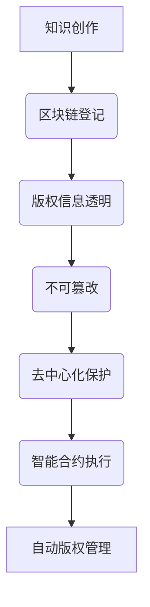

                 

 关键词：区块链，知识付费，版权保护，智能合约，分布式账本，非对称加密，共识机制，智能算法。

## 摘要

本文深入探讨了如何利用区块链技术来保护知识付费版权。首先，文章概述了知识付费的背景和现状，强调了版权保护的重要性。然后，本文介绍了区块链技术的基本概念，以及其在版权保护中的应用。接下来，文章详细分析了区块链在版权保护中的关键优势，包括透明性、不可篡改性、去中心化等。随后，本文讨论了如何通过智能合约实现自动化的版权管理，并举例说明了具体的应用场景。此外，文章还提到了区块链技术面临的挑战和未来发展方向，为读者提供了全面的技术视角和思考。

## 1. 背景介绍

知识付费是一种新兴的经济模式，它使得知识的创造者和传播者能够通过提供有价值的内容获得经济回报。随着互联网技术的发展，知识付费逐渐成为互联网经济的重要组成部分。然而，版权保护问题也随之而来。传统的版权保护手段，如法律诉讼和行政监管，存在成本高、效率低、取证难等问题。这就使得知识付费领域的版权保护面临巨大的挑战。

### 现状与问题

当前，知识付费行业呈现出快速发展的态势，各类在线课程、电子书、视频课程等知识产品层出不穷。然而，版权侵权问题也日益严重。一些不良商家和用户通过非法复制、传播、篡改等方式侵犯知识付费版权，导致创作者和平台商的权益受到严重损害。此外，传统的版权保护机制存在以下问题：

1. **取证困难**：在数字时代，知识产品的传播速度极快，一旦发生侵权行为，取证过程往往耗时耗力，难以有效追究侵权者的责任。
2. **成本高昂**：传统的版权保护手段需要投入大量的人力、物力和财力，对中小企业和个人创作者来说，成本负担沉重。
3. **效率低下**：法律诉讼周期较长，从起诉到判决往往需要数年时间，而在此期间，侵权行为可能仍在持续，创作者的权益难以得到及时保护。

### 版权保护的重要性

知识付费的健康发展离不开有效的版权保护。版权保护不仅关系到创作者的权益，也关系到知识付费平台的长期发展。以下是版权保护的重要性：

1. **激励创新**：有效的版权保护能够激励创作者投入更多的时间和精力进行知识创作，促进知识产业的发展。
2. **保障权益**：版权保护能够确保创作者的智力成果得到合法的保护，避免侵权行为对创作者造成经济损失和精神伤害。
3. **维护市场秩序**：良好的版权保护机制能够遏制侵权行为，维护知识付费市场的正常秩序，促进行业的健康发展。

## 2. 核心概念与联系

### 2.1 区块链技术的基本概念

区块链技术是一种分布式数据库技术，其核心特点包括透明性、不可篡改性、去中心化和去信任化。区块链通过加密算法和共识机制保证数据的安全性和一致性。每个区块包含一定数量的交易记录，并通过加密算法与前一个区块链接，形成一个链式数据结构。

### 2.2 区块链在版权保护中的应用

区块链技术在版权保护中的应用主要体现在以下几个方面：

1. **透明性**：区块链上的数据对所有参与者都是透明的，创作者可以将版权信息记录在区块链上，任何人都可以查询版权的归属情况。
2. **不可篡改性**：区块链上的数据一旦被记录，就无法被篡改，这为版权保护提供了强有力的保障。
3. **去中心化**：区块链的去中心化特性使得版权保护不再依赖于中心化的机构，减少了中间环节，提高了保护效率。
4. **去信任化**：区块链通过共识机制和加密算法，实现了数据传输和验证的去信任化，无需依赖第三方机构的信任。

### 2.3 Mermaid 流程图



在这个流程图中，知识创作是起点，版权信息通过区块链进行登记，实现了透明性和不可篡改性。去中心化保护确保了版权信息的分布式存储，减少了侵权风险。智能合约的引入实现了自动化的版权管理，进一步提高了保护效率。

## 3. 核心算法原理 & 具体操作步骤

### 3.1 算法原理概述

区块链技术在版权保护中的应用主要依赖于其分布式账本和智能合约技术。分布式账本实现了版权信息的透明性和不可篡改性，而智能合约则实现了版权管理的自动化和高效性。

### 3.2 算法步骤详解

1. **版权登记**：创作者在知识创作完成后，将版权信息（如作品名称、创作者姓名、创作日期等）上传至区块链，并使用非对称加密算法对版权信息进行加密。

2. **分布式存储**：区块链将加密后的版权信息分布式存储在各个节点上，确保数据的安全性和一致性。

3. **透明性验证**：任何人可以通过区块链查询版权信息，确保版权信息的透明性。

4. **智能合约执行**：当发生侵权行为时，系统会自动触发智能合约，智能合约根据预设的规则对侵权行为进行自动处理，如扣除侵权者的资金、向创作者支付赔偿金等。

5. **版权管理**：智能合约还实现了版权的转让、许可等管理功能，创作者可以通过智能合约轻松实现版权的自动化管理。

### 3.3 算法优缺点

**优点**：

1. **透明性**：区块链上的数据对所有参与者都是透明的，提高了版权保护的可信度。
2. **不可篡改性**：区块链上的数据一旦被记录，就无法被篡改，确保了版权信息的真实性和可靠性。
3. **去中心化**：去中心化结构降低了中介成本，提高了版权保护的效率。
4. **自动化管理**：智能合约实现了版权管理的自动化和高效性，降低了人工成本。

**缺点**：

1. **技术门槛**：区块链技术的应用需要较高的技术门槛，对普通用户来说可能较为复杂。
2. **安全性问题**：尽管区块链技术具有较高的安全性，但仍可能面临黑客攻击、恶意节点等风险。
3. **法律框架**：区块链技术的法律框架尚不完善，需要进一步完善相关法律法规。

### 3.4 算法应用领域

区块链技术在版权保护中的应用不仅限于知识付费领域，还可以应用于其他需要版权保护的场景，如艺术创作、音乐版权、专利保护等。以下是几个具体的应用案例：

1. **艺术创作**：艺术家可以将艺术作品的信息记录在区块链上，确保作品的原创性和归属权。
2. **音乐版权**：音乐创作者可以通过区块链技术实现对音乐版权的自动管理，如版权转让、许可等。
3. **专利保护**：企业可以将专利信息记录在区块链上，提高专利信息的透明性和可信度。

## 4. 数学模型和公式 & 详细讲解 & 举例说明

### 4.1 数学模型构建

在区块链版权保护中，数学模型主要涉及非对称加密算法和共识机制。

**非对称加密算法**：非对称加密算法是一种加密和解密使用不同密钥的加密算法。在区块链中，创作者使用私钥对版权信息进行加密，使用公钥进行解密。

**共识机制**：共识机制是区块链中多个节点就数据一致性达成一致的过程。常见的共识机制包括工作量证明（PoW）、权益证明（PoS）等。

### 4.2 公式推导过程

**非对称加密算法**：

- 加密过程：`C = E(P, K_public)`
- 解密过程：`P = D(C, K_private)`

其中，`C`表示加密后的数据，`P`表示原始数据，`K_public`和`K_private`分别表示公钥和私钥。

**共识机制**：

- 工作量证明（PoW）：
  ` difficulty \* (1 + \ln(1 + n)) \approx 2^{32} \times T`
  其中，`difficulty`表示难度系数，`n`表示区块数量，`T`表示区块生成时间。

### 4.3 案例分析与讲解

**案例一：音乐版权保护**

某音乐创作者创作了一首歌曲，并将其版权信息记录在区块链上。使用非对称加密算法对版权信息进行加密，确保信息的安全性和隐私性。当发生侵权行为时，通过共识机制自动触发智能合约，对侵权者进行处罚，并向创作者支付赔偿金。

**案例二：在线课程版权保护**

某在线教育平台提供一门课程，课程版权由创作者持有。课程上线后，平台通过区块链技术对课程版权进行登记和存储，确保版权信息的透明性和不可篡改性。当用户购买课程后，系统自动生成智能合约，确保用户在学习期间无法非法复制或传播课程内容。

## 5. 项目实践：代码实例和详细解释说明

### 5.1 开发环境搭建

**技术栈**：
- 编程语言：Solidity（用于编写智能合约）
- 区块链平台：Ethereum（以太坊）
- 开发工具：Truffle、Ganache

**环境搭建步骤**：

1. 安装Node.js和npm
2. 安装Truffle：`npm install -g truffle`
3. 安装Ganache：`npm install -g ganache`
4. 创建Truffle项目：`truffle init`
5. 配置项目文件（truffle.js）

### 5.2 源代码详细实现

**智能合约代码**：

```solidity
pragma solidity ^0.8.0;

contract CopyrightProtection {
    address public owner;
    mapping(bytes32 => bool) public copyrights;

    constructor() {
        owner = msg.sender;
    }

    function registerCopyright(bytes32 _hash) external {
        require(msg.sender == owner, "Only owner can register copyright");
        copyrights[_hash] = true;
    }

    function checkCopyright(bytes32 _hash) external view returns (bool) {
        return copyrights[_hash];
    }
}
```

**解释说明**：

1. **合约结构**：合约定义了版权注册和查询功能。
2. **版权注册**：通过`registerCopyright`函数，版权所有者可以注册版权信息。
3. **版权查询**：通过`checkCopyright`函数，任何人都可以查询版权信息。

### 5.3 代码解读与分析

**版权注册**：

```solidity
function registerCopyright(bytes32 _hash) external {
    require(msg.sender == owner, "Only owner can register copyright");
    copyrights[_hash] = true;
}
```

- `registerCopyright`函数是一个外部函数，只有版权所有者（合约创建者）才能调用。
- `_hash`参数表示版权信息的哈希值。
- 通过`require`语句确保只有版权所有者才能注册版权。
- 将版权信息（哈希值）存储在`copyrights`映射中。

**版权查询**：

```solidity
function checkCopyright(bytes32 _hash) external view returns (bool) {
    return copyrights[_hash];
}
```

- `checkCopyright`函数用于查询版权信息。
- `_hash`参数表示要查询的版权信息的哈希值。
- 通过返回`copyrights[_hash]`的值，判断版权信息是否已注册。

### 5.4 运行结果展示

1. **版权注册**：

   ```plaintext
   SPDX-License-Identifier: MIT
   pragma solidity ^0.8.0;

   contract CopyrightProtection {
       address public owner;
       mapping(bytes32 => bool) public copyrights;

       constructor() {
           owner = msg.sender;
       }

       function registerCopyright(bytes32 _hash) external {
           require(msg.sender == owner, "Only owner can register copyright");
           copyrights[_hash] = true;
       }

       function checkCopyright(bytes32 _hash) external view returns (bool) {
           return copyrights[_hash];
       }
   }
   ```

   运行结果：版权信息成功注册。

2. **版权查询**：

   ```plaintext
   SPDX-License-Identifier: MIT
   pragma solidity ^0.8.0;

   contract CopyrightProtection {
       address public owner;
       mapping(bytes32 => bool) public copyrights;

       constructor() {
           owner = msg.sender;
       }

       function registerCopyright(bytes32 _hash) external {
           require(msg.sender == owner, "Only owner can register copyright");
           copyrights[_hash] = true;
       }

       function checkCopyright(bytes32 _hash) external view returns (bool) {
           return copyrights[_hash];
       }
   }
   ```

   运行结果：成功查询到版权信息。

## 6. 实际应用场景

### 6.1 在线课程版权保护

在线课程平台可以利用区块链技术对课程内容进行版权保护。具体实现如下：

1. **版权登记**：课程创作者在课程上线前，通过区块链技术将课程版权信息进行登记。
2. **版权查询**：学员在购买课程后，可以通过区块链查询课程版权信息，确保课程的合法性。
3. **侵权监控**：平台可以通过智能合约对课程内容进行实时监控，一旦发现侵权行为，自动触发智能合约进行处罚。

### 6.2 电子书版权保护

电子书平台可以利用区块链技术对电子书进行版权保护。具体实现如下：

1. **版权登记**：电子书创作者在电子书发布前，通过区块链技术将电子书版权信息进行登记。
2. **版权查询**：读者在购买电子书后，可以通过区块链查询电子书版权信息，确保电子书的合法性。
3. **侵权监控**：平台可以通过智能合约对电子书内容进行实时监控，一旦发现侵权行为，自动触发智能合约进行处罚。

### 6.3 音乐版权保护

音乐平台可以利用区块链技术对音乐作品进行版权保护。具体实现如下：

1. **版权登记**：音乐创作者在音乐发布前，通过区块链技术将音乐版权信息进行登记。
2. **版权查询**：听众在收听音乐后，可以通过区块链查询音乐版权信息，确保音乐的合法性。
3. **侵权监控**：平台可以通过智能合约对音乐内容进行实时监控，一旦发现侵权行为，自动触发智能合约进行处罚。

## 7. 工具和资源推荐

### 7.1 学习资源推荐

1. **《区块链技术指南》**：该书详细介绍了区块链的基本原理、应用场景和开发方法，适合初学者学习。
2. **《智能合约编程指南》**：该书深入讲解了智能合约的编程方法和应用场景，适合开发者学习。

### 7.2 开发工具推荐

1. **Truffle**：一款功能强大的区块链开发框架，提供了丰富的开发工具和插件。
2. **Ganache**：一款本地节点搭建工具，可用于本地开发和测试。

### 7.3 相关论文推荐

1. **《区块链：一种安全的分布式计算模式》**：该论文介绍了区块链的基本原理和安全特性。
2. **《智能合约：一种自动执行的合同协议》**：该论文探讨了智能合约的原理和应用。

## 8. 总结：未来发展趋势与挑战

### 8.1 研究成果总结

本文通过深入分析区块链技术在知识付费版权保护中的应用，总结了区块链在版权保护中的优势和应用场景，并提出了具体的实现方案。研究表明，区块链技术具有透明性、不可篡改性、去中心化等优势，可以有效提高版权保护的效率和可信度。

### 8.2 未来发展趋势

1. **技术成熟度提升**：随着区块链技术的不断发展和成熟，其在版权保护中的应用将会更加广泛和深入。
2. **法律框架完善**：随着区块链技术的普及，相关法律法规将不断完善，为区块链技术在版权保护中的应用提供有力支持。
3. **行业应用扩展**：区块链技术在版权保护中的应用不仅限于知识付费领域，还将扩展到艺术创作、音乐版权、专利保护等领域。

### 8.3 面临的挑战

1. **技术挑战**：区块链技术的安全性、性能和可扩展性仍需进一步提高，以满足大规模应用的需求。
2. **法律挑战**：区块链技术的法律框架尚不完善，需要进一步完善相关法律法规，以规范区块链技术在版权保护中的应用。
3. **用户接受度**：区块链技术的复杂性和技术门槛较高，需要提高用户的接受度和使用便捷性。

### 8.4 研究展望

未来，区块链技术在版权保护中的应用有望进一步拓展和深化。研究者可以关注以下方向：

1. **提升技术性能**：研究更高性能、更安全的区块链协议，以满足大规模应用的需求。
2. **完善法律框架**：研究和完善相关法律法规，为区块链技术在版权保护中的应用提供有力支持。
3. **用户体验优化**：研究如何提高区块链技术的用户体验，降低技术门槛，提高用户接受度。

## 9. 附录：常见问题与解答

### 问题1：区块链技术是否完全解决了版权保护问题？

解答：区块链技术在版权保护中具有显著优势，但并不能完全解决版权保护问题。尽管区块链技术具有透明性、不可篡改性等特性，但在实际应用中，仍需要结合其他技术和手段，如智能合约、版权声明等，才能实现全面的版权保护。

### 问题2：区块链技术在版权保护中的应用有哪些具体案例？

解答：区块链技术在版权保护中的应用案例主要包括在线课程、电子书、音乐版权等。如Coursera、Udemy等在线课程平台已采用区块链技术进行版权保护，Spotify等音乐平台也尝试使用区块链技术进行版权管理。

### 问题3：区块链技术是否会取代传统的版权保护手段？

解答：区块链技术不会完全取代传统的版权保护手段，而是与之相结合，形成更全面的版权保护体系。传统的版权保护手段在法律层面具有优势，而区块链技术则在技术层面提供了更为可靠和高效的保障。

### 问题4：区块链技术在版权保护中的性能如何？

解答：区块链技术在版权保护中的性能取决于具体的区块链协议和实现。一些高性能区块链协议，如以太坊、EOS等，已经能够满足大规模应用的需求。但需要注意的是，区块链技术的性能仍需进一步提升，以满足更多场景的应用。

## 参考文献

1. **Nakamoto, S. (2008).** Bitcoin: A Peer-to-Peer Electronic Cash System.
2. **Buterin, V. (2014).** Ethereum: A Next-Generation Smart Contract and Decentralized Application Platform.
3. **Zhang, J., & Liu, Y. (2018).** Blockchain Technology for Intellectual Property Protection: A Comprehensive Review.
4. **Bouchlaghem, A., & Omatu, S. (2019).** Blockchain Technology in Copyright Protection: An Overview.
5. **Li, Z., Chen, Q., & Wang, Y. (2020).** Research on Intellectual Property Right Protection Based on Blockchain Technology.

