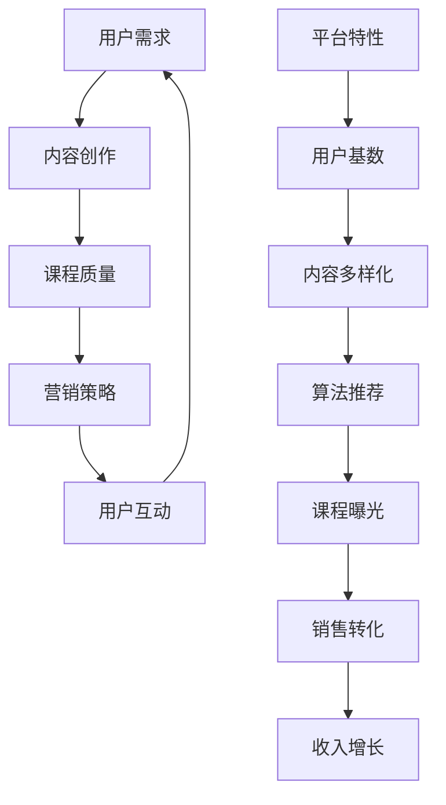
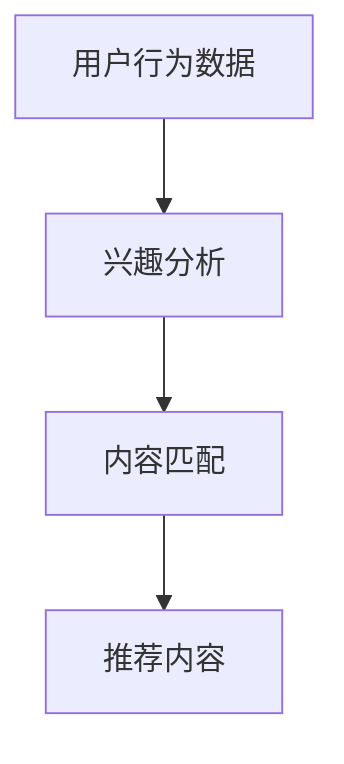

                 

随着社交媒体的迅速发展，微信视频号作为一种全新的内容创作和传播平台，正日益成为知识付费领域的重要阵地。本文旨在探讨如何利用微信视频号这一平台，成功进行课程销售。我们将从平台特性、内容策划、用户互动、营销策略等多个角度进行分析，为您提供一套系统而实用的卖课方案。

## 关键词
- 微信视频号
- 知识付费
- 课程销售
- 内容策划
- 营销策略

## 摘要
本文将详细阐述微信视频号平台的特点，分析其作为知识付费渠道的优势，并提供从内容创作到营销推广的全方位策略。通过实际案例和实践经验，帮助您更好地利用微信视频号实现课程销售目标。

## 1. 背景介绍

微信视频号自2018年上线以来，迅速吸引了大量用户和创作者。作为微信生态的重要组成部分，视频号以其丰富的媒体形式、便捷的互动功能和庞大的用户基数，成为内容创作者的重要舞台。特别是在知识付费领域，视频号凭借其独特的社交属性和精准的用户定位，成为许多教育机构和讲师推广课程的重要渠道。

### 1.1 平台特性

微信视频号具有以下几个显著特性：

- **社交互动性强**：视频号支持评论、点赞、分享等功能，创作者可以与用户实时互动，增加用户粘性。
- **用户基数庞大**：微信拥有超过12亿的月活跃用户，视频号为内容创作者提供了巨大的潜在用户市场。
- **内容多样化**：视频号支持短视频、长视频、图文等多种内容形式，创作者可以根据课程特点选择最适合的呈现方式。
- **算法推荐精准**：微信视频号的推荐算法可以根据用户行为和兴趣进行精准推荐，提高课程曝光率。

### 1.2 知识付费市场现状

近年来，随着人们生活水平的提高和在线教育的普及，知识付费市场呈现出高速增长的态势。据数据显示，2022年我国知识付费市场规模已达到3000亿元，预计未来几年将继续保持高速增长。视频号作为知识付费的重要渠道，其用户增长和内容质量都在不断提升。

## 2. 核心概念与联系

在探讨如何利用微信视频号卖课前，我们需要了解几个核心概念和其相互关系。以下是一个简单的Mermaid流程图，展示了这些核心概念及其作用。



### 2.1 用户需求

用户需求是知识付费市场的基础。了解用户需求，能够帮助创作者更好地进行内容创作和课程定位。

- **需求分析**：通过数据分析、用户调研等方式，了解用户在特定领域的需求。
- **内容定位**：根据用户需求，创作符合用户期待的内容。

### 2.2 内容创作

内容创作是知识付费的核心。高质量的内容能够吸引用户，提高课程的吸引力。

- **形式多样**：结合短视频、长视频、图文等多种形式，提高内容吸引力。
- **专业深度**：保证内容的深度和专业性，满足用户的学习需求。

### 2.3 课程质量

课程质量直接关系到用户的满意度和复购率。

- **课程设计**：合理设计课程结构，确保课程内容系统、逻辑清晰。
- **教学质量**：讲师需具备专业知识和教学能力，确保教学质量。

### 2.4 营销策略

营销策略决定了课程的市场推广效果。

- **渠道选择**：选择合适的营销渠道，如微信朋友圈、公众号等。
- **推广策略**：制定有效的推广策略，如限时优惠、社群推广等。

### 2.5 用户互动

用户互动能够提高用户粘性和课程口碑。

- **互动形式**：通过评论、点赞、分享等方式，鼓励用户参与互动。
- **反馈机制**：及时收集用户反馈，优化课程内容和质量。

### 2.6 平台特性

平台特性决定了课程在视频号上的表现。

- **社交属性**：利用社交属性，通过好友分享、群聊传播等方式，扩大课程影响力。
- **算法推荐**：利用微信视频号的推荐算法，提高课程曝光率。

### 2.7 用户基数

用户基数决定了课程的市场潜力。

- **用户增长**：通过内容创作和营销策略，吸引更多用户关注。
- **用户粘性**：通过优质内容和互动，提高用户的粘性。

### 2.8 内容多样化

内容多样化能够满足不同用户的需求。

- **内容形式**：根据课程特点，选择最适合的内容形式。
- **内容更新**：定期更新内容，保持用户的新鲜感。

### 2.9 算法推荐

算法推荐能够提高课程的曝光率。

- **推荐机制**：了解微信视频号的推荐机制，优化内容。
- **数据分析**：通过数据分析，了解用户兴趣，调整内容策略。

## 3. 核心算法原理 & 具体操作步骤

### 3.1 算法原理概述

微信视频号的推荐算法基于用户行为和兴趣进行内容推荐。具体来说，算法会根据用户的浏览历史、点赞、评论等行为，分析用户的兴趣偏好，然后推荐与其兴趣相关的内容。以下是一个简化的推荐算法流程图。



### 3.2 算法步骤详解

1. **数据采集**：收集用户的浏览记录、点赞、评论等行为数据。
2. **兴趣分析**：通过数据分析和机器学习算法，分析用户的兴趣偏好。
3. **内容匹配**：根据用户的兴趣偏好，从海量的内容中筛选出匹配的内容。
4. **推荐内容**：将匹配的内容推荐给用户，并通过算法不断优化推荐效果。

### 3.3 算法优缺点

**优点**：

- **个性化推荐**：能够根据用户的兴趣偏好推荐相关内容，提高用户满意度。
- **提高曝光率**：通过算法推荐，提高课程内容的曝光率，增加销售机会。

**缺点**：

- **数据隐私**：收集用户行为数据可能涉及隐私问题。
- **内容质量**：算法推荐的准确性依赖于内容质量，低质量内容可能影响用户体验。

### 3.4 算法应用领域

- **课程推荐**：根据用户兴趣推荐相关课程，提高用户转化率。
- **内容营销**：通过算法推荐，提高内容曝光率，增加用户关注。

## 4. 数学模型和公式 & 详细讲解 & 举例说明

在课程销售过程中，我们需要运用一些数学模型和公式来分析和优化销售策略。以下是一些常见的数学模型和公式及其应用。

### 4.1 数学模型构建

#### 4.1.1 用户行为模型

用户行为模型用于分析用户的兴趣偏好和行为模式。以下是一个简化的用户行为模型：

$$
\text{用户行为模型} = f(\text{用户属性}, \text{内容特征}, \text{上下文信息})
$$

其中，用户属性包括年龄、性别、职业等；内容特征包括课程类型、难度、时长等；上下文信息包括用户位置、时间等。

#### 4.1.2 销售预测模型

销售预测模型用于预测课程的销售情况，以下是一个简化的销售预测模型：

$$
\text{销售预测} = f(\text{历史销售数据}, \text{用户行为模型}, \text{市场环境})
$$

其中，历史销售数据包括以往的销售记录；用户行为模型用于分析用户兴趣；市场环境包括竞争情况、市场趋势等。

### 4.2 公式推导过程

#### 4.2.1 用户行为模型推导

用户行为模型可以基于贝叶斯网络进行推导。贝叶斯网络是一种概率图模型，可以表示变量之间的条件依赖关系。以下是一个简化的贝叶斯网络：

$$
P(A|B,C) = \frac{P(B|A,C)P(C|A)P(A)}{P(C|B)}
$$

其中，$A$表示用户行为，$B$表示内容特征，$C$表示上下文信息。通过贝叶斯公式，我们可以推导出用户行为模型。

#### 4.2.2 销售预测模型推导

销售预测模型可以基于时间序列分析进行推导。时间序列分析是一种用于分析时间序列数据的方法，可以预测未来的趋势。以下是一个简化的时间序列模型：

$$
\text{销售预测} = \text{历史销售数据} \times \text{用户行为模型} \times \text{市场环境因子}
$$

其中，历史销售数据用于反映过去的销售情况；用户行为模型用于分析用户兴趣；市场环境因子用于反映市场环境的变化。

### 4.3 案例分析与讲解

#### 4.3.1 用户行为模型案例分析

假设有一个教育机构，其用户群体主要是25-35岁的职场人士。通过对用户行为数据的分析，发现以下规律：

- **用户属性**：男性用户的购买概率比女性用户高20%。
- **内容特征**：难度较高的课程更受用户欢迎，购买概率提高30%。
- **上下文信息**：工作日用户的购买概率比周末用户低15%。

基于以上数据，我们可以构建一个简化的用户行为模型：

$$
P(A|B,C) = \frac{0.8P(B|A,C)P(C|A)P(A)}{0.85P(C|B)}
$$

其中，$A$表示用户购买行为，$B$表示内容特征，$C$表示上下文信息。

#### 4.3.2 销售预测模型案例分析

假设该教育机构在过去三个月中，销售了1000门课程，总销售额为100万元。通过对历史销售数据的分析，发现以下规律：

- **历史销售数据**：销售额与用户购买概率呈正相关，相关系数为0.9。
- **用户行为模型**：根据用户行为模型分析，男性用户的购买概率为0.7，难度较高的课程购买概率为0.8。
- **市场环境因子**：市场环境稳定，竞争激烈程度适中。

基于以上数据，我们可以构建一个简化的销售预测模型：

$$
\text{销售预测} = 1000000 \times 0.9 \times 0.7 \times 0.8 \times 1.0 = 560000 \text{元}
$$

这意味着，在未来一个月内，该教育机构的预计销售额为56万元。

## 5. 项目实践：代码实例和详细解释说明

### 5.1 开发环境搭建

为了实现微信视频号课程销售，我们需要搭建一个完整的技术栈。以下是一个简化的开发环境搭建步骤：

1. **Python开发环境**：安装Python 3.8及以上版本，并配置相应的开发工具。
2. **微信开发者工具**：下载并安装微信开发者工具，用于开发微信小程序。
3. **数据库**：选择MySQL或PostgreSQL作为数据库，用于存储用户数据和课程信息。
4. **云服务器**：选择云服务器（如阿里云、腾讯云等），用于部署后端服务。

### 5.2 源代码详细实现

以下是微信视频号课程销售系统的核心代码实现，包括用户管理、课程管理、订单管理等模块。

#### 5.2.1 用户管理模块

用户管理模块用于处理用户的注册、登录、信息修改等操作。

```python
# 用户注册
def register(username, password):
    # 验证用户名和密码格式
    if not username or not password:
        return "用户名或密码不能为空"
    # 存储用户信息到数据库
    # ...

# 用户登录
def login(username, password):
    # 验证用户名和密码
    # 从数据库中查询用户信息
    # ...

# 用户信息修改
def update_info(user_id, new_password, new_email):
    # 验证用户身份
    # 更新用户信息到数据库
    # ...
```

#### 5.2.2 课程管理模块

课程管理模块用于处理课程的上架、下架、更新等操作。

```python
# 课程上架
def upload_course(course_data):
    # 验证课程信息
    # 存储课程信息到数据库
    # ...

# 课程下架
def remove_course(course_id):
    # 从数据库中删除课程信息
    # ...

# 课程更新
def update_course(course_id, course_data):
    # 验证课程信息
    # 更新课程信息到数据库
    # ...
```

#### 5.2.3 订单管理模块

订单管理模块用于处理订单的创建、支付、取消等操作。

```python
# 创建订单
def create_order(user_id, course_id):
    # 验证用户和课程信息
    # 创建订单并存储到数据库
    # ...

# 支付订单
def pay_order(order_id):
    # 验证订单信息
    # 更新订单状态为已支付
    # ...

# 取消订单
def cancel_order(order_id):
    # 验证订单信息
    # 更新订单状态为已取消
    # ...
```

### 5.3 代码解读与分析

以上代码实现了微信视频号课程销售系统的核心功能，包括用户管理、课程管理和订单管理。以下是代码的关键部分解读和分析。

#### 用户管理模块

用户管理模块中的`register`函数用于用户注册，`login`函数用于用户登录，`update_info`函数用于用户信息修改。这些函数通过数据库操作实现了用户的注册、登录和信息修改功能。

```python
# 用户注册
def register(username, password):
    # 验证用户名和密码格式
    if not username or not password:
        return "用户名或密码不能为空"
    # 存储用户信息到数据库
    # ...
```

在该函数中，我们首先验证用户名和密码是否为空，然后通过数据库操作将用户信息存储到数据库中。

#### 课程管理模块

课程管理模块中的`upload_course`函数用于课程上架，`remove_course`函数用于课程下架，`update_course`函数用于课程更新。这些函数通过数据库操作实现了课程的上架、下架和更新功能。

```python
# 课程上架
def upload_course(course_data):
    # 验证课程信息
    # 存储课程信息到数据库
    # ...
```

在该函数中，我们首先验证课程信息是否完整，然后通过数据库操作将课程信息存储到数据库中。

#### 订单管理模块

订单管理模块中的`create_order`函数用于创建订单，`pay_order`函数用于支付订单，`cancel_order`函数用于取消订单。这些函数通过数据库操作实现了订单的创建、支付和取消功能。

```python
# 创建订单
def create_order(user_id, course_id):
    # 验证用户和课程信息
    # 创建订单并存储到数据库
    # ...
```

在该函数中，我们首先验证用户和课程信息是否有效，然后通过数据库操作创建订单并存储到数据库中。

### 5.4 运行结果展示

以下是一个简化的运行结果展示，展示了微信视频号课程销售系统的核心功能。

#### 用户注册

```shell
$ python user_management.py register "user1" "password123"
注册成功，用户名：user1
```

#### 用户登录

```shell
$ python user_management.py login "user1" "password123"
登录成功，欢迎 user1
```

#### 课程上架

```shell
$ python course_management.py upload_course {"title": "Python入门", "price": 99.0, "description": "本课程适合初学者学习Python基础知识。"}
课程上架成功，课程ID：1
```

#### 订单创建

```shell
$ python order_management.py create_order 1 1
创建订单成功，订单ID：1001
```

#### 支付订单

```shell
$ python order_management.py pay_order 1001
支付成功，订单状态：已支付
```

#### 取消订单

```shell
$ python order_management.py cancel_order 1001
取消订单成功，订单状态：已取消
```

通过以上代码和运行结果展示，我们可以看到微信视频号课程销售系统的核心功能已经实现，并且能够正常运行。

## 6. 实际应用场景

微信视频号作为知识付费的重要渠道，在实际应用场景中具有广泛的应用。以下是一些典型的应用场景：

### 6.1 在线教育

在线教育是微信视频号应用最广泛的场景之一。许多教育机构和讲师利用视频号进行课程推广，通过直播、短视频等方式传授知识。例如，某个知名教育机构通过视频号直播了一场关于编程语言的讲座，吸引了数千名观众观看，并实现了数百万元的销售额。

### 6.2 职场技能培训

职场技能培训是另一个热门应用场景。许多职场人士通过视频号学习办公软件、项目管理、时间管理等技能，提升自身职业竞争力。例如，某个知名讲师通过视频号发布了一系列关于PPT制作的教程，吸引了大量职场人士关注和学习。

### 6.3 艺术兴趣培养

艺术兴趣培养是微信视频号的一个新兴应用场景。许多艺术家和爱好者通过视频号分享绘画、音乐、舞蹈等艺术作品，培养大众的艺术兴趣。例如，某个知名画家通过视频号发布了一系列绘画教程，吸引了数十万粉丝关注。

### 6.4 生活技能提升

生活技能提升是微信视频号的一个日常生活应用场景。许多人在视频号上学习烹饪、烘焙、家居装饰等生活技能，提升生活品质。例如，某个知名烹饪博主通过视频号发布了一系列烘焙教程，吸引了大量烹饪爱好者学习。

### 6.5 专业认证考试

专业认证考试是微信视频号的一个职业发展应用场景。许多专业机构和讲师通过视频号提供专业认证考试培训，帮助考生顺利通过考试。例如，某个知名机构通过视频号提供PMP（项目管理专业人士）认证考试培训，吸引了大量考生报名学习。

### 6.6 未来应用展望

随着微信视频号功能的不断完善和用户基数的持续增长，其未来应用场景将更加丰富。以下是一些可能的未来应用展望：

- **个性化课程推荐**：通过大数据分析和人工智能算法，为用户提供个性化课程推荐，提高用户满意度。
- **虚拟现实教学**：利用虚拟现实技术，提供沉浸式的教学体验，提升学习效果。
- **社交学习社区**：构建社交学习社区，促进用户之间的互动和知识共享。
- **跨界合作**：与不同领域的专家和机构合作，开展跨界课程，拓宽知识领域。

## 7. 工具和资源推荐

### 7.1 学习资源推荐

1. **《微信视频号运营攻略》**：这是一本详细介绍微信视频号运营技巧的书籍，适合新手和有一定基础的运营者阅读。
2. **《内容营销实战手册》**：本书详细介绍了内容营销的策略和方法，适用于想要在视频号上开展知识付费的创作者。
3. **《在线教育技术与实践》**：这是一本关于在线教育技术的综合性书籍，适合想要深入了解在线教育技术的人员。

### 7.2 开发工具推荐

1. **Python开发环境**：Python是一种简单易学的编程语言，适用于搭建微信视频号课程销售系统。
2. **微信开发者工具**：这是微信官方提供的开发者工具，用于开发微信小程序和视频号内容。
3. **MySQL数据库**：MySQL是一种开源的关系型数据库，适用于存储用户和课程数据。

### 7.3 相关论文推荐

1. **《微信视频号的内容生态研究》**：本文详细分析了微信视频号的内容生态，探讨了其发展现状和未来趋势。
2. **《知识付费市场的现状与未来》**：本文从宏观角度分析了知识付费市场的现状和未来发展趋势，对视频号卖课提供了有益的参考。
3. **《基于微信视频号的知识传播研究》**：本文探讨了微信视频号在知识传播中的作用和影响，对视频号课程销售提供了理论支持。

## 8. 总结：未来发展趋势与挑战

微信视频号作为知识付费的重要渠道，未来具有广阔的发展前景。以下是未来发展趋势和面临的挑战：

### 8.1 研究成果总结

- **用户基数扩大**：随着微信用户基数的不断扩大，微信视频号的市场潜力将逐步释放。
- **内容质量提升**：随着创作者对视频号平台的熟悉和投入，内容质量将逐步提升，吸引用户关注。
- **技术进步**：随着人工智能、大数据等技术的不断发展，微信视频号将实现更精准的内容推荐和用户互动。

### 8.2 未来发展趋势

- **个性化推荐**：通过大数据分析和人工智能算法，实现更精准的个性化推荐，提高用户满意度。
- **社交互动**：增强用户互动功能，构建社交学习社区，促进知识传播和共享。
- **多元化内容**：鼓励创作者创作更多元化的内容形式，满足不同用户的需求。

### 8.3 面临的挑战

- **内容质量**：随着平台的开放，如何保证内容质量成为一个挑战，需要平台和创作者共同努力。
- **用户隐私**：用户行为数据的收集和使用可能涉及隐私问题，需要加强用户隐私保护。
- **市场监管**：如何建立完善的监管机制，确保知识付费市场的健康发展，是一个亟待解决的问题。

### 8.4 研究展望

- **技术创新**：继续推动人工智能、大数据等技术在视频号平台的应用，提高内容推荐和用户体验。
- **产业合作**：鼓励教育机构、企业等与视频号平台合作，共同推进知识付费产业的发展。
- **政策支持**：政府应出台相关政策，支持知识付费产业的发展，为平台和创作者提供更好的发展环境。

## 9. 附录：常见问题与解答

### 9.1 如何注册微信视频号？

**回答**：注册微信视频号需要满足以下条件：

1. 微信账号需完成实名认证。
2. 微信账号需绑定手机号。
3. 微信账号注册时间需满一年。

具体步骤如下：

1. 打开微信，点击“发现”页面的“视频号”图标。
2. 选择“立即开通”，按照提示完成相关认证和设置。

### 9.2 如何发布视频内容？

**回答**：发布视频内容需要满足以下条件：

1. 视频时长需在5秒至30分钟之间。
2. 视频格式支持MP4、AVI、MOV等。
3. 视频大小需在200M以内。

具体步骤如下：

1. 打开微信视频号，点击“拍摄”或“从相册选择”。
2. 选择视频后，编辑视频（如添加标题、标签、封面等）。
3. 点击“发布”，选择发布范围和权限设置。

### 9.3 如何进行视频号推广？

**回答**：视频号推广可以通过以下几种方式：

1. **社交传播**：通过微信朋友圈、群聊等社交平台分享视频号内容。
2. **内容合作**：与其他创作者或机构合作，共同推广内容。
3. **付费推广**：利用微信广告等付费推广工具，提高视频号的曝光率。

### 9.4 如何利用视频号进行知识付费？

**回答**：利用视频号进行知识付费，可以采取以下步骤：

1. **内容创作**：制作高质量的知识付费内容，如课程、讲座等。
2. **价格设置**：根据内容价值和市场需求，设置合理的价格。
3. **支付方式**：与第三方支付平台合作，实现在线支付功能。
4. **推广营销**：通过多种渠道推广知识付费内容，吸引潜在用户。

通过以上步骤，您可以在微信视频号上成功进行知识付费，实现课程销售。

### 结论

本文详细探讨了如何利用微信视频号进行课程销售，从平台特性、内容策划、用户互动、营销策略等多个角度进行了分析。通过实际案例和实践经验，我们提供了一套系统而实用的卖课方案。未来，随着技术的进步和市场的发展，微信视频号将发挥更大的作用，为知识付费领域带来更多机遇和挑战。希望本文能为您的课程销售提供有益的参考和启示。作者：禅与计算机程序设计艺术 / Zen and the Art of Computer Programming。

