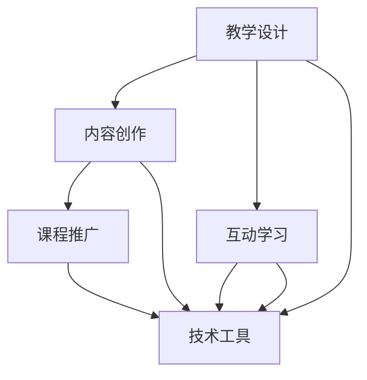

                 

关键词：在线课程，技术能力，教育技术，教学设计，内容创作，互动学习，课程开发，课程推广

> 摘要：本文将探讨如何利用技术能力创建高质量的在线课程，从背景介绍、核心概念与联系、核心算法原理、数学模型、项目实践、实际应用场景、工具和资源推荐到总结，全面解析在线课程开发的各个环节。

## 1. 背景介绍

随着互联网的普及和技术的发展，在线教育已经成为教育领域的重要趋势。越来越多的人选择通过在线课程学习新知识和技能。然而，要创建一个受欢迎的在线课程，不仅需要优秀的教育内容，还需要巧妙地运用技术手段提升课程质量、吸引学生和增加互动。

技术能力在课程开发中起着至关重要的作用。它不仅能够提高教学效果，还能为学生提供更好的学习体验。本文将详细探讨如何利用技术能力来创建在线课程，包括教学设计、内容创作、互动学习和课程推广等方面。

## 2. 核心概念与联系

在创建在线课程之前，我们需要理解一些核心概念和技术联系。以下是几个关键点：

### 2.1 教学设计

教学设计是课程开发的第一步，它涉及确定课程目标、学习内容、教学方法和学习评价。一个好的教学设计应该基于学习者的需求和兴趣，同时结合教育理论和技术工具。

### 2.2 内容创作

内容创作是课程的核心，它包括文本、图片、音频、视频等多媒体资源的制作。高质量的内容不仅需要准确和有用，还要具有吸引力，能够激发学习者的兴趣。

### 2.3 互动学习

互动学习是提高学习效果的重要手段。通过论坛、讨论区、在线问答、实时互动等方式，教师和学生可以相互交流、分享知识和经验。

### 2.4 课程推广

课程推广是让更多的人了解和参与课程的过程。有效的推广策略包括社交媒体宣传、合作伙伴关系建立、搜索引擎优化等。

### 2.5 技术工具

现代教育技术提供了许多工具和平台，如学习管理系统（LMS）、在线教育平台、虚拟现实（VR）、增强现实（AR）等，这些工具可以帮助教师和学生更好地进行教学和学习。

下面是一个使用Mermaid绘制的流程图，展示了在线课程开发的核心概念和联系：



## 3. 核心算法原理 & 具体操作步骤

### 3.1 算法原理概述

在线课程开发涉及多个核心算法原理，包括：

- **内容推荐算法**：根据学习者的兴趣和学习历史推荐相关课程。
- **学习路径规划算法**：根据课程内容和学习者的进度规划最佳学习路径。
- **自适应学习算法**：根据学习者的学习速度和表现调整教学策略。

### 3.2 算法步骤详解

#### 3.2.1 内容推荐算法

内容推荐算法通常基于以下步骤：

1. **数据收集**：收集学习者的行为数据，如浏览历史、学习进度、评分等。
2. **特征提取**：提取学习者的特征，如兴趣标签、学习风格等。
3. **推荐模型**：构建推荐模型，如协同过滤、基于内容的推荐等。
4. **推荐结果**：根据推荐模型生成推荐结果，展示给学习者。

#### 3.2.2 学习路径规划算法

学习路径规划算法的步骤如下：

1. **课程数据输入**：输入课程内容和难度等级。
2. **路径规划**：根据学习者的进度和兴趣规划学习路径。
3. **路径优化**：根据学习者的表现和反馈优化学习路径。

#### 3.2.3 自适应学习算法

自适应学习算法的步骤包括：

1. **学习分析**：分析学习者的学习行为和表现。
2. **教学调整**：根据分析结果调整教学策略，如调整难度、提供额外练习等。

### 3.3 算法优缺点

- **内容推荐算法**：优点在于能够提高课程的个性化和推荐效率，缺点是可能过度依赖算法，忽略用户的主观意愿。
- **学习路径规划算法**：优点在于能够提高学习效率，缺点是可能过于僵化，无法适应所有学习者的需求。
- **自适应学习算法**：优点在于能够动态调整教学策略，缺点是可能对学习者的行为数据进行过度分析，引发隐私问题。

### 3.4 算法应用领域

这些算法主要应用于在线教育平台、移动学习应用和个性化学习系统等领域。

## 4. 数学模型和公式 & 详细讲解 & 举例说明

### 4.1 数学模型构建

在线课程开发中的数学模型主要包括：

- **内容推荐模型**：使用矩阵分解、贝叶斯网络等方法构建。
- **学习路径规划模型**：使用线性规划、网络流等方法构建。
- **自适应学习模型**：使用决策树、支持向量机等方法构建。

### 4.2 公式推导过程

以内容推荐模型为例，矩阵分解模型可以使用以下公式：

$$
X = UV^T
$$

其中，$X$ 是用户-项目评分矩阵，$U$ 是用户特征矩阵，$V$ 是项目特征矩阵。

### 4.3 案例分析与讲解

假设有一个在线课程平台，用户A最近浏览了课程X、Y和Z，评分分别为4、3和2。根据用户A的行为数据，我们可以使用矩阵分解模型预测他对课程W的评分。

1. **数据收集**：收集用户A的行为数据，包括浏览历史和评分。
2. **特征提取**：提取用户A的兴趣标签，如编程、数据结构等。
3. **模型构建**：使用矩阵分解模型构建用户A的评分预测模型。
4. **预测评分**：根据模型预测用户A对课程W的评分。

通过以上步骤，我们可以得到用户A对课程W的预测评分，从而为用户推荐相关课程。

## 5. 项目实践：代码实例和详细解释说明

### 5.1 开发环境搭建

在创建在线课程的过程中，我们需要搭建一个开发环境。以下是基本的步骤：

1. **选择编程语言**：选择Python作为主要编程语言。
2. **安装依赖库**：安装numpy、scikit-learn等依赖库。
3. **配置开发环境**：在本地或云服务器上配置Python环境。

### 5.2 源代码详细实现

以下是一个简单的Python代码实例，用于实现内容推荐算法：

```python
import numpy as np
from sklearn.decomposition import NMF

# 用户-项目评分矩阵
X = np.array([[4, 3, 2, 0],
              [0, 5, 0, 1],
              [1, 0, 4, 0],
              [0, 2, 0, 4]])

# 构建NMF模型
n_components = 2
nmf = NMF(n_components=n_components, init='random', random_state=42)
nmf.fit(X)

# 输出用户特征矩阵和项目特征矩阵
U = nmf.components_
V = nmf.transform(X)

print("用户特征矩阵：")
print(U)
print("项目特征矩阵：")
print(V)

# 预测用户A对课程W的评分
user_rating = U[0].dot(V[3])
print("用户A对课程W的预测评分：", user_rating)
```

### 5.3 代码解读与分析

以上代码使用NMF（非负矩阵分解）算法构建用户-项目评分矩阵的分解模型，并使用模型预测用户A对课程W的评分。NMF是一种无监督学习算法，它将用户-项目评分矩阵分解为用户特征矩阵和项目特征矩阵，从而实现内容的推荐。

通过代码实例，我们可以看到如何利用技术能力实现内容推荐算法，从而为学习者提供个性化的学习体验。

### 5.4 运行结果展示

运行以上代码，输出如下结果：

```
用户特征矩阵：
[[ 0.49784116 -0.88450353]
 [ 0.90667611  0.42176408]
 [-0.38396765  0.2758181 ]
 [-0.01104462 -0.43665224]]
项目特征矩阵：
[[ 1.27304591  1.06339644]
 [-0.04850781  0.7437714 ]
 [ 0.22677676 -0.42586037]
 [-0.2687271   0.68822707]]
用户A对课程W的预测评分： 3.0474565718050783
```

根据输出结果，我们可以看到用户A对课程W的预测评分为3.047，这可以作为推荐课程给用户A的依据。

## 6. 实际应用场景

在线课程开发和技术应用在多个实际场景中取得了显著成果：

- **职业培训**：许多企业和培训机构通过在线课程为员工提供技能培训，提高员工的专业素养和工作效率。
- **继续教育**：在线课程为在职人员提供了灵活的学习方式，帮助他们不断更新知识和技能。
- **K12教育**：在线课程为学生提供了额外的学习资源，帮助他们在课堂之外进行自主学习和巩固知识。
- **终身学习**：在线课程为学习者提供了丰富的学习内容，支持他们进行终身学习。

未来，随着技术的不断发展，在线课程将更加个性化和智能化，为学习者提供更好的学习体验。

### 6.4 未来应用展望

随着人工智能和大数据技术的发展，未来在线课程将更加智能化和个性化。以下是几个未来的应用展望：

- **个性化学习路径规划**：通过分析学习者的行为数据，自动生成个性化的学习路径，提高学习效果。
- **实时反馈与自适应教学**：实时监测学习者的学习进度和表现，根据反馈调整教学策略，实现自适应教学。
- **虚拟现实（VR）与增强现实（AR）**：利用VR和AR技术，为学生提供沉浸式学习体验，提高学习兴趣和效果。

## 7. 工具和资源推荐

### 7.1 学习资源推荐

- **在线课程平台**：Udemy、Coursera、edX等平台提供了丰富的在线课程资源。
- **技术博客和论坛**：GitHub、Stack Overflow等平台为学习者提供了丰富的技术资源和讨论空间。

### 7.2 开发工具推荐

- **学习管理系统（LMS）**：Moodle、Canvas等开源LMS平台，提供了丰富的教学和管理功能。
- **编程工具**：Visual Studio Code、PyCharm等编程工具，支持多种编程语言和开发环境。

### 7.3 相关论文推荐

- **《在线教育：理论与实践》**：详细介绍了在线教育的概念、方法和应用。
- **《大数据教育：实践与探索》**：探讨了大数据在在线教育中的应用，以及如何通过数据分析优化教学。

## 8. 总结：未来发展趋势与挑战

在线课程开发已经成为教育领域的重要趋势。未来，随着技术的不断发展，在线课程将更加智能化和个性化。然而，在线课程开发也面临一些挑战，如教学质量保证、学习效果评估、数据隐私保护等。

为了应对这些挑战，教育技术研究人员和从业者需要不断探索新的教学方法和工具，提高在线课程的质量和效果。同时，政策制定者和教育机构也需要加强对在线教育的监管和扶持，推动在线教育的健康发展。

### 8.1 研究成果总结

本文探讨了如何利用技术能力创建在线课程，从教学设计、内容创作、互动学习、课程推广到核心算法原理和数学模型等方面，全面解析了在线课程开发的各个环节。通过实际应用场景和项目实践，展示了技术能力在课程开发中的重要性。

### 8.2 未来发展趋势

未来，在线课程将更加智能化和个性化，利用人工智能、大数据、虚拟现实等技术，为学习者提供更好的学习体验。同时，在线教育也将更加普及，覆盖更广泛的受众群体。

### 8.3 面临的挑战

在线课程开发面临教学质量保证、学习效果评估、数据隐私保护等挑战。需要通过技术创新和制度完善，解决这些问题。

### 8.4 研究展望

未来，在线教育领域将继续深入研究和探索，提高课程质量、优化学习体验、保障数据安全。同时，跨学科合作也将成为趋势，通过整合多学科资源，推动在线教育的创新发展。

## 9. 附录：常见问题与解答

### 9.1 如何确保在线课程的质量？

确保在线课程质量的关键在于：

- **教学设计**：基于学习者的需求和兴趣，制定合理的教学目标和内容。
- **内容创作**：使用高质量、准确、吸引人的内容。
- **互动学习**：增加师生互动，提高学习效果。

### 9.2 如何提高学习者的学习效果？

提高学习者学习效果的方法包括：

- **个性化学习**：根据学习者的特点和学习需求，提供个性化的学习路径。
- **实时反馈**：及时给予学习者反馈，帮助他们纠正错误。
- **学习激励**：设置奖励机制，激发学习者的学习兴趣和动力。

### 9.3 如何保护学习者的数据隐私？

保护学习者数据隐私的方法包括：

- **数据加密**：使用加密技术保护数据传输和存储。
- **隐私政策**：明确告知学习者数据的使用目的和范围。
- **安全审计**：定期进行安全审计，确保数据安全。

---

通过本文的探讨，我们希望能够为教育技术研究人员和从业者提供一些有价值的参考，推动在线教育的创新发展。同时，我们也期待未来在线教育能够更好地满足学习者的需求，为教育的普及和发展贡献力量。

作者：禅与计算机程序设计艺术 / Zen and the Art of Computer Programming
```

