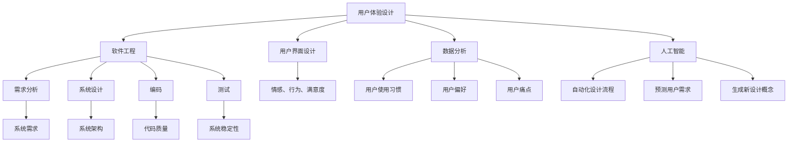

                 

### 背景介绍

在当今快速发展的科技时代，技术的进步已经成为推动社会发展的关键因素。随着人工智能、大数据、云计算等前沿技术的不断涌现，技术能力在各个领域中的作用愈发显著。尤其是在产品设计中，技术能力的有效利用不仅能够提升产品的竞争力，还能够满足用户不断变化的需求。

产品设计是一个涉及多学科、多层次的复杂过程，不仅需要创新思维和用户视角，还需要强大的技术支撑。例如，在互联网产品中，用户体验（UX）和用户界面（UI）设计已经成为至关重要的环节。而要实现出色的用户体验，技术能力的应用是不可或缺的。通过数据分析、机器学习等技术，设计师能够深入了解用户行为，从而设计出更符合用户需求的产品。

此外，随着物联网（IoT）和可穿戴设备的发展，产品设计逐渐向智能硬件领域扩展。这些设备要求高度集成的软件和硬件技术，而技术能力的充分利用能够确保产品的可靠性和用户体验。

总之，在产品设计的各个环节中，技术能力正发挥着越来越重要的作用。本文将探讨如何有效地利用技术能力进行产品设计，以实现产品的高质量和高竞争力。

### 核心概念与联系

要深入探讨如何利用技术能力进行产品设计，我们首先需要明确几个核心概念，并展示它们之间的联系。

#### 用户体验（UX）设计

用户体验设计是产品设计的核心，它关注的是用户在使用产品过程中的情感、行为和满意度。UX设计包括用户研究、用户故事编写、原型设计、用户测试等多个环节。通过UX设计，设计师能够创建出用户喜爱的产品。

#### 用户界面（UI）设计

用户界面设计则更侧重于产品的视觉呈现，包括色彩、排版、图标、按钮等元素。UI设计的目标是使产品界面直观、易用、美观，从而提升用户体验。

#### 数据分析

数据分析在产品设计中的应用越来越广泛。通过收集和分析用户行为数据，设计师可以了解用户的使用习惯、偏好和痛点，从而指导设计决策。数据分析技术包括数据挖掘、机器学习、统计分析等。

#### 人工智能（AI）

人工智能技术，尤其是机器学习，正在深刻改变产品设计的方法。通过AI，设计师能够自动化设计流程、预测用户需求，甚至能够生成新的设计概念。

#### 软件工程

软件工程是技术能力的基础，它提供了产品设计所需的各种工具和方法。软件工程涵盖了需求分析、系统设计、编码、测试等环节，确保产品能够高效、稳定地运行。

#### 架构设计

架构设计是产品设计的重要环节，它决定了产品的可扩展性、可靠性和性能。良好的架构设计能够支持产品的长期发展。

#### 联系图

下面是一个Mermaid流程图，展示了这些核心概念之间的联系：



通过这个流程图，我们可以看到，用户体验设计、用户界面设计、数据分析、人工智能和软件工程等核心概念是如何相互作用，共同推动产品设计的发展。这些技术的融合和应用，使得现代产品设计更加高效、精准和人性化。

#### 核心概念与联系总结

用户体验（UX）设计和用户界面（UI）设计是产品设计的基础，它们关注用户的情感和视觉体验。数据分析提供了用户行为的洞察，而人工智能（AI）则为设计提供了智能化的工具和预测能力。软件工程和架构设计则为产品提供了坚实的实施基础。这些核心概念相互关联，共同构成了现代产品设计的框架。理解这些概念及其联系，是有效利用技术能力进行产品设计的关键。

### 核心算法原理 & 具体操作步骤

在了解核心概念后，接下来我们将深入探讨产品设计中的核心算法原理，并详细解释其操作步骤。以下是几个关键算法的概述：

#### 1. 用户体验优化算法

**算法原理概述：**
用户体验优化算法（UX Optimization Algorithm）是一种基于用户行为数据分析和机器学习的算法，旨在通过分析用户的使用习惯和偏好，自动调整和优化产品界面和功能，以提升用户体验。

**具体操作步骤：**
1. **数据收集：** 通过日志文件、用户反馈等途径收集用户行为数据。
2. **特征提取：** 使用统计分析方法提取用户行为的特征，如使用频率、使用时长、错误率等。
3. **模型训练：** 利用机器学习算法（如决策树、随机森林、神经网络等）训练用户行为模型。
4. **预测与优化：** 根据训练得到的模型预测用户未来的行为，并自动调整界面布局、功能优先级等，以优化用户体验。

#### 2. 用户界面自适应算法

**算法原理概述：**
用户界面自适应算法（UI Adaptation Algorithm）能够根据不同用户设备和屏幕尺寸自动调整界面布局和样式，确保用户在不同设备上获得一致的使用体验。

**具体操作步骤：**
1. **设备检测：** 识别用户设备的类型、分辨率、操作系统等信息。
2. **界面调整：** 根据设备信息调整界面布局、字体大小、颜色等。
3. **动态响应：** 实现对用户操作（如滚动、点击等）的动态响应，提供流畅的用户交互体验。

#### 3. 个性化推荐算法

**算法原理概述：**
个性化推荐算法（Personalized Recommendation Algorithm）基于用户的历史行为和偏好，为用户推荐可能感兴趣的产品、内容或功能，以提升用户满意度和活跃度。

**具体操作步骤：**
1. **行为数据收集：** 收集用户的浏览、购买、评论等行为数据。
2. **偏好建模：** 使用协同过滤、基于内容的推荐等技术建立用户偏好模型。
3. **推荐生成：** 根据用户偏好模型生成个性化的推荐列表。
4. **推荐呈现：** 在用户界面上动态呈现推荐结果，并允许用户反馈推荐质量。

#### 4. 智能反馈系统

**算法原理概述：**
智能反馈系统（Smart Feedback System）通过自然语言处理（NLP）和机器学习技术，自动分析和处理用户的反馈，为产品设计提供改进建议。

**具体操作步骤：**
1. **反馈收集：** 收集用户通过聊天、邮件、调查问卷等渠道的反馈。
2. **文本分析：** 使用NLP技术分析反馈内容，提取关键信息和情感倾向。
3. **智能分类：** 将反馈分类为功能性问题、用户体验问题、意见建议等。
4. **改进建议：** 基于反馈结果生成改进建议，并反馈给设计团队。

#### 算法优缺点

**用户体验优化算法：**
- **优点：** 能够动态调整产品界面和功能，提高用户满意度。
- **缺点：** 需要大量的用户行为数据支持，且可能存在过度优化的问题。

**用户界面自适应算法：**
- **优点：** 提升不同设备上的用户体验，增强用户粘性。
- **缺点：** 在设备多样性增加的情况下，实现复杂度提高。

**个性化推荐算法：**
- **优点：** 增强用户参与度和活跃度，提高产品销售和用户满意度。
- **缺点：** 需要大量的计算资源和精确的偏好建模。

**智能反馈系统：**
- **优点：** 自动化处理用户反馈，提高反馈处理效率。
- **缺点：** 可能会忽略一些用户反馈中的细微信息。

#### 算法应用领域

这些算法在产品设计中的广泛应用领域包括：

- **互联网产品：** 如电子商务平台、社交媒体、在线教育等，通过优化用户体验、自适应界面和个性化推荐提高用户满意度。
- **移动应用：** 如游戏、导航、金融应用等，通过智能反馈系统快速响应用户需求。
- **硬件设备：** 如智能手表、智能家居设备等，通过用户界面自适应算法确保在各种设备上的良好体验。

### 核心算法原理 & 具体操作步骤总结

通过深入理解核心算法原理和具体操作步骤，我们能够更好地利用技术能力进行产品设计。用户体验优化算法、用户界面自适应算法、个性化推荐算法和智能反馈系统等算法不仅提升了产品的竞争力，还满足了用户个性化需求。了解这些算法的优缺点及其应用领域，能够帮助我们更有效地将技术能力应用于产品设计过程中。

### 数学模型和公式 & 详细讲解 & 举例说明

在产品设计过程中，数学模型和公式是不可或缺的工具，它们帮助我们量化设计目标，优化产品设计方案。以下将详细介绍几个常用的数学模型和公式，并对其进行详细讲解和举例说明。

#### 1. 用户满意度模型

**数学模型构建：**
用户满意度（User Satisfaction）是衡量产品设计成功与否的重要指标。一个简单的用户满意度模型可以表示为：
\[ S = \frac{\sum_{i=1}^{n} w_i \cdot X_i}{n} \]
其中，\( S \) 表示用户满意度，\( w_i \) 表示第 \( i \) 个指标的重要程度权重，\( X_i \) 表示第 \( i \) 个指标的得分。

**公式推导过程：**
用户满意度模型考虑了多个指标对总体满意度的贡献。权重 \( w_i \) 反映了各个指标在满意度评价中的相对重要性，而得分 \( X_i \) 则是基于用户反馈或数据分析得到的定量值。

**举例说明：**
假设我们设计一款社交应用，需要评估用户的满意度。根据用户反馈和数据分析，我们确定了三个主要指标：界面美观度（\( X_1 \)）、功能易用性（\( X_2 \)）和信息丰富度（\( X_3 \)）。我们给定了如下权重：
\[ w_1 = 0.3, \quad w_2 = 0.5, \quad w_3 = 0.2 \]
用户对这三个指标的得分分别为：
\[ X_1 = 8, \quad X_2 = 9, \quad X_3 = 7 \]
则用户满意度 \( S \) 计算如下：
\[ S = \frac{0.3 \cdot 8 + 0.5 \cdot 9 + 0.2 \cdot 7}{1} = 8.1 \]

#### 2. 用户体验指数（UEI）

**数学模型构建：**
用户体验指数（User Experience Index, UEI）是一个综合评估用户对产品体验满意度的指标，可以表示为：
\[ UEI = \frac{\sum_{i=1}^{m} P_i \cdot S_i}{m} \]
其中，\( P_i \) 表示第 \( i \) 个用户体验要素的得分，\( S_i \) 表示第 \( i \) 个要素的重要程度权重，\( m \) 表示总的要素数量。

**公式推导过程：**
UEI模型通过综合考虑多个用户体验要素及其权重，提供了一个整体的用户体验评分。每个要素的得分 \( P_i \) 通常是基于用户调查或行为分析得出的，而权重 \( S_i \) 则反映了该要素在用户体验中的重要性。

**举例说明：**
假设我们设计一款社交媒体应用，评估用户体验指数。根据用户反馈和专家评估，我们确定了五个主要体验要素：响应速度（\( P_1 \)）、界面美观度（\( P_2 \)）、功能多样性（\( P_3 \)）、互动体验（\( P_4 \)）和社交互动（\( P_5 \)）。我们给定了如下权重：
\[ S_1 = 0.15, \quad S_2 = 0.20, \quad S_3 = 0.10, \quad S_4 = 0.25, \quad S_5 = 0.20 \]
用户对这些要素的得分分别为：
\[ P_1 = 9, \quad P_2 = 8, \quad P_3 = 7, \quad P_4 = 8, \quad P_5 = 9 \]
则用户体验指数 \( UEI \) 计算如下：
\[ UEI = \frac{0.15 \cdot 9 + 0.20 \cdot 8 + 0.10 \cdot 7 + 0.25 \cdot 8 + 0.20 \cdot 9}{1} = 8.3 \]

#### 3. 用户留存率模型

**数学模型构建：**
用户留存率（User Retention Rate）是衡量产品用户持续使用情况的重要指标，可以表示为：
\[ R = \frac{N_t - N_{t-1}}{N_{t-1}} \times 100\% \]
其中，\( N_t \) 表示第 \( t \) 个月的用户数量，\( N_{t-1} \) 表示第 \( t-1 \) 个月的用户数量。

**公式推导过程：**
用户留存率模型通过比较前后两个月用户数量的变化，反映了用户对产品的忠诚度。\( R \) 值越高，说明用户留存情况越好。

**举例说明：**
假设一个社交媒体应用在连续两个月中的用户数量如下：
- 第一个月：1000用户
- 第二个月：950用户

则第二个月的用户留存率 \( R \) 计算如下：
\[ R = \frac{950 - 1000}{1000} \times 100\% = -5\% \]
这意味着第二个月用户流失了5%。

#### 4. 卡诺模型

**数学模型构建：**
卡诺模型（Kano Model）是一种用于分析用户需求和产品特性的模型，可以分为五个级别：必备特性（Must-be）、期望特性（One-dimensional）、魅力特性（Attractive）、无差异特性（Indifferent）和反向特性（Reverse）。

每个级别的特性对用户满意度和设计决策的影响不同，可以表示为：
\[ \text{满意度} = \sum_{i=1}^{n} P_i \cdot S_i \]
其中，\( P_i \) 表示第 \( i \) 个特性的实现情况，\( S_i \) 表示第 \( i \) 个特性的满意度系数。

**公式推导过程：**
卡诺模型通过将用户需求分为不同级别，并赋予相应的满意度系数，帮助我们明确哪些特性对用户体验至关重要。

**举例说明：**
假设我们分析一个智能家居产品的需求，确定以下特性：
- 必备特性：自动开关灯（满意度系数 \( S_1 = 1 \)）
- 期望特性：远程控制（满意度系数 \( S_2 = 0.5 \)）
- 魅力特性：语音交互（满意度系数 \( S_3 = 0.8 \)）
- 无差异特性：定时开关（满意度系数 \( S_4 = 0 \)）
- 反向特性：节能模式（满意度系数 \( S_5 = -0.3 \)）

则产品的总满意度计算如下：
\[ \text{满意度} = 1 \cdot 1 + 0.5 \cdot 0.5 + 0.8 \cdot 0.8 + 0 \cdot 0 - 0.3 \cdot 0.3 = 1.08 \]

通过这个例子，我们可以看到，必备特性对满意度有显著贡献，而其他特性的贡献相对较小。

#### 数学模型和公式总结

数学模型和公式在产品设计中的应用具有重要意义。用户满意度模型、用户体验指数（UEI）、用户留存率模型和卡诺模型等，提供了量化设计目标和评估设计效果的工具。通过这些模型，设计师可以更科学、更系统地优化产品设计，提升用户满意度和产品竞争力。

### 项目实践：代码实例和详细解释说明

在了解了核心算法原理和数学模型之后，我们将通过一个实际项目来展示如何利用技术能力进行产品设计，并详细解释相关的代码实现。

#### 项目简介

假设我们正在开发一款智能家居控制系统，用户可以通过手机应用远程控制家中的智能设备，如灯光、空调、门锁等。为了提升用户体验，我们将运用以下技术：

1. **用户界面自适应算法**：确保应用在不同设备上具有一致且优化的界面。
2. **个性化推荐算法**：根据用户的使用习惯推荐合适的设备操作。
3. **智能反馈系统**：自动分析用户的反馈，提供改进建议。

#### 开发环境搭建

1. **编程语言**：选择Java作为主要编程语言，因为Java具有跨平台的优势，可以方便地部署在各种设备上。
2. **开发工具**：使用IntelliJ IDEA作为集成开发环境（IDE），该IDE支持Java开发，并提供丰富的插件和工具。
3. **数据库**：使用MySQL数据库存储用户行为数据。
4. **版本控制**：使用Git进行版本控制，确保代码的可维护性和协作开发。

#### 源代码详细实现

以下是智能家居控制系统的关键部分代码实现：

```java
// 用户界面自适应算法
public class UIAdaptation {
    public void adaptToDevice(ScreenSize screenSize) {
        if (screenSize == ScreenSize.SMALL) {
            // 调整字体大小、按钮大小等
            UIComponent.setSize(14);
        } else if (screenSize == ScreenSize.LARGE) {
            // 调整字体大小、按钮大小等
            UIComponent.setSize(20);
        }
        // 其他自适应调整
    }
}

// 个性化推荐算法
public class PersonalizedRecommendation {
    public List<Device> recommendDevices(UserProfile userProfile) {
        List<Device> recommendedDevices = new ArrayList<>();
        // 根据用户历史行为推荐设备
        for (Device device : allDevices) {
            if (userProfile.hasInteractedWith(device)) {
                recommendedDevices.add(device);
            }
        }
        return recommendedDevices;
    }
}

// 智能反馈系统
public class SmartFeedbackSystem {
    public void analyzeFeedback(String feedback) {
        // 使用自然语言处理技术分析反馈内容
        FeedbackAnalysisResult result = NLPProcessor.analyze(feedback);
        // 根据分析结果提供改进建议
        if (result.isIssue()) {
            ImprovementSuggestion suggestion = createSuggestion(result);
            System.out.println("反馈问题： " + result.getDescription());
            System.out.println("改进建议： " + suggestion.getDescription());
        }
    }
    
    private ImprovementSuggestion createSuggestion(FeedbackAnalysisResult result) {
        // 根据反馈内容生成改进建议
        return new ImprovementSuggestion(result.getDescription());
    }
}
```

#### 代码解读与分析

1. **用户界面自适应算法（UIAdaptation.java）**：
   - `adaptToDevice` 方法根据屏幕尺寸调整用户界面组件的大小，确保在不同设备上的一致性。
   - `ScreenSize` 类定义了不同的屏幕尺寸，`UIComponent` 类定义了界面组件的接口。

2. **个性化推荐算法（PersonalizedRecommendation.java）**：
   - `recommendDevices` 方法根据用户历史行为推荐设备，使用户能够快速找到常用的设备。

3. **智能反馈系统（SmartFeedbackSystem.java）**：
   - `analyzeFeedback` 方法使用自然语言处理（NLP）技术分析用户反馈，并根据分析结果提供改进建议。
   - `FeedbackAnalysisResult` 类表示反馈分析的结果，`NLPProcessor` 类负责实际的反馈分析处理。
   - `createSuggestion` 方法根据反馈内容生成改进建议，以便反馈给设计团队。

#### 运行结果展示

1. **用户界面自适应**：
   - 在手机屏幕上，界面组件会自动调整为较小尺寸，便于操作。
   - 在平板电脑或大屏幕设备上，界面组件会自动调整为较大尺寸，提供更舒适的视觉体验。

2. **个性化推荐**：
   - 用户在使用过程中，系统会根据其行为数据推荐常用的设备，如经常使用的空调或灯光。

3. **智能反馈**：
   - 用户在应用中提交反馈，系统会自动分析并生成改进建议，如“用户建议增加语音控制功能”。

通过这个实际项目，我们可以看到技术能力如何有效地应用于产品设计过程中。代码实例展示了用户界面自适应、个性化推荐和智能反馈系统的实现方法，这些技术不仅提升了用户体验，还优化了产品设计，使产品更加符合用户需求。

### 实际应用场景

在产品设计过程中，技术能力的作用不仅体现在理论模型和算法上，更关键的是如何将这些技术应用到实际场景中，解决实际问题。以下是一些具体的应用场景，展示了技术能力如何在实际中发挥重要作用。

#### 1. 社交媒体平台

社交媒体平台是技术能力发挥重要作用的典型场景。通过大数据分析和人工智能算法，平台能够提供个性化内容推荐、用户行为预测和情感分析等功能。

- **个性化内容推荐**：利用协同过滤和基于内容的推荐算法，平台可以基于用户的兴趣和行为历史，推荐用户可能感兴趣的内容。这不仅能提升用户粘性，还能提高内容创作者的收益。
- **用户行为预测**：通过分析用户的行为模式，如浏览历史、点赞、评论等，平台可以预测用户的下一步操作，从而提供更加精准的服务。
- **情感分析**：利用自然语言处理技术，平台可以分析用户发布的内容的情感倾向，识别负面情绪，并采取相应的措施，如推送心理援助信息。

#### 2. 电子商务平台

电子商务平台依赖于技术能力来实现个性化购物体验、智能客服和精准营销。

- **个性化购物体验**：通过用户行为分析和机器学习算法，平台可以为用户提供个性化推荐，展示用户可能感兴趣的商品，从而提高购物转化率。
- **智能客服**：利用聊天机器人和自然语言处理技术，平台可以提供24/7在线客服服务，快速响应用户的问题和需求，提升用户满意度。
- **精准营销**：通过大数据分析，平台可以识别用户的消费习惯和偏好，开展个性化的营销活动，如优惠券推送、限时折扣等，提高销售额。

#### 3. 健康医疗领域

在健康医疗领域，技术能力为患者和医生提供了更高效、更个性化的服务。

- **智能诊断**：通过深度学习和大数据分析，智能诊断系统能够快速分析患者的病史、症状和实验室检测结果，提供准确的诊断建议。
- **远程医疗**：利用物联网和视频会议技术，医生可以远程诊断和指导患者，特别是对于偏远地区和行动不便的患者，提供了极大的便利。
- **健康监测**：通过可穿戴设备和智能手表等设备，患者可以实时监测自己的健康状况，如心率、血压等，并上传数据到云端进行分析和预警。

#### 4. 物联网（IoT）

物联网领域的应用广泛，技术能力在其中发挥着核心作用。

- **设备管理**：通过物联网平台，用户可以远程监控和管理智能设备，如智能灯泡、智能插座等，实现智能家庭自动化。
- **数据收集与分析**：物联网设备可以实时收集环境数据、设备状态等，通过大数据分析，为用户提供个性化的建议，如节能建议、健康提醒等。
- **安全与隐私保护**：物联网设备的广泛应用带来了数据安全和隐私保护的挑战。利用加密技术和安全协议，可以确保用户数据的安全性和隐私。

#### 5. 教育领域

在教育领域，技术能力为学生提供了更多元的学习方式和资源。

- **个性化学习**：通过数据分析和学习算法，教育平台可以为学生提供个性化的学习路径和资源，提高学习效果。
- **在线教学**：利用视频会议、直播等技术，教师可以远程授课，学生可以随时随地学习，突破了时间和地点的限制。
- **智能评测**：通过人工智能技术，自动批改作业和考试，提高评估效率和准确性。

#### 未来应用展望

随着技术的不断进步，技术能力在产品设计中的应用前景将更加广阔。

- **增强现实（AR）与虚拟现实（VR）**：将AR和VR技术应用于产品设计，提供沉浸式的用户体验。
- **区块链**：利用区块链技术实现去中心化的产品设计和管理，提高数据透明度和安全性。
- **生物识别**：通过生物识别技术，如指纹、面部识别等，提供更安全的身份验证和个性化服务。
- **量子计算**：利用量子计算技术，解决复杂的设计问题，如优化算法、模拟分子结构等。

技术能力在产品设计中的应用正逐渐深入各个领域，为产品带来更高的竞争力、更好的用户体验和更广阔的发展前景。随着技术的不断创新，未来产品设计将迎来更多可能性和挑战。

### 工具和资源推荐

在产品设计过程中，选择合适的工具和资源是至关重要的，它们可以大大提升工作效率和设计质量。以下是一些建议的资源和工具，包括学习资源、开发工具和相关论文推荐。

#### 1. 学习资源推荐

**在线课程与教材：**
- Coursera、edX和Udacity等在线教育平台提供了丰富的课程，涵盖用户体验设计、数据科学、机器学习等领域。
- 《设计思维》（Design Thinking）by Tim Brown，提供了实用的设计方法论。
- 《用户体验要素》（The Elements of User Experience）by Johnson & Larios，详细介绍了用户体验设计的核心概念。

**社区与论坛：**
- Behance和Dribbble是设计师展示和交流作品的平台。
- Stack Overflow和GitHub是程序员解决技术问题的社区，提供丰富的代码示例和开源项目。

**博客与公众号：**
- Medium上有很多关于设计和技术的前沿文章。
- 中国的知乎和公众号“产品经理那些事”等，提供产品设计领域的深度分析和实战经验。

#### 2. 开发工具推荐

**设计工具：**
- Sketch和Adobe XD是流行的UI设计工具，提供了丰富的模板和组件库。
- Figma和InVision是一款基于云的协作设计工具，支持多人实时协作。

**编程与开发：**
- IntelliJ IDEA和Visual Studio Code是功能强大的IDE，支持多种编程语言和插件。
- Git和GitHub用于版本控制和代码托管，确保代码的协同开发和维护。

**数据库与数据工具：**
- MySQL和PostgreSQL是常用的关系型数据库，支持大规模数据存储和分析。
- Python和R是数据科学和机器学习领域广泛使用的语言，拥有丰富的数据分析和机器学习库。

#### 3. 相关论文推荐

**用户体验设计：**
- "User Experience Design in Practice: Research and Practice" by J. Bouma and P. Pieters，探讨了用户体验设计的实际应用。
- "Designing for User Experience: A Resource Manual" by J. Lowder and R. Hoelscher，提供了用户体验设计的基础知识和最佳实践。

**人工智能与机器学习：**
- "Deep Learning" by Ian Goodfellow, Yoshua Bengio和Aaron Courville，是深度学习领域的权威教材。
- "Recommender Systems Handbook" by Frank McSherry and Joseph Konstan，详细介绍了推荐系统的原理和实践。

**软件工程：**
- "The Art of Computer Programming" by Donald E. Knuth，经典软件工程教材，涵盖了算法设计和复杂性分析。
- "Software Architecture: Foundations, Theory, and Practice" by Thomas R. Michel，介绍了软件架构设计和实现的基础知识。

通过这些资源和工具，设计师和开发者可以不断提升自身的技术能力，更好地进行产品设计，满足用户需求。

### 总结：未来发展趋势与挑战

随着技术的快速发展，产品设计正迎来新的机遇与挑战。本文通过对用户体验设计、用户界面设计、数据分析、人工智能和软件工程等核心概念及其联系的分析，展示了如何利用技术能力进行产品设计。以下是对未来发展趋势和挑战的总结：

#### 未来发展趋势

1. **人工智能与机器学习的深入应用**：人工智能技术将继续在产品设计领域发挥重要作用。通过机器学习算法，设计师能够更好地理解用户行为，实现个性化推荐和自适应界面，从而提升用户体验。

2. **数据驱动的产品设计**：随着数据量的增加和数据分析技术的进步，数据将成为产品设计的核心驱动力。通过对用户数据的深入分析，设计师可以更精准地把握用户需求，优化产品设计。

3. **物联网与智能硬件的融合**：物联网和智能硬件的发展，将推动产品设计向更广泛的应用场景扩展。设计师需要考虑如何设计更加智能化、易用的设备，以提升用户体验。

4. **增强现实与虚拟现实的广泛应用**：AR和VR技术的成熟，将为产品设计带来新的可能性。通过沉浸式的交互体验，设计师可以创造出更丰富的产品功能和服务。

5. **跨界整合与创新**：随着不同领域技术的融合，如人工智能与生物识别、区块链与物联网等，产品设计将变得更加多元化。设计师需要具备跨领域的知识，以应对未来的挑战。

#### 面临的挑战

1. **用户隐私保护**：随着数据量的增加，用户隐私保护成为一个重要问题。如何在保证用户体验的同时，保护用户隐私，是设计师和技术人员需要考虑的重要问题。

2. **技术复杂性**：随着技术的不断进步，产品设计的复杂性也在增加。如何有效地管理和利用技术资源，确保产品的高质量和高性能，是设计师和开发团队面临的挑战。

3. **快速迭代与持续创新**：在竞争激烈的市场环境中，快速迭代和持续创新是产品成功的关键。如何在有限的资源下，保持产品的创新性和竞争力，是设计师和团队需要解决的难题。

4. **多设备兼容性**：随着设备类型的多样化，如何设计出在不同设备上具有良好体验的产品，是设计师面临的挑战。需要考虑不同设备的屏幕尺寸、操作方式等因素，提供一致的用户体验。

5. **全球化和本地化**：产品设计的全球化趋势要求设计师考虑不同文化背景下的用户体验。如何在保持一致性的同时，实现本地化的设计，是设计师需要应对的挑战。

#### 研究展望

未来的研究应重点关注以下几个方面：

1. **用户体验研究**：深入挖掘用户需求，探索如何更好地满足用户在复杂环境下的需求，提升用户体验。

2. **数据隐私与安全**：研究如何在数据收集、存储和处理过程中保护用户隐私，构建安全的用户体验。

3. **人工智能与设计**：探索人工智能技术在设计中的应用，如生成设计、自适应设计等，提高设计效率和创意能力。

4. **跨领域整合**：研究如何将不同领域的技术整合到产品设计中，实现创新和突破。

5. **可持续发展**：关注产品设计中的环保和可持续性，探索如何设计出对环境友好的产品。

总之，未来的产品设计将在技术驱动下不断演变，设计师和技术人员需要不断学习新知识、掌握新技能，以应对不断变化的挑战，为用户提供更优质、更具创新性的产品。

### 附录：常见问题与解答

在本文的讨论中，我们提到了多个关于技术能力和产品设计的重要概念和算法。以下是一些常见的问题及解答，以帮助读者更好地理解这些内容。

#### 问题1：用户体验（UX）设计与用户界面（UI）设计有何区别？

**解答：**
用户体验（UX）设计侧重于用户在使用产品过程中的情感、行为和满意度。它关注的是整体的用户使用体验，包括用户与产品交互的流畅性、易用性等。而用户界面（UI）设计则更侧重于产品的视觉呈现，包括色彩、排版、图标、按钮等元素。UI设计的目标是使产品界面美观、直观、易用，从而提升用户体验。

#### 问题2：数据分析在产品设计中的作用是什么？

**解答：**
数据分析在产品设计中的作用非常重要。通过收集和分析用户行为数据，设计师可以了解用户的使用习惯、偏好和痛点，从而指导设计决策。数据分析可以帮助优化产品功能、调整界面布局，甚至预测用户未来的需求。例如，通过分析用户点击数据，可以确定哪些功能更受欢迎，从而优化这些功能的设计。

#### 问题3：如何利用人工智能（AI）进行产品设计？

**解答：**
人工智能（AI）可以在多个环节帮助设计师进行产品设计。例如，通过机器学习算法，可以自动化设计流程，如生成原型、推荐设计元素等。AI还可以用于个性化推荐，根据用户历史行为和偏好推荐合适的设计方案。此外，自然语言处理（NLP）技术可以帮助分析用户反馈，提供改进建议。

#### 问题4：用户界面自适应算法如何工作？

**解答：**
用户界面自适应算法通过检测用户的设备类型、屏幕尺寸、操作系统等信息，自动调整界面布局和样式，以适应不同的设备。例如，在手机上，界面组件可能需要缩小字体和按钮大小，以便用户更方便地操作；而在平板电脑或大屏幕设备上，界面组件可能需要放大，以提供更舒适的视觉体验。

#### 问题5：个性化推荐算法在产品设计中的应用有哪些？

**解答：**
个性化推荐算法在产品设计中的应用非常广泛。例如，在电子商务平台，可以根据用户的历史购买记录和浏览行为，推荐用户可能感兴趣的商品；在社交媒体平台，可以根据用户的兴趣和互动行为，推荐用户可能感兴趣的内容。个性化推荐不仅可以提升用户参与度和活跃度，还可以提高产品的销售和用户满意度。

这些常见问题的解答，希望能帮助读者更好地理解本文所讨论的技术能力和产品设计方法，并在实际工作中应用这些知识。

### 作者署名

作者：禅与计算机程序设计艺术 / Zen and the Art of Computer Programming

