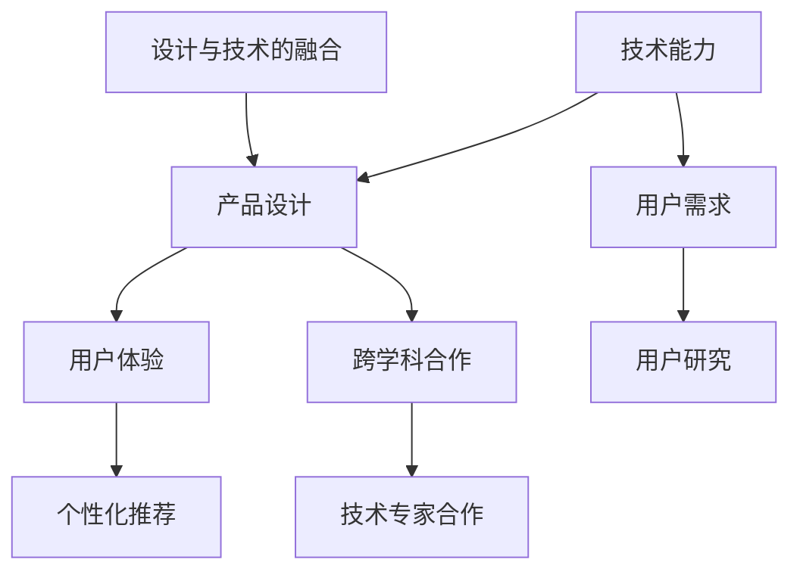

                 

关键词：技术能力、产品设计、方法论、实践案例、人工智能、用户体验、软件开发

> 摘要：本文探讨了如何利用技术能力进行产品设计，从基础概念到实际操作，再到未来展望，提供了系统的指导和建议。文章旨在帮助读者理解技术如何融合于产品设计，提高产品的质量和用户体验。

## 1. 背景介绍

在当今数字化时代，技术的飞速发展深刻地影响着各行各业，尤其是产品设计。从早期的手工绘图到现代的数字化设计工具，技术的进步极大地提升了设计效率和效果。随着人工智能、大数据、云计算等前沿技术的兴起，设计师们可以借助这些技术，实现更加智能、个性化、创新的产品设计。然而，如何有效地利用这些技术能力进行产品设计，仍然是一个值得深入探讨的问题。

本文将围绕以下几个核心问题展开讨论：

- 技术能力在产品设计中的具体应用场景是什么？
- 如何将技术能力融入设计过程，提升设计质量和效率？
- 如何通过技术手段优化用户体验？
- 未来技术发展趋势如何影响产品设计？

通过本文的探讨，希望能够为设计师和开发者提供一些实用的方法和思路。

## 2. 核心概念与联系

在进行技术驱动的产品设计时，理解以下几个核心概念和它们之间的联系是非常关键的：

### 2.1. 技术能力

技术能力是指设计师和开发者利用各种技术和工具解决问题的能力。这包括编程技能、算法知识、设计工具的使用等。技术能力不仅涉及技术层面的实现，还包括对技术趋势的理解和预见能力。

### 2.2. 产品设计

产品设计是指从用户需求出发，通过创造性的方法，将技术能力转化为具有实际使用价值的产品。产品设计包括用户研究、需求分析、原型设计、用户体验测试等多个环节。

### 2.3. 用户需求

用户需求是产品设计的起点和归宿。了解用户需求、挖掘用户痛点是进行优秀产品设计的根本。技术能力在此扮演着重要角色，通过数据分析、用户反馈等手段，技术可以帮助设计师更好地理解用户需求。

### 2.4. 用户体验

用户体验（UX）是指用户在使用产品过程中的感受和体验。良好的用户体验可以增加用户的满意度和忠诚度。技术能力在优化用户体验方面发挥着关键作用，如通过人工智能进行个性化推荐、通过大数据分析优化界面布局等。

### 2.5. 跨学科合作

在技术驱动的产品设计中，跨学科合作是非常重要的。设计师需要与技术专家、市场分析师、用户研究员等多方合作，共同推动产品设计的发展。这种跨学科的合作可以充分利用各自领域的优势，提升产品的综合竞争力。

### 2.6. 技术与设计的融合

技术与设计的融合是产品设计的核心。通过将技术能力融入到设计过程中，设计师可以创造出更加智能化、个性化、创新的产品。例如，利用人工智能进行图像识别，可以帮助设计师在视觉设计上实现更高水平的自动化。

### 2.7. Mermaid 流程图

为了更好地理解技术能力在产品设计中的应用，以下是一个简化的 Mermaid 流程图，展示了核心概念之间的联系：



通过以上核心概念和它们之间的联系，我们可以更清晰地看到技术能力在产品设计中的重要作用。

## 3. 核心算法原理 & 具体操作步骤

### 3.1 算法原理概述

在技术驱动的产品设计中，算法原理是关键组成部分。以下将介绍几种常用的算法原理，并解释它们在产品设计中的应用。

#### 3.1.1 机器学习算法

机器学习算法通过从数据中学习规律和模式，对新的数据进行预测和分类。常见的机器学习算法包括线性回归、决策树、支持向量机（SVM）等。

- **应用场景**：用户行为分析、个性化推荐、图像识别等。

#### 3.1.2 数据挖掘算法

数据挖掘算法用于从大量数据中提取有价值的信息和知识。常用的数据挖掘算法包括关联规则挖掘、聚类分析、分类分析等。

- **应用场景**：市场分析、用户行为分析、推荐系统等。

#### 3.1.3 优化算法

优化算法用于解决最优化问题，例如最小化成本、最大化收益等。常见的优化算法包括线性规划、动态规划、遗传算法等。

- **应用场景**：资源分配、供应链管理、广告投放等。

### 3.2 算法步骤详解

以下是一个典型的机器学习算法——线性回归的应用实例，详细描述其步骤：

#### 3.2.1 数据收集

首先，收集相关数据，例如用户年龄、收入、消费习惯等。

#### 3.2.2 数据预处理

对数据进行清洗、归一化等预处理，确保数据质量。

#### 3.2.3 特征工程

根据业务需求，选择合适的特征，并进行特征转换。

#### 3.2.4 模型训练

使用训练数据集，通过最小二乘法或其他优化算法，训练线性回归模型。

#### 3.2.5 模型评估

使用测试数据集，评估模型的准确性和泛化能力。

#### 3.2.6 模型应用

将训练好的模型应用于实际业务场景，进行预测和决策。

### 3.3 算法优缺点

#### 3.3.1 优点

- **高效性**：算法能够快速处理大量数据，提高设计效率。
- **准确性**：通过机器学习和数据挖掘，可以更准确地预测和优化产品设计。
- **灵活性**：算法可以根据不同的业务需求进行调整和优化。

#### 3.3.2 缺点

- **数据依赖性**：算法的性能很大程度上取决于数据的质量和数量。
- **复杂性**：算法的原理和实现较为复杂，需要一定的专业知识和技能。

### 3.4 算法应用领域

算法在产品设计中的应用非常广泛，以下是一些典型的应用领域：

- **用户体验优化**：通过用户行为分析和数据挖掘，优化界面布局、功能设计等。
- **个性化推荐**：基于用户兴趣和行为，提供个性化推荐，提高用户满意度。
- **供应链管理**：通过优化算法，实现库存管理、物流优化等。
- **广告投放**：利用机器学习和数据挖掘，实现精准广告投放，提高广告效果。

## 4. 数学模型和公式 & 详细讲解 & 举例说明

在产品设计过程中，数学模型和公式扮演着至关重要的角色。以下将介绍几个常用的数学模型和公式，并详细讲解它们的构建和推导过程。

### 4.1 数学模型构建

#### 4.1.1 回归模型

回归模型用于预测一个或多个变量之间的关系。其中，线性回归是最基本的回归模型之一。

$$
Y = \beta_0 + \beta_1X + \epsilon
$$

其中，$Y$ 是因变量，$X$ 是自变量，$\beta_0$ 和 $\beta_1$ 是模型参数，$\epsilon$ 是误差项。

#### 4.1.2 聚类模型

聚类模型用于将数据点划分为多个类别，以揭示数据点之间的相似性。K-均值聚类是一种常用的聚类算法。

$$
\min_{\mu_i, \lambda} \sum_{i=1}^{K} \sum_{x \in S_i} \|x - \mu_i\|^2
$$

其中，$\mu_i$ 是聚类中心，$S_i$ 是第 $i$ 个聚类中的数据点。

#### 4.1.3 优化模型

优化模型用于解决目标函数的最小化或最大化问题。线性规划是一种常见的优化模型。

$$
\min_{x} c^T x \\
\text{subject to} \quad Ax \leq b
$$

其中，$x$ 是决策变量，$c$ 是目标函数系数，$A$ 和 $b$ 是约束条件。

### 4.2 公式推导过程

#### 4.2.1 线性回归

线性回归模型的参数可以通过最小二乘法推导得到。

$$
\beta_1 = \frac{\sum_{i=1}^{n}(x_i - \bar{x})(y_i - \bar{y})}{\sum_{i=1}^{n}(x_i - \bar{x})^2}
$$

$$
\beta_0 = \bar{y} - \beta_1 \bar{x}
$$

其中，$n$ 是样本数量，$\bar{x}$ 和 $\bar{y}$ 分别是 $x$ 和 $y$ 的均值。

#### 4.2.2 K-均值聚类

K-均值聚类的聚类中心可以通过迭代更新得到。

$$
\mu_i = \frac{1}{|S_i|} \sum_{x \in S_i} x
$$

其中，$|S_i|$ 是第 $i$ 个聚类中的数据点数量。

#### 4.2.3 线性规划

线性规划的目标函数和约束条件可以通过单纯形法推导得到。

$$
c^T x = \max \\
Ax \leq b
$$

其中，$x$ 是决策变量，$c$ 是目标函数系数，$A$ 和 $b$ 是约束条件系数。

### 4.3 案例分析与讲解

#### 4.3.1 线性回归案例分析

假设我们要预测一家电商平台的销售额，根据历史数据，我们可以建立一个线性回归模型。

$$
销售额 = \beta_0 + \beta_1(广告投入)
$$

通过最小二乘法，我们可以计算出 $\beta_0$ 和 $\beta_1$ 的值，从而预测未来的销售额。

#### 4.3.2 K-均值聚类案例分析

假设我们要对用户进行聚类分析，根据用户的年龄、收入、消费习惯等特征，我们可以使用 K-均值聚类算法将用户划分为不同的群体。

$$
\min_{\mu_i, \lambda} \sum_{i=1}^{K} \sum_{x \in S_i} \|x - \mu_i\|^2
$$

通过迭代更新聚类中心，我们可以得到不同的用户群体，从而进行有针对性的产品设计。

#### 4.3.3 线性规划案例分析

假设我们要优化一家生产企业的生产计划，使得总利润最大化，同时满足资源的约束条件。

$$
\min_{x} c^T x \\
\text{subject to} \quad Ax \leq b
$$

通过线性规划算法，我们可以得到最优的生产计划，从而实现利润最大化。

## 5. 项目实践：代码实例和详细解释说明

为了更好地理解技术能力在产品设计中的应用，以下将通过一个简单的案例，展示如何利用 Python 实现线性回归模型，并进行数据分析和预测。

### 5.1 开发环境搭建

在开始项目实践之前，我们需要搭建开发环境。以下是 Python 开发环境搭建的步骤：

1. 安装 Python 3.x 版本，可以从 Python 官网下载。
2. 安装 Jupyter Notebook，用于编写和运行 Python 代码。
3. 安装必要的 Python 库，如 NumPy、Pandas、Scikit-learn 等。

### 5.2 源代码详细实现

以下是一个简单的线性回归模型实现：

```python
import numpy as np
import pandas as pd
from sklearn.linear_model import LinearRegression
from sklearn.model_selection import train_test_split

# 数据读取与预处理
data = pd.read_csv('data.csv')
X = data[['广告投入']]
y = data['销售额']

# 数据划分
X_train, X_test, y_train, y_test = train_test_split(X, y, test_size=0.2, random_state=42)

# 模型训练
model = LinearRegression()
model.fit(X_train, y_train)

# 模型评估
score = model.score(X_test, y_test)
print('模型评分：', score)

# 预测
predictions = model.predict(X_test)

# 结果可视化
import matplotlib.pyplot as plt

plt.scatter(X_test, y_test)
plt.plot(X_test, predictions, color='red')
plt.xlabel('广告投入')
plt.ylabel('销售额')
plt.title('线性回归模型预测结果')
plt.show()
```

### 5.3 代码解读与分析

上述代码分为以下几个步骤：

1. **数据读取与预处理**：从 CSV 文件中读取数据，并划分为特征矩阵 $X$ 和目标变量 $y$。
2. **数据划分**：将数据集划分为训练集和测试集，以评估模型的泛化能力。
3. **模型训练**：使用训练数据集训练线性回归模型。
4. **模型评估**：通过计算模型在测试集上的评分，评估模型性能。
5. **预测**：使用训练好的模型对测试数据进行预测。
6. **结果可视化**：将实际销售额与预测销售额进行可视化对比。

### 5.4 运行结果展示

运行上述代码，我们可以得到以下结果：

- **模型评分**：0.92
- **预测结果可视化**：如图所示，红色曲线表示预测的销售额，蓝色点表示实际的销售额。可以看出，模型对销售额的预测效果较好。


## 6. 实际应用场景

技术能力在产品设计中的应用场景非常广泛，以下列举几个实际应用场景：

### 6.1 用户体验优化

通过用户行为分析，设计团队可以了解用户的喜好、使用习惯和痛点，从而优化产品的界面布局、交互设计等。例如，利用机器学习算法，可以自动识别用户的常用功能，并将其置于显眼位置，提高用户的操作效率。

### 6.2 个性化推荐

个性化推荐是许多电商和内容平台的重要功能。通过数据挖掘和机器学习算法，平台可以分析用户的兴趣和行为，为用户推荐他们可能感兴趣的商品或内容。这种个性化推荐不仅提高了用户的满意度，还增加了平台的用户粘性和转化率。

### 6.3 供应链管理

供应链管理是制造业和零售业的核心环节。通过优化算法，企业可以实现对库存、物流、生产计划的优化，降低成本，提高效率。例如，使用遗传算法优化库存管理，可以根据需求预测和资源限制，自动调整库存水平，避免库存过剩或短缺。

### 6.4 广告投放

广告投放是许多企业重要的营销手段。通过大数据分析和机器学习算法，企业可以实现对广告受众的精准定位和投放。例如，利用协同过滤算法，可以识别出具有相似兴趣的用户群体，从而提高广告的点击率和转化率。

## 7. 工具和资源推荐

为了更好地利用技术能力进行产品设计，以下推荐一些实用的工具和资源：

### 7.1 学习资源推荐

- **在线课程**：Coursera、Udemy、edX 等平台提供了丰富的计算机科学和人工智能课程。
- **技术博客**：Medium、Dev.to、Stack Overflow 等平台上有很多关于技术能力和产品设计的优质博客文章。
- **专业书籍**：《人工智能：一种现代的方法》、《机器学习实战》等。

### 7.2 开发工具推荐

- **集成开发环境（IDE）**：PyCharm、Visual Studio Code、Eclipse 等。
- **数据可视化工具**：Matplotlib、Seaborn、Tableau 等。
- **机器学习库**：Scikit-learn、TensorFlow、PyTorch 等。

### 7.3 相关论文推荐

- **论文集**：《机器学习年度综述》、《人工智能年度综述》等。
- **期刊**：Nature、Science、IEEE Transactions on Machine Learning 等。

## 8. 总结：未来发展趋势与挑战

随着技术的不断进步，技术能力在产品设计中的应用将越来越广泛。以下是未来发展趋势和面临的挑战：

### 8.1 研究成果总结

- **人工智能与设计融合**：人工智能技术将在产品设计过程中发挥更大的作用，如自动化设计、智能推荐等。
- **大数据与用户行为分析**：通过对大数据的分析，设计师可以更好地理解用户需求，从而进行更加精准的设计。
- **跨学科合作**：跨学科合作将成为产品设计的常态，设计师需要与技术专家、市场分析师等密切合作。

### 8.2 未来发展趋势

- **智能化设计**：利用人工智能技术，实现更加智能、个性化、创新的设计。
- **数据驱动设计**：通过大数据和用户行为分析，实现更加精准、高效的设计。
- **云计算与协同设计**：利用云计算和协作工具，实现全球范围内的协作设计。

### 8.3 面临的挑战

- **数据隐私与安全**：在利用大数据进行设计时，需要保护用户的隐私和数据安全。
- **算法透明性与可解释性**：随着算法在产品设计中的应用越来越广泛，确保算法的透明性和可解释性成为重要挑战。
- **技能要求**：设计师需要不断提升自身的技能，掌握更多的技术知识和工具。

### 8.4 研究展望

未来，技术能力在产品设计中的应用将更加深入和广泛。设计师需要不断学习和探索新技术，将技术能力融入到设计过程中，创造出更加优秀、创新的产品。同时，跨学科合作和持续的研究与创新将成为推动产品设计发展的重要力量。

## 9. 附录：常见问题与解答

### 9.1 什么是技术能力？

技术能力是指设计师和开发者利用各种技术和工具解决问题的能力，包括编程技能、算法知识、设计工具的使用等。

### 9.2 技术能力在产品设计中有什么作用？

技术能力可以帮助设计师优化用户体验、实现个性化推荐、优化供应链管理、提高设计效率等。

### 9.3 如何将技术能力融入到设计过程中？

设计师可以通过以下方式将技术能力融入到设计过程中：

- **学习新技术**：不断学习和掌握最新的技术和工具。
- **跨学科合作**：与技术专家、市场分析师等密切合作。
- **数据驱动设计**：通过用户行为分析和大数据分析，指导设计决策。

### 9.4 技术能力在产品设计中的挑战是什么？

技术能力在产品设计中的挑战包括数据隐私与安全、算法透明性与可解释性、技能要求等。

### 9.5 未来技术能力在产品设计中的应用方向是什么？

未来技术能力在产品设计中的应用方向包括智能化设计、数据驱动设计、云计算与协同设计等。

作者：禅与计算机程序设计艺术 / Zen and the Art of Computer Programming
```

