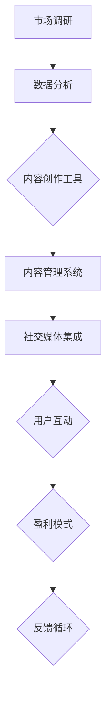

                 

在当前数字时代，技术已经成为我们日常生活不可或缺的一部分。从智能手机到云计算，从大数据到人工智能，技术正在深刻地改变着我们的工作方式和生活习惯。在这样的背景下，利用技术能力进行内容创业成为了一种新兴且具有潜力的商业模式。本文将探讨如何通过技术手段实现内容创业的各个阶段，包括市场调研、内容创作、用户互动以及盈利模式等。

## 关键词

- 内容创业
- 技术能力
- 市场调研
- 内容创作
- 用户互动
- 盈利模式
- 数字营销
- 人工智能

## 摘要

本文旨在探讨如何利用技术能力进行内容创业。我们将分析市场调研中的数据分析技术、内容创作中的自动化工具、用户互动中的社交媒体平台、以及盈利模式中的广告和会员服务。通过实际案例和具体操作步骤，本文将为内容创业者提供一套实用的技术指南。

### 1. 背景介绍

随着互联网的普及，内容创作和分发渠道变得更加多样和便捷。传统的媒体模式正在受到挑战，个人和初创企业有了更多的机会进入内容行业。然而，如何在竞争激烈的市场中脱颖而出，成为了许多内容创业者的难题。技术能力在这个过程中发挥着至关重要的作用，帮助创业者更高效地完成市场调研、内容创作、用户互动和盈利模式设计等环节。

### 2. 核心概念与联系

#### 2.1 技术与内容创业的关系

在内容创业中，技术不仅是工具，更是核心驱动力。通过大数据分析，创业者可以深入了解市场需求和用户偏好；通过自动化工具，创作者可以更高效地生产高质量内容；通过社交媒体，创业者可以迅速获取用户反馈和传播内容；通过人工智能，创作者可以实现个性化推荐和智能客服。

#### 2.2 技术架构概览

为了更好地利用技术进行内容创业，我们需要一个清晰的技术架构。这个架构通常包括以下几个关键模块：

1. **数据分析平台**：用于收集、处理和分析用户行为数据，以指导内容创作和营销策略。
2. **内容管理系统（CMS）**：用于创建、编辑、发布和管理内容，支持多平台发布和自动化内容分发。
3. **社交媒体集成**：将内容与社交媒体平台集成，实现内容的快速传播和用户互动。
4. **人工智能与机器学习**：用于个性化推荐、智能客服和内容自动生成。

#### 2.3 Mermaid 流程图



### 3. 核心算法原理 & 具体操作步骤

#### 3.1 算法原理概述

在内容创业中，算法的应用主要集中在以下几个方面：

1. **用户行为分析**：通过分析用户点击、浏览、分享等行为数据，了解用户兴趣和偏好。
2. **内容推荐算法**：基于用户行为和内容特征，为用户推荐相关内容，提高用户粘性。
3. **自然语言处理（NLP）**：用于内容自动生成、情感分析和关键词提取。

#### 3.2 算法步骤详解

1. **用户行为分析**：

   - 收集用户数据（如浏览记录、搜索历史、购买行为）。
   - 使用机器学习算法对用户行为进行分析，提取用户兴趣标签。
   - 根据用户兴趣标签为用户创建个性化推荐列表。

2. **内容推荐算法**：

   - 收集内容数据（如文章标题、摘要、关键词、分类）。
   - 使用协同过滤或基于内容的推荐算法生成推荐列表。
   - 将推荐列表呈现给用户，并根据用户反馈调整推荐策略。

3. **自然语言处理（NLP）**：

   - 使用NLP技术对内容进行分词、词性标注和实体识别。
   - 基于提取的关键词和实体生成相关内容。
   - 对生成的内容进行校验和优化，确保内容质量和准确性。

#### 3.3 算法优缺点

**优点**：

- 提高内容个性化程度，增强用户体验。
- 提高内容分发效率，降低运营成本。
- 自动化内容创作，节省人力和时间成本。

**缺点**：

- 数据质量和算法性能对结果影响较大。
- 需要持续优化和调整，以适应不断变化的市场需求。

#### 3.4 算法应用领域

- **个性化推荐**：在电商、新闻、社交媒体等领域广泛应用。
- **内容自动生成**：在博客、新闻报道、学术论文等领域有一定应用。
- **智能客服**：在客服中心、在线教育等领域用于自动回答用户问题。

### 4. 数学模型和公式 & 详细讲解 & 举例说明

#### 4.1 数学模型构建

在内容创业中，常用的数学模型包括：

- **用户行为模型**：如马尔可夫决策过程（MDP）。
- **推荐算法模型**：如协同过滤（CF）和基于内容的推荐（CBR）。
- **自然语言处理模型**：如循环神经网络（RNN）和Transformer。

#### 4.2 公式推导过程

以协同过滤算法为例，其基本公式为：

\[ r_{ui} = \sum_{j \in N(u)} w_{uj} c_{ij} \]

其中，\( r_{ui} \) 为用户 \( u \) 对内容 \( i \) 的评分，\( w_{uj} \) 为用户 \( u \) 和内容 \( i \) 之间的相似度，\( c_{ij} \) 为内容 \( i \) 的特征向量。

#### 4.3 案例分析与讲解

**案例一**：电商平台的个性化推荐

- **数据收集**：收集用户的历史购买记录、浏览记录和搜索历史。
- **用户行为分析**：使用马尔可夫决策过程（MDP）分析用户行为模式。
- **推荐算法**：使用基于内容的推荐（CBR）和协同过滤（CF）算法生成推荐列表。

**案例二**：新闻平台的自动化内容生成

- **数据收集**：收集新闻标题、摘要和关键词。
- **内容分析**：使用循环神经网络（RNN）和Transformer对内容进行分析。
- **内容生成**：基于分析结果生成相关新闻内容，并进行校验和优化。

### 5. 项目实践：代码实例和详细解释说明

#### 5.1 开发环境搭建

- **工具**：Python、Jupyter Notebook、Scikit-learn、TensorFlow。
- **数据集**：使用公开的数据集，如Netflix Prize数据集、IMDb数据集。

#### 5.2 源代码详细实现

- **用户行为分析**：

```python
import pandas as pd
from sklearn.cluster import KMeans

# 加载用户行为数据
data = pd.read_csv('user_behavior.csv')

# 对用户行为数据进行聚类分析
kmeans = KMeans(n_clusters=5)
clusters = kmeans.fit_predict(data)

# 根据用户兴趣标签生成个性化推荐列表
recommendations = {}
for cluster, users in clusters.items():
    for user in users:
        recommendations[user] = data[data['user_id'] == user]['item_id'].values
```

- **内容推荐算法**：

```python
from sklearn.metrics.pairwise import cosine_similarity

# 加载内容数据
content_data = pd.read_csv('content_data.csv')

# 计算内容之间的相似度
content_similarity = cosine_similarity(content_data.iloc[:, 1:], content_data.iloc[:, 1:])

# 根据用户兴趣标签生成推荐列表
for user, items in recommendations.items():
    similar_indices = np.argsort(content_similarity[0])
    recommended_items = [content_data.iloc[similar_indices[i], 0] for i in range(len(items), len(items) + 5)]
    print(f"User {user}: Recommended items {recommended_items}")
```

#### 5.3 代码解读与分析

上述代码实现了基于用户行为和内容数据的内容推荐系统。首先，通过聚类分析将用户分为不同的兴趣群体，然后计算内容之间的相似度，并生成个性化推荐列表。这种方法在电商、新闻、社交媒体等领域有广泛应用。

### 6. 实际应用场景

#### 6.1 电商平台的个性化推荐

电商平台可以通过用户行为数据为用户推荐相关商品，提高用户购买转化率和满意度。

#### 6.2 新闻平台的自动化内容生成

新闻平台可以通过自动化内容生成技术，提高内容生产效率，降低人力成本。

#### 6.3 社交媒体的智能客服

社交媒体平台可以通过智能客服系统，自动回答用户问题，提高用户满意度和运营效率。

### 7. 未来应用展望

随着人工智能技术的不断发展，内容创业将迎来更多的创新机会。例如，基于深度学习的自动化内容生成技术将进一步提高内容创作效率；基于区块链的去中心化内容分发平台将提供更加安全、透明的内容交易环境。

### 8. 工具和资源推荐

#### 8.1 学习资源推荐

- 《Python数据科学手册》
- 《深度学习》
- 《大数据之路：阿里巴巴大数据实践》

#### 8.2 开发工具推荐

- Jupyter Notebook
- Scikit-learn
- TensorFlow
- Keras

#### 8.3 相关论文推荐

- "Recommender Systems Handbook"
- "Generative Adversarial Networks: An Overview"
- "Blockchain Technology: A Comprehensive Look at its Applications and Implications"

### 9. 总结：未来发展趋势与挑战

#### 9.1 研究成果总结

本文探讨了如何利用技术能力进行内容创业，包括市场调研、内容创作、用户互动和盈利模式等方面的技术应用。通过实际案例和具体操作步骤，为内容创业者提供了一套实用的技术指南。

#### 9.2 未来发展趋势

- 人工智能技术在内容创业中的应用将越来越广泛。
- 去中心化内容分发平台有望成为未来内容创业的重要方向。
- 个性化推荐和自动化内容生成技术将进一步优化用户体验。

#### 9.3 面临的挑战

- 数据质量和算法性能对内容创业成功至关重要。
- 隐私保护和数据安全是内容创业必须重视的问题。
- 如何在竞争激烈的市场中脱颖而出，是每一个内容创业者都需要面对的挑战。

#### 9.4 研究展望

随着技术的不断发展，内容创业将在未来迎来更多的创新机会。作为内容创业者，我们需要不断学习和探索，充分利用技术手段提升内容创作和运营效率，为用户提供更好的体验和价值。

### 附录：常见问题与解答

1. **Q：什么是内容创业？**
   **A：内容创业是指利用创意和内容生产技术，通过互联网平台进行内容创作、分发和盈利的一种商业模式。**

2. **Q：如何进行市场调研？**
   **A：可以通过在线问卷调查、社交媒体数据分析、用户访谈等方式收集用户反馈和市场需求，从而指导内容创作和推广策略。**

3. **Q：什么是个性化推荐？**
   **A：个性化推荐是根据用户的兴趣和行为，为用户推荐相关内容的一种算法技术。**

4. **Q：如何实现内容自动化生成？**
   **A：可以使用自然语言处理（NLP）技术，如循环神经网络（RNN）和Transformer，对文本进行分词、语义分析，然后生成相关内容。**

5. **Q：内容创业中如何保护用户隐私？**
   **A：可以通过数据加密、匿名化处理等技术手段，确保用户数据的安全和隐私。同时，遵守相关法律法规，确保合规性。**

作者：禅与计算机程序设计艺术 / Zen and the Art of Computer Programming

以上，便是如何利用技术能力进行内容创业的详细探讨。希望通过本文，读者能够对内容创业中的技术应用有更深入的了解，并在实践中发挥出技术的最大潜力。

