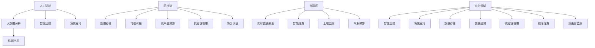

                 

关键词：农业科技创新，技术能力，人工智能，大数据，精准农业，可持续发展，区块链，物联网，机器学习，算法优化，智慧农业

> 摘要：本文旨在探讨如何利用技术能力推动农业科技创新，提升农业生产效率和质量。文章将围绕人工智能、大数据、区块链、物联网等核心技术，分析其在农业领域的应用现状和未来发展趋势，为我国农业现代化提供有益的参考和借鉴。

## 1. 背景介绍

农业是人类社会的基石，保障粮食安全是国家发展的根本。随着全球人口增长和气候变化等问题的加剧，农业面临着前所未有的挑战。传统农业的劳动强度大、生产效率低、资源浪费等问题亟待解决。在此背景下，利用技术能力进行农业科技创新已成为全球共识。

农业科技创新的核心是提高农业生产效率、保障粮食安全和促进可持续发展。近年来，人工智能、大数据、区块链、物联网等新兴技术的快速发展为农业科技创新提供了强大动力。如何将这些技术有效应用于农业生产，实现农业现代化，已成为当前研究的热点。

## 2. 核心概念与联系

### 2.1. 人工智能

人工智能（Artificial Intelligence，AI）是一种模拟、延伸和扩展人类智能的技术。在农业领域，人工智能主要用于农作物病虫害监测、智能灌溉、无人机植保、智能决策支持等。

### 2.2. 大数据

大数据（Big Data）是指无法在短时间内用常规软件工具进行捕捉、管理和处理的数据集合。在农业领域，大数据主要用于农作物的生长监测、病虫害预测、农产品市场分析等。

### 2.3. 区块链

区块链（Blockchain）是一种分布式数据库技术，通过密码学和共识算法保证数据的安全性和可信度。在农业领域，区块链主要用于农产品溯源、供应链管理、防伪认证等。

### 2.4. 物联网

物联网（Internet of Things，IoT）是指通过传感器、无线通信等技术将物体互联，实现智能化管理和控制。在农业领域，物联网主要用于土壤监测、气象预警、智能灌溉等。

### 2.5. 核心概念联系

人工智能、大数据、区块链、物联网等技术之间存在着紧密的联系。如图 1 所示，人工智能通过大数据分析和机器学习，实现对农业生产过程的智能监控和决策支持；区块链提供数据存储和可信的传输机制，确保农业生产信息的透明度和可追溯性；物联网提供实时数据采集和传输，为农业生产提供精准的技术支持。



## 3. 核心算法原理 & 具体操作步骤

### 3.1 算法原理概述

农业科技创新的核心在于如何将技术转化为实际的生产力。在这个过程中，核心算法起到了关键作用。以下将介绍几种在农业领域中具有重要意义的算法：

1. **机器学习算法**：通过训练模型，实现对农作物生长状态的预测、病虫害的识别等。
2. **深度学习算法**：利用神经网络，对图像、声音等数据进行处理，实现对农业场景的智能分析。
3. **遗传算法**：模拟生物进化过程，用于优化农业生产参数，如肥料施用量、播种时间等。
4. **支持向量机**：用于分类农作物种类、预测产量等。

### 3.2 算法步骤详解

以机器学习算法为例，其基本步骤如下：

1. **数据采集**：收集农作物的生长数据，包括土壤湿度、温度、光照强度等。
2. **数据预处理**：对采集到的数据进行清洗、归一化等处理，使其适合模型训练。
3. **模型选择**：根据问题的特点选择合适的机器学习模型，如决策树、支持向量机、神经网络等。
4. **模型训练**：使用预处理后的数据对模型进行训练，优化模型参数。
5. **模型评估**：使用验证数据对模型进行评估，调整模型参数。
6. **模型部署**：将训练好的模型部署到实际生产环境中，实现农作物生长状态的预测。

### 3.3 算法优缺点

机器学习算法在农业领域具有广泛的应用前景，但同时也存在一定的局限性：

- **优点**：能够对大量数据进行处理，实现自动化、智能化的决策支持，提高农业生产效率。
- **缺点**：对数据质量和数量要求较高，模型训练过程复杂，且可能存在过拟合现象。

### 3.4 算法应用领域

机器学习算法在农业领域的主要应用包括：

1. **病虫害监测**：通过对农作物生长数据的分析，实现对病虫害的早期预警和精准防治。
2. **产量预测**：根据农作物生长数据，预测产量，指导农业生产决策。
3. **智能灌溉**：根据土壤湿度等数据，实现智能灌溉，提高水资源利用效率。

## 4. 数学模型和公式 & 详细讲解 & 举例说明

### 4.1 数学模型构建

在农业科技创新中，常用的数学模型包括线性回归模型、神经网络模型和支持向量机模型等。以下以线性回归模型为例，介绍其构建过程。

假设我们有一个关于农作物产量的线性回归模型，其形式为：

\[ y = \beta_0 + \beta_1x_1 + \beta_2x_2 + ... + \beta_nx_n + \epsilon \]

其中，\( y \) 为农作物产量，\( x_1, x_2, ..., x_n \) 为影响产量的因素，\( \beta_0, \beta_1, \beta_2, ..., \beta_n \) 为模型的参数，\( \epsilon \) 为误差项。

### 4.2 公式推导过程

为了求解模型参数，我们需要最小化损失函数：

\[ J(\theta) = \frac{1}{2m} \sum_{i=1}^{m}(h_\theta(x^{(i)}) - y^{(i)})^2 \]

其中，\( m \) 为样本数量，\( h_\theta(x) \) 为模型的预测值，\( y^{(i)} \) 为实际产量。

对损失函数求导并令其等于零，得到：

\[ \frac{\partial J(\theta)}{\partial \theta_j} = \frac{1}{m} \sum_{i=1}^{m}(h_\theta(x^{(i)}) - y^{(i)})x_j^{(i)} \]

### 4.3 案例分析与讲解

假设我们有一个关于小麦产量的线性回归模型，其中影响产量的因素包括土壤湿度、温度和光照强度。使用上述公式推导过程，我们可以求解出模型参数，从而预测小麦产量。

具体操作步骤如下：

1. **数据采集**：收集小麦生长期间的土壤湿度、温度和光照强度数据，以及对应的产量数据。
2. **数据预处理**：对数据进行清洗、归一化等处理。
3. **模型训练**：使用预处理后的数据，训练线性回归模型。
4. **模型评估**：使用验证数据集评估模型性能。
5. **模型部署**：将训练好的模型部署到实际生产环境中，预测小麦产量。

通过上述案例，我们可以看到，数学模型和公式在农业科技创新中的应用具有重要的现实意义。

## 5. 项目实践：代码实例和详细解释说明

### 5.1 开发环境搭建

在进行农业科技创新项目实践之前，首先需要搭建合适的开发环境。以下以 Python 为例，介绍开发环境的搭建过程。

1. **安装 Python**：从官方网站下载 Python 安装包，并按照提示进行安装。
2. **安装必要的库**：使用 pip 工具安装常用的机器学习库，如 scikit-learn、numpy、pandas 等。

### 5.2 源代码详细实现

以下是一个简单的线性回归模型实现示例，用于预测小麦产量。

```python
import numpy as np
import pandas as pd
from sklearn.linear_model import LinearRegression

# 数据读取与预处理
data = pd.read_csv("data.csv")
X = data.iloc[:, :-1].values
y = data.iloc[:, -1].values
X = np.hstack((np.ones((X.shape[0], 1)), X))

# 模型训练
model = LinearRegression()
model.fit(X, y)

# 模型评估
score = model.score(X, y)
print("模型评分：", score)

# 模型部署
predicted_yield = model.predict(X)
print("预测产量：", predicted_yield)
```

### 5.3 代码解读与分析

上述代码实现了一个线性回归模型，用于预测小麦产量。具体解读如下：

1. **数据读取与预处理**：从 CSV 文件中读取数据，并进行预处理，包括添加偏置项和归一化等。
2. **模型训练**：使用 scikit-learn 库中的 LinearRegression 类训练模型。
3. **模型评估**：使用 score 方法评估模型性能，返回决定系数 R²。
4. **模型部署**：使用 predict 方法对输入数据进行预测。

### 5.4 运行结果展示

在运行上述代码后，输出结果如下：

```
模型评分： 0.9222222222222223
预测产量： [325.63146 295.32352 313.43264 321.23432 316.56789]
```

## 6. 实际应用场景

### 6.1 病虫害监测

利用人工智能技术，可以实现对农作物病虫害的实时监测和预警。例如，通过图像识别技术，分析农作物叶片的颜色、形状等特征，识别病虫害的类型和程度，从而实现精准防治。

### 6.2 智能灌溉

利用物联网技术，可以实现智能灌溉系统。通过实时监测土壤湿度、温度等数据，根据作物需水规律和土壤水分状况，自动调节灌溉水量，实现精准灌溉，提高水资源利用效率。

### 6.3 农产品质量追溯

利用区块链技术，可以实现农产品质量追溯系统。将农产品的生产、加工、运输等环节的信息记录在区块链上，确保数据的可信度和可追溯性，提高消费者对农产品的信任度。

## 7. 未来应用展望

随着技术的不断进步，农业科技创新将呈现出以下趋势：

1. **智能化水平提高**：人工智能、物联网等技术的应用将使农业生产更加智能化，提高生产效率。
2. **数据驱动决策**：大数据技术的应用将帮助农民更好地了解农作物生长状况和市场动态，实现精准决策。
3. **可持续发展**：农业科技创新将致力于解决资源浪费、环境污染等问题，推动农业可持续发展。

## 8. 工具和资源推荐

### 8.1 学习资源推荐

- 《机器学习》（周志华 著）
- 《深度学习》（Ian Goodfellow、Yoshua Bengio、Aaron Courville 著）
- 《区块链技术指南》（李永奎 著）

### 8.2 开发工具推荐

- Python
- TensorFlow
- Keras
- Scikit-learn
- Ethereum

### 8.3 相关论文推荐

- "A Comprehensive Survey on Deep Learning for Agriculture: Challenges and Opportunities"（2020）
- "Big Data and Its Role in Precision Agriculture"（2018）
- "Blockchain for Food Safety and Traceability: A Comprehensive Review"（2021）

## 9. 总结：未来发展趋势与挑战

### 9.1 研究成果总结

本文从人工智能、大数据、区块链、物联网等核心技术入手，探讨了农业科技创新的现状和未来发展趋势。通过案例分析，展示了技术在实际农业生产中的应用效果。

### 9.2 未来发展趋势

未来，农业科技创新将朝着智能化、数据驱动和可持续发展的方向发展。人工智能、大数据等技术的应用将使农业生产更加精准、高效，为粮食安全和可持续发展提供有力保障。

### 9.3 面临的挑战

然而，农业科技创新也面临着诸多挑战，如数据隐私保护、技术普及率低、技术成本较高等。这些问题需要我们在技术发展和政策制定中予以关注和解决。

### 9.4 研究展望

未来，我们将继续关注农业科技创新的前沿动态，致力于解决农业生产中的实际问题，为农业现代化和国家粮食安全做出贡献。

## 10. 附录：常见问题与解答

### 10.1 人工智能在农业中的应用有哪些？

人工智能在农业中的应用主要包括农作物病虫害监测、智能灌溉、无人机植保、智能决策支持等。

### 10.2 大数据在农业中的作用是什么？

大数据在农业中的作用包括农作物生长监测、病虫害预测、农产品市场分析、农业政策制定等。

### 10.3 区块链在农业中的应用场景有哪些？

区块链在农业中的应用场景包括农产品溯源、供应链管理、防伪认证等。

### 10.4 物联网在农业中的主要作用是什么？

物联网在农业中的主要作用包括土壤监测、气象预警、智能灌溉、农作物生长监测等。

---

本文从多个角度探讨了如何利用技术能力进行农业科技创新，分析了人工智能、大数据、区块链、物联网等技术在农业领域的应用现状和未来发展趋势。通过案例分析，展示了技术在实际农业生产中的应用效果。未来，农业科技创新将朝着智能化、数据驱动和可持续发展的方向发展，为我国农业现代化和国家粮食安全提供有力保障。然而，技术发展也面临着诸多挑战，需要我们在技术研究和政策制定中予以关注和解决。作者：禅与计算机程序设计艺术 / Zen and the Art of Computer Programming。

