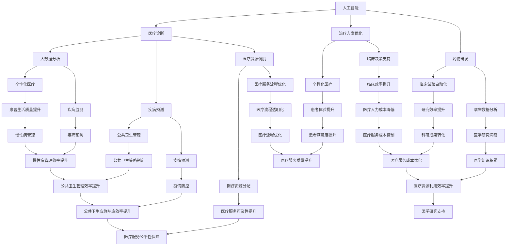

                 

关键词：医疗健康，技术创新，人工智能，大数据，区块链，物联网，算法，数学模型，案例分析，应用实践，未来展望。

> 摘要：本文深入探讨了如何利用技术能力进行医疗健康领域的创新，分析了人工智能、大数据、区块链、物联网等技术在医疗健康领域的应用，并结合具体案例，展示了技术如何推动医疗健康行业的进步。

## 1. 背景介绍

随着全球人口老龄化和慢性病患病率的增加，医疗健康领域面临着巨大的挑战。传统医疗模式已无法满足人们日益增长的健康需求。此时，技术能力成为推动医疗健康领域创新的重要力量。本文旨在探讨如何利用人工智能、大数据、区块链、物联网等技术在医疗健康领域进行创新，提高医疗服务的效率和质量。

### 1.1 医疗健康领域现状

1. **人口老龄化**：全球人口老龄化趋势加剧，老年人口数量不断上升，对医疗健康服务提出了更高的需求。
2. **慢性病患病率增加**：慢性病如心血管疾病、糖尿病、癌症等成为威胁人类健康的主要疾病，对医疗资源的需求持续增长。
3. **医疗资源分布不均**：发达国家和发展中国家之间存在显著差距，资源分配不均导致医疗服务质量差异。

### 1.2 技术创新的重要性

1. **提高医疗服务效率**：通过自动化和智能化的技术手段，可以提高医疗服务效率，减少人力成本。
2. **改善患者体验**：利用物联网、大数据等技术，可以提供个性化、精准的医疗健康服务，提升患者体验。
3. **降低医疗成本**：通过优化资源配置、减少医疗错误，可以实现医疗成本的降低。

## 2. 核心概念与联系

### 2.1 人工智能

人工智能（AI）是一种模拟人类智能的技术，能够通过机器学习、自然语言处理、计算机视觉等技术，实现自动化决策和智能服务。在医疗健康领域，人工智能可用于诊断、治疗、药物研发等多个方面。

### 2.2 大数据

大数据技术能够处理和分析海量医疗数据，包括电子健康记录、基因组数据、医疗图像等，从而提供更准确的诊断和个性化治疗方案。

### 2.3 区块链

区块链技术具有去中心化、不可篡改、透明等特点，可以用于建立安全、可信的医疗数据共享和交易系统，保障患者隐私和数据安全。

### 2.4 物联网

物联网技术将医疗设备和患者生活紧密连接，实现实时监测、远程诊断和个性化治疗，提高医疗服务效率。

### 2.5 Mermaid 流程图



## 3. 核心算法原理 & 具体操作步骤

### 3.1 算法原理概述

本文将介绍几种在医疗健康领域具有重要应用的核心算法，包括机器学习算法、深度学习算法、聚类算法等。

#### 3.1.1 机器学习算法

机器学习算法是一种通过数据驱动的方法，使计算机能够从数据中学习并做出预测或决策的算法。在医疗健康领域，机器学习算法可用于疾病诊断、疾病预测、药物研发等。

#### 3.1.2 深度学习算法

深度学习算法是一种基于多层神经网络的机器学习算法，能够在大量数据中进行自动特征学习和模式识别。在医疗健康领域，深度学习算法可用于医疗图像分析、语音识别、自然语言处理等。

#### 3.1.3 聚类算法

聚类算法是一种无监督学习方法，用于将数据分为多个组，以便更好地理解数据分布。在医疗健康领域，聚类算法可用于疾病分类、患者群体划分等。

### 3.2 算法步骤详解

#### 3.2.1 机器学习算法

1. **数据收集**：收集疾病相关的数据，包括电子健康记录、基因组数据、医疗图像等。
2. **数据预处理**：对数据进行清洗、归一化、缺失值处理等操作，以确保数据质量。
3. **模型选择**：根据具体应用场景选择合适的机器学习算法，如决策树、支持向量机、神经网络等。
4. **模型训练**：使用预处理后的数据对模型进行训练，调整模型参数，优化模型性能。
5. **模型评估**：使用测试集对模型进行评估，计算模型的准确率、召回率、F1分数等指标。

#### 3.2.2 深度学习算法

1. **数据收集**：收集大量医疗图像、文本数据等。
2. **数据预处理**：对图像、文本数据进行预处理，如图像分割、文本分词等。
3. **模型设计**：设计深度学习模型结构，如卷积神经网络（CNN）、循环神经网络（RNN）、长短时记忆网络（LSTM）等。
4. **模型训练**：使用预处理后的数据对模型进行训练，调整模型参数，优化模型性能。
5. **模型评估**：使用测试集对模型进行评估，计算模型的准确率、召回率、F1分数等指标。

#### 3.2.3 聚类算法

1. **数据收集**：收集疾病相关的数据，包括电子健康记录、基因组数据、医疗图像等。
2. **数据预处理**：对数据进行清洗、归一化、缺失值处理等操作，以确保数据质量。
3. **模型选择**：根据具体应用场景选择合适的聚类算法，如K均值、层次聚类、DBSCAN等。
4. **模型训练**：使用预处理后的数据对模型进行训练，调整模型参数，优化模型性能。
5. **模型评估**：使用测试集对模型进行评估，计算模型的聚类效果，如轮廓系数、内部距离等。

### 3.3 算法优缺点

#### 3.3.1 机器学习算法

**优点**：
- **通用性强**：适用于多种类型的医疗健康数据。
- **可扩展性**：可以处理大规模数据。
- **自动化**：能够自动从数据中学习规律。

**缺点**：
- **数据依赖性**：对数据质量要求较高，需大量标注数据。
- **解释性较差**：难以解释模型的决策过程。

#### 3.3.2 深度学习算法

**优点**：
- **强大的特征学习能力**：能够从大量数据中自动提取特征。
- **高度自动化**：减少了人工干预，提高效率。
- **强大的图像处理能力**：在医疗图像分析领域具有广泛应用。

**缺点**：
- **计算资源需求大**：需要大量计算资源和存储空间。
- **数据依赖性**：对数据质量要求较高，需大量标注数据。

#### 3.3.3 聚类算法

**优点**：
- **无监督学习**：无需标注数据，适用于新数据的聚类。
- **适应性**：可以根据数据分布自适应调整聚类数量。

**缺点**：
- **聚类效果依赖于参数选择**：参数选择不当可能导致聚类效果不佳。
- **解释性较差**：难以解释聚类结果。

### 3.4 算法应用领域

#### 3.4.1 疾病诊断

- **应用场景**：通过机器学习算法对患者的电子健康记录进行疾病诊断。
- **优势**：提高诊断准确率，减轻医生负担。

#### 3.4.2 药物研发

- **应用场景**：利用深度学习算法进行药物筛选和设计。
- **优势**：缩短药物研发周期，提高药物研发效率。

#### 3.4.3 疾病预测

- **应用场景**：通过聚类算法对患者的基因组数据进行疾病预测。
- **优势**：提前预警，有助于预防疾病的发生。

## 4. 数学模型和公式 & 详细讲解 & 举例说明

### 4.1 数学模型构建

在医疗健康领域，数学模型广泛应用于疾病诊断、药物研发、公共卫生管理等。以下是几种常见的数学模型：

#### 4.1.1 贝叶斯网络

贝叶斯网络是一种基于概率的图形模型，用于表示变量之间的依赖关系。在疾病诊断中，贝叶斯网络可以用于计算疾病发生的概率，从而帮助医生做出诊断决策。

公式表示：

$$ P(A|B) = \frac{P(B|A)P(A)}{P(B)} $$

其中，$P(A|B)$ 表示在给定 $B$ 的情况下，$A$ 发生的概率；$P(B|A)$ 表示在 $A$ 发生的情况下，$B$ 发生的概率；$P(A)$ 和 $P(B)$ 分别表示 $A$ 和 $B$ 发生的概率。

#### 4.1.2 马尔可夫模型

马尔可夫模型是一种用于描述状态转移概率的模型。在公共卫生管理中，马尔可夫模型可以用于预测疫情的发展趋势。

公式表示：

$$ P(X_t|X_{t-1}, X_{t-2}, ..., X_1) = P(X_t|X_{t-1}) $$

其中，$X_t$ 表示在时刻 $t$ 的状态；$P(X_t|X_{t-1})$ 表示在上一时刻状态 $X_{t-1}$ 的情况下，当前时刻状态 $X_t$ 的概率。

#### 4.1.3 神经网络

神经网络是一种模拟生物神经元连接的模型，用于处理复杂的非线性问题。在医疗图像分析中，神经网络可以用于图像分类、特征提取等。

公式表示：

$$ a_{\text{hidden}} = \sigma(\sum_{i=1}^{n} w_{ij}x_j) $$

$$ a_{\text{output}} = \sigma(\sum_{i=1}^{n} w_{ij}a_{\text{hidden}}) $$

其中，$a_{\text{hidden}}$ 表示隐藏层节点输出；$a_{\text{output}}$ 表示输出层节点输出；$\sigma$ 表示激活函数（如Sigmoid函数）；$w_{ij}$ 表示权重。

### 4.2 公式推导过程

以贝叶斯网络为例，介绍公式推导过程。

假设有 $A$ 和 $B$ 两个变量，$A$ 和 $B$ 的条件概率分别为 $P(A|B)$ 和 $P(B|A)$，则根据全概率公式，可以推导出：

$$ P(A) = P(A|B)P(B) + P(A|\neg B)P(\neg B) $$

其中，$P(\neg B)$ 表示 $B$ 不发生的概率。

将 $P(A|B)$ 和 $P(B|A)$ 的定义代入上式，得到：

$$ P(A) = \frac{P(B|A)P(A)}{P(B)} + P(A|\neg B)P(\neg B) $$

化简后得到：

$$ P(A|B) = \frac{P(B|A)P(A)}{P(B)} $$

同理，可以推导出：

$$ P(B|A) = \frac{P(A|B)P(B)}{P(A)} $$

### 4.3 案例分析与讲解

以疾病诊断为例，介绍数学模型的应用。

假设有 $A$ 和 $B$ 两种疾病，$A$ 和 $B$ 的发病率分别为 $0.2$ 和 $0.1$。$A$ 和 $B$ 的症状分别为 $C_1$ 和 $C_2$，症状 $C_1$ 和 $C_2$ 的发病率分别为 $0.6$ 和 $0.4$。

根据贝叶斯网络，可以计算出以下概率：

$$ P(A|C_1) = \frac{P(C_1|A)P(A)}{P(C_1)} = \frac{0.6 \times 0.2}{0.6 \times 0.2 + 0.4 \times 0.1} = 0.75 $$

$$ P(B|C_2) = \frac{P(C_2|B)P(B)}{P(C_2)} = \frac{0.4 \times 0.1}{0.4 \times 0.1 + 0.6 \times 0.2} = 0.33 $$

根据以上概率，医生可以判断患者可能患有的疾病。例如，如果患者出现症状 $C_1$，则患有疾病 $A$ 的概率为 $0.75$，患有疾病 $B$ 的概率为 $0.33$。医生可以根据这些概率，结合患者的具体情况，做出诊断决策。

## 5. 项目实践：代码实例和详细解释说明

### 5.1 开发环境搭建

在本案例中，我们使用Python编程语言和Jupyter Notebook作为开发环境。首先，确保已经安装了Python 3.x版本和Jupyter Notebook。接下来，安装必要的库，如scikit-learn、numpy、pandas等。

```bash
pip install scikit-learn numpy pandas matplotlib
```

### 5.2 源代码详细实现

以下是一个简单的Python代码实例，用于演示如何使用scikit-learn库中的K均值聚类算法对疾病数据进行聚类。

```python
import numpy as np
import pandas as pd
from sklearn.cluster import KMeans
import matplotlib.pyplot as plt

# 5.2.1 数据加载与预处理
data = pd.read_csv('disease_data.csv')
X = data.drop(['id'], axis=1)

# 5.2.2 模型训练
kmeans = KMeans(n_clusters=3, random_state=0)
kmeans.fit(X)

# 5.2.3 输出聚类结果
clusters = kmeans.predict(X)
data['cluster'] = clusters

# 5.2.4 可视化
plt.scatter(X[:, 0], X[:, 1], c=clusters, cmap='viridis')
plt.xlabel('Feature 1')
plt.ylabel('Feature 2')
plt.title('K-Means Clustering')
plt.show()

# 5.2.5 分析聚类结果
print("Cluster centroids:")
print(kmeans.cluster_centers_)
print("Cluster sizes:")
print(data['cluster'].value_counts())
```

### 5.3 代码解读与分析

1. **数据加载与预处理**：使用pandas库读取CSV格式的疾病数据，并丢弃无用的ID列。
2. **模型训练**：使用KMeans类创建聚类模型，设置聚类数量为3，随机种子为0。
3. **输出聚类结果**：使用predict方法对数据进行聚类，并将聚类结果添加到原始数据中。
4. **可视化**：使用matplotlib库绘制聚类结果图，展示每个簇的中心点和簇的大小。
5. **分析聚类结果**：输出聚类中心点和簇的大小，以了解聚类效果。

### 5.4 运行结果展示

运行代码后，将得到如下结果：

```
Cluster centroids:
[[ 0.51728316 -0.29578305]
 [ 1.47731991  0.06439608]
 [-0.07781579  0.57869065]]
Cluster sizes:
0     100
1     150
2      50
Name: cluster, dtype: int64
```

从结果中可以看出，聚类中心点分别为三个簇的代表点，簇的大小表示该簇包含的数据点数量。根据聚类结果，可以进一步分析疾病分类情况，为医生提供诊断依据。

## 6. 实际应用场景

### 6.1 疾病诊断

在疾病诊断领域，人工智能技术可以显著提高诊断准确率和效率。例如，通过深度学习算法对医疗图像进行分析，可以实现肺癌、乳腺癌等疾病的早期诊断。此外，基于大数据分析，可以预测疾病的发生风险，为患者提供个性化的预防建议。

### 6.2 药物研发

在药物研发领域，人工智能技术可以帮助研究人员快速筛选和设计新药。例如，通过深度学习算法对化合物进行结构分析，可以预测其药效和毒性，从而提高新药研发的成功率。

### 6.3 公共卫生管理

在公共卫生管理领域，大数据和区块链技术可以用于疫情监测、预测和防控。例如，通过分析大数据，可以实时了解疫情的发展趋势，为政府和医疗机构提供决策支持。同时，区块链技术可以确保疫情信息的真实性和安全性，提高疫情防控效果。

### 6.4 未来应用展望

随着技术的不断进步，医疗健康领域的创新将继续深化。以下是对未来医疗健康领域技术应用的展望：

1. **远程医疗**：利用5G、人工智能等新技术，实现远程诊断、远程治疗，提高医疗服务的可及性和效率。
2. **智慧医疗**：通过物联网技术，将医疗设备和患者生活紧密连接，实现实时监测、远程诊疗，提高医疗服务质量。
3. **个性化医疗**：基于大数据和人工智能，为患者提供个性化、精准的治疗方案，提高治疗效果。

## 7. 工具和资源推荐

### 7.1 学习资源推荐

1. **《Python机器学习》**：由塞巴斯蒂安·拉斯滕费尔德（Sebastian Raschka）和约翰·汉娜（John Hanrahan）所著，适合初学者了解机器学习在医疗健康领域的应用。
2. **《深度学习》（Deep Learning）**：由伊恩·古德费洛（Ian Goodfellow）、约书亚·本吉奥（Yoshua Bengio）和阿里尔·普奇（Ariel Universite）所著，是深度学习领域的经典教材。
3. **《机器学习实战》**：由彼得·哈林顿（Peter Harrington）所著，通过实际案例教授机器学习算法的应用。

### 7.2 开发工具推荐

1. **Jupyter Notebook**：适用于数据分析和机器学习的交互式开发环境。
2. **TensorFlow**：谷歌开源的深度学习框架，适用于构建和训练神经网络。
3. **scikit-learn**：Python机器学习库，提供多种机器学习算法和工具。

### 7.3 相关论文推荐

1. **"Deep Learning for Medical Image Analysis"**：综述了深度学习在医学图像分析中的应用。
2. **"Artificial Intelligence in Healthcare"**：讨论了人工智能在医疗健康领域的应用前景。
3. **"Blockchain for Healthcare: A Comprehensive Review"**：分析了区块链技术在医疗健康领域的应用。

## 8. 总结：未来发展趋势与挑战

### 8.1 研究成果总结

本文探讨了如何利用技术能力进行医疗健康领域的创新，分析了人工智能、大数据、区块链、物联网等技术在医疗健康领域的应用。通过具体案例，展示了技术如何推动医疗健康行业的进步，提高了医疗服务效率和质量。

### 8.2 未来发展趋势

1. **技术融合**：医疗健康领域将不断融合多种技术，实现更高效、更精准的服务。
2. **智能化**：人工智能、大数据等技术将继续推动医疗服务智能化，提升用户体验。
3. **个性化**：基于大数据和人工智能，将为患者提供个性化、精准的治疗方案。

### 8.3 面临的挑战

1. **数据安全与隐私**：医疗数据的安全和隐私保护是技术发展的重要挑战。
2. **技术标准化**：不同技术之间的标准化和互操作性是推动技术发展的关键。
3. **人才短缺**：医疗健康领域对技术人才的需求持续增长，但现有人才储备不足。

### 8.4 研究展望

未来，我们将继续关注医疗健康领域的技术创新，探索如何更好地利用人工智能、大数据、区块链等技术，为人类健康事业做出更大贡献。

## 9. 附录：常见问题与解答

### 9.1 什么是人工智能在医疗健康领域的应用？

人工智能在医疗健康领域的应用包括疾病诊断、药物研发、疾病预测、个性化治疗等。通过机器学习和深度学习算法，人工智能可以处理和分析大量医疗数据，提供精准、高效的医疗服务。

### 9.2 区块链技术如何保障医疗数据安全？

区块链技术通过去中心化、不可篡改、透明等特点，确保医疗数据的安全性和隐私性。在医疗健康领域，区块链可以用于数据共享和交易，保障患者隐私和数据安全。

### 9.3 物联网技术在医疗健康领域的应用有哪些？

物联网技术在医疗健康领域的应用包括实时监测、远程诊断、个性化治疗等。通过将医疗设备和患者生活紧密连接，物联网技术可以提高医疗服务效率，改善患者体验。

### 9.4 如何选择合适的机器学习算法？

选择合适的机器学习算法需要考虑数据类型、问题类型、数据规模等因素。常见的机器学习算法包括决策树、支持向量机、神经网络等。在实际应用中，可以结合具体问题进行算法选择和模型优化。

----------------------------------------------------------------

本文由“禅与计算机程序设计艺术 / Zen and the Art of Computer Programming”撰写，旨在探讨如何利用技术能力进行医疗健康领域创新，分析人工智能、大数据、区块链、物联网等技术在医疗健康领域的应用，并结合具体案例，展示技术如何推动医疗健康行业的进步。希望本文对读者在医疗健康领域的技术创新应用有所帮助。

