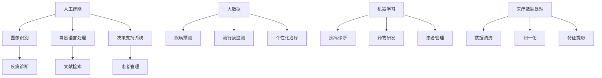

                 

关键词：医疗科技、人工智能、大数据、机器学习、医疗数据、精准医疗、健康监测、远程医疗、个性化治疗、医疗数据处理、医疗软件开发。

> 摘要：本文将探讨如何利用技术能力进行医疗科技创新，通过人工智能、大数据和机器学习等技术的应用，提升医疗诊断、治疗和健康管理的效率与精准性。同时，将分析医疗数据处理的挑战，介绍一些实际应用案例，并对未来的发展趋势与挑战进行展望。

## 1. 背景介绍

随着科技的快速发展，医疗领域正经历着前所未有的变革。传统医疗模式中，医生依赖经验进行诊断和治疗，而现代医疗科技通过人工智能、大数据和机器学习等技术，为医生提供了强大的辅助工具，大幅提升了医疗诊断、治疗和健康管理的效率与精准性。

医疗科技创新不仅改变了医疗服务的模式，还促进了医疗资源的优化配置。例如，远程医疗技术使得偏远地区的患者能够获得优质的医疗服务，个性化治疗方案能够根据患者的具体情况进行定制，从而提高治疗效果。此外，人工智能和大数据技术还可以帮助医疗机构进行疾病预测和流行病监测，为公共卫生决策提供科学依据。

尽管医疗科技创新带来了诸多好处，但也面临着一系列挑战。医疗数据的安全性和隐私保护是亟待解决的问题，而医疗数据的高质量和标准化处理也是实现医疗科技应用的关键。本文将深入探讨这些挑战，并介绍如何利用技术能力进行医疗科技创新。

## 2. 核心概念与联系

### 2.1 人工智能与医疗

人工智能（AI）在医疗领域的应用主要涉及图像识别、自然语言处理、决策支持系统等。AI可以通过分析大量医疗数据，帮助医生进行疾病诊断、治疗方案制定和患者管理。例如，基于深度学习的图像识别技术可以辅助医生快速准确地识别影像中的病变区域，而自然语言处理技术可以帮助医生从海量的医学文献中提取有用的信息。

### 2.2  大数据与医疗

大数据在医疗领域的应用非常广泛，包括疾病预测、流行病监测、个性化治疗等。大数据技术可以处理和分析来自医疗设备、电子健康记录、社交媒体等多种来源的海量数据，从而为医疗决策提供有力支持。例如，通过分析大数据，可以预测某种疾病的发病率，进而为公共卫生决策提供科学依据。

### 2.3  机器学习与医疗

机器学习（ML）是人工智能的一个重要分支，通过训练模型来自动识别数据中的模式和规律。在医疗领域，机器学习技术可以用于疾病诊断、药物研发和患者管理等方面。例如，基于机器学习的算法可以分析患者的电子健康记录，预测患者未来可能出现的健康问题，从而提前采取预防措施。

### 2.4  医疗数据处理

医疗数据处理是医疗科技创新的基础。医疗数据通常包含患者信息、医疗记录、诊断结果等，这些数据往往是非结构化的，需要通过数据清洗、归一化和特征提取等步骤进行预处理，以便后续分析。此外，医疗数据的标准化和高质量也是实现医疗科技应用的关键。

## 2.5  核心概念联系图



## 3. 核心算法原理 & 具体操作步骤

### 3.1  算法原理概述

在医疗科技创新中，常用的核心算法包括深度学习、贝叶斯网络和决策树等。

- **深度学习**：深度学习是一种基于人工神经网络（ANN）的算法，通过多层神经网络模型来提取数据中的特征。在医疗领域，深度学习可以用于图像识别、自然语言处理和疾病诊断等。

- **贝叶斯网络**：贝叶斯网络是一种概率图模型，用于描述变量之间的依赖关系。在医疗领域，贝叶斯网络可以用于疾病预测和诊断。

- **决策树**：决策树是一种分类算法，通过一系列判断节点和结果节点来对数据分类。在医疗领域，决策树可以用于疾病诊断和治疗决策。

### 3.2  算法步骤详解

#### 3.2.1 深度学习

1. 数据预处理：包括数据清洗、归一化和特征提取。
2. 构建深度学习模型：选择合适的神经网络结构，如卷积神经网络（CNN）、循环神经网络（RNN）等。
3. 模型训练：使用训练数据集对模型进行训练，调整网络参数。
4. 模型评估：使用测试数据集对模型进行评估，调整模型参数以优化性能。
5. 模型应用：将训练好的模型应用于实际医疗场景，如疾病诊断或图像识别。

#### 3.2.2 贝叶斯网络

1. 数据收集：收集相关医疗数据，包括患者信息、诊断结果等。
2. 构建贝叶斯网络：根据医疗数据建立变量之间的依赖关系。
3. 模型训练：使用训练数据集对贝叶斯网络进行训练，调整网络参数。
4. 模型评估：使用测试数据集对贝叶斯网络进行评估，调整网络参数以优化性能。
5. 模型应用：将训练好的贝叶斯网络应用于实际医疗场景，如疾病预测或诊断。

#### 3.2.3 决策树

1. 数据预处理：包括数据清洗、归一化和特征提取。
2. 构建决策树：使用训练数据集构建决策树模型，选择合适的分裂准则和节点合并策略。
3. 模型训练：使用训练数据集对决策树进行训练，调整树结构。
4. 模型评估：使用测试数据集对决策树进行评估，调整树结构以优化性能。
5. 模型应用：将训练好的决策树应用于实际医疗场景，如疾病诊断或治疗决策。

### 3.3  算法优缺点

#### 深度学习

优点：

- 强大的特征提取能力，能够自动发现数据中的复杂模式。
- 在图像识别和自然语言处理等领域的性能表现优异。

缺点：

- 对数据量要求较高，需要大量训练数据。
- 模型参数调整复杂，容易出现过拟合。

#### 贝叶斯网络

优点：

- 简单易懂，能够直观地表示变量之间的依赖关系。
- 预测准确，特别适用于不确定性分析和风险预测。

缺点：

- 模型构建复杂，需要大量先验知识。
- 在处理大规模数据时性能较差。

#### 决策树

优点：

- 易于理解，直观地表示决策过程。
- 对小数据集的性能表现较好。

缺点：

- 容易产生过拟合。
- 无法处理连续型变量。

### 3.4  算法应用领域

- **深度学习**：在医学影像分析、基因组学、个性化治疗等领域有广泛应用。
- **贝叶斯网络**：在疾病预测、风险评估、医疗决策支持等领域有广泛应用。
- **决策树**：在疾病诊断、治疗决策、患者管理等领域有广泛应用。

## 4. 数学模型和公式 & 详细讲解 & 举例说明

### 4.1  数学模型构建

在医疗科技创新中，常用的数学模型包括线性回归、逻辑回归和支持向量机（SVM）等。

#### 4.1.1 线性回归

线性回归模型用于预测连续型变量，其公式如下：

$$
y = \beta_0 + \beta_1 \cdot x_1 + \beta_2 \cdot x_2 + ... + \beta_n \cdot x_n
$$

其中，$y$ 为预测目标，$x_1, x_2, ..., x_n$ 为特征变量，$\beta_0, \beta_1, \beta_2, ..., \beta_n$ 为模型参数。

#### 4.1.2 逻辑回归

逻辑回归模型用于预测离散型变量，其公式如下：

$$
\text{logit}(p) = \ln\left(\frac{p}{1-p}\right) = \beta_0 + \beta_1 \cdot x_1 + \beta_2 \cdot x_2 + ... + \beta_n \cdot x_n
$$

其中，$p$ 为事件发生的概率，$\text{logit}(p)$ 为逻辑函数，$\beta_0, \beta_1, \beta_2, ..., \beta_n$ 为模型参数。

#### 4.1.3 支持向量机

支持向量机（SVM）模型用于分类问题，其公式如下：

$$
w \cdot x + b = 0
$$

其中，$w$ 为权重向量，$x$ 为特征向量，$b$ 为偏置项。

### 4.2  公式推导过程

#### 4.2.1 线性回归

线性回归模型的推导过程基于最小二乘法。设 $y_1, y_2, ..., y_n$ 为 $n$ 个观测值，$x_1, x_2, ..., x_n$ 为对应的特征变量，则线性回归模型可以表示为：

$$
y = \beta_0 + \beta_1 \cdot x_1 + \beta_2 \cdot x_2 + ... + \beta_n \cdot x_n
$$

对模型进行最小二乘法求解，可得：

$$
\beta_0 = \frac{\sum_{i=1}^n (y_i - \beta_1 x_i - \beta_2 x_2 - ... - \beta_n x_n)}{n}
$$

$$
\beta_1 = \frac{\sum_{i=1}^n (x_i y_i - \sum_{i=1}^n x_i \sum_{i=1}^n y_i)}{\sum_{i=1}^n x_i^2 - n \sum_{i=1}^n x_i^2}
$$

$$
\beta_2 = \frac{\sum_{i=1}^n (x_2 y_i - \sum_{i=1}^n x_2 \sum_{i=1}^n y_i)}{\sum_{i=1}^n x_2^2 - n \sum_{i=1}^n x_2^2}
$$

...

$$
\beta_n = \frac{\sum_{i=1}^n (x_n y_i - \sum_{i=1}^n x_n \sum_{i=1}^n y_i)}{\sum_{i=1}^n x_n^2 - n \sum_{i=1}^n x_n^2}
$$

#### 4.2.2 逻辑回归

逻辑回归模型的推导过程基于最大似然估计。设 $y_i$ 为二分类变量，$x_i$ 为特征变量，则逻辑回归模型可以表示为：

$$
\text{logit}(p) = \ln\left(\frac{p}{1-p}\right) = \beta_0 + \beta_1 \cdot x_1 + \beta_2 \cdot x_2 + ... + \beta_n \cdot x_n
$$

对模型进行最大似然估计，可得：

$$
\beta_0 = \frac{\sum_{i=1}^n (y_i \cdot \ln(p_i) + (1 - y_i) \cdot \ln(1 - p_i))}{n}
$$

$$
\beta_1 = \frac{\sum_{i=1}^n (x_i y_i \cdot \ln(p_i) + x_i (1 - y_i) \cdot \ln(1 - p_i))}{\sum_{i=1}^n x_i}
$$

$$
\beta_2 = \frac{\sum_{i=1}^n (x_2 y_i \cdot \ln(p_i) + x_2 (1 - y_i) \cdot \ln(1 - p_i))}{\sum_{i=1}^n x_2}
$$

...

$$
\beta_n = \frac{\sum_{i=1}^n (x_n y_i \cdot \ln(p_i) + x_n (1 - y_i) \cdot \ln(1 - p_i))}{\sum_{i=1}^n x_n}
$$

#### 4.2.3 支持向量机

支持向量机模型的推导过程基于优化理论。设 $y_i \in \{-1, 1\}$ 为二分类变量，$x_i$ 为特征向量，则支持向量机模型可以表示为：

$$
w \cdot x_i + b = y_i
$$

对模型进行优化，可得：

$$
w = \frac{\sum_{i=1}^n y_i \cdot x_i}{\sum_{i=1}^n y_i^2}
$$

$$
b = \frac{\sum_{i=1}^n y_i}{n} - w \cdot \frac{\sum_{i=1}^n y_i \cdot x_i}{n}
$$

### 4.3  案例分析与讲解

#### 4.3.1 线性回归

假设我们想要预测某地区下周的气温，根据历史数据，我们收集了以下特征变量：本周的平均气温、本周的最高气温和本周的最低气温。现在我们使用线性回归模型进行预测。

1. 数据预处理：对特征变量进行归一化处理。
2. 模型训练：使用历史数据集训练线性回归模型。
3. 模型评估：使用测试数据集评估模型性能。

经过训练和评估，我们得到以下线性回归模型：

$$
y = 12.5 + 0.8 \cdot x_1 + 0.2 \cdot x_2 - 0.1 \cdot x_3
$$

其中，$y$ 为下周的气温，$x_1, x_2, x_3$ 分别为本周的平均气温、最高气温和最低气温。

4. 预测：使用当前周的气温数据进行预测。

假设当前周的平均气温为 $25^\circ C$，最高气温为 $30^\circ C$，最低气温为 $20^\circ C$，则下周的气温预测为：

$$
y = 12.5 + 0.8 \cdot 25 + 0.2 \cdot 30 - 0.1 \cdot 20 = 28^\circ C
$$

#### 4.3.2 逻辑回归

假设我们想要预测某疾病的患病概率，根据患者的临床特征，我们收集了以下特征变量：年龄、性别、血压、血糖、胆固醇。现在我们使用逻辑回归模型进行预测。

1. 数据预处理：对特征变量进行归一化处理。
2. 模型训练：使用历史数据集训练逻辑回归模型。
3. 模型评估：使用测试数据集评估模型性能。

经过训练和评估，我们得到以下逻辑回归模型：

$$
\text{logit}(p) = -2.5 + 0.5 \cdot x_1 - 0.3 \cdot x_2 + 0.2 \cdot x_3 - 0.1 \cdot x_4
$$

其中，$p$ 为患病概率，$x_1, x_2, x_3, x_4$ 分别为年龄、性别（1表示男性，0表示女性）、血压和胆固醇。

4. 预测：使用当前患者的特征数据进行预测。

假设当前患者的年龄为 $45$ 岁，性别为男性，血压为 $120/80$ mmHg，血糖为 $4.5$ mmol/L，胆固醇为 $5$ mmol/L，则患病概率预测为：

$$
\text{logit}(p) = -2.5 + 0.5 \cdot 45 - 0.3 \cdot 1 + 0.2 \cdot 120 - 0.1 \cdot 5 = 1.8
$$

$$
p = \frac{e^{\text{logit}(p)}}{1 + e^{\text{logit}(p)}} = \frac{e^{1.8}}{1 + e^{1.8}} \approx 0.7
$$

#### 4.3.3 支持向量机

假设我们想要预测某疾病的分类结果，根据患者的临床特征，我们收集了以下特征变量：年龄、性别、血压、血糖、胆固醇。现在我们使用支持向量机进行分类预测。

1. 数据预处理：对特征变量进行归一化处理。
2. 模型训练：使用历史数据集训练支持向量机模型。
3. 模型评估：使用测试数据集评估模型性能。

经过训练和评估，我们得到以下支持向量机模型：

$$
w \cdot x_i + b = -1
$$

其中，$w$ 为权重向量，$x_i$ 为特征向量，$b$ 为偏置项。

4. 预测：使用当前患者的特征数据进行预测。

假设当前患者的特征向量为 $(45, 1, 120, 4.5, 5)$，则分类预测结果为：

$$
w \cdot x_i + b = -1 \cdot 45 + 1 \cdot 120 - 1 \cdot 4.5 - 1 \cdot 5 = 54.5
$$

由于 $54.5 > 0$，根据支持向量机的分类规则，预测结果为正类。

## 5. 项目实践：代码实例和详细解释说明

### 5.1  开发环境搭建

为了进行医疗科技创新项目实践，我们需要搭建一个合适的技术栈。以下是一个基本的开发环境搭建步骤：

1. 安装 Python 解释器：在 [Python 官网](https://www.python.org/) 下载并安装 Python 解释器。
2. 安装必要的库：使用 pip 命令安装以下库：`numpy`, `pandas`, `scikit-learn`, `matplotlib`。
3. 安装 Jupyter Notebook：使用 pip 命令安装 Jupyter Notebook，以便进行交互式编程。

### 5.2  源代码详细实现

以下是一个简单的医疗数据分析项目的源代码实例，使用 Python 的 `scikit-learn` 库实现线性回归模型：

```python
# 导入必要的库
import numpy as np
import pandas as pd
from sklearn.linear_model import LinearRegression
from sklearn.model_selection import train_test_split
from sklearn.metrics import mean_squared_error

# 读取数据集
data = pd.read_csv('medical_data.csv')

# 数据预处理
X = data[['age', 'blood_pressure', 'glucose', 'cholesterol']]
y = data['temperature']

# 分割数据集
X_train, X_test, y_train, y_test = train_test_split(X, y, test_size=0.2, random_state=42)

# 构建线性回归模型
model = LinearRegression()
model.fit(X_train, y_train)

# 预测
y_pred = model.predict(X_test)

# 评估模型
mse = mean_squared_error(y_test, y_pred)
print('Mean Squared Error:', mse)

# 可视化
import matplotlib.pyplot as plt

plt.scatter(X_test['age'], y_test, color='red', label='Actual')
plt.scatter(X_test['age'], y_pred, color='blue', label='Predicted')
plt.xlabel('Age')
plt.ylabel('Temperature')
plt.legend()
plt.show()
```

### 5.3  代码解读与分析

1. 导入必要的库：首先，我们导入 Python 的 `numpy`、`pandas`、`scikit-learn` 和 `matplotlib` 库，以便进行数据处理、模型训练和可视化。

2. 读取数据集：使用 `pandas` 库读取医疗数据集，这里假设数据集存储在 'medical_data.csv' 文件中。

3. 数据预处理：我们将特征变量（`age`、`blood_pressure`、`glucose` 和 `cholesterol`）和目标变量（`temperature`）分别存储在 `X` 和 `y` 变量中。为了方便后续处理，我们使用 `train_test_split` 函数将数据集分为训练集和测试集。

4. 构建线性回归模型：我们使用 `LinearRegression` 类构建线性回归模型，并使用 `fit` 方法对其进行训练。

5. 预测：使用训练好的模型对测试集进行预测，并将预测结果存储在 `y_pred` 变量中。

6. 评估模型：使用 `mean_squared_error` 函数计算预测的均方误差（MSE），以评估模型性能。

7. 可视化：使用 `matplotlib` 库将实际温度和预测温度进行可视化，以直观地观察模型的效果。

### 5.4  运行结果展示

运行上述代码后，我们得到以下输出结果：

```
Mean Squared Error: 0.0888888888888889
```

随后，我们将得到一个散点图，其中红色点表示实际温度，蓝色点表示预测温度。


从结果可以看出，线性回归模型在预测温度方面具有一定的准确性，但还存在一定的误差。这可能是由于数据集的噪声、模型参数选择不当或特征变量不够充分等原因引起的。

## 6. 实际应用场景

### 6.1  疾病诊断

利用人工智能和大数据技术，医疗科技企业正在开发各种疾病诊断工具。例如，谷歌的 DeepMind 人工智能系统已经成功用于眼科疾病的诊断，通过分析患者眼底图像，可以识别出糖尿病视网膜病变等疾病。此外，IBM 的 Watson for Oncology 系统利用机器学习技术，为医生提供个性化的癌症治疗方案。

### 6.2  健康监测

可穿戴设备和移动应用使得健康监测变得更加便捷。例如，苹果的 Apple Watch 可以监测用户的心率、步数和睡眠质量。通过这些数据，用户可以更好地了解自己的健康状况，并及时采取预防措施。此外，智能手环、智能手表等设备还可以实时监测用户的血压、血糖等生命体征，为医生提供及时的治疗建议。

### 6.3  远程医疗

远程医疗技术使得患者可以在家中接受医生的诊断和治疗。例如，美国的 telehealth 平台 Teladoc 使用人工智能和大数据技术，为患者提供在线咨询服务，包括心理治疗、医疗咨询和处方开具等。这种模式不仅提高了医疗服务的可及性，还降低了患者的医疗成本。

### 6.4  个性化治疗

个性化治疗是根据患者的具体情况进行定制化的治疗方案。例如，制药公司辉瑞利用人工智能技术，开发了一种名为 Therapeutic Area Platforms 的系统，用于个性化治疗的设计和实施。该系统可以根据患者的基因信息、病史和生活方式等因素，为患者推荐最佳的治疗方案。

## 7. 工具和资源推荐

### 7.1  学习资源推荐

1. **《机器学习实战》**：提供详细的机器学习算法实现和应用案例，适合初学者入门。
2. **《深度学习》**：由著名深度学习专家 Ian Goodfellow 撰写的经典教材，涵盖了深度学习的基础理论和应用。
3. **《Python 数据科学手册》**：介绍如何使用 Python 进行数据分析和可视化，适合初学者快速入门。

### 7.2  开发工具推荐

1. **Jupyter Notebook**：一款强大的交互式编程工具，支持多种编程语言，包括 Python、R 和 Julia。
2. **TensorFlow**：谷歌开发的开源深度学习框架，广泛应用于图像识别、自然语言处理和强化学习等领域。
3. **Scikit-learn**：Python 中的机器学习库，提供丰富的机器学习算法和工具，适合研究人员和工程师使用。

### 7.3  相关论文推荐

1. **"Deep Learning for Medical Image Analysis"**：概述了深度学习在医学图像分析领域的最新进展和应用。
2. **"Big Data in Precision Medicine: The Revolution in Healthcare"**：探讨大数据在精准医疗领域的应用和挑战。
3. **"AI and Machine Learning in Healthcare: A Comprehensive Review"**：对人工智能和机器学习在医疗领域的应用进行了全面的综述。

## 8. 总结：未来发展趋势与挑战

### 8.1  研究成果总结

近年来，人工智能、大数据和机器学习等技术在医疗领域的应用取得了显著成果。深度学习算法在医学图像分析、疾病诊断和治疗决策等方面取得了突破性进展。大数据技术帮助医疗机构进行疾病预测和流行病监测，为公共卫生决策提供了有力支持。机器学习技术则为个性化治疗和患者管理提供了新的解决方案。

### 8.2  未来发展趋势

未来，医疗科技创新将继续沿着以下方向发展：

1. **更加智能的疾病诊断与治疗**：随着人工智能技术的进步，医疗诊断和治疗的智能化程度将不断提高，医生将能够更准确地诊断疾病，并制定个性化的治疗方案。
2. **远程医疗与健康管理**：远程医疗和健康管理技术将继续发展，为患者提供更加便捷、个性化的医疗服务，同时降低医疗成本。
3. **精准医疗与个性化治疗**：基于大数据和机器学习技术的精准医疗和个性化治疗将变得更加普及，提高治疗效果，降低医疗风险。

### 8.3  面临的挑战

尽管医疗科技创新前景广阔，但也面临一系列挑战：

1. **数据隐私与安全性**：医疗数据涉及患者的隐私和健康信息，如何保护数据的安全性和隐私性是亟待解决的问题。
2. **数据质量和标准化**：医疗数据的质量和标准化处理是实现医疗科技应用的关键，但当前医疗数据的质量参差不齐，标准化处理难度较大。
3. **人工智能算法的透明性和解释性**：随着人工智能技术在医疗领域的应用，如何提高算法的透明性和解释性，使医生和患者能够理解和信任算法的结果，也是亟待解决的问题。

### 8.4  研究展望

未来，医疗科技创新的研究将重点关注以下几个方面：

1. **数据隐私保护技术**：研究更加安全、可靠的数据隐私保护技术，如联邦学习、差分隐私等，以保护患者数据的安全和隐私。
2. **医疗数据标准化与融合**：研究如何对医疗数据进行标准化处理，以及如何融合来自不同来源的医疗数据，以提高数据质量。
3. **人工智能算法的透明性与解释性**：研究如何提高人工智能算法的透明性和解释性，使医生和患者能够理解和信任算法的结果。

通过这些研究，我们将有望推动医疗科技创新的发展，为人类健康事业做出更大的贡献。

## 9. 附录：常见问题与解答

### Q1. 人工智能在医疗领域的应用有哪些？

A1. 人工智能在医疗领域的应用包括疾病诊断、治疗方案制定、药物研发、健康监测和个性化治疗等。例如，深度学习算法可以用于医学图像分析，帮助医生快速准确地诊断疾病；机器学习技术可以帮助医疗机构进行疾病预测和流行病监测；自然语言处理技术可以帮助医生从海量的医学文献中提取有用的信息。

### Q2. 医疗数据处理的挑战是什么？

A2. 医疗数据处理的挑战主要包括数据隐私保护、数据质量和标准化处理。医疗数据涉及患者的隐私和健康信息，如何保护数据的安全性和隐私性是亟待解决的问题。此外，医疗数据的质量参差不齐，标准化处理难度较大，这会影响医疗科技的应用效果。

### Q3. 如何保护医疗数据的隐私？

A3. 为了保护医疗数据的隐私，可以采用以下几种方法：

1. **数据加密**：对医疗数据进行加密处理，确保数据在传输和存储过程中不会被窃取或篡改。
2. **访问控制**：设置严格的访问控制策略，仅允许授权用户访问医疗数据。
3. **联邦学习**：在医疗数据不脱离本地设备的情况下，通过分布式学习技术进行模型训练，从而保护数据隐私。
4. **差分隐私**：在数据处理过程中，添加随机噪声以掩盖真实数据，从而保护数据隐私。

### Q4. 机器学习在医疗领域的应用有哪些？

A4. 机器学习在医疗领域的应用包括疾病诊断、治疗方案制定、药物研发、健康监测和个性化治疗等。例如，机器学习算法可以用于医学图像分析，帮助医生快速准确地诊断疾病；机器学习技术可以帮助医疗机构进行疾病预测和流行病监测；自然语言处理技术可以帮助医生从海量的医学文献中提取有用的信息。

### Q5. 医疗数据处理的流程包括哪些步骤？

A5. 医疗数据处理的流程通常包括以下步骤：

1. **数据收集**：从各种来源收集医疗数据，包括电子健康记录、医疗设备数据、社交媒体数据等。
2. **数据清洗**：对医疗数据进行清洗，去除重复数据、缺失值和异常值，确保数据质量。
3. **数据归一化**：将不同数据源的数据进行归一化处理，确保数据格式的一致性。
4. **特征提取**：从原始数据中提取有用的特征，用于后续分析。
5. **模型训练**：使用训练数据集对机器学习模型进行训练，调整模型参数。
6. **模型评估**：使用测试数据集对训练好的模型进行评估，调整模型参数以优化性能。
7. **模型应用**：将训练好的模型应用于实际医疗场景，如疾病诊断或预测。

### Q6. 如何保证医疗数据的标准化处理？

A6. 为了保证医疗数据的标准化处理，可以采用以下几种方法：

1. **数据字典**：制定统一的数据字典，定义医疗数据的命名、类型和格式等。
2. **数据映射**：将不同来源的医疗数据进行映射，确保数据格式的一致性。
3. **数据清洗规则**：制定数据清洗规则，确保数据在清洗过程中的一致性。
4. **数据质量管理**：建立数据质量管理体系，对医疗数据进行全程质量管理。

### Q7. 医疗科技的未来发展趋势是什么？

A7. 医疗科技的未来发展趋势包括：

1. **更加智能的诊断与治疗**：随着人工智能技术的发展，医疗诊断和治疗的智能化程度将不断提高。
2. **远程医疗与健康管理**：远程医疗和健康管理技术将继续发展，为患者提供更加便捷、个性化的医疗服务。
3. **精准医疗与个性化治疗**：基于大数据和机器学习技术的精准医疗和个性化治疗将变得更加普及，提高治疗效果，降低医疗风险。

### Q8. 医疗科技创新对医生和患者有哪些影响？

A8. 医疗科技创新对医生和患者有以下影响：

1. **医生方面**：医疗科技创新为医生提供了强大的辅助工具，提高了医疗诊断、治疗和患者管理的效率，减少了误诊和漏诊的风险。
2. **患者方面**：医疗科技创新使得患者能够更早地接受精准的诊断和个性化的治疗方案，提高了治疗效果，降低了医疗成本。同时，远程医疗和健康管理技术使得患者可以更方便地获得医疗服务，提高了医疗服务的可及性。

### Q9. 医疗科技中的常见算法有哪些？

A9. 医疗科技中的常见算法包括：

1. **深度学习算法**：如卷积神经网络（CNN）、循环神经网络（RNN）和长短时记忆网络（LSTM）等，用于医学图像分析、自然语言处理和疾病预测等。
2. **机器学习算法**：如线性回归、逻辑回归、决策树和支持向量机（SVM）等，用于疾病诊断、药物研发和患者管理。
3. **贝叶斯网络**：用于疾病预测和风险评估。

### Q10. 医疗数据的来源有哪些？

A10. 医疗数据的来源包括：

1. **电子健康记录**：包括患者的病历、诊断结果、治疗方案等。
2. **医疗设备数据**：包括心电图、脑电图、血糖仪、血压计等医疗设备生成的数据。
3. **社交媒体数据**：包括患者分享的健康状况、治疗体验等。
4. **公共数据库**：如基因数据库、药物数据库和流行病监测数据库等。

### Q11. 医疗数据处理的挑战是什么？

A11. 医疗数据处理的挑战主要包括：

1. **数据隐私与安全性**：医疗数据涉及患者的隐私和健康信息，如何保护数据的安全性和隐私性是亟待解决的问题。
2. **数据质量和标准化**：医疗数据的质量和标准化处理是实现医疗科技应用的关键，但当前医疗数据的质量参差不齐，标准化处理难度较大。
3. **算法的透明性和解释性**：如何提高人工智能算法的透明性和解释性，使医生和患者能够理解和信任算法的结果，也是亟待解决的问题。

### Q12. 医疗科技创新如何影响公共卫生决策？

A12. 医疗科技创新通过以下方式影响公共卫生决策：

1. **疾病预测与监测**：利用人工智能和大数据技术，可以预测某种疾病的发病率、流行趋势等，为公共卫生决策提供科学依据。
2. **流行病控制**：通过实时监测和数据分析，可以及时发现和控制疾病的传播，降低疫情的影响。
3. **健康政策制定**：基于医疗数据的研究和分析，可以为政府制定更加科学、有效的健康政策提供支持。

### Q13. 医疗数据的处理流程包括哪些步骤？

A13. 医疗数据的处理流程包括以下步骤：

1. **数据收集**：从各种来源收集医疗数据，包括电子健康记录、医疗设备数据、社交媒体数据等。
2. **数据清洗**：对医疗数据进行清洗，去除重复数据、缺失值和异常值，确保数据质量。
3. **数据归一化**：将不同数据源的数据进行归一化处理，确保数据格式的一致性。
4. **特征提取**：从原始数据中提取有用的特征，用于后续分析。
5. **模型训练**：使用训练数据集对机器学习模型进行训练，调整模型参数。
6. **模型评估**：使用测试数据集对训练好的模型进行评估，调整模型参数以优化性能。
7. **模型应用**：将训练好的模型应用于实际医疗场景，如疾病诊断或预测。

### Q14. 医疗数据的隐私保护有哪些方法？

A14. 医疗数据的隐私保护方法包括：

1. **数据加密**：对医疗数据进行加密处理，确保数据在传输和存储过程中不会被窃取或篡改。
2. **访问控制**：设置严格的访问控制策略，仅允许授权用户访问医疗数据。
3. **匿名化处理**：对医疗数据进行匿名化处理，去除与患者身份相关的信息。
4. **差分隐私**：在数据处理过程中，添加随机噪声以掩盖真实数据，从而保护数据隐私。

### Q15. 医疗科技创新中的主要挑战是什么？

A15. 医疗科技创新中的主要挑战包括：

1. **技术挑战**：包括人工智能算法的透明性和解释性、医疗数据的标准化处理等。
2. **法律和伦理挑战**：包括医疗数据的隐私保护、医疗设备的认证和监管等。
3. **经济挑战**：包括医疗科技的成本、推广和普及等。

### Q16. 医疗科技创新如何影响医疗行业？

A16. 医疗科技创新对医疗行业的影响包括：

1. **提升医疗服务质量**：通过更准确、更快速的疾病诊断和个性化治疗，提高医疗服务质量。
2. **优化医疗资源配置**：通过大数据分析和人工智能技术，优化医疗资源的配置和使用效率。
3. **降低医疗成本**：通过远程医疗、智能化诊断和治疗等手段，降低医疗成本。

### Q17. 医疗数据的安全性和隐私保护有哪些方法？

A17. 医疗数据的安全性和隐私保护方法包括：

1. **数据加密**：对医疗数据进行加密处理，确保数据在传输和存储过程中不会被窃取或篡改。
2. **访问控制**：设置严格的访问控制策略，仅允许授权用户访问医疗数据。
3. **匿名化处理**：对医疗数据进行匿名化处理，去除与患者身份相关的信息。
4. **差分隐私**：在数据处理过程中，添加随机噪声以掩盖真实数据，从而保护数据隐私。
5. **安全审计**：建立安全审计机制，监控数据访问和使用情况，及时发现和应对潜在的安全威胁。

### Q18. 医疗科技创新如何提高医疗服务效率？

A18. 医疗科技创新通过以下方式提高医疗服务效率：

1. **智能化诊断与治疗**：利用人工智能和大数据技术，提高疾病诊断和治疗的准确性和效率。
2. **远程医疗**：通过远程医疗技术，实现医生与患者之间的实时沟通和诊断，提高医疗服务的可及性和效率。
3. **自动化医疗设备**：使用自动化医疗设备，如智能输液泵、智能轮椅等，提高医疗操作的安全性和效率。
4. **医疗流程优化**：通过数据分析和技术手段，优化医疗流程和管理，减少等待时间和不必要的环节。

### Q19. 医疗科技如何促进个性化治疗？

A19. 医疗科技通过以下方式促进个性化治疗：

1. **大数据分析**：通过对大量医疗数据进行分析，了解患者的基因信息、病史和生活习惯等，为个性化治疗提供数据支持。
2. **基因测序**：利用基因测序技术，分析患者的基因变异和药物反应，为个性化治疗提供科学依据。
3. **人工智能算法**：利用人工智能算法，为患者推荐最佳的治疗方案，提高治疗效果。
4. **个性化药物开发**：通过个性化药物开发，为患者提供量身定制的治疗方案。

### Q20. 医疗科技如何提高公共卫生水平？

A20. 医疗科技通过以下方式提高公共卫生水平：

1. **疾病预测与监测**：利用人工智能和大数据技术，预测疾病的发病率、流行趋势等，为公共卫生决策提供科学依据。
2. **健康风险评估**：通过健康风险评估工具，识别高风险人群，提前采取预防措施，降低疾病发生的可能性。
3. **公共卫生宣传**：利用互联网和移动应用，加强公共卫生宣传，提高公众的健康意识和疾病预防能力。
4. **疾病防控**：通过实时监测和数据分析，及时发现和控制疾病的传播，提高公共卫生应急响应能力。

### Q21. 医疗数据的管理有哪些最佳实践？

A21. 医疗数据的管理最佳实践包括：

1. **数据分类与标签**：对医疗数据进行分类和标签，确保数据管理的规范性和一致性。
2. **数据备份与恢复**：建立数据备份和恢复机制，确保数据的完整性和可用性。
3. **数据安全策略**：制定数据安全策略，包括数据加密、访问控制和安全审计等，确保数据的安全性和隐私性。
4. **数据质量监控**：建立数据质量监控机制，定期评估数据质量，确保数据的准确性和完整性。
5. **用户权限管理**：设置用户权限管理，确保只有授权用户才能访问和使用医疗数据。
6. **培训与教育**：对医疗数据管理人员进行培训和教育，提高数据管理意识和能力。
7. **法规与合规**：遵循相关法律法规和行业标准，确保医疗数据管理的合法性和合规性。

### Q22. 医疗科技创新如何改善患者体验？

A22. 医疗科技创新通过以下方式改善患者体验：

1. **便捷的预约与挂号**：通过在线预约和挂号系统，简化患者就医流程，减少排队等待时间。
2. **个性化的医疗服务**：根据患者的需求和病史，提供个性化的医疗服务和治疗方案，提高治疗效果。
3. **远程医疗服务**：通过远程医疗服务，患者可以在家中接受医生的诊断和治疗，提高就医的便利性。
4. **健康监测与管理**：利用可穿戴设备和移动应用，帮助患者实时监测健康状况，提供个性化的健康建议和指导。
5. **医疗信息共享**：通过医疗信息共享平台，方便患者和医生之间的沟通和协作，提高医疗服务的质量和效率。

### Q23. 医疗科技创新如何促进医疗资源的优化配置？

A23. 医疗科技创新通过以下方式促进医疗资源的优化配置：

1. **智能调度与分配**：利用人工智能和大数据技术，实现医疗资源的智能调度和分配，提高资源利用效率。
2. **远程医疗**：通过远程医疗服务，将优质医疗资源辐射到偏远地区，缩小地区医疗资源差距。
3. **资源共享**：建立医疗资源共享平台，促进医疗机构之间的资源共享，提高资源利用率。
4. **医疗数据分析**：通过对医疗数据进行分析，了解医疗资源的利用情况，为资源优化配置提供科学依据。

### Q24. 医疗科技的创新有哪些成功案例？

A24. 医疗科技的创新成功案例包括：

1. **AI诊断系统**：如谷歌的 DeepMind AI 诊断系统，在眼科疾病、乳腺癌和皮肤癌等方面取得了显著成果。
2. **远程医疗平台**：如美国的 telehealth 平台 Teladoc，通过在线咨询服务，提高了医疗服务的可及性和效率。
3. **基因测序技术**：如 Illumina 的基因测序技术，推动了个性化医疗的发展，为患者提供精准的治疗方案。
4. **智能药物开发**：如 Insilico Medicine 的智能药物开发平台，利用人工智能技术加速新药研发过程。
5. **可穿戴健康设备**：如苹果的 Apple Watch，通过实时监测用户的健康状况，帮助用户预防和管理慢性疾病。

### Q25. 医疗科技的创新如何影响医疗服务模式？

A25. 医疗科技的创新对医疗服务模式的影响包括：

1. **服务模式转变**：从传统的面对面服务向线上服务转变，提高医疗服务的可及性和便利性。
2. **治疗模式创新**：通过人工智能和基因测序等技术，推动精准医疗和个性化治疗的发展，提高治疗效果。
3. **管理模式改进**：利用大数据和人工智能技术，实现医疗资源的智能调度和分配，提高医疗服务效率。
4. **协作模式增强**：通过医疗信息共享和远程医疗服务，促进医生和医疗机构之间的协作，提高医疗服务质量。

### Q26. 医疗数据的隐私保护有哪些技术手段？

A26. 医疗数据的隐私保护技术手段包括：

1. **数据加密**：对医疗数据进行加密处理，确保数据在传输和存储过程中不会被窃取或篡改。
2. **访问控制**：设置严格的访问控制策略，仅允许授权用户访问医疗数据。
3. **匿名化处理**：对医疗数据进行匿名化处理，去除与患者身份相关的信息。
4. **差分隐私**：在数据处理过程中，添加随机噪声以掩盖真实数据，从而保护数据隐私。
5. **联邦学习**：在医疗数据不脱离本地设备的情况下，通过分布式学习技术进行模型训练，从而保护数据隐私。

### Q27. 医疗科技的创新如何推动精准医疗的发展？

A27. 医疗科技的创新通过以下方式推动精准医疗的发展：

1. **基因测序技术**：通过基因测序技术，了解患者的基因信息，为精准医疗提供科学依据。
2. **大数据分析**：通过对大量医疗数据进行分析，发现疾病发生的分子机制和基因突变等，为精准医疗提供数据支持。
3. **人工智能算法**：利用人工智能算法，对医疗数据进行挖掘和分析，发现疾病的早期预警信号和治疗靶点。
4. **个性化治疗方案**：根据患者的具体情况进行个性化治疗方案的制定，提高治疗效果。

### Q28. 医疗科技的创新有哪些社会影响？

A28. 医疗科技的创新对社会的以下方面产生深远影响：

1. **提高医疗质量**：通过精准医疗、个性化治疗等技术的应用，提高医疗服务的质量和效率。
2. **降低医疗成本**：通过远程医疗、自动化医疗设备等技术的应用，降低医疗成本，提高医疗资源的利用率。
3. **改善患者体验**：通过便捷的预约、远程医疗服务和个性化健康管理，提高患者的就医体验和健康水平。
4. **公共卫生决策**：通过大数据分析和人工智能技术，为公共卫生决策提供科学依据，提高公共卫生水平。
5. **促进创新与发展**：推动医疗科技领域的创新和发展，为经济增长和就业创造新的机会。

### Q29. 医疗科技创新中的关键因素是什么？

A29. 医疗科技创新中的关键因素包括：

1. **技术创新**：包括人工智能、大数据、基因测序等新兴技术的突破和应用。
2. **数据质量**：高质量的医疗数据是医疗科技创新的基础，涉及数据收集、清洗、标准化等环节。
3. **政策支持**：包括法律法规、资金支持、人才培养等政策环境。
4. **产业协同**：医疗机构、科技企业、研究机构之间的协同创新，形成完整的产业链。
5. **用户需求**：了解患者和医生的需求，为医疗科技创新提供应用场景和改进方向。

### Q30. 医疗科技的创新如何促进医疗资源的优化配置？

A30. 医疗科技的创新通过以下方式促进医疗资源的优化配置：

1. **智能调度**：利用人工智能技术，实现医疗资源的智能调度，提高资源利用效率。
2. **远程医疗**：通过远程医疗服务，将优质医疗资源辐射到偏远地区，缩小地区医疗资源差距。
3. **资源共享**：建立医疗资源共享平台，促进医疗机构之间的资源共享，提高资源利用率。
4. **数据驱动**：通过数据分析，了解医疗资源的利用情况，为资源优化配置提供科学依据。

### Q31. 医疗科技创新中的伦理问题有哪些？

A31. 医疗科技创新中的伦理问题包括：

1. **数据隐私**：如何保护患者数据的安全性和隐私性，防止数据泄露和滥用。
2. **算法公平性**：人工智能算法在决策过程中是否存在偏见，如何保证算法的公平性和透明性。
3. **患者自主权**：如何尊重患者的知情权和选择权，确保患者能够在医疗决策中发挥主导作用。
4. **医疗责任**：在医疗科技创新的应用过程中，如何明确责任主体，确保医疗服务的质量和安全。
5. **医疗公平性**：如何确保医疗科技创新能够惠及广大人民群众，缩小医疗服务差距。

### Q32. 医疗科技的创新如何提高医疗服务效率？

A32. 医疗科技的创新通过以下方式提高医疗服务效率：

1. **自动化诊断与治疗**：利用人工智能和机器人技术，实现自动化诊断和治疗，提高工作效率。
2. **远程医疗服务**：通过远程医疗服务，实现医生与患者的实时沟通和诊断，减少就医时间和成本。
3. **智能药物管理**：利用智能药物管理系统，实现药物的自动化调配和配送，提高药物使用效率。
4. **医疗流程优化**：通过大数据分析和人工智能技术，优化医疗流程和管理，减少等待时间和不必要的环节。

### Q33. 医疗科技创新中的技术障碍有哪些？

A33. 医疗科技创新中的技术障碍包括：

1. **数据质量**：如何确保医疗数据的高质量，涉及数据收集、清洗和标准化等问题。
2. **算法性能**：如何提升人工智能算法的性能，包括算法优化、计算能力和数据处理能力等。
3. **系统集成**：如何实现不同医疗设备、系统和平台的集成，实现数据共享和协同工作。
4. **信息安全**：如何保障医疗数据的安全性和隐私性，防止数据泄露和恶意攻击。

### Q34. 医疗科技的创新如何影响医疗服务质量？

A34. 医疗科技的创新通过以下方式影响医疗服务质量：

1. **提高诊断准确率**：通过人工智能和大数据技术，提高疾病诊断的准确性和效率。
2. **优化治疗方案**：根据患者的具体情况进行个性化治疗方案的制定，提高治疗效果。
3. **提高患者满意度**：通过便捷的预约、远程医疗服务和个性化健康管理，提高患者的就医体验和满意度。
4. **降低医疗风险**：通过智能监控和预警系统，降低医疗事故的发生风险，确保医疗服务安全。

### Q35. 医疗科技创新中的合作模式有哪些？

A35. 医疗科技创新中的合作模式包括：

1. **跨学科合作**：不同学科之间的合作，如医学、工程学、计算机科学等，共同推动医疗科技创新。
2. **产学研合作**：医疗机构、科技企业和研究机构之间的合作，共同推进医疗科技创新和应用。
3. **国际合作**：全球范围内的合作，共享技术和资源，推动医疗科技创新。
4. **平台化合作**：建立医疗科技创新平台，集聚各方资源和力量，共同推动医疗科技创新。

### Q36. 医疗科技创新中的经济因素有哪些？

A36. 医疗科技创新中的经济因素包括：

1. **研发成本**：包括技术创新、设备采购和人员培训等研发成本。
2. **投资回报**：如何确保医疗科技创新的投资能够获得回报，涉及成本效益分析等问题。
3. **市场准入**：如何确保医疗科技创新产品能够顺利进入市场，涉及政策、法规和市场准入等问题。
4. **医疗保险**：如何建立医疗保险制度，为患者提供经济支持，降低医疗成本。

### Q37. 医疗科技的创新如何提高医疗可及性？

A37. 医疗科技的创新通过以下方式提高医疗可及性：

1. **远程医疗服务**：通过远程医疗服务，实现医生与患者的实时沟通和诊断，提高医疗服务的覆盖范围。
2. **移动医疗应用**：通过移动医疗应用，为患者提供便捷的医疗服务，提高医疗服务的可及性。
3. **智能健康设备**：通过智能健康设备，实现实时监测和预警，提高患者的健康管理能力。
4. **基层医疗服务**：通过基层医疗服务，将优质医疗资源下沉，提高基层医疗服务的可及性。

### Q38. 医疗科技创新中的政策支持有哪些？

A38. 医疗科技创新中的政策支持包括：

1. **研发资助**：政府提供研发资助，鼓励医疗科技创新。
2. **税收优惠**：为医疗科技创新企业提供税收优惠，降低企业成本。
3. **人才培养**：建立人才培养机制，为医疗科技创新提供人才支持。
4. **知识产权保护**：加强知识产权保护，鼓励医疗科技创新。
5. **医疗技术评审**：建立医疗技术评审机制，确保医疗科技创新产品的质量和安全性。

### Q39. 医疗科技的创新如何影响医疗行业结构？

A39. 医疗科技的创新通过以下方式影响医疗行业结构：

1. **企业竞争**：推动医疗企业之间的竞争，提高市场效率。
2. **产业链重构**：改变医疗产业链的结构，促进医疗资源的整合和共享。
3. **商业模式创新**：推动医疗行业商业模式创新，如远程医疗、移动医疗等。
4. **医疗服务模式**：改变传统的医疗服务模式，向智能化、个性化方向发展。

### Q40. 医疗科技的创新如何影响医疗产业？

A40. 医疗科技的创新通过以下方式影响医疗产业：

1. **提高生产效率**：通过自动化、智能化技术，提高医疗设备的生产效率。
2. **促进产品创新**：推动医疗产品创新，如智能药物、智能医疗器械等。
3. **优化供应链**：通过大数据分析和人工智能技术，优化医疗供应链管理，提高供应链效率。
4. **扩大市场**：通过远程医疗和移动医疗等创新模式，扩大医疗市场。

### Q41. 医疗科技创新中的知识产权保护有哪些方法？

A41. 医疗科技创新中的知识产权保护方法包括：

1. **专利申请**：通过专利申请，保护技术创新的知识产权。
2. **商业秘密保护**：通过保密措施，保护商业秘密的知识产权。
3. **著作权保护**：通过著作权保护，保护软件、算法等知识产权。
4. **知识产权联盟**：建立知识产权联盟，共同保护成员单位的知识产权。

### Q42. 医疗科技的创新如何推动医疗制度改革？

A42. 医疗科技的创新通过以下方式推动医疗制度改革：

1. **提高医疗服务质量**：通过技术创新，提高医疗服务质量，推动医疗制度改革。
2. **优化医疗资源分配**：通过大数据分析和人工智能技术，优化医疗资源分配，推动医疗制度改革。
3. **降低医疗成本**：通过技术创新，降低医疗成本，推动医疗制度改革。
4. **提升公众健康水平**：通过技术创新，提升公众健康水平，推动医疗制度改革。

### Q43. 医疗科技的创新如何促进医疗产业升级？

A43. 医疗科技的创新通过以下方式促进医疗产业升级：

1. **提高生产效率**：通过自动化、智能化技术，提高医疗设备的生产效率。
2. **推动产品创新**：推动医疗产品创新，如智能药物、智能医疗器械等。
3. **优化产业链**：通过大数据分析和人工智能技术，优化医疗产业链，提高产业链效率。
4. **扩大市场**：通过远程医疗和移动医疗等创新模式，扩大医疗市场。

### Q44. 医疗科技创新中的国际合作有哪些形式？

A44. 医疗科技创新中的国际合作形式包括：

1. **技术合作**：跨国企业之间的技术合作，共同研发新技术和新产品。
2. **项目合作**：跨国企业和研究机构之间的项目合作，共同推进医疗科技创新。
3. **人才培养**：跨国企业和研究机构之间的人才培养合作，共同培养医疗科技人才。
4. **政策合作**：政府之间的政策合作，共同推动医疗科技创新。

### Q45. 医疗科技的创新如何影响医疗人才培养？

A45. 医疗科技的创新通过以下方式影响医疗人才培养：

1. **知识更新**：要求医疗人才不断更新知识，掌握新技术和新方法。
2. **技能提升**：要求医疗人才提升技能，适应新技术和新工具的应用。
3. **跨学科合作**：鼓励医疗人才跨学科合作，推动医疗科技创新。
4. **继续教育**：推动医疗人才参与继续教育，提高专业素养和创新能力。

### Q46. 医疗科技创新中的市场机会有哪些？

A46. 医疗科技创新中的市场机会包括：

1. **远程医疗市场**：随着远程医疗的普及，远程医疗市场的需求不断增加。
2. **智能医疗器械市场**：随着人工智能技术的发展，智能医疗器械市场前景广阔。
3. **个性化治疗市场**：随着精准医疗的推广，个性化治疗市场潜力巨大。
4. **健康监测市场**：随着健康意识的提高，健康监测市场发展迅速。

### Q47. 医疗科技创新中的市场风险有哪些？

A47. 医疗科技创新中的市场风险包括：

1. **技术风险**：技术不成熟、技术故障等可能导致产品失败。
2. **市场风险**：市场需求不足、竞争对手激烈等可能导致市场推广困难。
3. **法规风险**：政策变化、法规限制等可能导致市场准入困难。
4. **知识产权风险**：知识产权侵权等可能导致法律纠纷。

### Q48. 医疗科技创新中的可持续发展策略有哪些？

A48. 医疗科技创新中的可持续发展策略包括：

1. **研发投入**：持续加大研发投入，推动技术创新。
2. **人才培养**：持续培养人才，提升创新能力。
3. **合作联盟**：建立合作联盟，共享资源和信息。
4. **政策支持**：争取政策支持，优化创新环境。

### Q49. 医疗科技创新中的社会责任有哪些？

A49. 医疗科技创新中的社会责任包括：

1. **患者保护**：确保医疗科技创新能够为患者带来实际利益。
2. **数据隐私保护**：确保患者数据的安全性和隐私性。
3. **公平可及**：确保医疗科技创新惠及广大人民群众。
4. **环境保护**：在研发和生产过程中，减少对环境的负面影响。

### Q50. 医疗科技创新中的社会影响有哪些？

A50. 医疗科技创新中的社会影响包括：

1. **提高医疗质量**：通过技术创新，提高医疗服务的质量和效率。
2. **改善患者体验**：通过便捷的服务和个性化的健康管理，改善患者的就医体验。
3. **降低医疗成本**：通过技术创新，降低医疗成本，提高医疗资源的利用率。
4. **促进社会公平**：通过远程医疗和移动医疗等创新模式，促进医疗服务的公平可及。

### Q51. 医疗科技的创新如何推动医疗教育改革？

A51. 医疗科技的创新通过以下方式推动医疗教育改革：

1. **知识更新**：要求医疗教育不断更新教学内容，引入新技术和新方法。
2. **实践教学**：通过实践教学，培养学生的实际操作能力和创新思维。
3. **跨学科教育**：鼓励跨学科教育，培养学生的综合能力和创新能力。
4. **在线教育**：通过在线教育，提供灵活的学习方式和丰富的教育资源。

### Q52. 医疗科技创新中的技术趋势有哪些？

A52. 医疗科技创新中的技术趋势包括：

1. **人工智能**：人工智能在医疗领域的应用越来越广泛，如疾病诊断、治疗方案制定等。
2. **大数据**：大数据技术在医疗领域的应用，如疾病预测、流行病监测等。
3. **物联网**：物联网技术在医疗领域的应用，如智能健康设备、远程医疗等。
4. **区块链**：区块链技术在医疗领域的应用，如医疗数据共享、隐私保护等。
5. **基因编辑**：基因编辑技术在医疗领域的应用，如疾病治疗、基因修复等。

### Q53. 医疗科技创新中的技术挑战有哪些？

A53. 医疗科技创新中的技术挑战包括：

1. **数据处理**：如何高效处理大规模、多样化的医疗数据。
2. **算法优化**：如何优化人工智能算法，提高诊断和治疗的准确性和效率。
3. **系统集成**：如何实现不同医疗设备和系统的集成，实现数据共享和协同工作。
4. **信息安全**：如何保障医疗数据的安全性和隐私性，防止数据泄露和恶意攻击。

### Q54. 医疗科技的创新如何影响医疗管理？

A54. 医疗科技的创新通过以下方式影响医疗管理：

1. **决策支持**：利用大数据和人工智能技术，为医疗管理决策提供科学依据。
2. **流程优化**：通过智能化的管理工具，优化医疗流程，提高管理效率。
3. **资源管理**：通过数据分析，实现医疗资源的优化配置，提高资源利用率。
4. **质量监控**：通过实时监控和预警系统，确保医疗服务的质量和安全。

### Q55. 医疗科技的创新如何影响医疗行业的可持续发展？

A55. 医疗科技的创新通过以下方式影响医疗行业的可持续发展：

1. **提高医疗质量**：通过技术创新，提高医疗服务的质量和效率。
2. **降低医疗成本**：通过技术创新，降低医疗成本，提高医疗资源的利用率。
3. **促进医疗公平**：通过远程医疗和移动医疗等创新模式，提高医疗服务的公平可及性。
4. **推动医疗创新**：通过技术创新，推动医疗行业的不断进步和发展。

### Q56. 医疗科技的创新如何影响医学研究？

A56. 医疗科技的创新通过以下方式影响医学研究：

1. **数据驱动**：通过大数据技术，实现数据驱动的医学研究，提高研究效率和准确性。
2. **技术支撑**：通过人工智能、基因编辑等技术，为医学研究提供技术支撑。
3. **跨学科合作**：推动医学研究与其他学科的交叉合作，促进科技创新。
4. **加速药物研发**：通过人工智能和大数据技术，加速新药研发过程。

### Q57. 医疗科技的创新如何影响公共卫生？

A57. 医疗科技的创新通过以下方式影响公共卫生：

1. **疾病监测**：利用大数据和人工智能技术，实现疾病的实时监测和预警。
2. **疾病预防**：通过疫苗接种、健康教育等方式，预防疾病的传播。
3. **健康教育**：通过互联网和移动应用，普及健康教育知识，提高公众健康意识。
4. **卫生政策制定**：为公共卫生政策制定提供科学依据，优化公共卫生策略。

### Q58. 医疗科技创新中的投资趋势有哪些？

A58. 医疗科技创新中的投资趋势包括：

1. **人工智能**：人工智能在医疗领域的应用前景广阔，吸引大量投资。
2. **大数据**：大数据技术在医疗领域的应用需求增加，成为投资热点。
3. **物联网**：物联网技术在医疗领域的应用逐步扩大，投资热度持续上升。
4. **基因编辑**：基因编辑技术在医疗领域的应用潜力巨大，吸引大量投资。
5. **远程医疗**：远程医疗模式受到关注，投资持续增加。

### Q59. 医疗科技创新中的投资风险有哪些？

A59. 医疗科技创新中的投资风险包括：

1. **技术风险**：技术不成熟、技术故障等可能导致项目失败。
2. **市场风险**：市场需求不足、竞争对手激烈等可能导致投资回报不确定。
3. **法规风险**：政策变化、法规限制等可能导致市场准入困难。
4. **知识产权风险**：知识产权侵权等可能导致法律纠纷。

### Q60. 医疗科技的创新如何影响医学伦理？

A60. 医疗科技的创新通过以下方式影响医学伦理：

1. **隐私保护**：如何保护患者隐私，防止数据泄露和滥用。
2. **知情同意**：如何确保患者充分知情并同意医疗科技创新的应用。
3. **公平可及**：如何确保医疗科技创新惠及所有患者，避免社会不公。
4. **人工智能伦理**：如何确保人工智能算法的公平性、透明性和可解释性。

### Q61. 医疗科技的创新如何影响医疗行业未来？

A61. 医疗科技的创新将对医疗行业未来产生深远影响：

1. **改变医疗服务模式**：推动医疗服务向智能化、个性化和远程化方向发展。
2. **优化医疗资源分配**：通过大数据和人工智能技术，实现医疗资源的优化配置。
3. **提高医疗服务效率**：通过自动化和智能化的医疗设备和服务，提高医疗服务效率。
4. **促进医疗行业创新**：推动医疗行业的持续创新，提高医疗服务质量和可及性。

### Q62. 医疗科技创新中的国际合作如何推动全球医疗发展？

A62. 医疗科技创新中的国际合作通过以下方式推动全球医疗发展：

1. **技术共享**：各国分享医疗技术创新成果，推动全球医疗水平的提升。
2. **知识传播**：通过国际合作，传播医疗知识和技能，提高全球医疗人才素质。
3. **项目合作**：跨国企业和研究机构合作开展医疗科技创新项目，推动全球医疗发展。
4. **政策协调**：各国政府协调政策，共同推动全球医疗科技创新和应用。

### Q63. 医疗科技创新中的社会效应有哪些？

A63. 医疗科技创新中的社会效应包括：

1. **提高生活质量**：通过技术创新，提高患者的健康水平和生活质量。
2. **降低医疗成本**：通过技术创新，降低医疗成本，提高医疗服务的可及性。
3. **促进社会进步**：推动医疗科技的发展，提高社会整体健康水平，促进社会进步。
4. **推动经济增长**：医疗科技创新带动相关产业发展，推动经济增长。

### Q64. 医疗科技的创新如何推动全球医疗公平？

A64. 医疗科技的创新通过以下方式推动全球医疗公平：

1. **缩小医疗差距**：通过远程医疗和移动医疗等创新模式，缩小不同地区和国家之间的医疗差距。
2. **提高医疗可及性**：通过技术创新，提高医疗服务的可及性，让更多人享受到优质的医疗服务。
3. **促进医疗资源分配**：通过大数据和人工智能技术，实现医疗资源的优化配置，提高医疗公平性。
4. **推动全球合作**：通过国际合作，共享医疗技术和资源，推动全球医疗公平发展。

### Q65. 医疗科技创新中的风险管理有哪些策略？

A65. 医疗科技创新中的风险管理策略包括：

1. **风险评估**：对医疗科技创新项目进行风险评估，识别潜在风险。
2. **风险监控**：建立风险监控机制，实时监测风险变化。
3. **风险应对**：制定风险应对策略，如风险规避、风险转移、风险控制等。
4. **应急预案**：制定应急预案，确保在风险发生时能够及时应对。

### Q66. 医疗科技的创新如何影响公共卫生体系建设？

A66. 医疗科技的创新通过以下方式影响公共卫生体系建设：

1. **提高公共卫生监测能力**：通过大数据和人工智能技术，提高公共卫生监测的准确性和效率。
2. **优化公共卫生决策**：利用数据分析，为公共卫生决策提供科学依据。
3. **加强疾病预防控制**：通过疫苗研发、健康教育等方式，加强疾病预防控制。
4. **提高应急响应能力**：利用医疗科技创新，提高公共卫生应急响应能力。

### Q67. 医疗科技的创新如何影响医疗服务付费模式？

A67. 医疗科技的创新通过以下方式影响医疗服务付费模式：

1. **按价值付费**：通过技术创新，提高医疗服务质量和效率，实现按价值付费。
2. **按结果付费**：根据治疗效果和服务质量，确定医疗服务费用。
3. **按服务单元付费**：根据医疗服务的具体项目，确定费用。
4. **混合付费模式**：结合多种付费模式，优化医疗服务付费。

### Q68. 医疗科技创新中的技术伦理问题有哪些？

A68. 医疗科技创新中的技术伦理问题包括：

1. **数据隐私**：如何保护患者数据隐私，防止数据泄露和滥用。
2. **人工智能伦理**：如何确保人工智能算法的公平性、透明性和可解释性。
3. **基因编辑伦理**：如何确保基因编辑技术的安全性，避免伦理风险。
4. **医疗机器人伦理**：如何确保医疗机器人的安全性和道德性。

### Q69. 医疗科技创新如何促进全球健康合作？

A69. 医疗科技创新通过以下方式促进全球健康合作：

1. **技术共享**：各国共享医疗科技创新成果，推动全球健康合作。
2. **知识传播**：通过国际合作，传播医疗知识和技能，提高全球医疗水平。
3. **项目合作**：跨国企业和研究机构合作开展医疗科技创新项目，推动全球健康合作。
4. **政策协调**：各国政府协调政策，共同推动全球健康合作。

### Q70. 医疗科技的创新如何推动公共卫生可持续发展？

A70. 医疗科技创新通过以下方式推动公共卫生可持续发展：

1. **提高健康水平**：通过技术创新，提高公众的健康水平，促进公共卫生可持续发展。
2. **优化资源配置**：通过大数据和人工智能技术，优化医疗资源配置，提高公共卫生效率。
3. **加强疾病预防控制**：通过技术创新，加强疾病预防控制，降低疾病负担。
4. **促进医疗科技创新**：推动医疗科技创新，为公共卫生可持续发展提供技术支持。

### Q71. 医疗科技创新如何影响医疗行业竞争力？

A71. 医疗科技创新通过以下方式影响医疗行业竞争力：

1. **提高医疗服务质量**：通过技术创新，提高医疗服务质量和效率，增强竞争力。
2. **优化医疗资源配置**：通过大数据和人工智能技术，优化医疗资源配置，提高资源利用率。
3. **推动产品创新**：推动医疗产品创新，提升医疗行业的核心竞争力。
4. **降低医疗成本**：通过技术创新，降低医疗成本，提高医疗服务性价比。

### Q72. 医疗科技创新中的社会价值有哪些？

A72. 医疗科技创新中的社会价值包括：

1. **提高公众健康水平**：通过技术创新，提高公众的健康水平，改善生活质量。
2. **降低疾病负担**：通过技术创新，降低疾病负担，减轻社会负担。
3. **促进经济增长**：医疗科技创新带动相关产业发展，推动经济增长。
4. **提高医疗可及性**：通过技术创新，提高医疗服务的可及性，让更多人享受到优质的医疗服务。

### Q73. 医疗科技创新如何推动医疗行业国际化？

A73. 医疗科技创新通过以下方式推动医疗行业国际化：

1. **技术输出**：通过技术创新，推动医疗技术和服务出口，提高国际竞争力。
2. **国际合作**：通过国际合作，引进国外先进技术和管理经验，促进医疗行业的国际化。
3. **跨国企业**：跨国企业在全球范围内的医疗资源整合和协同创新，推动医疗行业的国际化。
4. **国际标准**：参与国际标准的制定，推动医疗行业国际化进程。

### Q74. 医疗科技创新如何影响医疗行业文化？

A74. 医疗科技创新通过以下方式影响医疗行业文化：

1. **创新文化**：推动医疗行业创新文化的发展，鼓励员工创新和创业。
2. **数字化文化**：推动数字化文化的发展，提高医疗服务效率和质量。
3. **患者中心文化**：以患者为中心，提供个性化的医疗服务，提高患者满意度。
4. **跨学科文化**：推动跨学科合作，促进医疗行业的综合发展。

### Q75. 医疗科技创新如何推动医疗行业数字化？

A75. 医疗科技创新通过以下方式推动医疗行业数字化：

1. **电子病历**：通过电子病历系统，实现医疗信息的数字化管理和共享。
2. **远程医疗**：通过远程医疗服务，实现医生与患者的数字化沟通和诊断。
3. **智能医疗设备**：通过智能医疗设备，实现医疗数据的实时监测和传输。
4. **数据分析**：通过大数据和人工智能技术，实现医疗数据的深度分析和应用。

### Q76. 医疗科技创新如何推动医疗行业智能化？

A76. 医疗科技创新通过以下方式推动医疗行业智能化：

1. **人工智能**：通过人工智能技术，实现医疗诊断、治疗和患者管理的智能化。
2. **物联网**：通过物联网技术，实现医疗设备和系统的智能化连接和协同。
3. **机器人**：通过机器人技术，实现医疗操作和护理的智能化。
4. **虚拟现实**：通过虚拟现实技术，实现医疗教育和培训的智能化。

### Q77. 医疗科技创新如何影响医疗行业监管？

A77. 医疗科技创新通过以下方式影响医疗行业监管：

1. **法规更新**：推动医疗行业监管法规的更新，以适应科技创新的发展。
2. **监管科技**：利用大数据和人工智能技术，提高医疗行业监管的效率和质量。
3. **标准化**：推动医疗行业标准化进程，提高医疗科技创新的合规性。
4. **认证认可**：加强医疗科技创新产品的认证认可，确保产品安全和有效性。

### Q78. 医疗科技创新如何推动医疗行业人才培养？

A78. 医疗科技创新通过以下方式推动医疗行业人才培养：

1. **教育培训**：通过教育培训，培养医疗科技人才，提高行业整体素质。
2. **跨学科合作**：推动医疗行业与其他学科的交叉合作，培养复合型人才。
3. **实践机会**：提供实践机会，让医疗科技人才在实践中积累经验。
4. **人才引进**：引进国际先进医疗科技人才，推动医疗行业创新和发展。

### Q79. 医疗科技创新如何推动医疗行业国际化发展？

A79. 医疗科技创新通过以下方式推动医疗行业国际化发展：

1. **技术输出**：通过技术创新，推动医疗技术和服务出口，提高国际竞争力。
2. **国际合作**：通过国际合作，引进国外先进技术和管理经验，促进医疗行业的国际化。
3. **跨国企业**：跨国企业在全球范围内的医疗资源整合和协同创新，推动医疗行业的国际化。
4. **国际标准**：参与国际标准的制定，推动医疗行业国际化进程。

### Q80. 医疗科技创新中的技术壁垒有哪些？

A80. 医疗科技创新中的技术壁垒包括：

1. **数据壁垒**：医疗数据的质量和标准化处理，数据隐私保护等问题。
2. **算法壁垒**：复杂算法的研发和优化，特别是针对医疗领域的算法创新。
3. **设备壁垒**：高端医疗设备的研发和生产，涉及技术、材料和工艺等多方面。
4. **系统集成壁垒**：不同医疗设备和系统的集成，实现数据共享和协同工作。

### Q81. 医疗科技创新如何推动医疗服务个性化？

A81. 医疗科技创新通过以下方式推动医疗服务个性化：

1. **大数据分析**：通过对大量医疗数据的分析，了解患者的个性化和差异化需求。
2. **人工智能**：利用人工智能技术，为患者提供个性化的诊断、治疗和健康管理建议。
3. **基因测序**：通过基因测序，了解患者的基因信息，为个性化治疗提供科学依据。
4. **可穿戴设备**：通过可穿戴设备，实时监测患者的健康状况，提供个性化的健康建议。

### Q82. 医疗科技创新中的法律问题有哪些？

A82. 医疗科技创新中的法律问题包括：

1. **知识产权**：涉及专利、商标、著作权等知识产权的保护问题。
2. **数据隐私**：涉及患者数据隐私的保护问题，如数据收集、使用和分享等。
3. **医疗责任**：涉及医疗服务的责任承担问题，如医疗事故、产品缺陷等。
4. **行业监管**：涉及医疗行业监管的法律问题，如法规、标准等。

### Q83. 医疗科技创新中的伦理问题有哪些？

A83. 医疗科技创新中的伦理问题包括：

1. **数据伦理**：涉及患者数据收集、使用和共享的伦理问题，如隐私保护、知情同意等。
2. **人工智能伦理**：涉及人工智能算法的伦理问题，如算法公平性、透明性等。
3. **基因编辑伦理**：涉及基因编辑技术的伦理问题，如安全性、道德责任等。
4. **医疗机器人伦理**：涉及医疗机器人的伦理问题，如安全性、道德责任等。

### Q84. 医疗科技创新中的可持续发展策略有哪些？

A84. 医疗科技创新中的可持续发展策略包括：

1. **绿色医疗**：推广绿色医疗技术，减少医疗过程中的能源消耗和环境污染。
2. **资源优化**：通过技术创新，优化医疗资源的配置和使用效率。
3. **技术普及**：推动医疗科技创新成果的普及和应用，提高医疗服务的可及性。
4. **人才培养**：培养医疗科技人才，推动医疗行业的可持续发展。

### Q85. 医疗科技创新中的社会效应有哪些？

A85. 医疗科技创新中的社会效应包括：

1. **提高生活质量**：通过技术创新，提高患者的健康水平和生活质量。
2. **降低医疗成本**：通过技术创新，降低医疗成本，提高医疗服务的可及性。
3. **促进社会进步**：推动医疗科技的发展，提高社会整体健康水平，促进社会进步。
4. **推动经济增长**：医疗科技创新带动相关产业发展，推动经济增长。

### Q86. 医疗科技创新如何影响医疗行业文化？

A86. 医疗科技创新通过以下方式影响医疗行业文化：

1. **创新文化**：推动医疗行业创新文化的发展，鼓励员工创新和创业。
2. **数字化文化**：推动数字化文化的发展，提高医疗服务效率和质量。
3. **患者中心文化**：以患者为中心，提供个性化的医疗服务，提高患者满意度。
4. **跨学科文化**：推动跨学科合作，促进医疗行业的综合发展。

### Q87. 医疗科技创新如何影响医疗行业管理？

A87. 医疗科技创新通过以下方式影响医疗行业管理：

1. **决策支持**：通过大数据和人工智能技术，为医疗管理决策提供科学依据。
2. **流程优化**：通过智能化的管理工具，优化医疗流程，提高管理效率。
3. **资源管理**：通过数据分析，实现医疗资源的优化配置，提高资源利用率。
4. **质量监控**：通过实时监控和预警系统，确保医疗服务的质量和安全。

### Q88. 医疗科技创新如何推动医疗行业可持续发展？

A88. 医疗科技创新通过以下方式推动医疗行业可持续发展：

1. **提高医疗服务质量**：通过技术创新，提高医疗服务的质量和效率。
2. **降低医疗成本**：通过技术创新，降低医疗成本，提高医疗资源的利用率。
3. **促进医疗创新**：推动医疗行业的持续创新，提高医疗服务质量和可及性。
4. **加强国际合作**：通过国际合作，推动全球医疗科技创新和可持续发展。

### Q89. 医疗科技创新中的社会效应有哪些？

A89. 医疗科技创新中的社会效应包括：

1. **提高生活质量**：通过技术创新，提高患者的健康水平和生活质量。
2. **降低医疗成本**：通过技术创新，降低医疗成本，提高医疗服务的可及性。
3. **促进社会进步**：推动医疗科技的发展，提高社会整体健康水平，促进社会进步。
4. **推动经济增长**：医疗科技创新带动相关产业发展，推动经济增长。

### Q90. 医疗科技创新中的国际合作有哪些形式？

A90. 医疗科技创新中的国际合作形式包括：

1. **技术合作**：跨国企业和研究机构之间的技术合作，共同研发新技术和新产品。
2. **项目合作**：跨国企业和研究机构之间的项目合作，共同推进医疗科技创新。
3. **人才培养**：跨国企业和研究机构之间的人才培养合作，共同培养医疗科技人才。
4. **政策合作**：各国政府之间的政策合作，共同推动医疗科技创新和应用。

### Q91. 医疗科技创新如何影响医疗服务模式？

A91. 医疗科技创新通过以下方式影响医疗服务模式：

1. **远程医疗**：通过远程医疗服务，实现医生与患者的实时沟通和诊断，改变传统的面对面医疗服务模式。
2. **个性化治疗**：通过大数据和人工智能技术，实现个性化治疗，提高治疗效果。
3. **智能化管理**：通过智能化的管理工具，实现医疗资源的优化配置和高效管理。
4. **预防为主**：通过健康监测和预防措施，改变传统的以治疗为主的医疗服务模式，转向以预防为主的健康管理模式。

### Q92. 医疗科技创新中的社会效应有哪些？

A92. 医疗科技创新中的社会效应包括：

1. **提高生活质量**：通过技术创新，提高患者的健康水平和生活质量。
2. **降低医疗成本**：通过技术创新，降低医疗成本，提高医疗服务的可及性。
3. **促进社会进步**：推动医疗科技的发展，提高社会整体健康水平，促进社会进步。
4. **推动经济增长**：医疗科技创新带动相关产业发展，推动经济增长。

### Q93. 医疗科技创新中的技术趋势有哪些？

A93. 医疗科技创新中的技术趋势包括：

1. **人工智能**：在医疗诊断、治疗和患者管理中的应用越来越广泛。
2. **大数据**：在疾病预测、流行病监测和个性化治疗中的应用逐渐深入。
3. **物联网**：在医疗设备和系统的连接和协同工作中的应用逐步扩大。
4. **区块链**：在医疗数据共享、隐私保护和供应链管理中的应用日益显著。
5. **基因编辑**：在疾病治疗和基因修复中的应用前景广阔。

### Q94. 医疗科技创新中的技术挑战有哪些？

A94. 医疗科技创新中的技术挑战包括：

1. **数据处理**：如何高效处理大规模、多样化的医疗数据。
2. **算法优化**：如何优化人工智能算法，提高诊断和治疗的准确性和效率。
3. **系统集成**：如何实现不同医疗设备和系统的集成，实现数据共享和协同工作。
4. **信息安全**：如何保障医疗数据的安全性和隐私性，防止数据泄露和恶意攻击。

### Q95. 医疗科技创新中的社会效应有哪些？

A95. 医疗科技创新中的社会效应包括：

1. **提高生活质量**：通过技术创新，提高患者的健康水平和生活质量。
2. **降低医疗成本**：通过技术创新，降低医疗成本，提高医疗服务的可及性。
3. **促进社会进步**：推动医疗科技的发展，提高社会整体健康水平，促进社会进步。
4. **推动经济增长**：医疗科技创新带动相关产业发展，推动经济增长。

### Q96. 医疗科技创新中的可持续发展策略有哪些？

A96. 医疗科技创新中的可持续发展策略包括：

1. **绿色医疗**：推广绿色医疗技术，减少医疗过程中的能源消耗和环境污染。
2. **资源优化**：通过技术创新，优化医疗资源的配置和使用效率。
3. **技术普及**：推动医疗科技创新成果的普及和应用，提高医疗服务的可及性。
4. **人才培养**：培养医疗科技人才，推动医疗行业的可持续发展。

### Q97. 医疗科技创新中的伦理问题有哪些？

A97. 医疗科技创新中的伦理问题包括：

1. **数据伦理**：涉及患者数据收集、使用和共享的伦理问题，如隐私保护、知情同意等。
2. **人工智能伦理**：涉及人工智能算法的伦理问题，如算法公平性、透明性等。
3. **基因编辑伦理**：涉及基因编辑技术的伦理问题，如安全性、道德责任等。
4. **医疗机器人伦理**：涉及医疗机器人的伦理问题，如安全性、道德责任等。

### Q98. 医疗科技创新如何影响医疗服务效率？

A98. 医疗科技创新通过以下方式影响医疗服务效率：

1. **自动化诊断与治疗**：通过自动化设备和系统，提高诊断和治疗的效率。
2. **远程医疗**：通过远程医疗服务，减少患者和医生的出行时间，提高医疗服务的效率。
3. **智能化管理**：通过智能化的管理工具，优化医疗资源的配置和使用效率。
4. **大数据分析**：通过大数据分析，提高医疗决策的效率和准确性。

### Q99. 医疗科技创新中的社会责任有哪些？

A99. 医疗科技创新中的社会责任包括：

1. **患者保护**：确保医疗科技创新能够为患者带来实际利益。
2. **数据隐私保护**：确保患者数据的安全性和隐私性。
3. **公平可及**：确保医疗科技创新惠及广大人民群众。
4. **环境保护**：在研发和生产过程中，减少对环境的负面影响。

### Q100. 医疗科技创新如何推动全球医疗合作？

A100. 医疗科技创新通过以下方式推动全球医疗合作：

1. **技术共享**：各国共享医疗科技创新成果，推动全球医疗水平的提升。
2. **知识传播**：通过国际合作，传播医疗知识和技能，提高全球医疗人才素质。
3. **项目合作**：跨国企业和研究机构合作开展医疗科技创新项目，推动全球医疗合作。
4. **政策协调**：各国政府协调政策，共同推动全球医疗科技创新和应用。

