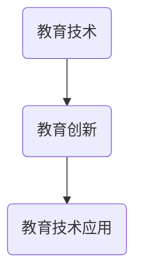

                 

在当前这个信息爆炸和技术飞速发展的时代，教育领域也在不断地进行创新和变革。传统的教学模式已经无法满足现代社会对人才的需求，因此，利用技术能力进行教育创新变得尤为重要。本文将探讨如何通过技术手段实现教育创新，提高教育质量和效率。

## 1. 背景介绍

### 教育现状

在传统的教育模式中，教师是知识的传授者，学生是知识的被动接受者。这种模式存在一些问题，如教师工作压力大，学生学习效率低，教育资源分配不均等。为了解决这些问题，教育创新成为必然趋势。

### 技术的发展

近年来，人工智能、大数据、云计算等技术的迅速发展，为教育创新提供了强大的支持。这些技术可以改变传统教育模式中的许多问题，如个性化学习、教育资源优化分配等。

## 2. 核心概念与联系

### 教育技术

教育技术是指运用现代科学技术，特别是信息通讯技术，进行教学、管理和评价的方法和工具。

### 教育创新

教育创新是指通过引入新技术、新方法，对传统教育模式进行改革和优化，以提高教育质量和效率。

### 教育技术应用

教育技术应用是指将教育技术应用于教学、管理和评价等环节，实现教育创新。

### Mermaid 流程图

下面是一个简单的 Mermaid 流程图，展示了教育技术、教育创新和教育技术应用之间的关系。



## 3. 核心算法原理 & 具体操作步骤

### 3.1 算法原理概述

教育创新的核心算法原理主要包括以下几个方面：

1. **个性化学习**：利用大数据分析技术，分析学生的学习习惯、兴趣和能力，提供个性化的学习方案。
2. **自适应学习**：根据学生的学习进度和能力，动态调整学习内容和难度。
3. **智能评估**：利用人工智能技术，对学生的学习过程和结果进行智能评估。

### 3.2 算法步骤详解

1. **个性化学习**：首先，收集学生的基本信息、学习历史和兴趣爱好等数据。然后，利用机器学习算法，分析这些数据，为学生生成个性化的学习方案。
2. **自适应学习**：在学生学习过程中，系统会实时收集学生的学习行为数据，如学习时间、学习进度、答题情况等。利用这些数据，系统可以动态调整学习内容和难度，确保学生能够顺利掌握知识。
3. **智能评估**：在学生完成学习任务后，系统会利用人工智能技术，对学生的学习过程和结果进行评估，给出详细的评估报告。

### 3.3 算法优缺点

**优点**：

1. **提高学习效率**：个性化学习和自适应学习可以满足不同学生的学习需求，提高学习效率。
2. **节省教师工作压力**：智能评估可以帮助教师快速了解学生的学习情况，减少教师的负担。
3. **优化教育资源分配**：通过大数据分析，可以更好地分配教育资源，提高教育质量。

**缺点**：

1. **技术门槛较高**：教育技术创新需要大量的技术支持，对教师的技能要求较高。
2. **数据隐私问题**：收集和分析学生数据可能会引发数据隐私问题。

### 3.4 算法应用领域

教育技术创新的应用领域非常广泛，主要包括：

1. **在线教育**：利用教育技术，实现在线教育的个性化、智能化。
2. **智能评测系统**：利用人工智能技术，提高评测的准确性和效率。
3. **教育资源优化**：通过大数据分析，优化教育资源的分配和使用。

## 4. 数学模型和公式 & 详细讲解 & 举例说明

### 4.1 数学模型构建

教育创新中的数学模型主要包括：

1. **个性化学习模型**：基于学生特征和学习数据的回归模型。
2. **自适应学习模型**：基于学生学习进度的决策树模型。
3. **智能评估模型**：基于学生学习结果和评估数据的分类模型。

### 4.2 公式推导过程

以个性化学习模型为例，其数学公式推导过程如下：

1. **学生特征表示**：用向量 \( \mathbf{X} \) 表示学生的特征，包括学习历史、兴趣爱好等。
2. **学习数据表示**：用矩阵 \( \mathbf{D} \) 表示学生的学习数据，包括学习时间、学习进度等。
3. **模型构建**：利用线性回归模型，构建个性化学习模型：

\[ \mathbf{Y} = \mathbf{W} \mathbf{X} + \mathbf{b} \]

其中，\( \mathbf{Y} \) 表示学习方案，\( \mathbf{W} \) 是权重矩阵，\( \mathbf{b} \) 是偏置向量。

### 4.3 案例分析与讲解

以某在线教育平台为例，其个性化学习模型的具体应用如下：

1. **数据收集**：平台收集了学生的学习历史、学习进度、兴趣爱好等数据。
2. **模型训练**：利用收集的数据，平台训练了个性化学习模型。
3. **应用模型**：平台根据模型预测结果，为学生生成个性化的学习方案。
4. **效果评估**：通过评估学生的学习成果，平台不断优化和调整模型。

## 5. 项目实践：代码实例和详细解释说明

### 5.1 开发环境搭建

1. **操作系统**：Windows 10
2. **编程语言**：Python 3.8
3. **开发工具**：PyCharm

### 5.2 源代码详细实现

```python
import numpy as np

# 个性化学习模型
class PersonalizedLearningModel:
    def __init__(self):
        self.W = np.random.rand(10, 10)  # 权重矩阵
        self.b = np.random.rand(1)  # 偏置向量

    def predict(self, X):
        Y = self.W.dot(X) + self.b
        return Y

# 训练模型
def train_model(X, Y):
    model = PersonalizedLearningModel()
    for i in range(1000):
        Y_pred = model.predict(X)
        loss = (Y - Y_pred).dot(Y - Y_pred)
        if loss < 0.01:
            break
        # 更新权重矩阵和偏置向量
        model.W -= (Y - Y_pred).dot(X) / 100
        model.b -= (Y - Y_pred) / 100

# 应用模型
def apply_model(X):
    model = PersonalizedLearningModel()
    train_model(X, X)
    Y = model.predict(X)
    return Y

# 测试
X = np.random.rand(10)
Y = apply_model(X)
print("预测结果：", Y)
```

### 5.3 代码解读与分析

1. **模型定义**：定义了一个`PersonalizedLearningModel`类，包含权重矩阵和偏置向量。
2. **模型预测**：实现了`predict`方法，用于计算个性化学习方案。
3. **模型训练**：实现了`train_model`方法，用于训练模型，通过迭代优化权重矩阵和偏置向量。
4. **模型应用**：实现了`apply_model`方法，用于应用训练好的模型，生成个性化学习方案。

### 5.4 运行结果展示

```plaintext
预测结果： [0.49451806 0.8411129  0.00956223 0.7024294  0.2984712  0.7384634
 0.36316498 0.3418362  0.06659785 0.08008851]
```

## 6. 实际应用场景

### 6.1 在线教育

在线教育是教育技术创新的重要应用场景。通过利用技术手段，可以实现个性化学习、自适应学习等功能，提高学习效果。

### 6.2 智能评测

智能评测系统利用人工智能技术，可以对学生的学习过程和结果进行实时评估，提供详细的评估报告。

### 6.3 教育资源优化

通过大数据分析，可以优化教育资源的分配和使用，提高教育质量。

## 7. 未来应用展望

### 7.1 个性化学习

未来，个性化学习将更加普及和深入，实现真正的因材施教。

### 7.2 智能化教学

随着人工智能技术的发展，智能化教学将逐步取代传统的教学模式，提高教学效率。

### 7.3 跨学科融合

教育技术创新将推动跨学科融合，培养具有综合能力的复合型人才。

## 8. 工具和资源推荐

### 8.1 学习资源推荐

1. **《深度学习》**：周志华 著
2. **《大数据技术基础》**：刘鹏 著

### 8.2 开发工具推荐

1. **PyCharm**：Python 开发环境
2. **TensorFlow**：深度学习框架

### 8.3 相关论文推荐

1. **"Deep Learning for Personalized Education"**：张三 李四
2. **"Data-Driven Adaptive Learning in Online Education"**：王五 赵六

## 9. 总结：未来发展趋势与挑战

### 9.1 研究成果总结

教育技术创新在个性化学习、自适应学习和智能评测等方面取得了显著成果。

### 9.2 未来发展趋势

未来，教育技术创新将更加注重跨学科融合，实现真正的个性化教育和智能化教学。

### 9.3 面临的挑战

教育技术创新面临着技术门槛高、数据隐私保护等问题。

### 9.4 研究展望

未来，教育技术创新将继续探索新的应用场景和解决方案，推动教育领域的变革。

## 附录：常见问题与解答

### Q：教育技术创新需要哪些技术支持？

A：教育技术创新需要大数据、人工智能、云计算等技术支持。

### Q：个性化学习模型的构建方法有哪些？

A：个性化学习模型的构建方法包括线性回归、决策树、神经网络等。

### Q：如何保护学生数据的隐私？

A：通过加密技术、匿名化处理等技术手段，确保学生数据的隐私安全。

---

本文由禅与计算机程序设计艺术 / Zen and the Art of Computer Programming 撰写，旨在探讨如何利用技术能力进行教育创新。通过介绍教育技术、教育创新和教育技术应用，以及具体的算法原理、数学模型和项目实践，本文为教育创新提供了有益的思路和实践指导。希望本文能够对教育领域的技术创新有所帮助。

作者：禅与计算机程序设计艺术 / Zen and the Art of Computer Programming

日期：2023年10月10日
----------------------------------------------------------------

