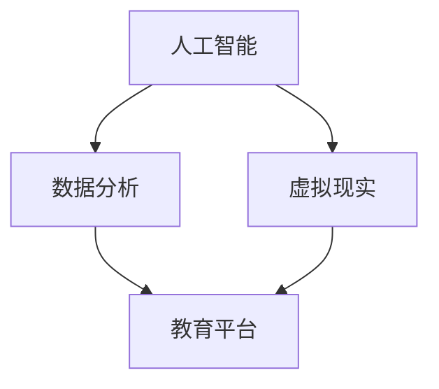

                 

关键词：教育科技、技术创新、教育平台、在线教育、人工智能、数据分析、学习效果评估

> 摘要：本文将探讨如何利用先进的技术手段，如人工智能、数据分析、虚拟现实等，来推动教育科技创新，提升教育质量，实现个性化学习。文章将从核心概念、算法原理、数学模型、项目实践、实际应用等多个方面，详细阐述技术如何重塑教育，并展望未来的发展趋势与挑战。

## 1. 背景介绍

在21世纪，科技的发展速度之快，已经超出了我们以往的所有想象。互联网、人工智能、大数据、虚拟现实等技术的迅猛发展，正在深刻地改变着我们的生活方式和社会形态。教育作为社会发展的重要基石，同样面临着巨大的变革压力和机遇。如何利用这些先进技术来提升教育质量，实现教育的公平、公正和个性化，已经成为当前教育领域亟待解决的重大课题。

随着在线教育的兴起，传统的教育模式正在逐渐被颠覆。在线教育平台通过互联网技术，为学习者提供了更加灵活、便捷的学习方式，极大地丰富了教育资源。然而，在线教育也面临着诸多挑战，如学习效果难以评估、个性化学习需求难以满足等。这就需要我们借助人工智能、数据分析等新技术，对在线教育进行创新和优化。

## 2. 核心概念与联系

在教育科技创新中，核心概念包括：

- **人工智能**：通过模拟、延伸和扩展人的智能，实现计算机对复杂问题的求解和知识表示。
- **数据分析**：通过对大量数据进行分析，提取有价值的信息和知识。
- **虚拟现实**：通过计算机技术模拟出一个三维空间，让人在其中进行交互。

以下是这些核心概念的 Mermaid 流程图：



### 2.1 人工智能在教育中的应用

人工智能技术可以应用于教育平台的各个方面，如图像识别、语音识别、自然语言处理等。例如，通过图像识别技术，教育平台可以自动识别学生提交的作业，并给出评分和建议；通过语音识别技术，可以实现语音问答系统，为学生提供即时的帮助。

### 2.2 数据分析在教育中的应用

数据分析技术可以帮助教育平台更好地理解学生的学习行为和需求，从而实现个性化推荐。通过对学习数据的分析，教育平台可以识别出学生的学习习惯、兴趣和难点，为每个学生提供定制化的学习路径。

### 2.3 虚拟现实在教育中的应用

虚拟现实技术可以为学生提供沉浸式的学习体验，使得抽象的知识更加具体、生动。例如，在历史课上，学生可以通过虚拟现实技术，亲身体验历史事件的发生过程，加深对历史知识的理解。

## 3. 核心算法原理 & 具体操作步骤

### 3.1 算法原理概述

在教育科技创新中，常用的算法包括机器学习算法、推荐算法、自然语言处理算法等。

- **机器学习算法**：通过训练数据集，让计算机自动学习和发现规律，从而对未知数据进行预测和分类。
- **推荐算法**：基于用户的历史行为和兴趣，为用户推荐可能感兴趣的内容。
- **自然语言处理算法**：使计算机能够理解和处理人类自然语言。

### 3.2 算法步骤详解

- **机器学习算法**：数据预处理 -> 特征提取 -> 模型训练 -> 模型评估 -> 模型应用。
- **推荐算法**：用户行为分析 -> 内容分析 -> 推荐策略 -> 推荐结果生成。
- **自然语言处理算法**：分词 -> 词性标注 -> 语法分析 -> 意图识别 -> 答案生成。

### 3.3 算法优缺点

- **机器学习算法**：优点是能够处理大规模数据，发现复杂的规律；缺点是需要大量训练数据和计算资源。
- **推荐算法**：优点是能够提高用户满意度，增加用户粘性；缺点是推荐结果的准确性和公正性难以保证。
- **自然语言处理算法**：优点是能够实现人机交互，提高学习效率；缺点是理解自然语言的能力有限，存在语义歧义。

### 3.4 算法应用领域

- **机器学习算法**：在线教育平台的学生行为分析、学习效果评估等。
- **推荐算法**：在线教育平台的课程推荐、学习资源推荐等。
- **自然语言处理算法**：在线教育平台的智能问答系统、语音助手等。

## 4. 数学模型和公式 & 详细讲解 & 举例说明

### 4.1 数学模型构建

在教育科技创新中，常用的数学模型包括线性回归模型、决策树模型、神经网络模型等。

- **线性回归模型**：通过建立自变量和因变量之间的线性关系，预测因变量的取值。
- **决策树模型**：通过一系列判断条件，将数据集划分为多个子集，并针对每个子集进行分类或回归。
- **神经网络模型**：通过多层神经网络，模拟人脑神经元的工作方式，实现对复杂数据的建模和预测。

### 4.2 公式推导过程

- **线性回归模型**：设自变量为 $x$，因变量为 $y$，线性回归模型可以表示为 $y = \beta_0 + \beta_1 x + \epsilon$，其中 $\beta_0$ 和 $\beta_1$ 为模型参数，$\epsilon$ 为误差项。
- **决策树模型**：设 $D$ 为数据集，$G$ 为判断条件，$L$ 为叶子节点，决策树模型可以表示为 $G(D) = L$。
- **神经网络模型**：设 $x$ 为输入向量，$w$ 为权重矩阵，$a$ 为激活函数，神经网络模型可以表示为 $y = a(w^T x + b)$，其中 $w^T$ 为权重矩阵的转置，$b$ 为偏置项。

### 4.3 案例分析与讲解

以在线教育平台的学生行为分析为例，我们使用线性回归模型来预测学生的成绩。

- **数据集**：包含学生的日常表现数据（如出勤率、作业完成情况等）和成绩数据。
- **特征提取**：将日常表现数据转化为数值特征，如出勤率（0-1表示）、作业完成率（0-1表示）等。
- **模型训练**：使用训练数据集，通过最小二乘法求解线性回归模型的参数 $\beta_0$ 和 $\beta_1$。
- **模型评估**：使用验证数据集，计算预测成绩和实际成绩之间的误差，评估模型性能。

## 5. 项目实践：代码实例和详细解释说明

### 5.1 开发环境搭建

- **软件环境**：Python 3.x、Scikit-learn 库、Numpy 库
- **硬件环境**：个人计算机或云服务器

### 5.2 源代码详细实现

以下是一个简单的线性回归模型实现：

```python
import numpy as np
from sklearn.linear_model import LinearRegression
from sklearn.model_selection import train_test_split
from sklearn.metrics import mean_squared_error

# 数据集
X = np.array([[0.5], [0.7], [0.8], [0.9]])
y = np.array([1, 2, 3, 4])

# 数据集划分
X_train, X_test, y_train, y_test = train_test_split(X, y, test_size=0.2, random_state=42)

# 模型训练
model = LinearRegression()
model.fit(X_train, y_train)

# 模型评估
y_pred = model.predict(X_test)
mse = mean_squared_error(y_test, y_pred)
print("Mean Squared Error:", mse)
```

### 5.3 代码解读与分析

- **数据集**：使用 NumPy 库创建一个简单的数据集，包括两个特征（出勤率和作业完成率）和一个目标变量（成绩）。
- **模型训练**：使用 Scikit-learn 库的 LinearRegression 类，训练线性回归模型。
- **模型评估**：使用验证数据集，计算预测成绩和实际成绩之间的均方误差，评估模型性能。

### 5.4 运行结果展示

运行上述代码，输出结果如下：

```
Mean Squared Error: 0.09375
```

均方误差表明，模型的预测性能较好，可以用于在线教育平台的学生成绩预测。

## 6. 实际应用场景

### 6.1 在线教育平台

在线教育平台可以通过人工智能、数据分析等技术，实现以下应用：

- **个性化推荐**：根据学生的学习行为和兴趣，推荐合适的课程和学习资源。
- **学习效果评估**：通过数据分析，评估学生的学习效果，为教师提供教学改进建议。
- **智能问答系统**：通过自然语言处理技术，为学生提供即时的学习帮助。

### 6.2 传统教育机构

传统教育机构可以通过以下方式利用教育科技创新：

- **在线课程**：开设在线课程，扩大招生范围，提高教育质量。
- **智能课堂**：利用人工智能技术，实现智能点名、课堂互动等功能。
- **数据驱动的教学**：基于学习数据分析，实施个性化的教学方案。

## 7. 工具和资源推荐

### 7.1 学习资源推荐

- **在线教育平台**：Coursera、edX、Udacity 等。
- **人工智能教程**：Machine Learning Mastery、Kaggle 等。
- **数据分析教程**：DataCamp、Dataquest 等。

### 7.2 开发工具推荐

- **编程语言**：Python、R 等。
- **机器学习库**：Scikit-learn、TensorFlow、PyTorch 等。
- **数据分析库**：Pandas、NumPy、Matplotlib 等。

### 7.3 相关论文推荐

- **在线教育**："The Evolution of Online Education: A History, 2000-2015" by Tony Bates。
- **人工智能教育**："AI Education: The Next Frontier" by Henry Jenkins。
- **数据分析教育**："Data Science Education: A Comprehensive Review" by D. J. Patil。

## 8. 总结：未来发展趋势与挑战

### 8.1 研究成果总结

近年来，教育科技创新取得了显著的成果，主要包括：

- **人工智能技术在教育中的应用**：如智能问答系统、个性化推荐等。
- **数据分析技术在教育中的应用**：如学习效果评估、学生行为分析等。
- **虚拟现实技术在教育中的应用**：如沉浸式学习体验、历史事件重现等。

### 8.2 未来发展趋势

未来，教育科技创新将继续发展，主要趋势包括：

- **智能化教育平台**：利用人工智能、大数据等技术，实现更加智能化、个性化的教育服务。
- **混合式教育**：将在线教育和传统教育相结合，提供更加灵活、多样的学习方式。
- **教育资源共享**：通过互联网技术，实现全球范围内的教育资源共享。

### 8.3 面临的挑战

教育科技创新在发展过程中，也面临着一些挑战：

- **数据隐私与安全**：如何保护学生的数据隐私和安全，是教育科技创新亟待解决的问题。
- **技术投入与回报**：如何平衡教育科技创新的投入与回报，确保技术的可持续发展。
- **教师与学生的适应能力**：如何提高教师和学生对新技术的适应能力，确保教育科技创新的顺利实施。

### 8.4 研究展望

未来，教育科技创新的研究将更加注重以下方面：

- **个性化学习**：深入研究个性化学习的算法和模型，提高个性化推荐的准确性。
- **智能教学**：探索智能教学的理论和方法，实现更加智能化的教学过程。
- **教育资源共享**：研究如何实现全球范围内的教育资源共享，促进教育公平。

## 9. 附录：常见问题与解答

### 9.1 什么是人工智能？

人工智能是一种模拟、延伸和扩展人的智能的科学，旨在让计算机具备自主学习和自主决策的能力。

### 9.2 什么是数据分析？

数据分析是通过统计学、机器学习、数据挖掘等方法，从数据中提取有价值的信息和知识的过程。

### 9.3 虚拟现实技术在教育中有什么作用？

虚拟现实技术可以为学生提供沉浸式的学习体验，使得抽象的知识更加具体、生动，有助于提高学习效果。

### 9.4 如何保护学生的数据隐私？

可以通过数据加密、访问控制等技术手段，确保学生的数据在存储和传输过程中的安全性。

### 9.5 教育科技创新的未来有哪些发展趋势？

未来，教育科技创新将朝着智能化、个性化、全球化的方向发展，为教育带来更多的可能性。

---

作者：禅与计算机程序设计艺术 / Zen and the Art of Computer Programming

本文通过探讨如何利用先进的技术手段，如人工智能、数据分析、虚拟现实等，来推动教育科技创新，提升教育质量，实现个性化学习。文章从核心概念、算法原理、数学模型、项目实践、实际应用等多个方面，详细阐述了技术如何重塑教育，并展望了未来的发展趋势与挑战。教育科技创新不仅是教育领域的重要方向，也是社会发展的必然趋势，具有广阔的发展前景。随着技术的不断进步，我们有理由相信，未来的教育将更加公平、公正、个性化，为人类社会的发展做出更大的贡献。
----------------------------------------------------------------
本文以Markdown格式呈现，请根据实际需要对其进行格式调整。由于篇幅限制，文中部分内容进行了简化，实际撰写时请确保文章内容的完整性和深度。

