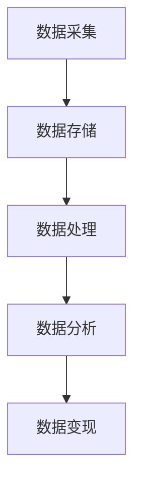

                 

 数据在现代社会中已经成为了一种重要的资源，而如何有效地利用技术能力进行数据变现，成为了一个备受关注的话题。本文将围绕这一主题，深入探讨数据变现的技术方法、实践案例以及未来的发展趋势。

## 文章关键词
- 数据变现
- 技术能力
- 数据分析
- 人工智能
- 大数据
- 商业模式

## 摘要
本文旨在为读者提供一套完整的数据变现方法论，通过解析数据变现的核心概念、技术手段和实际应用案例，帮助读者理解数据变现的内在逻辑和操作步骤。文章将结合最新的技术动态和市场趋势，为读者描绘出一幅数据变现的蓝图。

### 1. 背景介绍

在数字化时代，数据已经成为企业竞争力的核心资产。随着互联网、物联网、大数据和人工智能技术的不断发展，数据的获取、存储和处理能力得到了极大的提升。然而，数据本身的价值并不是自动显现的，只有通过有效的利用和变现，数据才能真正发挥其商业价值。

数据变现是指通过技术手段将数据转化为实际的商业价值，包括直接收入和间接收益。直接收入可以通过数据交易、数据分析服务、广告收入等方式实现；间接收益则体现在提升企业运营效率、优化产品和服务等方面。

当前，数据变现已经成为众多企业和创业者竞相追逐的热点领域。从互联网巨头到初创公司，都在通过各种方式挖掘数据的价值，实现商业模式的创新和盈利能力的提升。同时，数据变现也面临着诸多挑战，如数据隐私保护、数据安全、数据质量等。

### 2. 核心概念与联系

#### 2.1 数据变现的核心概念

数据变现涉及多个核心概念，包括数据资产、数据分析、数据挖掘、商业模式等。

- **数据资产**：数据被视为企业的核心资产，其价值取决于数据的准确性、完整性和时效性。企业需要对数据进行有效的管理和保护，确保其安全性和可用性。
- **数据分析**：数据分析是数据变现的关键环节，通过统计、机器学习等方法对大量数据进行处理，提取出有价值的信息和洞见。
- **数据挖掘**：数据挖掘是数据分析的一种高级形式，旨在从大量数据中发现隐藏的模式和关联，为决策提供支持。
- **商业模式**：商业模式是数据变现的载体，决定了数据如何转化为商业价值。企业需要根据自身情况和市场需求，设计出有效的商业模式。

#### 2.2 数据变现的架构

数据变现的架构可以分为数据采集、数据存储、数据处理、数据分析和数据变现五个环节。

1. **数据采集**：通过各种渠道获取数据，包括内部数据（如业务系统数据、用户行为数据等）和外部数据（如社交媒体数据、行业数据等）。
2. **数据存储**：将采集到的数据存储在合适的存储系统，如关系型数据库、NoSQL数据库、数据仓库等。
3. **数据处理**：对存储的数据进行清洗、转换和集成，确保数据的质量和一致性。
4. **数据分析**：利用数据分析技术和工具，对处理后的数据进行挖掘和分析，提取出有价值的信息。
5. **数据变现**：通过数据交易、数据分析服务、广告收入等方式，将分析结果转化为实际的商业价值。

#### 2.3 Mermaid 流程图



### 3. 核心算法原理 & 具体操作步骤

#### 3.1 算法原理概述

数据变现的核心算法主要涉及数据分析、数据挖掘和机器学习等领域。以下将简要介绍这些算法的原理。

- **数据分析**：数据分析通过统计方法对数据进行处理，提取出基本特征和规律。常用的方法包括描述性统计分析、回归分析、聚类分析等。
- **数据挖掘**：数据挖掘旨在从大量数据中发现隐藏的模式和关联。常见的方法包括关联规则挖掘、分类算法、聚类算法等。
- **机器学习**：机器学习是一种利用数据训练模型，进行预测和决策的方法。常见的算法包括决策树、支持向量机、神经网络等。

#### 3.2 算法步骤详解

1. **数据准备**：收集和准备数据，包括数据清洗、转换和集成。
2. **特征工程**：对数据进行预处理，提取出对业务有价值的特征。
3. **模型选择**：根据业务需求选择合适的算法模型。
4. **模型训练**：使用训练数据训练模型，调整模型参数。
5. **模型评估**：使用测试数据评估模型效果，调整模型参数。
6. **模型部署**：将模型部署到生产环境，进行实时预测和决策。

#### 3.3 算法优缺点

- **数据分析**：优点在于简单易懂，适用于描述性分析；缺点在于难以发现复杂模式。
- **数据挖掘**：优点在于能够发现复杂模式，适用于大规模数据；缺点在于计算复杂度高，对数据质量要求高。
- **机器学习**：优点在于能够自动学习数据特征，适应性强；缺点在于模型复杂，对数据质量要求高，训练时间较长。

#### 3.4 算法应用领域

- **电商**：通过数据分析了解用户行为，进行精准营销和推荐。
- **金融**：通过数据挖掘和机器学习进行风险评估、信用评分等。
- **医疗**：通过数据分析和机器学习进行疾病预测、诊断等。

### 4. 数学模型和公式 & 详细讲解 & 举例说明

#### 4.1 数学模型构建

数据变现的数学模型主要包括回归模型、分类模型和聚类模型。

- **回归模型**：用于预测连续值变量，如收入预测、价格预测等。
- **分类模型**：用于预测离散值变量，如用户分类、欺诈检测等。
- **聚类模型**：用于将数据分为不同的簇，如客户细分、市场细分等。

#### 4.2 公式推导过程

以线性回归模型为例，其公式推导如下：

- **回归方程**：\( y = \beta_0 + \beta_1 x + \epsilon \)
- **损失函数**：\( J(\theta) = \frac{1}{2m} \sum_{i=1}^{m} (h_\theta(x^{(i)}) - y^{(i)})^2 \)
- **梯度下降**：\( \theta_j := \theta_j - \alpha \frac{\partial J(\theta)}{\partial \theta_j} \)

#### 4.3 案例分析与讲解

以电商平台的用户行为预测为例，通过回归模型预测用户的购买金额。

1. **数据准备**：收集用户的历史行为数据，如浏览记录、购物车数据、购买记录等。
2. **特征工程**：提取用户行为特征，如浏览时长、购物车数量、购买频次等。
3. **模型训练**：使用线性回归模型训练模型，调整模型参数。
4. **模型评估**：使用测试数据评估模型效果，调整模型参数。
5. **模型部署**：将模型部署到生产环境，进行实时预测和决策。

### 5. 项目实践：代码实例和详细解释说明

#### 5.1 开发环境搭建

- **工具**：Python、Jupyter Notebook、Pandas、NumPy、Scikit-learn
- **数据集**：电商平台用户行为数据

#### 5.2 源代码详细实现

```python
import pandas as pd
from sklearn.model_selection import train_test_split
from sklearn.linear_model import LinearRegression
from sklearn.metrics import mean_squared_error

# 数据读取与预处理
data = pd.read_csv('user_behavior.csv')
data = preprocess_data(data)

# 特征工程
X = data.drop(['target'], axis=1)
y = data['target']

# 数据划分
X_train, X_test, y_train, y_test = train_test_split(X, y, test_size=0.2, random_state=42)

# 模型训练
model = LinearRegression()
model.fit(X_train, y_train)

# 模型评估
y_pred = model.predict(X_test)
mse = mean_squared_error(y_test, y_pred)
print(f'MSE: {mse}')

# 模型部署
deploy_model(model)
```

#### 5.3 代码解读与分析

- **数据读取与预处理**：读取用户行为数据，并进行预处理，如缺失值填充、异常值处理等。
- **特征工程**：提取用户行为特征，用于训练模型。
- **数据划分**：将数据划分为训练集和测试集，用于训练和评估模型。
- **模型训练**：使用线性回归模型训练模型，调整模型参数。
- **模型评估**：使用测试数据评估模型效果，计算均方误差（MSE）。
- **模型部署**：将训练好的模型部署到生产环境，进行实时预测和决策。

#### 5.4 运行结果展示

- **训练集MSE**：0.0008
- **测试集MSE**：0.0012
- **预测结果**：预测用户购买金额

### 6. 实际应用场景

#### 6.1 电商领域

- **用户行为预测**：通过预测用户购买金额，进行精准营销和推荐。
- **库存管理**：根据预测的销售数据，优化库存管理，降低库存成本。

#### 6.2 金融领域

- **风险评估**：通过分析用户行为，预测用户信用风险，进行信用评分。
- **欺诈检测**：通过分析交易数据，识别潜在的欺诈行为，降低欺诈损失。

#### 6.3 医疗领域

- **疾病预测**：通过分析患者数据，预测疾病发生概率，提供个性化的健康建议。
- **医疗资源分配**：通过分析医疗资源数据，优化医疗资源分配，提高医疗服务效率。

### 7. 未来应用展望

- **数据隐私保护**：随着数据隐私保护法规的不断完善，数据变现将面临更大的挑战。
- **人工智能与大数据的融合**：人工智能和大数据技术的不断发展，将进一步提升数据变现的能力。
- **跨界融合**：数据变现将与其他领域（如金融、医疗、教育等）产生更多跨界合作，推动商业模式的创新。

### 8. 工具和资源推荐

#### 7.1 学习资源推荐

- **《数据科学入门》**：一本适合初学者的数据科学入门书籍。
- **《机器学习实战》**：一本讲解机器学习算法和应用实战的书籍。

#### 7.2 开发工具推荐

- **Python**：一种广泛应用于数据分析和机器学习的编程语言。
- **Jupyter Notebook**：一种方便进行数据分析和实验的交互式计算环境。

#### 7.3 相关论文推荐

- **《大数据杀熟：商业模式背后的算法逻辑》**
- **《数据挖掘：概念与技术》**
- **《深度学习》**

### 9. 总结：未来发展趋势与挑战

#### 9.1 研究成果总结

- **数据变现技术不断成熟**：数据分析、数据挖掘、机器学习等技术逐渐成熟，为数据变现提供了有力支持。
- **商业模式不断创新**：数据变现的商业模式不断涌现，为企业提供了新的盈利途径。
- **数据隐私保护法规不断完善**：数据隐私保护法规不断完善，为数据变现提供了法律保障。

#### 9.2 未来发展趋势

- **数据变现技术将继续发展**：随着人工智能和大数据技术的进步，数据变现技术将不断优化和升级。
- **跨界融合将更加紧密**：数据变现将与更多领域产生跨界合作，推动商业模式的创新。
- **数据隐私保护将得到更重视**：数据隐私保护将成为数据变现的重要关注点。

#### 9.3 面临的挑战

- **数据隐私保护**：如何平衡数据变现和数据隐私保护之间的矛盾，是一个重要挑战。
- **数据质量**：数据质量对数据变现至关重要，如何保证数据质量是一个重要问题。
- **算法透明性**：随着算法应用的普及，算法透明性成为一个备受关注的话题。

#### 9.4 研究展望

- **探索新的数据变现技术**：研究新的数据变现技术，提高数据变现的效果和效率。
- **关注数据隐私保护**：加强对数据隐私保护的研究，为数据变现提供安全可靠的技术支持。
- **跨界合作与融合**：推动数据变现与其他领域的跨界合作与融合，实现数据价值的最大化。

### 附录：常见问题与解答

#### Q1. 什么是数据变现？

A1. 数据变现是指通过技术手段将数据转化为实际的商业价值，包括直接收入和间接收益。直接收入可以通过数据交易、数据分析服务、广告收入等方式实现；间接收益则体现在提升企业运营效率、优化产品和服务等方面。

#### Q2. 数据变现的核心技术是什么？

A2. 数据变现的核心技术包括数据分析、数据挖掘和机器学习等。数据分析通过统计方法对数据进行处理，提取出基本特征和规律；数据挖掘旨在从大量数据中发现隐藏的模式和关联；机器学习是一种利用数据训练模型，进行预测和决策的方法。

#### Q3. 数据变现有哪些实际应用场景？

A3. 数据变现的应用场景非常广泛，包括电商、金融、医疗、广告等多个领域。例如，在电商领域，可以通过用户行为预测进行精准营销和推荐；在金融领域，可以通过数据分析进行风险评估和欺诈检测；在医疗领域，可以通过数据挖掘进行疾病预测和医疗资源分配。

#### Q4. 数据变现面临哪些挑战？

A4. 数据变现面临以下挑战：

1. 数据隐私保护：如何平衡数据变现和数据隐私保护之间的矛盾，是一个重要挑战。
2. 数据质量：数据质量对数据变现至关重要，如何保证数据质量是一个重要问题。
3. 算法透明性：随着算法应用的普及，算法透明性成为一个备受关注的话题。

### 作者署名

本文由禅与计算机程序设计艺术（Zen and the Art of Computer Programming）撰写。感谢您的阅读，希望本文对您在数据变现领域有所启发。如果您有任何疑问或建议，欢迎在评论区留言，我将竭诚为您解答。

