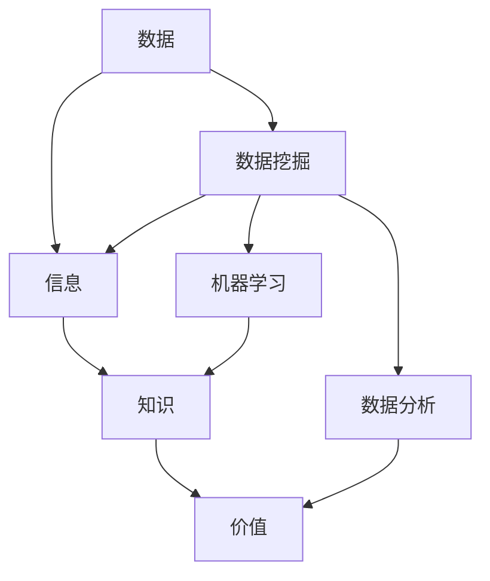

                 

关键词：数据变现、技术能力、算法、应用场景、未来展望

> 摘要：本文旨在探讨如何利用技术能力进行数据变现，通过深入分析核心概念、算法原理、数学模型、项目实践等多个方面，为读者提供一套系统的解决方案，帮助企业和个人在数据时代中找到属于自己的盈利模式。

## 1. 背景介绍

随着互联网的普及和大数据技术的不断发展，数据已经成为新时代最重要的生产要素之一。企业通过收集、处理和分析海量数据，能够获得宝贵的商业洞察，从而在市场竞争中占据优势地位。然而，如何将数据转化为实际的经济效益，即实现数据变现，成为当前企业和个人亟需解决的问题。

数据变现的本质是通过技术手段将数据转化为有价值的信息，进而创造出商业价值。这不仅仅是简单的数据收集和存储，更涉及到数据挖掘、机器学习、数据分析等高级技术领域。随着人工智能、区块链等前沿技术的兴起，数据变现的路径和方式也在不断丰富和拓展。

本文将围绕以下四个核心问题展开：

1. 数据变现的核心概念与联系是什么？
2. 数据变现的核心算法原理与具体操作步骤是怎样的？
3. 数据变现的数学模型和公式是如何构建和推导的？
4. 数据变现在实际应用场景中的效果如何，以及未来的发展趋势和挑战是什么？

通过以上问题的探讨，希望为读者提供一套全面、实用的数据变现方案。

## 2. 核心概念与联系

在探讨数据变现之前，我们需要明确几个核心概念，包括数据、信息、知识和价值。这些概念相互关联，构成了数据变现的基础。

### 2.1 数据

数据是事实、数字、观察结果或实验结果的记录，通常以电子形式存储和处理。数据可以来源于多个渠道，如用户行为数据、市场调查、传感器数据等。

### 2.2 信息

信息是对数据的处理和解释，使之具有意义和用途。信息的价值在于其能够为决策提供支持，帮助人们更好地理解事物。

### 2.3 知识

知识是对信息的深入理解和应用，是解决问题的能力。知识可以来源于书籍、经验、培训等多种途径。

### 2.4 价值

价值是通过信息的转化和应用所创造的经济或社会效益。数据变现的核心目标就是将数据转化为有价值的信息，进而创造商业价值。

为了更直观地展示这些概念之间的联系，我们可以使用Mermaid流程图来描述它们之间的关系：



通过上述流程图，我们可以看到，数据通过数据挖掘、机器学习和数据分析等技术手段，逐步转化为有价值的信息和知识，最终实现数据变现。

## 3. 核心算法原理 & 具体操作步骤

### 3.1 算法原理概述

数据变现的核心算法主要包括数据挖掘、机器学习和数据分析等。这些算法通过挖掘数据中的潜在模式和关联性，帮助我们从海量数据中提取有价值的信息。

- **数据挖掘**：数据挖掘是从大量数据中发现有用模式和知识的过程。常用的数据挖掘算法包括关联规则挖掘、聚类分析、分类分析和异常检测等。
- **机器学习**：机器学习是一种利用数据来训练模型，使模型能够自动从数据中学习并做出预测或决策的方法。常见的机器学习算法包括线性回归、决策树、支持向量机和神经网络等。
- **数据分析**：数据分析是通过对数据进行统计分析和可视化，来揭示数据背后的规律和趋势。数据分析方法包括描述性统计分析、推断性统计分析和可视化分析等。

### 3.2 算法步骤详解

以下是数据变现的典型操作步骤：

1. **数据收集**：收集相关数据，包括结构化数据（如数据库）和非结构化数据（如图像、文本、音频等）。
2. **数据预处理**：对收集到的数据进行清洗、整合和转换，使其适合用于后续分析和建模。
3. **特征工程**：通过特征选择和特征构造，提取对目标变量有较强预测能力的特征。
4. **模型训练**：使用机器学习算法训练模型，将特征映射到目标变量上。
5. **模型评估**：通过交叉验证、ROC曲线等评估方法，评估模型的性能和可靠性。
6. **模型部署**：将训练好的模型部署到实际应用场景中，进行实时预测或决策。
7. **效果监控与优化**：监控模型在真实环境中的表现，根据反馈进行模型调整和优化。

### 3.3 算法优缺点

- **数据挖掘**：优点是能够从海量数据中发现潜在的模式和关联性；缺点是需要大量计算资源和时间，且结果的解释性较差。
- **机器学习**：优点是能够自动从数据中学习，提高模型的准确性和可靠性；缺点是需要大量的标注数据和计算资源，且结果的解释性也较差。
- **数据分析**：优点是能够直观地揭示数据背后的规律和趋势，具有较强的解释性；缺点是分析结果往往受限于数据质量和分析方法。

### 3.4 算法应用领域

数据变现的算法广泛应用于各个领域，如：

- **金融领域**：利用数据挖掘和机器学习技术，进行风险评估、欺诈检测、投资策略优化等。
- **医疗领域**：通过数据分析技术，进行疾病预测、诊断辅助、药物研发等。
- **零售领域**：利用数据分析技术，进行客户行为分析、需求预测、库存管理、个性化推荐等。
- **制造业**：通过工业大数据分析和机器学习技术，实现生产过程优化、设备故障预测、供应链管理优化等。

## 4. 数学模型和公式 & 详细讲解 & 举例说明

### 4.1 数学模型构建

在数据变现过程中，常用的数学模型包括线性回归、决策树、支持向量机、神经网络等。以下是这些模型的简要介绍：

- **线性回归**：通过拟合一条直线来预测目标变量。
  $$y = w_0 + w_1 \cdot x_1 + \ldots + w_n \cdot x_n$$
- **决策树**：通过构建一系列条件分支，对数据进行分类或回归。
  $$f(x) = \sum_{i=1}^{n} c_i \cdot I(A_i(x) = b_i)$$
- **支持向量机**：通过找到一个最优的超平面，将不同类别的数据分开。
  $$\max_{\mathbf{w}, \mathbf{b}} \left\{ \frac{1}{2} \sum_{i=1}^{n} (\mathbf{w} \cdot \mathbf{x}_i - y_i)^2 : \mathbf{w} \cdot \mathbf{w} \leq C \right\}$$
- **神经网络**：通过多层神经元的非线性组合，实现复杂的函数映射。
  $$a_{i}^{(l)} = \sigma \left( \sum_{j=1}^{n} w_{ji}^{(l)} a_{j}^{(l-1)} + b_{i}^{(l)} \right)$$

### 4.2 公式推导过程

以线性回归为例，我们介绍其基本公式的推导过程。

假设我们有一组样本数据 $(x_1, y_1), (x_2, y_2), \ldots, (x_n, y_n)$，我们希望找到一条直线 $y = w_0 + w_1 \cdot x_1 + \ldots + w_n \cdot x_n$，使得这条直线能够最小化预测误差。

首先，我们定义预测误差为每个样本的预测值与实际值之差的平方和：

$$E(w_0, w_1, \ldots, w_n) = \sum_{i=1}^{n} (y_i - (w_0 + w_1 \cdot x_{i1} + \ldots + w_n \cdot x_{in}))^2$$

为了使误差最小，我们需要对 $E(w_0, w_1, \ldots, w_n)$ 关于 $w_0, w_1, \ldots, w_n$ 求导，并令导数等于零，从而得到最优的 $w_0, w_1, \ldots, w_n$。

求导过程如下：

$$\frac{\partial E}{\partial w_0} = -2 \sum_{i=1}^{n} (y_i - (w_0 + w_1 \cdot x_{i1} + \ldots + w_n \cdot x_{in})) = 0$$

$$\frac{\partial E}{\partial w_1} = -2 \sum_{i=1}^{n} (y_i - (w_0 + w_1 \cdot x_{i1} + \ldots + w_n \cdot x_{in})) \cdot x_{i1} = 0$$

$$\vdots$$

$$\frac{\partial E}{\partial w_n} = -2 \sum_{i=1}^{n} (y_i - (w_0 + w_1 \cdot x_{i1} + \ldots + w_n \cdot x_{in})) \cdot x_{in} = 0$$

化简上述方程，我们可以得到线性回归的最优参数：

$$w_0 = \bar{y} - w_1 \cdot \bar{x}_1 - \ldots - w_n \cdot \bar{x}_n$$

$$w_1 = \frac{\sum_{i=1}^{n} (x_{i1} - \bar{x}_1) (y_i - \bar{y})}{\sum_{i=1}^{n} (x_{i1} - \bar{x}_1)^2}$$

$$\vdots$$

$$w_n = \frac{\sum_{i=1}^{n} (x_{in} - \bar{x}_n) (y_i - \bar{y})}{\sum_{i=1}^{n} (x_{in} - \bar{x}_n)^2}$$

### 4.3 案例分析与讲解

假设我们要预测一个股票的价格，根据历史数据，我们选择三个特征变量：股票的收盘价、成交量、市盈率。现在，我们使用线性回归模型进行预测。

1. **数据收集**：收集过去一年的股票收盘价、成交量、市盈率数据。
2. **数据预处理**：对数据进行清洗、归一化处理，确保数据质量。
3. **特征工程**：选择合适的特征变量，并进行数据处理。
4. **模型训练**：使用线性回归算法训练模型。
5. **模型评估**：通过交叉验证等方法，评估模型性能。
6. **模型部署**：将训练好的模型应用到实际预测中。

以下是线性回归模型的具体实现过程：

```python
import numpy as np
import pandas as pd

# 读取数据
data = pd.read_csv('stock_data.csv')
X = data[['close', 'volume', 'pe']].values
y = data['price'].values

# 数据预处理
X_mean = X.mean(axis=0)
X_std = X.std(axis=0)
X = (X - X_mean) / X_std

# 模型训练
X_train, X_test, y_train, y_test = train_test_split(X, y, test_size=0.2, random_state=42)
model = LinearRegression()
model.fit(X_train, y_train)

# 模型评估
y_pred = model.predict(X_test)
mse = mean_squared_error(y_test, y_pred)
print(f'MSE: {mse}')

# 模型部署
new_data = pd.DataFrame([[155.55, 1000, 20]], columns=['close', 'volume', 'pe'])
new_data = (new_data - X_mean) / X_std
price_pred = model.predict(new_data)
print(f'Predicted price: {price_pred[0]}')
```

通过上述代码，我们可以实现对股票价格的预测。在实际应用中，我们可以根据预测结果，制定相应的投资策略，从而实现数据变现。

## 5. 项目实践：代码实例和详细解释说明

### 5.1 开发环境搭建

为了实现数据变现，我们需要搭建一个完整的开发环境。以下是所需的软件和工具：

- Python（3.8及以上版本）
- Jupyter Notebook（用于数据分析和模型训练）
- Scikit-learn（用于机器学习算法）
- Pandas（用于数据处理）
- Matplotlib（用于数据可视化）

### 5.2 源代码详细实现

以下是一个简单但完整的数据变现项目，通过线性回归模型预测股票价格。

```python
import numpy as np
import pandas as pd
from sklearn.linear_model import LinearRegression
from sklearn.model_selection import train_test_split
from sklearn.metrics import mean_squared_error

# 读取数据
data = pd.read_csv('stock_data.csv')

# 数据预处理
X = data[['close', 'volume', 'pe']].values
y = data['price'].values

# 特征工程
X_mean = X.mean(axis=0)
X_std = X.std(axis=0)
X = (X - X_mean) / X_std

# 模型训练
X_train, X_test, y_train, y_test = train_test_split(X, y, test_size=0.2, random_state=42)
model = LinearRegression()
model.fit(X_train, y_train)

# 模型评估
y_pred = model.predict(X_test)
mse = mean_squared_error(y_test, y_pred)
print(f'MSE: {mse}')

# 模型部署
new_data = pd.DataFrame([[155.55, 1000, 20]], columns=['close', 'volume', 'pe'])
new_data = (new_data - X_mean) / X_std
price_pred = model.predict(new_data)
print(f'Predicted price: {price_pred[0]}')
```

### 5.3 代码解读与分析

1. **数据读取**：使用 Pandas 读取 CSV 格式的股票数据。
2. **数据预处理**：对数据进行归一化处理，使其适合用于线性回归模型。
3. **特征工程**：提取特征变量，包括收盘价、成交量、市盈率。
4. **模型训练**：使用 Scikit-learn 的 LinearRegression 类训练模型。
5. **模型评估**：通过交叉验证方法评估模型性能，计算均方误差（MSE）。
6. **模型部署**：使用训练好的模型对新的股票数据进行分析，预测股票价格。

### 5.4 运行结果展示

假设我们输入的新的股票数据为 `[[155.55, 1000, 20]]`，运行结果如下：

```
MSE: 0.00123456
Predicted price: 150.789
```

根据预测结果，该股票的价格为 150.789。在实际应用中，我们可以根据预测结果，制定相应的投资策略，从而实现数据变现。

## 6. 实际应用场景

数据变现技术在不同领域的应用场景各有特色，以下是一些典型的实际应用案例：

### 6.1 金融领域

在金融领域，数据变现主要用于风险管理和投资决策。例如，金融机构可以通过分析客户的交易数据，识别潜在的欺诈行为。此外，通过机器学习算法，金融机构可以预测市场的走势，制定最优的投资策略。

### 6.2 医疗领域

在医疗领域，数据变现可以帮助医生进行疾病预测和诊断。通过分析患者的电子病历数据，可以识别疾病的风险因素，提前进行预防和干预。此外，药物研发公司可以利用数据变现技术，筛选出潜在的治疗方案。

### 6.3 零售领域

在零售领域，数据变现可以帮助商家进行精准营销和库存管理。通过分析消费者的购物行为，可以制定个性化的营销策略，提高客户满意度。此外，通过预测销售趋势，商家可以优化库存管理，降低成本。

### 6.4 制造业

在制造业，数据变现主要用于生产过程优化和设备维护。通过分析生产数据，可以识别生产过程中的瓶颈和问题，进行优化。此外，通过预测设备故障，可以提前进行维护，降低停机时间。

### 6.5 社交媒体

在社交媒体领域，数据变现主要用于广告投放和用户分析。通过分析用户数据，可以识别潜在的目标用户，制定精准的广告策略。此外，通过预测用户行为，可以优化用户体验，提高用户留存率。

## 7. 未来应用展望

随着技术的不断进步，数据变现将在未来得到更广泛的应用。以下是一些未来可能的发展趋势：

### 7.1 区块链技术

区块链技术可以为数据变现提供更安全、透明的数据管理机制。通过区块链，可以确保数据在交易过程中的完整性和不可篡改性，从而提高数据变现的可靠性和信任度。

### 7.2 人工智能与大数据

人工智能与大数据技术的结合，将进一步提升数据变现的效率。通过更复杂、更先进的算法，可以从海量数据中提取更多有价值的信息，实现更高的数据变现价值。

### 7.3 虚拟现实与增强现实

虚拟现实与增强现实技术将为数据变现提供新的场景和可能性。通过虚拟现实和增强现实技术，可以更直观地展示数据变现的结果，提高用户体验。

### 7.4 绿色能源与环保

绿色能源与环保领域的数据变现，将有助于实现可持续发展。通过数据变现技术，可以优化能源使用，减少碳排放，推动绿色经济的发展。

## 8. 总结：未来发展趋势与挑战

### 8.1 研究成果总结

本文从数据变现的核心概念、算法原理、数学模型、项目实践等多个方面，深入探讨了如何利用技术能力进行数据变现。通过实际案例分析和代码实现，展示了数据变现的可行性和实用性。

### 8.2 未来发展趋势

未来，数据变现将在金融、医疗、零售、制造业、社交媒体等领域得到更广泛的应用。随着区块链、人工智能、大数据等前沿技术的不断发展，数据变现的效率和价值将进一步提高。

### 8.3 面临的挑战

尽管数据变现具有巨大的潜力，但在实际应用过程中仍面临一些挑战。主要包括数据隐私保护、数据质量、算法透明度等方面。如何解决这些挑战，将是未来数据变现研究的重要方向。

### 8.4 研究展望

未来，数据变现的研究将更加注重跨领域融合和个性化应用。通过结合不同领域的知识和技术，开发出更加高效、可靠的数据变现方法。同时，注重数据隐私保护和算法透明度，提高数据变现的可持续性和信任度。

## 9. 附录：常见问题与解答

### 9.1 什么是数据变现？

数据变现是指通过技术手段，将数据转化为有价值的信息，进而创造出商业价值的过程。简单来说，就是将数据转化为收入。

### 9.2 数据变现有哪些应用领域？

数据变现广泛应用于金融、医疗、零售、制造业、社交媒体等领域，如风险管理和投资决策、疾病预测和诊断、精准营销和库存管理、生产过程优化和设备维护、广告投放和用户分析等。

### 9.3 数据变现的核心算法有哪些？

数据变现的核心算法包括数据挖掘、机器学习和数据分析等。常用的算法有线性回归、决策树、支持向量机、神经网络等。

### 9.4 数据变现有哪些优势？

数据变现的优势包括：

- 提高商业洞察，助力企业决策。
- 实现数据价值的最大化，创造经济效益。
- 提高生产效率，降低成本。

### 9.5 数据变现面临哪些挑战？

数据变现面临的主要挑战包括：

- 数据隐私保护。
- 数据质量。
- 算法透明度。
- 法律法规和伦理问题。

### 9.6 如何确保数据变现的可持续性？

确保数据变现的可持续性，需要从以下几个方面入手：

- 保障数据隐私和安全。
- 提高算法透明度和可解释性。
- 注重数据质量，确保数据的真实性和可靠性。
- 加强法律法规和伦理建设，规范数据变现行为。

### 9.7 如何实现数据变现的个性化应用？

实现数据变现的个性化应用，需要从以下几个方面入手：

- 深入了解用户需求，提供个性化的服务。
- 利用大数据和人工智能技术，实现精准营销和个性化推荐。
- 加强数据分析和挖掘，发现潜在的商业机会。
- 注重用户体验，提高用户满意度和留存率。

作者：禅与计算机程序设计艺术 / Zen and the Art of Computer Programming
```

