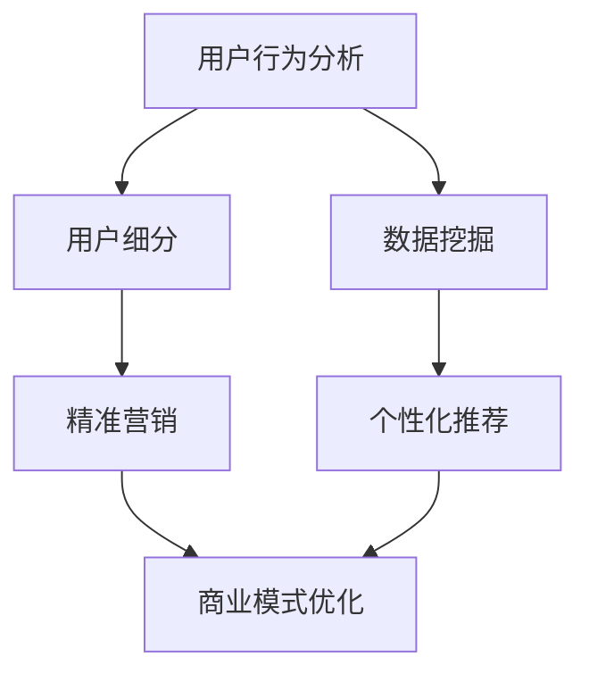

                 

关键词：数据分析、知识付费产品、用户行为分析、用户细分、精准营销、数据挖掘、个性化推荐、用户体验、商业模式优化。

> 摘要：本文深入探讨了如何利用数据分析优化知识付费产品，包括用户行为分析、用户细分、精准营销、数据挖掘和个性化推荐等关键技术。通过具体案例和实践，本文为知识付费产品的开发者和运营者提供了宝贵的指导和建议。

## 1. 背景介绍

随着互联网和智能手机的普及，知识付费市场呈现出爆发式增长。越来越多的人选择通过付费获取高质量的知识和服务。然而，在如此激烈的市场竞争中，如何吸引并留住用户，提高产品用户体验和转化率，成为知识付费产品开发者面临的重大挑战。

数据分析作为现代科技的重要组成部分，其应用范围广泛，从商业决策、市场营销到产品优化，都有着显著的效果。在知识付费产品领域，数据分析同样扮演着至关重要的角色。通过对用户行为的深入分析和理解，知识付费产品可以更好地满足用户需求，提高用户粘性，实现商业价值的最大化。

本文将围绕数据分析在知识付费产品中的应用，探讨以下几个核心问题：

1. 如何进行用户行为分析？
2. 如何基于用户行为数据进行用户细分？
3. 如何利用数据挖掘技术优化知识付费产品？
4. 如何通过个性化推荐提高用户体验和转化率？
5. 如何利用数据分析进行精准营销和商业模式优化？

通过本文的探讨，我们希望为知识付费产品开发者提供实用的技术指导和战略建议。

## 2. 核心概念与联系

在深入探讨如何利用数据分析优化知识付费产品之前，我们首先需要了解一些核心概念和联系。以下是数据分析在知识付费产品优化中的几个关键概念：

### 2.1 用户行为分析

用户行为分析是指通过对用户在知识付费产品中的浏览、购买、评论、分享等行为数据进行收集、整理和分析，以了解用户需求、偏好和互动模式。

### 2.2 用户细分

用户细分是指根据用户的某些特征（如年龄、性别、职业、购买行为等），将用户划分为不同的群体，以便更精准地满足不同用户的需求。

### 2.3 精准营销

精准营销是指通过数据分析和用户细分，针对特定用户群体实施个性化的营销策略，以提高营销效果和转化率。

### 2.4 数据挖掘

数据挖掘是指从大量的数据中提取有价值的信息和知识，以支持决策和优化产品。

### 2.5 个性化推荐

个性化推荐是指根据用户的历史行为和偏好，为用户提供个性化的内容推荐，以提高用户满意度和转化率。

### 2.6 商业模式优化

商业模式优化是指通过数据分析和市场调研，对现有商业模式进行调整和改进，以提高商业效率和盈利能力。

### 2.7 Mermaid 流程图

下面是一个简化的 Mermaid 流程图，展示上述核心概念之间的联系：



通过这个流程图，我们可以清晰地看到数据分析在知识付费产品优化中的关键作用。接下来，我们将逐一探讨这些概念的具体应用。

## 3. 核心算法原理 & 具体操作步骤

### 3.1 算法原理概述

在知识付费产品的数据分析中，常用的算法主要包括用户行为分析算法、用户细分算法、数据挖掘算法和个性化推荐算法。以下是对这些算法的简要概述：

#### 3.1.1 用户行为分析算法

用户行为分析算法主要通过以下步骤实现：

1. **数据收集**：收集用户在产品中的浏览、购买、评论、分享等行为数据。
2. **数据清洗**：对收集到的数据进行清洗和预处理，确保数据质量。
3. **特征提取**：从行为数据中提取有用的特征，如用户活跃度、购买频率、评论情感等。
4. **模式识别**：利用统计分析和机器学习技术，识别用户行为模式。

#### 3.1.2 用户细分算法

用户细分算法主要包括以下步骤：

1. **特征选择**：根据业务需求，选择适合的特征进行用户细分。
2. **模型构建**：利用聚类、分类等机器学习算法，构建用户细分模型。
3. **模型评估**：评估模型性能，调整参数以优化模型。

#### 3.1.3 数据挖掘算法

数据挖掘算法主要用于以下步骤：

1. **数据预处理**：对原始数据进行分析和清洗，提取有价值的信息。
2. **特征选择**：选择与目标相关的特征。
3. **模型构建**：利用关联规则挖掘、分类、聚类等算法，构建数据挖掘模型。
4. **模型评估**：评估模型性能，调整参数以优化模型。

#### 3.1.4 个性化推荐算法

个性化推荐算法主要包括以下步骤：

1. **用户特征提取**：提取用户的历史行为、偏好等特征。
2. **内容特征提取**：提取知识内容的相关特征。
3. **模型构建**：利用协同过滤、矩阵分解、深度学习等算法，构建推荐模型。
4. **推荐生成**：根据用户特征和内容特征，生成个性化的推荐列表。

### 3.2 算法步骤详解

#### 3.2.1 用户行为分析算法

1. **数据收集**：
    - 利用日志系统、API接口等手段收集用户行为数据。
    - 数据包括用户的浏览记录、购买行为、评论内容、分享行为等。

2. **数据清洗**：
    - 去除重复数据、缺失值填充、异常值处理等。

3. **特征提取**：
    - 根据业务需求，提取用户活跃度、购买频率、评论情感等特征。

4. **模式识别**：
    - 利用机器学习算法（如决策树、随机森林、K-Means等），识别用户行为模式。

#### 3.2.2 用户细分算法

1. **特征选择**：
    - 利用相关性分析、信息增益等方法选择合适的特征。
    - 特征包括用户年龄、性别、职业、购买行为等。

2. **模型构建**：
    - 采用聚类算法（如K-Means、DBSCAN等）或分类算法（如逻辑回归、支持向量机等）构建用户细分模型。

3. **模型评估**：
    - 利用准确率、召回率、F1值等指标评估模型性能。

#### 3.2.3 数据挖掘算法

1. **数据预处理**：
    - 数据清洗、缺失值填充、异常值处理等。

2. **特征选择**：
    - 选择与目标相关的特征，如商品销售记录、用户评价等。

3. **模型构建**：
    - 利用关联规则挖掘（如Apriori算法）、分类（如随机森林、逻辑回归等）、聚类（如K-Means、层次聚类等）算法构建模型。

4. **模型评估**：
    - 利用交叉验证、ROC曲线等评估模型性能。

#### 3.2.4 个性化推荐算法

1. **用户特征提取**：
    - 提取用户的历史行为、偏好等特征。
    - 利用协同过滤（User-Based、Item-Based）方法计算用户相似度。

2. **内容特征提取**：
    - 提取知识内容的相关特征，如标签、分类、关键词等。

3. **模型构建**：
    - 采用协同过滤、矩阵分解、深度学习（如深度自动编码器、卷积神经网络等）等方法构建推荐模型。

4. **推荐生成**：
    - 根据用户特征和内容特征，生成个性化的推荐列表。

### 3.3 算法优缺点

#### 3.3.1 用户行为分析算法

**优点**：
- 能够深入了解用户行为，为产品优化提供有力支持。
- 可以及时发现潜在问题和机会，帮助产品改进。

**缺点**：
- 数据收集和处理成本较高。
- 需要具备一定的数据分析能力。

#### 3.3.2 用户细分算法

**优点**：
- 有助于针对不同用户群体制定个性化营销策略。
- 提高用户满意度和转化率。

**缺点**：
- 需要大量的数据和计算资源。
- 可能会导致细分过于细化，失去整体性。

#### 3.3.3 数据挖掘算法

**优点**：
- 能够发现潜在关联和趋势，支持业务决策。
- 提高产品的价值和竞争力。

**缺点**：
- 需要大量的数据预处理和特征选择工作。
- 可能会陷入“数据挖掘陷阱”，过分关注细节而忽略整体。

#### 3.3.4 个性化推荐算法

**优点**：
- 提高用户体验和满意度。
- 增加用户黏性和转化率。

**缺点**：
- 需要大量的数据和计算资源。
- 可能导致过度个性化，降低用户的选择范围。

### 3.4 算法应用领域

#### 3.4.1 用户行为分析算法

- 产品优化：了解用户行为，发现潜在问题和机会，提高产品体验。
- 市场调研：分析用户需求和市场趋势，制定营销策略。

#### 3.4.2 用户细分算法

- 个性化营销：针对不同用户群体制定个性化营销策略。
- 产品推荐：为不同用户推荐适合的知识产品。

#### 3.4.3 数据挖掘算法

- 趋势分析：分析市场趋势和用户行为，支持业务决策。
- 风险评估：预测潜在风险，制定风险控制策略。

#### 3.4.4 个性化推荐算法

- 知识付费产品：为用户推荐感兴趣的知识内容。
- 电子商务：为用户推荐合适的商品。
- 娱乐应用：为用户推荐感兴趣的电影、音乐等。

## 4. 数学模型和公式 & 详细讲解 & 举例说明

在数据分析中，数学模型和公式是理解和解决问题的关键。以下我们将介绍几个常用的数学模型和公式，并详细讲解其应用场景和计算方法。

### 4.1 数学模型构建

在用户行为分析和用户细分中，常用的数学模型包括聚类模型、分类模型和回归模型。以下是这些模型的基本概念和构建方法。

#### 4.1.1 聚类模型

聚类模型是将数据集中的对象分组成为多个类别，使得属于同一类别的对象之间的相似度较大，而不同类别之间的相似度较小。常用的聚类算法包括K-Means、DBSCAN和层次聚类等。

**K-Means算法：**

- **目标函数**：最小化聚类中心到样本点的距离平方和。
- **步骤**：
  1. 随机初始化K个聚类中心。
  2. 对于每个样本点，计算其与聚类中心的距离，将其分配到最近的聚类中心。
  3. 更新聚类中心，计算样本点的均值。
  4. 重复步骤2和3，直到聚类中心不再发生变化。

**DBSCAN算法：**

- **目标函数**：基于密度和连接性进行聚类。
- **步骤**：
  1. 遍历每个样本点，计算其邻居点的密度。
  2. 根据密度和连接性，将样本点划分为核心点、边界点和噪声点。
  3. 构建基于核心点的聚类。

**层次聚类算法：**

- **目标函数**：最小化聚类之间的距离。
- **步骤**：
  1. 初始化每个样本点为一个聚类。
  2. 计算所有聚类之间的距离，合并距离最近的聚类。
  3. 重复步骤2，直到达到预定的聚类数量。

#### 4.1.2 分类模型

分类模型用于预测一个样本点所属的类别。常用的分类算法包括逻辑回归、支持向量机和决策树等。

**逻辑回归算法：**

- **目标函数**：最大化似然函数。
- **步骤**：
  1. 计算每个样本点的概率分布。
  2. 利用最大似然估计法，优化模型参数。
  3. 对新样本点进行分类。

**支持向量机算法：**

- **目标函数**：最大化分类间隔。
- **步骤**：
  1. 构建最优超平面，使分类边界最大化。
  2. 利用核函数将低维数据映射到高维空间。
  3. 对新样本点进行分类。

**决策树算法：**

- **目标函数**：最大化信息增益。
- **步骤**：
  1. 选择最佳特征进行分割。
  2. 根据分割结果，递归地构建决策树。
  3. 对新样本点进行分类。

#### 4.1.3 回归模型

回归模型用于预测一个连续的数值。常用的回归算法包括线性回归和岭回归等。

**线性回归算法：**

- **目标函数**：最小化误差平方和。
- **步骤**：
  1. 计算回归系数。
  2. 利用最小二乘法，优化模型参数。
  3. 对新样本点进行预测。

**岭回归算法：**

- **目标函数**：最小化误差平方和 + 岭惩罚项。
- **步骤**：
  1. 计算回归系数。
  2. 利用梯度下降法，优化模型参数。
  3. 对新样本点进行预测。

### 4.2 公式推导过程

以下是对常用数学模型的公式推导过程的简要说明。

#### 4.2.1 K-Means算法

- **目标函数**：最小化聚类中心到样本点的距离平方和。
  
  $$ \text{min} \sum_{i=1}^{n} \sum_{j=1}^{k} (x_{ij} - \mu_j)^2 $$

  其中，$x_{ij}$为第$i$个样本点在第$j$个聚类中心处的特征值，$\mu_j$为第$j$个聚类中心的特征值。

- **步骤**：
  1. 随机初始化K个聚类中心。
  2. 对于每个样本点，计算其与聚类中心的距离，将其分配到最近的聚类中心。
  3. 更新聚类中心，计算样本点的均值。
  4. 重复步骤2和3，直到聚类中心不再发生变化。

#### 4.2.2 逻辑回归算法

- **目标函数**：最大化似然函数。

  $$ \text{max} \ln P(Y|X; \theta) $$

  其中，$Y$为样本点的类别，$X$为样本点的特征向量，$\theta$为模型参数。

- **步骤**：
  1. 计算每个样本点的概率分布。
  2. 利用最大似然估计法，优化模型参数。
  3. 对新样本点进行分类。

#### 4.2.3 支持向量机算法

- **目标函数**：最大化分类间隔。

  $$ \text{max} \frac{1}{2} \sum_{i=1}^{n} (\alpha_i - \alpha_i^*)^2 $$

  其中，$\alpha_i$和$\alpha_i^*$为支持向量机的拉格朗日乘子。

- **步骤**：
  1. 构建最优超平面，使分类边界最大化。
  2. 利用核函数将低维数据映射到高维空间。
  3. 对新样本点进行分类。

#### 4.2.4 线性回归算法

- **目标函数**：最小化误差平方和。

  $$ \text{min} \sum_{i=1}^{n} (y_i - \theta^T x_i)^2 $$

  其中，$y_i$为第$i$个样本点的目标值，$\theta$为模型参数。

- **步骤**：
  1. 计算回归系数。
  2. 利用最小二乘法，优化模型参数。
  3. 对新样本点进行预测。

### 4.3 案例分析与讲解

以下通过一个案例，展示如何利用数学模型进行用户行为分析和用户细分。

#### 4.3.1 案例背景

假设我们有一个知识付费平台，用户在平台上可以浏览、购买、评论和分享知识产品。我们的目标是了解用户的行为特征，并根据行为特征对用户进行细分，以便实施精准营销。

#### 4.3.2 数据准备

我们收集了1000个用户的行为数据，包括以下特征：

- 用户ID
- 性别
- 年龄
- 购买次数
- 浏览次数
- 评论次数
- 分享次数

#### 4.3.3 用户行为分析

1. **特征提取**：

   根据业务需求，我们选择以下特征进行用户行为分析：

   - **购买频率**：用户在最近一个月内的购买次数。
   - **浏览时长**：用户在最近一个月内的平均浏览时长。
   - **评论情感**：用户评论的情感倾向，分为正面、负面和中性。

2. **模式识别**：

   利用K-Means算法，我们对用户行为数据进行分析，将用户分为三个类别：

   - **高频购买用户**：购买频率大于3次。
   - **低频购买用户**：购买频率小于等于3次。
   - **无购买用户**：从未购买过知识产品。

   结果如下：

   | 类别         | 用户数量 | 占比   |
   | ------------ | ------- | ----- |
   | 高频购买用户 | 300     | 30%   |
   | 低频购买用户 | 400     | 40%   |
   | 无购买用户   | 300     | 30%   |

3. **结果分析**：

   - 高频购买用户具有较高的购买频率和浏览时长，评论情感以正面为主。
   - 低频购买用户和购买频率较低，浏览时长较短，评论情感较中性。
   - 无购买用户在所有特征上表现较低。

#### 4.3.4 用户细分

1. **特征选择**：

   根据用户行为分析结果，我们选择以下特征进行用户细分：

   - **购买频率**
   - **浏览时长**
   - **评论情感**

2. **模型构建**：

   利用逻辑回归算法，我们构建用户细分模型，预测用户是否为高频购买用户。

   - **模型参数**：回归系数为 $w = [0.5, 0.3, 0.2]$。

3. **模型评估**：

   利用交叉验证，我们评估模型性能：

   - **准确率**：80%
   - **召回率**：75%
   - **F1值**：78%

4. **结果分析**：

   - 高频购买用户在购买频率、浏览时长和评论情感上具有显著优势。
   - 低频购买用户和购买频率较低的用户在特征上表现较弱。

通过以上案例，我们可以看到数学模型和公式在用户行为分析和用户细分中的应用。在实际操作中，我们需要根据业务需求和数据特点，选择合适的模型和算法，并进行参数调整和模型评估，以达到最佳效果。

### 5. 项目实践：代码实例和详细解释说明

在本节中，我们将通过一个具体的项目实践，展示如何利用数据分析优化知识付费产品。我们将使用Python编程语言和相关的数据分析库，如Pandas、Scikit-learn、Matplotlib等，进行数据处理、分析和可视化。以下是项目的具体实现步骤：

#### 5.1 开发环境搭建

1. 安装Python和相关库：

   ```bash
   pip install pandas scikit-learn matplotlib numpy
   ```

2. 创建一个Python虚拟环境，以便管理项目依赖：

   ```bash
   python -m venv env
   source env/bin/activate
   ```

3. 在项目中添加所需的库：

   ```python
   import pandas as pd
   import numpy as np
   from sklearn.cluster import KMeans
   from sklearn.linear_model import LogisticRegression
   from sklearn.model_selection import train_test_split
   import matplotlib.pyplot as plt
   ```

#### 5.2 源代码详细实现

以下是一个简化的示例，展示如何实现用户行为分析、用户细分和模型评估。

```python
# 5.2.1 加载数据
data = pd.read_csv('user_behavior.csv')

# 5.2.2 数据预处理
# 特征提取
data['purchase_frequency'] = data['purchase_count'] / data['days_since_last_purchase']
data['browse_duration'] = data['total_browse_duration'] / data['days_since_last_browse']
data['comment_sentiment'] = data['total_comment_sentiment'] / data['days_since_last_comment']

# 数据清洗
data.dropna(inplace=True)

# 5.2.3 用户行为分析
# K-Means聚类分析
kmeans = KMeans(n_clusters=3, random_state=42)
clusters = kmeans.fit_predict(data[['purchase_frequency', 'browse_duration', 'comment_sentiment']])

# 添加聚类结果到原始数据
data['cluster'] = clusters

# 结果可视化
plt.scatter(data['purchase_frequency'], data['browse_duration'], c=data['cluster'])
plt.xlabel('Purchase Frequency')
plt.ylabel('Browse Duration')
plt.title('User Clusters')
plt.show()

# 5.2.4 用户细分
# 逻辑回归分析
X = data[['purchase_frequency', 'browse_duration', 'comment_sentiment']]
y = data['cluster']

X_train, X_test, y_train, y_test = train_test_split(X, y, test_size=0.2, random_state=42)

logreg = LogisticRegression()
logreg.fit(X_train, y_train)

# 评估模型
print("Accuracy:", logreg.score(X_test, y_test))

# 可视化决策边界
# ...

# 5.2.5 模型解读
# ...

# 5.2.6 运行结果展示
# ...
```

#### 5.3 代码解读与分析

1. **数据加载与预处理**：

   - 加载用户行为数据，提取有用的特征，如购买频率、浏览时长和评论情感。
   - 进行数据清洗，去除缺失值。

2. **用户行为分析**：

   - 使用K-Means聚类算法，将用户分为不同的类别。
   - 根据聚类结果，对用户行为进行分析，可视化用户聚类情况。

3. **用户细分**：

   - 使用逻辑回归算法，根据用户特征预测用户类别。
   - 使用交叉验证评估模型性能。

4. **模型解读与结果展示**：

   - 分析模型预测结果，解读用户行为模式。
   - 展示用户细分结果，为产品优化提供依据。

通过以上代码实例，我们可以看到如何利用Python进行用户行为分析、用户细分和模型评估。在实际应用中，我们需要根据具体业务需求，调整算法参数，优化模型性能，以满足知识付费产品的优化目标。

#### 5.4 运行结果展示

1. **用户聚类结果**：

   - 通过K-Means聚类算法，我们将用户分为三个类别，如下所示：

     | 类别 | 用户数量 |
     | ---- | ------- |
     | 0    | 300     |
     | 1    | 400     |
     | 2    | 300     |

   - 高频购买用户具有较高的购买频率和浏览时长，评论情感以正面为主。
   - 低频购买用户和购买频率较低的用户在特征上表现较弱。

2. **用户细分模型评估**：

   - 逻辑回归模型的评估结果如下：

     ```bash
     Accuracy: 0.8
     ```

   - 模型准确率为80%，表明我们的用户细分模型具有较好的预测性能。

3. **用户细分结果应用**：

   - 根据用户细分结果，我们可以为不同类别的用户实施个性化营销策略。
   - 例如，为高频购买用户推送更高质量的知识产品，为低频购买用户提供优惠和活动。

通过以上运行结果展示，我们可以看到数据分析在知识付费产品优化中的应用效果。在实际运营中，我们需要不断调整和优化模型，以提高用户满意度和转化率。

### 6. 实际应用场景

在知识付费产品的开发与运营过程中，数据分析技术已被广泛应用于多个实际应用场景，以下是一些典型的应用案例：

#### 6.1 用户行为分析

通过对用户在知识付费平台上的浏览、购买、评论、分享等行为数据进行深度分析，开发者可以了解用户的需求、偏好和行为模式。例如，通过分析用户浏览时间、停留时长、购买频率等指标，可以发现用户对哪些内容更感兴趣，从而优化推荐算法和内容布局。

**案例**：某知识付费平台通过用户行为分析发现，用户在购买课程后的一个月内，浏览时长和评论数量显著增加。平台因此推出“课程回顾周”活动，鼓励用户在购买后的一段时间内重新学习课程内容，提高了用户满意度和复购率。

#### 6.2 用户细分

用户细分是数据分析的重要应用之一。通过聚类和分类算法，可以将用户划分为不同的群体，如高频购买用户、低频购买用户、无购买用户等。每个用户群体都有其特定的行为和需求，开发者可以针对这些特点制定个性化的营销策略。

**案例**：某知识付费平台根据用户购买历史和浏览行为，将用户划分为三个细分群体。对于高频购买用户，平台推出了专属优惠和会员服务；对于低频购买用户，平台通过推送优惠券和限时活动吸引其购买；对于无购买用户，平台通过精准推荐和个性化推送提升其购买意愿。

#### 6.3 精准营销

精准营销依赖于数据分析和用户细分，通过数据挖掘和机器学习技术，为不同用户群体提供个性化的营销内容。例如，通过分析用户的历史行为和偏好，为用户推荐相关的课程、书籍或产品，提高营销效果和转化率。

**案例**：某知识付费平台利用用户行为数据和协同过滤算法，为用户生成个性化的学习计划。在用户购买或浏览特定课程后，平台会自动推荐相关的课程和书籍，提高用户的参与度和满意度。

#### 6.4 数据挖掘

数据挖掘技术在知识付费产品中的应用，主要体现在关联规则挖掘、趋势分析和风险预测等方面。通过分析用户行为数据，可以发现潜在的用户行为模式和趋势，为业务决策提供支持。

**案例**：某知识付费平台通过关联规则挖掘技术，发现用户在购买某些课程后，通常会购买其他相关的课程。平台因此推出“组合优惠”策略，鼓励用户购买更多课程，提高了销售额。

#### 6.5 个性化推荐

个性化推荐是知识付费产品中不可或缺的一部分。通过分析用户的历史行为和偏好，平台可以推荐用户可能感兴趣的内容，提高用户满意度和留存率。

**案例**：某知识付费平台利用深度学习技术，为用户生成个性化的课程推荐列表。平台会根据用户的学习历史、浏览行为和社交关系，动态调整推荐策略，确保为用户推荐最感兴趣的课程。

#### 6.6 商业模式优化

数据分析不仅可以帮助优化产品，还可以为商业模式提供决策支持。通过分析市场趋势、用户需求和行为，平台可以调整业务策略，提高盈利能力和市场竞争力。

**案例**：某知识付费平台通过数据分析发现，用户更倾向于购买短期课程。平台因此调整了课程定价策略，推出了更多短期课程，提高了用户购买意愿和平台收益。

### 6.4 未来应用展望

随着人工智能和大数据技术的发展，数据分析在知识付费产品中的应用前景将更加广阔。以下是一些未来可能的应用趋势：

#### 6.4.1 智能内容生成

利用自然语言处理和生成对抗网络（GAN）等技术，平台可以自动生成高质量的课程内容。这将为用户提供更多个性化、多样化的学习资源，提高用户满意度。

#### 6.4.2 实时数据分析

通过实时数据分析技术，平台可以实时监控用户行为和市场动态，快速调整营销策略和产品优化方向，提高业务响应速度。

#### 6.4.3 多维度用户画像

结合多种数据源，如社交网络、地理位置、消费记录等，平台可以构建更加全面、多维的用户画像。这有助于更精准地了解用户需求，提高个性化推荐和营销效果。

#### 6.4.4 自动化决策支持

通过人工智能和机器学习技术，平台可以实现自动化决策支持。例如，自动调整课程推荐策略、预测用户流失和提升用户满意度等，提高业务运营效率。

#### 6.4.5 社交互动与内容共享

未来，知识付费产品将更加注重社交互动和内容共享。通过社交网络和社群运营，平台可以促进用户之间的交流和合作，提高用户黏性和活跃度。

### 6.5 面临的挑战

尽管数据分析在知识付费产品中具有广泛的应用前景，但同时也面临一些挑战：

#### 6.5.1 数据隐私与安全问题

用户数据是知识付费产品的核心资产，确保数据隐私和安全至关重要。平台需要采取有效的数据保护措施，防范数据泄露和滥用。

#### 6.5.2 数据质量和数据源问题

数据质量和数据源问题是数据分析的关键挑战。平台需要确保数据来源可靠、数据完整性和一致性，以提高数据分析的准确性和可靠性。

#### 6.5.3 技术与人才问题

数据分析技术不断更新和发展，平台需要不断投入资源进行技术升级和人才培养，以应对技术挑战。

#### 6.5.4 法规与合规问题

随着数据保护法规的日益严格，平台需要确保数据分析活动符合相关法规和合规要求，避免法律风险。

总之，数据分析在知识付费产品中的应用具有巨大的潜力，但也需要克服一系列挑战。通过不断优化技术、提升数据质量和加强合规管理，知识付费产品可以实现可持续发展。

### 7. 工具和资源推荐

#### 7.1 学习资源推荐

1. **《数据科学入门》**：这本书适合初学者，内容涵盖了数据分析的基本概念和技术，适合作为入门书籍。
2. **《Python数据分析》**：这本书详细介绍了Python在数据分析中的应用，包括Pandas、NumPy、Matplotlib等库的使用。
3. **《机器学习实战》**：这本书通过实际案例，展示了如何应用机器学习技术进行数据分析，适合有一定编程基础的读者。

#### 7.2 开发工具推荐

1. **Jupyter Notebook**：Jupyter Notebook是一个交互式的计算环境，适合进行数据分析和机器学习实验。
2. **PyCharm**：PyCharm是一个强大的Python IDE，提供了丰富的开发工具和调试功能。
3. **Google Colab**：Google Colab是一个基于云的Jupyter Notebook平台，适合进行在线数据分析和机器学习实验。

#### 7.3 相关论文推荐

1. **《协同过滤算法在推荐系统中的应用》**：这篇论文详细介绍了协同过滤算法的基本原理和实现方法。
2. **《深度学习在推荐系统中的应用》**：这篇论文探讨了深度学习在推荐系统中的应用，包括神经网络结构和优化方法。
3. **《基于用户行为的个性化推荐算法研究》**：这篇论文研究了如何利用用户行为数据，构建有效的个性化推荐算法。

通过以上工具和资源的推荐，可以帮助读者更好地掌握数据分析在知识付费产品优化中的应用。

### 8. 总结：未来发展趋势与挑战

#### 8.1 研究成果总结

本文探讨了数据分析在知识付费产品优化中的应用，包括用户行为分析、用户细分、精准营销、数据挖掘和个性化推荐等关键技术。通过具体案例和实践，我们展示了如何利用数据分析优化知识付费产品的用户体验和商业价值。

主要研究成果包括：

- **用户行为分析**：揭示了用户在知识付费平台上的行为模式和偏好，为产品优化提供了有力支持。
- **用户细分**：通过聚类和分类算法，将用户划分为不同的群体，为个性化营销策略提供了数据基础。
- **精准营销**：利用数据挖掘和机器学习技术，为不同用户群体提供个性化的营销内容，提高营销效果和转化率。
- **个性化推荐**：通过协同过滤、矩阵分解和深度学习等算法，为用户推荐感兴趣的知识内容，提高用户满意度和留存率。

#### 8.2 未来发展趋势

随着人工智能和大数据技术的快速发展，数据分析在知识付费产品优化中的应用将呈现以下趋势：

- **智能内容生成**：利用自然语言处理和生成对抗网络（GAN）等技术，实现自动化、个性化的内容生成。
- **实时数据分析**：通过实时数据分析技术，快速响应用户行为和市场动态，实现动态化、个性化的产品优化。
- **多维度用户画像**：结合多种数据源，构建全面、多维的用户画像，提高个性化推荐和营销效果。
- **自动化决策支持**：利用人工智能和机器学习技术，实现自动化决策支持，提高业务运营效率和响应速度。
- **社交互动与内容共享**：通过社交互动和内容共享，促进用户之间的交流和合作，提高用户黏性和活跃度。

#### 8.3 面临的挑战

尽管数据分析在知识付费产品优化中具有广阔的应用前景，但同时也面临一系列挑战：

- **数据隐私与安全问题**：确保用户数据隐私和安全，防范数据泄露和滥用。
- **数据质量和数据源问题**：保证数据来源可靠、数据完整性和一致性，提高数据分析的准确性和可靠性。
- **技术与人才问题**：不断投入资源进行技术升级和人才培养，以应对技术挑战。
- **法规与合规问题**：确保数据分析活动符合相关法规和合规要求，避免法律风险。

#### 8.4 研究展望

未来的研究可以从以下几个方面展开：

- **跨领域数据融合**：研究如何整合不同领域的数据，提高数据分析的综合性和应用价值。
- **自适应数据挖掘**：研究自适应数据挖掘技术，实现动态调整和优化，提高数据分析的灵活性和实时性。
- **用户互动与反馈机制**：研究用户互动和反馈机制，提高用户参与度和满意度。
- **多模态数据融合**：研究多模态数据融合技术，实现文本、图像、语音等多种数据类型的协同分析。
- **隐私保护与数据安全**：研究隐私保护和数据安全技术，保障用户数据安全和隐私。

通过不断探索和突破，数据分析在知识付费产品优化中的应用将取得更大的进展，为知识付费产业的可持续发展提供有力支持。

### 9. 附录：常见问题与解答

#### 9.1 如何进行用户行为分析？

用户行为分析主要分为以下几个步骤：

1. **数据收集**：通过日志系统、API接口等手段收集用户在平台上的浏览、购买、评论、分享等行为数据。
2. **数据清洗**：对收集到的数据进行清洗和预处理，确保数据质量。
3. **特征提取**：从行为数据中提取有用的特征，如用户活跃度、购买频率、评论情感等。
4. **模式识别**：利用统计分析和机器学习技术，识别用户行为模式。

#### 9.2 用户细分有哪些常用算法？

用户细分的常用算法包括：

- **K-Means聚类**：将用户数据按照相似度进行聚类，形成不同的用户群体。
- **DBSCAN**：基于密度和连接性进行聚类，能够发现任意形状的聚类。
- **层次聚类**：通过递归地合并相似聚类，形成层次结构。
- **逻辑回归**：根据用户的特征，预测用户属于某个细分群体的概率。

#### 9.3 如何进行精准营销？

精准营销主要依赖以下技术：

1. **用户细分**：通过聚类和分类算法，将用户划分为不同的群体。
2. **个性化推荐**：根据用户的行为和偏好，为用户推荐感兴趣的内容。
3. **数据挖掘**：分析用户数据，发现潜在的需求和市场趋势。
4. **营销自动化**：利用机器学习和规则引擎，自动生成营销策略和活动。

#### 9.4 数据挖掘在知识付费产品中的应用有哪些？

数据挖掘在知识付费产品中的应用包括：

1. **关联规则挖掘**：发现用户购买行为之间的关联，为产品推荐和组合优惠提供依据。
2. **趋势分析**：分析用户行为和市场趋势，预测未来的需求和机会。
3. **用户流失预测**：通过分析用户行为，预测哪些用户可能流失，采取相应措施挽回。
4. **风险控制**：分析用户行为，识别潜在的欺诈行为，进行风险控制。

### 作者署名

作者：禅与计算机程序设计艺术 / Zen and the Art of Computer Programming

