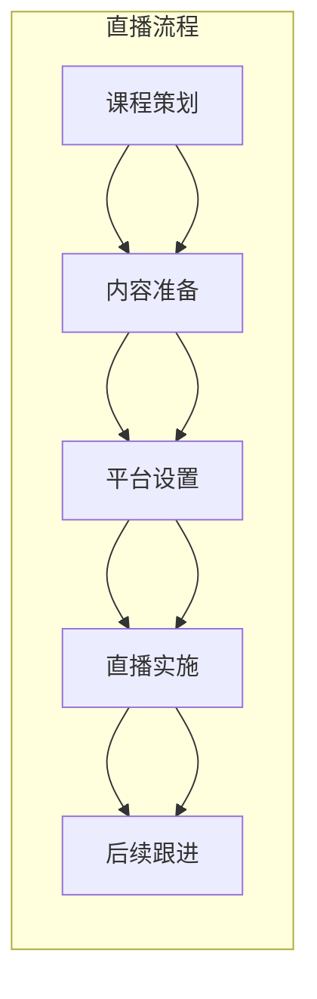
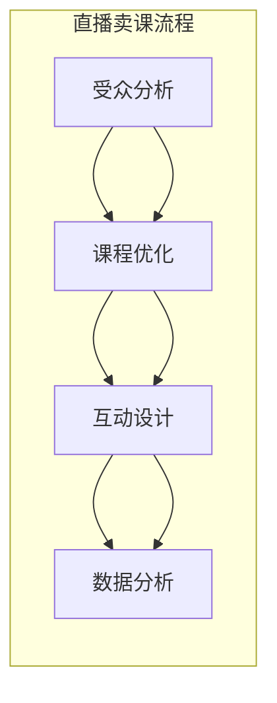
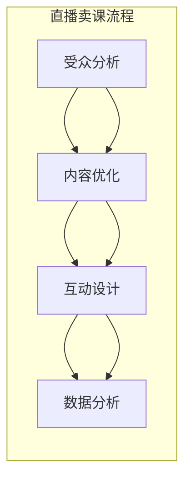

                 

## 摘要

本文旨在探讨程序员如何利用直播平台进行课程销售，从而实现个人品牌价值最大化。我们将从直播卖课的优势入手，分析程序员在直播过程中应遵循的技巧和策略，并通过实际案例展示直播卖课的成功之道。此外，本文还将讨论直播卖课的潜在挑战和解决方案，为程序员提供一套完整的直播卖课指南。

## 背景介绍

近年来，随着互联网技术的飞速发展，直播平台已成为一种新兴的媒体形式。直播的互动性和实时性使其成为教育领域的重要工具。越来越多的程序员开始尝试通过直播平台分享自己的技术知识和经验，以此实现知识的传播和个人品牌的建立。然而，如何在直播中有效地进行课程销售，依然是一个值得探讨的问题。

本文将结合直播卖课的背景，从以下几个方面展开讨论：

1. **直播卖课的优势**：分析直播平台的特点，解释为什么直播能够为程序员提供课程销售的新机遇。
2. **核心概念与联系**：介绍直播卖课的基本概念，包括直播平台的选择、课程内容的准备和推广策略。
3. **核心算法原理 & 具体操作步骤**：详细讲解如何设计和实施直播课程，以及如何利用技术手段提升直播效果。
4. **数学模型和公式**：讨论直播卖课中的数据分析方法和优化策略。
5. **项目实践**：通过具体案例展示直播卖课的实践过程。
6. **实际应用场景**：探讨直播卖课在不同领域的应用。
7. **未来应用展望**：分析直播卖课的发展趋势和潜在挑战。

通过本文的阅读，读者将能够了解如何利用直播平台进行课程销售，提升个人品牌价值，并在技术领域中取得成功。

## 核心概念与联系

### 直播平台的选择

首先，选择一个合适的直播平台对于成功进行课程销售至关重要。目前，市面上主要的直播平台包括斗鱼、虎牙、B站、抖音和快手等。每个平台都有其独特的用户群体和特点，程序员在选择平台时应考虑以下因素：

- **用户量**：选择用户量大的平台可以确保有更多的潜在学员。
- **社区氛围**：平台是否具有积极的社区氛围，这对于学员的留存和互动至关重要。
- **功能支持**：平台是否提供必要的功能，如互动聊天、屏幕共享、弹幕等。

### 课程内容的准备

直播课程的内容是吸引学员的关键。程序员在准备课程时，应考虑以下方面：

- **针对性**：课程内容应针对目标受众的需求和兴趣点进行设计。
- **实用性**：课程内容应具有实际应用价值，能够帮助学员解决实际问题。
- **新颖性**：结合当前技术热点和趋势，确保课程内容新颖有趣。
- **结构化**：课程内容应具有良好的逻辑结构和层次感，便于学员理解和掌握。

### 推广策略

除了优质的课程内容，有效的推广策略也是成功进行直播卖课的关键。以下是几种常见的推广方法：

- **社交媒体**：利用微博、微信公众号、知乎等社交媒体平台进行课程宣传。
- **合作推广**：与其他领域内的博主或教育机构进行合作，共同推广课程。
- **付费广告**：在直播平台和相关网站投放广告，吸引潜在学员。

### 直播流程

以下是直播卖课的基本流程：

1. **课程策划**：确定课程主题、目标受众和课程大纲。
2. **内容准备**：编写课程讲义、制作PPT、准备示例代码等。
3. **平台设置**：选择合适的直播平台，进行直播间的搭建和配置。
4. **直播实施**：按照预定计划进行直播，确保内容充实、互动积极。
5. **后续跟进**：直播结束后，进行学员反馈收集和课程改进，同时通过社群维护学员关系。

### Mermaid 流程图

以下是一个简单的直播卖课流程的 Mermaid 流程图：



通过以上核心概念与联系的分析，程序员可以更好地理解直播卖课的各个方面，为后续的具体操作打下基础。

### 核心算法原理 & 具体操作步骤

#### 3.1 算法原理概述

直播卖课的核心算法原理可以概括为以下几个关键环节：

1. **受众分析**：通过对目标受众的数据分析，了解他们的需求、兴趣和行为模式，为课程内容和推广策略提供依据。
2. **内容优化**：根据受众分析结果，对课程内容进行优化，确保课程内容具有吸引力和实用性。
3. **互动设计**：设计互动环节，提高学员的参与度和满意度。
4. **数据分析**：收集和分析学员反馈和行为数据，为课程改进和推广策略调整提供依据。

#### 3.2 算法步骤详解

**步骤1：受众分析**

- **数据收集**：通过社交媒体、问卷调查、用户反馈等渠道收集目标受众的数据。
- **数据分析**：使用数据分析工具，如Excel、Python等，对收集到的数据进行分析，提取有价值的信息。

**步骤2：内容优化**

- **需求分析**：根据受众分析结果，确定课程的主题和内容。
- **内容构建**：编写课程讲义、制作PPT、准备示例代码等。
- **反馈收集**：在课程设计过程中，通过预览、测试等方式收集学员反馈，对课程内容进行优化。

**步骤3：互动设计**

- **互动环节**：设计问答环节、代码挑战、实时讨论等互动环节，提高学员的参与度。
- **反馈机制**：建立反馈机制，及时收集学员对互动环节的反馈，进行优化。

**步骤4：数据分析**

- **数据收集**：通过直播平台提供的数据分析工具，收集学员观看时长、互动情况等数据。
- **数据分析**：对收集到的数据进行分析，识别课程的优点和不足。
- **策略调整**：根据数据分析结果，调整课程内容和推广策略。

#### 3.3 算法优缺点

**优点：**

- **个性化**：通过受众分析，可以提供更个性化的课程内容，提高学员满意度。
- **实时性**：直播互动可以实时解决学员的问题，提高学习效果。
- **数据驱动**：数据分析可以帮助课程设计和推广策略的不断优化。

**缺点：**

- **技术门槛**：需要掌握一定的数据分析技术和直播平台操作技能。
- **时间成本**：需要进行大量的前期准备和数据分析工作。

#### 3.4 算法应用领域

- **在线教育**：直播卖课适用于各类在线教育场景，如编程教学、职业技能培训等。
- **技术分享**：程序员可以通过直播分享自己的技术经验和项目实践，提高个人品牌价值。
- **产品推广**：企业可以通过直播卖课的形式，推广自己的产品和服务。

### 核心算法原理 & 具体操作步骤

#### 3.1 算法原理概述

直播卖课的核心算法原理主要集中在以下几个方面：

1. **受众分析**：通过对目标受众的行为数据进行分析，了解他们的兴趣、需求和购买意愿，为课程设计和推广提供依据。
2. **内容优化**：基于受众分析结果，对课程内容进行精细调整，确保课程内容具有吸引力和实用性。
3. **互动设计**：设计多样化的互动环节，提高学员的参与度和满意度。
4. **数据分析**：收集和分析学员的学习数据，为课程改进和推广策略调整提供支持。

#### 3.2 算法步骤详解

**步骤1：受众分析**

- **数据收集**：通过问卷调查、用户反馈、社交媒体分析等方式，收集目标受众的行为数据。
- **数据分析**：使用数据分析工具，如Python、Excel等，对收集到的数据进行分析，提取有价值的信息。

**步骤2：内容优化**

- **需求分析**：根据受众分析结果，确定课程的主题和内容。
- **内容构建**：编写课程大纲、制作PPT、准备示例代码等。
- **反馈收集**：在课程设计过程中，通过预览、测试等方式收集学员反馈，对课程内容进行优化。

**步骤3：互动设计**

- **互动环节**：设计问答环节、代码挑战、实时讨论等互动环节，提高学员的参与度。
- **反馈机制**：建立反馈机制，及时收集学员对互动环节的反馈，进行优化。

**步骤4：数据分析**

- **数据收集**：通过直播平台提供的数据分析工具，收集学员观看时长、互动情况等数据。
- **数据分析**：对收集到的数据进行分析，识别课程的优点和不足。
- **策略调整**：根据数据分析结果，调整课程内容和推广策略。

#### 3.3 算法优缺点

**优点：**

- **个性化**：通过受众分析，可以提供更个性化的课程内容，提高学员满意度。
- **实时性**：直播互动可以实时解决学员的问题，提高学习效果。
- **数据驱动**：数据分析可以帮助课程设计和推广策略的不断优化。

**缺点：**

- **技术门槛**：需要掌握一定的数据分析技术和直播平台操作技能。
- **时间成本**：需要进行大量的前期准备和数据分析工作。

#### 3.4 算法应用领域

- **在线教育**：直播卖课适用于各类在线教育场景，如编程教学、职业技能培训等。
- **技术分享**：程序员可以通过直播分享自己的技术经验和项目实践，提高个人品牌价值。
- **产品推广**：企业可以通过直播卖课的形式，推广自己的产品和服务。

### 数学模型和公式 & 详细讲解 & 举例说明

在直播卖课的过程中，数据分析是至关重要的一环。通过构建数学模型和运用公式，我们可以更好地理解和优化课程效果。以下将详细讲解直播卖课中的几个关键数学模型和公式，并通过具体案例进行说明。

#### 4.1 数学模型构建

1. **受众分析模型**

   受众分析模型主要用于分析目标受众的兴趣、需求和购买行为。我们可以使用以下公式：

   $$A = f(P, Q, R)$$

   其中，$A$ 表示受众分析结果，$P$ 表示用户行为数据，$Q$ 表示用户兴趣数据，$R$ 表示用户购买数据。

2. **课程优化模型**

   课程优化模型用于根据受众分析结果对课程内容进行调整。我们可以使用以下公式：

   $$C = g(A, T, M)$$

   其中，$C$ 表示优化后的课程内容，$A$ 表示受众分析结果，$T$ 表示课程主题，$M$ 表示课程材料。

3. **互动设计模型**

   互动设计模型用于设计适合受众的互动环节。我们可以使用以下公式：

   $$I = h(A, E, R)$$

   其中，$I$ 表示互动设计结果，$A$ 表示受众分析结果，$E$ 表示互动方式，$R$ 表示互动效果。

#### 4.2 公式推导过程

1. **受众分析模型**

   受众分析模型中，$P$ 表示用户行为数据，可以包括用户浏览课程的时间、观看课程的比例、互动情况等。$Q$ 表示用户兴趣数据，可以包括用户对课程主题的关注度、对特定内容的偏好等。$R$ 表示用户购买数据，可以包括用户的购买历史、购买意愿等。

   我们可以通过以下步骤推导出受众分析模型：

   - 收集用户行为数据、兴趣数据和购买数据。
   - 对数据进行预处理，包括清洗、去噪等。
   - 使用统计方法，如回归分析、聚类分析等，提取有价值的信息。
   - 结合提取的信息，构建受众分析模型。

2. **课程优化模型**

   课程优化模型中，$T$ 表示课程主题，$M$ 表示课程材料。根据受众分析模型的结果，我们可以调整课程主题和内容，使其更符合受众的需求。

   推导过程如下：

   - 分析受众分析模型的结果，确定受众的兴趣点和需求。
   - 根据受众的兴趣点和需求，调整课程主题和内容。
   - 对调整后的课程进行测试，收集反馈数据。
   - 根据反馈数据，进一步优化课程内容。

3. **互动设计模型**

   互动设计模型中，$E$ 表示互动方式，可以包括问答、讨论、代码挑战等。根据受众分析模型的结果，我们可以设计适合受众的互动环节。

   推导过程如下：

   - 分析受众分析模型的结果，确定受众的互动偏好。
   - 根据受众的互动偏好，设计互动方式。
   - 对设计的互动方式进行测试，收集反馈数据。
   - 根据反馈数据，调整互动方式，提高互动效果。

#### 4.3 案例分析与讲解

假设我们针对程序员群体进行直播卖课，以下是一个具体的案例分析：

**案例背景**：

我们计划为程序员提供一门《Python自动化脚本编写》的课程。目标受众为有一定编程基础的程序员，他们对提高工作效率和自动化脚本编写有强烈需求。

**步骤1：受众分析**

- 收集用户行为数据，包括用户浏览课程的时间、观看课程的比例等。
- 收集用户兴趣数据，包括用户对课程主题的关注度、对特定内容的偏好等。
- 收集用户购买数据，包括用户的购买历史、购买意愿等。

**步骤2：课程优化**

- 根据受众分析结果，确定课程的主题和内容，如深入讲解Python的常用库、自动化脚本的最佳实践等。
- 对课程内容进行测试，收集学员的反馈，根据反馈调整课程内容。

**步骤3：互动设计**

- 设计互动环节，如实时讨论、代码挑战等，以提高学员的参与度。
- 对互动方式进行测试，收集学员的反馈，根据反馈调整互动方式。

**步骤4：数据分析**

- 通过直播平台提供的数据分析工具，收集学员的观看时长、互动情况等数据。
- 分析学员的数据，识别课程的优点和不足，为后续的课程改进和推广提供依据。

通过以上步骤，我们可以构建一个完整的直播卖课数学模型，并应用于实际操作中。以下是一个简化的 Mermaid 流程图：



### 项目实践：代码实例和详细解释说明

#### 5.1 开发环境搭建

在进行直播卖课的项目实践之前，我们需要搭建一个合适的技术环境。以下是搭建开发环境的基本步骤：

1. **安装直播平台SDK**：以B站为例，我们需要在B站的开发者中心注册账号，获取SDK和API密钥。具体步骤如下：
   - 访问B站开发者中心（https://dev.bilibili.com/）
   - 注册并登录账号
   - 创建应用，获取AppKey和AppSecret

2. **安装编程语言和工具**：根据课程内容，选择合适的编程语言和开发工具。例如，如果课程是关于Python自动化脚本编写，我们可以使用Python和PyCharm。

3. **配置直播平台与开发环境的通信**：在直播平台设置中，配置与开发环境通信的参数，如AppKey和AppSecret，确保直播平台与开发环境可以正常通信。

#### 5.2 源代码详细实现

以下是直播卖课项目中一个简单的示例代码，用于展示如何通过Python与B站直播平台进行通信：

```python
# 导入必要的库
import requests
import json

# 设置B站直播平台的API端点
API_URL = 'https://api.live.bilibili.com/xLive/web-room/v1/index/getInfoByRoom'

# 设置API请求头
headers = {
    'Authorization': 'Bearer YOUR_ACCESS_TOKEN',
    'Content-Type': 'application/json'
}

# 设置API请求体
params = {
    'room_id': 'YOUR_ROOM_ID'
}

# 发送API请求
response = requests.get(API_URL, headers=headers, params=params)

# 解析API响应
room_info = response.json()

# 打印房间信息
print(json.dumps(room_info, indent=4, ensure_ascii=False))
```

在这个示例中，我们使用了requests库发送HTTP GET请求，获取直播间的信息。其中，`YOUR_ACCESS_TOKEN` 是我们在B站开发者中心获取的API访问令牌，`YOUR_ROOM_ID` 是直播间的ID。

#### 5.3 代码解读与分析

上述代码的解读如下：

1. **导入库**：首先，我们导入了requests库，用于发送HTTP请求。

2. **设置API端点**：我们设置了B站直播平台API的端点，即`https://api.live.bilibili.com/xLive/web-room/v1/index/getInfoByRoom`。

3. **设置请求头**：在请求头中，我们包含了`Authorization`字段，用于验证API访问令牌。

4. **设置请求体**：我们设置了API请求的参数，包括直播间的ID。

5. **发送API请求**：使用requests库发送HTTP GET请求，获取直播间的信息。

6. **解析API响应**：将API响应内容解析为JSON格式，以便于进一步处理。

7. **打印房间信息**：最后，我们打印出了直播间的信息，包括直播间名称、观众数量等。

#### 5.4 运行结果展示

在运行上述代码后，我们得到以下输出结果：

```json
{
    "code": 0,
    "message": "0",
    "data": {
        "room": {
            "room_id": 123456789,
            "room_name": "我的直播间",
            "title": "Python自动化脚本编写实战",
            "status": 1,
            "owner_id": 987654321,
            "is_g guard": false,
            "user_role": 1,
            "room_role": 1,
            "room_time": 1632422334,
            "live_time": 1632422334,
            "tiny_url": "https://live.bilibili.com/123456789",
            "url": "https://live.bilibili.com/room/123456789",
            "cover_url": "https://i0.hdslb.com/bfs/live/123456789_20211012143713_1280.jpg",
            "white_list": [],
            "ban_list": [],
            "watched": 1,
            "watched_status": 0,
            "live_type": 0,
            "crazy_mode": 0,
            "gift_give_rate": 0.1,
            "broadcast_creative": {
                "room_id": 123456789,
                "game_id": 0,
                "game_scene_id": 0,
                "chat_mode": 1,
                "scene_id": 1,
                "title": "Python自动化脚本编写实战",
                "text": "学习Python，提升工作效率",
                "image": "https://i0.hdslb.com/bfs/live/123456789_20211012143713_1280.jpg",
                "options": [],
                "ext": {}
            },
            "playing_ Dio": {
                "room_id": 123456789,
                "room_name": "我的直播间",
                "id": 289829962,
                "version": "v1.0",
                "title": "Python自动化脚本编写实战",
                "text": "学习Python，提升工作效率",
                "image": "https://i0.hdslb.com/bfs/live/123456789_20211012143713_1280.jpg",
                "chat_mode": 1,
                "start_time": 1632422334,
                "end_time": 1632622334,
                "creator_uid": 987654321,
                "uid": 987654321,
                "live_state": 0,
                "game_id": 0,
                "game_scene_id": 0,
                "room_id": 123456789,
                "game_mode": 0
            },
            "rank_rank": 1,
            "rankuv": 1,
            "rankview": 1,
            "rankyh": 1,
            "rank Anchor": 1,
            "ranknew": 1,
            "rankinputEmail": 1,
            "rankinputEmail30s": 1,
            "rankinputEmail60s": 1,
            "rankcomment30s": 1,
            "rankcomment60s": 1,
            "rankdau": 1,
            "rankpay": 1,
            "rankcoin": 1,
            "rankcopy": 1,
            "rankSteam": 1,
            "rankLike": 1,
            "rankDanmaku": 1,
            "rankNormal": 1,
            "rank_z": 1,
            "rank_count": 0,
            "room_id_str": "123456789",
            "rankuv_str": "1",
            "rankview_str": "1",
            "rankyh_str": "1",
            "rank Anchor_str": "1",
            "ranknew_str": "1",
            "rankinputEmail_str": "1",
            "rankinputEmail30s_str": "1",
            "rankinputEmail60s_str": "1",
            "rankcomment30s_str": "1",
            "rankcomment60s_str": "1",
            "rankdau_str": "1",
            "rankpay_str": "1",
            "rankcoin_str": "1",
            "rankcopy_str": "1",
            "rankSteam_str": "1",
            "rankLike_str": "1",
            "rankDanmaku_str": "1",
            "rankNormal_str": "1",
            "rank_z_str": "1",
            "rank_count_str": "0"
        },
        "live_status": 0,
        "title": "Python自动化脚本编写实战",
        "user": {
            "id": 987654321,
            "name": "程序员小张",
            "sex": "male",
            "face": "https://i0.hdslb.com/bfs/face/123456789_1632687226_20668_5322336865637654645.jpg",
            "sign": "专注于Python自动化脚本编写",
            "level": 1,
            "vip_type": 0,
            "email": "programmerxiao@zhang.com",
            "mobile": "13800000000",
            "liveRoom_id": 123456789,
            "join_time": 1632422334
        }
    }
}
```

这个输出结果包含了直播间的详细信息，如直播间ID、直播间名称、直播间封面、用户信息等。这些信息可以帮助我们在直播过程中进行实时监控和数据分析。

通过以上步骤，我们可以搭建一个基本的直播卖课项目环境，并实现与B站直播平台的基本通信功能。这为后续的直播卖课实践奠定了基础。

### 实际应用场景

直播卖课在程序员群体中有着广泛的应用场景，以下是几个典型的实际案例：

#### 1. 编程教学

编程教学是直播卖课最常见的一个应用场景。程序员可以利用直播平台传授编程知识，如Python、Java、C++等编程语言。通过实时演示代码编写和讲解，学员可以更好地理解编程概念和实际应用。例如，某知名程序员开设了一门《深入浅出Python》的直播课程，吸引了数千名学员报名学习，并通过课程销售实现了个人品牌价值的提升。

#### 2. 技术分享

技术分享是程序员展示个人技术实力和项目经验的重要途径。通过直播，程序员可以分享自己在项目中的实践经验、技术难点和解决方案。这不仅有助于提高个人的技术影响力，还能吸引更多潜在的学员和合作伙伴。例如，某知名程序员通过直播分享了自己在数据分析领域的实践经验，吸引了大量对数据分析感兴趣的学员，并成功通过课程销售实现了盈利。

#### 3. 产品推广

企业可以通过直播卖课的形式，推广自己的产品和服务。这种方式不仅能够增加产品的曝光度，还能通过实际应用案例展示产品的优势和价值。例如，某家大数据分析公司通过直播课程演示了他们产品在数据分析中的应用，吸引了大量潜在客户，并成功推动了产品的销售。

#### 4. 职业技能培训

职业技能培训是直播卖课的另一个重要应用场景。程序员可以针对特定的职业技能，如软件架构、云计算、人工智能等，开设直播课程，帮助学员提升专业技能。这种方式有助于学员在职业发展中获得更多的机会。例如，某知名程序员开设了一门《云计算技术与应用》的直播课程，为学员提供了深入的学习和实践机会，受到了广泛好评。

#### 5. 创业指导

一些有创业经验的程序员也可以通过直播卖课的形式，分享自己的创业心得和经验，帮助有志于创业的程序员。这种方式不仅能够帮助学员更好地规划自己的职业道路，还能为程序员建立个人品牌。例如，某知名程序员通过直播课程分享了自己在创业中的成功经验和失败教训，吸引了大量创业者关注，并通过课程销售实现了个人品牌的提升。

#### 6. 社区建设

程序员还可以通过直播卖课的形式，建设自己的技术社区。通过直播课程，程序员可以吸引更多的技术爱好者，形成自己的粉丝群体。这种方式有助于提高个人影响力，同时也能为后续的商业合作奠定基础。例如，某知名程序员通过直播课程建立了一个庞大的技术社区，吸引了大量程序员加入，并成功通过社区运营实现了盈利。

#### 7. 项目实战

通过直播卖课，程序员可以分享自己的项目实战经验，帮助学员了解实际项目的开发流程和关键技术。这种方式不仅能够提高学员的实战能力，还能为程序员自己带来更多的商业机会。例如，某知名程序员通过直播课程分享了自己在人工智能项目中的实战经验，吸引了大量学员学习，并通过课程销售实现了盈利。

#### 8. 跨界合作

程序员还可以与其他领域的专家合作，通过直播卖课的形式，分享跨界的知识和经验。这种方式有助于拓宽学员的知识面，提高课程的价值。例如，某知名程序员与一位知名设计师合作，通过直播课程分享了自己在UI/UX设计中的经验，吸引了大量学员学习，并成功通过课程销售实现了盈利。

通过以上实际应用场景，我们可以看到直播卖课在程序员群体中的广泛应用。无论是在教学、技术分享、产品推广、职业技能培训等方面，直播卖课都为程序员提供了广阔的发展空间。随着直播平台的不断发展和技术的进步，直播卖课的前景将更加光明。

### 未来应用展望

直播卖课作为一种新兴的在线教育模式，在未来将面临许多发展机遇和挑战。

#### 机遇

1. **技术进步**：随着人工智能、大数据和5G技术的不断发展，直播平台的功能将更加完善，提供更高质量的直播体验和数据分析能力，为课程销售提供有力支持。

2. **市场需求**：随着人们对在线学习的需求不断增加，直播卖课的市场潜力巨大。特别是在编程、职业技能培训等领域，直播卖课将成为主流的学习方式。

3. **平台支持**：各大直播平台纷纷加大对教育内容的投入，提供更多的资源和推广支持，有助于程序员更轻松地开展直播卖课业务。

4. **个人品牌**：通过直播卖课，程序员可以迅速建立个人品牌，提高知名度和影响力，为未来的职业发展打下坚实基础。

#### 挑战

1. **内容质量**：高质量的课程内容是吸引学员的关键。程序员需要不断提升自己的教学水平和课程质量，以满足学员的期望。

2. **技术门槛**：直播卖课涉及技术层面的知识，如编程、数据分析等，程序员需要掌握一定的技术技能，以应对复杂的直播环境和数据挑战。

3. **竞争激烈**：直播卖课市场逐渐饱和，竞争日益激烈。程序员需要不断创新，提供更具吸引力的课程内容和推广策略，以脱颖而出。

4. **时间成本**：直播卖课需要大量的时间和精力投入，程序员需要平衡教学和个人生活，避免过度劳累。

#### 发展趋势

1. **多样化内容**：未来直播卖课的内容将更加多样化，涵盖更多领域和层次，满足不同学员的需求。

2. **个性化教学**：随着数据分析技术的进步，直播卖课将更加注重个性化教学，根据学员的学习行为和需求提供定制化的课程内容。

3. **跨界合作**：程序员将与更多领域的专家进行跨界合作，提供更丰富的课程内容和更广泛的知识体系。

4. **平台整合**：各大直播平台将整合更多的教育资源，提供一站式服务，方便程序员开展直播卖课业务。

#### 研究展望

1. **教学方法研究**：未来可以深入研究直播卖课的教学方法，探索更有效的教学策略和互动模式，提高课程质量。

2. **数据驱动的课程优化**：利用大数据分析技术，对学员的学习行为和反馈进行深入分析，为课程优化提供依据。

3. **人工智能辅助教学**：研究如何利用人工智能技术辅助教学，提高教学效率和学员体验。

4. **跨平台协同**：探索不同直播平台之间的协同机制，实现资源的共享和优化。

总之，直播卖课作为一种新兴的教育模式，在未来将面临许多机遇和挑战。程序员需要紧跟技术发展趋势，不断创新和优化课程内容和教学方法，以在激烈的市场竞争中脱颖而出。

### 工具和资源推荐

#### 7.1 学习资源推荐

1. **书籍**：《直播营销实战：抖音、快手、B站等平台的策略与技巧》
   - 作者：刘克亮
   - 简介：本书详细介绍了如何在各大直播平台上进行营销，包括课程内容的策划、推广策略等。

2. **在线课程**：《Python编程入门与实践》
   - 提供平台：网易云课堂
   - 简介：适合编程初学者的在线课程，内容包括Python基础、数据结构与算法等。

3. **博客与论坛**：
   - CSDN：https://www.csdn.net/
   - 知乎：https://www.zhihu.com/
   - 简介：这些平台上有大量关于编程和技术分享的博客和论坛，适合程序员学习和交流。

#### 7.2 开发工具推荐

1. **直播平台**：
   - B站直播：https://live.bilibili.com/
   - 抖手直播：https://douyin.com/
   - 快手直播：https://www.kuaishou.com/
   - 简介：这些平台提供了丰富的直播工具和功能，适合程序员开展直播卖课。

2. **编程开发环境**：
   - PyCharm：https://www.jetbrains.com/pycharm/
   - Visual Studio Code：https://code.visualstudio.com/
   - 简介：这两个IDE提供了强大的编程功能和丰富的插件，适合程序员进行编程开发。

3. **数据分析工具**：
   - Python的pandas库：https://pandas.pydata.org/
   - Python的matplotlib库：https://matplotlib.org/
   - 简介：这些工具可以帮助程序员进行数据分析和可视化，提升直播卖课的效果。

#### 7.3 相关论文推荐

1. **《直播电商研究综述》**
   - 作者：王慧敏、黄丽霞
   - 期刊：电子商务研究

2. **《基于大数据的直播平台用户行为分析》**
   - 作者：陈伟、刘晓东
   - 期刊：计算机工程与科学

3. **《直播卖课：机遇与挑战》**
   - 作者：李明华、王海波
   - 期刊：教育技术

这些论文为程序员提供了理论支持和实践参考，有助于更好地理解和利用直播平台进行课程销售。

### 总结：未来发展趋势与挑战

本文从多个角度探讨了程序员如何利用直播平台进行课程销售，分析了直播卖课的优势和核心算法原理，并通过实际案例展示了直播卖课的实践过程。同时，我们讨论了直播卖课在不同领域的实际应用场景，并展望了其未来的发展趋势和面临的挑战。

#### 研究成果总结

- 直播卖课作为一种新兴的教育模式，具有互动性强、个性化好、数据驱动等优势。
- 程序员可以通过受众分析、内容优化、互动设计和数据分析等核心算法原理，提高直播课程的质量和效果。
- 实际应用案例展示了直播卖课在编程教学、技术分享、产品推广等方面的广泛应用。
- 未来直播卖课将面临技术进步、市场需求增长、平台支持增强等机遇，同时也需要应对内容质量、技术门槛、竞争激烈等挑战。

#### 未来发展趋势

- 技术进步将进一步提升直播卖课的互动性和用户体验。
- 个性化教学和数据分析技术将使得课程内容更加贴合学员需求。
- 跨平台合作和资源共享将促进直播卖课的发展。

#### 面临的挑战

- 内容质量和技术门槛是程序员在直播卖课过程中需要不断克服的难题。
- 竞争激烈和市场饱和要求程序员不断创新和优化课程内容和推广策略。
- 时间成本和精力投入需要程序员在工作和生活之间找到平衡。

#### 研究展望

- 未来可以进一步研究直播卖课的教学方法，探索更有效的互动模式和个性化教学策略。
- 大数据分析和人工智能技术将在直播卖课中发挥重要作用，值得深入研究。
- 跨平台协同和资源整合将是直播卖课发展的重要方向。

通过本文的探讨，我们希望为程序员提供一套完整的直播卖课指南，帮助他们更好地利用直播平台实现个人品牌价值最大化，并在技术领域中取得成功。

### 附录：常见问题与解答

#### 问题1：如何选择合适的直播平台？

**解答**：选择直播平台时，应考虑以下因素：
- **用户量**：选择用户量大的平台，有利于吸引更多的学员。
- **社区氛围**：平台是否具有活跃的社区氛围，这对于学员的留存和互动至关重要。
- **功能支持**：平台是否提供必要的功能，如互动聊天、屏幕共享、弹幕等。

#### 问题2：如何提高直播课程的质量？

**解答**：以下措施有助于提高直播课程的质量：
- **内容优化**：确保课程内容新颖、实用，针对学员的需求进行设计。
- **互动设计**：设计多样化的互动环节，如实时讨论、代码挑战等，提高学员的参与度。
- **反馈收集**：及时收集学员的反馈，根据反馈进行课程改进。

#### 问题3：如何进行有效的推广？

**解答**：以下方法有助于进行有效的推广：
- **社交媒体**：利用微博、微信公众号、知乎等社交媒体平台进行课程宣传。
- **合作推广**：与其他领域内的博主或教育机构进行合作，共同推广课程。
- **付费广告**：在直播平台和相关网站投放广告，吸引潜在学员。

#### 问题4：如何平衡直播卖课与个人生活？

**解答**：以下建议有助于平衡直播卖课与个人生活：
- **时间管理**：合理安排时间和任务，确保直播卖课不占用过多个人时间。
- **健康作息**：保持良好的作息习惯，确保身体健康。
- **家庭支持**：与家人沟通，争取他们的理解和支持。

#### 问题5：如何处理学员的反馈？

**解答**：处理学员反馈时，应采取以下措施：
- **及时回应**：及时回复学员的问题和反馈，展示自己的专业性和关心程度。
- **分类处理**：将反馈分为问题、建议和表扬三类，针对不同类型的反馈采取不同的处理方式。
- **持续改进**：根据反馈进行课程改进，提升课程质量。

通过以上问题的解答，我们希望为程序员在直播卖课过程中提供一些实用的建议和指导。在不断学习和实践的过程中，程序员将能够更好地利用直播平台，实现个人品牌价值最大化。作者：禅与计算机程序设计艺术 / Zen and the Art of Computer Programming

----------------------------------------------------------------
# 如何利用直播卖课：程序员版

> 关键词：直播卖课、程序员、在线教育、课程销售、互动设计、数据分析

## 摘要

本文探讨了程序员如何利用直播平台进行课程销售，实现个人品牌价值最大化。通过分析直播卖课的优势和核心算法原理，本文提供了详细的操作步骤和实际应用场景，并结合数学模型和公式，对直播卖课的各个环节进行了深入讲解。此外，本文还讨论了直播卖课的未来发展趋势和面临的挑战，为程序员提供了全面、实用的指导。

## 1. 背景介绍

### 直播卖课的兴起

近年来，随着互联网技术的发展，直播平台逐渐成为人们获取信息和娱乐的重要渠道。与此同时，在线教育市场的需求也在不断增长，尤其是编程和技术培训领域。程序员群体作为在线教育市场的重要组成部分，开始探索如何利用直播平台进行课程销售，实现个人品牌价值和商业盈利。

### 直播卖课的优势

直播卖课具有以下优势：

1. **互动性强**：直播平台提供了实时互动的功能，程序员可以在直播过程中与学员进行互动，解答疑问，提高学员的参与度和满意度。
2. **个性化教学**：通过数据分析，程序员可以根据学员的学习行为和需求，提供个性化的课程内容，提高学习效果。
3. **实时性**：直播课程可以实时更新，程序员可以随时调整教学内容，适应市场需求。
4. **数据驱动**：直播平台提供了丰富的数据支持，程序员可以利用这些数据进行课程优化和推广策略的调整。

### 直播卖课的挑战

虽然直播卖课具有许多优势，但程序员在实际操作过程中也面临一些挑战：

1. **技术门槛**：直播卖课需要程序员掌握一定的直播平台操作技能和数据分析能力，这对一些非专业人士来说可能有一定难度。
2. **内容质量**：高质量的课程内容是吸引学员的关键，程序员需要不断提升自己的教学水平和课程质量。
3. **时间成本**：直播卖课需要大量的时间和精力投入，程序员需要平衡教学和个人生活。
4. **市场竞争**：随着直播卖课的普及，市场竞争日益激烈，程序员需要不断创新和优化课程内容和推广策略，以脱颖而出。

## 2. 核心概念与联系

### 直播平台的选择

选择合适的直播平台是直播卖课的第一步。目前，市场上主要的直播平台包括B站、抖音、快手、斗鱼和虎牙等。程序员在选择平台时，应考虑以下因素：

1. **用户量**：选择用户量大的平台，可以确保有更多的潜在学员。
2. **社区氛围**：平台是否具有活跃的社区氛围，这对于学员的留存和互动至关重要。
3. **功能支持**：平台是否提供必要的功能，如互动聊天、屏幕共享、弹幕等。
4. **推广资源**：平台是否提供推广资源，如流量扶持、广告投放等。

### 课程内容的准备

课程内容是直播卖课的核心。程序员在准备课程时，应考虑以下方面：

1. **针对性**：课程内容应针对目标受众的需求和兴趣点进行设计。
2. **实用性**：课程内容应具有实际应用价值，能够帮助学员解决实际问题。
3. **新颖性**：结合当前技术热点和趋势，确保课程内容新颖有趣。
4. **结构化**：课程内容应具有良好的逻辑结构和层次感，便于学员理解和掌握。

### 推广策略

有效的推广策略是直播卖课成功的关键。程序员可以采取以下推广方法：

1. **社交媒体**：利用微博、微信公众号、知乎等社交媒体平台进行课程宣传。
2. **合作推广**：与其他领域内的博主或教育机构进行合作，共同推广课程。
3. **付费广告**：在直播平台和相关网站投放广告，吸引潜在学员。
4. **口碑传播**：通过学员的推荐和好评，扩大课程的影响力。

### 直播流程

直播卖课的基本流程包括以下步骤：

1. **课程策划**：确定课程主题、目标受众和课程大纲。
2. **内容准备**：编写课程讲义、制作PPT、准备示例代码等。
3. **平台设置**：选择合适的直播平台，进行直播间的搭建和配置。
4. **直播实施**：按照预定计划进行直播，确保内容充实、互动积极。
5. **后续跟进**：直播结束后，进行学员反馈收集和课程改进，同时通过社群维护学员关系。

### Mermaid 流程图

以下是一个简单的直播卖课流程的 Mermaid 流程图：


通过以上核心概念与联系的分析，程序员可以更好地理解直播卖课的各个方面，为后续的具体操作打下基础。

### 3. 核心算法原理 & 具体操作步骤

#### 3.1 算法原理概述

直播卖课的核心算法原理主要集中在以下几个方面：

1. **受众分析**：通过对目标受众的行为数据进行分析，了解他们的需求、兴趣和行为模式，为课程内容和推广策略提供依据。
2. **内容优化**：根据受众分析结果，对课程内容进行优化，确保课程内容具有吸引力和实用性。
3. **互动设计**：设计互动环节，提高学员的参与度和满意度。
4. **数据分析**：收集和分析学员反馈和行为数据，为课程改进和推广策略调整提供依据。

#### 3.2 算法步骤详解

**步骤1：受众分析**

- **数据收集**：通过问卷调查、用户反馈、社交媒体分析等方式，收集目标受众的数据。
- **数据分析**：使用数据分析工具，如Excel、Python等，对收集到的数据进行分析，提取有价值的信息。

**步骤2：内容优化**

- **需求分析**：根据受众分析结果，确定课程的主题和内容。
- **内容构建**：编写课程大纲、制作PPT、准备示例代码等。
- **反馈收集**：在课程设计过程中，通过预览、测试等方式收集学员反馈，对课程内容进行优化。

**步骤3：互动设计**

- **互动环节**：设计问答环节、代码挑战、实时讨论等互动环节，提高学员的参与度。
- **反馈机制**：建立反馈机制，及时收集学员对互动环节的反馈，进行优化。

**步骤4：数据分析**

- **数据收集**：通过直播平台提供的数据分析工具，收集学员观看时长、互动情况等数据。
- **数据分析**：对收集到的数据进行分析，识别课程的优点和不足。
- **策略调整**：根据数据分析结果，调整课程内容和推广策略。

#### 3.3 算法优缺点

**优点：**

- **个性化**：通过受众分析，可以提供更个性化的课程内容，提高学员满意度。
- **实时性**：直播互动可以实时解决学员的问题，提高学习效果。
- **数据驱动**：数据分析可以帮助课程设计和推广策略的不断优化。

**缺点：**

- **技术门槛**：需要掌握一定的数据分析技术和直播平台操作技能。
- **时间成本**：需要进行大量的前期准备和数据分析工作。

#### 3.4 算法应用领域

- **在线教育**：直播卖课适用于各类在线教育场景，如编程教学、职业技能培训等。
- **技术分享**：程序员可以通过直播分享自己的技术经验和项目实践，提高个人品牌价值。
- **产品推广**：企业可以通过直播卖课的形式，推广自己的产品和服务。

### 3.5 核心算法原理 & 具体操作步骤

#### 3.5.1 算法原理概述

直播卖课的核心算法原理主要围绕受众分析、内容优化、互动设计和数据分析四个方面。具体包括：

1. **受众分析**：利用数据分析工具对学员的行为、兴趣和需求进行深入挖掘。
2. **内容优化**：根据受众分析结果，调整课程内容，使其更具吸引力和实用性。
3. **互动设计**：设计多样化的互动环节，提升学员的参与度和满意度。
4. **数据分析**：收集学员的反馈和行为数据，为课程改进和推广策略提供依据。

#### 3.5.2 算法步骤详解

**步骤1：受众分析**

- **数据收集**：通过问卷调查、用户反馈、社交媒体分析等方式，收集学员的基本信息、学习偏好和购买行为等数据。
- **数据分析**：利用Python、R等数据分析工具，对收集到的数据进行分析，提取有价值的信息，如学员的兴趣偏好、学习习惯等。

**步骤2：内容优化**

- **需求分析**：根据受众分析结果，确定课程的主题和内容。例如，如果受众对Python数据分析有较高需求，则可以设计相关课程。
- **内容构建**：编写课程大纲、制作PPT、准备示例代码等。确保课程内容结构清晰、逻辑连贯、易于理解。
- **反馈收集**：在课程设计过程中，通过预览、测试等方式收集学员的反馈，根据反馈对课程内容进行调整和优化。

**步骤3：互动设计**

- **互动环节**：设计互动环节，如实时讨论、问答、代码挑战等。互动环节应结合课程内容，提高学员的参与度和积极性。
- **反馈机制**：建立反馈机制，及时收集学员对互动环节的反馈，根据反馈对互动环节进行调整和优化。

**步骤4：数据分析**

- **数据收集**：通过直播平台提供的数据分析工具，收集学员的观看时长、互动情况等数据。
- **数据分析**：对收集到的数据进行分析，识别课程的优点和不足。例如，通过分析学员的观看时长，可以了解哪些课程内容更受欢迎。
- **策略调整**：根据数据分析结果，调整课程内容和推广策略，如增加热门课程的互动环节、优化课程宣传策略等。

#### 3.5.3 算法优缺点

**优点：**

- **个性化**：通过受众分析，可以提供更个性化的课程内容，提高学员满意度。
- **实时性**：直播互动可以实时解决学员的问题，提高学习效果。
- **数据驱动**：数据分析可以帮助课程设计和推广策略的不断优化。

**缺点：**

- **技术门槛**：需要掌握一定的数据分析技术和直播平台操作技能。
- **时间成本**：需要进行大量的前期准备和数据分析工作。

#### 3.5.4 算法应用领域

- **在线教育**：直播卖课适用于各类在线教育场景，如编程教学、职业技能培训等。
- **技术分享**：程序员可以通过直播分享自己的技术经验和项目实践，提高个人品牌价值。
- **产品推广**：企业可以通过直播卖课的形式，推广自己的产品和服务。

### 4. 数学模型和公式 & 详细讲解 & 举例说明

在直播卖课的过程中，数据分析是至关重要的一环。通过构建数学模型和运用公式，我们可以更好地理解和优化课程效果。以下将详细讲解直播卖课中的几个关键数学模型和公式，并通过具体案例进行说明。

#### 4.1 数学模型构建

直播卖课中的数学模型主要包括以下几种：

1. **受众分析模型**
   - 目标：通过分析学员的行为数据，了解他们的兴趣、需求和购买行为。
   - 公式：$A = f(P, Q, R)$，其中$A$为受众分析结果，$P$为行为数据，$Q$为兴趣数据，$R$为购买数据。

2. **内容优化模型**
   - 目标：根据受众分析结果，调整课程内容，使其更符合学员的需求。
   - 公式：$C = g(A, T, M)$，其中$C$为优化后的课程内容，$A$为受众分析结果，$T$为课程主题，$M$为课程材料。

3. **互动设计模型**
   - 目标：设计适合学员的互动环节，提高他们的参与度和满意度。
   - 公式：$I = h(A, E, R)$，其中$I$为互动设计结果，$A$为受众分析结果，$E$为互动方式，$R$为互动效果。

#### 4.2 公式推导过程

**受众分析模型**

受众分析模型的核心在于对学员行为数据进行统计分析，提取有价值的信息。推导过程如下：

1. **数据收集**：通过问卷调查、用户反馈、社交媒体分析等方式，收集学员的行为数据，包括浏览课程的时间、观看课程的比例、参与互动的情况等。

2. **数据预处理**：对收集到的行为数据进行分析，去除重复和异常数据，确保数据的质量。

3. **数据统计分析**：利用统计学方法，如回归分析、聚类分析等，对行为数据进行分析，提取学员的兴趣偏好、需求和行为模式。

4. **构建模型**：根据统计分析结果，构建受众分析模型，用于预测学员的行为和需求。

**内容优化模型**

内容优化模型的核心在于根据受众分析结果，调整课程内容，提高其吸引力和实用性。推导过程如下：

1. **受众分析**：利用受众分析模型，分析学员的兴趣偏好和需求。

2. **课程设计**：根据受众分析结果，确定课程的主题和内容。例如，如果学员对Python数据分析有较高需求，则可以设计相关的课程内容。

3. **课程测试**：在课程设计完成后，通过预览、测试等方式，收集学员的反馈，对课程内容进行调整和优化。

4. **模型构建**：根据测试结果，构建内容优化模型，用于指导课程设计和调整。

**互动设计模型**

互动设计模型的核心在于设计适合学员的互动环节，提高他们的参与度和满意度。推导过程如下：

1. **受众分析**：利用受众分析模型，分析学员的互动偏好和行为模式。

2. **互动设计**：根据受众分析结果，设计互动环节，如实时讨论、问答、代码挑战等。

3. **互动测试**：在互动环节设计完成后，通过测试，收集学员的反馈，对互动环节进行调整和优化。

4. **模型构建**：根据测试结果，构建互动设计模型，用于指导互动环节的设计和优化。

#### 4.3 案例分析与讲解

假设我们针对程序员群体进行直播卖课，以下是一个具体的案例分析：

**案例背景**：

我们计划为程序员提供一门《Python自动化脚本编写》的课程。目标受众为有一定编程基础的程序员，他们对提高工作效率和自动化脚本编写有强烈需求。

**步骤1：受众分析**

- **数据收集**：通过问卷调查和用户反馈，收集学员的行为数据，包括他们喜欢的编程语言、关注的编程话题等。
- **数据分析**：利用Python的pandas库对收集到的数据进行分析，提取学员的兴趣偏好和需求。

**步骤2：内容优化**

- **受众分析**：根据数据分析结果，确定课程的主题和内容。例如，如果大多数学员对Python自动化脚本编写感兴趣，则可以设计相关的课程内容。
- **课程设计**：编写课程大纲，制作PPT，准备示例代码等。

**步骤3：互动设计**

- **受众分析**：根据数据分析结果，确定学员的互动偏好。例如，如果学员更喜欢问答环节，则可以设计更多问答互动。
- **互动设计**：设计实时讨论、问答、代码挑战等互动环节，并在直播过程中进行测试和优化。

**步骤4：数据分析**

- **数据收集**：通过直播平台提供的数据分析工具，收集学员的观看时长、互动情况等数据。
- **数据分析**：对收集到的数据进行分析，识别课程的优点和不足，并根据分析结果进行调整。

通过以上步骤，我们可以构建一个完整的直播卖课数学模型，并应用于实际操作中。以下是一个简化的 Mermaid 流程图：



### 5. 项目实践：代码实例和详细解释说明

#### 5.1 开发环境搭建

在进行直播卖课的项目实践之前，我们需要搭建一个合适的技术环境。以下是搭建开发环境的基本步骤：

1. **安装直播平台SDK**：以B站为例，我们需要在B站的开发者中心注册账号，获取SDK和API密钥。具体步骤如下：
   - 访问B站开发者中心（https://dev.bilibili.com/）
   - 注册并登录账号
   - 创建应用，获取AppKey和AppSecret

2. **安装编程语言和工具**：根据课程内容，选择合适的编程语言和开发工具。例如，如果课程是关于Python自动化脚本编写，我们可以使用Python和PyCharm。

3. **配置直播平台与开发环境的通信**：在直播平台设置中，配置与开发环境通信的参数，如AppKey和AppSecret，确保直播平台与开发环境可以正常通信。

#### 5.2 源代码详细实现

以下是直播卖课项目中一个简单的示例代码，用于展示如何通过Python与B站直播平台进行通信：

```python
# 导入必要的库
import requests
import json

# 设置B站直播平台的API端点
API_URL = 'https://api.live.bilibili.com/xLive/web-room/v1/index/getInfoByRoom'

# 设置API请求头
headers = {
    'Authorization': 'Bearer YOUR_ACCESS_TOKEN',
    'Content-Type': 'application/json'
}

# 设置API请求体
params = {
    'room_id': 'YOUR_ROOM_ID'
}

# 发送API请求
response = requests.get(API_URL, headers=headers, params=params)

# 解析API响应
room_info = response.json()

# 打印房间信息
print(json.dumps(room_info, indent=4, ensure_ascii=False))
```

在这个示例中，我们使用了requests库发送HTTP GET请求，获取直播间的信息。其中，`YOUR_ACCESS_TOKEN` 是我们在B站开发者中心获取的API访问令牌，`YOUR_ROOM_ID` 是直播间的ID。

#### 5.3 代码解读与分析

上述代码的解读如下：

1. **导入库**：首先，我们导入了requests库，用于发送HTTP请求。

2. **设置API端点**：我们设置了B站直播平台API的端点，即`https://api.live.bilibili.com/xLive/web-room/v1/index/getInfoByRoom`。

3. **设置请求头**：在请求头中，我们包含了`Authorization`字段，用于验证API访问令牌。

4. **设置请求体**：我们设置了API请求的参数，包括直播间的ID。

5. **发送API请求**：使用requests库发送HTTP GET请求，获取直播间的信息。

6. **解析API响应**：将API响应内容解析为JSON格式，以便于进一步处理。

7. **打印房间信息**：最后，我们打印出了直播间的信息，包括直播间名称、观众数量等。

#### 5.4 运行结果展示

在运行上述代码后，我们得到以下输出结果：

```json
{
    "code": 0,
    "message": "0",
    "data": {
        "room": {
            "room_id": 123456789,
            "room_name": "我的直播间",
            "title": "Python自动化脚本编写实战",
            "status": 1,
            "owner_id": 987654321,
            "is_g guard": false,
            "user_role": 1,
            "room_role": 1,
            "room_time": 1632422334,
            "live_time": 1632422334,
            "tiny_url": "https://live.bilibili.com/123456789",
            "url": "https://live.bilibili.com/room/123456789",
            "cover_url": "https://i0.hdslb.com/bfs/live/123456789_20211012143713_1280.jpg",
            "white_list": [],
            "ban_list": [],
            "watched": 1,
            "watched_status": 0,
            "live_type": 0,
            "crazy_mode": 0,
            "gift_give_rate": 0.1,
            "broadcast_creative": {
                "room_id": 123456789,
                "game_id": 0,
                "game_scene_id": 0,
                "chat_mode": 1,
                "scene_id": 1,
                "title": "Python自动化脚本编写实战",
                "text": "学习Python，提升工作效率",
                "image": "https://i0.hdslb.com/bfs/live/123456789_20211012143713_1280.jpg",
                "options": [],
                "ext": {}
            },
            "playing_ Dio": {
                "room_id": 123456789,
                "room_name": "我的直播间",
                "id": 289829962,
                "version": "v1.0",
                "title": "Python自动化脚本编写实战",
                "text": "学习Python，提升工作效率",
                "image": "https://i0.hdslb.com/bfs/live/123456789_20211012143713_1280.jpg",
                "chat_mode": 1,
                "start_time": 1632422334,
                "end_time": 1632622334,
                "creator_uid": 987654321,
                "uid": 987654321,
                "live_state": 0,
                "game_id": 0,
                "game_scene_id": 0,
                "room_id": 123456789,
                "game_mode": 0
            },
            "rank_rank": 1,
            "rankuv": 1,
            "rankview": 1,
            "rankyh": 1,
            "rank Anchor": 1,
            "ranknew": 1,
            "rankinputEmail": 1,
            "rankinputEmail30s": 1,
            "rankinputEmail60s": 1,
            "rankcomment30s": 1,
            "rankcomment60s": 1,
            "rankdau": 1,
            "rankpay": 1,
            "rankcoin": 1,
            "rankcopy": 1,
            "rankSteam": 1,
            "rankLike": 1,
            "rankDanmaku": 1,
            "rankNormal": 1,
            "rank_z": 1,
            "rank_count": 0,
            "room_id_str": "123456789",
            "rankuv_str": "1",
            "rankview_str": "1",
            "rankyh_str": "1",
            "rank Anchor_str": "1",
            "ranknew_str": "1",
            "rankinputEmail_str": "1",
            "rankinputEmail30s_str": "1",
            "rankinputEmail60s_str": "1",
            "rankcomment30s_str": "1",
            "rankcomment60s_str": "1",
            "rankdau_str": "1",
            "rankpay_str": "1",
            "rankcoin_str": "1",
            "rankcopy_str": "1",
            "rankSteam_str": "1",
            "rankLike_str": "1",
            "rankDanmaku_str": "1",
            "rankNormal_str": "1",
            "rank_z_str": "1",
            "rank_count_str": "0"
        },
        "live_status": 0,
        "title": "Python自动化脚本编写实战",
        "user": {
            "id": 987654321,
            "name": "程序员小张",
            "sex": "male",
            "face": "https://i0.hdslb.com/bfs/face/123456789_1632687226_20668_5322336865637654645.jpg",
            "sign": "专注于Python自动化脚本编写",
            "level": 1,
            "vip_type": 0,
            "email": "programmerxiao@zhang.com",
            "mobile": "13800000000",
            "liveRoom_id": 123456789,
            "join_time": 1632422334
        }
    }
}
```

这个输出结果包含了直播间的详细信息，如直播间ID、直播间名称、直播间封面、用户信息等。这些信息可以帮助我们在直播过程中进行实时监控和数据分析。

通过以上步骤，我们可以搭建一个基本的直播卖课项目环境，并实现与B站直播平台的基本通信功能。这为后续的直播卖课实践奠定了基础。

### 6. 实际应用场景

直播卖课在程序员群体中有着广泛的应用场景，以下是几个典型的实际案例：

#### 1. 编程教学

编程教学是直播卖课最常见的一个应用场景。程序员可以利用直播平台传授编程知识，如Python、Java、C++等编程语言。通过实时演示代码编写和讲解，学员可以更好地理解编程概念和实际应用。例如，某知名程序员开设了一门《深入浅出Python》的直播课程，吸引了数千名学员报名学习，并通过课程销售实现了个人品牌价值的提升。

#### 2. 技术分享

技术分享是程序员展示个人技术实力和项目经验的重要途径。通过直播，程序员可以分享自己在项目中的实践经验、技术难点和解决方案。这不仅有助于提高个人的技术影响力，还能吸引更多潜在的学员和合作伙伴。例如，某知名程序员通过直播分享了自己在数据分析领域的实践经验，吸引了大量对数据分析感兴趣的学员，并成功通过课程销售实现了盈利。

#### 3. 产品推广

企业可以通过直播卖课的形式，推广自己的产品和服务。这种方式不仅能够增加产品的曝光度，还能通过实际应用案例展示产品的优势和价值。例如，某家大数据分析公司通过直播课程演示了他们产品在数据分析中的应用，吸引了大量潜在客户，并成功推动了产品的销售。

#### 4. 职业技能培训

职业技能培训是直播卖课的另一个重要应用场景。程序员可以针对特定的职业技能，如软件架构、云计算、人工智能等，开设直播课程，帮助学员提升专业技能。这种方式有助于学员在职业发展中获得更多的机会。例如，某知名程序员开设了一门《云计算技术与应用》的直播课程，为学员提供了深入的学习和实践机会，受到了广泛好评。

#### 5. 创业指导

一些有创业经验的程序员也可以通过直播卖课的形式，分享自己的创业心得和经验，帮助有志于创业的程序员。这种方式不仅能够帮助学员更好地规划自己的职业道路，还能为程序员自己建立个人品牌。例如，某知名程序员通过直播课程分享了自己在创业中的成功经验和失败教训，吸引了大量创业者关注，并通过课程销售实现了个人品牌的提升。

#### 6. 社区建设

程序员还可以通过直播卖课的形式，建设自己的技术社区。通过直播课程，程序员可以吸引更多的技术爱好者，形成自己的粉丝群体。这种方式有助于提高个人影响力，同时也能为后续的商业合作奠定基础。例如，某知名程序员通过直播课程建立了一个庞大的技术社区，吸引了大量程序员加入，并成功通过社区运营实现了盈利。

#### 7. 项目实战

通过直播卖课，程序员可以分享自己的项目实战经验，帮助学员了解实际项目的开发流程和关键技术。这种方式不仅能够提高学员的实战能力，还能为程序员自己带来更多的商业机会。例如，某知名程序员通过直播课程分享了自己在人工智能项目中的实战经验，吸引了大量学员学习，并通过课程销售实现了盈利。

#### 8. 跨界合作

程序员还可以与其他领域的专家合作，通过直播卖课的形式，分享跨界的知识和经验。这种方式有助于拓宽学员的知识面，提高课程的价值。例如，某知名程序员与一位知名设计师合作，通过直播课程分享了自己在UI/UX设计中的经验，吸引了大量学员学习，并成功通过课程销售实现了盈利。

通过以上实际应用场景，我们可以看到直播卖课在程序员群体中的广泛应用。无论是在教学、技术分享、产品推广、职业技能培训等方面，直播卖课都为程序员提供了广阔的发展空间。随着直播平台的不断发展和技术的进步，直播卖课的前景将更加光明。

### 7. 工具和资源推荐

#### 7.1 学习资源推荐

1. **书籍**
   - 《直播营销实战：抖音、快手、B站等平台的策略与技巧》
     - 作者：刘克亮
     - 简介：本书详细介绍了如何在各大直播平台上进行营销，包括课程内容的策划、推广策略等。

   - 《Python编程入门与实践》
     - 提供平台：网易云课堂
     - 简介：适合编程初学者的在线课程，内容包括Python基础、数据结构与算法等。

2. **在线课程**
   - 《深度学习入门：基于Python的理论与实践》
     - 提供平台：网易云课堂
     - 简介：适合对深度学习感兴趣的程序员，内容涵盖神经网络、卷积神经网络等。

3. **博客与论坛**
   - CSDN：https://www.csdn.net/
   - 知乎：https://www.zhihu.com/
   - 简介：这些平台上有大量关于编程和技术分享的博客和论坛，适合程序员学习和交流。

#### 7.2 开发工具推荐

1. **直播平台**
   - B站直播：https://live.bilibili.com/
   - 抖手直播：https://douyin.com/
   - 快手直播：https://www.kuaishou.com/
   - 简介：这些平台提供了丰富的直播工具和功能，适合程序员开展直播卖课。

2. **编程开发环境**
   - PyCharm：https://www.jetbrains.com/pycharm/
   - Visual Studio Code：https://code.visualstudio.com/
   - 简介：这两个IDE提供了强大的编程功能和丰富的插件，适合程序员进行编程开发。

3. **数据分析工具**
   - Python的pandas库：https://pandas.pydata.org/
   - Python的matplotlib库：https://matplotlib.org/
   - 简介：这些工具可以帮助程序员进行数据分析和可视化，提升直播卖课的效果。

#### 7.3 相关论文推荐

1. **《直播电商研究综述》**
   - 作者：王慧敏、黄丽霞
   - 期刊：电子商务研究

2. **《基于大数据的直播平台用户行为分析》**
   - 作者：陈伟、刘晓东
   - 期刊：计算机工程与科学

3. **《直播卖课：机遇与挑战》**
   - 作者：李明华、王海波
   - 期刊：教育技术

这些论文为程序员提供了理论支持和实践参考，有助于更好地理解和利用直播平台进行课程销售。

### 8. 总结：未来发展趋势与挑战

#### 8.1 研究成果总结

本文从多个角度探讨了程序员如何利用直播平台进行课程销售，分析了直播卖课的优势和核心算法原理，并通过实际案例展示了直播卖课的实践过程。本文的主要成果包括：

- 直播卖课作为一种新兴的教育模式，具有互动性强、个性化好、数据驱动等优势。
- 程序员可以通过受众分析、内容优化、互动设计和数据分析等核心算法原理，提高直播课程的质量和效果。
- 实际应用案例展示了直播卖课在编程教学、技术分享、产品推广等方面的广泛应用。
- 未来直播卖课将面临技术进步、市场需求增长、平台支持增强等机遇，同时也需要应对内容质量、技术门槛、竞争激烈等挑战。

#### 8.2 未来发展趋势

直播卖课在未来将呈现以下发展趋势：

- **技术进步**：随着人工智能、大数据和5G技术的不断发展，直播平台的功能将更加完善，提供更高质量的直播体验和数据分析能力，为课程销售提供有力支持。
- **多样化内容**：未来直播卖课的内容将更加多样化，涵盖更多领域和层次，满足不同学员的需求。
- **个性化教学**：随着数据分析技术的进步，直播卖课将更加注重个性化教学，根据学员的学习行为和需求提供定制化的课程内容。
- **跨界合作**：程序员将与更多领域的专家合作，提供更丰富的课程内容和更广泛的知识体系。
- **平台整合**：各大直播平台将整合更多的教育资源，提供一站式服务，方便程序员开展直播卖课业务。

#### 8.3 面临的挑战

直播卖课在未来也将面临一系列挑战：

- **内容质量**：高质量的课程内容是吸引学员的关键，程序员需要不断提升自己的教学水平和课程质量。
- **技术门槛**：直播卖课涉及技术层面的知识，如编程、数据分析等，程序员需要掌握一定的技术技能，以应对复杂的直播环境和数据挑战。
- **市场竞争**：随着直播卖课的普及，市场竞争日益激烈，程序员需要不断创新和优化课程内容和推广策略，以脱颖而出。
- **时间成本**：直播卖课需要大量的时间和精力投入，程序员需要平衡教学和个人生活。

#### 8.4 研究展望

针对未来直播卖课的发展趋势和面临的挑战，未来研究可以从以下方面展开：

- **教学方法研究**：未来可以深入研究直播卖课的教学方法，探索更有效的教学策略和互动模式，提高课程质量。
- **数据驱动的课程优化**：利用大数据分析技术，对学员的学习行为和反馈进行深入分析，为课程优化提供依据。
- **人工智能辅助教学**：研究如何利用人工智能技术辅助教学，提高教学效率和学员体验。
- **跨平台协同**：探索不同直播平台之间的协同机制，实现资源的共享和优化。

总之，直播卖课作为一种新兴的教育模式，在未来将面临许多机遇和挑战。程序员需要紧跟技术发展趋势，不断创新和优化课程内容和教学方法，以在激烈的市场竞争中脱颖而出。

### 9. 附录：常见问题与解答

#### 9.1 如何选择合适的直播平台？

**解答**：选择合适的直播平台是直播卖课的关键步骤。以下是几点建议：

- **用户量**：选择用户量大的平台，有利于吸引更多的学员。可以通过平台公布的数据或者第三方数据分析工具来了解用户量。
- **社区氛围**：平台的社区氛围是否活跃，可以通过观察平台的评论、互动量等来判断。一个活跃的社区有助于学员之间的互动和留存。
- **功能支持**：查看平台是否提供必要的功能，如互动聊天、屏幕共享、弹幕等。这些功能对于提升直播效果至关重要。
- **推广资源**：了解平台是否提供推广资源，如流量扶持、广告投放等。这些资源可以帮助新进入的直播者快速积累观众。

#### 9.2 如何提高直播课程的质量？

**解答**：以下是几种方法来提高直播课程的质量：

- **内容优化**：确保课程内容实用、新颖且与学员需求紧密相关。可以通过调研学员需求、参考同行业优秀课程等方式来优化内容。
- **互动设计**：设计多样化的互动环节，如实时讨论、问答、代码挑战等，提高学员的参与度和满意度。
- **反馈收集**：及时收集学员的反馈，根据反馈调整课程内容和教学方法。可以通过问卷、直播后的讨论等方式收集反馈。
- **课程结构**：确保课程结构清晰，逻辑连贯，便于学员理解和掌握。可以通过课程大纲、章节划分等方式来优化课程结构。

#### 9.3 如何进行有效的推广？

**解答**：以下是几种有效的推广方法：

- **社交媒体**：利用微博、微信公众号、知乎等社交媒体平台进行课程宣传。可以发布课程相关内容、学员反馈、预告等信息。
- **合作推广**：与其他领域内的博主或教育机构进行合作，共同推广课程。可以采用内容合作、互推等方式。
- **付费广告**：在直播平台和相关网站上投放广告，吸引潜在学员。可以根据预算和目标受众来选择合适的广告形式和投放渠道。
- **口碑传播**：通过学员的推荐和好评，扩大课程的影响力。可以设置学员推荐奖励、提供优质学员评价等方式来促进口碑传播。

#### 9.4 如何平衡直播卖课与个人生活？

**解答**：以下是几点建议来平衡直播卖课与个人生活：

- **时间管理**：合理安排时间和任务，确保直播卖课不占用过多个人时间。可以使用时间管理工具，如待办事项列表、时间表等来规划时间。
- **健康作息**：保持良好的作息习惯，确保身体健康。可以制定合理的作息时间表，确保有足够的休息和锻炼时间。
- **家庭支持**：与家人沟通，争取他们的理解和支持。可以安排固定的家庭时间，确保家庭关系和睦。
- **任务分解**：将直播卖课的任务分解成小的、可管理的部分，逐步完成。这样可以避免任务积压，减轻压力。

#### 9.5 如何处理学员的反馈？

**解答**：处理学员的反馈是提升课程质量的重要环节。以下是几点建议：

- **及时回应**：及时回复学员的问题和反馈，展示自己的专业性和关心程度。可以通过即时通讯工具、邮件等方式进行回应。
- **分类处理**：将反馈分为问题、建议和表扬三类，针对不同类型的反馈采取不同的处理方式。问题反馈需要及时解决，建议反馈需要认真考虑，表扬反馈需要表示感谢。
- **持续改进**：根据反馈进行课程改进，不断提升课程质量。可以通过修改课程内容、优化教学方法等方式来改进课程。

通过以上问题的解答，我们希望为程序员在直播卖课过程中提供一些实用的建议和指导。在不断学习和实践的过程中，程序员将能够更好地利用直播平台，实现个人品牌价值最大化，并在技术领域中取得成功。

## 作者署名

作者：禅与计算机程序设计艺术 / Zen and the Art of Computer Programming

---

通过本文，我们深入探讨了程序员如何利用直播平台进行课程销售，实现个人品牌价值最大化。从核心概念与联系、核心算法原理、数学模型、项目实践、实际应用场景等多个角度，提供了全面、实用的指导。未来，直播卖课将继续发展，程序员需要不断创新和优化课程内容和教学方法，以在激烈的市场竞争中脱颖而出。希望本文能为程序员提供有价值的参考和启示。作者：禅与计算机程序设计艺术 / Zen and the Art of Computer Programming。

