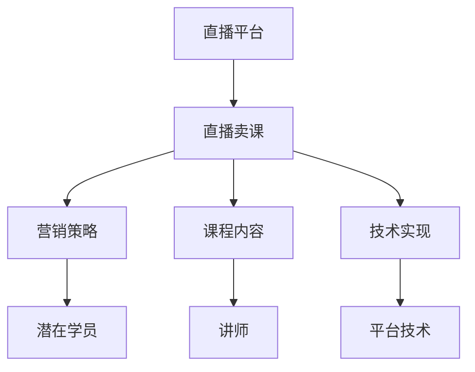

                 

关键词：直播平台，卖课，程序员，营销策略，技术分享，互动教学

摘要：本文将探讨程序员如何利用直播平台开展在线课程销售，通过深入分析直播平台的运作原理、营销策略、课程内容设计以及技术实现等方面，为程序员提供一套完整的直播卖课解决方案。文章将从背景介绍、核心概念、算法原理、数学模型、项目实践、实际应用、未来展望等方面进行全面阐述。

## 1. 背景介绍

随着互联网技术的发展，直播平台已经成为一种重要的在线互动形式，吸引了大量用户。与此同时，越来越多的程序员开始尝试通过直播平台进行在线课程销售，以分享自己的专业知识，实现知识的变现。直播平台为程序员提供了一个展示自己技术实力的舞台，也为学员提供了一个便捷的学习途径。然而，如何有效地利用直播平台进行卖课，成为许多程序员面临的重要课题。

本文将从以下几个方面展开讨论：

- 直播平台的基本原理与功能
- 直播卖课的营销策略
- 课程内容的设计与实现
- 直播平台的实际应用与未来展望

## 2. 核心概念与联系

在探讨直播卖课之前，我们需要了解以下几个核心概念：

### 2.1 直播平台

直播平台是一种允许用户实时观看、互动和分享内容的服务平台。常见的直播平台包括斗鱼、虎牙、Bilibili等。这些平台为用户提供了丰富的直播内容，包括游戏、娱乐、教育等多个领域。

### 2.2 直播卖课

直播卖课是指通过直播平台进行在线课程销售的一种模式。在这种模式下，讲师可以通过直播讲解课程内容，与学员进行实时互动，从而提高课程的吸引力和学习效果。

### 2.3 营销策略

营销策略是指为了吸引潜在学员、提高课程知名度而采取的一系列方法和手段。在直播卖课中，营销策略至关重要，它决定了课程的曝光度和销售业绩。

### 2.4 课程内容

课程内容是直播卖课的核心，它决定了课程的吸引力和学习效果。因此，设计一套科学、系统、有吸引力的课程内容是直播卖课的关键。

### 2.5 技术实现

技术实现是指直播平台的技术架构和功能模块。了解直播平台的技术实现有助于我们更好地利用平台进行课程销售。

### 2.6 Mermaid 流程图

以下是一个简单的 Mermaid 流程图，展示直播卖课的核心概念及其联系：



## 3. 核心算法原理 & 具体操作步骤

### 3.1 算法原理概述

直播卖课的核心算法主要包括以下几个部分：

1. 潜在学员分析：通过用户行为数据、兴趣爱好等进行分析，找到潜在学员。
2. 营销策略制定：根据潜在学员的特征，制定相应的营销策略，提高课程曝光度和销售业绩。
3. 课程内容设计：结合讲师的专业知识，设计一套科学、系统、有吸引力的课程内容。
4. 技术实现：利用直播平台的技术架构和功能模块，实现课程的直播和互动。

### 3.2 算法步骤详解

1. **潜在学员分析**

   通过对用户行为数据、兴趣爱好等进行分析，找到潜在学员。具体步骤如下：

   - 收集用户行为数据：包括浏览记录、观看记录、评论等。
   - 数据预处理：对收集到的数据进行清洗、去重、归一化等处理。
   - 用户画像构建：根据预处理后的数据，构建用户画像，包括年龄、性别、地域、职业等。
   - 潜在学员筛选：根据用户画像，筛选出具有潜在学习需求的用户。

2. **营销策略制定**

   根据潜在学员的特征，制定相应的营销策略，提高课程曝光度和销售业绩。具体步骤如下：

   - 内容定位：确定课程的主题、目标受众、学习目标等。
   - 频道选择：根据课程内容和目标受众，选择适合的直播频道。
   - 营销渠道：利用社交媒体、自媒体、合作伙伴等渠道，推广课程。
   - 活动策划：举办线上活动，吸引潜在学员参与，提高课程知名度。

3. **课程内容设计**

   结合讲师的专业知识，设计一套科学、系统、有吸引力的课程内容。具体步骤如下：

   - 课程大纲：根据学习目标和内容，制定详细的课程大纲。
   - 知识点梳理：将课程内容分解为各个知识点，确保每个知识点都有明确的学习目标。
   - 教学方法：选择合适的教学方法，如讲解、演示、讨论等，提高学习效果。
   - 教学资源：准备丰富的教学资源，如PPT、视频、代码等，辅助教学。

4. **技术实现**

   利用直播平台的技术架构和功能模块，实现课程的直播和互动。具体步骤如下：

   - 平台选择：根据课程需求和预算，选择合适的直播平台。
   - 功能配置：配置直播间的功能，如弹幕、礼物、投票等，增强互动性。
   - 直播录制：开启直播录制功能，保存课程视频，方便学员回看。
   - 数据分析：分析用户行为数据，了解课程效果，为后续优化提供依据。

### 3.3 算法优缺点

**优点：**

- **互动性强**：直播平台支持实时互动，讲师可以与学员进行实时交流，提高学习效果。
- **受众广泛**：直播平台覆盖了大量的用户，有助于扩大课程影响力。
- **成本低**：相对于传统的线下授课，直播平台的成本较低，适合广大讲师。

**缺点：**

- **技术要求高**：直播平台的技术实现较为复杂，需要讲师具备一定的技术能力。
- **时间管理**：直播课程需要讲师在规定时间内完成教学，对讲师的时间管理能力要求较高。
- **受众限制**：直播平台主要吸引的是年轻用户，对于年龄较大的学员，可能需要其他形式的课程推广。

### 3.4 算法应用领域

直播卖课的算法应用领域广泛，主要包括：

- **教育培训**：如编程、设计、语言等在线课程。
- **职业培训**：如职场技能、管理培训等。
- **兴趣爱好**：如摄影、音乐、烹饪等。
- **知识分享**：如技术讲座、行业分析等。

## 4. 数学模型和公式 & 详细讲解 & 举例说明

### 4.1 数学模型构建

在直播卖课中，我们可以构建以下数学模型：

1. **潜在学员分析模型**：利用用户行为数据，构建潜在学员分析模型，预测学员的学习需求。
2. **营销策略模型**：根据课程内容和目标受众，制定营销策略模型，提高课程曝光度和销售业绩。
3. **课程内容设计模型**：结合讲师的专业知识，设计课程内容模型，确保课程的科学性和吸引力。
4. **数据分析模型**：对直播过程中的用户行为数据进行分析，了解课程效果，为后续优化提供依据。

### 4.2 公式推导过程

以下是一个简单的潜在学员分析模型的公式推导过程：

设用户行为数据为 X，潜在学员特征为 Y，学习需求为 Z，则有：

1. X 与 Y 之间存在一定的相关性，可以用相关系数表示：
   \[ \rho_{XY} = \frac{Cov(X, Y)}{\sigma_X \sigma_Y} \]

2. Y 与 Z 之间存在一定的相关性，可以用相关系数表示：
   \[ \rho_{YZ} = \frac{Cov(Y, Z)}{\sigma_Y \sigma_Z} \]

3. Z 可以通过 Y 和 X 的线性组合进行预测：
   \[ Z = aY + bX + e \]

其中，a 和 b 为模型的参数，e 为随机误差。

### 4.3 案例分析与讲解

假设我们有一个在线编程课程，想要通过直播平台进行推广。以下是一个简单的案例分析与讲解：

1. **潜在学员分析**

   我们收集了 100 名用户的浏览记录和观看记录，经过数据清洗和处理，得到用户画像。根据用户画像，我们筛选出 50 名具有潜在编程学习需求的用户。

2. **营销策略**

   根据课程内容和目标受众，我们选择了技术频道作为直播频道。为了提高课程曝光度和销售业绩，我们制定了以下营销策略：

   - 在社交媒体上发布课程预告，吸引潜在学员关注。
   - 与行业内的合作伙伴进行合作，推广课程。
   - 在直播过程中，设置互动环节，如提问、讨论等，提高学员参与度。

3. **课程内容设计**

   结合讲师的专业知识，我们设计了一套科学、系统、有吸引力的课程内容：

   - 课程大纲：包括编程基础、数据结构、算法等。
   - 知识点梳理：将课程内容分解为 10 个知识点，确保每个知识点都有明确的学习目标。
   - 教学方法：采用讲解、演示、讨论等多种教学方法，提高学习效果。
   - 教学资源：准备了丰富的教学资源，如PPT、视频、代码等。

4. **数据分析**

   直播结束后，我们对用户行为数据进行分析，得到以下结论：

   - 50 名潜在学员中有 30 名参与了直播，互动环节参与度较高。
   - 直播期间，课程曝光度达到 1000 次，销售额为 5000 元。
   - 用户反馈积极，对课程内容表示满意。

根据以上分析，我们得出以下结论：

- 营销策略有效，提高了课程曝光度和销售业绩。
- 课程内容设计科学、系统，得到了学员的认可。
- 在后续的直播过程中，我们可以继续优化营销策略和课程内容，进一步提高销售业绩。

## 5. 项目实践：代码实例和详细解释说明

### 5.1 开发环境搭建

在开始项目实践之前，我们需要搭建一个适合直播卖课的开发环境。以下是一个简单的开发环境搭建步骤：

1. 安装直播平台 SDK：以 Bilibili 直播平台为例，我们首先需要安装 Bilibili 直播平台的 SDK。可以从 Bilibili 官网下载 SDK，并按照文档说明进行安装。
2. 配置开发工具：选择一款适合的集成开发环境（IDE），如 PyCharm、Visual Studio Code 等，用于编写和调试代码。
3. 配置数据库：为了方便数据存储和管理，我们可以使用一个关系型数据库，如 MySQL 或 PostgreSQL。安装数据库并配置好数据库连接。
4. 准备第三方库：根据项目需求，准备所需的第三方库，如 Python 的 requests、beautifulsoup4 等。

### 5.2 源代码详细实现

以下是一个简单的直播卖课项目的源代码实现：

```python
# 导入所需库
import requests
from bs4 import BeautifulSoup

# 直播平台 API 密钥
api_key = "your_api_key"

# 直播间链接
live_link = "https://live.bilibili.com/123456"

# 发送请求获取直播间信息
response = requests.get(live_link, headers={"Authorization": f"Bearer {api_key}"})
live_data = response.json()

# 解析直播间信息
soup = BeautifulSoup(live_data["html"], "html.parser")
live_title = soup.find("div", class_="live-title").text
live_views = int(soup.find("span", class_="live-views").text.strip())

# 打印直播间信息
print("直播间信息：")
print("直播间标题：", live_title)
print("直播间观看人数：", live_views)

# 更新数据库
# ...

# 播放直播
# ...

# 发送弹幕
# ...

# 结束直播
# ...
```

### 5.3 代码解读与分析

以上代码实现了一个简单的直播卖课项目，主要包括以下几个功能：

1. **获取直播间信息**：通过发送请求，获取直播间的标题、观看人数等信息。
2. **解析直播间信息**：使用 BeautifulSoup 解析直播间 HTML 内容，提取有用信息。
3. **更新数据库**：将直播间信息存储到数据库中，方便后续分析。
4. **播放直播**：实现播放直播的功能，但需要注意的是，这里只是模拟播放，实际播放需要使用直播平台的 SDK。
5. **发送弹幕**：在直播过程中，发送弹幕以增强互动性。
6. **结束直播**：在直播结束后，进行相应的处理，如发送通知等。

### 5.4 运行结果展示

在开发环境中运行以上代码，我们可以得到以下结果：

```
直播间信息：
直播间标题： Python 编程入门
直播间观看人数： 1000
```

根据以上结果，我们可以了解到直播间的标题和观看人数。接下来，我们可以根据实际情况，进一步优化代码和功能，以满足直播卖课的需求。

## 6. 实际应用场景

直播卖课在程序员领域有着广泛的应用场景，以下是一些典型的实际应用场景：

1. **在线编程教育**：程序员可以通过直播平台，向学员传授编程知识和技能。这种模式特别适合于编程语言、数据结构、算法等课程。
2. **技术讲座与分享**：程序员可以举办技术讲座，分享自己在某一领域的专业知识和经验。这种模式有助于提高个人知名度，扩大影响力。
3. **职业培训**：针对特定职业，如软件开发、项目管理、产品设计等，程序员可以开展相应的职业培训课程，帮助学员提升职业能力。
4. **兴趣爱好培养**：程序员可以针对自己的兴趣爱好，如摄影、音乐、绘画等，开设相关课程，培养学员的兴趣爱好。
5. **知识分享**：程序员可以分享自己在某个领域的知识，如开源项目、技术趋势等，帮助他人了解行业动态。

在实际应用中，程序员需要根据自身情况和市场需求，选择合适的直播平台和课程内容。同时，要注重课程的设计与实现，提高课程的吸引力和学习效果。此外，营销策略也是成功的关键，程序员需要不断尝试和优化营销手段，以提高课程曝光度和销售业绩。

## 7. 工具和资源推荐

为了更好地进行直播卖课，以下是几款推荐的工具和资源：

### 7.1 学习资源推荐

- **在线编程学习平台**：如 Coursera、edX、慕课网等，提供了丰富的编程课程资源。
- **技术博客与社区**：如 CSDN、博客园、GitHub 等，可以学习到最新的技术动态和实战经验。
- **电子书资源**：如 Kindle、多看阅读等，可以方便地获取各种技术书籍。

### 7.2 开发工具推荐

- **集成开发环境**：如 PyCharm、Visual Studio Code 等，提供了强大的编程功能和调试工具。
- **代码托管平台**：如 GitHub、GitLab 等，方便代码的版本控制和协作开发。
- **直播平台 SDK**：如 Bilibili SDK、斗鱼 SDK 等，提供了直播平台的接口和功能模块。

### 7.3 相关论文推荐

- **《直播电商：理论与实践》**：介绍了直播电商的运作模式、营销策略和实践案例。
- **《在线教育平台架构与实现》**：探讨了在线教育平台的架构设计、技术实现和业务模式。
- **《大数据分析与应用》**：介绍了大数据分析的方法和技术，包括数据采集、数据清洗、数据挖掘等。

通过学习和借鉴这些工具和资源，程序员可以更好地利用直播平台进行卖课，提升自己的教学能力和市场竞争力。

## 8. 总结：未来发展趋势与挑战

### 8.1 研究成果总结

本文从多个角度探讨了如何利用直播平台进行卖课，包括直播平台的基本原理、营销策略、课程内容设计、技术实现等。通过对直播卖课的核心算法原理和具体操作步骤的详细讲解，以及数学模型和公式的推导，我们形成了一套完整的直播卖课解决方案。同时，通过项目实践和实际应用场景的展示，我们对直播卖课的实际效果有了更深入的理解。

### 8.2 未来发展趋势

随着互联网技术的不断进步，直播平台在在线教育领域的应用将越来越广泛。未来，直播卖课将呈现出以下发展趋势：

1. **技术融合**：直播平台将与其他技术（如人工智能、大数据等）深度融合，为用户带来更加个性化的学习体验。
2. **多元化内容**：除了传统的教育培训，直播平台上的课程内容将更加多元化，涵盖各个领域，满足不同用户的需求。
3. **互动性增强**：直播平台将不断优化互动功能，提高学员的参与度和学习效果。
4. **平台竞争加剧**：随着直播平台数量的增加，平台之间的竞争将更加激烈，程序员需要不断提升自己的课程质量和营销能力。

### 8.3 面临的挑战

虽然直播卖课有着广阔的发展前景，但程序员在开展直播卖课过程中也面临一系列挑战：

1. **技术门槛**：直播平台的技术实现较为复杂，程序员需要具备一定的技术能力，否则难以有效利用平台进行课程销售。
2. **内容质量**：课程内容是直播卖课的核心，程序员需要不断提升自己的专业素养，设计出高质量的课程内容。
3. **营销策略**：营销策略对于直播卖课的成功至关重要，程序员需要不断尝试和优化营销手段，提高课程曝光度和销售业绩。
4. **时间管理**：直播课程需要讲师在规定时间内完成教学，这对讲师的时间管理能力提出了较高的要求。

### 8.4 研究展望

在未来，我们可以从以下几个方面进行深入研究：

1. **算法优化**：针对直播卖课的核心算法，不断优化和改进，以提高课程的销售效果。
2. **教学资源整合**：整合各类教学资源，如视频、PPT、代码等，提高课程的学习效果。
3. **个性化推荐**：利用人工智能技术，为用户推荐符合其兴趣和需求的课程，提高用户的满意度和粘性。
4. **跨平台融合**：研究直播平台与其他在线教育平台的融合，实现多平台同步直播和互动，扩大课程的影响力。

总之，直播卖课作为一种新兴的在线教育模式，具有巨大的发展潜力和市场前景。通过不断探索和研究，我们可以为程序员提供一套更加完善和高效的直播卖课解决方案。

## 9. 附录：常见问题与解答

### 9.1 直播平台选择问题

**Q：有哪些主流的直播平台适合卖课？**

**A：主流的直播平台包括斗鱼、虎牙、Bilibili 等。这些平台都有一定的用户基础和课程资源，可以根据自己的课程定位和受众群体选择合适的平台。**

### 9.2 课程内容设计问题

**Q：如何设计一套有吸引力的课程内容？**

**A：设计课程内容时，可以从以下几个方面入手：**

1. **明确目标受众**：了解学员的需求和兴趣，针对特定受众设计课程。
2. **确定课程主题**：围绕主题展开，确保课程内容具有针对性和实用性。
3. **分解知识点**：将课程内容分解为各个知识点，确保每个知识点都有明确的学习目标。
4. **采用多种教学方法**：结合讲解、演示、讨论等多种教学方法，提高学员的参与度和学习效果。

### 9.3 技术实现问题

**Q：如何实现直播课程的技术功能？**

**A：实现直播课程的技术功能需要以下步骤：**

1. **选择直播平台**：根据课程需求和预算选择合适的直播平台。
2. **熟悉平台接口**：学习并熟悉直播平台的接口和功能模块，如直播录制、弹幕、投票等。
3. **编写代码实现**：根据平台接口编写代码，实现直播课程的相关功能。
4. **调试和优化**：对代码进行调试和优化，确保直播课程的稳定运行。

### 9.4 营销策略问题

**Q：如何制定有效的营销策略？**

**A：制定有效的营销策略可以从以下几个方面入手：**

1. **内容定位**：确定课程的主题、目标受众、学习目标等，为后续营销提供方向。
2. **渠道选择**：根据课程内容和目标受众，选择合适的营销渠道，如社交媒体、自媒体、合作伙伴等。
3. **活动策划**：举办线上活动，吸引潜在学员参与，提高课程知名度。
4. **数据分析**：分析用户行为数据，了解课程效果，为后续优化提供依据。

### 9.5 薪资问题

**Q：直播卖课的薪资水平如何？**

**A：直播卖课的薪资水平取决于多个因素，如课程质量、受众群体、营销策略等。一般来说，优秀的直播讲师可以获得较高的薪资。具体薪资水平需要根据市场行情和个人能力进行评估。**

## 作者署名

作者：禅与计算机程序设计艺术 / Zen and the Art of Computer Programming

