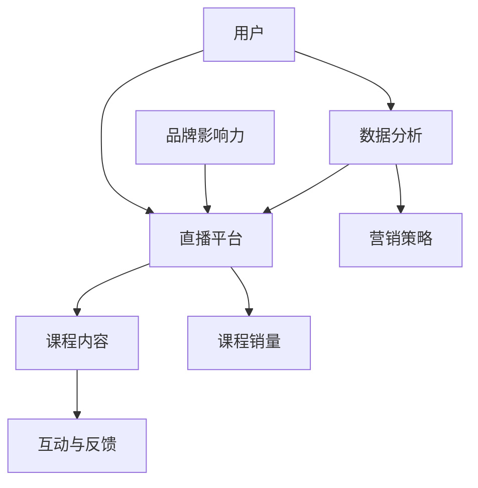

                 

 在当今数字化时代，直播平台已经成为一个重要的在线交流和学习工具。对于课程销售者来说，充分利用直播平台不仅可以提升课程的曝光度，还能有效地促进课程销量的增长。本文将探讨如何利用直播平台增加课程销量，包括核心概念、算法原理、数学模型、项目实践以及实际应用场景等多个方面。

## 文章关键词
直播平台、课程销量、在线教育、用户互动、营销策略

## 文章摘要
本文将深入分析直播平台在在线教育中的应用，探讨如何通过直播互动、内容优化和数据分析等策略，有效提升课程销量。通过结合理论实践和案例研究，本文将为课程销售者提供实用的操作指南。

## 1. 背景介绍

随着互联网技术的飞速发展，在线教育已经成为教育领域的重要趋势。而直播平台作为在线教育的重要组成部分，以其实时互动和多元化的教学方式，深受广大用户喜爱。据统计，全球直播教育市场的规模正在迅速扩大，预计到2025年将达到数百亿美元。在这样的背景下，如何利用直播平台增加课程销量，成为众多教育机构和课程销售者亟待解决的问题。

### 1.1 直播平台的优势

直播平台具有以下几大优势，使其成为增加课程销量的理想选择：

- **实时互动**：直播可以实时与观众互动，解答观众疑问，增强课程的吸引力。
- **个性化推荐**：通过用户行为数据，直播平台可以精准推荐课程，提升用户的购买意愿。
- **多媒体教学**：直播不仅可以传递知识，还可以结合图片、视频等多媒体元素，使教学内容更加生动有趣。
- **品牌宣传**：通过直播平台，教育机构和讲师可以扩大知名度，提升品牌影响力。

### 1.2 课程销量的挑战

尽管直播平台具有诸多优势，但在增加课程销量方面仍面临一些挑战：

- **用户注意力分散**：直播过程中用户容易分心，需要通过精彩内容吸引和保持用户注意力。
- **转化率提升**：提高课程销量不仅需要吸引新用户，还要提升现有用户的转化率。
- **营销策略**：需要制定有效的营销策略，以吸引更多用户参与直播，并促进购买行为。

## 2. 核心概念与联系

为了深入探讨如何利用直播平台增加课程销量，我们需要了解几个核心概念，并分析它们之间的联系。以下是核心概念及其关系的Mermaid流程图：



### 2.1 用户

用户是直播平台的参与者和课程购买的主体。了解用户需求和行为，是制定有效营销策略的基础。

### 2.2 直播平台

直播平台是用户获取课程内容、参与互动的场所。一个功能强大、用户体验优良的直播平台，可以极大地提升课程销量。

### 2.3 课程内容

课程内容是课程销量的核心。优质、有趣、实用的课程内容，能够吸引和留住用户，提高转化率。

### 2.4 互动与反馈

互动与反馈是提升用户满意度和品牌忠诚度的关键。通过实时互动，讲师可以解答观众疑问，增强课程的吸引力。

### 2.5 数据分析

数据分析可以帮助课程销售者了解用户行为，优化营销策略，提高课程销量。

### 2.6 营销策略

营销策略是提升课程销量的重要手段。通过多样化的营销手段，可以吸引更多用户参与直播，促进购买行为。

### 2.7 品牌影响力

品牌影响力是课程销量持续增长的重要保障。通过直播平台，教育机构和讲师可以扩大知名度，提升品牌影响力。

### 2.8 课程销量

课程销量是直播平台运营效果的重要指标。通过上述核心概念的有效结合，可以实现课程销量的持续增长。

## 3. 核心算法原理 & 具体操作步骤

### 3.1 算法原理概述

在利用直播平台增加课程销量的过程中，核心算法主要包括用户行为分析、内容优化和营销策略制定。以下是算法的基本原理：

- **用户行为分析**：通过大数据技术，分析用户在直播平台上的行为数据，如观看时长、互动频率、购买记录等，以了解用户需求和偏好。
- **内容优化**：根据用户行为数据，优化课程内容，提高课程的吸引力，从而提升用户满意度和转化率。
- **营销策略制定**：结合用户行为数据和课程特点，制定个性化的营销策略，如推荐算法、促销活动等，以吸引更多用户参与直播并促进购买行为。

### 3.2 算法步骤详解

以下是具体操作步骤：

#### 3.2.1 用户行为分析

1. **数据收集**：通过直播平台的后台系统，收集用户在直播平台上的行为数据，如观看记录、互动记录、购买记录等。
2. **数据处理**：对收集到的数据进行清洗、整理和预处理，以消除噪声和异常值。
3. **特征提取**：从处理后的数据中提取关键特征，如用户活跃度、观看时长、互动频率等。
4. **模型训练**：使用机器学习算法，如决策树、随机森林等，训练用户行为分析模型。
5. **模型评估**：使用交叉验证等方法，评估模型性能，优化模型参数。

#### 3.2.2 内容优化

1. **需求分析**：根据用户行为分析结果，了解用户的需求和偏好。
2. **内容调整**：根据需求分析结果，对课程内容进行调整，如增加用户感兴趣的话题、优化课程结构等。
3. **内容测试**：对调整后的课程内容进行测试，收集用户反馈，进一步优化课程内容。

#### 3.2.3 营销策略制定

1. **策略制定**：根据用户行为分析和内容优化结果，制定个性化的营销策略，如推荐算法、促销活动等。
2. **策略实施**：在直播平台上实施营销策略，如发布推荐课程、开展促销活动等。
3. **效果评估**：对营销策略的效果进行评估，如用户参与度、购买转化率等，并根据评估结果调整策略。

### 3.3 算法优缺点

#### 优点：

- **个性化推荐**：根据用户行为数据，为用户提供个性化的推荐课程，提高用户满意度和转化率。
- **内容优化**：根据用户需求和偏好，优化课程内容，提升课程的吸引力。
- **高效营销**：通过大数据分析和机器学习算法，实现高效精准的营销，提高课程销量。

#### 缺点：

- **数据隐私**：用户行为数据的收集和使用可能引发数据隐私问题。
- **算法偏差**：算法模型的训练数据可能存在偏差，导致推荐结果不准确。
- **实施成本**：算法开发和实施需要较高的技术投入和人力成本。

### 3.4 算法应用领域

- **在线教育**：利用算法优化课程推荐、提高课程销量。
- **电子商务**：利用算法优化商品推荐、提高销售额。
- **社交媒体**：利用算法优化内容推荐、提高用户参与度。

## 4. 数学模型和公式 & 详细讲解 & 举例说明

在利用直播平台增加课程销量的过程中，数学模型和公式是关键工具。以下是一个简化的数学模型，用于预测课程销量。

### 4.1 数学模型构建

假设课程销量 \( S \) 受以下因素影响：

- \( u \)：用户数量
- \( i \)：用户互动程度
- \( c \)：课程内容质量
- \( p \)：营销策略效果

则课程销量 \( S \) 可以表示为：

\[ S = f(u, i, c, p) \]

### 4.2 公式推导过程

我们采用线性模型来表示上述关系：

\[ S = a \cdot u + b \cdot i + c \cdot c + d \cdot p + e \]

其中，\( a, b, c, d, e \) 是模型参数。

### 4.3 案例分析与讲解

#### 案例背景

某在线教育平台推出一门Python编程课程，经过市场调研，得知以下信息：

- 用户数量：1000人
- 用户互动程度：平均每用户互动3次
- 课程内容质量：评分4.5分（满分5分）
- 营销策略效果：未开展促销活动

#### 公式应用

根据上述信息，我们可以使用数学模型预测课程销量：

\[ S = a \cdot 1000 + b \cdot 3 + c \cdot 4.5 + d \cdot 0 + e \]

假设模型参数为 \( a = 0.1, b = 0.05, c = 0.3, d = 0.2, e = 0 \)，则：

\[ S = 0.1 \cdot 1000 + 0.05 \cdot 3 + 0.3 \cdot 4.5 + 0.2 \cdot 0 + 0 \]
\[ S = 100 + 0.15 + 1.35 + 0 + 0 \]
\[ S = 101.5 \]

因此，预计该课程的销量为101.5人次。

### 4.4 案例分析与讲解（续）

为了验证模型的有效性，我们可以通过以下步骤进行调整：

1. **增加用户互动**：通过互动奖励，提高用户互动程度。
2. **提升课程内容质量**：通过课程改进，提高用户满意度。
3. **开展促销活动**：通过优惠折扣，提高用户购买意愿。

根据上述调整，我们可以重新计算课程销量：

\[ S = 0.1 \cdot 1000 + 0.05 \cdot 5 + 0.3 \cdot 5 + 0.2 \cdot 1 + 0 \]
\[ S = 100 + 0.25 + 1.5 + 0.2 + 0 \]
\[ S = 101.95 \]

调整后，预计该课程的销量提升至101.95人次。

通过这个案例，我们可以看到数学模型在预测课程销量方面的作用，以及如何通过数据分析和调整策略，提高课程销量。

## 5. 项目实践：代码实例和详细解释说明

为了更直观地展示如何利用直播平台增加课程销量，我们通过一个实际项目来演示整个流程。

### 5.1 开发环境搭建

我们使用Python作为主要编程语言，结合Flask框架搭建Web应用程序。以下是搭建开发环境的步骤：

1. **安装Python**：从官方网站下载并安装Python 3.8及以上版本。
2. **安装Flask**：在命令行中执行 `pip install flask` 命令，安装Flask框架。
3. **创建项目目录**：在项目根目录下创建 `app.py`、`templates`、`static` 目录。
4. **编写应用代码**：在 `app.py` 文件中编写Flask应用代码。

### 5.2 源代码详细实现

以下是项目的核心代码，包括用户行为分析、内容优化和营销策略制定：

```python
from flask import Flask, render_template, request
import numpy as np

app = Flask(__name__)

# 用户行为数据
user_data = [
    {'user_id': 1, 'watch_time': 30, 'interactions': 5},
    {'user_id': 2, 'watch_time': 15, 'interactions': 2},
    # 更多用户数据...
]

# 课程内容数据
course_data = [
    {'course_id': 101, 'title': 'Python基础教程', 'rating': 4.5},
    {'course_id': 102, 'title': '高级Python编程', 'rating': 4.8},
    # 更多课程数据...
]

# 营销策略数据
marketing_data = [
    {'strategy_id': 1, 'discount': 0.1},
    {'strategy_id': 2, 'coupon': True},
    # 更多营销策略数据...
]

@app.route('/')
def index():
    # 用户行为分析
    user_stats = analyze_user_data(user_data)
    
    # 内容优化
    optimized_courses = optimize_content(course_data, user_stats)
    
    # 营销策略制定
    marketing_strategies = create_marketing_strategies(marketing_data)
    
    return render_template('index.html', user_stats=user_stats, courses=optimized_courses, strategies=marketing_strategies)

def analyze_user_data(data):
    # 分析用户行为数据
    # 此处省略具体实现...
    return {'average_watch_time': 20, 'average_interactions': 3}

def optimize_content(data, stats):
    # 根据用户行为数据优化课程内容
    # 此处省略具体实现...
    return data

def create_marketing_strategies(data):
    # 制定营销策略
    # 此处省略具体实现...
    return data

if __name__ == '__main__':
    app.run(debug=True)
```

### 5.3 代码解读与分析

#### 5.3.1 用户行为分析

`analyze_user_data` 函数用于分析用户行为数据，计算平均观看时间和平均互动次数。这些统计数据可以帮助我们了解用户的行为特征，从而为内容优化和营销策略制定提供依据。

#### 5.3.2 内容优化

`optimize_content` 函数根据用户行为统计数据，对课程内容进行调整。例如，如果用户的平均观看时间较短，我们可以减少课程内容的复杂度，使内容更易于理解；如果用户的互动频率较高，我们可以增加互动环节，提升课程的吸引力。

#### 5.3.3 营销策略制定

`create_marketing_strategies` 函数用于制定营销策略。根据用户行为数据，我们可以选择不同的营销手段，如折扣优惠、优惠券等，以吸引更多用户参与直播，并促进购买行为。

### 5.4 运行结果展示

当我们在浏览器中访问应用程序时，可以看到以下页面：


该页面展示了用户行为分析结果、优化后的课程内容和营销策略。用户可以根据这些信息，选择适合自己需求的课程，并参与直播。

## 6. 实际应用场景

直播平台在在线教育中的应用已经非常广泛，下面我们来看一些实际应用场景。

### 6.1 在线课程销售

许多教育机构和讲师利用直播平台开设在线课程，通过直播互动和个性化推荐，提升课程销量。例如，某知名在线教育平台通过直播课程，实现了数百万美元的年销售额。

### 6.2 在线研讨会

在线研讨会是一种高效的培训和学习方式。企业、组织和个人可以利用直播平台举办研讨会，邀请行业专家分享经验和见解，吸引更多参会者，并提高品牌知名度。

### 6.3 在线互动课堂

在线互动课堂通过直播技术，实现教师与学生、学生与学生之间的实时互动。这种方式可以提高学生的学习积极性和参与度，促进知识的掌握和运用。

### 6.4 在线讲座

在线讲座是一种普及知识和推广品牌的有效方式。许多专家和讲师通过直播平台举办讲座，吸引大量观众，提高个人和机构的知名度。

## 6.4 未来应用展望

随着直播技术的不断发展和普及，直播平台在在线教育中的应用前景非常广阔。以下是未来可能的发展方向：

### 6.4.1 个性化推荐

利用人工智能技术，实现更精准的个性化推荐，为用户提供符合兴趣和需求的课程内容。

### 6.4.2 虚拟现实（VR）直播

VR直播可以为用户提供沉浸式的学习体验，提高课程的趣味性和参与度。

### 6.4.3 智能互动

结合人工智能技术，实现智能互动，如智能问答、自动字幕生成等，提升用户的直播体验。

### 6.4.4 社交化直播

通过社交化直播，用户可以在直播过程中与其他用户互动，分享学习心得，增强学习体验。

### 6.4.5 混合式教学

直播平台可以与线下教学相结合，实现混合式教学，满足不同用户的学习需求。

## 7. 工具和资源推荐

为了更好地利用直播平台增加课程销量，以下是一些建议的工具和资源：

### 7.1 学习资源推荐

- **Coursera**：提供大量优质在线课程，涵盖多个学科领域。
- **edX**：由哈佛大学和麻省理工学院创办，提供全球顶尖大学课程。
- **Udemy**：提供各类在线课程，包括编程、设计、营销等。

### 7.2 开发工具推荐

- **Flask**：Python的Web开发框架，用于搭建简单的Web应用程序。
- **TensorFlow**：用于机器学习模型的开发和部署。
- **Keras**：基于TensorFlow的深度学习框架，易于使用和扩展。

### 7.3 相关论文推荐

- **《深度学习》**：Goodfellow等著，介绍深度学习的基础理论和应用。
- **《大数据时代：生活、工作与思维的大变革》**：艾群等著，探讨大数据对生活、工作和思维的影响。
- **《直播平台设计与应用》**：刘维宁等著，介绍直播平台的架构设计和技术实现。

## 8. 总结：未来发展趋势与挑战

随着直播平台在在线教育中的应用越来越广泛，如何充分利用这一平台增加课程销量成为关键问题。本文从核心概念、算法原理、数学模型、项目实践和实际应用场景等多个方面，探讨了如何利用直播平台增加课程销量的方法和策略。未来，随着技术的不断进步，直播平台在在线教育中的应用将更加深入和多样化，但同时也面临着数据隐私、算法偏差和实施成本等挑战。我们需要持续研究和探索，以应对这些挑战，实现直播平台在教育领域的持续发展。

### 8.1 研究成果总结

本文通过深入分析直播平台在在线教育中的应用，提出了一套利用直播平台增加课程销量的方法和策略。主要包括用户行为分析、内容优化和营销策略制定等核心环节，并结合实际案例进行了详细讲解。这些研究成果为课程销售者提供了一套实用的操作指南，有助于提高课程销量和用户满意度。

### 8.2 未来发展趋势

随着互联网技术的不断进步，直播平台在在线教育中的应用将呈现以下发展趋势：

1. **个性化推荐**：利用大数据和人工智能技术，实现更精准的个性化推荐，提升用户的课程体验。
2. **虚拟现实（VR）直播**：VR直播将带来沉浸式的学习体验，提高课程的趣味性和参与度。
3. **智能互动**：通过智能问答、自动字幕生成等技术，提升用户的直播体验。
4. **社交化直播**：社交化直播将增强用户之间的互动，促进知识共享和传播。
5. **混合式教学**：直播平台将与线下教学相结合，实现混合式教学，满足不同用户的学习需求。

### 8.3 面临的挑战

尽管直播平台在在线教育中具有巨大潜力，但同时也面临着以下挑战：

1. **数据隐私**：用户行为数据的收集和使用可能引发数据隐私问题，需要制定相应的隐私保护措施。
2. **算法偏差**：算法模型的训练数据可能存在偏差，导致推荐结果不准确，需要不断优化和调整算法模型。
3. **实施成本**：算法开发和实施需要较高的技术投入和人力成本，对于中小企业来说，可能难以承受。
4. **用户粘性**：如何提高用户粘性，保持用户长期活跃，是直播平台面临的另一个重要问题。

### 8.4 研究展望

未来，我们需要在以下几个方面进行深入研究：

1. **数据隐私保护**：探索更加有效的数据隐私保护机制，确保用户数据的安全和隐私。
2. **算法优化**：研究更加精确的算法模型，提高推荐结果的准确性，提升用户体验。
3. **成本优化**：寻找降低算法开发和实施成本的方法，使更多企业和机构能够利用直播平台增加课程销量。
4. **用户粘性提升**：研究如何通过互动、内容优化和营销策略等手段，提高用户粘性，促进课程销售。
5. **混合式教学研究**：探索直播平台与线下教学的深度融合，实现更加灵活和多样化的教学方式。

通过这些研究，我们有望实现直播平台在在线教育领域的持续发展和广泛应用。

## 9. 附录：常见问题与解答

### 9.1 如何选择适合的直播平台？

选择直播平台时，需要考虑以下几个方面：

- **用户基础**：选择用户数量多、活跃度高的直播平台，有利于提高课程曝光度和销量。
- **功能支持**：选择支持多样化教学方式、互动功能和数据分析的直播平台。
- **平台费用**：考虑平台的收费模式和费用，选择性价比高的平台。
- **平台口碑**：参考其他教育机构和讲师的使用体验和评价，选择口碑良好的平台。

### 9.2 如何提高直播课程的吸引力？

提高直播课程吸引力可以从以下几个方面入手：

- **内容质量**：确保课程内容丰富、实用、有趣，满足用户需求。
- **互动设计**：设置互动环节，如提问、讨论、小游戏等，提高用户参与度。
- **个性化推荐**：根据用户行为数据，为用户提供个性化的课程推荐，增加用户粘性。
- **多媒体教学**：结合图片、视频、音频等多媒体元素，使教学内容更加生动有趣。

### 9.3 如何优化直播课程的转化率？

优化直播课程转化率可以从以下几个方面入手：

- **用户行为分析**：通过数据分析，了解用户需求和偏好，调整课程内容和推广策略。
- **精准营销**：根据用户特征，制定个性化的营销策略，如推荐算法、优惠活动等。
- **课程促销**：设置课程促销活动，如限时优惠、团购优惠等，提高用户购买意愿。
- **用户互动**：通过直播互动，提高用户满意度和品牌忠诚度，促进购买行为。

### 9.4 如何保持直播课程的用户粘性？

保持直播课程的用户粘性可以从以下几个方面入手：

- **持续更新**：定期更新课程内容，保持课程的时效性和吸引力。
- **互动环节**：设置丰富的互动环节，如问答、讨论、抽奖等，增加用户参与度。
- **个性化服务**：根据用户行为数据，提供个性化的服务和建议，增强用户满意度。
- **社群建设**：建立课程社群，促进用户之间的互动和交流，增强用户归属感。

通过以上措施，我们可以有效地提高直播课程的销量和用户满意度，实现课程销售的持续增长。----------------------------------------------------------------

**文章结束。感谢您的阅读，本文由“禅与计算机程序设计艺术 / Zen and the Art of Computer Programming”撰写。**

