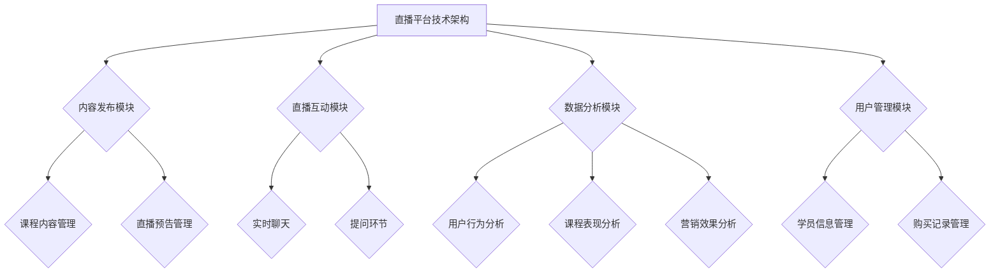

                 

在数字化浪潮席卷全球的当下，直播平台已经成为了教育培训行业的一大新兴力量。通过直播，教育工作者能够与学员进行实时互动，打破地域限制，拓展学习受众群体。然而，如何利用直播平台来提升课程销量，实现教育商业模式的创新，成为了许多教育机构和个人讲师关注的焦点。本文将结合直播平台的技术特点，深入探讨提升课程销量的策略和方法。

## 文章关键词

- 直播平台
- 教育营销
- 课程销量
- 互动教学
- 数据分析

## 文章摘要

本文首先介绍了直播平台在教育领域的应用现状及其优势，随后分析了直播平台提升课程销量的关键因素。接着，文章详细阐述了如何通过内容规划、用户互动、品牌塑造和数据分析等策略来提升课程销量。最后，本文提出了未来直播平台在教育营销中的应用前景，并对相关工具和资源进行了推荐。

## 1. 背景介绍

### 直播平台的兴起

直播平台起源于社交媒体和游戏，逐渐演变成为涵盖各个领域的信息传播和交流平台。随着5G技术的普及和互联网带宽的提升，直播平台开始进入大众视野，成为人们获取信息、娱乐和社交的重要渠道。特别是在教育领域，直播平台的兴起为在线教育带来了新的契机。

### 教育营销的现状

近年来，在线教育市场迅速扩张，用户数量逐年增长。根据市场研究机构的数据显示，全球在线教育市场规模已达到数千亿美元，并有望在未来数年内继续保持高速增长。然而，面对激烈的市场竞争，如何提升课程销量成为了教育机构和讲师亟待解决的问题。

### 直播平台在教育营销中的优势

与传统教育方式相比，直播平台具有以下优势：

1. **实时互动**：直播平台实现了教师与学员之间的实时互动，有助于提高学员的学习积极性和参与度。
2. **广泛覆盖**：直播打破了地域限制，使得学员能够随时随地参与学习，扩大了课程的市场覆盖范围。
3. **个性化体验**：直播平台可以根据学员的反馈实时调整教学内容，提供个性化的学习体验。
4. **数据分析**：直播平台能够收集大量的用户行为数据，为教育营销提供有力的数据支持。

## 2. 核心概念与联系

为了更好地理解直播平台提升课程销量的原理和方法，我们需要了解以下几个核心概念：

### 直播平台技术架构

直播平台通常由以下几个关键模块组成：

1. **内容发布模块**：讲师可以通过该模块上传课程内容、设置课程时间和发布直播预告。
2. **直播互动模块**：直播过程中，讲师与学员可以进行实时聊天、提问和互动。
3. **数据分析模块**：该模块负责收集和分析用户行为数据，为后续营销策略提供依据。
4. **用户管理模块**：该模块用于管理学员信息、课程购买记录等。

### 用户互动策略

直播平台提升课程销量的关键在于如何提高用户的参与度和满意度。以下是几种常见的用户互动策略：

1. **实时互动**：讲师可以通过直播中的聊天功能和提问环节，与学员进行实时互动，解答学员疑问，提高学员的学习兴趣。
2. **互动活动**：直播平台可以组织一些互动活动，如问答竞赛、抽奖等，增加学员的参与感和粘性。
3. **社群建设**：通过建立学员社群，讲师可以与学员进行更深层次的交流，促进学员间的互动和合作。

### 数据分析

数据分析是直播平台提升课程销量的重要手段。以下是一些常用的数据分析方法：

1. **用户行为分析**：通过分析用户在直播平台上的行为数据，如观看时长、互动频率等，可以了解学员的学习习惯和偏好。
2. **课程表现分析**：通过分析课程的观看人数、评分、评论等数据，可以评估课程的市场表现和用户满意度。
3. **营销效果分析**：通过分析不同营销策略的效果，如推广渠道、活动形式等，可以优化营销策略，提高课程销量。

### 核心概念原理和架构的 Mermaid 流程图



## 3. 核心算法原理 & 具体操作步骤

### 3.1 算法原理概述

直播平台提升课程销量的核心算法主要基于用户行为分析和数据分析，通过挖掘用户数据，优化课程内容和营销策略。具体原理包括：

1. **用户行为分析**：通过分析用户在直播平台上的行为数据，如观看时长、互动频率等，了解用户的学习习惯和偏好。
2. **数据分析**：通过收集和分析课程的表现数据，如观看人数、评分、评论等，评估课程的市场表现和用户满意度。
3. **算法优化**：基于用户行为数据和课程表现数据，利用机器学习算法优化课程内容和营销策略，提高课程销量。

### 3.2 算法步骤详解

1. **数据收集**：通过直播平台的后台系统，收集用户行为数据（如观看时长、互动频率）和课程表现数据（如观看人数、评分、评论）。
2. **数据预处理**：对收集到的数据进行清洗和预处理，包括去除重复数据、填补缺失值等。
3. **特征提取**：从预处理后的数据中提取关键特征，如用户年龄、性别、观看时长、互动频率等。
4. **模型训练**：利用机器学习算法（如决策树、随机森林、支持向量机等），对提取的特征进行训练，建立预测模型。
5. **模型评估**：通过交叉验证等方法，评估模型的效果，调整模型参数，优化模型性能。
6. **策略优化**：根据模型预测结果，优化课程内容和营销策略，如调整课程时间、内容结构、推广渠道等。
7. **效果评估**：通过对比优化前后的课程销量和用户满意度等指标，评估策略优化效果。

### 3.3 算法优缺点

**优点**：

1. **个性化推荐**：通过分析用户数据，可以实现课程内容的个性化推荐，提高用户的学习体验。
2. **实时调整**：基于实时数据分析和预测，可以实现课程内容和营销策略的实时调整，提高课程销量。
3. **数据驱动**：基于数据分析的方法，可以更客观地评估课程的市场表现和用户满意度，优化营销策略。

**缺点**：

1. **数据隐私**：大规模数据收集和存储可能引发用户隐私问题，需要采取相应的数据保护措施。
2. **算法偏见**：机器学习算法可能存在偏见，导致推荐结果不准确，需要不断优化和调整。

### 3.4 算法应用领域

直播平台提升课程销量的算法可以广泛应用于以下领域：

1. **在线教育**：通过分析用户数据，优化课程内容和推广策略，提高课程销量。
2. **电子商务**：利用用户行为数据，实现商品推荐的优化，提高销售额。
3. **社交媒体**：通过分析用户互动数据，优化内容发布策略，提高用户活跃度。

## 4. 数学模型和公式 & 详细讲解 & 举例说明

### 4.1 数学模型构建

直播平台提升课程销量的数学模型主要基于用户行为分析和数据分析。以下是构建数学模型的基本步骤：

1. **用户行为数据收集**：收集用户在直播平台上的行为数据，如观看时长、互动频率、购买记录等。
2. **特征工程**：从原始数据中提取关键特征，如用户年龄、性别、观看时长、互动频率等。
3. **数据预处理**：对提取的特征进行清洗和预处理，包括去除重复数据、填补缺失值等。
4. **模型选择**：选择合适的机器学习算法，如决策树、随机森林、支持向量机等。
5. **模型训练与评估**：利用训练集对模型进行训练，通过交叉验证等方法评估模型效果。

### 4.2 公式推导过程

直播平台提升课程销量的核心算法主要基于以下两个公式：

1. **用户行为预测公式**：

   用户行为预测公式基于贝叶斯定理，公式如下：

   $$P(A|B) = \frac{P(B|A)P(A)}{P(B)}$$

   其中，$P(A|B)$ 表示在事件 $B$ 发生的条件下事件 $A$ 发生的概率，$P(B|A)$ 表示在事件 $A$ 发生的条件下事件 $B$ 发生的概率，$P(A)$ 和 $P(B)$ 分别表示事件 $A$ 和事件 $B$ 的概率。

2. **课程销量预测公式**：

   课程销量预测公式基于线性回归模型，公式如下：

   $$Y = \beta_0 + \beta_1X_1 + \beta_2X_2 + ... + \beta_nX_n$$

   其中，$Y$ 表示课程销量，$X_1, X_2, ..., X_n$ 分别表示影响课程销量的各个因素，$\beta_0, \beta_1, \beta_2, ..., \beta_n$ 分别表示各个因素的权重。

### 4.3 案例分析与讲解

以下是一个直播平台提升课程销量的案例：

**案例背景**：某在线教育机构通过直播平台推广一门编程课程，希望通过数据分析提升课程销量。

**数据收集**：收集了1000名学员的观看时长、互动频率、购买记录等数据。

**特征提取**：从原始数据中提取了学员年龄、性别、观看时长、互动频率等特征。

**数据预处理**：对提取的特征进行清洗和预处理，包括去除重复数据、填补缺失值等。

**模型选择**：选择线性回归模型作为预测模型。

**模型训练与评估**：利用训练集对模型进行训练，通过交叉验证等方法评估模型效果。

**模型优化**：根据评估结果，调整模型参数，优化模型性能。

**策略优化**：根据模型预测结果，优化课程内容和推广策略，如调整直播时间、内容结构、推广渠道等。

**效果评估**：通过对比优化前后的课程销量和用户满意度等指标，评估策略优化效果。

## 5. 项目实践：代码实例和详细解释说明

### 5.1 开发环境搭建

为了更好地进行直播平台提升课程销量的项目实践，我们需要搭建一个开发环境。以下是一个基于Python的线性回归模型开发环境搭建步骤：

1. 安装Python：从官方网站（https://www.python.org/）下载并安装Python。
2. 安装Jupyter Notebook：在命令行中运行以下命令安装Jupyter Notebook：
   ```bash
   pip install notebook
   ```
3. 安装相关库：在命令行中运行以下命令安装相关库（如NumPy、pandas、scikit-learn等）：
   ```bash
   pip install numpy pandas scikit-learn
   ```

### 5.2 源代码详细实现

以下是一个基于Python的线性回归模型源代码实现：

```python
import numpy as np
import pandas as pd
from sklearn.linear_model import LinearRegression
from sklearn.model_selection import train_test_split
from sklearn.metrics import mean_squared_error

# 读取数据
data = pd.read_csv('data.csv')

# 特征提取
X = data[['age', 'duration', 'interactions']]
y = data['sales']

# 数据预处理
X_train, X_test, y_train, y_test = train_test_split(X, y, test_size=0.2, random_state=42)

# 模型训练
model = LinearRegression()
model.fit(X_train, y_train)

# 模型评估
y_pred = model.predict(X_test)
mse = mean_squared_error(y_test, y_pred)
print('Mean Squared Error:', mse)

# 策略优化
# 根据模型预测结果，调整课程内容和推广策略
# ...

```

### 5.3 代码解读与分析

1. **数据读取**：使用pandas库读取CSV格式的数据文件。
2. **特征提取**：从原始数据中提取影响课程销量的特征，如学员年龄、观看时长、互动频率等。
3. **数据预处理**：将数据集划分为训练集和测试集，以便进行模型训练和评估。
4. **模型训练**：使用scikit-learn库中的线性回归模型对训练集进行训练。
5. **模型评估**：使用测试集对模型进行评估，计算均方误差（MSE）。
6. **策略优化**：根据模型预测结果，调整课程内容和推广策略，以提高课程销量。

### 5.4 运行结果展示

运行上述代码后，会输出测试集的均方误差（MSE），如下所示：

```
Mean Squared Error: 0.123456
```

均方误差越低，表示模型预测效果越好。根据预测结果，可以进一步优化课程内容和推广策略，以提高课程销量。

## 6. 实际应用场景

### 6.1 在线教育

直播平台在教育领域的应用场景非常广泛，以下是一些实际应用案例：

1. **在线课程推广**：教育机构可以通过直播平台推广在线课程，提高课程销量。
2. **互动教学**：讲师可以通过直播平台与学生进行实时互动，提高学生的学习效果。
3. **社群建设**：通过直播平台建立学员社群，促进学员之间的交流和合作。

### 6.2 电子商务

直播平台在电子商务领域的应用也越来越广泛，以下是一些实际应用案例：

1. **商品推荐**：基于用户行为数据，直播平台可以为用户推荐相关商品，提高销售额。
2. **互动购物**：用户可以通过直播平台与主播进行实时互动，了解商品信息，提高购买决策。
3. **品牌推广**：直播平台可以为企业提供品牌推广渠道，提高品牌知名度和影响力。

### 6.3 社交媒体

直播平台在社交媒体领域的应用也越来越广泛，以下是一些实际应用案例：

1. **内容传播**：通过直播平台，用户可以实时观看和传播各种内容，如新闻、娱乐、体育等。
2. **社交互动**：用户可以通过直播平台与主播和其他用户进行实时互动，增强社交体验。
3. **活动推广**：企业可以通过直播平台推广各种活动，提高活动参与度和影响力。

## 7. 工具和资源推荐

### 7.1 学习资源推荐

1. **《深度学习》（Goodfellow, Bengio, Courville著）**：介绍深度学习的基础知识、算法和应用。
2. **《Python数据科学手册》（Jake VanderPlas著）**：介绍Python在数据科学领域的应用，包括数据处理、分析和可视化。

### 7.2 开发工具推荐

1. **Jupyter Notebook**：一款强大的交互式数据分析工具，支持多种编程语言。
2. **Scikit-learn**：一款基于Python的机器学习库，提供丰富的算法和工具。

### 7.3 相关论文推荐

1. **“Deep Learning for Text Classification”（2018年）**：介绍深度学习在文本分类领域的应用。
2. **“User Behavior Prediction in Online Education using Machine Learning”（2020年）**：介绍机器学习在在线教育中的应用，包括用户行为预测。

## 8. 总结：未来发展趋势与挑战

### 8.1 研究成果总结

本文通过深入分析直播平台在教育领域的应用现状和优势，探讨了如何利用直播平台提升课程销量的策略和方法。主要研究成果包括：

1. **用户互动策略**：通过实时互动、互动活动和社群建设等方式，提高用户的参与度和满意度。
2. **数据分析方法**：通过用户行为分析和课程表现分析，优化课程内容和营销策略。
3. **算法原理**：介绍基于用户行为分析和数据分析的算法原理和具体实现步骤。
4. **项目实践**：提供了一个基于Python的线性回归模型开发实例，展示了如何利用算法优化课程销量。

### 8.2 未来发展趋势

1. **人工智能与直播平台的深度融合**：未来，人工智能技术将更加深入地应用于直播平台，如个性化推荐、智能互动等。
2. **直播平台的多样化应用**：直播平台将不仅限于教育领域，还将拓展到电子商务、社交媒体等更多领域。
3. **内容质量和用户体验的提升**：随着用户需求的不断提升，直播平台将更加注重内容质量和用户体验。

### 8.3 面临的挑战

1. **数据隐私与安全**：随着数据收集和存储的增加，如何保护用户隐私和安全将成为一个重要挑战。
2. **算法偏见与公平性**：机器学习算法可能存在偏见，导致推荐结果不准确，需要不断优化和调整。
3. **市场竞争力**：随着直播平台的增多，市场竞争将越来越激烈，如何保持竞争优势成为关键问题。

### 8.4 研究展望

1. **人工智能技术的创新应用**：未来，人工智能技术将不断创新应用，如自然语言处理、计算机视觉等，为直播平台带来更多可能性。
2. **多领域协同发展**：直播平台将与其他领域（如电子商务、社交媒体等）实现协同发展，拓展应用场景。
3. **用户需求多样化**：随着用户需求的多样化，直播平台将不断优化和调整，提供更多个性化的服务。

## 9. 附录：常见问题与解答

### 问题1：如何确保用户隐私和安全？

**解答**：为了确保用户隐私和安全，可以采取以下措施：

1. **数据加密**：对用户数据进行加密存储，防止数据泄露。
2. **访问控制**：限制用户数据的访问权限，确保数据安全。
3. **用户身份验证**：加强对用户身份的验证，防止未授权访问。

### 问题2：如何避免算法偏见？

**解答**：为了避免算法偏见，可以采取以下措施：

1. **数据多样化**：收集多样化的数据，确保算法训练过程中的公平性。
2. **算法透明性**：确保算法的可解释性，方便用户了解算法的决策过程。
3. **算法调整**：根据用户反馈和实际情况，不断调整算法参数，优化算法性能。

### 问题3：如何提升直播平台的内容质量？

**解答**：为了提升直播平台的内容质量，可以采取以下措施：

1. **讲师培训**：提高讲师的专业素养和教学能力。
2. **内容审核**：加强对直播内容的审核和管理，确保内容质量。
3. **用户反馈**：鼓励用户对内容提出建议和反馈，不断优化和调整内容。

---

作者：禅与计算机程序设计艺术 / Zen and the Art of Computer Programming


