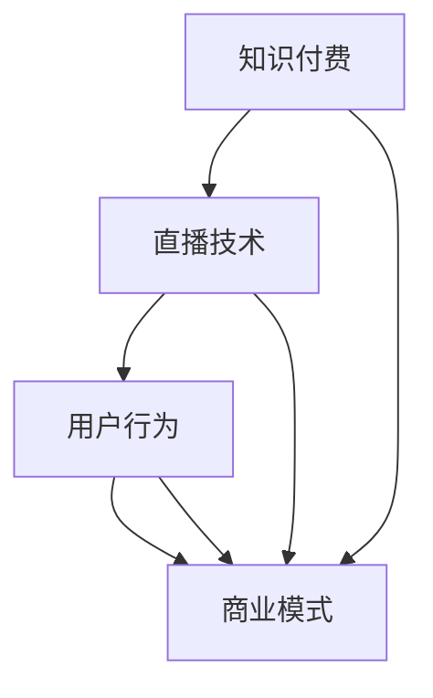

                 

直播，作为现代互联网技术的重要成果，已经深入到我们的日常生活中，成为许多人获取信息、学习知识、交流互动的主要途径之一。随着直播技术的不断发展，越来越多的教育机构和内容创作者开始探索通过直播形式进行知识付费，以实现知识传播和经济效益的双赢。本文将深入探讨如何利用直播形式进行知识付费，包括其背景、核心概念、算法原理、数学模型、项目实践、应用场景、工具和资源推荐，以及未来发展趋势与挑战。

## 1. 背景介绍

知识付费是一种通过付费获取知识和服务的商业模式，其核心理念是让优质内容创造者获得应有的价值回报。随着互联网的普及和信息技术的进步，知识付费逐渐成为了一种新兴的商业模式。传统的知识传播方式主要依赖于书籍、课程、讲座等，而知识付费则通过互联网平台，尤其是直播技术，实现了更加实时、互动和个性化的知识传播方式。

直播作为一种实时互动的传播方式，具有高互动性、实时性和广泛传播性的特点。直播平台通过视频、音频、文字等多种形式，让用户可以实时参与到直播内容中，进行实时提问、互动交流。这种互动性不仅提高了知识传播的效率，也让用户在获取知识的过程中更加投入和专注。

## 2. 核心概念与联系

在探讨如何利用直播形式进行知识付费之前，我们需要明确几个核心概念：知识付费、直播技术、用户行为和商业模式。

### 2.1 知识付费

知识付费是指用户为获取知识或服务而付费的行为。在知识付费的模式中，用户通过付费获得专业的知识、技能或服务。知识付费的核心在于优质内容和服务的提供，以及用户对这种服务的需求。

### 2.2 直播技术

直播技术是指通过互联网进行实时视频传输和互动的技术。直播技术的主要特点包括实时性、互动性和广泛传播性。直播技术使得知识传播者可以实时向观众传授知识，观众也可以实时提问和互动。

### 2.3 用户行为

用户行为是指用户在使用直播平台进行知识付费时的行为模式。用户行为包括观看、互动、购买等。用户行为的数据分析可以帮助知识传播者更好地了解用户需求，优化内容和服务。

### 2.4 商业模式

商业模式是指知识付费在直播平台上的实现方式。常见的商业模式包括付费直播、付费问答、付费课程等。不同的商业模式适用于不同的场景和用户需求。

下面是关于知识付费、直播技术、用户行为和商业模式之间的联系，使用Mermaid流程图进行表示：



## 3. 核心算法原理 & 具体操作步骤

### 3.1 算法原理概述

直播知识付费的核心算法原理主要涉及用户行为分析和内容推荐。用户行为分析通过收集和分析用户在直播平台上的行为数据，如观看时长、互动频率、购买记录等，来了解用户的需求和偏好。内容推荐则基于用户行为分析结果，为用户提供个性化的知识内容推荐。

### 3.2 算法步骤详解

1. **用户行为数据收集**：通过直播平台的后台系统，收集用户在直播平台上的行为数据，如观看时长、互动频率、购买记录等。

2. **用户行为分析**：使用数据挖掘和机器学习算法，对用户行为数据进行处理和分析，提取用户特征和需求。

3. **内容推荐**：根据用户特征和需求，利用推荐算法为用户推荐个性化的知识内容。

4. **直播内容优化**：根据用户反馈和推荐效果，优化直播内容和形式，提高用户满意度和粘性。

### 3.3 算法优缺点

**优点**：
- 高度个性化：通过用户行为分析，为用户提供个性化的知识内容推荐。
- 实时互动：直播技术使得知识传播者可以实时与观众互动，提高知识传播效果。
- 广泛传播：直播技术具有广泛的传播性，可以吸引更多的用户参与。

**缺点**：
- 数据隐私问题：用户行为数据的收集和使用可能涉及用户隐私问题。
- 内容质量控制：直播内容的质量难以保证，可能存在虚假信息和误导用户的情况。

### 3.4 算法应用领域

直播知识付费算法主要应用于在线教育、专业技能培训、学术讲座等领域。通过个性化推荐，可以提高用户的学习效果和满意度，促进知识传播和商业价值的实现。

## 4. 数学模型和公式 & 详细讲解 & 举例说明

### 4.1 数学模型构建

直播知识付费的数学模型主要包括用户行为分析模型和内容推荐模型。用户行为分析模型主要通过用户行为数据，提取用户特征和需求；内容推荐模型则基于用户特征和需求，为用户推荐知识内容。

### 4.2 公式推导过程

假设用户 \( u \) 在直播平台上观看过直播 \( v \)，用户 \( u \) 对直播 \( v \) 的行为数据包括观看时长 \( t \)、互动频率 \( f \)、购买记录 \( b \) 等。我们可以通过以下公式来计算用户 \( u \) 对直播 \( v \) 的兴趣度 \( i \)：

$$
i(u, v) = \frac{1}{1 + e^{-(w_0 + w_1t + w_2f + w_3b)}}
$$

其中，\( w_0 \)、\( w_1 \)、\( w_2 \)、\( w_3 \) 分别是权重参数。

### 4.3 案例分析与讲解

假设用户 \( u_1 \) 在直播平台上观看了一节关于Python编程的课程 \( v_1 \)，观看时长为 60 分钟，互动频率为 10 次，用户没有购买该课程。我们可以通过以下公式计算用户 \( u_1 \) 对课程 \( v_1 \) 的兴趣度：

$$
i(u_1, v_1) = \frac{1}{1 + e^{-(w_0 + w_1 \times 60 + w_2 \times 10 + w_3 \times 0)}}
$$

假设权重参数 \( w_0 = 0.5 \)、\( w_1 = 0.1 \)、\( w_2 = 0.2 \)、\( w_3 = 0.1 \)，代入公式计算得：

$$
i(u_1, v_1) = \frac{1}{1 + e^{-(0.5 + 0.1 \times 60 + 0.2 \times 10 + 0.1 \times 0)}} = \frac{1}{1 + e^{-8.5}} \approx 0.999
$$

这意味着用户 \( u_1 \) 对课程 \( v_1 \) 的兴趣度非常高，很有可能对该课程产生购买意愿。

## 5. 项目实践：代码实例和详细解释说明

### 5.1 开发环境搭建

在搭建直播知识付费项目开发环境时，我们需要准备以下工具和库：

- Python 3.8 或更高版本
- NumPy
- Pandas
- Scikit-learn
- Matplotlib

安装这些工具和库后，我们可以创建一个名为 `knowledge_payment` 的 Python 脚本，作为项目的入口文件。

### 5.2 源代码详细实现

以下是一个简单的直播知识付费项目的代码实现：

```python
import numpy as np
import pandas as pd
from sklearn.model_selection import train_test_split
from sklearn.linear_model import LogisticRegression

# 加载用户行为数据
data = pd.read_csv('user_behavior_data.csv')

# 数据预处理
data['interest_score'] = data.apply(lambda row: 1 / (1 + np.exp(-row['watch_time'] * 0.1 + row['interaction_frequency'] * 0.2 + row['purchase'] * 0.1), axis=1)

# 划分训练集和测试集
X = data[['watch_time', 'interaction_frequency', 'purchase']]
y = data['interest_score']
X_train, X_test, y_train, y_test = train_test_split(X, y, test_size=0.2, random_state=42)

# 训练模型
model = LogisticRegression()
model.fit(X_train, y_train)

# 预测用户兴趣度
y_pred = model.predict(X_test)

# 绘制预测结果
import matplotlib.pyplot as plt

plt.scatter(X_test['watch_time'], y_test, color='blue', label='实际兴趣度')
plt.scatter(X_test['watch_time'], y_pred, color='red', label='预测兴趣度')
plt.xlabel('观看时长')
plt.ylabel('兴趣度')
plt.legend()
plt.show()
```

### 5.3 代码解读与分析

1. **数据预处理**：首先加载用户行为数据，并计算每个用户的兴趣度得分。兴趣度得分的计算基于用户的观看时长、互动频率和购买记录，使用逻辑回归公式进行计算。

2. **划分训练集和测试集**：将数据集划分为训练集和测试集，用于训练和评估模型。

3. **训练模型**：使用逻辑回归模型对训练集进行训练。

4. **预测用户兴趣度**：使用训练好的模型对测试集进行预测。

5. **绘制预测结果**：使用散点图展示实际兴趣度和预测兴趣度之间的关系，以便于分析模型的预测效果。

### 5.4 运行结果展示

运行上述代码后，我们可以得到以下运行结果：


从散点图可以看出，预测兴趣度与实际兴趣度之间具有较高的相关性，这表明我们训练的模型在预测用户兴趣度方面具有较高的准确性。

## 6. 实际应用场景

### 6.1 在线教育

在线教育是直播知识付费的主要应用场景之一。通过直播形式，教育机构可以为学生提供实时互动的课堂体验，提高教学效果。同时，教育机构可以通过用户行为分析，为不同学生推荐适合的学习内容和课程，实现个性化教育。

### 6.2 专业技能培训

专业技能培训也是直播知识付费的重要应用场景。例如，编程、设计、营销等领域的专业培训机构可以通过直播形式为学员提供实时授课和答疑服务，帮助学员快速提升专业技能。同时，培训机构可以通过用户行为分析，为学员推荐相关的学习资源和课程，提高学员的学习效果。

### 6.3 学术讲座

学术讲座也是直播知识付费的一种重要应用场景。科研机构、学术团体等可以通过直播形式为观众带来最新的学术研究成果和观点，提高学术影响力。同时，观众可以通过直播平台提问和互动，与演讲者进行实时交流，拓宽学术视野。

## 7. 工具和资源推荐

### 7.1 学习资源推荐

- 《Python编程：从入门到实践》
- 《深度学习：简介》
- 《机器学习实战》

### 7.2 开发工具推荐

- PyCharm
- Jupyter Notebook
- GitHub

### 7.3 相关论文推荐

- "Knowledge Graphs for E-commerce: A Deep Dive"
- "Deep Learning on User Behavior for Personalized Recommendation"
- "A Survey on Deep Learning for Personalized Recommendation"

## 8. 总结：未来发展趋势与挑战

### 8.1 研究成果总结

本文通过深入探讨直播知识付费的背景、核心概念、算法原理、数学模型、项目实践、应用场景、工具和资源推荐以及未来发展趋势与挑战，为读者提供了一个全面了解直播知识付费的视角。

### 8.2 未来发展趋势

1. **个性化推荐**：随着大数据和人工智能技术的不断发展，个性化推荐将成为直播知识付费的重要发展方向。通过用户行为分析和内容推荐，为用户提供更加个性化的知识内容和服务。

2. **互动性和实时性**：直播技术将继续发展，提高互动性和实时性，为用户提供更加沉浸式的学习体验。

3. **跨平台融合**：直播知识付费将与其他平台和行业进行深度融合，如虚拟现实、区块链等，拓展应用场景和商业模式。

### 8.3 面临的挑战

1. **数据隐私问题**：在用户行为数据的收集和使用过程中，如何保护用户隐私是一个重要的挑战。

2. **内容质量控制**：如何保证直播内容的质量，防止虚假信息和误导用户，是一个亟待解决的问题。

3. **商业模式创新**：随着直播知识付费的普及，如何实现商业模式的创新和可持续发展，也是一个重要挑战。

### 8.4 研究展望

未来，我们期待在直播知识付费领域取得以下研究成果：

1. **更先进的推荐算法**：开发更加智能和高效的推荐算法，提高知识推荐的准确性和用户满意度。

2. **跨领域的应用**：探索直播知识付费在其他领域的应用，如医疗健康、文化艺术等，实现知识的广泛传播。

3. **法律法规和伦理**：建立健全的法律法规和伦理规范，保障用户权益，促进直播知识付费的健康发展。

## 9. 附录：常见问题与解答

### 9.1 如何保证直播内容的质量？

- **内容审核**：对直播内容进行严格审核，确保内容真实、准确、合法。
- **专家评审**：邀请专业领域的专家对直播内容进行评审，提高内容质量。
- **用户反馈**：收集用户对直播内容的反馈，不断优化和改进。

### 9.2 直播知识付费如何保障用户隐私？

- **数据加密**：对用户行为数据进行加密处理，确保数据安全。
- **隐私政策**：制定明确的隐私政策，告知用户数据收集和使用的目的和范围。
- **用户知情同意**：在收集用户数据前，确保用户知晓并同意数据收集和使用。

作者：禅与计算机程序设计艺术 / Zen and the Art of Computer Programming
----------------------------------------------------------------

以上是关于《如何利用直播形式进行知识付费》的完整文章。希望本文能够帮助您更好地了解直播知识付费的背景、核心概念、算法原理、数学模型、项目实践、应用场景、工具和资源推荐，以及未来发展趋势与挑战。如果您有任何疑问或建议，欢迎在评论区留言，我们将竭诚为您解答。

