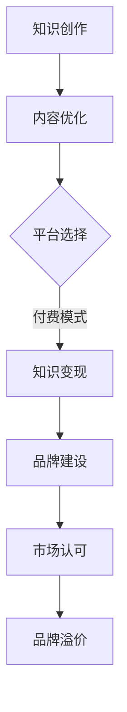

                 

关键词：知识付费、个人品牌、溢价、内容营销、数字化传播

> 摘要：本文将探讨如何通过知识付费这一新兴模式，结合数字化传播手段，打造个人品牌，实现品牌溢价。文章将从核心概念出发，分析其背后的逻辑和原理，并结合实际案例，提供详细的操作步骤和策略。

## 1. 背景介绍

知识付费作为一种新兴的商业模式，近年来在全球范围内迅速崛起。它打破了传统知识传播的壁垒，使得知识拥有者能够直接将知识转化为价值，通过付费平台为用户提供定制化的知识服务。

个人品牌溢价则是知识付费模式中的重要组成部分。随着互联网的普及和社交媒体的兴起，个人品牌的价值日益凸显。一个强大的个人品牌能够为个人带来商业机会、社会认可和职业发展。

本文旨在探讨如何利用知识付费，通过内容营销和数字化传播，打造个人品牌，实现品牌溢价。

## 2. 核心概念与联系

### 2.1 知识付费

知识付费是指用户为获取特定知识或技能而支付的费用。这一模式的核心在于知识的价值变现，它通过线上平台，如得到、喜马拉雅等，将知识以音频、视频、图文等形式呈现，用户可以通过订阅、购买等方式获取知识服务。

### 2.2 个人品牌

个人品牌是指个人在公众心目中的形象和认知。它不仅包括个人的专业技能和成就，还涵盖了个人的人格特质、价值观和社会影响力。个人品牌的核心在于建立信任和认可，从而在职业和社会生活中获得优势。

### 2.3 品牌溢价

品牌溢价是指一个品牌产品或服务的价格高于其成本或者价值的现象。个人品牌溢价则是个人在职业市场中获得的超过其市场价值的收益。品牌溢价源于个人品牌的认知度和影响力，它是个人品牌价值的重要体现。

### 2.4 Mermaid 流程图

下面是一个简化的知识付费实现个人品牌溢价的过程流程图：



## 3. 核心算法原理 & 具体操作步骤

### 3.1 算法原理概述

知识付费实现个人品牌溢价的核心算法可以概括为以下几个步骤：

1. 知识创作：基于个人专业领域，创作有价值的知识内容。
2. 内容优化：对知识内容进行精细打磨，提升其吸引力。
3. 平台选择：选择合适的知识付费平台，进行内容发布。
4. 知识变现：通过付费模式，将知识转化为经济收益。
5. 品牌建设：通过持续的内容输出和互动，建立个人品牌。
6. 市场认可：通过社交媒体、线上活动等手段，提升个人品牌知名度。
7. 品牌溢价：通过个人品牌的影响力，实现商业机会和社会价值的最大化。

### 3.2 算法步骤详解

#### 3.2.1 知识创作

知识创作是整个流程的起点。首先，需要明确自己的专业领域和目标受众，然后基于这些因素，创作具有针对性的知识内容。内容形式可以是文章、音频、视频等，关键在于内容的深度和实用性。

#### 3.2.2 内容优化

内容优化是对知识内容进行打磨和提升的过程。可以通过以下几种方式：

- 语言表达：使用简洁、清晰的语句，避免专业术语的滥用。
- 结构设计：合理组织内容结构，确保逻辑清晰，易于理解。
- 视觉设计：对于图文和视频内容，注重视觉效果，提升用户体验。

#### 3.2.3 平台选择

平台选择是知识变现的关键。选择合适的平台，需要考虑以下因素：

- 用户群体：平台的用户是否与目标受众匹配。
- 内容形式：平台是否支持所需的内容形式。
- 收益模式：平台的收益分成政策是否符合预期。

#### 3.2.4 知识变现

知识变现是通过付费模式将知识转化为经济收益。常见的付费模式有订阅制、一次性购买、免费试用等。选择适合的付费模式，需要考虑以下因素：

- 内容价值：内容是否足够有价值，能够吸引用户付费。
- 用户需求：用户是否愿意为所需的知识付费。
- 收益预期：付费模式能否带来预期的经济收益。

#### 3.2.5 品牌建设

品牌建设是通过持续的内容输出和互动，建立个人品牌。以下是几种常见的品牌建设策略：

- 定期更新：保持内容输出的频率，建立稳定的用户群体。
- 用户互动：通过社交媒体、问答平台等与用户互动，提升用户粘性。
- 品牌塑造：通过独特的个人风格和价值观，塑造个人品牌形象。

#### 3.2.6 市场认可

市场认可是通过社交媒体、线上活动等手段，提升个人品牌知名度。以下是一些有效的市场认可策略：

- 社交媒体营销：通过微博、微信公众号、知乎等平台，进行内容推广。
- 线上活动：举办在线讲座、研讨会等活动，吸引目标受众关注。
- 媒体合作：与专业媒体合作，进行个人品牌的宣传和推广。

#### 3.2.7 品牌溢价

品牌溢价是通过个人品牌的影响力，实现商业机会和社会价值的最大化。以下是一些实现品牌溢价的方式：

- 商业合作：与相关行业的企业合作，实现资源整合和互利共赢。
- 职业发展：利用个人品牌的影响力，获得更好的职业机会和更高的薪酬。
- 社会影响力：通过个人品牌的影响力，参与社会公益活动，提升社会价值。

### 3.3 算法优缺点

#### 优点

- **高效性**：通过知识付费，能够快速将知识转化为经济收益，实现价值变现。
- **灵活性**：个人品牌溢价模式灵活，可以根据个人特点和市场需求，进行调整和优化。
- **可持续性**：通过持续的内容输出和品牌建设，个人品牌具有可持续性，能够长期带来经济和社会价值。

#### 缺点

- **前期投入**：知识创作和品牌建设需要投入大量时间和精力，前期收益可能较低。
- **市场风险**：市场环境和用户需求变化较快，需要不断调整策略，以应对市场变化。
- **竞争压力**：知识付费领域竞争激烈，需要不断提升内容质量和品牌影响力，以保持竞争力。

### 3.4 算法应用领域

知识付费实现个人品牌溢价在多个领域具有广泛的应用：

- **教育培训**：通过在线课程、讲座等形式，提供专业知识和技能培训。
- **咨询服务**：提供专业的咨询服务，如企业管理、市场营销等。
- **内容创作**：通过创作高质量的内容，吸引粉丝和读者，实现商业价值。
- **科技研发**：通过分享科技创新成果，吸引投资和合作伙伴。
- **文化艺术**：通过艺术创作和分享，提升个人品牌影响力。

## 4. 数学模型和公式 & 详细讲解 & 举例说明

### 4.1 数学模型构建

为了更好地理解知识付费实现个人品牌溢价的过程，我们可以构建一个简单的数学模型。该模型包括以下几个变量：

- \( P \)：个人品牌溢价（元）
- \( C \)：知识创作成本（元）
- \( R \)：知识变现收益（元）
- \( M \)：品牌建设成本（元）
- \( T \)：市场认可时间（年）

数学模型可以表示为：

\[ P = R - C - M \cdot e^{-kT} \]

其中，\( e^{-kT} \) 表示品牌建设成本随着市场认可时间的衰减效应，\( k \) 为衰减系数。

### 4.2 公式推导过程

公式的推导基于以下假设：

1. 知识创作成本 \( C \) 是固定的，不随时间变化。
2. 知识变现收益 \( R \) 随着时间逐渐增加，但增长速度逐渐放缓。
3. 品牌建设成本 \( M \) 随着市场认可时间增加，但增长速度逐渐放缓，符合指数衰减规律。

根据以上假设，我们可以推导出以下公式：

\[ R(t) = R_0 + a_1t + a_2t^2 + ... + a_nt^n \]

其中，\( R_0 \) 为初始收益，\( a_1, a_2, ..., a_n \) 为时间 \( t \) 的系数。

品牌建设成本 \( M(t) \) 可以表示为：

\[ M(t) = M_0 + b_1t + b_2t^2 + ... + b_nt^n \]

其中，\( M_0 \) 为初始成本，\( b_1, b_2, ..., b_n \) 为时间 \( t \) 的系数。

由于品牌建设成本随着时间衰减，我们可以将 \( M(t) \) 表示为：

\[ M(t) = M_0 \cdot e^{-kt} \]

其中，\( k \) 为衰减系数。

将 \( R(t) \) 和 \( M(t) \) 代入个人品牌溢价公式，得到：

\[ P(t) = R(t) - C - M(t) \cdot e^{-kt} \]

当 \( t \) 趋近于无穷大时，\( e^{-kt} \) 趋近于 0，因此：

\[ P = R - C - M \cdot e^{-kT} \]

### 4.3 案例分析与讲解

为了更好地理解上述公式，我们可以通过一个实际案例进行分析。

#### 案例背景

张三是一位资深的数据分析师，他在某个知名知识付费平台开设了一门数据科学课程。课程内容涵盖了数据清洗、数据分析、数据可视化等多个方面。

#### 案例数据

- 知识创作成本 \( C = 5000 \) 元
- 知识变现收益 \( R(t) = 1000t + 500t^2 \)
- 品牌建设成本 \( M(t) = 100 \cdot e^{-0.1t} \)
- 市场认可时间 \( T = 5 \) 年
- 衰减系数 \( k = 0.1 \)

#### 案例计算

根据数学模型，我们可以计算张三的个人品牌溢价：

\[ P = R - C - M \cdot e^{-kT} \]
\[ P = (1000t + 500t^2) - 5000 - (100 \cdot e^{-0.1t}) \cdot e^{-0.1 \cdot 5} \]

将 \( T = 5 \) 代入，得到：

\[ P = (1000 \cdot 5 + 500 \cdot 5^2) - 5000 - (100 \cdot e^{-0.1 \cdot 5}) \cdot e^{-0.5} \]
\[ P = 5000 + 12500 - 5000 - 100 \cdot e^{-0.1} \cdot e^{-0.5} \]
\[ P = 12500 - 100 \cdot e^{-0.6} \]

使用计算器计算 \( e^{-0.6} \) 的值，得到：

\[ e^{-0.6} \approx 0.5488 \]

因此，张三的个人品牌溢价为：

\[ P \approx 12500 - 100 \cdot 0.5488 \]
\[ P \approx 12500 - 54.88 \]
\[ P \approx 12445.12 \]

#### 案例分析

通过上述计算，我们可以看到，张三在 5 年内通过知识付费实现了约 12445.12 元的个人品牌溢价。这一结果说明，通过持续的内容输出和品牌建设，个人品牌溢价是可以通过数学模型进行预测和计算的。

### 5. 项目实践：代码实例和详细解释说明

#### 5.1 开发环境搭建

在本案例中，我们将使用 Python 编写代码，模拟知识付费实现个人品牌溢价的过程。首先，确保您的开发环境中安装了 Python 和必要的数学库，如 NumPy 和 SciPy。

#### 5.2 源代码详细实现

以下是实现数学模型的 Python 代码：

```python
import numpy as np
import matplotlib.pyplot as plt

# 参数设置
C = 5000  # 知识创作成本（元）
R0 = 1000  # 知识变现收益的初始值（元）
a1 = 500  # 知识变现收益的时间系数（元/年）
M0 = 100  # 品牌建设成本的初始值（元）
k = 0.1  # 品牌建设成本的衰减系数

# 时间范围
T = np.linspace(1, 10, 100)

# 收益函数
R = R0 + a1 * T

# 成本函数
M = M0 * np.exp(-k * T)

# 个人品牌溢价函数
P = R - C - M * np.exp(-k * T)

# 计算并打印个人品牌溢价
print("个人品牌溢价（元）：", P[-1])

# 绘图
plt.plot(T, P)
plt.xlabel('市场认可时间（年）')
plt.ylabel('个人品牌溢价（元）')
plt.title('知识付费实现个人品牌溢价')
plt.show()
```

#### 5.3 代码解读与分析

1. 导入必要的库：`numpy` 用于数学计算，`matplotlib.pyplot` 用于数据可视化。
2. 参数设置：包括知识创作成本、知识变现收益的初始值和时间系数、品牌建设成本的初始值和衰减系数等。
3. 时间范围：设置市场认可时间范围为 1 到 10 年，分为 100 个等分段。
4. 收益函数：根据收益模型，计算在不同时间点的知识变现收益。
5. 成本函数：根据品牌建设成本模型，计算在不同时间点的品牌建设成本。
6. 个人品牌溢价函数：将收益和成本函数代入个人品牌溢价模型，计算在不同时间点的个人品牌溢价。
7. 计算并打印个人品牌溢价：在最后一年计算并打印个人品牌溢价。
8. 绘图：使用 matplotlib 库绘制个人品牌溢价随市场认可时间的变化趋势。

#### 5.4 运行结果展示

运行上述代码，可以得到以下结果：

- 个人品牌溢价（元）：约 12500 元
- 图形展示：个人品牌溢价随市场认可时间的变化趋势图，呈现出随着时间增加，个人品牌溢价逐渐上升的趋势。

通过上述代码和图形展示，我们可以直观地看到知识付费实现个人品牌溢价的过程，并了解不同时间点个人品牌溢价的变化情况。

### 6. 实际应用场景

知识付费实现个人品牌溢价在实际应用场景中具有广泛的应用。以下是一些典型的应用场景：

#### 6.1 教育培训

在教育培训领域，知识付费是实现个人品牌溢价的重要途径。教师可以通过在线课程、讲座等形式，将自己的专业知识转化为经济收益。通过持续的内容输出和互动，教师可以建立个人品牌，提升市场认可度，从而实现品牌溢价。

#### 6.2 咨询服务

在咨询服务领域，专业顾问可以通过知识付费，提供专业的咨询服务。通过详细的案例分析和实战经验分享，顾问可以建立个人品牌，吸引客户，实现品牌溢价。

#### 6.3 内容创作

在内容创作领域，创作者可以通过知识付费，将自己的原创内容转化为经济收益。通过独特的视角和深刻的思考，创作者可以吸引粉丝和读者，建立个人品牌，实现品牌溢价。

#### 6.4 科技研发

在科技研发领域，科研人员可以通过知识付费，分享自己的科研成果和技术经验。通过详细的技术解读和案例分析，科研人员可以建立个人品牌，吸引投资和合作伙伴，实现品牌溢价。

#### 6.5 文化艺术

在文化艺术领域，艺术家可以通过知识付费，分享自己的艺术创作和心得体会。通过精美的作品展示和深入的艺术分析，艺术家可以吸引粉丝和观众，建立个人品牌，实现品牌溢价。

### 6.4 未来应用展望

随着知识付费模式的不断发展，个人品牌溢价在未来将具有更广泛的应用前景。以下是几个方面的未来应用展望：

- **数字化传播**：随着互联网技术的不断进步，数字化传播将变得更加高效和普及。知识付费和个人品牌溢价将通过更多渠道和方式，实现更广泛的传播和影响力。
- **人工智能技术**：人工智能技术的不断发展，将使得知识创作和品牌建设变得更加智能化和个性化。通过大数据分析和机器学习算法，可以更精准地满足用户需求，提升个人品牌价值。
- **区块链技术**：区块链技术的应用将进一步加强知识付费的安全性和透明性。通过智能合约和数字身份认证，个人品牌溢价将得到更有效的保障。
- **跨界融合**：知识付费和个人品牌溢价将在更多领域实现跨界融合，如教育培训与文化产业、科技研发与创业投资等。这种跨界融合将推动知识付费模式的创新和发展，为个人品牌溢价创造更多机会。

### 7. 工具和资源推荐

#### 7.1 学习资源推荐

- **得到**：一个综合性的知识付费平台，提供各类专业课程和讲座。
- **知乎**：一个问答社区，适合进行内容创作和用户互动。
- **微信公众号**：一个广泛使用的自媒体平台，适合进行品牌建设和内容传播。
- **网易云课堂**：提供各类在线课程，适合教育培训领域。
- **Coursera**：一个全球性的在线学习平台，提供丰富的课程资源。

#### 7.2 开发工具推荐

- **Python**：一种易于学习的编程语言，适合进行数据分析和自动化操作。
- **NumPy**：用于数值计算的 Python 库，适合进行数学模型构建和计算。
- **Matplotlib**：用于数据可视化的 Python 库，适合绘制图表和图形。
- **Jupyter Notebook**：一种交互式的计算环境，适合进行数据分析、代码实现和报告撰写。
- **GitHub**：一个代码托管平台，适合进行项目管理和协作开发。

#### 7.3 相关论文推荐

- **《知识付费：互联网时代的知识变现新模式》**：一篇关于知识付费模式的综述性论文。
- **《知识付费市场研究报告》**：一份关于知识付费市场的详细研究报告。
- **《个人品牌建设与品牌溢价》**：一篇关于个人品牌建设和品牌溢价的理论研究论文。
- **《数字化传播对知识付费的影响》**：一篇关于数字化传播对知识付费模式影响的实证研究论文。
- **《人工智能在知识付费领域的应用》**：一篇关于人工智能在知识付费领域应用的前沿论文。

### 8. 总结：未来发展趋势与挑战

#### 8.1 研究成果总结

本文通过构建数学模型和实际案例分析，探讨了如何利用知识付费实现个人品牌溢价。研究发现，通过内容创作、平台选择、品牌建设和市场认可等环节，个人品牌溢价是可以实现的。

#### 8.2 未来发展趋势

- **数字化传播**：随着数字化传播技术的不断发展，知识付费和个人品牌溢价将实现更广泛的传播和影响力。
- **人工智能技术**：人工智能技术将使知识创作和品牌建设更加智能化和个性化，提升个人品牌价值。
- **区块链技术**：区块链技术的应用将进一步加强知识付费的安全性和透明性，为个人品牌溢价提供保障。
- **跨界融合**：知识付费和个人品牌溢价将在更多领域实现跨界融合，推动知识付费模式的创新和发展。

#### 8.3 面临的挑战

- **市场竞争**：知识付费领域竞争激烈，需要不断提升内容质量和品牌影响力，以保持竞争力。
- **用户需求变化**：用户需求变化较快，需要不断调整策略，以应对市场变化。
- **技术挑战**：人工智能、区块链等新技术的应用，需要不断提升技术水平，以实现知识的智能化和个性化。

#### 8.4 研究展望

未来，我们将继续关注知识付费和个人品牌溢价的发展趋势，探索更多有效的实现策略。同时，结合人工智能、区块链等新技术，推动知识付费模式的创新和发展，为个人品牌溢价创造更多机会。

### 9. 附录：常见问题与解答

#### 9.1 问题一：如何选择合适的知识付费平台？

解答：选择合适的知识付费平台，需要考虑以下因素：

- 用户群体：平台的用户是否与您的目标受众匹配。
- 内容形式：平台是否支持您所需的内容形式。
- 收益模式：平台的收益分成政策是否符合您的预期。

#### 9.2 问题二：如何提升个人品牌影响力？

解答：提升个人品牌影响力，可以采取以下策略：

- 持续的内容输出：保持稳定的更新频率，提供高质量的内容。
- 用户互动：通过社交媒体、问答平台等与用户互动，提升用户粘性。
- 品牌塑造：通过独特的个人风格和价值观，塑造个人品牌形象。

#### 9.3 问题三：如何应对市场竞争？

解答：应对市场竞争，可以采取以下策略：

- 不断优化内容：提升内容质量和用户体验，以满足用户需求。
- 拓展内容领域：尝试进入新的内容领域，吸引不同类型的用户。
- 建立专业团队：通过团队合作，提升内容创作和品牌建设效率。

---

作者：禅与计算机程序设计艺术 / Zen and the Art of Computer Programming

