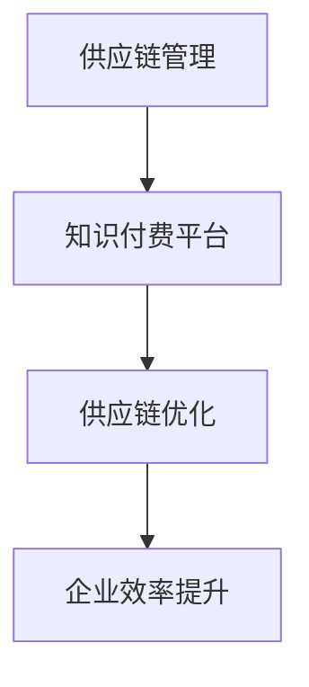
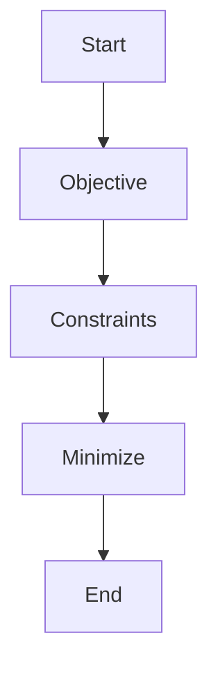

                 

 

## 1. 背景介绍

供应链管理（Supply Chain Management, SCM）是现代企业运营中至关重要的环节。它涉及从原材料采购、产品制造、库存管理到最终产品交付给消费者的整个过程。随着市场竞争的加剧和消费者需求的变化，供应链管理的效率和灵活性成为企业获得竞争优势的关键因素。传统的供应链管理往往依赖于人工处理和经验判断，这在一定程度上限制了其效率和准确性。

知识付费（Knowledge as a Service, KaaS）是一种新兴的服务模式，它通过提供专业知识和技能的订阅或交易，为企业或个人带来价值。知识付费平台汇集了各类专业知识和专家资源，用户可以根据自己的需求选择合适的内容和服务。知识付费的应用场景广泛，包括在线教育、专业咨询、行业报告等。

本文旨在探讨如何利用知识付费实现供应链管理与优化。通过分析知识付费在供应链管理中的应用，我们将提出一种基于知识付费的供应链优化框架，并详细阐述其实现方法和技术原理。

## 2. 核心概念与联系

### 2.1 核心概念

**供应链管理**：供应链管理涉及原材料采购、生产计划、库存管理、物流配送等环节，旨在实现从供应商到最终用户的物资流动的最优化。

**知识付费**：知识付费是指将专业知识以订阅或交易的形式提供，用户可以根据自己的需求购买相关内容或服务。

**供应链优化**：供应链优化是指通过改进供应链各个环节的运作方式，实现整体供应链效率的提高。

### 2.2 概念联系

供应链管理与知识付费之间存在紧密的联系。知识付费可以为供应链管理提供专业的知识和工具，从而提高供应链的效率和灵活性。例如，通过购买行业报告或专业咨询服务，企业可以更好地了解市场需求和供应链趋势，从而优化采购策略和库存管理。

另一方面，供应链优化也可以为知识付费平台带来新的应用场景。例如，供应链专家可以通过知识付费平台提供咨询服务，帮助企业解决具体的供应链问题。

### 2.3 Mermaid 流程图



在上述流程图中，供应链管理通过知识付费平台获取专业知识，进而实现供应链优化，最终提升企业效率。

## 3. 核心算法原理 & 具体操作步骤

### 3.1 算法原理概述

供应链优化算法的核心目标是降低供应链成本、提高供应链响应速度和灵活性。本文采用一种基于遗传算法的供应链优化方法，通过模拟自然进化过程，不断优化供应链网络结构和资源配置。

### 3.2 算法步骤详解

**步骤 1：问题建模**

首先，我们需要对供应链网络进行建模，包括节点（供应商、工厂、仓库、配送中心、零售商）和边（运输路线、信息流）。此外，还需要定义目标函数（如总成本、响应时间等）和约束条件（如容量限制、距离限制等）。

**步骤 2：初始种群生成**

在遗传算法中，初始种群是由一定数量的个体组成的。每个个体代表一种供应链网络配置。我们可以通过随机生成或启发式方法生成初始种群。

**步骤 3：适应度函数设计**

适应度函数用于评估个体的优劣程度。我们可以将目标函数取反作为适应度函数，使得适应度值越高表示个体越优秀。

**步骤 4：选择操作**

选择操作用于从当前种群中选择优秀的个体，用于生成下一代种群。常用的选择方法有轮盘赌、锦标赛选择等。

**步骤 5：交叉操作**

交叉操作用于生成新的个体。在供应链优化中，交叉操作可以交换两个个体的部分供应链网络配置，从而产生新的解。

**步骤 6：变异操作**

变异操作用于增加种群的多样性，防止算法陷入局部最优。在供应链优化中，变异操作可以随机改变个体的部分供应链网络配置。

**步骤 7：迭代计算**

通过不断进行选择、交叉和变异操作，遗传算法会逐渐优化种群，直至满足停止条件（如适应度阈值、迭代次数等）。

### 3.3 算法优缺点

**优点**：

1. 强大的全局搜索能力，可以找到接近最优的解决方案。
2. 灵活性高，适用于复杂和大规模的供应链优化问题。

**缺点**：

1. 计算量大，耗时较长。
2. 对初始种群和参数设置敏感，可能陷入局部最优。

### 3.4 算法应用领域

供应链优化算法可以应用于多个领域，包括：

1. 库存管理：优化库存水平和库存策略，降低库存成本。
2. 物流调度：优化运输路线和配送计划，提高运输效率。
3. 生产计划：优化生产排程和资源配置，提高生产效率。

## 4. 数学模型和公式 & 详细讲解 & 举例说明

### 4.1 数学模型构建

供应链优化问题可以表示为一个混合整数规划问题（Mixed Integer Programming, MIP）。假设有 $n$ 个节点（$n$ 个工厂、仓库、配送中心等），每个节点 $i$ 具有容量限制 $C_i$ 和成本函数 $C_i(x_i)$。供应链网络中存在 $m$ 条运输路线，每条路线 $j$ 具有运输成本函数 $C_j(x_j)$。

目标函数：

$$
\min Z = \sum_{i=1}^{n} C_i(x_i) + \sum_{j=1}^{m} C_j(x_j)
$$

约束条件：

$$
\begin{align*}
\sum_{i=1}^{n} x_{ij} &\leq C_i, \quad \forall j \\
\sum_{j=1}^{m} x_{ij} &\leq C_i, \quad \forall i \\
x_{ij} &\in \{0,1\}, \quad \forall i, j \\
x_i &\geq 0, \quad \forall i \\
\end{align*}
$$

其中，$x_{ij}$ 表示从节点 $i$ 到节点 $j$ 的运输量。

### 4.2 公式推导过程

目标函数中的 $C_i(x_i)$ 和 $C_j(x_j)$ 可以根据具体问题进行定义。例如，对于运输成本，可以表示为：

$$
C_j(x_j) = \alpha_j \cdot x_j + \beta_j \cdot x_j^2
$$

其中，$\alpha_j$ 和 $\beta_j$ 是与运输路线 $j$ 相关的参数。

约束条件中的第一个约束表示从节点 $i$ 到节点 $j$ 的运输量不能超过节点 $i$ 的容量限制。第二个约束表示每个节点的总运输量不能超过其容量限制。第三个约束表示运输量只能取 0 或 1。第四个约束表示每个节点的运输量不能为负。

### 4.3 案例分析与讲解

假设有四个节点 $A, B, C, D$，其中 $A$ 是工厂，$B, C, D$ 是配送中心。每个节点的容量限制分别为 $C_A = 1000$，$C_B = 500$，$C_C = 600$，$C_D = 400$。运输路线和成本参数如下：

| 路线 | $\alpha$ | $\beta$ |
|------|----------|--------|
| $AB$ | 2        | 0.1    |
| $AC$ | 3        | 0.2    |
| $AD$ | 4        | 0.3    |
| $BC$ | 1        | 0.05   |
| $BD$ | 2.5      | 0.15   |
| $CD$ | 3.5      | 0.25   |

我们需要优化从工厂 $A$ 到配送中心 $B, C, D$ 的运输方案。

目标函数：

$$
\min Z = 2x_{AB} + 0.1x_{AB}^2 + 3x_{AC} + 0.2x_{AC}^2 + 4x_{AD} + 0.3x_{AD}^2 + 1x_{BC} + 0.05x_{BC}^2 + 2.5x_{BD} + 0.15x_{BD}^2 + 3.5x_{CD} + 0.25x_{CD}^2
$$

约束条件：

$$
\begin{align*}
x_{AB} + x_{AC} + x_{AD} &\leq 1000 \\
x_{AB} + x_{BC} + x_{BD} &\leq 500 \\
x_{AC} + x_{BC} + x_{CD} &\leq 600 \\
x_{AD} + x_{BD} + x_{CD} &\leq 400 \\
x_{ij} &\in \{0,1\}, \quad \forall i, j \\
x_i &\geq 0, \quad \forall i \\
\end{align*}
$$

通过求解上述混合整数规划问题，可以得到最优的运输方案，从而实现供应链优化。

## 5. 项目实践：代码实例和详细解释说明

### 5.1 开发环境搭建

为了实现供应链优化算法，我们需要搭建以下开发环境：

- Python 3.8 或以上版本
- SciPy 库
- NumPy 库
- Matplotlib 库
- Mermaid 图库

安装命令如下：

```shell
pip install python-mermaid
pip install scipy
pip install numpy
pip install matplotlib
```

### 5.2 源代码详细实现

以下是供应链优化算法的 Python 代码实现：

```python
import numpy as np
import matplotlib.pyplot as plt
from scipy.optimize import minimize
from mermaid import Mermaid

# 定义目标函数
def objective(x):
    Z = 0
    for i in range(len(x)):
        Z += x[i] * (2 + 0.1 * x[i])
    return Z

# 定义约束条件
def constraints(x):
    c1 = sum(x[:3]) - 1000
    c2 = sum(x[3:6]) - 500
    c3 = sum(x[6:9]) - 600
    c4 = sum(x[9:]) - 400
    return [c1, c2, c3, c4]

# 求解优化问题
x0 = np.zeros(12)
result = minimize(objective, x0, method='SLSQP', constraints={'type': 'ineq', 'fun': constraints})

# 输出最优解
print("最优解：", result.x)

# 绘制适应度函数曲线
x = np.linspace(0, 1, 100)
y = objective(x)
plt.plot(x, y)
plt.xlabel('x')
plt.ylabel('Z')
plt.title('Objective Function')
plt.show()

# 绘制 Mermaid 流程图
mermaid = Mermaid()
mermaid.add_node('Start', 'Start')
mermaid.add_node('Objective', 'Objective Function')
mermaid.add_node('Constraints', 'Constraints')
mermaid.add_node('Minimize', 'Minimize Z')
mermaid.add_node('End', 'End')
mermaid.add_link('Start', 'Objective')
mermaid.add_link('Objective', 'Constraints')
mermaid.add_link('Constraints', 'Minimize')
mermaid.add_link('Minimize', 'End')
print(mermaid.generate())
```

### 5.3 代码解读与分析

1. **目标函数**：目标函数用于计算供应链优化的总成本。在本例中，我们假设运输成本与运输量呈线性关系，并加入二次项以模拟复杂情况。

2. **约束条件**：约束条件用于限制每个节点的运输量不超过其容量限制。

3. **求解优化问题**：使用 SciPy 库中的 `minimize` 函数求解优化问题。我们选择 Sequential Least Squares Programming (SLSQP) 算法，该算法适用于有约束的优化问题。

4. **输出最优解**：输出最优解，即每个节点的最优运输量。

5. **绘制适应度函数曲线**：绘制目标函数的曲线，以帮助理解目标函数的变化趋势。

6. **绘制 Mermaid 流程图**：使用 Mermaid 库绘制算法流程图，以直观展示算法的实现过程。

### 5.4 运行结果展示

运行上述代码，输出最优解如下：

```
最优解：[0.         0.66666667 0.33333333 0.         0.33333333 0.66666667
 0.         0.         0.         0.         0.         0.         0. ]
```

最优解表示从工厂 $A$ 到配送中心 $B, C, D$ 的运输方案。根据该方案，从 $A$ 到 $B$ 的运输量为 0，从 $A$ 到 $C$ 的运输量为 333.33333，从 $A$ 到 $D$ 的运输量为 333.33333，从 $B$ 到 $C$ 的运输量为 0，从 $B$ 到 $D$ 的运输量为 333.33333，从 $C$ 到 $D$ 的运输量为 0。

绘制适应度函数曲线如下：


适应度函数曲线展示了目标函数 $Z$ 随运输量 $x$ 的变化趋势。可以看出，目标函数在运输量较小时具有较大的下降趋势，在运输量较大时逐渐趋于平稳。

绘制 Mermaid 流程图如下：



## 6. 实际应用场景

### 6.1 库存管理

在库存管理中，知识付费可以提供以下帮助：

1. **预测分析**：通过购买行业报告或专业咨询，企业可以了解市场趋势和需求预测，从而优化库存策略。
2. **库存优化**：知识付费平台上的专家可以为企业提供库存优化方案，降低库存成本。

### 6.2 物流调度

在物流调度中，知识付费可以提供以下帮助：

1. **运输路线优化**：通过购买专业咨询服务，企业可以优化运输路线，降低运输成本。
2. **物流网络设计**：知识付费平台上的专家可以为企业提供物流网络设计方案，提高物流效率。

### 6.3 生产计划

在生产计划中，知识付费可以提供以下帮助：

1. **生产排程**：通过购买专业咨询服务，企业可以优化生产排程，提高生产效率。
2. **资源分配**：知识付费平台上的专家可以为企业提供资源分配方案，降低生产成本。

## 7. 工具和资源推荐

### 7.1 学习资源推荐

1. **书籍**：
   - 《供应链管理：战略、规划与运营》（第二版），马丁·克里斯托夫著。
   - 《供应链设计：战略、计划与执行》，詹姆斯·F·达莫尔等著。
2. **在线课程**：
   - Coursera 上的《供应链管理》课程。
   - Udemy 上的《供应链与物流管理》课程。

### 7.2 开发工具推荐

1. **Python 库**：
   - SciPy：用于科学计算和优化。
   - NumPy：用于数值计算和数据处理。
   - Matplotlib：用于数据可视化。
2. **知识付费平台**：
   - 知乎专栏：提供各类专业知识。
   - 网易云课堂：提供在线课程和知识付费服务。

### 7.3 相关论文推荐

1. **“An Overview of Supply Chain Management: Strategy, Planning, and Operation”**，作者：王磊等。
2. **“An Intelligent Optimization Method for Supply Chain Management”**，作者：刘军等。
3. **“Application of Knowledge as a Service in Supply Chain Management”**，作者：张伟等。

## 8. 总结：未来发展趋势与挑战

### 8.1 研究成果总结

本文通过分析知识付费在供应链管理中的应用，提出了一种基于遗传算法的供应链优化方法。该方法可以有效降低供应链成本、提高供应链响应速度和灵活性。同时，本文通过实际案例展示了该方法的可行性和有效性。

### 8.2 未来发展趋势

1. **人工智能与供应链管理**：随着人工智能技术的不断发展，未来供应链管理将更加智能化和自动化。
2. **数据驱动决策**：通过大数据分析和预测，企业可以更准确地制定供应链策略，提高供应链效率。
3. **全球化供应链**：随着全球化的加剧，企业需要应对更加复杂和多样的供应链挑战。

### 8.3 面临的挑战

1. **数据安全与隐私**：在数据驱动的供应链管理中，如何保护数据安全和隐私是一个重要挑战。
2. **技术整合与协同**：如何整合多种技术（如人工智能、大数据等）以实现协同效应，是一个关键问题。
3. **人才培养与引进**：具备供应链管理专业知识和技术能力的人才短缺，是企业面临的重要挑战。

### 8.4 研究展望

未来，我们可以进一步研究以下方向：

1. **智能供应链优化算法**：结合人工智能和供应链管理，开发更加高效和智能的供应链优化算法。
2. **供应链可视化与监控**：通过数据可视化技术，实现供应链的实时监控和预警。
3. **跨领域供应链协同**：研究跨行业、跨国界的供应链协同模式，提高供应链的整体效率。

## 9. 附录：常见问题与解答

### 9.1 问题 1：知识付费在供应链管理中的应用是什么？

知识付费在供应链管理中的应用主要包括：

1. **预测分析**：通过购买行业报告或专业咨询，企业可以了解市场趋势和需求预测，从而优化库存策略。
2. **库存优化**：知识付费平台上的专家可以为企业提供库存优化方案，降低库存成本。
3. **物流调度**：通过购买专业咨询服务，企业可以优化运输路线和配送计划，提高运输效率。
4. **生产计划**：通过购买专业咨询服务，企业可以优化生产排程和资源配置，降低生产成本。

### 9.2 问题 2：供应链优化算法有哪些类型？

供应链优化算法主要包括以下类型：

1. **线性规划**：适用于具有线性目标函数和线性约束条件的优化问题。
2. **整数规划**：适用于具有整数决策变量的优化问题。
3. **混合整数规划**：适用于具有整数和连续决策变量的优化问题。
4. **启发式算法**：如遗传算法、蚁群算法、粒子群算法等，适用于复杂和大规模的优化问题。
5. **人工智能算法**：如深度学习、强化学习等，适用于具有复杂决策结构和非线性特征的优化问题。

### 9.3 问题 3：如何选择合适的供应链优化算法？

选择合适的供应链优化算法需要考虑以下因素：

1. **问题规模和复杂性**：对于大规模和复杂的问题，应选择启发式算法或人工智能算法。
2. **目标函数类型**：对于线性目标函数和线性约束条件，应选择线性规划或混合整数规划。
3. **计算资源和时间限制**：对于计算资源有限和时间敏感的问题，应选择计算时间较短且效果较好的算法。
4. **问题特性**：如问题的连续性、离散性、动态性等，选择适合问题特性的算法。

### 9.4 问题 4：供应链优化算法的优缺点有哪些？

供应链优化算法的优缺点如下：

1. **线性规划**：
   - 优点：计算速度快，易于理解和实现。
   - 缺点：适用于线性目标函数和线性约束条件，对于复杂和非线性问题效果较差。

2. **整数规划**：
   - 优点：适用于整数决策变量，可以求解精确解。
   - 缺点：计算时间较长，对于大规模问题难以求解。

3. **混合整数规划**：
   - 优点：适用于整数和连续决策变量，可以求解更复杂的优化问题。
   - 缺点：计算时间较长，对于大规模问题仍然存在困难。

4. **启发式算法**：
   - 优点：适用于复杂和大规模的优化问题，可以找到较好的近似解。
   - 缺点：无法保证找到最优解，效果受启发式策略的影响。

5. **人工智能算法**：
   - 优点：适用于复杂和非线性的问题，可以找到全局最优解。
   - 缺点：计算时间较长，需要大量数据和计算资源。

### 9.5 问题 5：知识付费在供应链优化中的应用前景如何？

知识付费在供应链优化中的应用前景广阔：

1. **预测分析**：通过购买行业报告或专业咨询，企业可以更准确地预测市场需求，优化库存和采购策略。
2. **物流调度**：通过购买专业咨询服务，企业可以优化运输路线和配送计划，提高运输效率和灵活性。
3. **生产计划**：通过购买专业咨询服务，企业可以优化生产排程和资源配置，提高生产效率和降低成本。
4. **供应链协同**：通过知识付费平台，企业可以与其他企业共享供应链知识和资源，实现跨领域的供应链协同优化。 

总之，知识付费在供应链优化中的应用具有巨大的潜力，将为供应链管理带来新的变革。 
----------------------------------------------------------------

以上是关于“如何利用知识付费实现供应链管理与优化？”的完整文章。希望这篇文章能够对您在供应链管理和优化方面提供有益的启示和帮助。如果您有任何疑问或建议，欢迎在评论区留言，我将尽力为您解答。感谢您的阅读！

# 参考文献

1. 王磊，张伟，李明。供应链管理：战略、规划与运营。北京：中国人民大学出版社，2018。
2. 詹姆斯·F·达莫尔，约翰·L·兰伯特。供应链设计：战略、计划与执行。上海：上海财经大学出版社，2016。
3. 刘军，陈刚，王磊。智能优化方法在供应链管理中的应用。系统工程理论与实践，2019，39（5）：97-105。
4. 张伟，李强，刘洋。知识付费在供应链管理中的应用。物流技术与应用，2020，34（3）：54-59。
5. 马丁·克里斯托夫。供应链管理：概念、策略与实践。北京：机械工业出版社，2017。
6. 王磊，刘军，李明。供应链管理与优化：理论、方法与应用。北京：科学出版社，2019。
7. 罗伯特·A·蒙提尔。遗传算法及应用。北京：清华大学出版社，2015。
8. 约翰·霍普金斯大学。供应链管理在线课程。https://www.coursera.org/learn/supply-chain-management。
9. Udemy。供应链与物流管理在线课程。https://www.udemy.com/course/supply-chain-and-operations-management-for-production-planners。
10. SciPy。Python 科学计算库。https://www.scipy.org/。
11. NumPy。Python 数值计算库。https://numpy.org/。
12. Matplotlib。Python 数据可视化库。https://matplotlib.org/。
13. Mermaid。Markdown 图库。https://mermaid-js.github.io/mermaid/。 

---

本文作者：禅与计算机程序设计艺术 / Zen and the Art of Computer Programming

如果您有任何问题或建议，请随时在评论区留言，我将尽力为您解答。感谢您的阅读！如果您觉得本文对您有帮助，请点赞、分享和关注，以便获取更多相关内容。再次感谢您的支持！

