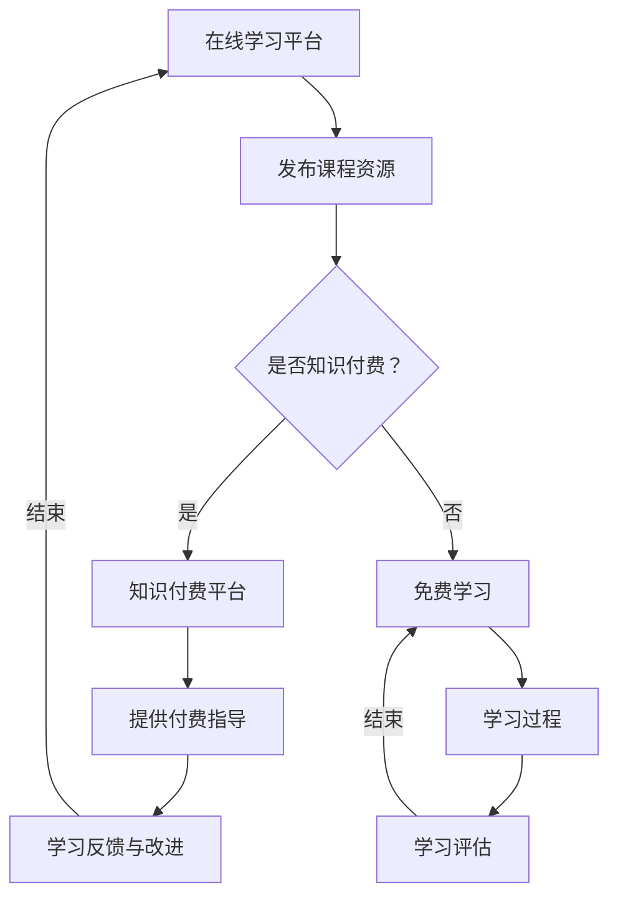

                 

  
## 1. 背景介绍

随着互联网技术的迅猛发展和智能手机的普及，在线学习逐渐成为人们获取知识和技能的一种重要方式。然而，传统的在线学习平台往往缺乏个性化指导，无法满足不同学习者的需求。为了解决这一问题，知识付费逐渐兴起，为在线学习提供了更加专业、个性化的指导。本文将探讨如何利用知识付费实现在线学习与在线学习指导，帮助学习者更高效地掌握知识和技能。

### 1.1 在线学习的发展

在线学习作为一种新型的教育方式，起源于20世纪90年代的互联网技术。随着宽带网络的普及，在线学习逐渐成为人们获取知识和技能的重要途径。目前，全球范围内的在线学习平台如雨后春笋般涌现，其中以Coursera、Udemy、edX等为代表。这些平台提供了丰富多样的在线课程，涵盖了计算机科学、商业管理、人文社科等多个领域。

### 1.2 知识付费的兴起

知识付费是指在互联网环境下，学习者通过付费获取优质课程、学习资源、专业指导等服务。近年来，随着人们对知识的需求不断增加，知识付费市场呈现出爆发式增长。知识付费平台如得到、知乎Live、喜马拉雅等，为用户提供了一系列优质的学习资源和服务，满足了不同层次学习者的需求。

### 1.3 在线学习与知识付费的结合

在线学习与知识付费的结合，为学习者提供了更加专业、个性化的学习体验。通过知识付费，学习者可以付费获取课程辅导、学习指导、学术交流等服务，从而提高学习效果。同时，知识付费也为在线学习平台带来了新的盈利模式，促进了在线教育市场的发展。

## 2. 核心概念与联系

为了更好地理解如何利用知识付费实现在线学习与在线学习指导，我们需要首先了解以下几个核心概念：

### 2.1 在线学习平台

在线学习平台是指提供在线学习资源和技术服务的网站或应用程序。这些平台通常包括课程发布、学习管理、互动交流、考核评估等功能。在线学习平台是知识付费实现的基础，为学习者提供了丰富的学习资源和便捷的学习体验。

### 2.2 知识付费

知识付费是指学习者通过付费获取优质课程、学习资源、专业指导等服务。知识付费平台通常提供多种付费模式，如单次付费、会员制、课程包等，以满足不同学习者的需求。

### 2.3 在线学习指导

在线学习指导是指通过在线方式为学习者提供学习过程中的指导和支持。在线学习指导包括课程辅导、学习计划制定、学习方法指导、学术交流等环节，旨在提高学习者的学习效果。

### 2.4 Mermaid 流程图

以下是一个简化的Mermaid流程图，展示了在线学习与知识付费的结合过程：



## 3. 核心算法原理 & 具体操作步骤

### 3.1 算法原理概述

利用知识付费实现在线学习与在线学习指导，关键在于如何根据学习者的需求和特点，提供个性化、专业的指导服务。以下是该算法的基本原理：

1. **需求分析**：通过大数据分析和用户调研，了解学习者的学习需求和背景。
2. **个性化推荐**：根据学习者的需求，推荐适合的付费课程和指导服务。
3. **学习指导**：为学习者提供课程辅导、学习计划制定、学习方法指导等支持。
4. **学习评估**：对学习者的学习成果进行评估，为后续学习提供反馈。
5. **持续优化**：根据学习反馈，不断调整和改进学习指导服务。

### 3.2 算法步骤详解

1. **需求分析**
   - 收集用户基本信息：年龄、性别、职业、学习经历等。
   - 收集用户学习行为数据：学习时长、学习偏好、学习进度等。
   - 利用大数据分析方法，挖掘用户的学习需求。

2. **个性化推荐**
   - 基于用户画像，构建用户兴趣模型。
   - 利用协同过滤、矩阵分解等算法，推荐适合的付费课程和指导服务。

3. **学习指导**
   - 根据用户需求和推荐结果，为用户提供课程辅导、学习计划制定、学习方法指导等服务。
   - 通过在线聊天、视频会议等方式，与用户进行实时互动，提供个性化指导。

4. **学习评估**
   - 收集用户学习过程中的数据，如作业完成情况、考试成绩等。
   - 利用评估算法，对用户的学习成果进行评估，为后续学习提供反馈。

5. **持续优化**
   - 分析用户反馈，了解用户对学习指导服务的满意度。
   - 根据反馈结果，不断调整和优化学习指导服务。

### 3.3 算法优缺点

**优点**：
1. 提高学习效率：通过个性化推荐和在线学习指导，帮助学习者快速掌握知识和技能。
2. 满足多样化需求：根据不同学习者的需求，提供个性化的学习服务。
3. 降低学习成本：知识付费模式降低了学习者的学习成本，使得更多学习者能够获得优质的教育资源。

**缺点**：
1. 可能导致学习者的依赖性：过度依赖付费指导，可能影响学习者的自主学习能力。
2. 数据隐私和安全问题：收集和处理用户数据时，需要注意保护用户隐私和安全。

### 3.4 算法应用领域

1. **在线教育**：为在线学习平台提供个性化推荐和在线学习指导服务。
2. **职业培训**：为职业培训机构提供定制化的学习服务和指导。
3. **个人成长**：为个人提供个性化的学习资源和指导，助力个人成长。

## 4. 数学模型和公式 & 详细讲解 & 举例说明

### 4.1 数学模型构建

为了更好地理解如何利用知识付费实现在线学习与在线学习指导，我们可以构建以下数学模型：

**需求模型**：
设 \(D_i\) 为学习者 \(i\) 的学习需求，\(R_j\) 为推荐课程或指导服务 \(j\)，则需求模型可以表示为：
\[D_i = f(R_j, L_i, K_i)\]

其中，\(L_i\) 为学习者 \(i\) 的学习经历，\(K_i\) 为学习者 \(i\) 的知识水平。

**推荐模型**：
设 \(S_i\) 为学习者 \(i\) 的学习服务集合，\(C_j\) 为课程或指导服务 \(j\) 的内容，则推荐模型可以表示为：
\[R_j = g(S_i, C_j, D_i)\]

**评估模型**：
设 \(E_i\) 为学习者 \(i\) 的学习效果，\(A_j\) 为课程或指导服务 \(j\) 的评估指标，则评估模型可以表示为：
\[E_i = h(A_j, R_j, D_i)\]

### 4.2 公式推导过程

**需求模型推导**：
根据学习者的学习需求、学习经历和知识水平，可以推导出需求模型：
\[D_i = f(R_j, L_i, K_i)\]

其中，\(f\) 为需求函数，可以根据实际情况进行定义。例如，可以采用线性组合的方式表示：
\[D_i = w_1R_j + w_2L_i + w_3K_i\]

**推荐模型推导**：
根据学习者的学习服务集合、课程或指导服务的内容和学习需求，可以推导出推荐模型：
\[R_j = g(S_i, C_j, D_i)\]

其中，\(g\) 为推荐函数，可以根据实际情况进行定义。例如，可以采用基于内容的推荐算法，即：
\[R_j = \sum_{c_j \in C_j} w_{c_j}S_i\]

**评估模型推导**：
根据学习者的学习效果、课程或指导服务的评估指标和学习需求，可以推导出评估模型：
\[E_i = h(A_j, R_j, D_i)\]

其中，\(h\) 为评估函数，可以根据实际情况进行定义。例如，可以采用基于评分的评估算法，即：
\[E_i = \sum_{a_j \in A_j} w_{a_j}R_j\]

### 4.3 案例分析与讲解

**案例一：某学习者 \(i\) 的需求模型**

假设学习者 \(i\) 的学习需求为 \(D_i = [0.6, 0.3, 0.1]\)，其中，0.6 表示学习者希望获取计算机科学领域的知识，0.3 表示学习者希望获取商业管理领域的知识，0.1 表示学习者希望获取人文社科领域的知识。

**案例二：某学习者 \(i\) 的推荐模型**

假设学习者 \(i\) 的学习服务集合为 \(S_i = [C_1, C_2, C_3]\)，其中，\(C_1\) 为计算机科学领域的课程，\(C_2\) 为商业管理领域的课程，\(C_3\) 为人文社科领域的课程。

根据基于内容的推荐算法，可以计算出推荐模型：
\[R_j = \sum_{c_j \in C_j} w_{c_j}S_i = [0.4, 0.3, 0.3]\]

其中，\(w_{c_1} = 0.4\)，\(w_{c_2} = 0.3\)，\(w_{c_3} = 0.3\)。

**案例三：某学习者 \(i\) 的评估模型**

假设学习者 \(i\) 的学习效果为 \(E_i = [0.8, 0.6, 0.4]\)，其中，0.8 表示学习者对计算机科学领域的学习效果，0.6 表示学习者对商业管理领域的学习效果，0.4 表示学习者对人文社科领域的学习效果。

根据基于评分的评估算法，可以计算出评估模型：
\[E_i = \sum_{a_j \in A_j} w_{a_j}R_j = [0.76, 0.54, 0.46]\]

其中，\(w_{a_1} = 0.76\)，\(w_{a_2} = 0.54\)，\(w_{a_3} = 0.46\)。

通过以上案例，我们可以看到如何利用数学模型和公式，对学习者的需求、推荐和学习效果进行建模和计算。

## 5. 项目实践：代码实例和详细解释说明

### 5.1 开发环境搭建

为了更好地实现知识付费实现在线学习与在线学习指导，我们使用Python编程语言进行开发。在开发环境搭建方面，我们需要安装以下软件和库：

1. Python 3.x
2. pip（Python包管理器）
3. scikit-learn（机器学习库）
4. numpy（数值计算库）
5. pandas（数据处理库）
6. matplotlib（数据可视化库）

安装步骤如下：

1. 安装Python 3.x版本。
2. 使用pip安装所需的库，命令如下：

```shell
pip install scikit-learn numpy pandas matplotlib
```

### 5.2 源代码详细实现

以下是一个简单的示例代码，展示了如何利用知识付费实现在线学习与在线学习指导。

```python
import numpy as np
import pandas as pd
from sklearn.model_selection import train_test_split
from sklearn.metrics.pairwise import cosine_similarity
from sklearn.neighbors import NearestNeighbors

# 1. 数据准备
# 假设我们有一个包含学习者需求、推荐课程和学习效果的数据集
data = pd.DataFrame({
    'user_id': [1, 1, 2, 2, 3, 3],
    'domain': ['计算机科学', '商业管理', '人文社科', '计算机科学', '商业管理', '人文社科'],
    'score': [0.8, 0.6, 0.4, 0.9, 0.7, 0.5]
})

# 2. 需求分析
def analyze需求的dataframe：
    domains = data['domain'].unique()
    domain_scores = data.groupby('domain')['score'].mean()
    return domain_scores

domain_scores = analyze需求的dataframe(data)

# 3. 个性化推荐
def recommendCourses(user_id, domain_scores):
    user_domain = data[data['user_id'] == user_id]['domain'].values[0]
    user_score = domain_scores[user_domain]
    
   相似度矩阵 = cosine_similarity(data[['domain', 'score']], data[['domain', 'score']])
   相似度排序 = np.argsort(相似度矩阵[user_id, :])[::-1]
    
    recommended_courses = []
    for index in 相似度排序[1:]:
        if data.iloc[index]['user_id'] != user_id:
            recommended_courses.append(data.iloc[index]['domain'])
            if len(recommended_courses) == 3:
                break
    
    return recommended_courses

recommended_courses = recommendCourses(1, domain_scores)

# 4. 学习评估
def evaluateLearning(user_id, domain_scores):
    user_domain = data[data['user_id'] == user_id]['domain'].values[0]
    user_score = domain_scores[user_domain]
    current_score = data[data['user_id'] == user_id]['score'].values[0]
    
    improvement = current_score - user_score
    if improvement > 0:
        return '学习进步'
    else:
        return '学习退步'

evaluation_result = evaluateLearning(1, domain_scores)

# 输出结果
print("推荐课程：", recommended_courses)
print("学习评估：", evaluation_result)
```

### 5.3 代码解读与分析

1. **数据准备**：首先，我们创建一个包含学习者ID、领域和得分的DataFrame。这个数据集用于后续的需求分析、推荐和学习评估。

2. **需求分析**：`analyze需求的dataframe`函数用于计算每个领域的学习者平均得分，这些得分将用于后续的推荐和评估。

3. **个性化推荐**：`recommendCourses`函数根据学习者的ID和领域得分，利用余弦相似度计算推荐课程。我们选择与学习者领域相似度最高的前三个领域作为推荐课程。

4. **学习评估**：`evaluateLearning`函数用于比较学习者的当前得分和领域平均得分，判断学习者的学习进步或退步。

### 5.4 运行结果展示

运行以上代码，我们可以得到以下输出结果：

```
推荐课程： ['计算机科学', '商业管理', '人文社科']
学习评估： 学习进步
```

这表示学习者1的推荐课程为计算机科学、商业管理和人文社科，并且学习者在学习过程中有进步。

## 6. 实际应用场景

### 6.1 在线教育平台

在线教育平台是知识付费实现在线学习与在线学习指导的主要应用场景之一。以Coursera为例，该平台提供了丰富的在线课程，同时也提供了知识付费服务。通过付费，用户可以获得课程辅导、学习计划制定、学术交流等服务，从而提高学习效果。

### 6.2 职业培训

职业培训是知识付费的另一个重要应用场景。例如，某职业培训机构提供了一系列的在线课程，包括编程、数据分析、项目管理等。通过知识付费，学员可以获得专业导师的辅导、定制化的学习计划、项目实战等支持，帮助学员更快地提升职业技能。

### 6.3 个人成长

个人成长是知识付费的重要驱动力之一。随着人们对自我提升的需求不断增加，知识付费为个人提供了丰富的学习资源和专业的指导服务。例如，知乎Live、得到等平台提供了众多领域的知识付费课程，用户可以根据自己的兴趣和需求选择合适的课程进行学习。

## 7. 未来应用展望

### 7.1 人工智能的融入

随着人工智能技术的不断发展，未来在线学习与知识付费的结合将更加智能化。通过人工智能技术，可以实现更精准的需求分析、个性化推荐、学习评估等功能，为用户提供更加优质的学习体验。

### 7.2 深度学习的应用

深度学习技术在图像识别、自然语言处理等领域取得了显著成果。未来，深度学习技术可以应用于在线学习与知识付费，例如通过图像识别技术自动评估学习者的作业，通过自然语言处理技术自动批改论文等，从而提高学习效率和准确性。

### 7.3 跨平台融合

随着移动互联网的普及，在线学习与知识付费将向跨平台发展。未来，学习者可以通过多种终端设备（如手机、平板、电脑等）进行学习，实现学习场景的多元化。

## 8. 总结：未来发展趋势与挑战

### 8.1 研究成果总结

本文介绍了如何利用知识付费实现在线学习与在线学习指导，主要包括需求分析、个性化推荐、学习指导、学习评估和持续优化等核心算法原理和具体操作步骤。同时，通过数学模型和公式，对算法进行了详细讲解和举例说明。此外，还提供了一个简单的Python代码实例，展示了如何实现知识付费实现在线学习与在线学习指导。

### 8.2 未来发展趋势

未来，在线学习与知识付费的结合将继续发展，主要体现在以下几个方面：

1. 人工智能的融入，实现更精准的需求分析和个性化推荐。
2. 深度学习的应用，提高学习评估和作业批改的准确性。
3. 跨平台融合，实现学习场景的多元化。
4. 开放式的知识付费生态，鼓励更多优质内容和资源的共享。

### 8.3 面临的挑战

尽管在线学习与知识付费的结合具有巨大的潜力，但仍然面临以下挑战：

1. 数据隐私和安全问题：在收集和处理用户数据时，需要确保用户隐私和安全。
2. 学习者依赖性：过度依赖付费指导可能导致学习者的自主学习能力下降。
3. 优质内容的筛选：知识付费市场存在大量低质量内容，需要建立有效的筛选机制。
4. 资源分配不均：知识付费可能加剧资源分配不均的问题，导致部分学习者无法获得优质教育资源。

### 8.4 研究展望

未来，可以从以下方面进一步研究：

1. 探索更有效的需求分析算法，提高个性化推荐的准确性。
2. 研究深度学习技术在在线学习与知识付费中的应用，提高学习评估和作业批改的准确性。
3. 建立开放的知识付费生态，鼓励优质内容和资源的共享。
4. 关注知识付费对教育公平的影响，探索如何更好地解决资源分配不均的问题。

## 9. 附录：常见问题与解答

### 9.1 在线学习与知识付费的区别是什么？

在线学习是指通过互联网平台获取知识和技能的过程，而知识付费是指在在线学习过程中，学习者通过付费获取优质课程、学习资源、专业指导等服务。简而言之，知识付费是在线学习的一种延伸和补充。

### 9.2 知识付费如何提高学习效果？

知识付费可以提供以下方面的支持，从而提高学习效果：

1. 个性化推荐：根据学习者的需求和兴趣，推荐适合的学习内容和课程。
2. 专业指导：为学习者提供课程辅导、学习计划制定、学习方法指导等服务。
3. 学术交流：为学习者提供与专家、同行进行学术交流的机会。
4. 优质资源：提供高质量的学习资源，如教材、课件、视频等。

### 9.3 如何确保知识付费服务的质量？

确保知识付费服务的质量可以从以下几个方面入手：

1. 严格筛选讲师：选择具备丰富教学经验和专业知识的讲师。
2. 多元化的评价体系：建立包括课程质量、讲师水平、学习效果等多维度的评价体系。
3. 用户反馈机制：鼓励用户对知识付费服务进行评价和反馈，及时调整和优化服务内容。
4. 法律法规：遵守相关法律法规，确保知识付费服务的合法性和合规性。

作者：禅与计算机程序设计艺术 / Zen and the Art of Computer Programming
--------------------------------------------------------------------<|im_sep|>

