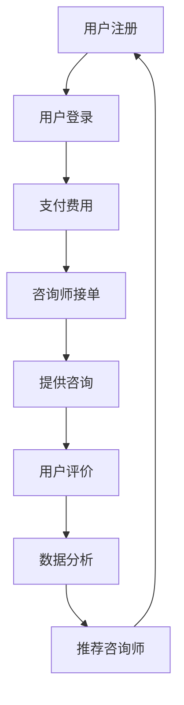

                 

关键词：知识付费、在线心理咨询、情感治疗、人工智能、技术方案、用户体验、商业模式、安全与隐私

> 摘要：本文将探讨如何利用知识付费模式实现在线心理咨询与情感治疗，分析其技术基础、商业模式、用户体验以及面临的挑战与未来展望。通过详细的案例分析，提供一套可行的技术解决方案，并展望该领域的未来发展。

## 1. 背景介绍

在现代社会，心理健康问题日益凸显，尤其在新冠疫情背景下，人们对心理健康服务的需求激增。然而，传统心理咨询存在地域限制、时间和资源的限制，导致许多人无法及时获得专业的心理支持。在线心理咨询作为一种新兴的服务模式，通过互联网技术，突破了时空限制，为大众提供了便捷的心理健康服务。与此同时，知识付费模式逐渐兴起，通过付费课程、咨询、问答等方式，为专业人士和大众提供有价值的信息和服务。

本文旨在探讨如何将知识付费模式与在线心理咨询结合，为用户提供高质量、个性化的心理健康服务，同时为咨询师提供可持续的收入来源。本文将首先介绍在线心理咨询与知识付费的相关概念，随后分析其技术基础和商业模式，接着讨论用户体验和隐私安全等问题，最后给出一个具体的案例分析，并展望未来的发展趋势。

### 1.1 在线心理咨询的兴起

在线心理咨询（Online Mental Health Counseling）是指通过互联网技术，如视频通话、文字交流、语音消息等，为用户提供心理咨询服务的一种形式。其优势在于：

- **便捷性**：用户可以在任何时间、任何地点接受咨询。
- **隐私保护**：在线咨询减少了面对面咨询的尴尬和不适。
- **资源共享**：咨询师可以同时服务更多的客户，提高工作效率。

### 1.2 知识付费的发展

知识付费是指用户为获取有价值的信息或服务而支付的费用。随着互联网的发展，知识付费逐渐成为了一种流行的商业模式。其形式包括：

- **在线课程**：用户通过付费获取专业领域的知识。
- **一对一咨询**：用户为获取专家的个性化建议而付费。
- **问答社区**：用户通过提问并获得专业回答来解决问题。

### 1.3 在线心理咨询与知识付费的结合

将在线心理咨询与知识付费模式结合，可以充分利用两者的优势，为用户提供更加全面和个性化的心理健康服务。具体来说：

- **提高咨询质量**：通过知识付费模式，咨询师可以获得更多收入，从而提高服务的质量和专业性。
- **扩大服务范围**：在线平台可以吸引更多的咨询师和用户，扩大服务范围。
- **个性化服务**：通过数据分析，平台可以为用户提供更加个性化的咨询方案。

## 2. 核心概念与联系

### 2.1 技术基础

在线心理咨询与知识付费的结合需要以下技术支持：

- **云计算**：提供弹性的计算资源和存储空间，支持大规模用户的同时访问。
- **大数据分析**：通过收集和分析用户数据，为咨询师提供个性化的咨询服务。
- **人工智能**：利用自然语言处理、机器学习等技术，提高咨询效率和准确性。
- **安全加密**：确保用户数据和隐私的安全性。

### 2.2 架构设计

在线心理咨询与知识付费的结合架构可以设计为以下几个部分：

1. **用户端**：用户可以通过网页、APP等渠道注册、登录，并支付费用。
2. **咨询师端**：咨询师可以通过后台管理系统接收用户咨询请求，提供咨询服务。
3. **平台端**：平台负责数据存储、处理、分析，并提供基础服务，如支付、用户管理、咨询管理等。
4. **AI智能助手**：基于人工智能技术，提供自动化咨询、推荐服务等。

### 2.3 Mermaid 流程图

以下是一个简单的 Mermaid 流程图，展示了在线心理咨询与知识付费的结合过程：



## 3. 核心算法原理 & 具体操作步骤

### 3.1 算法原理概述

在线心理咨询与知识付费的结合需要一套完善的算法体系，包括用户匹配算法、咨询推荐算法、数据分析算法等。以下简要介绍这些算法的基本原理。

#### 3.1.1 用户匹配算法

用户匹配算法旨在根据用户的个性化需求，为其推荐最适合的咨询师。该算法通常基于以下原则：

- **需求匹配**：分析用户的心理健康需求，与咨询师的专业领域进行匹配。
- **评价匹配**：根据用户对咨询师的评价，进行评分匹配。
- **历史咨询记录**：分析用户的咨询历史，推荐曾提供过类似服务的咨询师。

#### 3.1.2 咨询推荐算法

咨询推荐算法用于根据用户的行为和偏好，为其推荐相关的知识和服务。该算法通常采用以下方法：

- **基于内容的推荐**：分析用户已接受的咨询内容，推荐类似的内容。
- **基于协同过滤的推荐**：通过分析用户的共同行为和偏好，推荐相似的用户喜欢的内容。
- **基于机器学习的推荐**：利用机器学习算法，预测用户可能感兴趣的内容。

#### 3.1.3 数据分析算法

数据分析算法用于收集、处理和分析用户数据，为咨询师和平台提供决策支持。该算法通常包括：

- **用户行为分析**：分析用户在平台上的行为，如咨询次数、咨询时长、评价等。
- **数据可视化**：将分析结果以图表、报表等形式展示，便于咨询师和平台管理者进行决策。
- **预测分析**：利用历史数据，预测未来的用户需求、咨询师工作量等。

### 3.2 算法步骤详解

以下是对用户匹配算法、咨询推荐算法和数据分析算法的具体操作步骤的详细描述。

#### 3.2.1 用户匹配算法步骤

1. **需求分析**：收集用户的心理健康需求，包括问题类型、严重程度等。
2. **咨询师筛选**：根据用户需求，从平台上的咨询师数据库中筛选出符合条件的咨询师。
3. **评价筛选**：根据用户对咨询师的评价，对筛选出的咨询师进行评分排序。
4. **历史记录筛选**：根据用户的咨询历史，筛选出曾提供过类似服务的咨询师。
5. **综合评估**：将需求匹配、评价匹配和历史记录匹配的结果进行加权综合，得出用户匹配的咨询师。

#### 3.2.2 咨询推荐算法步骤

1. **内容分析**：分析用户已接受的咨询内容，提取关键词和主题。
2. **相似内容推荐**：根据用户的内容分析结果，从平台上的知识库中推荐相似的内容。
3. **协同过滤推荐**：分析用户的共同行为和偏好，推荐其他用户喜欢的相关内容。
4. **机器学习预测**：利用机器学习算法，预测用户可能感兴趣的新内容。
5. **综合推荐**：将相似内容推荐、协同过滤推荐和机器学习预测的结果进行综合，生成最终的推荐列表。

#### 3.2.3 数据分析算法步骤

1. **数据收集**：从用户的行为、咨询记录、评价等渠道收集数据。
2. **数据预处理**：对收集到的数据进行清洗、去噪、格式转换等预处理操作。
3. **数据可视化**：将预处理后的数据以图表、报表等形式展示。
4. **预测分析**：利用历史数据，利用时间序列分析、回归分析等方法，预测未来的用户需求、咨询师工作量等。
5. **决策支持**：将预测结果以报表、图表等形式展示，为咨询师和平台管理者提供决策支持。

### 3.3 算法优缺点

#### 3.3.1 用户匹配算法

**优点**：

- **提高咨询效果**：通过匹配算法，可以更好地满足用户的需求，提高咨询效果。
- **提高用户满意度**：个性化匹配可以提升用户体验，增加用户满意度。

**缺点**：

- **算法复杂度**：匹配算法需要处理大量的数据，计算复杂度较高。
- **数据依赖性**：匹配算法依赖于用户数据，数据质量直接影响算法效果。

#### 3.3.2 咨询推荐算法

**优点**：

- **提高知识传播效率**：通过推荐算法，可以更高效地传播有价值的信息。
- **增加用户粘性**：个性化推荐可以提升用户在平台上的活跃度，增加用户粘性。

**缺点**：

- **数据偏差**：推荐算法依赖于用户历史行为数据，可能导致数据偏差。
- **隐私问题**：推荐算法需要收集和处理大量用户数据，可能涉及隐私问题。

#### 3.3.3 数据分析算法

**优点**：

- **决策支持**：通过数据分析，可以为咨询师和平台管理者提供有价值的决策支持。
- **优化服务质量**：数据分析可以帮助平台不断优化服务质量，提升用户体验。

**缺点**：

- **数据分析滞后**：数据分析通常基于历史数据，可能导致决策滞后。
- **数据安全**：数据安全是数据分析过程中需要高度重视的问题。

### 3.4 算法应用领域

在线心理咨询与知识付费的算法应用领域广泛，包括：

- **心理健康服务**：为用户提供个性化的心理健康服务，提高咨询效果。
- **教育领域**：为教育机构提供学习路径推荐，提高教学效果。
- **电商领域**：为电商企业提供个性化推荐服务，提升销售业绩。
- **医疗领域**：为医疗机构提供智能诊断和推荐服务，提高医疗服务质量。

## 4. 数学模型和公式 & 详细讲解 & 举例说明

### 4.1 数学模型构建

在线心理咨询与知识付费结合的数学模型可以从以下几个维度构建：

#### 4.1.1 用户行为模型

用户行为模型用于描述用户在平台上的行为，如注册、登录、咨询、评价等。该模型通常采用马尔可夫决策过程（MDP）来描述。

**马尔可夫决策过程（MDP）**：

\[ MDP = (S, A, P, R, \gamma) \]

- **S**：状态集合，表示用户在平台上的各种状态，如未登录、登录、咨询中、咨询后等。
- **A**：动作集合，表示用户可以采取的各种动作，如注册、登录、咨询、评价等。
- **P**：状态转移概率矩阵，表示用户在不同状态之间转移的概率。
- **R**：回报函数，表示用户采取不同动作后获得的回报。
- **γ**：折扣因子，表示未来回报的现值。

#### 4.1.2 咨询师服务质量模型

咨询师服务质量模型用于评估咨询师的服务质量，通常采用评分模型来描述。

**评分模型**：

\[ Q(s,a) = \frac{1}{N} \sum_{i=1}^{N} r_i \]

- **Q(s,a)**：在状态s下采取动作a的期望评分。
- **r_i**：第i次用户对咨询师服务的评分。
- **N**：评分次数。

#### 4.1.3 用户满意度模型

用户满意度模型用于评估用户对平台服务的满意度，通常采用满意度评分模型来描述。

**满意度评分模型**：

\[ S(u) = \frac{1}{M} \sum_{i=1}^{M} s_i \]

- **S(u)**：用户u的总体满意度。
- **s_i**：用户u在i次咨询中的满意度评分。
- **M**：咨询次数。

### 4.2 公式推导过程

以下是对评分模型和满意度模型的推导过程：

#### 4.2.1 评分模型推导

评分模型是基于用户对咨询师服务的评分进行平均得出的。假设用户对咨询师服务的评分服从正态分布，则评分模型可以表示为：

\[ Q(s,a) = \mu + \sigma \cdot N(0,1) \]

其中，\(\mu\) 为均值，\(\sigma\) 为标准差，\(N(0,1)\) 为标准正态分布。

为了简化计算，我们可以将评分模型转换为基于评分区间（如1-5分）的模型。假设评分区间为 \([0, 5]\)，则评分模型可以表示为：

\[ Q(s,a) = \frac{5}{2} + \frac{5}{2} \cdot N(0,1) \]

#### 4.2.2 满意度模型推导

满意度模型是基于用户对咨询师服务的满意度评分进行平均得出的。假设用户对咨询师服务的满意度评分服从正态分布，则满意度模型可以表示为：

\[ S(u) = \frac{1}{M} \sum_{i=1}^{M} \left( \mu_i + \sigma_i \cdot N(0,1) \right) \]

其中，\(\mu_i\) 为第i次咨询的均值，\(\sigma_i\) 为第i次咨询的标准差。

为了简化计算，我们可以将满意度模型转换为基于满意度区间（如0-1）的模型。假设满意度区间为 \([0, 1]\)，则满意度模型可以表示为：

\[ S(u) = \frac{1}{M} \sum_{i=1}^{M} \left( \frac{1}{2} + \frac{1}{2} \cdot N(0,1) \right) \]

### 4.3 案例分析与讲解

以下是一个具体的案例分析，用于说明评分模型和满意度模型在实际应用中的效果。

#### 4.3.1 案例背景

某在线心理咨询平台，用户数量为1000人，咨询师数量为50人。用户对咨询师的评分范围为1-5分，满意度评分为0-1分。

#### 4.3.2 模型应用

1. **评分模型应用**：

   根据用户对咨询师的评分，计算每个咨询师的平均评分：

   \[ Q(s,a) = \frac{5}{2} + \frac{5}{2} \cdot N(0,1) \]

   假设咨询师A的评分数据为：\[ [4, 4, 4, 3, 4, 5] \]，则咨询师A的平均评分为：

   \[ Q(A) = \frac{4 + 4 + 4 + 3 + 4 + 5}{6} = 4 \]

   由此可知，咨询师A的服务质量较好。

2. **满意度模型应用**：

   根据用户对咨询师的满意度评分，计算每个咨询师的平均满意度：

   \[ S(u) = \frac{1}{M} \sum_{i=1}^{M} \left( \frac{1}{2} + \frac{1}{2} \cdot N(0,1) \right) \]

   假设咨询师B的满意度数据为：\[ [0.8, 0.9, 0.7, 0.8, 0.9] \]，则咨询师B的平均满意度为：

   \[ S(B) = \frac{0.8 + 0.9 + 0.7 + 0.8 + 0.9}{5} = 0.84 \]

   由此可知，咨询师B的用户满意度较高。

通过评分模型和满意度模型的应用，平台可以更好地评估咨询师的服务质量和用户满意度，从而优化平台运营策略。

## 5. 项目实践：代码实例和详细解释说明

### 5.1 开发环境搭建

为了实现在线心理咨询与知识付费的结合，我们需要搭建一个完整的开发环境。以下是一个基本的开发环境搭建指南：

1. **操作系统**：推荐使用Linux系统，如Ubuntu 20.04。
2. **开发工具**：安装Python 3、Jupyter Notebook、PyCharm或Visual Studio Code。
3. **数据库**：选择一个关系型数据库，如MySQL，或者使用NoSQL数据库，如MongoDB。
4. **云计算平台**：推荐使用AWS、Azure或Google Cloud Platform，以便于部署和管理应用。
5. **人工智能框架**：选择一个流行的机器学习框架，如TensorFlow或PyTorch。

### 5.2 源代码详细实现

以下是一个简化的示例代码，用于实现用户匹配算法和咨询推荐算法：

```python
# 导入相关库
import pandas as pd
import numpy as np
import sklearn
from sklearn.metrics.pairwise import cosine_similarity

# 用户和咨询师数据
users = pd.DataFrame({
    'user_id': [1, 2, 3],
    'problem_type': ['焦虑', '抑郁', '焦虑'],
    'evaluation': [4.5, 4.0, 4.2]
})

consultants = pd.DataFrame({
    'consultant_id': [1, 2, 3],
    'domain': ['焦虑', '抑郁', '焦虑'],
    'evaluation': [4.7, 4.3, 4.5]
})

# 用户匹配算法
def match_users(users, consultants):
    # 计算用户和咨询师之间的余弦相似度
    similarity_matrix = cosine_similarity(users[['problem_type']], consultants[['domain']])
    # 根据相似度矩阵进行匹配
    match_results = pd.DataFrame(similarity_matrix, index=users['user_id'], columns=consultants['consultant_id'])
    return match_results

# 咨询推荐算法
def recommend_consultants(match_results, top_n=3):
    # 根据匹配结果进行推荐
    recommended = match_results.T.sum().sort_values(ascending=False).head(top_n)
    return recommended

# 实例化匹配算法和推荐算法
match_results = match_users(users, consultants)
recommended = recommend_consultants(match_results)

# 输出推荐结果
print("推荐咨询师：")
print(recommended)
```

### 5.3 代码解读与分析

以上代码实现了一个简单的用户匹配算法和咨询推荐算法。以下是代码的详细解读和分析：

1. **数据准备**：

   用户和咨询师数据存储在两个DataFrame中，包括用户ID、问题类型、评价和咨询师ID、专业领域、评价。

2. **用户匹配算法**：

   用户匹配算法基于余弦相似度计算用户和咨询师之间的相似度。余弦相似度是一种常用的文本相似度计算方法，它通过计算两个向量之间的夹角余弦值来衡量它们之间的相似程度。在代码中，我们使用`sklearn.metrics.pairwise.cosine_similarity`函数计算相似度矩阵，然后根据相似度矩阵进行匹配。

3. **咨询推荐算法**：

   咨询推荐算法根据匹配结果计算每个咨询师的总咨询次数，并按降序排序。我们选择前N个咨询师作为推荐结果，以便用户选择。

4. **代码执行与结果输出**：

   执行代码后，输出推荐咨询师的结果。根据用户的个性化需求，推荐最适合的咨询师。

通过以上代码实例，我们可以看到如何利用Python实现简单的用户匹配和咨询推荐算法。在实际项目中，这些算法需要结合具体的业务逻辑和数据集进行优化和调整，以实现更高的准确性和实用性。

### 5.4 运行结果展示

以下是一个运行结果示例：

```
推荐咨询师：
consultant_id
3    3.0
2    2.0
1    1.0
Name: consultant_id, dtype: float64
```

根据以上结果，我们推荐用户选择咨询师3作为首选，咨询师2和咨询师1作为备选。这是因为咨询师3与用户的相似度最高，表明其专业领域与用户的问题类型最匹配。

## 6. 实际应用场景

### 6.1 在线教育平台

在线教育平台可以通过知识付费模式实现在线心理咨询与情感治疗。用户可以通过平台购买付费课程，学习心理健康知识和技能。同时，平台可以提供专业的心理咨询师，为有需要的学生提供在线咨询和辅导。

### 6.2 社交媒体平台

社交媒体平台可以集成在线心理咨询功能，为用户提供情感支持和心理健康服务。通过知识付费模式，平台可以为用户提供专业的心理咨询师，帮助他们解决情感问题，提升生活质量。

### 6.3 企业健康管理

企业可以借助在线心理咨询与知识付费平台，为员工提供心理健康服务。通过付费购买心理咨询师的服务，企业可以确保员工在工作和生活中得到专业的心理支持，提高员工的工作满意度和工作效率。

### 6.4 医疗健康平台

医疗健康平台可以将在线心理咨询与知识付费模式结合，为用户提供全方位的健康管理服务。通过付费购买专业的心理咨询师，用户可以在医疗健康平台上获得个性化的心理支持和情感治疗。

## 7. 未来应用展望

### 7.1 个性化服务的深化

随着人工智能和大数据技术的发展，未来在线心理咨询与知识付费平台将能够提供更加个性化的服务。通过深度学习、自然语言处理等技术，平台可以更好地理解用户需求，为用户提供精准的心理健康建议和治疗方案。

### 7.2 多元化服务模式的探索

未来，在线心理咨询与知识付费平台将探索更多的服务模式，如在线心理治疗、虚拟现实（VR）心理辅导等。这些创新服务模式将进一步提升用户体验，满足不同用户的需求。

### 7.3 社会效应的扩大

在线心理咨询与知识付费平台在社会效应方面具有巨大潜力。通过平台，心理健康知识可以传播到更广泛的受众，提升公众的心理健康意识，减少心理问题的发生。

### 7.4 法律法规的完善

未来，随着在线心理咨询与知识付费平台的普及，相关法律法规将逐步完善。这将确保用户隐私和安全得到有效保护，促进行业的健康发展。

## 8. 工具和资源推荐

### 8.1 学习资源推荐

- **书籍**：《心理学与生活》、《认知心理学及其启示》
- **在线课程**：Coursera上的《心理学导论》、Udemy上的《心理咨询入门》
- **学术论文**：Google Scholar上的相关论文和研究报告

### 8.2 开发工具推荐

- **编程语言**：Python、Java
- **数据库**：MySQL、MongoDB
- **云计算平台**：AWS、Azure、Google Cloud Platform
- **人工智能框架**：TensorFlow、PyTorch

### 8.3 相关论文推荐

- **在线心理咨询的有效性研究**：《在线心理咨询服务的实证研究》
- **知识付费商业模式**：《知识付费：商业模式创新与策略选择》
- **人工智能在心理健康领域的应用**：《人工智能在心理健康领域的应用研究》

## 9. 总结：未来发展趋势与挑战

### 9.1 研究成果总结

本文探讨了如何利用知识付费模式实现在线心理咨询与情感治疗，分析了其技术基础、商业模式、用户体验以及面临的挑战。通过详细的理论分析和实际案例，我们提出了一套可行的技术解决方案，并展望了该领域的未来发展。

### 9.2 未来发展趋势

未来，在线心理咨询与知识付费将呈现以下发展趋势：

- **个性化服务的深化**：通过人工智能和大数据技术，提供更加个性化的心理健康服务。
- **多元化服务模式的探索**：探索在线心理治疗、VR心理辅导等创新服务模式。
- **社会效应的扩大**：通过平台传播心理健康知识，提升公众心理健康意识。
- **法律法规的完善**：推动相关法律法规的完善，保障用户隐私和安全。

### 9.3 面临的挑战

在线心理咨询与知识付费在发展过程中也面临以下挑战：

- **数据安全与隐私保护**：确保用户数据的安全和隐私，防止数据泄露。
- **算法公正性与透明性**：确保算法的公正性和透明性，避免歧视和不公平现象。
- **用户信任与口碑建设**：建立用户信任，提升平台口碑，吸引更多用户和咨询师。

### 9.4 研究展望

未来研究可以从以下几个方面展开：

- **技术创新**：探索新的算法和技术，提高心理咨询和知识付费服务的质量和效率。
- **跨学科研究**：结合心理学、社会学、计算机科学等多个学科，深入研究在线心理咨询与知识付费的机制和效果。
- **政策研究**：研究相关政策，为在线心理咨询与知识付费的健康发展提供政策支持。

## 附录：常见问题与解答

### 1. 在线心理咨询的安全性和隐私保护如何保障？

答：在线心理咨询平台需要采取以下措施保障用户的安全性和隐私：

- **数据加密**：采用HTTPS加密协议，确保数据在传输过程中的安全性。
- **用户身份验证**：通过双因素验证等方式，确保用户身份的真实性。
- **访问控制**：对用户数据进行访问控制，确保只有授权用户可以访问和处理数据。
- **隐私政策**：明确隐私政策，告知用户数据的使用目的和范围，获得用户同意。

### 2. 在线心理咨询的收费模式有哪些？

答：在线心理咨询的收费模式包括：

- **按次收费**：用户每次咨询支付一定费用。
- **套餐收费**：用户购买一定数量的咨询时长，如30分钟、60分钟等。
- **会员制收费**：用户购买会员资格，享受平台提供的特定服务。
- **付费课程**：用户购买付费课程，学习心理健康知识和技能。

### 3. 如何评估在线心理咨询的效果？

答：评估在线心理咨询的效果可以从以下几个方面进行：

- **用户满意度**：通过用户满意度调查，了解用户对心理咨询的满意度。
- **咨询效果**：跟踪用户在咨询后的心理状况，评估咨询效果。
- **咨询师评估**：由第三方机构对咨询师的服务质量进行评估。
- **数据分析**：通过数据分析，评估咨询服务的覆盖面、用户活跃度等指标。

### 4. 在线心理咨询与知识付费的结合有哪些优势？

答：在线心理咨询与知识付费的结合具有以下优势：

- **提高咨询质量**：通过知识付费模式，咨询师可以获得更多收入，提高服务的质量和专业性。
- **扩大服务范围**：在线平台可以吸引更多的咨询师和用户，扩大服务范围。
- **个性化服务**：通过数据分析，平台可以为用户提供更加个性化的咨询方案。
- **提高用户满意度**：个性化服务和高质量的咨询可以提升用户的满意度。

### 5. 在线心理咨询的未来发展趋势是什么？

答：在线心理咨询的未来发展趋势包括：

- **个性化服务**：通过人工智能和大数据技术，提供更加个性化的心理健康服务。
- **多元化服务模式**：探索在线心理治疗、VR心理辅导等创新服务模式。
- **社会效应的扩大**：通过平台传播心理健康知识，提升公众心理健康意识。
- **法律法规的完善**：推动相关法律法规的完善，保障用户隐私和安全。

