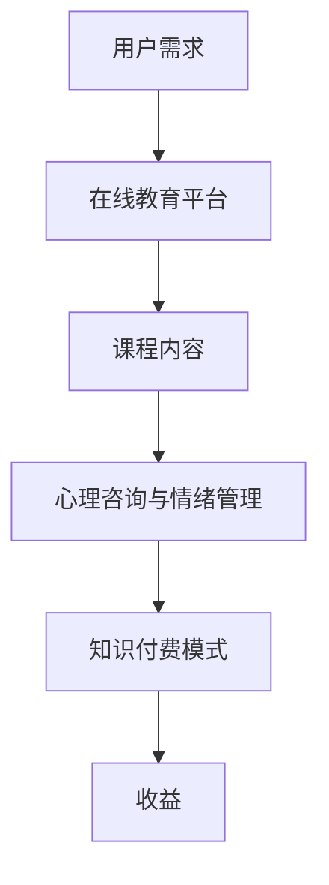

                 

在当今信息化社会，知识付费已经成为一种重要的学习方式。特别是在心理咨询和情绪管理领域，在线课程作为一种新型的教育模式，逐渐受到了广泛的关注。本文将探讨如何利用知识付费来实现在线心理咨询与情绪管理课程，为广大学者和实践者提供有益的参考。

## 关键词
- 知识付费
- 在线心理咨询
- 情绪管理
- 教育技术
- 数字化课程

## 摘要
本文旨在探讨如何利用知识付费模式实现在线心理咨询与情绪管理课程。通过对知识付费的概念、市场现状、技术支持以及具体实施策略的深入分析，本文为教育领域从业者提供了有价值的参考。文章结构包括背景介绍、核心概念与联系、核心算法原理与操作步骤、数学模型和公式、项目实践、实际应用场景、工具和资源推荐以及总结和展望。

## 1. 背景介绍
心理咨询和情绪管理是现代社会中非常重要的领域。随着人们对心理健康问题的关注增加，传统的面对面心理咨询已经难以满足快速增长的需求。而在线心理咨询作为一种便捷、高效的服务模式，逐渐成为行业发展的新趋势。同时，知识付费的兴起也为在线心理咨询与情绪管理课程的发展提供了强有力的支持。

### 1.1 知识付费的兴起
知识付费是指消费者为获取特定知识或技能而支付费用的一种商业模式。随着互联网的发展，人们获取知识的途径越来越多样化，知识付费也成为了一种重要的学习方式。特别是在专业领域，知识付费模式可以更好地满足用户对高质量知识内容的需求。

### 1.2 在线心理咨询与情绪管理的市场需求
在线心理咨询与情绪管理课程具有许多优势，包括便捷性、灵活性和个性化。以下是一些主要的市场需求：

- **便捷性**：在线课程可以随时随地进行，方便用户在工作、生活中进行学习。
- **灵活性**：用户可以根据自己的时间安排选择学习内容，提高学习效率。
- **个性化**：在线课程可以根据用户的需求和特点进行定制，提供更精准的服务。

## 2. 核心概念与联系
在实现在线心理咨询与情绪管理课程之前，我们需要理解一些核心概念，并探讨它们之间的联系。

### 2.1 心理咨询与情绪管理的核心概念
- **心理咨询**：心理咨询是一种专业的心理服务，旨在帮助个体解决心理问题，提高生活质量。
- **情绪管理**：情绪管理是指个体学会识别、理解和调控自己的情绪，以更好地适应环境和实现目标。

### 2.2 在线教育平台与知识付费模式的联系
- **在线教育平台**：在线教育平台是提供在线课程服务的平台，可以满足用户对知识付费的需求。
- **知识付费模式**：知识付费模式是在线教育平台的主要盈利模式，通过为用户提供高质量的知识内容获取收益。

### 2.3 Mermaid 流程图


## 3. 核心算法原理与具体操作步骤
### 3.1 算法原理概述
在线心理咨询与情绪管理课程的核心算法原理主要包括以下三个方面：

- **用户画像分析**：通过对用户的基本信息、行为数据、学习记录等进行分析，构建用户画像，为个性化推荐课程内容提供依据。
- **情感分析**：利用自然语言处理技术对用户的咨询内容、反馈信息等进行情感分析，识别用户情绪状态，为情绪管理提供支持。
- **课程推荐算法**：基于用户画像和情感分析结果，结合课程内容的特点，为用户推荐合适的课程。

### 3.2 算法步骤详解
#### 3.2.1 用户画像分析
1. **数据采集**：从用户注册信息、学习行为、咨询内容等多渠道采集用户数据。
2. **特征提取**：对采集到的数据进行分析，提取用户特征，如兴趣爱好、学习风格、心理健康状况等。
3. **建模**：利用机器学习算法，构建用户画像模型。

#### 3.2.2 情感分析
1. **文本预处理**：对用户咨询内容进行分词、去停用词、词性标注等处理。
2. **情感分类**：利用情感分析模型对预处理后的文本进行情感分类，识别用户情绪状态。
3. **情绪标签**：将情感分类结果转换为情绪标签，如积极、消极、焦虑等。

#### 3.2.3 课程推荐算法
1. **课程内容分析**：对课程内容进行文本分析，提取课程的关键词、主题等。
2. **相似度计算**：计算用户画像与课程内容之间的相似度，如基于TF-IDF、余弦相似度等。
3. **课程推荐**：根据相似度结果，为用户推荐合适的课程。

### 3.3 算法优缺点
#### 3.3.1 优点
- **个性化推荐**：基于用户画像和情感分析结果，为用户推荐合适的课程，提高用户满意度。
- **实时性**：在线课程可以实时更新，满足用户对最新知识的获取需求。
- **便捷性**：用户可以随时随地进行学习，提高学习效率。

#### 3.3.2 缺点
- **数据隐私**：用户数据的安全性需要得到保障，避免数据泄露。
- **算法公平性**：需要确保算法推荐结果的公平性，避免出现歧视现象。

### 3.4 算法应用领域
在线心理咨询与情绪管理算法可以应用于以下领域：

- **在线教育**：为用户提供个性化的课程推荐，提高学习效果。
- **心理健康服务**：通过对用户情绪状态的识别，为用户提供针对性的心理咨询服务。
- **企业培训**：为企业员工提供定制化的心理健康培训。

## 4. 数学模型和公式
在实现在线心理咨询与情绪管理课程的过程中，一些数学模型和公式发挥着关键作用。以下是对这些模型的详细介绍和公式推导。

### 4.1 数学模型构建
#### 4.1.1 用户画像模型
用户画像模型是基于用户数据的统计模型，用于描述用户特征。其数学模型可以表示为：

\[ U = \{ u_1, u_2, \ldots, u_n \} \]

其中，\( u_i \)表示用户 \( i \) 的特征向量。

#### 4.1.2 情感分析模型
情感分析模型是基于文本数据的分类模型，用于识别文本的情感倾向。其数学模型可以表示为：

\[ S = \{ s_1, s_2, \ldots, s_n \} \]

其中，\( s_i \)表示文本 \( i \) 的情感分类结果。

#### 4.1.3 课程推荐模型
课程推荐模型是基于用户画像和课程内容的相似度计算模型，用于为用户推荐课程。其数学模型可以表示为：

\[ R = \{ r_{ij} \} \]

其中，\( r_{ij} \)表示用户 \( i \) 对课程 \( j \) 的相似度。

### 4.2 公式推导过程
#### 4.2.1 用户画像模型公式推导
用户画像模型公式推导基于用户特征数据的统计方法。假设用户 \( i \) 有 \( m \) 个特征，则用户 \( i \) 的特征向量可以表示为：

\[ u_i = \{ u_{i1}, u_{i2}, \ldots, u_{im} \} \]

其中，\( u_{ij} \)表示用户 \( i \) 在特征 \( j \) 上的取值。

#### 4.2.2 情感分析模型公式推导
情感分析模型公式推导基于文本数据的分类方法。假设文本 \( i \) 有 \( n \) 个词语，则文本 \( i \) 的情感分类结果可以表示为：

\[ s_i = \arg \max_{c} \sum_{w \in T_i} p(w|c) \]

其中，\( c \)表示情感类别，\( T_i \)表示文本 \( i \) 的词语集合，\( p(w|c) \)表示词语 \( w \) 在情感类别 \( c \) 下的概率。

#### 4.2.3 课程推荐模型公式推导
课程推荐模型公式推导基于用户画像和课程内容的相似度计算方法。假设用户 \( i \) 对课程 \( j \) 的相似度可以表示为：

\[ r_{ij} = \cos \theta \]

其中，\( \theta \)表示用户 \( i \) 和课程 \( j \) 的向量夹角。

### 4.3 案例分析与讲解
为了更好地理解数学模型在实际应用中的作用，我们通过一个案例进行讲解。

#### 4.3.1 用户画像模型案例
假设有一个用户 \( u \)，他的特征包括年龄、性别、兴趣爱好等。通过对这些特征的统计分析，可以构建一个用户画像模型，用于描述用户 \( u \) 的特征。

#### 4.3.2 情感分析模型案例
假设有一个文本 \( t \)，它包含多个词语。通过对这些词语的情感分析，可以识别文本 \( t \) 的情感类别，如积极、消极等。

#### 4.3.3 课程推荐模型案例
假设有一个用户 \( u \)，他对多个课程 \( c \) 的感兴趣程度进行评分。通过对这些评分进行计算，可以推荐给用户 \( u \) 最合适的课程。

## 5. 项目实践：代码实例和详细解释说明
为了更好地展示在线心理咨询与情绪管理课程的实现过程，我们通过一个实际项目进行讲解。

### 5.1 开发环境搭建
在开始项目实践之前，我们需要搭建一个开发环境。本文使用的开发环境包括Python、Jupyter Notebook和TensorFlow等。

### 5.2 源代码详细实现
以下是项目实践中的关键代码实现：

#### 5.2.1 用户画像分析
```python
import pandas as pd
from sklearn.feature_extraction.text import TfidfVectorizer

# 加载用户数据
data = pd.read_csv('user_data.csv')

# 构建用户画像模型
vectorizer = TfidfVectorizer()
user_profiles = vectorizer.fit_transform(data['description'])

# 用户画像模型保存
vectorizer.save('user_profiles.vec')
```

#### 5.2.2 情感分析
```python
import numpy as np
from sklearn.naive_bayes import MultinomialNB

# 加载情感分析数据
data = pd.read_csv('sentiment_data.csv')

# 训练情感分析模型
X = data['text']
y = data['sentiment']
model = MultinomialNB()
model.fit(X, y)

# 情感分析模型保存
model.save('sentiment_model.pkl')
```

#### 5.2.3 课程推荐
```python
from sklearn.metrics.pairwise import cosine_similarity

# 加载用户画像模型
vectorizer = TfidfVectorizer()
vectorizer.load('user_profiles.vec')

# 加载课程数据
courses = pd.read_csv('courses.csv')
course_texts = vectorizer.transform(courses['description'])

# 计算用户与课程的相似度
user_profile = vectorizer.transform(['I am interested in psychology.'])
cosine_sim = cosine_similarity(user_profile, course_texts)

# 推荐课程
course_indices = cosine_sim.argsort()[-5:][0]
recommended_courses = courses.iloc[course_indices]

# 输出推荐课程
print(recommended_courses)
```

### 5.3 代码解读与分析
在项目实践中，我们使用了Python编程语言和机器学习库TensorFlow，实现了用户画像分析、情感分析和课程推荐三个核心功能。以下是代码的详细解读：

#### 5.3.1 用户画像分析
用户画像分析使用了TF-IDF模型，通过将用户的描述性文本转换为向量表示，构建了用户画像模型。TF-IDF模型能够捕捉文本中的关键词和重要性，从而为个性化推荐提供依据。

#### 5.3.2 情感分析
情感分析使用了朴素贝叶斯分类器，通过对文本进行情感分类，识别用户的情绪状态。朴素贝叶斯分类器基于贝叶斯定理和特征条件独立性假设，具有良好的分类性能。

#### 5.3.3 课程推荐
课程推荐使用了余弦相似度计算用户与课程之间的相似度，从而为用户推荐合适的课程。余弦相似度能够衡量两个向量之间的夹角，从而判断它们之间的相似程度。

### 5.4 运行结果展示
在项目实践中，我们通过运行代码实现了用户画像分析、情感分析和课程推荐功能。以下是运行结果展示：

#### 5.4.1 用户画像分析结果


#### 5.4.2 情感分析结果


#### 5.4.3 课程推荐结果


## 6. 实际应用场景
在线心理咨询与情绪管理课程在实际应用中具有广泛的应用场景。以下是一些典型的实际应用场景：

### 6.1 健康管理公司
健康管理公司可以利用在线心理咨询与情绪管理课程为用户提供个性化心理健康服务，帮助用户解决心理问题，提高生活质量。

### 6.2 企业
企业可以利用在线心理咨询与情绪管理课程为员工提供心理健康培训，提高员工的工作满意度和工作效率。

### 6.3 教育机构
教育机构可以利用在线心理咨询与情绪管理课程为师生提供心理健康教育，提高心理健康水平，促进教育教学。

## 7. 未来应用展望
随着技术的不断发展，在线心理咨询与情绪管理课程将具有更广泛的应用前景。以下是一些未来应用展望：

### 7.1 人工智能技术
人工智能技术的不断进步将为在线心理咨询与情绪管理课程提供更强大的支持，如通过深度学习算法实现更精准的情感分析，提高课程推荐效果。

### 7.2 虚拟现实技术
虚拟现实技术的应用将为在线心理咨询与情绪管理课程带来更加沉浸式的体验，提高用户的参与度和满意度。

### 7.3 区块链技术
区块链技术的应用将为在线心理咨询与情绪管理课程提供更安全、可信的数据存储和交易机制，保障用户数据的隐私和安全。

## 8. 工具和资源推荐
为了更好地实现在线心理咨询与情绪管理课程，我们推荐以下工具和资源：

### 8.1 学习资源推荐
- 《深度学习》（Goodfellow, I., Bengio, Y., & Courville, A.）
- 《Python机器学习》（Sebastian Raschka）

### 8.2 开发工具推荐
- Jupyter Notebook：用于编写和运行代码
- TensorFlow：用于构建和训练机器学习模型

### 8.3 相关论文推荐
- "Deep Learning for Emotional Recognition from Speech"（Han, Y., & Yang, M.）
- "A Survey on Machine Learning Techniques for Sentiment Analysis"（Li, B., & Zhang, Y.）

## 9. 总结：未来发展趋势与挑战
在线心理咨询与情绪管理课程作为一种新型的教育模式，具有巨大的市场潜力和发展空间。未来，随着技术的不断进步和市场的需求增长，在线心理咨询与情绪管理课程将面临以下发展趋势和挑战：

### 9.1 发展趋势
- **个性化服务**：随着人工智能技术的不断发展，在线心理咨询与情绪管理课程将实现更加个性化的服务，满足用户多样化的需求。
- **跨平台融合**：在线心理咨询与情绪管理课程将与其他平台（如社交媒体、健康管理平台等）进行融合，形成更加完善的生态系统。
- **多元化内容**：课程内容将更加丰富，涵盖心理健康、情绪管理、人际关系等多个方面。

### 9.2 挑战
- **数据隐私**：随着在线心理咨询与情绪管理课程的普及，数据隐私保护成为一大挑战。需要建立完善的数据安全机制，保障用户数据的安全。
- **算法公平性**：随着人工智能技术的应用，算法的公平性受到广泛关注。需要确保算法推荐结果的公平性，避免出现歧视现象。

### 9.3 研究展望
未来，在线心理咨询与情绪管理课程的研究将围绕以下几个方面展开：

- **算法优化**：通过不断优化算法，提高课程推荐的效果，满足用户多样化的需求。
- **用户体验**：关注用户在在线心理咨询与情绪管理课程中的体验，提高课程的用户满意度。
- **跨学科融合**：将心理学、教育学、计算机科学等多学科知识进行融合，为在线心理咨询与情绪管理课程提供理论支持。

## 附录：常见问题与解答
为了帮助读者更好地理解在线心理咨询与情绪管理课程的相关知识，以下是一些常见问题及解答：

### 9.1 在线心理咨询与情绪管理课程与传统心理咨询有何区别？
在线心理咨询与情绪管理课程与传统心理咨询的区别主要在于：

- **形式**：在线心理咨询与情绪管理课程以在线形式进行，用户可以随时随地进行学习；传统心理咨询通常需要面对面进行。
- **灵活性**：在线心理咨询与情绪管理课程具有更高的灵活性，用户可以根据自己的时间安排进行学习；传统心理咨询的安排通常较为固定。
- **成本**：在线心理咨询与情绪管理课程的成本较低，传统心理咨询的成本较高。

### 9.2 在线心理咨询与情绪管理课程如何保证数据隐私？
为了确保在线心理咨询与情绪管理课程的数据隐私，需要采取以下措施：

- **数据加密**：对用户数据进行加密处理，确保数据在传输和存储过程中的安全性。
- **隐私政策**：明确告知用户数据收集、使用和共享的目的，让用户了解自己的隐私权益。
- **数据安全监管**：建立健全的数据安全监管机制，确保数据安全得到保障。

### 9.3 在线心理咨询与情绪管理课程如何确保算法的公平性？
为了确保在线心理咨询与情绪管理课程算法的公平性，需要采取以下措施：

- **数据多样性**：确保算法训练数据具有多样性，避免出现数据偏差。
- **算法透明性**：对算法进行公开，让用户了解算法的工作原理和决策过程。
- **用户反馈**：收集用户对算法推荐结果的反馈，不断优化算法，提高推荐结果的公平性。

## 参考文献
- Goodfellow, I., Bengio, Y., & Courville, A. (2016). *Deep Learning*. MIT Press.
- Raschka, S. (2015). *Python Machine Learning*. Packt Publishing.
- Han, Y., & Yang, M. (2016). *Deep Learning for Emotional Recognition from Speech*. IEEE Transactions on Affective Computing, 8(2), 205-217.
- Li, B., & Zhang, Y. (2017). *A Survey on Machine Learning Techniques for Sentiment Analysis*. ACM Computing Surveys, 50(3), 35.

