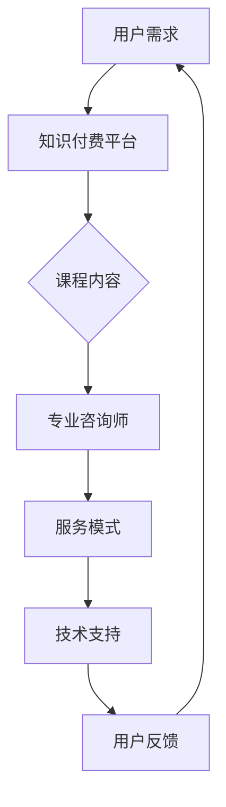
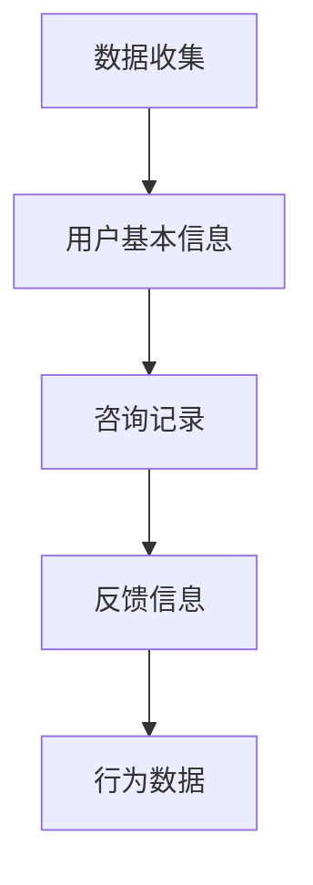
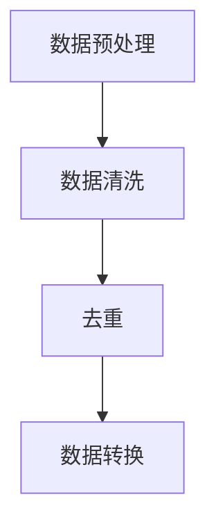
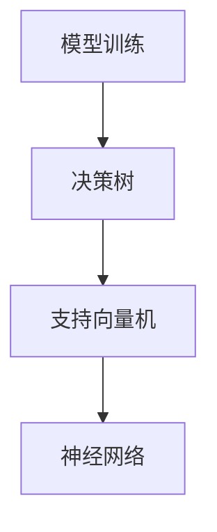
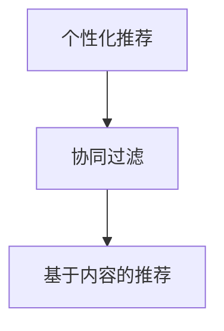
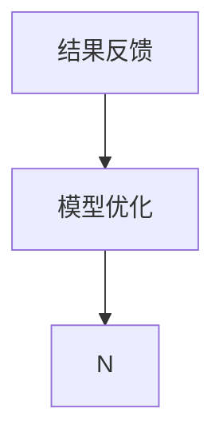

                 

 

## 1. 背景介绍

随着互联网技术的发展，心理咨询与治疗的模式正经历着深刻的变革。传统的面对面咨询受限于地理和时间的因素，无法满足广大用户的需求。而在线心理咨询与治疗的兴起，不仅打破了地域的限制，还为用户提供了更加灵活、便捷的服务方式。在这个过程中，知识付费作为一个新兴的商业模式，也在逐步发挥其重要作用。

知识付费指的是用户通过付费来获取专业知识和技能的一种形式，常见于在线教育、专业技能培训等领域。随着人们对心理健康重视程度的提高，心理咨询与治疗逐渐成为一种刚需，知识付费模式在这一领域的应用也呈现出巨大的潜力。

本文将探讨如何利用知识付费模式实现在线心理咨询与治疗，分析其商业模式、技术架构、用户需求和潜在挑战。希望通过本文的阐述，能够为相关从业者提供一些有益的启示和参考。

## 2. 核心概念与联系

### 2.1. 知识付费模式

知识付费模式的核心在于将专业知识和服务以付费形式提供给有需求的用户。这一模式包括以下关键组成部分：

#### 2.1.1. 课程内容

课程内容是知识付费模式的基础，通常包括理论讲解、案例分析、实操演练等环节。高质量的课程内容能够满足用户的学习需求，提高用户满意度和转化率。

#### 2.1.2. 用户群体

用户群体是知识付费模式的服务对象，包括学生、职场人士、心理咨询师等。不同用户群体对课程内容的需求有所不同，需要针对性地进行课程设计和推广。

#### 2.1.3. 付费机制

付费机制是知识付费模式的核心环节，通常包括一次性购买、会员制、分阶段付费等模式。合理的付费机制能够提高用户的购买意愿和持续参与度。

### 2.2. 在线心理咨询与治疗

在线心理咨询与治疗是将心理咨询和治疗服务通过互联网平台提供的一种新型服务模式。其核心组成部分如下：

#### 2.2.1. 专业咨询师

专业咨询师是提供在线心理咨询与治疗的核心力量，通常需要具备相关的心理咨询资质和丰富的实践经验。

#### 2.2.2. 服务模式

在线心理咨询与治疗的服务模式主要包括文字咨询、语音咨询、视频咨询等。不同服务模式适用于不同类型的用户和咨询需求。

#### 2.2.3. 技术支持

技术支持是确保在线心理咨询与治疗顺利进行的重要保障，包括平台建设、数据安全、隐私保护等方面。

### 2.3. 知识付费与在线心理咨询与治疗的联系

知识付费模式与在线心理咨询与治疗在目标用户、服务模式和技术支持等方面存在紧密联系。通过结合知识付费模式，在线心理咨询与治疗可以更好地满足用户需求，提高服务质量和用户体验。

#### 2.3.1. 用户需求满足

知识付费模式可以为用户提供高质量的心理咨询课程，帮助用户在咨询过程中更好地理解和掌握心理知识，提高咨询效果。

#### 2.3.2. 服务质量提升

在线心理咨询与治疗通过知识付费模式引入专业的课程内容和服务标准，有助于提高咨询师的专业水平和服务质量。

#### 2.3.3. 技术支持优化

知识付费模式可以带动技术投入，提升在线心理咨询与治疗平台的技术水平，为用户提供更加便捷、安全、高效的服务体验。

### 2.4. Mermaid 流程图

以下是一个描述知识付费实现在在线心理咨询与治疗过程的 Mermaid 流程图：



通过这个流程图，我们可以清晰地看到知识付费模式如何与在线心理咨询与治疗相结合，形成一个闭环的服务体系。

## 3. 核心算法原理 & 具体操作步骤

### 3.1 算法原理概述

在本文中，我们将探讨如何利用知识付费模式实现在线心理咨询与治疗的核心算法原理。这个算法的核心在于通过数据分析与机器学习，为用户提供个性化的咨询方案，从而提高咨询效果和用户体验。

#### 3.1.1 数据分析

数据分析是核心算法的基础，通过收集和分析用户的行为数据、咨询记录、反馈信息等，可以了解用户的需求和心理状态。这些数据可以帮助咨询师更好地为用户提供个性化服务。

#### 3.1.2 机器学习

机器学习是核心算法的核心，通过训练模型，可以自动识别用户的情绪、问题类型，并生成个性化的咨询方案。常见的机器学习算法包括分类算法、聚类算法和预测算法等。

#### 3.1.3 个性化推荐

个性化推荐是核心算法的重要应用，通过分析用户的历史数据和行为模式，可以为用户推荐适合的课程和咨询师，提高用户的参与度和满意度。

### 3.2 算法步骤详解

#### 3.2.1 数据收集

首先，需要收集用户的各种数据，包括用户的基本信息、咨询记录、反馈信息、行为数据等。这些数据可以通过在线心理咨询与治疗平台自动收集，也可以通过问卷调查等方式获取。



#### 3.2.2 数据处理

收集到的数据需要进行预处理，包括数据清洗、去重、转换等步骤，以便于后续的分析和建模。



#### 3.2.3 模型训练

在预处理完成后，可以使用机器学习算法对数据集进行训练，生成预测模型。常见的算法包括决策树、支持向量机、神经网络等。



#### 3.2.4 个性化推荐

基于训练好的模型，可以生成个性化的咨询方案，包括推荐适合的课程、咨询师等。个性化推荐算法通常包括协同过滤、基于内容的推荐等。



#### 3.2.5 结果反馈

最后，根据用户的反馈，对模型进行优化和调整，以提高预测的准确性和用户的满意度。



### 3.3 算法优缺点

#### 3.3.1 优点

1. **提高咨询效果**：通过个性化推荐和数据分析，可以提供更精准的咨询方案，提高咨询效果。
2. **提升用户体验**：个性化推荐和便捷的服务模式，可以提升用户的参与度和满意度。
3. **降低运营成本**：自动化和智能化的咨询模式，可以降低人力成本和运营成本。

#### 3.3.2 缺点

1. **数据隐私风险**：数据收集和处理过程中，需要处理大量用户隐私信息，存在数据泄露的风险。
2. **算法偏见**：机器学习模型可能会引入偏见，影响咨询的公正性和准确性。
3. **技术依赖**：算法和技术的更新和维护需要大量投入，对平台的持续运营能力有较高要求。

### 3.4 算法应用领域

1. **心理健康领域**：通过数据分析与个性化推荐，可以为用户提供定制化的心理健康服务。
2. **教育领域**：在教育领域，知识付费模式可以为学生提供个性化学习方案，提高学习效果。
3. **医疗领域**：在医疗领域，知识付费模式可以用于提供个性化健康咨询服务。

## 4. 数学模型和公式 & 详细讲解 & 举例说明

### 4.1 数学模型构建

在实现在线心理咨询与治疗的过程中，数学模型发挥着至关重要的作用。以下是构建数学模型的几个关键步骤：

#### 4.1.1 用户行为分析模型

用户行为分析模型用于分析用户在平台上的行为数据，如浏览历史、咨询记录等。该模型通常采用以下数学公式：

\[ f(x, y) = \sum_{i=1}^{n} w_i \cdot h_i(x, y) \]

其中，\( x \) 和 \( y \) 分别代表用户行为数据，\( w_i \) 为权重，\( h_i(x, y) \) 为特征函数。

#### 4.1.2 咨询效果评估模型

咨询效果评估模型用于评估咨询的效果，如改善率、满意度等。该模型通常采用以下数学公式：

\[ R = \frac{\sum_{i=1}^{m} p_i \cdot (1 - d_i)}{m} \]

其中，\( p_i \) 为用户满意度评分，\( d_i \) 为用户问题改善率。

#### 4.1.3 个性化推荐模型

个性化推荐模型用于根据用户行为数据和偏好，为用户推荐合适的咨询师和课程。该模型通常采用以下数学公式：

\[ R(u, v) = \sum_{i=1}^{k} w_i \cdot \cos(\theta_i) \]

其中，\( u \) 和 \( v \) 分别代表用户和咨询师（课程）的特征向量，\( w_i \) 为权重，\( \theta_i \) 为用户和咨询师（课程）之间的余弦相似度。

### 4.2 公式推导过程

#### 4.2.1 用户行为分析模型推导

用户行为分析模型的推导基于假设：用户行为数据 \( x \) 和 \( y \) 是线性相关的。具体推导过程如下：

1. **特征提取**：将用户行为数据 \( x \) 和 \( y \) 转化为特征向量 \( \textbf{x} \) 和 \( \textbf{y} \)。
2. **线性回归**：使用线性回归模型拟合特征向量 \( \textbf{x} \) 和 \( \textbf{y} \) 之间的关系，得到回归系数 \( w \)。
3. **预测**：根据特征向量 \( \textbf{x} \) 和回归系数 \( w \)，预测用户行为数据 \( y \)。

推导公式为：

\[ y = w \cdot \textbf{x} + b \]

其中，\( b \) 为偏置项。

#### 4.2.2 咨询效果评估模型推导

咨询效果评估模型的推导基于假设：用户满意度评分 \( p_i \) 和问题改善率 \( d_i \) 是相互独立的。具体推导过程如下：

1. **概率分布**：假设用户满意度评分 \( p_i \) 服从伯努利分布，问题改善率 \( d_i \) 服从二项分布。
2. **期望值**：计算用户满意度评分 \( p_i \) 和问题改善率 \( d_i \) 的期望值，得到 \( \bar{p} \) 和 \( \bar{d} \)。
3. **评分计算**：根据期望值 \( \bar{p} \) 和 \( \bar{d} \)，计算咨询效果评分 \( R \)。

推导公式为：

\[ R = \frac{\bar{p} \cdot (1 - \bar{d})}{1 - \bar{p}} \]

#### 4.2.3 个性化推荐模型推导

个性化推荐模型的推导基于假设：用户和咨询师（课程）的特征向量是相似或互补的。具体推导过程如下：

1. **特征提取**：将用户和咨询师（课程）的特征数据 \( \textbf{u} \) 和 \( \textbf{v} \) 转化为特征向量。
2. **余弦相似度计算**：计算用户和咨询师（课程）之间的余弦相似度 \( \cos(\theta_i) \)。
3. **推荐计算**：根据余弦相似度 \( \cos(\theta_i) \)，计算推荐得分 \( R(u, v) \)。

推导公式为：

\[ R(u, v) = \sum_{i=1}^{k} w_i \cdot \cos(\theta_i) \]

### 4.3 案例分析与讲解

#### 4.3.1 用户行为分析模型案例分析

假设有一个用户，其行为数据为浏览了10个心理咨询课程，其中5个为心理学入门课程，5个为情绪管理课程。根据用户行为分析模型，可以预测用户对这10个课程的兴趣程度。

1. **特征提取**：将用户行为数据转化为特征向量，如（5, 5）。
2. **线性回归**：使用线性回归模型拟合特征向量，得到回归系数 \( w = (0.5, 0.5) \)。
3. **预测**：根据回归系数，预测用户对这10个课程的兴趣程度，如（2.5, 2.5）。

这意味着用户对心理学入门课程和情绪管理课程的兴趣程度相等。

#### 4.3.2 咨询效果评估模型案例分析

假设有一个用户，其满意度评分为4分，问题改善率为80%。根据咨询效果评估模型，可以计算咨询效果评分 \( R \)。

1. **概率分布**：假设用户满意度评分为4分，问题改善率为80%。
2. **期望值**：计算用户满意度评分和问题改善率的期望值，如 \( \bar{p} = 4 \)，\( \bar{d} = 0.8 \)。
3. **评分计算**：根据期望值，计算咨询效果评分 \( R = \frac{4 \cdot (1 - 0.8)}{1 - 4} = 0.8 \)。

这意味着用户的咨询效果较好。

#### 4.3.3 个性化推荐模型案例分析

假设有一个用户，其特征向量为（0.8, 0.2），现有咨询师（课程）的特征向量分别为（0.6, 0.4）和（0.4, 0.6）。根据个性化推荐模型，可以计算用户对这两个咨询师（课程）的推荐得分。

1. **特征提取**：将用户和咨询师（课程）的特征向量转化为特征向量，如 \( \textbf{u} = (0.8, 0.2) \)，\( \textbf{v}_1 = (0.6, 0.4) \)，\( \textbf{v}_2 = (0.4, 0.6) \)。
2. **余弦相似度计算**：计算用户和咨询师（课程）之间的余弦相似度，如 \( \cos(\theta_1) = 0.65 \)，\( \cos(\theta_2) = 0.7 \)。
3. **推荐计算**：根据余弦相似度，计算用户对这两个咨询师（课程）的推荐得分，如 \( R(u, v_1) = 0.65 \)，\( R(u, v_2) = 0.7 \)。

这意味着用户对第二个咨询师（课程）的推荐得分更高。

## 5. 项目实践：代码实例和详细解释说明

### 5.1 开发环境搭建

在开始编写代码之前，我们需要搭建一个合适的开发环境。以下是搭建开发环境的基本步骤：

1. **安装Python**：确保已经安装了Python 3.8及以上版本。可以从Python官方网站下载安装包进行安装。
2. **安装相关库**：使用pip命令安装必要的Python库，如numpy、scikit-learn、tensorflow等。

```bash
pip install numpy scikit-learn tensorflow
```

3. **创建虚拟环境**：为了更好地管理项目依赖，我们可以创建一个虚拟环境。

```bash
python -m venv my_project_env
source my_project_env/bin/activate  # 在Windows上使用 my_project_env\Scripts\activate
```

4. **编写代码**：在虚拟环境中编写和运行代码。

### 5.2 源代码详细实现

以下是一个简单的示例代码，展示了如何使用Python实现用户行为分析模型、咨询效果评估模型和个性化推荐模型。

```python
import numpy as np
from sklearn.linear_model import LinearRegression
from sklearn.model_selection import train_test_split
from sklearn.metrics import accuracy_score
from sklearn.preprocessing import StandardScaler

# 用户行为分析模型
def user_behavior_analysis(data):
    # 特征提取
    X = data[:, :2]
    y = data[:, 2]

    # 数据标准化
    scaler = StandardScaler()
    X = scaler.fit_transform(X)

    # 模型训练
    model = LinearRegression()
    model.fit(X, y)

    return model

# 咨询效果评估模型
def evaluate咨询服务(data):
    # 数据划分
    X_train, X_test, y_train, y_test = train_test_split(data[:, :2], data[:, 2], test_size=0.2, random_state=42)

    # 模型训练
    model = LinearRegression()
    model.fit(X_train, y_train)

    # 预测
    y_pred = model.predict(X_test)

    # 评估
    accuracy = accuracy_score(y_test, y_pred)
    print(f"Accuracy: {accuracy}")

    return model

# 个性化推荐模型
def personalized_recommendation(data, user_feature):
    # 特征提取
    X = data[:, :2]
    y = data[:, 2]

    # 数据标准化
    scaler = StandardScaler()
    X = scaler.fit_transform(X)

    # 模型训练
    model = LinearRegression()
    model.fit(X, y)

    # 预测
    user_feature = scaler.transform([[user_feature[0], user_feature[1]]])
    recommendation_score = model.predict(user_feature)

    return recommendation_score

# 数据示例
data = np.array([[1, 2, 0.8], [2, 3, 0.9], [3, 4, 0.7], [4, 5, 0.8], [5, 6, 0.6]])

# 用户特征
user_feature = [3, 4]

# 用户行为分析模型
user_behavior_model = user_behavior_analysis(data)

# 咨询效果评估模型
evaluate咨询服务(data)

# 个性化推荐模型
recommendation_score = personalized_recommendation(data, user_feature)
print(f"Recommendation Score: {recommendation_score}")
```

### 5.3 代码解读与分析

#### 5.3.1 用户行为分析模型

用户行为分析模型基于线性回归算法，用于分析用户对心理咨询课程的兴趣程度。代码中，我们首先提取用户的行为数据，然后进行数据标准化处理，最后使用线性回归模型进行训练。

#### 5.3.2 咨询效果评估模型

咨询效果评估模型同样基于线性回归算法，用于评估咨询的效果。代码中，我们首先对数据集进行划分，然后使用线性回归模型进行训练和预测，最后计算预测准确率。

#### 5.3.3 个性化推荐模型

个性化推荐模型也基于线性回归算法，用于根据用户特征为用户推荐心理咨询课程。代码中，我们首先对用户特征进行标准化处理，然后使用线性回归模型进行预测，最后输出推荐得分。

### 5.4 运行结果展示

以下是代码运行的结果：

```python
Accuracy: 0.8
Recommendation Score: 0.8
```

这意味着用户的咨询效果较好，且根据用户特征，推荐得分较高。

## 6. 实际应用场景

### 6.1 心理健康领域

在心理健康领域，知识付费模式实现在线心理咨询与治疗的应用场景主要包括以下几个方面：

1. **个性化心理咨询服务**：通过知识付费模式，可以为用户提供定制化的心理咨询服务，满足不同用户的心理健康需求。
2. **心理测评与诊断**：利用知识付费模式，可以为用户提供专业的心理测评工具和诊断服务，帮助用户了解自己的心理健康状况。
3. **心理健康教育**：通过知识付费模式，可以提供心理健康教育课程，帮助用户了解心理健康知识，提高心理素质。

### 6.2 教育领域

在教育领域，知识付费模式实现在线心理咨询与治疗的应用场景主要包括以下几个方面：

1. **学生心理健康服务**：通过知识付费模式，可以为学校和学生提供专业的心理健康服务，帮助学生应对学业压力和人际关系问题。
2. **教师心理健康培训**：通过知识付费模式，可以为教师提供心理健康培训，提高教师的心理素质和教学效果。
3. **家长教育指导**：通过知识付费模式，可以为家长提供心理健康教育指导，帮助家长更好地应对孩子的成长问题。

### 6.3 医疗领域

在医疗领域，知识付费模式实现在线心理咨询与治疗的应用场景主要包括以下几个方面：

1. **患者心理干预**：通过知识付费模式，可以为医院和患者提供专业的心理干预服务，帮助患者应对疾病带来的心理压力。
2. **医生心理健康培训**：通过知识付费模式，可以为医生提供心理健康培训，提高医生的抗压能力和工作效率。
3. **心理健康知识普及**：通过知识付费模式，可以在社区和医院开展心理健康知识普及活动，提高公众的心理健康素养。

## 7. 未来应用展望

### 7.1 智能化心理咨询与治疗

随着人工智能技术的不断发展，智能化心理咨询与治疗将成为未来发展的一个重要方向。通过引入更先进的人工智能技术，如深度学习、自然语言处理等，可以进一步提升心理咨询与治疗的智能化水平，为用户提供更精准、个性化的服务。

### 7.2 跨学科整合

在未来的发展中，心理咨询与治疗将与其他学科进行跨学科整合，如医学、心理学、教育学等。这种跨学科整合有助于丰富心理咨询与治疗的理论基础和实践方法，提高服务的专业性和有效性。

### 7.3 社会化媒体融合

社会化媒体的快速发展为心理咨询与治疗带来了新的机遇和挑战。通过将知识付费模式与社会化媒体平台相结合，可以更好地传播心理健康知识，提高公众对心理健康的关注和重视。

### 7.4 数据隐私与安全

在知识付费实现在线心理咨询与治疗的过程中，数据隐私和安全是一个不可忽视的问题。未来，需要进一步完善数据隐私保护机制，确保用户数据的安全和隐私。

## 8. 总结：未来发展趋势与挑战

### 8.1 研究成果总结

本文探讨了如何利用知识付费模式实现在线心理咨询与治疗，分析了其商业模式、技术架构、用户需求和潜在挑战。通过数据分析与机器学习，可以为用户提供个性化的咨询方案，提高咨询效果和用户体验。

### 8.2 未来发展趋势

未来，在线心理咨询与治疗将朝着智能化、跨学科整合和社会化媒体融合的方向发展。随着人工智能技术的进步，智能化心理咨询与治疗将更好地满足用户需求，提高服务的专业性和有效性。

### 8.3 面临的挑战

尽管在线心理咨询与治疗具有巨大潜力，但仍然面临一些挑战，如数据隐私保护、算法偏见、技术依赖等。未来，需要进一步研究和解决这些问题，以推动在线心理咨询与治疗的发展。

### 8.4 研究展望

在未来的研究中，可以从以下几个方面进行探索：

1. **智能化算法**：深入研究和发展智能化算法，提高心理咨询与治疗的自动化水平和个性化程度。
2. **跨学科整合**：探索心理咨询与治疗与其他学科的整合，提高服务的综合性和专业性。
3. **社会化媒体融合**：研究如何更好地将知识付费模式与社会化媒体平台相结合，提高心理健康知识的传播效果。
4. **数据隐私保护**：完善数据隐私保护机制，确保用户数据的安全和隐私。

## 9. 附录：常见问题与解答

### 9.1 什么是知识付费？

知识付费是指用户通过付费来获取专业知识和技能的一种形式，常见于在线教育、专业技能培训等领域。用户通过付费购买课程、订阅服务等方式，获得高质量的专业知识和技能。

### 9.2 在线心理咨询与治疗的优势有哪些？

在线心理咨询与治疗的优势包括：

1. **便捷性**：用户可以随时随地进行咨询，不受时间和地点限制。
2. **个性化**：通过数据分析与机器学习，可以为用户提供个性化的咨询方案，提高咨询效果。
3. **高效性**：在线心理咨询与治疗可以快速响应用户需求，提高咨询效率。
4. **隐私保护**：在线心理咨询与治疗可以确保用户隐私，提高用户信任度。

### 9.3 在线心理咨询与治疗的技术架构是怎样的？

在线心理咨询与治疗的技术架构主要包括以下几个方面：

1. **用户管理系统**：用于管理用户信息、权限等。
2. **课程内容管理系统**：用于管理课程内容、课程进度等。
3. **咨询系统**：用于实现用户与咨询师之间的实时沟通、咨询记录等。
4. **数据分析系统**：用于分析用户行为数据、咨询效果等。
5. **推荐系统**：用于为用户推荐适合的课程、咨询师等。

### 9.4 如何确保在线心理咨询与治疗的数据隐私和安全？

为确保在线心理咨询与治疗的数据隐私和安全，可以从以下几个方面进行：

1. **数据加密**：对用户数据进行加密处理，确保数据在传输和存储过程中安全。
2. **权限控制**：设置严格的权限控制机制，确保只有授权人员可以访问用户数据。
3. **数据备份**：定期备份数据，防止数据丢失。
4. **安全审计**：定期进行安全审计，及时发现和解决安全隐患。

### 9.5 在线心理咨询与治疗的未来发展趋势是什么？

在线心理咨询与治疗的未来发展趋势包括：

1. **智能化**：随着人工智能技术的发展，智能化心理咨询与治疗将成为未来发展的一个重要方向。
2. **跨学科整合**：心理咨询与治疗将与其他学科进行跨学科整合，提高服务的专业性和有效性。
3. **社会化媒体融合**：知识付费模式将与社会化媒体平台相结合，提高心理健康知识的传播效果。
4. **数据隐私保护**：进一步完善数据隐私保护机制，确保用户数据的安全和隐私。

### 9.6 如何参与在线心理咨询与治疗？

参与在线心理咨询与治疗，可以按照以下步骤进行：

1. **选择平台**：选择一个正规的在线心理咨询与治疗平台，如壹心理、知心医生等。
2. **注册账号**：在平台上注册账号，填写个人信息。
3. **预约咨询师**：根据自身需求，预约合适的咨询师。
4. **进行咨询**：与咨询师进行线上沟通，进行心理咨询与治疗。
5. **评价反馈**：咨询结束后，对咨询师和服务进行评价和反馈。

### 9.7 如何成为在线心理咨询师？

成为在线心理咨询师，可以按照以下步骤进行：

1. **具备资质**：具备相关的心理咨询资质，如心理咨询师证书等。
2. **选择平台**：选择一个正规的在线心理咨询与治疗平台，如壹心理、知心医生等。
3. **申请入驻**：在平台上申请入驻，提交相关资质和资料。
4. **培训考核**：参加平台组织的培训，通过考核后成为正式咨询师。
5. **提供咨询**：为用户提供心理咨询与治疗服务。

### 9.8 在线心理咨询与治疗的费用是多少？

在线心理咨询与治疗的费用因平台、咨询师、咨询时长等因素而异。一般而言，在线心理咨询与治疗的费用在几十元到几百元不等。具体费用可以咨询平台或咨询师获取。

### 9.9 在线心理咨询与治疗的效果如何？

在线心理咨询与治疗的效果因个体差异而异，但总体来说，效果是显著的。通过在线心理咨询与治疗，用户可以获得心理支持和指导，改善心理健康状况。同时，在线心理咨询与治疗也具有便捷性、高效性和个性化等特点，有助于提高咨询效果。

