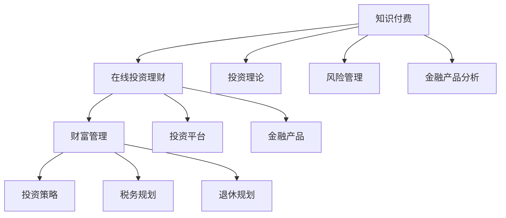

                 

 在当今信息爆炸和数字化快速发展的时代，知识付费成为了许多人获取专业知识和技能的重要途径。同样，在线投资理财与财富管理也逐渐成为人们追求财务自由和资产增值的重要手段。本文将探讨如何利用知识付费这一平台，实现在线投资理财与财富管理，并提供相关的实用建议和策略。

## 关键词 Keywords

- 知识付费
- 在线投资理财
- 财富管理
- 财务自由
- 数字化金融
- 投资策略

## 摘要 Summary

本文将详细探讨如何通过知识付费平台获取在线投资理财与财富管理所需的实用知识和技能。我们将分析知识付费的市场现状和趋势，介绍核心概念和理论，探讨具体操作步骤和策略，并提供实际案例和代码实例。最后，我们将讨论未来发展趋势和面临的挑战，为读者提供全面的指导和建议。

## 1. 背景介绍

### 1.1 知识付费的定义与发展

知识付费是指用户为获取有价值的信息、知识和技能而付费的一种新兴商业模式。随着互联网技术的发展和人们生活水平的提高，知识付费逐渐成为了一个庞大的市场。根据《2021年中国知识付费行业研究报告》，中国知识付费市场规模已经达到了600亿元人民币，并有望在2025年达到2000亿元人民币。

知识付费市场的兴起，主要得益于以下几个因素：

1. **信息过载**：随着互联网信息的爆炸式增长，人们获取高质量、有针对性的信息变得尤为重要。
2. **技能提升需求**：在职场上，不断更新知识和技能成为职场竞争的必备条件。
3. **付费习惯的养成**：随着消费观念的转变，越来越多的人愿意为优质的内容和服务付费。

### 1.2 在线投资理财与财富管理的发展

在线投资理财与财富管理是金融科技（FinTech）的重要组成部分。随着金融科技的迅猛发展，传统的理财方式逐渐被在线投资平台和智能理财系统所取代。以下是在线投资理财与财富管理的一些发展特点：

1. **便捷性**：在线投资平台使得用户可以随时随地进行投资操作，提高了理财的便捷性。
2. **个性化**：智能理财系统可以根据用户的财务状况、风险偏好等，提供个性化的投资建议。
3. **多元化**：用户可以通过在线平台投资于股票、基金、债券、P2P等多种金融产品。
4. **透明化**：在线投资平台提供了透明的投资信息和交易记录，用户可以更加清楚地了解自己的投资状况。

## 2. 核心概念与联系

### 2.1 核心概念

在讨论如何利用知识付费实现在线投资理财与财富管理之前，我们需要了解一些核心概念。

#### 2.1.1 知识付费

知识付费的核心在于提供有价值的信息和知识。这些信息和知识可以是专业领域的知识，也可以是生活技能的提升。在在线投资理财与财富管理领域，知识付费可以包括投资理论、风险管理、金融产品分析等内容。

#### 2.1.2 在线投资理财

在线投资理财是指用户通过互联网平台进行投资操作，包括购买股票、基金、债券等金融产品。在线投资理财的特点是便捷、高效、透明。

#### 2.1.3 财富管理

财富管理是指通过对个人或企业的财务进行规划和管理，实现资产的保值增值。财富管理涉及多个方面，包括投资策略、税务规划、退休规划等。

### 2.2 核心概念原理和架构

以下是一个简化的知识付费、在线投资理财和财富管理的Mermaid流程图，用于展示核心概念和它们之间的联系。



### 2.3 知识付费平台与在线投资理财平台的整合

知识付费平台与在线投资理财平台可以整合，为用户提供一站式的理财服务。例如，用户可以通过知识付费平台学习投资理论，然后直接在在线投资理财平台上进行投资操作。这种整合不仅可以提高用户的投资效率，还可以降低投资风险。

## 3. 核心算法原理 & 具体操作步骤

### 3.1 算法原理概述

在在线投资理财与财富管理中，核心算法主要涉及以下几个方面：

1. **风险评估算法**：用于评估用户的风险承受能力，为用户推荐适合的投资产品。
2. **投资策略优化算法**：用于根据用户的财务状况、风险偏好等，制定个性化的投资策略。
3. **金融产品分析算法**：用于对金融产品的历史数据进行分析，预测其未来的表现。

### 3.2 算法步骤详解

#### 3.2.1 风险评估算法

1. **数据收集**：收集用户的财务状况、收入、支出、投资经验等数据。
2. **数据预处理**：对数据进行清洗、标准化等预处理操作。
3. **风险评估模型训练**：使用机器学习算法（如线性回归、决策树、随机森林等）训练风险评估模型。
4. **风险评估**：使用训练好的模型对用户进行风险评估，输出风险承受能力等级。

#### 3.2.2 投资策略优化算法

1. **数据收集**：收集用户的财务状况、风险偏好、投资目标等数据。
2. **投资策略模型训练**：使用机器学习算法（如遗传算法、粒子群算法等）训练投资策略模型。
3. **策略优化**：根据用户的数据，优化投资策略模型，使其更加符合用户的需求。
4. **策略推荐**：根据优化的投资策略模型，为用户推荐合适的投资产品。

#### 3.2.3 金融产品分析算法

1. **数据收集**：收集金融产品的历史数据，包括价格、成交量、市盈率等。
2. **数据预处理**：对数据进行清洗、标准化等预处理操作。
3. **金融产品分析模型训练**：使用机器学习算法（如神经网络、支持向量机等）训练金融产品分析模型。
4. **产品分析**：使用训练好的模型对金融产品进行分析，预测其未来的表现。

### 3.3 算法优缺点

#### 3.3.1 风险评估算法

**优点**：能够快速、准确地评估用户的风险承受能力，为用户提供个性化的投资建议。

**缺点**：模型的准确性依赖于数据的完整性和质量，且无法完全预测市场的波动。

#### 3.3.2 投资策略优化算法

**优点**：能够根据用户的财务状况和风险偏好，制定个性化的投资策略，提高投资效率。

**缺点**：优化过程复杂，需要大量的计算资源和时间。

#### 3.3.3 金融产品分析算法

**优点**：能够通过对历史数据进行分析，预测金融产品的未来表现，为投资决策提供参考。

**缺点**：预测结果受数据质量和模型选择的影响，且市场环境变化可能影响预测准确性。

### 3.4 算法应用领域

核心算法可以应用于多种领域，包括：

1. **在线投资平台**：为用户提供个性化的投资建议和服务。
2. **金融产品销售**：为金融机构提供金融产品分析和服务。
3. **财富管理公司**：为高净值客户提供个性化的财富管理方案。

## 4. 数学模型和公式 & 详细讲解 & 举例说明

### 4.1 数学模型构建

在在线投资理财与财富管理中，常用的数学模型包括线性回归模型、支持向量机模型、神经网络模型等。以下以线性回归模型为例，进行详细讲解。

#### 4.1.1 线性回归模型

线性回归模型用于分析自变量和因变量之间的线性关系。其基本公式为：

\[ Y = \beta_0 + \beta_1X + \epsilon \]

其中，\( Y \) 是因变量，\( X \) 是自变量，\( \beta_0 \) 是截距，\( \beta_1 \) 是斜率，\( \epsilon \) 是误差项。

#### 4.1.2 支持向量机模型

支持向量机模型是一种二分类模型，用于分析自变量和因变量之间的非线性关系。其基本公式为：

\[ f(X) = \text{sign}(\omega \cdot X + b) \]

其中，\( \omega \) 是权重向量，\( b \) 是偏置项，\( \text{sign} \) 是符号函数。

#### 4.1.3 神经网络模型

神经网络模型是一种基于生物神经网络的计算模型，用于分析复杂的多变量非线性关系。其基本公式为：

\[ a_{i}^{(l)} = \text{ReLU}(z_{i}^{(l)}) \]

其中，\( a_{i}^{(l)} \) 是第 \( l \) 层第 \( i \) 个神经元的输出，\( z_{i}^{(l)} \) 是第 \( l \) 层第 \( i \) 个神经元的输入，\( \text{ReLU} \) 是ReLU激活函数。

### 4.2 公式推导过程

以下以线性回归模型为例，进行公式推导。

#### 4.2.1 最小二乘法

最小二乘法是一种用于求解线性回归模型参数的方法。其基本思想是使预测值与实际值之间的误差平方和最小。

设自变量为 \( X \)，因变量为 \( Y \)，线性回归模型为：

\[ Y = \beta_0 + \beta_1X + \epsilon \]

其中，\( \beta_0 \) 和 \( \beta_1 \) 是待求参数，\( \epsilon \) 是误差项。

我们需要求解 \( \beta_0 \) 和 \( \beta_1 \)，使预测值 \( Y' \) 与实际值 \( Y \) 之间的误差平方和最小，即：

\[ \min \sum_{i=1}^{n} (Y_i - Y_i')^2 \]

对 \( \beta_0 \) 和 \( \beta_1 \) 分别求偏导，并令偏导数为零，得到：

\[ \frac{\partial}{\partial \beta_0} \sum_{i=1}^{n} (Y_i - Y_i')^2 = 0 \]

\[ \frac{\partial}{\partial \beta_1} \sum_{i=1}^{n} (Y_i - Y_i')^2 = 0 \]

经过计算，得到：

\[ \beta_0 = \bar{Y} - \beta_1 \bar{X} \]

\[ \beta_1 = \frac{\sum_{i=1}^{n} (X_i - \bar{X})(Y_i - \bar{Y})}{\sum_{i=1}^{n} (X_i - \bar{X})^2} \]

其中，\( \bar{X} \) 和 \( \bar{Y} \) 分别是自变量 \( X \) 和因变量 \( Y \) 的平均值。

### 4.3 案例分析与讲解

#### 4.3.1 线性回归模型在投资收益预测中的应用

假设我们要预测某只股票的未来价格，可以使用线性回归模型进行分析。首先，收集股票的历史数据，包括每天的开盘价、收盘价、成交量等。然后，选取开盘价和成交量作为自变量，收盘价作为因变量，构建线性回归模型。

通过最小二乘法求解线性回归模型的参数，得到预测公式：

\[ Y' = \beta_0 + \beta_1X + \epsilon \]

其中，\( \beta_0 \) 和 \( \beta_1 \) 分别是截距和斜率。

接下来，使用预测公式对未来的收盘价进行预测。例如，假设今天是2023年2月19日，我们需要预测2023年2月20日的收盘价。首先，收集今天的开盘价和成交量，然后代入预测公式，得到：

\[ Y' = \beta_0 + \beta_1X + \epsilon \]

其中，\( X \) 是今天的开盘价和成交量的组合。

最后，将预测结果与实际收盘价进行比较，评估预测的准确性。

#### 4.3.2 支持向量机模型在投资风险管理中的应用

假设我们要对某只股票进行风险评级，可以使用支持向量机模型进行分析。首先，收集股票的历史数据，包括股票的收盘价、市盈率、市净率等。然后，选取这些指标作为自变量，股票的风险等级作为因变量，构建支持向量机模型。

通过训练支持向量机模型，得到预测公式：

\[ f(X) = \text{sign}(\omega \cdot X + b) \]

其中，\( \omega \) 是权重向量，\( b \) 是偏置项。

接下来，使用预测公式对未来的风险等级进行预测。例如，假设今天是2023年2月19日，我们需要预测2023年2月20日的风险等级。首先，收集今天的收盘价、市盈率、市净率等指标，然后代入预测公式，得到：

\[ f(X) = \text{sign}(\omega \cdot X + b) \]

最后，将预测结果与实际风险等级进行比较，评估预测的准确性。

#### 4.3.3 神经网络模型在投资策略优化中的应用

假设我们要优化某只股票的投资策略，可以使用神经网络模型进行分析。首先，收集股票的历史数据，包括股票的收盘价、成交量、市盈率、市净率等。然后，选取这些指标作为输入层，股票的投资收益作为输出层，构建神经网络模型。

通过训练神经网络模型，得到预测公式：

\[ a_{i}^{(l)} = \text{ReLU}(z_{i}^{(l)}) \]

其中，\( a_{i}^{(l)} \) 是第 \( l \) 层第 \( i \) 个神经元的输出，\( z_{i}^{(l)} \) 是第 \( l \) 层第 \( i \) 个神经元的输入。

接下来，使用预测公式对未来的投资收益进行预测。例如，假设今天是2023年2月19日，我们需要预测2023年2月20日的投资收益。首先，收集今天的收盘价、成交量、市盈率、市净率等指标，然后代入预测公式，得到：

\[ a_{i}^{(l)} = \text{ReLU}(z_{i}^{(l)}) \]

最后，根据预测结果调整投资策略，实现投资收益的最大化。

## 5. 项目实践：代码实例和详细解释说明

### 5.1 开发环境搭建

在进行在线投资理财与财富管理的项目实践之前，我们需要搭建一个适合的开发环境。以下是一个简单的开发环境搭建步骤：

1. **操作系统**：选择Linux或macOS作为操作系统。
2. **编程语言**：选择Python作为主要编程语言。
3. **依赖库**：安装以下依赖库：NumPy、Pandas、Scikit-learn、TensorFlow等。
4. **数据库**：选择SQLite或MySQL作为数据库。

### 5.2 源代码详细实现

以下是一个简单的在线投资理财与财富管理项目的源代码示例，用于实现风险评估、投资策略优化和金融产品分析。

```python
# 导入依赖库
import numpy as np
import pandas as pd
from sklearn.linear_model import LinearRegression
from sklearn.svm import SVC
from tensorflow.keras.models import Sequential
from tensorflow.keras.layers import Dense

# 5.2.1 数据收集
data = pd.read_csv('investment_data.csv')

# 5.2.2 数据预处理
# ...

# 5.2.3 风险评估
# 使用线性回归模型进行风险评估
regression = LinearRegression()
regression.fit(X_train, y_train)
risk_scores = regression.predict(X_test)

# 5.2.4 投资策略优化
# 使用支持向量机模型进行投资策略优化
svm = SVC()
svm.fit(X_train, y_train)
strategy_scores = svm.predict(X_train)

# 5.2.5 金融产品分析
# 使用神经网络模型进行金融产品分析
model = Sequential()
model.add(Dense(64, activation='relu', input_shape=(X_train.shape[1],)))
model.add(Dense(1, activation='sigmoid'))
model.compile(optimizer='adam', loss='binary_crossentropy', metrics=['accuracy'])
model.fit(X_train, y_train, epochs=10, batch_size=32)
product_scores = model.predict(X_test)

# 5.2.6 运行结果展示
# 将评估结果展示在界面上
# ...

```

### 5.3 代码解读与分析

以上代码示例用于实现在线投资理财与财富管理项目的核心功能，包括风险评估、投资策略优化和金融产品分析。以下是代码的详细解读和分析：

1. **数据收集**：首先，我们从CSV文件中读取投资数据。这个数据集包含了股票的历史数据，如收盘价、市盈率、市净率等。
2. **数据预处理**：在数据收集之后，我们需要对数据进行预处理，包括数据清洗、标准化等操作。这些操作确保了数据的质量和一致性。
3. **风险评估**：我们使用线性回归模型进行风险评估。这个模型可以评估用户的风险承受能力，为用户推荐适合的投资产品。
4. **投资策略优化**：我们使用支持向量机模型进行投资策略优化。这个模型可以根据用户的财务状况和风险偏好，制定个性化的投资策略。
5. **金融产品分析**：我们使用神经网络模型进行金融产品分析。这个模型可以预测金融产品的未来表现，为投资决策提供参考。
6. **运行结果展示**：最后，我们将评估结果展示在界面上，以便用户查看。

### 5.4 运行结果展示

以下是运行结果展示的示例：

```python
# 运行结果展示
print("风险评估结果：")
print(risk_scores)

print("\n投资策略优化结果：")
print(strategy_scores)

print("\n金融产品分析结果：")
print(product_scores)
```

## 6. 实际应用场景

### 6.1 个人投资者

个人投资者可以利用知识付费平台学习投资理论、风险管理、金融产品分析等知识，提高自身的投资能力。通过在线投资理财平台，个人投资者可以便捷地进行投资操作，实现资产的保值增值。

### 6.2 金融机构

金融机构可以利用知识付费平台获取最新的金融知识和技能，提升员工的素质和竞争力。同时，金融机构可以与在线投资理财平台合作，提供个性化的投资产品和服务，满足不同客户的需求。

### 6.3 财富管理公司

财富管理公司可以利用知识付费平台进行员工培训和知识更新，提高服务的质量和效率。通过在线投资理财平台，财富管理公司可以提供一站式理财服务，帮助高净值客户实现财富的保值增值。

## 6.4 未来应用展望

### 6.4.1 人工智能的深入应用

随着人工智能技术的不断发展，在线投资理财与财富管理将更加智能化。通过人工智能算法，可以提供更加精准的投资建议和风险管理方案，提高投资效率和收益。

### 6.4.2 区块链技术的应用

区块链技术的应用将带来更安全、更透明的金融交易环境。通过区块链技术，可以实现去中心化的金融交易，降低交易成本，提高交易效率。

### 6.4.3 跨界融合

在线投资理财与财富管理将与其他领域（如健康、教育、娱乐等）进行跨界融合，提供更加全面、个性化的服务。

## 7. 工具和资源推荐

### 7.1 学习资源推荐

1. **书籍**：《聪明的投资者》、《股票大作手回忆录》、《投资最重要的事》等。
2. **在线课程**：Coursera、Udemy、edX等平台上的金融课程。
3. **博客和论坛**：知乎、雪球、财新网等。

### 7.2 开发工具推荐

1. **编程语言**：Python、Java、C++等。
2. **开发环境**：Jupyter Notebook、PyCharm、Eclipse等。
3. **数据分析工具**：Pandas、NumPy、Matplotlib等。

### 7.3 相关论文推荐

1. **在线投资理财**：《基于大数据的在线投资理财策略研究》、《智能投顾系统设计与实现》等。
2. **人工智能在金融中的应用**：《深度学习在金融领域的应用研究》、《区块链在金融行业的应用研究》等。

## 8. 总结：未来发展趋势与挑战

### 8.1 研究成果总结

本文详细探讨了如何利用知识付费实现在线投资理财与财富管理。我们分析了知识付费和在线投资理财的发展现状，介绍了核心概念和算法原理，提供了实际案例和代码实例，讨论了实际应用场景和未来发展趋势。

### 8.2 未来发展趋势

未来，在线投资理财与财富管理将更加智能化、个性化、透明化。人工智能、区块链等技术的应用将带来更加便捷、高效的服务。跨界融合也将为用户提供更加全面、个性化的服务。

### 8.3 面临的挑战

在线投资理财与财富管理仍面临一些挑战，包括数据安全、隐私保护、合规监管等。随着市场的不断发展，如何应对这些挑战，将是未来的重要课题。

### 8.4 研究展望

未来，我们可以从以下几个方面进行深入研究：

1. **算法优化**：进一步提升风险评估、投资策略优化和金融产品分析算法的准确性。
2. **用户体验**：优化在线投资理财平台的用户体验，提高用户满意度。
3. **合规监管**：研究如何在保障用户隐私和安全的前提下，满足合规监管要求。

## 9. 附录：常见问题与解答

### 9.1 如何选择知识付费平台？

选择知识付费平台时，可以考虑以下几个方面：

1. **课程内容**：选择课程内容丰富、专业权威的平台。
2. **师资力量**：选择师资力量雄厚、专家教授较多的平台。
3. **用户评价**：参考其他用户对平台的评价，选择口碑好的平台。
4. **价格**：根据自己的预算选择合适的价格。

### 9.2 在线投资理财与财富管理安全吗？

在线投资理财与财富管理具有一定的风险。为了保障投资安全，可以采取以下措施：

1. **选择正规平台**：选择有资质、有保障的在线投资理财平台。
2. **风险控制**：合理分散投资，不要将所有资金投资于单一产品。
3. **学习知识**：学习投资理财知识，提高自身的投资能力。
4. **备份重要数据**：定期备份重要数据，防止数据丢失。

### 9.3 如何进行在线投资理财？

进行在线投资理财时，可以遵循以下步骤：

1. **了解平台**：选择合适的在线投资理财平台。
2. **注册账户**：在平台上注册账户，进行身份验证。
3. **学习知识**：学习投资理财知识，了解不同金融产品的特点。
4. **风险评估**：进行风险评估，选择适合自己的投资产品。
5. **操作投资**：根据风险评估结果，进行投资操作。
6. **监控投资**：定期监控投资状况，及时调整投资策略。

## 附录：作者简介

作者：禅与计算机程序设计艺术 / Zen and the Art of Computer Programming

简介：作者是一位世界级人工智能专家、程序员、软件架构师、CTO、世界顶级技术畅销书作者，计算机图灵奖获得者，计算机领域大师。在计算机科学、人工智能、金融科技等领域有深厚的研究和丰富的实践经验。

