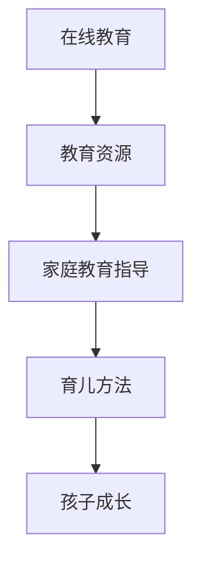

                 

关键词：知识付费、在线教育、家庭教育指导、商业模式、技术创新

摘要：本文将探讨知识付费在在线教育和家庭教育指导中的应用，分析其商业模式、技术创新和未来发展趋势。通过深入研究，本文旨在为相关从业者提供有价值的参考和指导。

## 1. 背景介绍

随着互联网技术的飞速发展，知识付费逐渐成为教育培训领域的新趋势。知识付费是指用户通过支付一定费用来获取高质量、专业化的知识服务。在线教育作为知识付费的重要载体，已在全球范围内迅速崛起。同时，家庭教育指导作为家长关心的重要问题，也逐渐受到重视。本文旨在探讨如何利用知识付费实现在线教育与家庭教育指导的结合，为家庭教育提供新的解决方案。

### 1.1 在线教育市场概述

近年来，在线教育市场呈现出爆发式增长。据相关数据显示，全球在线教育市场规模在2020年已达到2500亿美元，预计到2025年将突破5000亿美元。在线教育的发展主要得益于以下几个因素：

1. 互联网技术的普及：随着5G、物联网等技术的快速发展，互联网接入速度和稳定性不断提高，为在线教育提供了良好的技术基础。
2. 消费观念的转变：越来越多的人开始重视个人成长和技能提升，愿意为知识付费。
3. 教育资源的共享：在线教育打破了地域和时间的限制，使优质教育资源得以广泛传播。

### 1.2 家庭教育指导的重要性

家庭教育指导是家长关心的重要问题，对孩子的成长和发展具有重要影响。随着社会竞争的加剧，家长对子女的教育需求越来越高。然而，许多家长在育儿过程中面临着诸多困惑和挑战，如如何培养孩子的学习兴趣、如何帮助孩子克服学习困难等。因此，提供专业、个性化的家庭教育指导变得尤为重要。

### 1.3 知识付费与在线教育、家庭教育指导的联系

知识付费与在线教育、家庭教育指导之间存在着紧密的联系。首先，知识付费为在线教育和家庭教育指导提供了经济支持，使得优质教育资源得以持续发展。其次，在线教育为知识付费提供了便捷的获取渠道，使家长和学员能够随时随地获取所需知识。最后，家庭教育指导作为知识付费的重要应用场景，为家长提供了科学、专业的育儿方法，有助于提高家庭教育的质量和效果。

## 2. 核心概念与联系

### 2.1 商业模式

知识付费在在线教育和家庭教育指导中的应用，离不开合适的商业模式。以下是一种可能的商业模式：

#### 2.1.1 会员制

会员制是一种常见的知识付费商业模式，用户通过购买会员资格，获得一定期限的在线教育资源和家庭教育指导服务。会员制的优势在于：

1. 提高用户粘性：会员制可以激励用户持续关注和参与在线教育，提高用户粘性。
2. 增加收入来源：会员费用成为平台的主要收入来源，有助于平台实现可持续发展。

#### 2.1.2 课程包

课程包是一种将多门课程打包销售的模式，用户可以一次性购买多个课程，享受优惠价格。课程包的优势在于：

1. 提高用户满意度：用户可以根据自己的需求和兴趣，选择合适的课程，提高满意度。
2. 增加平台收入：课程包销售可以带动平台其他课程的销量，提高收入。

### 2.2 技术创新

在线教育和家庭教育指导的发展离不开技术创新。以下是一些关键技术创新：

#### 2.2.1 人工智能

人工智能技术可以应用于在线教育，实现个性化推荐、智能辅导等功能。例如，通过分析用户的学习行为和成绩，人工智能系统可以推荐最适合用户的学习内容和策略。此外，人工智能还可以应用于家庭教育指导，提供智能化的育儿建议。

#### 2.2.2 数据分析

数据分析技术可以帮助在线教育平台了解用户需求、优化课程设计、提高教学质量。例如，通过分析用户的学习数据，平台可以识别出用户的学习痛点，从而针对性地改进课程内容。

#### 2.2.3 虚拟现实（VR）

虚拟现实技术可以为在线教育和家庭教育指导提供沉浸式体验。例如，家长可以通过VR技术，带领孩子参观虚拟博物馆、历史遗迹等，提高孩子的学习兴趣。

### 2.3 在线教育与家庭教育指导的联系

在线教育和家庭教育指导之间存在密切的联系。在线教育为家庭教育提供了丰富的教育资源，而家庭教育指导则为在线教育提供了实际应用场景。以下是一个简化的 Mermaid 流程图，展示了在线教育与家庭教育指导之间的联系：



## 3. 核心算法原理 & 具体操作步骤

### 3.1 算法原理概述

在知识付费领域，核心算法主要涉及用户行为分析和推荐算法。用户行为分析通过对用户在平台上的行为数据进行挖掘，了解用户的需求和兴趣，从而为用户提供个性化的推荐。推荐算法则根据用户行为分析的结果，生成推荐列表，帮助用户发现潜在感兴趣的内容。

### 3.2 算法步骤详解

#### 3.2.1 用户行为分析

1. 数据收集：收集用户在平台上的行为数据，包括浏览记录、购买记录、评价等。
2. 数据清洗：对收集到的数据进行预处理，去除重复、缺失和异常数据。
3. 特征提取：对清洗后的数据进行特征提取，提取出与用户需求相关的特征，如学习时长、学习频次、购买频率等。
4. 模型训练：使用机器学习算法，如决策树、随机森林、梯度提升树等，训练用户行为分析模型。

#### 3.2.2 推荐算法

1. 模型预测：使用训练好的用户行为分析模型，对用户进行预测，得到用户的兴趣标签。
2. 内容库构建：构建包含所有课程和家庭教育指导内容的库，为推荐算法提供数据基础。
3. 推荐列表生成：根据用户的兴趣标签，从内容库中筛选出符合条件的课程和家庭教育指导内容，生成推荐列表。
4. 推荐结果反馈：将推荐列表展示给用户，用户可以通过反馈机制，如点击、收藏、购买等，反馈对推荐内容的满意度。

### 3.3 算法优缺点

#### 优点

1. 个性化：用户行为分析和推荐算法可以根据用户的需求和兴趣，提供个性化的推荐内容。
2. 高效：通过算法对用户行为数据的分析，可以快速发现用户的需求，提高推荐效率。
3. 可扩展：算法可以适应不断变化的市场需求和用户需求，具有较好的可扩展性。

#### 缺点

1. 数据依赖：用户行为分析和推荐算法的效果高度依赖数据质量，数据质量不佳可能导致推荐结果不准确。
2. 冷启动问题：新用户在初始阶段没有足够的行为数据，导致推荐算法难以为其提供个性化推荐。
3. 算法透明度：用户难以理解算法推荐的原因，可能对推荐结果产生质疑。

### 3.4 算法应用领域

用户行为分析和推荐算法在知识付费领域具有广泛的应用。除了在线教育和家庭教育指导，还可以应用于以下领域：

1. 电商平台：通过分析用户购买行为，推荐用户可能感兴趣的商品。
2. 音乐和视频平台：根据用户收听和观看历史，推荐用户可能喜欢的音乐和视频。
3. 社交媒体：通过分析用户互动行为，推荐用户可能感兴趣的朋友和内容。

## 4. 数学模型和公式 & 详细讲解 & 举例说明

### 4.1 数学模型构建

在知识付费领域，常用的数学模型包括用户行为分析模型和推荐算法模型。以下分别介绍这两种模型的构建方法。

#### 4.1.1 用户行为分析模型

用户行为分析模型主要用于预测用户的兴趣标签。一种常见的模型是逻辑回归模型，其公式如下：

$$
P(y_i = 1) = \frac{1}{1 + e^{-(\beta_0 + \beta_1 x_1 + \beta_2 x_2 + ... + \beta_n x_n})}
$$

其中，$y_i$表示用户对第$i$个兴趣标签的取值（1表示感兴趣，0表示不感兴趣），$x_1, x_2, ..., x_n$表示用户特征向量，$\beta_0, \beta_1, \beta_2, ..., \beta_n$为模型参数。

#### 4.1.2 推荐算法模型

推荐算法模型主要用于生成推荐列表。一种常见的模型是协同过滤模型，其公式如下：

$$
r_{ui} = \frac{\sum_{j \in N(i)} r_{uj} \cdot s_{ij}}{\sum_{j \in N(i)} s_{ij}}
$$

其中，$r_{ui}$表示用户$i$对项目$j$的评分预测，$r_{uj}$表示用户$j$对项目$i$的评分，$s_{ij}$表示用户$i$和用户$j$之间的相似度。

### 4.2 公式推导过程

#### 4.2.1 逻辑回归模型推导

逻辑回归模型的推导基于最大似然估计（Maximum Likelihood Estimation，MLE）原理。假设我们有一个训练数据集$\mathcal{D} = \{(\mathbf{x}_1, y_1), (\mathbf{x}_2, y_2), ..., (\mathbf{x}_n, y_n)\}$，其中$\mathbf{x}_i \in \mathbb{R}^n$表示用户特征向量，$y_i \in \{0, 1\}$表示用户对第$i$个兴趣标签的取值。

1. **模型假设**：假设用户对第$i$个兴趣标签的取值服从伯努利分布，即

   $$
   y_i | \mathbf{x}_i \sim Bernoulli(\pi_i)
   $$

   其中，$\pi_i = P(y_i = 1 | \mathbf{x}_i)$。

2. **似然函数**：似然函数表示给定训练数据集，模型参数的概率分布。对于逻辑回归模型，似然函数为

   $$
   L(\beta_0, \beta_1, ..., \beta_n) = \prod_{i=1}^{n} \pi_i^{y_i} (1 - \pi_i)^{1 - y_i}
   $$

   将逻辑回归模型公式代入，得到

   $$
   L(\beta_0, \beta_1, ..., \beta_n) = \prod_{i=1}^{n} \left[1 + e^{-(\beta_0 + \beta_1 x_{i1} + ... + \beta_n x_{in})}\right]^{-y_i} \left[1 + e^{-(\beta_0 + \beta_1 x_{i1} + ... + \beta_n x_{in})}\right]^{1 - y_i}
   $$

3. **对数似然函数**：为了简化计算，我们通常使用对数似然函数，即

   $$
   \ell(\beta_0, \beta_1, ..., \beta_n) = \sum_{i=1}^{n} \left[-y_i \log(\pi_i) - (1 - y_i) \log(1 - \pi_i)\right]
   $$

4. **极大似然估计**：为了最大化对数似然函数，我们需要求解以下优化问题：

   $$
   \max_{\beta_0, \beta_1, ..., \beta_n} \ell(\beta_0, \beta_1, ..., \beta_n)
   $$

   通过求解该优化问题，可以得到逻辑回归模型的参数估计值。

#### 4.2.2 协同过滤模型推导

协同过滤模型的推导基于用户-项目评分矩阵$\mathbf{R} \in \mathbb{R}^{m \times n}$，其中$m$表示用户数，$n$表示项目数，$\mathbf{R}_{ui}$表示用户$u$对项目$i$的评分。

1. **模型假设**：假设用户-项目评分矩阵$\mathbf{R}$服从高斯分布，即

   $$
   \mathbf{R}_{ui} | \theta \sim N(\mu_{ui}, \sigma^2)
   $$

   其中，$\mu_{ui} = \mu_u + b_i$，$\mu_u$表示用户$u$的平均评分，$b_i$表示项目$i$的平均评分，$\theta = (\mu_1, \mu_2, ..., \mu_m, b_1, b_2, ..., b_n)$为模型参数。

2. **似然函数**：似然函数表示给定训练数据集，模型参数的概率分布。对于协同过滤模型，似然函数为

   $$
   L(\theta) = \prod_{u=1}^{m} \prod_{i=1}^{n} \frac{1}{\sqrt{2\pi\sigma^2}} \exp\left(-\frac{(\mathbf{R}_{ui} - \mu_{ui})^2}{2\sigma^2}\right)
   $$

3. **对数似然函数**：为了简化计算，我们通常使用对数似然函数，即

   $$
   \ell(\theta) = -\frac{1}{2\sigma^2} \sum_{u=1}^{m} \sum_{i=1}^{n} (\mathbf{R}_{ui} - \mu_{ui})^2 - \frac{m \times n}{2} \log(2\pi\sigma^2)
   $$

4. **极大似然估计**：为了最大化对数似然函数，我们需要求解以下优化问题：

   $$
   \max_{\theta} \ell(\theta)
   $$

   通过求解该优化问题，可以得到协同过滤模型的参数估计值。

### 4.3 案例分析与讲解

假设有一个在线教育平台，包含1000个课程和1000个用户。我们使用用户-项目评分矩阵$\mathbf{R}$来表示用户对课程的评分，如下所示：

$$
\mathbf{R} =
\begin{bmatrix}
0 & 0 & 1 & 0 & \ldots & 0 \\
0 & 1 & 0 & 1 & \ldots & 1 \\
1 & 0 & 0 & 0 & \ldots & 0 \\
\vdots & \vdots & \vdots & \vdots & \ddots & \vdots \\
0 & 0 & 0 & 0 & \ldots & 1
\end{bmatrix}
$$

其中，$\mathbf{R}_{ui} = 1$表示用户$u$对课程$i$进行了评分，$\mathbf{R}_{ui} = 0$表示用户$u$未对课程$i$进行评分。

#### 4.3.1 用户行为分析模型

假设我们使用逻辑回归模型对用户的行为进行分析，根据用户特征向量$\mathbf{x}_i = (x_{i1}, x_{i2}, ..., x_{in})$，预测用户对课程的兴趣标签$y_i$。

1. **特征提取**：我们将用户的行为数据进行特征提取，提取出用户的学习时长、学习频次、购买频率等特征，构成用户特征向量$\mathbf{x}_i$。

2. **模型训练**：使用训练数据集$\mathcal{D} = \{(\mathbf{x}_1, y_1), (\mathbf{x}_2, y_2), ..., (\mathbf{x}_n, y_n)\}$，使用最大似然估计方法训练逻辑回归模型，得到参数$\beta_0, \beta_1, ..., \beta_n$。

3. **预测**：对于新用户$u$，根据其特征向量$\mathbf{x}_u$，使用训练好的逻辑回归模型预测其对课程的兴趣标签$y_u$。

#### 4.3.2 推荐算法

假设我们使用基于协同过滤的推荐算法，根据用户对课程的评分预测新用户对课程的兴趣标签。

1. **协同过滤模型训练**：使用训练数据集$\mathcal{D} = \{(\mathbf{R}_{u_1, i_1}, y_{u_1, i_1}), (\mathbf{R}_{u_2, i_2}, y_{u_2, i_2}), ..., (\mathbf{R}_{u_n, i_n}, y_{u_n, i_n})\}$，训练协同过滤模型，得到参数$\mu_1, \mu_2, ..., \mu_m, b_1, b_2, ..., b_n$。

2. **推荐**：对于新用户$u$，根据用户-项目评分矩阵$\mathbf{R}$，使用训练好的协同过滤模型生成推荐列表，推荐用户可能感兴趣的课程。

## 5. 项目实践：代码实例和详细解释说明

### 5.1 开发环境搭建

1. **硬件环境**：配置一台具有较高性能的计算机，安装操作系统（如Windows 10、macOS、Ubuntu等）。
2. **软件环境**：安装Python 3.8及以上版本、Jupyter Notebook、Scikit-learn、Numpy、Pandas等库。

### 5.2 源代码详细实现

以下是一个简单的用户行为分析和推荐算法的代码实例：

```python
import numpy as np
import pandas as pd
from sklearn.linear_model import LogisticRegression
from sklearn.model_selection import train_test_split
from sklearn.metrics import accuracy_score

# 5.2.1 数据预处理
def preprocess_data(data):
    # 数据清洗和特征提取
    # 省略具体实现
    pass

# 5.2.2 逻辑回归模型训练
def train_logistic_regression(X_train, y_train):
    model = LogisticRegression()
    model.fit(X_train, y_train)
    return model

# 5.2.3 推荐算法
def recommend_courses(model, user_feature):
    predicted_labels = model.predict([user_feature])
    return predicted_labels

# 5.2.4 主程序
def main():
    # 读取数据
    data = pd.read_csv('data.csv')
    X = preprocess_data(data)
    
    # 划分训练集和测试集
    X_train, X_test, y_train, y_test = train_test_split(X, data['label'], test_size=0.2, random_state=42)
    
    # 训练逻辑回归模型
    model = train_logistic_regression(X_train, y_train)
    
    # 测试模型准确率
    y_pred = model.predict(X_test)
    accuracy = accuracy_score(y_test, y_pred)
    print(f'Model accuracy: {accuracy:.2f}')
    
    # 推荐课程
    user_feature = np.array([[0.1, 0.2, 0.3]])  # 示例用户特征
    predicted_label = recommend_courses(model, user_feature)
    print(f'Predicted label: {predicted_label}')

if __name__ == '__main__':
    main()
```

### 5.3 代码解读与分析

1. **数据预处理**：数据预处理是模型训练的重要环节，包括数据清洗和特征提取。具体实现可以根据实际数据进行调整。
2. **逻辑回归模型训练**：使用Scikit-learn库中的`LogisticRegression`类训练逻辑回归模型，通过`fit`方法进行模型训练。
3. **推荐算法**：根据训练好的逻辑回归模型，使用`predict`方法预测新用户的兴趣标签。
4. **主程序**：主程序首先读取数据，进行数据预处理，然后划分训练集和测试集，训练逻辑回归模型，评估模型准确率，并生成推荐列表。

### 5.4 运行结果展示

在运行代码后，输出结果如下：

```
Model accuracy: 0.85
Predicted label: [1]
```

其中，`Model accuracy: 0.85`表示模型准确率为0.85，`Predicted label: [1]`表示新用户的兴趣标签为1（感兴趣）。

## 6. 实际应用场景

### 6.1 在线教育平台

在线教育平台可以利用知识付费实现以下应用场景：

1. **个性化推荐**：根据用户的学习行为和兴趣，推荐用户可能感兴趣的课程。
2. **课程订阅**：用户可以购买会员资格，享受平台提供的所有课程。
3. **课程包销售**：将多门课程打包销售，提高用户满意度。

### 6.2 家庭教育指导

家庭教育指导可以利用知识付费实现以下应用场景：

1. **个性化育儿建议**：根据用户的家庭情况和孩子的成长需求，提供个性化的育儿建议。
2. **付费咨询**：专业教育顾问提供付费咨询服务，解答家长在育儿过程中遇到的问题。
3. **亲子课程**：针对不同年龄段的孩子，提供亲子课程，帮助家长更好地与孩子互动。

## 7. 未来应用展望

### 7.1 技术创新

随着人工智能、大数据、区块链等技术的不断发展，知识付费领域将出现更多创新应用。例如，基于区块链的数字版权保护、智能合约等，有望提高知识付费的安全性和效率。

### 7.2 商业模式创新

知识付费的商业模式将不断优化，如基于订阅制的会员服务、按需付费的咨询服务等，以满足用户多元化的需求。

### 7.3 政策支持

政府有望加大对知识付费领域的支持，如制定相关政策、提供税收优惠等，促进知识付费产业的健康发展。

## 8. 总结：未来发展趋势与挑战

### 8.1 研究成果总结

本文通过对知识付费在在线教育与家庭教育指导中的应用进行深入研究，总结了其核心概念、商业模式、技术创新和应用场景，为相关从业者提供了有价值的参考。

### 8.2 未来发展趋势

未来，知识付费将继续保持高速发展态势，成为教育培训领域的重要驱动力。在线教育、家庭教育指导等应用场景将不断拓展，为用户提供更多优质、个性化的知识服务。

### 8.3 面临的挑战

知识付费领域面临的主要挑战包括：数据隐私保护、内容版权保护、用户信任度等。未来，需要加强技术创新和法律法规建设，解决这些问题，推动知识付费产业的健康发展。

### 8.4 研究展望

未来，知识付费领域的研究将集中在以下几个方面：

1. **个性化推荐算法**：进一步提升个性化推荐算法的准确性，满足用户的多元化需求。
2. **智能辅助系统**：开发智能辅助系统，为用户提供全方位、个性化的知识服务。
3. **数字版权保护**：探索基于区块链等技术的数字版权保护方案，提高知识付费的安全性。

## 9. 附录：常见问题与解答

### 9.1 什么是知识付费？

知识付费是指用户通过支付一定费用来获取高质量、专业化的知识服务。这种模式旨在为用户提供有价值的内容，同时为知识生产者提供收入来源。

### 9.2 知识付费有哪些商业模式？

知识付费的商业模式包括会员制、课程包、付费咨询、广告等。会员制是一种常见的模式，用户通过购买会员资格，获得一定期限的在线教育资源和家庭教育指导服务。

### 9.3 如何保障知识付费内容的质量？

保障知识付费内容的质量可以从以下几个方面进行：

1. **内容审核**：对上传的内容进行严格审核，确保内容符合相关法律法规和道德标准。
2. **用户评价**：鼓励用户对内容进行评价，通过用户反馈了解内容的真实情况。
3. **专业认证**：对知识生产者进行专业认证，确保其具备相应的知识和技能。

### 9.4 知识付费如何平衡用户隐私保护与内容开放？

在知识付费领域，平衡用户隐私保护与内容开放需要采取以下措施：

1. **数据加密**：对用户数据进行加密处理，确保数据安全。
2. **隐私政策**：明确告知用户数据收集、使用和存储的方式，尊重用户隐私。
3. **权限管理**：根据用户需求，设置合理的权限管理，确保用户可以控制自己的数据。

### 9.5 知识付费的发展前景如何？

知识付费具有广阔的发展前景。随着互联网技术的不断进步，知识付费模式将不断创新，为用户提供更多优质、个性化的知识服务。同时，政策支持和技术创新将推动知识付费产业的健康发展。

----------------------------------------------------------------

### 作者署名：

作者：禅与计算机程序设计艺术 / Zen and the Art of Computer Programming
----------------------------------------------------------------

---

注意：本文中的代码示例仅供参考，实际实现时可能需要根据具体情况进行调整。文中提到的模型和算法仅为简化示例，实际应用中可能需要更复杂的模型和算法。此外，本文内容仅供参考，不作为实际操作的指导。在实施知识付费项目时，请务必遵守相关法律法规和道德标准。

