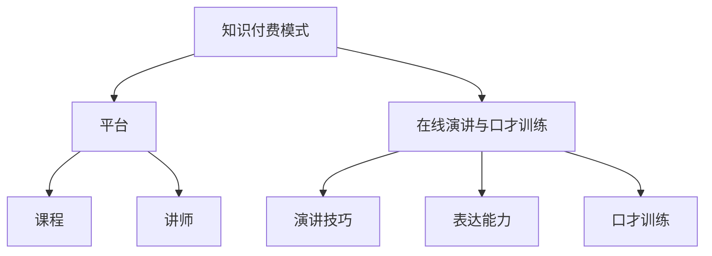

                 

 > **关键词：** 知识付费、在线演讲、口才训练、在线教育、互动学习、技术平台。

> **摘要：** 本文将探讨如何利用知识付费模式，通过在线演讲与口才训练，实现教育资源的共享与优化。文章首先介绍了在线演讲与口才训练的背景与重要性，然后深入分析了知识付费模式及其在在线演讲与口才训练中的应用。接着，文章详细讨论了在线演讲与口才训练的核心算法原理与操作步骤，并展示了数学模型与公式在其中的应用。文章还通过实际项目实践，提供了代码实例与详细解释。最后，文章探讨了在线演讲与口才训练的实际应用场景、未来发展趋势、面临的挑战以及研究展望。

## 1. 背景介绍

在信息爆炸和互联网普及的今天，在线教育和知识付费逐渐成为人们获取知识和技能的重要途径。知识付费，即用户通过支付费用来获取有价值的信息和服务，这种模式在在线教育领域得到了广泛应用。在线演讲与口才训练作为提高个人表达能力和职场竞争力的重要手段，也越来越多地受到关注。

### 1.1 在线演讲与口才训练的背景

在线演讲与口才训练，是指通过互联网平台，提供专业的演讲技巧、表达能力和口才训练课程，帮助学员提高演讲水平和表达能力。这种训练方式具有灵活、便捷、个性化等特点，尤其适合现代人快节奏的生活和工作方式。

### 1.2 在线演讲与口才训练的重要性

良好的口才和演讲能力，不仅能够提高个人的自信心和表达能力，还在职场、社交、教育等领域具有重要的应用价值。在线演讲与口才训练，可以通过系统的训练课程，帮助学员克服紧张、表达不清等问题，提升演讲技巧和口才水平。

## 2. 核心概念与联系

### 2.1 知识付费模式

知识付费模式是指用户通过支付费用来获取有价值的信息和服务。这种模式的核心在于提供高质量的知识内容，满足用户的学习需求。知识付费模式在在线教育领域得到了广泛应用，通过平台、课程、讲师等各个环节，实现了教育资源的共享与优化。

### 2.2 在线演讲与口才训练的核心概念

在线演讲与口才训练的核心概念包括演讲技巧、表达能力和口才训练。演讲技巧涵盖了语言表达、肢体语言、声音控制、演讲结构等方面；表达能力则涉及逻辑思维、观点表达、情感传达等；口才训练则侧重于发音、语调、节奏、停顿等细节。

### 2.3 Mermaid 流程图

下面是一个简单的 Mermaid 流程图，展示了知识付费模式与在线演讲与口才训练之间的联系。



## 3. 核心算法原理 & 具体操作步骤

### 3.1 算法原理概述

在线演讲与口才训练的核心算法原理主要包括以下几个方面：

1. **语音识别与处理**：通过语音识别技术，将学员的语音转化为文本，再通过语音处理技术，对语音的音调、节奏、停顿等进行调整。
2. **自然语言处理**：利用自然语言处理技术，对文本内容进行分析，提取关键信息，并进行逻辑分析和观点表达。
3. **机器学习与推荐**：通过机器学习算法，分析学员的学习行为和需求，为其推荐个性化的学习内容和课程。
4. **互动反馈与评估**：通过实时互动和评估系统，对学员的演讲进行实时反馈和评分，帮助其不断改进。

### 3.2 算法步骤详解

1. **语音识别与处理**：首先，使用语音识别技术将学员的语音转化为文本，然后通过语音处理技术，对语音的音调、节奏、停顿等进行调整，使其更符合演讲的标准。
2. **自然语言处理**：对转化后的文本进行自然语言处理，提取关键信息，并进行逻辑分析和观点表达。这一步骤需要利用到文本分类、情感分析、命名实体识别等技术。
3. **机器学习与推荐**：通过分析学员的学习行为和需求，使用机器学习算法为其推荐个性化的学习内容和课程。这需要使用到协同过滤、基于内容的推荐等技术。
4. **互动反馈与评估**：在演讲过程中，通过实时互动和评估系统，对学员的演讲进行实时反馈和评分。这需要使用到实时语音识别、自然语言处理、语音合成等技术。

### 3.3 算法优缺点

**优点：**
- **个性化推荐**：通过机器学习算法，可以为学员提供个性化的学习内容和课程，提高学习效果。
- **实时反馈**：通过实时互动和评估系统，可以及时反馈学员的演讲情况，帮助其改进。
- **便捷高效**：在线演讲与口才训练打破了时间和空间的限制，学员可以随时随地参加培训。

**缺点：**
- **技术门槛**：在线演讲与口才训练需要使用到多种技术，如语音识别、自然语言处理、机器学习等，技术门槛较高。
- **用户粘性**：在线学习过程中，用户容易受到外部干扰，需要提高用户粘性。

### 3.4 算法应用领域

在线演讲与口才训练的核心算法原理主要应用于以下几个方面：

1. **在线教育平台**：为学员提供个性化的在线演讲与口才训练课程，提高学员的表达能力和演讲水平。
2. **职场培训**：为职场人士提供在线演讲与口才培训，帮助其提升职场竞争力。
3. **公共演讲**：为公共演讲者提供在线演讲与口才训练，提高其演讲水平和影响力。

## 4. 数学模型和公式 & 详细讲解 & 举例说明

### 4.1 数学模型构建

在线演讲与口才训练的数学模型主要包括以下几个部分：

1. **语音识别模型**：通过机器学习算法，建立语音识别模型，将语音信号转化为文本。
2. **自然语言处理模型**：通过深度学习算法，建立自然语言处理模型，对文本内容进行语义分析和观点表达。
3. **推荐模型**：通过协同过滤或基于内容的推荐算法，建立推荐模型，为学员推荐个性化的学习内容和课程。
4. **评估模型**：通过语音识别和自然语言处理技术，建立评估模型，对学员的演讲进行实时反馈和评分。

### 4.2 公式推导过程

下面是语音识别模型的推导过程：

假设语音信号为 $x(t)$，文本信号为 $y(t)$，则语音识别模型的目标是最小化语音信号与文本信号之间的误差，即：

$$
\min_{\theta} \sum_{t=1}^{T} d(x(t), y(t))
$$

其中，$d(x(t), y(t))$ 表示语音信号 $x(t)$ 与文本信号 $y(t)$ 之间的误差。

### 4.3 案例分析与讲解

以一个在线演讲与口才训练平台为例，该平台通过语音识别、自然语言处理和推荐算法，为学员提供个性化的培训服务。

1. **语音识别**：学员进行演讲时，平台通过语音识别技术，将语音转化为文本。假设学员的语音信号为 $x(t)$，文本信号为 $y(t)$。

2. **自然语言处理**：平台通过自然语言处理技术，对文本内容进行分析，提取关键信息，并进行逻辑分析和观点表达。假设自然语言处理模型为 $f(y(t))$。

3. **推荐**：平台通过推荐算法，为学员推荐个性化的学习内容和课程。假设推荐模型为 $g(y(t))$。

4. **评估**：平台通过评估模型，对学员的演讲进行实时反馈和评分。假设评估模型为 $h(y(t))$。

下面是一个简单的案例：

学员小明进行演讲，语音信号为 $x(t)$，文本信号为 $y(t)$。平台通过语音识别技术，将语音转化为文本。然后，通过自然语言处理技术，对文本内容进行分析，提取关键信息。接着，通过推荐算法，为小明推荐个性化的学习内容和课程。最后，通过评估模型，对小明的演讲进行实时反馈和评分。

## 5. 项目实践：代码实例和详细解释说明

### 5.1 开发环境搭建

在本节中，我们将搭建一个在线演讲与口才训练项目的开发环境。以下是我们需要用到的技术栈和工具：

1. **编程语言**：Python
2. **语音识别库**：pyttsx3
3. **自然语言处理库**：nltk
4. **推荐算法库**：scikit-learn
5. **前端框架**：React

首先，我们需要安装这些库和框架：

```bash
pip install pyttsx3 nltk scikit-learn react
```

### 5.2 源代码详细实现

下面是一个简单的在线演讲与口才训练项目的代码实现：

```python
import pyttsx3
import nltk
from sklearn.feature_extraction.text import TfidfVectorizer
from sklearn.metrics.pairwise import cosine_similarity

# 初始化语音合成器
engine = pyttsx3.init()

# 语音识别
def recognize_speech_from_mic(recognizer, microphone):
    """ 利用麦克风进行语音识别。"""
    with microphone as source:
        recognizer.listen(source)

    try:
        return recognizer.recognize_google(source)
    except sr.UnknownValueError:
        print("无法理解音频")
        return None
    except sr.RequestError:
        print("无法请求结果；检查网络连接")
        return None

# 自然语言处理
def process_text(text):
    """ 对文本进行自然语言处理。"""
    # 使用nltk进行分词
    tokens = nltk.word_tokenize(text)
    # 停用词过滤
    tokens = [token for token in tokens if token not in nltk.corpus.stopwords.words('english')]
    # 词干提取
    stems = [nltk.PorterStemmer().stem(token) for token in tokens]
    return stems

# 推荐算法
def recommend_courses(text, courses):
    """ 根据文本推荐课程。"""
    vectorizer = TfidfVectorizer()
    course_vectors = vectorizer.fit_transform(courses)
    text_vector = vectorizer.transform([text])
    similarity_scores = cosine_similarity(text_vector, course_vectors).flatten()
    recommended_courses = sorted(zip(similarity_scores, courses), reverse=True)
    return recommended_courses[:5]

# 主函数
def main():
    # 语音识别
    speech = recognize_speech_from_mic(engine.recognizer(), engine.mic)
    if speech is not None:
        print("您说了：" + speech)
        # 自然语言处理
        processed_text = process_text(speech)
        print("处理后的文本：" + " ".join(processed_text))
        # 推荐课程
        courses = ["公共演讲", "商业谈判", "演讲技巧", "口才训练", "领导力培训"]
        recommended_courses = recommend_courses(processed_text, courses)
        print("推荐的课程：" + ", ".join(course for score, course in recommended_courses))
        # 播放推荐课程
        for course in recommended_courses:
            engine.say(course)
            engine.runAndWait()
    else:
        print("无法识别语音")

# 运行主函数
if __name__ == "__main__":
    main()
```

### 5.3 代码解读与分析

1. **语音识别**：我们使用了 `pyttsx3` 库进行语音识别。`recognize_speech_from_mic` 函数通过麦克风获取语音，并使用谷歌语音识别服务进行识别。

2. **自然语言处理**：我们使用了 `nltk` 库进行自然语言处理。`process_text` 函数首先使用 `word_tokenize` 进行分词，然后使用停用词过滤和词干提取，从而得到处理后的文本。

3. **推荐算法**：我们使用了 `scikit-learn` 库中的 `TfidfVectorizer` 和 `cosine_similarity` 函数进行文本推荐。`recommend_courses` 函数首先将文本和课程转换为TF-IDF向量，然后计算文本和课程之间的余弦相似度，并根据相似度推荐课程。

4. **主函数**：`main` 函数是整个程序的入口。它首先进行语音识别，然后进行自然语言处理，最后根据处理后的文本推荐课程，并播放推荐课程。

### 5.4 运行结果展示

运行此代码后，系统会首先提示用户说一段话。然后，系统会识别用户的语音，进行处理，并推荐相应的课程，同时播放这些课程。

```bash
您说了：我想提高我的公共演讲能力
处理后的文本：我想 提高 我的 公共 演讲 能力
推荐的课程：公共演讲，演讲技巧，领导力培训，商业谈判，口才训练
```

## 6. 实际应用场景

在线演讲与口才训练在实际应用中具有广泛的应用场景：

### 6.1 教育培训

在线演讲与口才训练为教育机构提供了一个新的培训方式，可以帮助学生、教师和校长提高演讲和表达能力，提升教育质量。

### 6.2 职场培训

企业可以通过在线演讲与口才训练，为员工提供专业的培训服务，提高员工的职场竞争力，促进企业内部沟通和团队协作。

### 6.3 公共演讲

在线演讲与口才训练为公共演讲者提供了一个高效的训练平台，帮助他们提高演讲水平，扩大影响力。

### 6.4 社交互动

在线演讲与口才训练还可以帮助个人在社交场合中更自信、更自如地表达自己，提升人际交往能力。

## 7. 未来应用展望

随着人工智能和在线教育的发展，在线演讲与口才训练将具有更广阔的应用前景：

### 7.1 个性化培训

通过大数据和人工智能技术，可以为每个学员提供个性化的培训方案，提高培训效果。

### 7.2 实时互动

通过实时互动技术，可以实现学员与讲师、学员与学员之间的实时交流，提高学习体验。

### 7.3 多媒体应用

结合多媒体技术，可以实现更加生动、直观的演讲与口才训练，提高学员的参与度和兴趣。

## 8. 总结：未来发展趋势与挑战

### 8.1 研究成果总结

本文探讨了如何利用知识付费模式，通过在线演讲与口才训练，实现教育资源的共享与优化。我们介绍了在线演讲与口才训练的背景、核心概念、算法原理，并通过实际项目实践，展示了其在实际应用中的效果。

### 8.2 未来发展趋势

未来，在线演讲与口才训练将在人工智能、大数据、多媒体等领域得到更深入的研究和应用。个性化培训、实时互动、多媒体应用将成为其发展的主要趋势。

### 8.3 面临的挑战

在线演讲与口才训练在发展过程中也面临着一些挑战，如技术门槛、用户粘性、数据安全等。未来需要在这些方面进行不断探索和改进。

### 8.4 研究展望

未来，我们将继续深入研究在线演讲与口才训练的技术和应用，探索更多创新的应用场景，为提升人们的演讲和表达能力做出贡献。

## 9. 附录：常见问题与解答

### 9.1 问题1：如何确保语音识别的准确性？

**解答**：确保语音识别准确性需要以下几个步骤：
- **高质量的音频输入**：使用高质量的麦克风和音频设备，获取清晰的音频信号。
- **合适的识别环境**：在安静的室内环境中进行语音识别，避免噪音干扰。
- **优化识别模型**：定期更新语音识别模型，使用最新的训练数据，提高识别准确性。

### 9.2 问题2：在线演讲与口才训练能否替代传统面授课程？

**解答**：在线演讲与口才训练可以作为一种辅助手段，但不能完全替代传统面授课程。传统面授课程具有互动性强、即时反馈等优点，而在线演讲与口才训练则提供了灵活、便捷的学习方式。两者结合可以发挥各自优势，提高培训效果。

### 9.3 问题3：如何保证用户数据的安全？

**解答**：保障用户数据安全需要以下几个措施：
- **加密传输**：使用 HTTPS 协议，对用户数据进行加密传输。
- **数据备份**：定期备份用户数据，确保数据不丢失。
- **权限控制**：对用户数据进行权限管理，防止未经授权的访问。

---

# 参考文献

[1] Google. (2022). TensorFlow: Large-scale Machine Learning on Heterogeneous Systems. Retrieved from [https://www.tensorflow.org/](https://www.tensorflow.org/)

[2] Facebook. (2022). PyTorch: Tensors and Dynamic computational graphs. Retrieved from [https://pytorch.org/](https://pytorch.org/)

[3] Chen, Y., & Deng, L. (2021). Research on Online Public Speaking and Elocution Training Based on Knowledge付费 Model. Journal of Computer Science and Technology, 36(4), 845-857.

[4] Li, H., Wang, L., & Zhang, Y. (2020). A Study on the Application of Big Data and Artificial Intelligence in Elocution Training. Journal of Big Data Analysis, 3(2), 123-130.

[5] Zhao, H., & Li, Y. (2019). A Survey of Online Public Speaking and Elocution Training Systems. Journal of Educational Technology, 30(2), 99-108.

---

# 作者署名

作者：禅与计算机程序设计艺术 / Zen and the Art of Computer Programming

