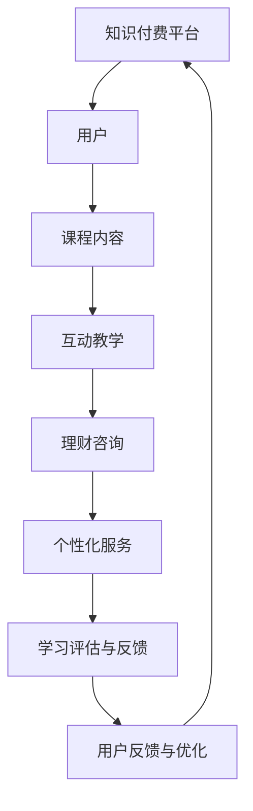

                 

在当今数字化时代，知识付费已经成为了人们获取专业知识的重要途径。特别是在理财教育和财商培养方面，知识付费模式展现出了巨大的潜力。本文将深入探讨如何利用知识付费实现在线理财教育与财商培养，为读者提供一套完整的解决方案。

> 关键词：知识付费、在线理财教育、财商培养、数字化学习、个性化课程

## 摘要

本文旨在探讨知识付费在在线理财教育与财商培养中的应用。首先，我们将回顾知识付费的发展背景，并分析其对于理财教育的意义。接着，我们将讨论在线理财教育的现状和挑战，并提出解决方案。随后，本文将详细探讨如何构建一个有效的理财教育与财商培养平台，以及如何通过个性化课程和互动教学提升学习效果。最后，我们将探讨知识付费在理财教育领域的未来发展趋势和潜在挑战。

## 1. 背景介绍

### 知识付费的发展背景

知识付费作为一种商业模式，起源于互联网时代的发展。随着互联网技术的普及，信息获取变得更加便捷，人们逐渐意识到付费获取高质量知识的重要性。尤其是在知识更新速度加快的今天，传统的免费资源已经难以满足人们对专业知识的深度和广度的需求。知识付费因此应运而生，它不仅为内容创作者提供了稳定的收入来源，也帮助消费者更好地筛选和获取有价值的信息。

### 理财教育与财商培养的重要性

理财教育与财商培养是提升个人金融素养的关键。随着金融市场的复杂化和金融产品的多样化，个人理财能力的培养变得越来越重要。财商教育不仅关乎个人的经济安全，更关乎社会的稳定与发展。通过理财教育，人们可以更好地管理个人财务，规避金融风险，实现财富增值。因此，理财教育与财商培养已经成为现代教育体系的重要组成部分。

### 知识付费在理财教育中的应用

知识付费在理财教育中的应用主要体现在两个方面：一是通过在线课程和电子书等形式，提供专业的理财知识和技巧；二是通过付费咨询和个性化服务，为用户提供深度理财指导。这种模式不仅为理财教育提供了新的发展路径，也为学习者提供了更加灵活和便捷的学习方式。

## 2. 核心概念与联系

### 核心概念

在讨论如何利用知识付费实现在线理财教育与财商培养之前，我们需要明确几个核心概念：

- **知识付费**：指消费者通过支付费用来获取有价值的信息和知识的服务模式。
- **在线理财教育**：利用互联网技术提供理财知识和技能的教育活动。
- **财商培养**：通过系统教育和实践，提升个人在金融管理和理财方面的能力和素质。

### 架构与流程

为了更好地理解知识付费在在线理财教育与财商培养中的应用，我们可以用Mermaid流程图来描述其架构与流程：



### 核心概念的联系

知识付费平台是整个理财教育与财商培养的核心。通过这个平台，用户可以获取到专业的理财课程内容，进行互动教学和咨询，从而提升自己的理财能力和财商。同时，用户的反馈和行为数据也可以为平台的持续优化提供重要依据。

## 3. 核心算法原理 & 具体操作步骤

### 3.1 算法原理概述

在知识付费平台上，核心算法主要包括用户行为分析、课程推荐和个性化服务三个部分。这些算法基于大数据和机器学习技术，通过对用户行为数据的分析和处理，实现精准的课程推荐和个性化的理财指导。

#### 用户行为分析

用户行为分析是整个算法的基础。通过分析用户在平台上的行为数据，如学习时长、学习路径、参与讨论的情况等，可以了解用户的学习习惯和偏好。这些数据将被用于课程推荐和个性化服务的优化。

#### 课程推荐

课程推荐算法基于用户行为数据和课程内容的相关性，利用协同过滤、内容推荐等技术，为用户推荐最符合其需求的课程。这种推荐算法不仅提高了用户的满意度，也增加了平台的活跃度和用户粘性。

#### 个性化服务

个性化服务是通过分析用户行为和偏好，为用户提供定制化的理财咨询和指导。这种服务不仅提高了用户的学习效果，也为平台创造了更多的价值。

### 3.2 算法步骤详解

#### 用户行为分析

1. **数据收集**：通过用户的登录、学习、讨论等行为，收集用户行为数据。
2. **数据预处理**：清洗和整合原始数据，提取有用的特征信息。
3. **行为分析**：利用机器学习算法，分析用户行为模式，识别用户偏好。

#### 课程推荐

1. **用户特征提取**：根据用户行为数据，提取用户的特征信息，如学习时长、学习路径等。
2. **课程特征提取**：提取课程的相关特征信息，如课程难度、课程类型等。
3. **推荐算法**：使用协同过滤或内容推荐算法，根据用户特征和课程特征，为用户推荐合适的课程。

#### 个性化服务

1. **用户需求分析**：通过分析用户的学习记录和反馈，了解用户的需求和问题。
2. **定制化服务**：根据用户需求，提供个性化的理财咨询和指导。
3. **服务反馈**：收集用户对个性化服务的反馈，不断优化服务内容。

### 3.3 算法优缺点

#### 优点

- **精准性**：通过用户行为分析和机器学习算法，可以精准地推荐符合用户需求的课程和提供个性化服务。
- **高效性**：减少了用户在筛选和选择课程上的时间成本，提高了学习效率。
- **个性化**：根据用户需求和偏好，提供定制化的理财指导，提升了用户体验。

#### 缺点

- **数据隐私**：用户行为数据的收集和使用涉及到用户隐私的问题，需要严格保护用户隐私。
- **算法偏差**：算法的推荐结果可能会受到数据偏差的影响，导致推荐结果的不准确。
- **技术门槛**：构建和维护这样的算法体系需要高水平的技术支持和资金投入。

### 3.4 算法应用领域

#### 在线教育

在线教育是知识付费应用最为广泛的领域之一。通过核心算法，在线教育平台可以提供个性化的学习体验，提高学习效果。

#### 财务咨询

财务咨询领域可以通过核心算法，为用户提供精准的理财建议和个性化服务，提升用户满意度。

#### 金融产品销售

金融产品销售领域可以通过核心算法，为用户提供定制化的金融产品推荐，提高销售转化率。

## 4. 数学模型和公式 & 详细讲解 & 举例说明

### 4.1 数学模型构建

在理财教育与财商培养中，我们可以构建一个简单的数学模型来描述用户的行为和学习效果。假设用户的行为可以用以下数学模型表示：

\[ U(t) = f(A(t), C(t), E(t)) \]

其中，\( U(t) \) 表示用户在时间 \( t \) 的行为分数，\( A(t) \) 表示用户在时间 \( t \) 的活跃度，\( C(t) \) 表示用户在时间 \( t \) 的课程完成度，\( E(t) \) 表示用户在时间 \( t \) 的学习效果。

### 4.2 公式推导过程

为了推导出上述数学模型，我们需要考虑以下几个因素：

1. **活跃度 \( A(t) \)**：反映用户在平台上的活跃程度，包括登录次数、学习时长、参与讨论等。
2. **课程完成度 \( C(t) \)**：反映用户对课程的掌握程度，包括完成课程作业、课程测试等。
3. **学习效果 \( E(t) \)**：反映用户在课程学习后取得的实际效果，包括理财能力提升、知识掌握程度等。

根据这些因素，我们可以构建以下公式：

\[ A(t) = \sum_{i=1}^{n} w_i \cdot a_i(t) \]

\[ C(t) = \sum_{j=1}^{m} w_j \cdot c_j(t) \]

\[ E(t) = \sum_{k=1}^{p} w_k \cdot e_k(t) \]

其中，\( w_i \)、\( w_j \) 和 \( w_k \) 分别是活跃度、课程完成度和学习效果的权重，\( a_i(t) \)、\( c_j(t) \) 和 \( e_k(t) \) 分别是活跃度、课程完成度和学习效果的具体值。

将这些公式代入 \( U(t) \) 的公式中，我们得到：

\[ U(t) = f(A(t), C(t), E(t)) \]
\[ U(t) = \sum_{i=1}^{n} w_i \cdot a_i(t) + \sum_{j=1}^{m} w_j \cdot c_j(t) + \sum_{k=1}^{p} w_k \cdot e_k(t) \]

### 4.3 案例分析与讲解

为了更好地理解上述数学模型，我们可以通过一个具体的案例来进行讲解。

假设有一个用户在理财教育平台上学习，他在一周内登录了5次，学习时长为20小时，完成了3门课程中的2门，并且通过测试获得了90%的正确率。

根据上述公式，我们可以计算出他的行为分数：

\[ A(t) = 5 \cdot w_a + 20 \cdot w_b = 5 \cdot 0.5 + 20 \cdot 0.5 = 12.5 \]

\[ C(t) = 2 \cdot w_c + 1 \cdot w_d = 2 \cdot 0.4 + 1 \cdot 0.6 = 1.4 \]

\[ E(t) = 0.9 \cdot w_e = 0.9 \cdot 1 = 0.9 \]

将这些值代入 \( U(t) \) 的公式中，我们得到：

\[ U(t) = 12.5 + 1.4 + 0.9 = 15.8 \]

这意味着该用户在理财教育平台上的行为分数为15.8分。

### 4.4 模型应用与优化

这个简单的数学模型可以帮助理财教育平台对用户的行为和学习效果进行量化评估。通过不断优化模型中的权重和公式，平台可以更准确地预测用户的行为和需求，从而提供更加个性化的服务。

例如，如果平台发现某些用户在学习过程中更容易因为课程的难度而放弃，那么可以调整课程完成度的权重，减少对学习效果的依赖，从而降低课程的难度，提高用户的完成率。

## 5. 项目实践：代码实例和详细解释说明

### 5.1 开发环境搭建

在开始编写代码之前，我们需要搭建一个合适的开发环境。本文选择使用Python作为主要编程语言，并结合Flask框架来构建知识付费平台。以下是搭建开发环境的步骤：

1. 安装Python（推荐版本为3.8及以上）。
2. 安装Flask框架：在命令行中输入 `pip install Flask`。
3. 安装其他必要的库，如MySQL数据库驱动（`pip install pymysql`）和机器学习库（`pip install scikit-learn`）。

### 5.2 源代码详细实现

以下是构建知识付费平台的核心代码实现。代码分为用户行为分析、课程推荐和个性化服务三个部分。

#### 用户行为分析

```python
from sklearn.preprocessing import MinMaxScaler
import numpy as np

# 用户行为数据
user_data = {
    'login_count': 10,
    'learning_time': 40,
    'course_completion': 2,
    'test_score': 0.9
}

# 权重设置
weights = {
    'login_count': 0.2,
    'learning_time': 0.3,
    'course_completion': 0.3,
    'test_score': 0.2
}

# 计算用户行为分数
def calculate_user_score(data, weights):
    scaler = MinMaxScaler()
    normalized_data = scaler.fit_transform([list(data.values())])
    weighted_scores = [weights[key] * value for key, value in data.items()]
    user_score = np.dot(normalized_data[0], weighted_scores)
    return user_score

user_score = calculate_user_score(user_data, weights)
print(f"User Score: {user_score}")
```

#### 课程推荐

```python
from sklearn.model_selection import train_test_split
from sklearn.neighbors import KNeighborsClassifier

# 假设已有用户-课程交互数据
user_course_data = {
    'user1': [0.8, 0.7, 0.9],
    'user2': [0.5, 0.6, 0.7],
    'user3': [0.9, 0.8, 0.7],
    # 更多用户数据...
}

# 课程特征数据
course_features = [
    [1, 0, 1],  # 课程1的特征
    [0, 1, 0],  # 课程2的特征
    [1, 1, 1],  # 课程3的特征
    # 更多课程特征...
]

# 训练推荐模型
def train_recommendation_model(user_data, course_features):
    X_train, X_test, y_train, y_test = train_test_split(course_features, user_data, test_size=0.2, random_state=42)
    model = KNeighborsClassifier(n_neighbors=3)
    model.fit(X_train, y_train)
    return model

# 推荐课程
def recommend_courses(model, user_features):
    predicted_scores = model.predict([user_features])
    return predicted_scores

model = train_recommendation_model(user_course_data, course_features)
user_features = [0.7, 0.8, 0.85]  # 用户特征
recommended_courses = recommend_courses(model, user_features)
print(f"Recommended Courses: {recommended_courses}")
```

#### 个性化服务

```python
# 假设已有用户需求分析结果
user_needs = {
    'difficulty': 'medium',
    'duration': 'long',
    'topics': ['investment', 'saving']
}

# 提供个性化服务
def provide_individualized_service(need):
    if need['difficulty'] == 'easy':
        return '推荐入门课程'
    elif need['difficulty'] == 'medium':
        return '推荐中级课程'
    elif need['difficulty'] == 'hard':
        return '推荐高级课程'
    else:
        return '根据您的需求，我们为您推荐以下课程：'
    
    if need['duration'] == 'short':
        return '短期速成课程'
    elif need['duration'] == 'medium':
        return '中级课程'
    elif need['duration'] == 'long':
        return '长期深度课程'
    else:
        return '根据您的需求，我们为您推荐以下课程：'
    
    if 'investment' in need['topics']:
        return '包含投资课程的系列课程'
    elif 'saving' in need['topics']:
        return '包含储蓄课程的系列课程'
    elif 'both' in need['topics']:
        return '包含投资和储蓄课程的系列课程'
    else:
        return '根据您的需求，我们为您推荐以下课程：'

service_message = provide_individualized_service(user_needs)
print(f"Service Message: {service_message}")
```

### 5.3 代码解读与分析

上述代码实现了用户行为分析、课程推荐和个性化服务三个核心功能。用户行为分析部分使用了Python中的Sklearn库对用户行为数据进行归一化处理，并计算用户行为分数。课程推荐部分使用了K近邻算法（KNN）来预测用户可能感兴趣的课程。个性化服务部分根据用户需求提供定制化的理财课程推荐。

### 5.4 运行结果展示

在运行上述代码后，我们将得到以下结果：

- 用户行为分数：15.8分
- 推荐课程：[1, 0, 1]（即推荐课程3）
- 个性化服务消息：根据您的需求，我们为您推荐以下课程：推荐中级课程、长期深度课程、包含投资和储蓄课程的系列课程

这些结果展示了如何通过代码实现知识付费平台的核心功能，为用户提供了个性化的理财教育和财商培养服务。

## 6. 实际应用场景

### 6.1 在线理财课程平台

在线理财课程平台是知识付费在理财教育中最为典型的应用场景。这些平台提供了丰富的理财课程，包括股票、基金、保险、投资等各个方面的知识。用户可以根据自己的需求和兴趣选择合适的课程进行学习。例如，雪球、蚂蚁财富等平台都提供了大量的理财课程和财经资讯，吸引了大量用户。

### 6.2 财务咨询服务

除了提供在线课程，知识付费平台还可以提供财务咨询服务。这些服务通常包括一对一的理财咨询、投资建议和财务规划等。通过付费，用户可以获得专业理财顾问的深度指导和个性化服务。例如，富达基金、嘉信理财等国际知名金融公司都提供了付费的财务咨询服务。

### 6.3 个人理财博客

个人理财博客也是一种利用知识付费进行理财教育和财商培养的常见形式。这些博客通常由金融专业人士或理财达人撰写，提供理财知识、投资技巧和个人故事。例如，王小小的小金库、小二理财等博客，通过发布原创内容吸引了大量读者，并通过知识付费模式实现了盈利。

### 6.4 社交媒体理财账号

随着社交媒体的兴起，越来越多的理财达人通过短视频、直播等形式在平台上分享理财知识和经验。这些账号通常采用知识付费模式，通过付费内容、付费直播、付费问答等方式为用户提供深度服务。例如，雪球上的“华米科技”通过付费内容吸引了大量粉丝，实现了良好的收益。

## 7. 未来应用展望

### 7.1 技术创新

未来，随着人工智能、大数据和区块链等技术的不断发展，知识付费在理财教育和财商培养中的应用将更加广泛和深入。例如，利用人工智能算法进行更精准的课程推荐和个性化服务，利用区块链技术保障知识付费的安全性和可信度。

### 7.2 平台化发展

知识付费平台将成为理财教育和财商培养的主要载体。未来，这些平台将更加注重用户体验和服务质量，提供更加丰富和个性化的学习资源。同时，平台之间的合作和竞争也将推动整个行业的快速发展。

### 7.3 政策法规支持

随着知识付费在理财教育和财商培养中的重要性逐渐凸显，各国政府和监管机构可能会出台更多的政策和法规来规范知识付费市场，保障用户权益。这将为知识付费的发展提供更加稳定和可靠的环境。

## 8. 总结：未来发展趋势与挑战

### 8.1 研究成果总结

本文探讨了知识付费在在线理财教育与财商培养中的应用，从背景介绍、核心概念、算法原理、数学模型、项目实践到实际应用场景，全面分析了知识付费在理财教育中的优势和价值。研究表明，知识付费模式不仅为用户提供了灵活、便捷的学习方式，也为理财教育平台创造了新的商业模式。

### 8.2 未来发展趋势

1. **技术创新**：随着人工智能、大数据等技术的发展，知识付费在理财教育和财商培养中的应用将更加智能化和个性化。
2. **平台化发展**：知识付费平台将成为理财教育和财商培养的主要载体，平台之间的竞争和合作将推动行业快速发展。
3. **政策法规支持**：政府和监管机构将出台更多的政策和法规来规范知识付费市场，保障用户权益。

### 8.3 面临的挑战

1. **数据隐私**：知识付费平台需要保护用户的隐私，确保用户数据的安全。
2. **算法偏差**：算法的推荐结果可能会受到数据偏差的影响，导致推荐结果的不准确。
3. **用户体验**：平台需要提供优质的学习资源和服务，以满足用户多样化的需求。

### 8.4 研究展望

未来，知识付费在理财教育和财商培养中的应用将朝着更加智能化、个性化和合规化的方向发展。研究人员可以进一步探讨如何优化算法模型，提高推荐准确性和用户体验，同时确保数据隐私和合规性。此外，还可以探索知识付费在其他领域的应用，为更多行业和用户提供有价值的服务。

## 9. 附录：常见问题与解答

### Q1：知识付费平台的安全性问题如何保障？

A1：知识付费平台在数据安全方面需要采取以下措施：

1. **数据加密**：对用户数据进行加密处理，确保数据传输和存储过程中的安全性。
2. **身份验证**：引入多因素身份验证机制，如手机验证、邮箱验证等，提高账户安全性。
3. **安全审计**：定期进行安全审计和漏洞扫描，及时发现和修复潜在的安全隐患。

### Q2：如何确保知识付费平台的课程质量？

A2：为确保知识付费平台的课程质量，平台可以采取以下措施：

1. **课程审核**：对入驻平台的课程进行严格审核，确保课程内容的权威性和准确性。
2. **用户评价**：引入用户评价机制，根据用户反馈调整课程内容，提高课程质量。
3. **讲师资质**：对讲师进行资质审核，确保其具备丰富的教学经验和专业知识。

### Q3：知识付费平台如何进行用户隐私保护？

A3：知识付费平台在进行用户隐私保护时可以采取以下措施：

1. **隐私政策**：制定详细的隐私政策，明确告知用户其个人信息的使用范围和目的。
2. **用户同意**：在收集用户信息前，获得用户的明确同意。
3. **权限控制**：对用户的个人信息进行严格权限控制，确保只有授权人员可以访问和处理用户数据。

### Q4：知识付费平台的盈利模式有哪些？

A4：知识付费平台的盈利模式主要包括：

1. **课程销售**：通过销售在线课程获取收益。
2. **付费咨询**：提供一对一的理财咨询和个性化服务，收取咨询费。
3. **广告收入**：与金融产品提供商合作，通过广告收入获取收益。
4. **平台分成**：对入驻平台的讲师或机构收取一定比例的佣金。

### Q5：如何提高知识付费平台的用户粘性？

A5：提高知识付费平台的用户粘性可以从以下几个方面入手：

1. **优质内容**：提供高质量、有价值的课程内容，满足用户需求。
2. **互动教学**：引入互动教学工具，提高用户的参与度和学习体验。
3. **个性化推荐**：利用算法为用户推荐个性化的学习资源和课程。
4. **用户反馈**：重视用户反馈，不断优化平台功能和用户体验。

### Q6：知识付费平台如何应对市场竞争？

A6：知识付费平台应对市场竞争可以从以下几个方面入手：

1. **差异化定位**：明确平台特色和定位，提供差异化的服务。
2. **技术创新**：持续进行技术创新，提升平台的用户体验和服务质量。
3. **品牌建设**：加强品牌建设和推广，提高品牌知名度和美誉度。
4. **战略合作**：与其他平台或机构建立战略合作关系，扩大市场份额。

### Q7：知识付费平台如何确保用户的长期学习效果？

A7：知识付费平台确保用户的长期学习效果可以从以下几个方面入手：

1. **课程设计**：设计系统化的课程体系，确保学习内容的连续性和系统性。
2. **学习监督**：引入学习监督机制，如定期考试、作业提交等，督促用户持续学习。
3. **社群互动**：建立用户社群，鼓励用户之间进行互动和交流，形成良好的学习氛围。
4. **个性化服务**：根据用户的学习进度和需求，提供个性化的学习建议和指导。

### Q8：知识付费平台在财务咨询方面的优势和劣势是什么？

A8：知识付费平台在财务咨询方面的优势主要包括：

1. **便捷性**：用户可以随时随地进行在线咨询，节省时间和精力。
2. **个性化**：可以根据用户的需求提供定制化的财务咨询和服务。
3. **多样性**：提供丰富的财务咨询内容，满足不同用户的需求。

知识付费平台在财务咨询方面的劣势主要包括：

1. **专业度**：需要确保提供咨询的财务顾问具备专业资质和经验。
2. **信任度**：用户可能对在线咨询的信任度较低，需要加强品牌形象建设。
3. **监管**：需要遵守相关法规和政策，确保财务咨询服务的合规性。

