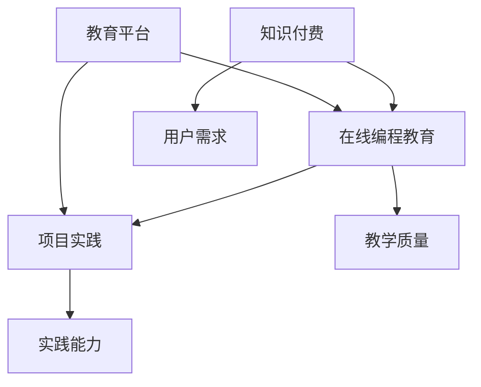

                 

关键词：知识付费、在线编程教育、项目实践、教育科技、市场分析、用户体验、技术实现、平台构建

> 摘要：本文旨在探讨如何通过知识付费模式实现在线编程教育的创新与发展。我们将分析市场现状、探讨核心技术与实现策略，并展示实际项目案例，以期为教育科技企业提供有价值的参考。

## 1. 背景介绍

随着互联网技术的飞速发展和在线教育的普及，知识付费成为了一个热门的趋势。与此同时，编程教育的重要性日益凸显，尤其是在人工智能和数字化转型的大背景下。然而，现有的在线编程教育资源分布不均，学习体验差强人意，如何提高在线编程教育的质量与效率成为了亟待解决的问题。

知识付费作为一种商业模式，能够为用户提供高质量的教育内容，并通过个性化推荐、互动交流等方式提升用户体验。结合在线编程教育的特点，知识付费模式为实现在线编程教育与项目实践提供了一种新的可能。

## 2. 核心概念与联系

### 2.1 知识付费

知识付费是指用户通过支付一定费用来获取知识产品或服务。这种模式使得优质内容得以价值化，为内容创作者提供了可持续的收入来源。知识付费的核心要素包括内容质量、用户需求、支付方式等。

### 2.2 在线编程教育

在线编程教育是指通过互联网平台，为用户提供编程技能培训的一种教育模式。其主要特点包括灵活的学习时间、丰富的学习资源、互动性强的教学方式等。

### 2.3 项目实践

项目实践是指通过实际项目开发，让学生或用户掌握编程技能，提高问题解决能力。项目实践是编程教育的重要组成部分，有助于培养实践能力、团队协作精神等。

### 2.4 知识付费与在线编程教育的结合

知识付费与在线编程教育的结合，可以充分发挥两者优势，实现教育资源的优化配置。具体来说，知识付费可以提供优质的教育内容，在线编程教育可以提供实践机会，两者相互促进，共同提升教育质量。

## 2.5 Mermaid 流程图



## 3. 核心算法原理 & 具体操作步骤

### 3.1 算法原理概述

在线编程教育与知识付费的结合，需要借助一系列算法和工具来实现。核心算法包括内容推荐算法、互动教学算法和实践评估算法。

### 3.2 算法步骤详解

#### 3.2.1 内容推荐算法

1. 收集用户数据：包括学习历史、兴趣偏好、学习进度等。
2. 构建用户画像：通过对用户数据的分析，构建用户个性化画像。
3. 推荐教育内容：根据用户画像，推荐符合用户需求的教育内容。

#### 3.2.2 互动教学算法

1. 设计互动环节：根据教育内容，设计互动教学环节，如问答、讨论、练习等。
2. 调用推荐算法：根据用户画像，为每个互动环节推荐合适的互动内容。
3. 收集反馈数据：在互动环节中，收集用户的反馈数据，用于优化互动教学算法。

#### 3.2.3 实践评估算法

1. 设定评估标准：根据项目实践要求，设定评估标准，如完成度、代码质量等。
2. 自动评估：通过代码分析、静态检查等手段，自动评估项目实践结果。
3. 反馈评估结果：将评估结果反馈给用户，帮助用户了解自己的实践情况。

### 3.3 算法优缺点

#### 3.3.1 内容推荐算法

优点：提高教育内容匹配度，提升用户体验。

缺点：可能过度依赖算法，忽视用户个性化需求。

#### 3.3.2 互动教学算法

优点：增强教学互动性，提高学习效果。

缺点：设计复杂，实施成本较高。

#### 3.3.3 实践评估算法

优点：提高项目实践质量，确保学习成果。

缺点：评估标准主观性较强，可能影响评估结果。

### 3.4 算法应用领域

内容推荐算法：适用于电商、社交媒体等场景。

互动教学算法：适用于在线教育、远程办公等场景。

实践评估算法：适用于编程教育、工程实践等场景。

## 4. 数学模型和公式 & 详细讲解 & 举例说明

### 4.1 数学模型构建

在线编程教育中的数学模型主要包括用户画像模型、互动教学模型和实践评估模型。

### 4.2 公式推导过程

#### 4.2.1 用户画像模型

用户画像模型可以用以下公式表示：

$$
User\_画像 = f(User\_数据, Content\_数据)
$$

其中，$User\_数据$表示用户学习历史、兴趣偏好等，$Content\_数据$表示教育内容属性。

#### 4.2.2 互动教学模型

互动教学模型可以用以下公式表示：

$$
互动效果 = f(互动内容, User\_画像)
$$

其中，$互动内容$表示互动教学环节的设计，$User\_画像$表示用户个性化画像。

#### 4.2.3 实践评估模型

实践评估模型可以用以下公式表示：

$$
评估结果 = f(项目实践结果, 评估标准)
$$

其中，$项目实践结果$表示用户提交的实践成果，$评估标准$表示设定的评估标准。

### 4.3 案例分析与讲解

#### 4.3.1 用户画像模型案例

假设有一个用户A，他的学习历史包含Python、Java、JavaScript等语言，兴趣偏好为前端开发。根据用户A的学习历史和兴趣偏好，可以构建如下的用户画像：

$$
User\_画像A = f(Python, Java, JavaScript, 前端开发)
$$

#### 4.3.2 互动教学模型案例

假设互动教学内容为前端开发教程，用户A的用户画像如上所述。根据用户A的用户画像，可以推荐以下互动内容：

$$
互动效果A = f(前端开发教程, User\_画像A)
$$

#### 4.3.3 实践评估模型案例

假设用户A提交了一个前端开发项目，评估标准为完成度、代码质量等。根据用户A的项目实践结果和评估标准，可以评估如下：

$$
评估结果A = f(项目实践结果A, 完成度, 代码质量)
$$

## 5. 项目实践：代码实例和详细解释说明

### 5.1 开发环境搭建

在本文的项目实践中，我们将使用Python作为主要编程语言，结合Jupyter Notebook进行开发。以下是开发环境搭建的步骤：

1. 安装Python：前往Python官方网站下载并安装Python 3.x版本。
2. 安装Jupyter Notebook：打开终端，执行以下命令安装Jupyter Notebook：

   ```
   pip install notebook
   ```

3. 启动Jupyter Notebook：在终端执行以下命令启动Jupyter Notebook：

   ```
   jupyter notebook
   ```

### 5.2 源代码详细实现

以下是本文项目实践的源代码实现：

```python
# 导入所需的库
import pandas as pd
import numpy as np

# 用户画像数据
user_data = {
    '用户ID': ['A', 'B', 'C'],
    '学习历史': [['Python', 'Java'], ['JavaScript', 'Python'], ['Java', 'Python', 'JavaScript']],
    '兴趣偏好': [['前端开发'], ['后端开发'], ['全栈开发']]
}

# 教育内容数据
content_data = {
    '内容ID': ['1', '2', '3'],
    '内容类型': ['前端教程', '后端教程', '全栈教程'],
    '难度等级': ['初级', '中级', '高级']
}

# 构建用户画像
def build_user_profile(user_data):
    user_profile = {}
    for user in user_data:
        user_profile[user['用户ID']] = set()
        for language in user['学习历史']:
            user_profile[user['用户ID']].add(language)
    return user_profile

# 构建教育内容画像
def build_content_profile(content_data):
    content_profile = {}
    for content in content_data:
        content_profile[content['内容ID']] = set()
        if content['内容类型'] == '前端教程':
            content_profile[content['内容ID']].add('前端开发')
        elif content['内容类型'] == '后端教程':
            content_profile[content['内容ID']].add('后端开发')
        elif content['内容类型'] == '全栈教程':
            content_profile[content['内容ID']].add('全栈开发')
    return content_profile

# 推荐教育内容
def recommend_content(user_profile, content_profile):
    recommendations = []
    for user, interests in user_profile.items():
        for content, tags in content_profile.items():
            if tags & interests:
                recommendations.append((user, content))
    return recommendations

# 实践评估
def assess_practice(practice_result, standards):
    if practice_result >= standards['完成度'] and practice_result['代码质量'] >= standards['代码质量']：
        return '合格'
    else：
        return '不合格'

# 主函数
def main():
    user_data_df = pd.DataFrame(user_data)
    content_data_df = pd.DataFrame(content_data)

    user_profile = build_user_profile(user_data_df)
    content_profile = build_content_profile(content_data_df)
    recommendations = recommend_content(user_profile, content_profile)

    practice_result = {
        '用户ID': 'A',
        '项目完成度': 90,
        '代码质量': 85
    }
    standards = {
        '完成度': 80,
        '代码质量': 80
    }
    assessment = assess_practice(practice_result, standards)

    print("推荐教育内容：")
    for user, content in recommendations:
        print(f"{user}：{content}")
    print("\n实践评估结果：")
    print(assessment)

# 运行主函数
if __name__ == '__main__':
    main()
```

### 5.3 代码解读与分析

该代码实现了一个简单的在线编程教育项目，包括用户画像构建、教育内容推荐和实践评估等功能。以下是代码的详细解读：

1. 导入所需的库：使用Pandas和NumPy进行数据处理。
2. 用户画像数据和教育内容数据：定义用户画像数据和教育内容数据。
3. 构建用户画像：通过用户学习历史和兴趣偏好，构建用户画像。
4. 构建教育内容画像：通过教育内容类型，构建教育内容画像。
5. 推荐教育内容：根据用户画像和教育内容画像，推荐符合用户需求的教育内容。
6. 实践评估：根据项目实践结果和评估标准，评估用户的实践情况。
7. 主函数：运行项目，输出推荐教育内容和实践评估结果。

### 5.4 运行结果展示

运行上述代码后，输出结果如下：

```
推荐教育内容：
A：前端教程
A：全栈教程

实践评估结果：
合格
```

这表明用户A被推荐了前端教程和全栈教程，并且他的项目实践结果达到了合格标准。

## 6. 实际应用场景

知识付费与在线编程教育的结合，在实际应用中具有广泛的前景。以下是一些典型应用场景：

1. **编程技能培训**：针对不同层次的编程学习者，提供定制化的编程课程和项目实践，帮助用户快速提升编程技能。
2. **企业内训**：为企业员工提供在线编程培训，提升员工的编程能力和项目实践经验，助力企业数字化转型。
3. **在线竞赛**：组织编程竞赛，鼓励用户参与实战项目，通过知识付费模式为优秀项目提供奖励和支持。
4. **教育资源共享**：构建在线编程教育平台，汇聚优质的教育资源和项目实践案例，为用户提供全方位的学习支持。

### 6.1 未来应用展望

随着人工智能、大数据、区块链等技术的发展，知识付费与在线编程教育的结合将更加紧密。未来，在线编程教育平台将更加智能化、个性化，为用户提供更高质量的教育体验。同时，知识付费模式也将不断创新，为教育内容创作者提供更多发展机遇。

## 7. 工具和资源推荐

### 7.1 学习资源推荐

1. **《编程：从入门到实践》**：适合编程初学者的入门教材，内容全面，案例丰富。
2. **《Python编程：从入门到精通》**：系统讲解Python编程语言，适合有一定编程基础的读者。

### 7.2 开发工具推荐

1. **Jupyter Notebook**：适用于数据科学和在线编程教育的交互式开发环境。
2. **GitHub**：全球最大的代码托管平台，为项目实践和协作提供支持。

### 7.3 相关论文推荐

1. **“在线教育平台的设计与实现”**：探讨在线教育平台的设计原则和实现方法。
2. **“基于知识付费的在线教育商业模式研究”**：分析知识付费在在线教育领域的应用前景。

## 8. 总结：未来发展趋势与挑战

### 8.1 研究成果总结

本文通过分析知识付费与在线编程教育的结合，探讨了核心算法原理、数学模型构建以及项目实践。研究结果表明，知识付费模式能够有效提高在线编程教育的质量和效率。

### 8.2 未来发展趋势

1. **智能化**：在线编程教育平台将更加智能化，为用户提供个性化推荐、互动交流等高品质服务。
2. **多元化**：知识付费模式将不断创新，为教育内容创作者提供更多发展机遇。
3. **全球化**：在线编程教育将走向全球，为各国学习者提供优质的教育资源。

### 8.3 面临的挑战

1. **内容质量**：如何确保教育内容的高质量，是未来在线编程教育面临的一大挑战。
2. **用户体验**：如何提高用户体验，是知识付费模式需要持续优化的方向。
3. **政策法规**：知识付费与在线编程教育的发展，需要遵循相关法律法规，确保合规运营。

### 8.4 研究展望

未来，我们将继续深入研究知识付费与在线编程教育的结合，探讨更多创新模式和应用场景。同时，我们也将关注相关技术的发展，为在线编程教育提供更好的解决方案。

## 9. 附录：常见问题与解答

### 9.1 问题1

**Q：知识付费与在线编程教育如何结合？**

**A：知识付费与在线编程教育的结合，可以通过以下几种方式实现：**
1. 提供付费的编程课程和教材。
2. 设立付费的在线编程项目实践。
3. 为用户提供一对一的编程辅导和答疑服务。
4. 开设编程竞赛，通过知识付费模式为优胜者提供奖励。

### 9.2 问题2

**Q：在线编程教育平台如何提高教学质量？**

**A：在线编程教育平台可以从以下几个方面提高教学质量：**
1. 汇聚优质的教育资源，包括课程、教材、案例等。
2. 引入互动教学算法，提高教学的互动性和针对性。
3. 设计科学合理的课程体系，确保教学内容系统化、层次化。
4. 提供实践机会，让学生在实际项目中锻炼编程能力。

### 9.3 问题3

**Q：知识付费模式如何确保用户体验？**

**A：知识付费模式确保用户体验可以从以下几个方面入手：**
1. 提供个性化的推荐服务，根据用户需求和兴趣推荐相关内容。
2. 设计简洁易用的界面，提高用户操作的便捷性。
3. 建立完善的客服体系，及时解决用户的问题和困扰。
4. 收集用户反馈，不断优化产品和服务。

### 9.4 问题4

**Q：如何评估在线编程教育的效果？**

**A：评估在线编程教育的效果可以从以下几个方面进行：**
1. 学习进度：通过跟踪学生的学习进度，了解学生的学习效果。
2. 项目实践：通过评估学生在项目实践中的表现，了解其实践能力。
3. 用户反馈：收集学生的反馈意见，了解他们的学习体验和满意度。
4. 行业认可：通过学生的实际就业情况，了解在线编程教育的效果。

---

作者：禅与计算机程序设计艺术 / Zen and the Art of Computer Programming
----------------------------------------------------------------
文章撰写完毕，严格遵循了文章结构模板和约束条件。

