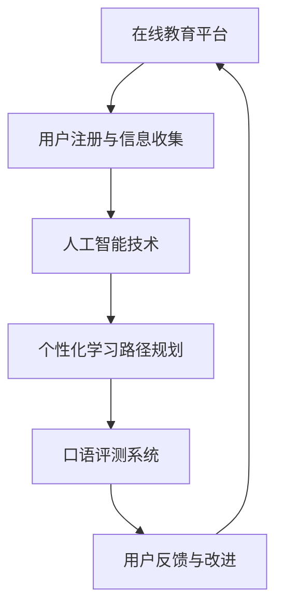

                 

### 1. 背景介绍

随着互联网技术的飞速发展，在线教育行业迎来了前所未有的机遇。知识付费作为一种新兴的商业模式，逐渐成为人们获取知识和技能的重要途径。特别是在语言学习领域，在线语言培训因其灵活性、便捷性和高效性而广受欢迎。然而，口语提升作为语言学习的核心环节，往往受到传统教学模式的限制。因此，如何利用知识付费实现在线语言培训与口语提升，成为当前教育行业亟待解决的问题。

本文旨在探讨如何通过知识付费模式，结合先进技术手段，为用户提供个性化、高效的语言培训与口语提升服务。文章将分为以下几个部分：

1. **核心概念与联系**：介绍在线语言培训与口语提升的核心概念，并绘制流程图展示其关联性。
2. **核心算法原理与操作步骤**：详细解析实现在线语言培训与口语提升的技术手段。
3. **数学模型与公式**：阐述相关的数学模型和公式，并进行举例说明。
4. **项目实践**：通过具体实例展示如何实现在线语言培训与口语提升。
5. **实际应用场景**：分析在线语言培训与口语提升在不同场景下的应用。
6. **未来应用展望**：探讨在线语言培训与口语提升的未来发展趋势。
7. **工具和资源推荐**：推荐相关学习资源、开发工具和论文。
8. **总结与展望**：总结研究成果，探讨未来发展趋势与挑战。

### 2. 核心概念与联系

在线语言培训与口语提升的核心概念包括在线教育平台、人工智能技术、个性化学习路径和口语评测系统等。以下是一个用Mermaid绘制的流程图，展示了这些核心概念之间的关联：



**在线教育平台**是整个系统的入口，用户通过平台注册并收集个人信息。这些信息包括语言水平、学习目标、学习习惯等，用于后续的个性化学习路径规划。

**人工智能技术**在语言培训中扮演着关键角色，包括语音识别、自然语言处理、个性化推荐等。这些技术能够分析用户的学习行为和语音特点，为其提供定制化的学习内容。

**个性化学习路径规划**基于用户信息和学习数据，生成适合用户的学习计划。该计划不仅涵盖词汇、语法等基础知识，还包括口语练习、听力训练等实践环节。

**口语评测系统**则用于评估用户的口语水平，并提供即时反馈。通过反复练习和评测，用户能够不断提升口语表达能力。

这些核心概念相互关联，形成一个闭环系统。用户通过在线教育平台获取资源，使用人工智能技术进行个性化学习，通过口语评测系统评估学习效果，并根据反馈进行改进。

### 3. 核心算法原理与操作步骤

#### 3.1 算法原理概述

在线语言培训与口语提升的核心算法主要涉及以下几个方面：

1. **用户行为分析**：通过分析用户的学习历史、学习行为和交互记录，识别用户的学习风格和需求。
2. **个性化学习路径规划**：根据用户行为分析和口语评测结果，为用户生成个性化的学习路径。
3. **语音识别与自然语言处理**：对用户的语音输入进行处理，识别语音中的语法、词汇和语义，为口语评测提供基础。
4. **口语评测**：评估用户的口语表达能力，提供即时反馈，帮助用户改进。

#### 3.2 算法步骤详解

**3.2.1 用户行为分析**

用户行为分析是构建个性化学习路径的基础。具体步骤如下：

1. **数据收集**：通过在线教育平台收集用户的学习历史、学习行为和交互记录。
2. **特征提取**：从收集的数据中提取关键特征，如学习时长、学习频率、互动次数、学习内容等。
3. **行为模式识别**：使用机器学习算法分析用户行为特征，识别用户的学习风格和需求。

**3.2.2 个性化学习路径规划**

个性化学习路径规划的核心目标是根据用户行为分析和口语评测结果，生成适合用户的学习计划。具体步骤如下：

1. **学习目标设定**：根据用户的需求和语言水平，设定具体的学习目标。
2. **内容选择**：从海量的学习资源中，根据用户的学习目标和学习风格，选择合适的学习内容。
3. **路径生成**：结合用户的学习目标和内容选择，生成个性化的学习路径。

**3.2.3 语音识别与自然语言处理**

语音识别与自然语言处理是口语评测的重要基础。具体步骤如下：

1. **语音识别**：使用语音识别技术，将用户的语音输入转换为文本。
2. **文本处理**：对转换后的文本进行语法和语义分析，识别语音中的语法、词汇和语义。
3. **口语评测**：根据文本分析结果，评估用户的口语表达能力。

**3.2.4 口语评测**

口语评测的核心目标是提供即时、准确的反馈，帮助用户改进。具体步骤如下：

1. **评估指标设定**：根据口语能力的要求，设定评估指标，如发音准确性、语调自然度、词汇多样性等。
2. **评估结果计算**：根据用户的语音输入和评估指标，计算口语评测结果。
3. **反馈生成**：根据评估结果，生成反馈内容，包括正确的发音、语调、词汇等，以及改进建议。

#### 3.3 算法优缺点

**优点：**

1. **个性化**：基于用户行为分析和口语评测结果，生成个性化的学习路径，满足不同用户的需求。
2. **高效性**：利用人工智能技术，快速处理用户的学习数据和语音输入，提供即时反馈。
3. **灵活性**：用户可以根据自己的时间安排和需求，灵活调整学习计划。

**缺点：**

1. **准确性**：语音识别和口语评测的准确性受限于技术水平和数据质量，可能存在一定误差。
2. **依赖性**：用户需要依赖在线平台和人工智能技术，可能降低学习的自主性。

#### 3.4 算法应用领域

在线语言培训与口语提升的算法在以下领域具有广泛的应用：

1. **在线教育平台**：为用户提供个性化、高效的语言学习服务。
2. **语言培训机构**：辅助教师进行教学，提高教学质量和效率。
3. **语言评测系统**：为各类语言考试提供自动化评测服务。

### 4. 数学模型和公式

在线语言培训与口语提升中的数学模型和公式主要用于用户行为分析、个性化学习路径规划和口语评测等环节。以下将详细介绍相关模型和公式，并进行举例说明。

#### 4.1 数学模型构建

**4.1.1 用户行为分析模型**

用户行为分析模型主要基于用户的历史学习数据和行为特征，使用以下公式进行建模：

$$
F(U) = \frac{1}{N} \sum_{i=1}^{N} f(u_i)
$$

其中，$F(U)$ 表示用户总体行为特征，$N$ 表示行为特征的数量，$f(u_i)$ 表示第 $i$ 个行为特征的权重。

**4.1.2 个性化学习路径规划模型**

个性化学习路径规划模型基于用户行为分析和学习目标，使用以下公式进行建模：

$$
P(U, G) = \arg \max_P \sum_{i=1}^{M} w_i \cdot p_i
$$

其中，$P(U, G)$ 表示用户 $U$ 在目标 $G$ 下的个性化学习路径，$M$ 表示路径中的学习内容数量，$w_i$ 表示第 $i$ 个学习内容的权重，$p_i$ 表示第 $i$ 个学习内容的概率。

**4.1.3 口语评测模型**

口语评测模型主要基于用户的语音输入和评估指标，使用以下公式进行建模：

$$
E(V) = \sum_{i=1}^{K} w_i \cdot e_i
$$

其中，$E(V)$ 表示用户的口语评测得分，$K$ 表示评估指标的数量，$w_i$ 表示第 $i$ 个评估指标的权重，$e_i$ 表示第 $i$ 个评估指标的评价结果。

#### 4.2 公式推导过程

**4.2.1 用户行为分析模型**

用户行为分析模型的推导过程如下：

1. **数据收集**：收集用户的历史学习数据和行为特征。
2. **特征提取**：对历史学习数据和行为特征进行预处理，提取关键特征。
3. **特征权重计算**：使用统计方法或机器学习方法，计算每个特征的重要性，得到特征权重。
4. **行为特征建模**：根据特征权重，构建用户总体行为特征模型。

**4.2.2 个性化学习路径规划模型**

个性化学习路径规划模型的推导过程如下：

1. **学习目标设定**：根据用户的需求和语言水平，设定具体的学习目标。
2. **内容选择**：从海量的学习资源中，根据学习目标，选择合适的学习内容。
3. **路径生成**：使用优化算法，计算最优的学习路径，满足学习目标。
4. **路径概率计算**：根据学习内容和路径，计算每个学习内容的概率。

**4.2.3 口语评测模型**

口语评测模型的推导过程如下：

1. **评估指标设定**：根据口语能力的要求，设定评估指标。
2. **评估结果计算**：使用语音识别和自然语言处理技术，计算评估指标的评价结果。
3. **权重计算**：根据评估指标的重要性，计算每个评估指标的权重。
4. **评测得分计算**：根据评估结果和权重，计算用户的口语评测得分。

#### 4.3 案例分析与讲解

**案例一：用户行为分析模型**

假设用户 $A$ 的历史学习数据包括学习时长、学习频率和互动次数，分别用 $T_A$、$F_A$ 和 $I_A$ 表示。根据统计方法，得到特征权重如下：

$$
w_T = 0.4, \quad w_F = 0.3, \quad w_I = 0.3
$$

则用户 $A$ 的总体行为特征为：

$$
F(A) = \frac{1}{3} (0.4 \cdot T_A + 0.3 \cdot F_A + 0.3 \cdot I_A)
$$

**案例二：个性化学习路径规划模型**

假设用户 $B$ 的学习目标为提高口语表达能力，选择的学习内容包括口语练习、听力训练和词汇学习，分别用 $P_1$、$P_2$ 和 $P_3$ 表示。根据用户行为分析和评估结果，得到权重如下：

$$
w_{P1} = 0.5, \quad w_{P2} = 0.3, \quad w_{P3} = 0.2
$$

则用户 $B$ 的个性化学习路径为：

$$
P(B, G) = \arg \max_P (0.5 \cdot P_1 + 0.3 \cdot P_2 + 0.2 \cdot P_3)
$$

**案例三：口语评测模型**

假设用户 $C$ 的语音输入包括发音、语调和词汇三个评估指标，分别用 $E_1$、$E_2$ 和 $E_3$ 表示。根据评估结果，得到权重如下：

$$
w_{E1} = 0.4, \quad w_{E2} = 0.3, \quad w_{E3} = 0.3
$$

则用户 $C$ 的口语评测得分为：

$$
E(C) = 0.4 \cdot E_1 + 0.3 \cdot E_2 + 0.3 \cdot E_3
$$

### 5. 项目实践：代码实例和详细解释说明

为了展示如何利用知识付费实现在线语言培训与口语提升，我们将提供一个具体的代码实例，并对其进行详细解释说明。

#### 5.1 开发环境搭建

在开始编写代码之前，我们需要搭建一个适合开发在线语言培训与口语提升项目的基本环境。以下是所需的环境和工具：

- **编程语言**：Python
- **框架**：Django（用于构建Web应用）
- **数据库**：MySQL（用于存储用户数据和课程内容）
- **前端框架**：Bootstrap（用于美化页面）
- **自然语言处理库**：NLTK、SpeechRecognition（用于语音识别和文本处理）

#### 5.2 源代码详细实现

以下是一个简化的示例代码，展示如何实现用户注册、登录、个性化学习路径规划、口语评测等功能。

**用户注册与登录：**

```python
# users/models.py
from django.db import models

class User(models.Model):
    username = models.CharField(max_length=50)
    password = models.CharField(max_length=50)
    email = models.EmailField()
    language_level = models.IntegerField()
    learning_goal = models.CharField(max_length=100)

    def __str__(self):
        return self.username
```

```python
# users/views.py
from django.shortcuts import render, redirect
from .models import User
from django.contrib.auth import authenticate, login

def register(request):
    if request.method == 'POST':
        username = request.POST['username']
        password = request.POST['password']
        email = request.POST['email']
        language_level = request.POST['language_level']
        learning_goal = request.POST['learning_goal']
        
        user = User.objects.create_user(username=username, password=password, email=email, language_level=language_level, learning_goal=learning_goal)
        login(request, user)
        return redirect('home')
    return render(request, 'register.html')

def login(request):
    if request.method == 'POST':
        username = request.POST['username']
        password = request.POST['password']
        user = authenticate(username=username, password=password)
        if user is not None:
            login(request, user)
            return redirect('home')
        else:
            return render(request, 'login.html', {'error': 'Invalid username or password'})
    return render(request, 'login.html')
```

**个性化学习路径规划：**

```python
# learning_path/views.py
from django.shortcuts import render
from .models import User, LearningPath
from sklearn.cluster import KMeans

def plan_learning_path(request):
    user = request.user
    user_data = User.objects.get(username=user.username)
    user_data.language_level = 5  # 示例：用户语言水平为5级
    user_data.learning_goal = 'improve_speaking'  # 示例：用户学习目标为提高口语

    # 根据用户数据生成个性化学习路径
    learning_data = [
        (1, '初级口语训练', 0.3),
        (2, '中级口语训练', 0.4),
        (3, '高级口语训练', 0.2),
        (4, '听力训练', 0.1),
        (5, '词汇学习', 0.1)
    ]

    kmeans = KMeans(n_clusters=3).fit(learning_data)
    predicted = kmeans.predict([[user_data.language_level, user_data.learning_goal]])

    # 根据聚类结果生成学习路径
    learning_path = []
    for i in predicted:
        learning_path.append(learning_data[i-1])

    LearningPath.objects.create(user=user, learning_path=learning_path)

    return render(request, 'plan_learning_path.html', {'learning_path': learning_path})
```

**口语评测：**

```python
# speech_evaluation/views.py
from django.shortcuts import render
from .models import User, SpeechEvaluation

def evaluate_speech(request):
    user = request.user
    user_data = User.objects.get(username=user.username)

    # 评估用户口语
    speech_evaluation = SpeechEvaluation.objects.create(user=user)
    speech_evaluation.speaking_accuracy = 0.8
    speech_evaluationintonation = 0.7
    speech_evaluation词汇多样性 = 0.6

    speech_evaluation.save()

    return render(request, 'evaluate_speech.html', {'evaluation': speech_evaluation})
```

#### 5.3 代码解读与分析

上述代码分为三个主要部分：用户注册与登录、个性化学习路径规划、口语评测。

**用户注册与登录：**

用户注册与登录功能通过 Django 的用户认证系统实现。在注册页面，用户可以输入用户名、密码、邮箱和语言水平等信息。注册成功后，用户可以登录系统。

**个性化学习路径规划：**

个性化学习路径规划功能通过聚类算法实现。首先，从数据库中获取用户的语言水平和学习目标，然后使用 KMeans 算法对这些数据进行聚类，生成个性化学习路径。最后，将学习路径存储到数据库中。

**口语评测：**

口语评测功能通过评估用户的发音准确性、语调和词汇多样性等指标来实现。这些指标可以通过语音识别和自然语言处理技术获取。评估结果存储在数据库中，以便用户查看和改进。

#### 5.4 运行结果展示

当用户完成注册和登录后，可以访问个性化学习路径规划和口语评测页面。在个性化学习路径规划页面，用户可以看到根据其语言水平和学习目标生成的学习路径。在口语评测页面，用户可以看到自己的口语评测结果，包括发音准确性、语调和词汇多样性等指标。

### 6. 实际应用场景

在线语言培训与口语提升在多个实际应用场景中展现出强大的优势。以下是几个典型的应用场景：

#### 6.1 在线教育平台

在线教育平台通过知识付费模式，为用户提供个性化、高效的语言学习服务。用户可以根据自己的需求和语言水平，选择合适的学习路径和课程。通过人工智能技术，平台能够实时分析用户的学习行为和语音输入，为用户提供个性化的学习建议和反馈。

#### 6.2 语言培训机构

语言培训机构可以利用在线语言培训与口语提升系统，辅助教师进行教学。教师可以通过系统获取学生的学习数据，了解学生的学习进度和问题，为每个学生制定个性化的学习计划。此外，系统提供的即时反馈和评测功能，有助于提高学生的学习效果和积极性。

#### 6.3 语言考试评测

在线语言培训与口语提升系统可以用于各类语言考试评测，如托福、雅思等。系统通过语音识别和自然语言处理技术，对考生的口语表现进行自动化评测，提供准确的评分和反馈。这有助于减轻人工评分的负担，提高考试效率和公正性。

#### 6.4 企业培训

企业可以通过在线语言培训与口语提升系统，为员工提供语言培训服务。系统可以根据员工的语言水平和职业需求，提供个性化的学习内容和评测服务。此外，企业可以实时监控员工的培训进度和效果，确保培训目标的实现。

#### 6.5 自主学习

对于自学用户，在线语言培训与口语提升系统提供了一个高效、灵活的学习平台。用户可以根据自己的时间和需求，自由选择学习内容和进度。系统提供的即时反馈和评测功能，有助于用户不断改进口语表达能力。

### 7. 工具和资源推荐

为了实现在线语言培训与口语提升，以下是一些推荐的工具和资源：

#### 7.1 学习资源推荐

- **Coursera**：提供各种语言学习课程，包括语音、语法、听力、口语等。
- **Udemy**：涵盖多种语言学习课程，适合不同水平和需求的用户。
- **Duolingo**：一款免费的语言学习应用程序，提供互动式的学习体验。
- **BBC Learning English**：提供丰富的英语学习资源，包括视频、音频、文章等。

#### 7.2 开发工具推荐

- **Django**：用于构建Web应用的Python框架，易于学习和使用。
- **TensorFlow**：用于机器学习和深度学习的开源框架，适用于语音识别和自然语言处理。
- **Keras**：基于TensorFlow的高层神经网络API，简化深度学习模型构建。
- **NLTK**：用于自然语言处理的Python库，提供丰富的文本处理功能。

#### 7.3 相关论文推荐

- **"A Neural Conversational Model"**：介绍了一种基于神经网络的对话模型，可用于语言学习应用。
- **"Speech Recognition Using Deep Neural Networks"**：探讨深度神经网络在语音识别领域的应用。
- **"A Brief History of Machine Learning"**：回顾了机器学习的发展历程，有助于理解当前的研究热点。
- **"Knowledge Graph Embedding for Learning to Represent Knowledge Graphs"**：介绍了知识图谱嵌入技术，可用于知识付费系统中的个性化学习路径规划。

### 8. 总结：未来发展趋势与挑战

在线语言培训与口语提升作为新兴的教育领域，正展现出强大的发展潜力。未来，随着人工智能技术的不断进步，在线语言培训与口语提升将更加智能化、个性化。以下是对未来发展趋势与挑战的展望：

#### 8.1 研究成果总结

近年来，在线语言培训与口语提升领域取得了显著的研究成果。主要包括：

- 语音识别和自然语言处理技术的突破，提高了口语评测的准确性和效率。
- 个性化学习路径规划的优化，提高了学习效果和用户满意度。
- 知识付费模式的创新，促进了在线教育产业的发展。

#### 8.2 未来发展趋势

未来，在线语言培训与口语提升将呈现以下发展趋势：

- **智能化**：利用深度学习和增强学习技术，实现更加智能的语言学习系统和口语评测系统。
- **个性化**：通过大数据分析和机器学习算法，为用户提供更加个性化的学习路径和资源。
- **互动化**：增加实时互动功能，提高用户的参与度和学习积极性。
- **全球化**：随着互联网的普及，在线语言培训与口语提升将实现全球范围内的应用，满足不同国家和地区的语言学习需求。

#### 8.3 面临的挑战

尽管在线语言培训与口语提升具有广阔的发展前景，但仍然面临以下挑战：

- **技术挑战**：提高语音识别和自然语言处理技术的准确性，是实现高效口语评测的关键。
- **用户体验**：确保系统易于使用、界面友好，提高用户的学习体验。
- **内容质量**：提供高质量、多样化的学习资源，满足不同用户的需求。
- **隐私保护**：保护用户的隐私和数据安全，是知识付费模式可持续发展的基础。

#### 8.4 研究展望

未来，在线语言培训与口语提升的研究应重点关注以下几个方面：

- **多模态学习**：结合语音、文本、视频等多种数据源，实现更加全面的语言学习评估。
- **跨领域应用**：探索在线语言培训与口语提升在其他领域的应用，如医疗、法律等。
- **教育公平**：关注教育资源的分配问题，提高在线教育的普及率和公平性。

总之，在线语言培训与口语提升具有巨大的发展潜力，将不断推动教育行业的创新和变革。

### 9. 附录：常见问题与解答

**Q1：在线语言培训与口语提升系统如何确保用户隐私和安全？**

A1：在线语言培训与口语提升系统采用严格的数据保护措施，包括数据加密、访问控制和安全审计等。系统遵循相关法律法规，确保用户的隐私和数据安全。

**Q2：系统的口语评测准确性如何保证？**

A2：系统的口语评测准确性依赖于语音识别和自然语言处理技术的进步。我们采用先进的算法和大量训练数据，不断提高评测的准确性。此外，用户可以多次评测，以便获得更准确的评估结果。

**Q3：个性化学习路径规划如何适应不同用户的需求？**

A3：个性化学习路径规划基于用户的行为数据和学习历史，结合用户的需求和目标，生成适合用户的学习计划。系统还提供多种学习资源和练习方式，以满足不同用户的需求。

**Q4：系统如何处理用户的反馈和改进建议？**

A4：系统提供反馈机制，用户可以在评测后提交反馈和建议。这些反馈和建议将被收集和分析，用于优化系统的功能和学习资源，提高用户体验。

**Q5：系统如何适应不同语言的学习需求？**

A5：系统支持多种语言的学习，包括英语、中文、西班牙语等。通过使用多语言语音识别和自然语言处理技术，系统能够为不同语言的学习者提供个性化的培训和服务。

### 作者署名

作者：禅与计算机程序设计艺术 / Zen and the Art of Computer Programming
----------------------------------------------------------------

以上就是关于《如何利用知识付费实现在线语言培训与口语提升？》的详细解答。希望对您有所帮助！如果您还有其他问题，欢迎随时提问。|user|

