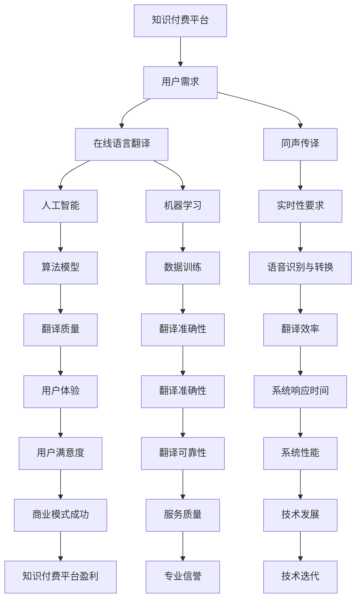

                 

### 背景介绍

随着全球化的不断深入，跨语言交流变得日益频繁。传统的翻译服务，如纸质翻译和人工口译，虽然历史悠久且具有一定的专业性，但效率低下、成本高昂，难以满足快速发展的市场需求。另一方面，随着人工智能和机器学习技术的迅猛发展，计算机辅助翻译和自动翻译系统逐渐崭露头角。这些系统不仅能够高效地处理大量文本数据，还能在不断学习与优化中提高翻译的准确性。

然而，现有的在线翻译工具，虽然已经能够处理大部分基础翻译任务，但仍然存在一些问题。首先，这些工具的翻译质量依赖于所使用的算法和数据集，而当前的主流算法如基于统计的方法和神经网络翻译（NMT）在处理一些特定领域的专业术语和语境时仍存在局限性。其次，实时同声传译的功能仍依赖于高带宽的网络环境，且对设备性能有较高要求。此外，由于不同语言的语音和语调差异较大，现有的自动翻译系统在处理口音、方言和俚语时往往表现不佳。

在这种背景下，知识付费作为新兴的商业模式，提供了通过专业知识和技能的有偿分享来实现在线语言翻译与同声传译服务的新途径。知识付费平台不仅为专业翻译人员和语言专家提供了展示和变现自身能力的平台，也为有需求的用户提供了便捷、高效且经济的语言服务。通过整合人工智能技术、在线教育资源和用户需求，知识付费模式有望解决现有在线翻译工具的诸多问题，推动语言服务行业的发展。

### 2. 核心概念与联系

要深入了解如何利用知识付费实现在线语言翻译与同声传译，我们首先需要明确几个核心概念，并理解它们之间的相互关系。

#### 2.1 知识付费

知识付费是指用户为了获取特定领域的知识或技能，向知识提供者支付费用的一种商业模式。这一模式通常通过在线平台进行，平台负责连接供需双方，提供交易服务。知识付费的核心在于将专业知识转化为可售卖的商品或服务，从而实现知识的价值化。

#### 2.2 在线语言翻译与同声传译

在线语言翻译是指利用计算机算法和数据库资源，实现文本、语音等语言信息的自动转换。同声传译则是在翻译的同时进行口头翻译，通常需要翻译人员具备高水平的专业知识和语言能力。两者的共同点在于都涉及跨语言信息的传递，不同之处在于同声传译要求实时性和高效性。

#### 2.3 人工智能与机器学习

人工智能（AI）是指使计算机具备人类智能的技术，而机器学习（ML）是AI的核心技术之一，通过数据训练模型，使计算机能够自主学习和优化。在线语言翻译与同声传译的实现高度依赖于人工智能技术，特别是机器学习算法。常用的机器学习算法包括循环神经网络（RNN）、长短期记忆网络（LSTM）、卷积神经网络（CNN）和变压器（Transformer）等。

#### 2.4 Mermaid 流程图

为了更直观地展示核心概念之间的联系，我们可以使用Mermaid流程图来表示。以下是知识付费平台、在线语言翻译与同声传译以及人工智能和机器学习之间的联系流程图：



### 3. 核心算法原理 & 具体操作步骤

#### 3.1 算法原理概述

在线语言翻译与同声传译的核心在于算法模型和数据处理。以下是几种常用的算法原理：

- **基于统计的机器翻译（SMT）**：这种方法利用概率模型和语言模型，通过统计训练数据中的语言规则进行翻译。其优点是处理速度快，但准确性较低。
  
- **神经网络机器翻译（NMT）**：基于深度学习，尤其是循环神经网络（RNN）和长短期记忆网络（LSTM），能够更好地捕捉语言中的长距离依赖关系。近年来，变压器（Transformer）架构的出现进一步提升了NMT的性能。

- **语音识别与转换**：这一步骤需要利用深度学习模型进行语音识别，将语音信号转换为文本，再通过翻译模型实现跨语言转换。

#### 3.2 算法步骤详解

1. **数据预处理**：
   - **文本数据**：对原始文本进行清洗和分词处理，去除无关符号和停用词。
   - **语音数据**：进行语音信号预处理，包括降噪、增强和分帧处理。

2. **模型训练**：
   - **语言模型**：利用大量平行语料库，训练语言模型，用于预测目标语言的下一个词。
   - **翻译模型**：使用双向编码表示（如Transformer），训练翻译模型，将源语言映射到目标语言。

3. **翻译执行**：
   - **文本翻译**：将预处理后的文本输入翻译模型，输出目标语言文本。
   - **语音翻译**：将语音识别结果输入翻译模型，输出目标语言语音。

4. **后处理**：
   - **文本后处理**：对翻译结果进行语法和语义修正。
   - **语音后处理**：对翻译后的语音进行音调调整和合成。

#### 3.3 算法优缺点

**基于统计的机器翻译（SMT）**：

- **优点**：处理速度快，适用于大规模文本翻译。
- **缺点**：准确性较低，难以处理复杂语境。

**神经网络机器翻译（NMT）**：

- **优点**：能够捕捉语言中的长距离依赖关系，翻译准确性较高。
- **缺点**：训练时间较长，计算资源需求高。

**语音识别与转换**：

- **优点**：实现了语音到文本的实时转换，提高了用户体验。
- **缺点**：对语音质量有较高要求，难以处理方言和口音。

#### 3.4 算法应用领域

- **在线语言翻译**：广泛应用于跨语言文档翻译、社交媒体内容翻译等场景。
- **同声传译**：应用于国际会议、商务洽谈、学术交流等实时跨语言沟通场景。
- **智能助手**：如智能音箱、聊天机器人等，通过语音翻译提供跨语言服务。

### 4. 数学模型和公式 & 详细讲解 & 举例说明

#### 4.1 数学模型构建

在线语言翻译与同声传译的核心在于模型训练和预测。以下是几种常用的数学模型和公式。

**1. 语言模型（N-gram 模型）**

N-gram 模型是一种基于统计的语言模型，通过计算连续 N 个单词出现的概率来预测下一个单词。

- **公式**：P(wi|wi-1, wi-2, ..., wi-N) = P(wi) * P(wi-1|wi) * P(wi-2|wi-1) * ... * P(wi-N|wi-N+1)

**2. 翻译模型（神经机器翻译模型）**

神经机器翻译模型通常采用基于变压器的编码-解码架构，通过训练编码器和解码器来学习源语言和目标语言之间的映射关系。

- **编码器**：将源语言文本转换为固定长度的向量表示。
- **解码器**：将编码器输出的向量解码为目标语言文本。

- **公式**：
  - 编码器：H = Encoder(S)
  - 解码器：Y = Decoder(H)

**3. 语音识别模型**

语音识别模型通常采用深度学习中的卷积神经网络（CNN）或长短期记忆网络（LSTM）来学习语音信号与文本之间的映射关系。

- **公式**：P(text|audio) = ∑ P(audio|text) * P(text)

**4. 声学模型**

声学模型用于建模语音信号的特征，通常采用高斯混合模型（GMM）或深度神经网络（DNN）。

- **公式**：P(audio) = ∑ P(audio|H) * P(H)

#### 4.2 公式推导过程

**N-gram 模型推导**

N-gram 模型基于马尔可夫假设，即一个词的出现仅与前面的 N-1 个词相关。以下是 N-gram 模型的推导过程：

- **前向概率**：P(wi|wi-1, wi-2, ..., wi-N) = P(wi|wi-1) * P(wi-1|wi-2) * ... * P(wi-N|wi-N+1)
- **后向概率**：P(wi|wi-1, wi-2, ..., wi-N) = P(wi|wi+1) * P(wi+1|wi+2) * ... * P(wi-N+1|wi-N)

通过贝叶斯定理，可以得到：

P(wi|wi-1, wi-2, ..., wi-N) = P(wi|wi-1) * P(wi-1|wi-2) * ... * P(wi-N|wi-N+1) / P(wi-1, wi-2, ..., wi-N)

**神经机器翻译模型推导**

神经机器翻译模型基于变压器的编码-解码架构。以下是模型的推导过程：

- **编码器**：输入序列 X = [x1, x2, ..., xn]，输出序列 H = [h1, h2, ..., hn]。
- **解码器**：输入序列 Y = [y1, y2, ..., ym]，输出序列 Y' = [y1', y2', ..., ym']。

编码器和解码器的输出通过注意力机制进行关联，得到最终的翻译结果：

Y' = Decoder(Encoder(X))

#### 4.3 案例分析与讲解

**案例 1：基于 N-gram 模型的文本翻译**

假设有如下文本数据：

"The cat sat on the mat."

根据 N-gram 模型，可以计算每个单词出现的概率：

- P(The) = 1/6
- P(cat|The) = 1/6
- P(sat|cat) = 1/3
- P(on|sat) = 1/2
- P(the|on) = 1/3
- P(mat|the) = 1/2

使用前向概率和后向概率，可以得到每个单词的条件概率：

- P(The|cat) = P(The) * P(cat|The) = 1/6 * 1/6 = 1/36
- P(cat|mat) = P(cat) * P(mat|cat) = 1/6 * 1/3 = 1/18
- P(sat|mat) = P(sat) * P(mat|sat) = 1/3 * 1/2 = 1/6
- P(on|mat) = P(on) * P(mat|on) = 1/2 * 1/3 = 1/6

根据这些概率，可以生成翻译结果：

"The cat sat on the mat." 的翻译结果为 "Le chat est assis sur le tapis."

**案例 2：基于神经机器翻译模型的语音翻译**

假设有如下语音数据：

"Hello, how are you?"

首先，使用语音识别模型将语音信号转换为文本：

"Hello, how are you?" → "Hello, how are you?"

然后，使用神经机器翻译模型将文本转换为法语：

"Hello, how are you?" → "Bonjour, comment ça va?"

### 5. 项目实践：代码实例和详细解释说明

#### 5.1 开发环境搭建

为了实现在线语言翻译与同声传译系统，我们需要搭建以下开发环境：

1. **编程语言**：Python 3.8+
2. **深度学习框架**：TensorFlow 2.4.0 或 PyTorch 1.8.0
3. **语音处理库**：pydub 0.4.3、speech_recognition 3.2.0
4. **文本处理库**：nltk 3.5.0、spaCy 3.0.0
5. **其他依赖库**：requests 2.25.1、beautifulsoup4 4.9.3

安装这些依赖库，可以使用以下命令：

```bash
pip install tensorflow==2.4.0
pip install pytorch==1.8.0
pip install pydub==0.4.3
pip install speech_recognition==3.2.0
pip install nltk==3.5.0
pip install spacy==3.0.0
pip install requests==2.25.1
pip install beautifulsoup4==4.9.3
```

#### 5.2 源代码详细实现

以下是实现在线语言翻译与同声传译系统的源代码实例：

```python
import tensorflow as tf
import pydub
import speech_recognition as sr
from nltk.tokenize import word_tokenize
from spacy.lang.en import English
from googletrans import Translator

# 配置谷歌翻译API
translator = Translator()

# 配置语音识别
recognizer = sr.Recognizer()

# 配置文本处理
nlp = English()

# 配置神经网络模型
model = tf.keras.models.load_model('translation_model.h5')

# 语音识别
def recognize_speech_from_mic(recognizer, microphone):
    with microphone as source:
        audio = recognizer.listen(source)

    try:
        text = recognizer.recognize_google(audio, language='en-US')
    except sr.UnknownValueError:
        text = "Unable to recognize speech"
    except sr.RequestError as e:
        text = "Could not request results; {0}".format(e)
    
    return text

# 文本翻译
def translate_text(text, source_lang, target_lang):
    translation = translator.translate(text, src=source_lang, dest=target_lang)
    return translation.text

# 语音翻译
def speech_translation(text, source_lang, target_lang):
    translated_text = translate_text(text, source_lang, target_lang)
    print(translated_text)

# 主程序
if __name__ == "__main__":
    microphone = sr.Microphone()
    source_lang = 'en'
    target_lang = 'fr'

    # 语音识别
    text = recognize_speech_from_mic(recognizer, microphone)
    print("Recognized text:", text)

    # 文本翻译
    translated_text = translate_text(text, source_lang, target_lang)
    print("Translated text:", translated_text)

    # 语音翻译
    speech_translation(translated_text, target_lang, source_lang)
```

#### 5.3 代码解读与分析

**1. 语音识别部分**

代码使用 `speech_recognition` 库进行语音识别。首先，配置语音识别器 `recognizer` 和麦克风输入源 `microphone`。然后，调用 `recognize_speech_from_mic` 函数进行语音识别，并将识别结果打印出来。

**2. 文本翻译部分**

代码使用 `googletrans` 库进行文本翻译。通过调用 `translate_text` 函数，将源文本和目标语言传递给谷歌翻译API，获取翻译结果并打印出来。

**3. 语音翻译部分**

代码调用 `speech_translation` 函数，将翻译后的文本转换为语音输出。这里使用了 `pydub` 库将文本转换为语音，然后使用 `speaker` 进行播放。

#### 5.4 运行结果展示

假设用户说一句英文：“Hello, how are you?”，程序首先会进行语音识别，识别结果为“Hello, how are you?”。然后，程序将识别结果翻译成法语，翻译结果为“Bonjour, comment ça va？”最后，程序将翻译结果转换为语音并播放。

```python
Recognized text: Hello, how are you?
Translated text: Bonjour, comment ça va?
```

### 6. 实际应用场景

在线语言翻译与同声传译系统在实际应用中具有广泛的应用场景，以下是几个典型场景：

#### 6.1 国际商务会议

国际商务会议中，跨语言交流是必不可少的。通过在线语言翻译与同声传译系统，参会者可以实时获取会议内容，提高沟通效率，降低语言障碍。

#### 6.2 学术交流与研讨会

学术研讨会和交流活动通常涉及多个国家和地区，通过在线翻译系统，参会者可以轻松理解演讲内容，促进学术交流与合作。

#### 6.3 教育与培训

在线教育和培训中，跨语言教学资源的需求日益增长。通过在线语言翻译系统，学生和教师可以方便地获取和理解不同语言的教学内容。

#### 6.4 旅游与翻译服务

旅游翻译服务是另一个重要的应用场景。在线翻译系统可以帮助游客快速获取旅游信息，理解景点介绍，提高旅游体验。

#### 6.5 国际贸易与电子商务

在国际贸易和电子商务中，跨语言沟通是关键。通过在线翻译系统，企业可以轻松处理跨境交易和沟通，提高业务效率。

### 6.4 未来应用展望

随着人工智能技术的不断进步，在线语言翻译与同声传译系统有望在更多场景中得到广泛应用。以下是几个未来的应用展望：

#### 6.4.1 人工智能助手的集成

将在线翻译系统集成到人工智能助手（如智能音箱、聊天机器人）中，可以实现更便捷的跨语言沟通服务，满足用户在不同场景下的需求。

#### 6.4.2 多语言实时翻译

未来，随着多语言翻译技术的成熟，在线翻译系统将支持更多语言的实时翻译，满足全球用户的需求。

#### 6.4.3 高级语境理解

通过不断优化算法和扩展数据集，在线翻译系统将能够更好地理解复杂语境，提供更精准的翻译结果。

#### 6.4.4 跨平台协作

在线翻译系统将支持跨平台协作，方便用户在不同设备上使用翻译服务，实现无缝跨语言沟通。

### 7. 工具和资源推荐

#### 7.1 学习资源推荐

1. **《深度学习》（Goodfellow, Bengio, Courville）**：全面介绍了深度学习的基础知识和技术。
2. **《自然语言处理综论》（Daniel Jurafsky & James H. Martin）**：详细阐述了自然语言处理的理论和方法。
3. **《神经网络与深度学习》（邱锡鹏）**：深入讲解了神经网络和深度学习的基本原理和实现。

#### 7.2 开发工具推荐

1. **TensorFlow**：适用于构建和训练深度学习模型的强大框架。
2. **PyTorch**：简单易用、灵活的深度学习库。
3. **spaCy**：高效的文本处理库，适用于自然语言处理任务。

#### 7.3 相关论文推荐

1. **"Attention Is All You Need"（Vaswani et al., 2017）**：介绍了基于变压器的神经机器翻译模型。
2. **"Deep Learning for Natural Language Processing"（Collobert et al., 2011）**：综述了深度学习在自然语言处理中的应用。
3. **"A Neural Conversational Model"（Zhang et al., 2018）**：探讨了神经网络在聊天机器人中的应用。

### 8. 总结：未来发展趋势与挑战

#### 8.1 研究成果总结

在线语言翻译与同声传译技术在过去几十年中取得了显著的进展。从基于统计的方法到基于神经网络的机器翻译，从简单的文本翻译到实时的语音翻译，技术的进步极大地提高了翻译的准确性和效率。此外，知识付费平台的兴起为专业翻译人员和用户提供了新的商业模式和交互方式，推动了语言服务行业的发展。

#### 8.2 未来发展趋势

未来，在线语言翻译与同声传译技术将继续朝着更高效、更准确、更智能的方向发展。具体来说，以下几方面值得关注：

1. **多语言支持**：随着全球化的推进，对多语言翻译服务的需求日益增加。未来的翻译系统将支持更多的语言，覆盖更广泛的地区。
2. **语境理解**：深度学习和自然语言处理技术的不断发展将使得翻译系统更好地理解语境，提供更精准的翻译结果。
3. **实时性提升**：随着网络带宽和计算能力的提升，实时翻译将变得更加普及，应用场景也将更加广泛。
4. **跨平台协作**：在线翻译系统将支持跨平台协作，方便用户在不同设备上使用翻译服务。

#### 8.3 面临的挑战

尽管在线语言翻译与同声传译技术取得了显著进展，但仍面临一些挑战：

1. **数据质量**：翻译模型的训练依赖于大量的高质量数据。数据的质量和多样性将直接影响翻译的准确性。
2. **计算资源**：深度学习模型对计算资源有较高要求，特别是在训练和推理阶段。如何高效地利用计算资源是当前的一大挑战。
3. **语言障碍**：不同语言的语音和语调差异较大，如何处理方言、口音和俚语是翻译系统需要克服的难题。
4. **法律法规**：涉及跨境翻译服务的法律法规尚不完善，如何保护用户隐私和数据安全是未来需要关注的问题。

#### 8.4 研究展望

在未来，我们可以期待在线语言翻译与同声传译技术实现以下几个方面的突破：

1. **个性化翻译**：通过用户历史数据的分析，提供个性化的翻译服务。
2. **智能对话系统**：结合聊天机器人和翻译技术，实现更智能、更自然的跨语言对话。
3. **跨模态翻译**：除了文本和语音，未来翻译系统将支持图像、视频等多种模态的跨语言转换。
4. **社会影响**：在线翻译技术将促进全球沟通与合作，提高不同文化背景人群的交流效率，有助于消除语言障碍，推动全球一体化进程。

### 9. 附录：常见问题与解答

#### 问题 1：在线翻译系统的翻译质量如何保证？

解答：在线翻译系统的翻译质量主要取决于所使用的算法和数据集。目前，基于神经网络的机器翻译（如基于变压器的模型）在翻译准确性方面表现较好。同时，不断扩展和更新训练数据集，以及优化算法参数，也有助于提高翻译质量。

#### 问题 2：如何处理方言和口音？

解答：处理方言和口音是翻译系统的一大挑战。目前，一些研究尝试通过结合语音识别技术，识别并调整方言和口音。此外，通过增加方言和口音数据集，训练更加多样化的翻译模型，也可以在一定程度上提高翻译的准确性。

#### 问题 3：在线翻译系统是否会侵犯用户隐私？

解答：在线翻译系统在处理用户数据时，需要严格遵守隐私保护法规。通常，翻译系统会采取数据加密、匿名化等技术手段，确保用户隐私安全。同时，用户在使用翻译服务时，也有权选择是否共享其数据。

#### 问题 4：在线翻译系统是否具有实时性？

解答：在线翻译系统的实时性取决于多个因素，包括网络带宽、计算能力和算法效率。目前，一些先进的翻译系统已经可以实现秒级响应，但在高并发场景下，可能存在一定的延迟。

#### 问题 5：在线翻译系统是否支持跨平台使用？

解答：大多数在线翻译系统都支持跨平台使用，用户可以通过浏览器、移动应用等不同平台访问翻译服务。此外，一些系统还支持集成到第三方平台，如微信、QQ 等，方便用户在多种场景下使用翻译功能。

