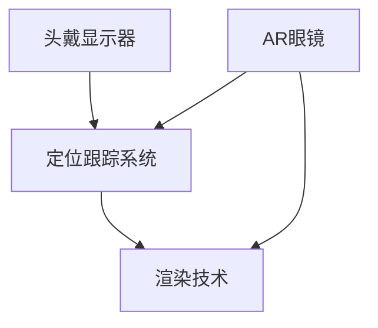

                 

关键词：知识付费、虚拟现实、增强现实、应用实现、技术发展趋势

> 摘要：本文旨在探讨如何利用知识付费平台来推广和实现虚拟现实（VR）与增强现实（AR）技术。通过分析当前市场趋势、技术原理、应用场景以及未来的发展方向，帮助开发者、企业和用户更好地理解和利用这一新兴技术。

## 1. 背景介绍

随着信息技术的飞速发展，虚拟现实（VR）和增强现实（AR）技术逐渐从科幻走向现实。这两种技术通过模拟和增强现实世界，为用户提供沉浸式和互动式的体验，具有广阔的应用前景。然而，技术的发展离不开知识的普及和传播，知识付费平台在这里扮演了重要的角色。

知识付费平台，如知乎、分答、网易云课堂等，为用户提供了一个学习和交流的空间。这些平台通过内容付费、在线课程等形式，使专业知识得以传播和共享。对于VR和AR技术而言，知识付费平台不仅是一个知识来源，更是一个推广和应用的平台。

### 1.1 VR与AR技术概述

虚拟现实（VR）是一种通过计算机技术创造出来的三维虚拟环境，用户可以通过特定的设备（如头戴显示器、手柄等）进入这个环境，与虚拟世界进行互动。增强现实（AR）则是在现实世界的基础上，通过计算机技术叠加虚拟信息，实现虚实结合的效果。

### 1.2 知识付费平台的作用

知识付费平台在VR和AR技术的发展中起到了以下作用：

1. **知识普及**：通过付费课程、文章等形式，让更多的用户了解VR和AR技术的基本概念、应用场景和发展趋势。
2. **技能培训**：提供专业的VR和AR技术培训课程，帮助开发者提升技能，推动技术发展。
3. **成果展示**：为企业和个人开发者提供一个展示VR和AR应用成果的平台，促进技术交流与合作。

## 2. 核心概念与联系

为了更好地理解VR和AR技术，我们需要了解以下几个核心概念：

1. **头戴显示器（HMD）**：头戴显示器是VR体验的核心设备，它通过遮挡真实视野，将用户带入虚拟环境中。
2. **定位跟踪系统**：通过摄像头、传感器等设备，实时跟踪用户的动作和位置，确保虚拟世界与现实世界的互动。
3. **AR眼镜**：与HMD不同，AR眼镜在现实世界中叠加虚拟信息，实现虚实结合的体验。
4. **渲染技术**：通过计算机图形学技术，生成逼真的三维虚拟环境或虚拟信息。

下面是VR与AR技术的Mermaid流程图：



### 2.1 虚拟现实（VR）

虚拟现实技术的核心在于创造一个三维的虚拟环境。这个过程包括以下步骤：

1. **场景建模**：使用3D建模软件创建虚拟环境的模型。
2. **纹理贴图**：为场景的物体添加纹理，使其更加真实。
3. **渲染技术**：通过计算机图形学技术，生成三维的虚拟场景。
4. **交互设计**：设计用户与虚拟环境的交互方式，如手柄、语音控制等。

### 2.2 增强现实（AR）

增强现实技术则是将虚拟信息叠加到现实世界中。这个过程包括以下步骤：

1. **目标识别**：使用摄像头识别现实世界中的物体。
2. **叠加信息**：在识别的物体上叠加虚拟信息，如文字、图像等。
3. **实时渲染**：通过计算机图形学技术，实时渲染叠加的虚拟信息。

## 3. 核心算法原理 & 具体操作步骤

### 3.1 算法原理概述

VR和AR技术的实现离不开核心算法的支持。其中，最关键的算法包括：

1. **三维建模算法**：用于创建虚拟环境的模型。
2. **纹理映射算法**：用于为虚拟物体添加纹理。
3. **渲染算法**：用于生成三维虚拟场景或叠加虚拟信息。
4. **目标识别算法**：用于识别现实世界中的物体。

### 3.2 算法步骤详解

#### 3.2.1 三维建模算法

三维建模算法主要包括以下步骤：

1. **几何建模**：通过点、线、面等基本几何元素构建三维模型。
2. **细节建模**：为模型添加细节，如凹凸纹理、高光等。
3. **网格优化**：对模型进行优化，以提高渲染效率。

#### 3.2.2 纹理映射算法

纹理映射算法的主要步骤如下：

1. **纹理生成**：使用图像处理技术生成纹理。
2. **纹理贴图**：将纹理映射到模型表面。
3. **纹理优化**：对纹理进行优化，以减少存储空间和渲染时间。

#### 3.2.3 渲染算法

渲染算法的主要步骤如下：

1. **场景构建**：构建虚拟场景，包括物体、光线等。
2. **渲染管线**：通过渲染管线，将场景转换为二维图像。
3. **后处理**：对渲染图像进行后期处理，如模糊、光照等。

#### 3.2.4 目标识别算法

目标识别算法的主要步骤如下：

1. **图像预处理**：对摄像头获取的图像进行预处理，如去噪、增强等。
2. **特征提取**：从预处理后的图像中提取特征。
3. **目标识别**：使用机器学习算法识别目标。

### 3.3 算法优缺点

每种算法都有其优缺点：

1. **三维建模算法**：优点是能够创建复杂的虚拟环境，缺点是计算量大，渲染效率低。
2. **纹理映射算法**：优点是能够提高虚拟环境的真实感，缺点是纹理贴图需要大量存储空间。
3. **渲染算法**：优点是能够生成高质量的图像，缺点是计算量大，渲染时间长。
4. **目标识别算法**：优点是能够实时识别目标，缺点是识别精度受图像质量影响。

### 3.4 算法应用领域

这些算法广泛应用于以下领域：

1. **游戏**：通过三维建模和渲染算法，创建逼真的游戏场景。
2. **教育**：通过AR技术，将知识可视化，提高学习效果。
3. **医疗**：通过VR技术，进行虚拟手术训练和医学模拟。
4. **娱乐**：通过AR技术，提供新颖的娱乐体验。

## 4. 数学模型和公式 & 详细讲解 & 举例说明

在VR和AR技术中，数学模型和公式扮演着重要的角色。以下将详细介绍一些关键数学模型和公式。

### 4.1 数学模型构建

VR和AR技术中的数学模型主要包括以下几个方面：

1. **三维空间模型**：用于描述虚拟环境和现实世界的空间关系。
2. **图像处理模型**：用于图像预处理、特征提取等。
3. **机器学习模型**：用于目标识别、图像分类等。

### 4.2 公式推导过程

#### 4.2.1 三维空间模型

三维空间模型的核心公式是：

$$
\text{向量} = (\text{x}, \text{y}, \text{z})
$$

其中，$(\text{x}, \text{y}, \text{z})$ 分别表示三维空间中的坐标。

#### 4.2.2 图像处理模型

图像处理模型的核心公式是：

$$
\text{滤波器} = \sum_{i=-h}^{h} \sum_{j=-k}^{k} \text{滤波器系数} \times \text{图像像素}
$$

其中，$h$ 和 $k$ 分别表示滤波器的尺寸。

#### 4.2.3 机器学习模型

机器学习模型的核心公式是：

$$
\text{损失函数} = \frac{1}{2} (\text{预测值} - \text{真实值})^2
$$

其中，预测值和真实值之间的差异决定了模型的准确性。

### 4.3 案例分析与讲解

#### 4.3.1 三维空间模型

假设我们要在三维空间中描述一个物体的位置，我们可以使用以下公式：

$$
\text{向量} = (3, 2, 5)
$$

这个向量表示物体在三维空间中的位置，其中 $x=3$，$y=2$，$z=5$。

#### 4.3.2 图像处理模型

假设我们要对一幅图像进行滤波处理，我们可以使用以下公式：

$$
\text{滤波器} = \begin{bmatrix}
1 & 1 & 1 \\
1 & 1 & 1 \\
1 & 1 & 1
\end{bmatrix}
$$

这个滤波器会对图像的每个像素进行加权平均处理，以减少噪声。

#### 4.3.3 机器学习模型

假设我们要训练一个机器学习模型来识别图像中的物体，我们可以使用以下公式：

$$
\text{损失函数} = \frac{1}{2} (0.8 - 1)^2
$$

这个公式表示模型的预测值与真实值之间的差异，其中 $0.8$ 表示预测值，$1$ 表示真实值。

## 5. 项目实践：代码实例和详细解释说明

为了更好地理解VR和AR技术的应用，我们将通过一个简单的项目来实践。以下是一个基于AR技术的项目实例。

### 5.1 开发环境搭建

首先，我们需要搭建一个开发环境。这里我们使用Unity 2020.3作为开发工具，并安装以下插件：

1. **ARCore**：用于AR功能开发。
2. **Vuforia**：用于目标识别。

### 5.2 源代码详细实现

下面是项目的源代码实现：

```csharp
using UnityEngine;

public class ARController : MonoBehaviour
{
    public Camera arCamera;
    public GameObject targetObject;

    void Start()
    {
        // 初始化ARCore
        ARCore.Instance.Init();

        // 设置AR相机参数
        arCamera.depthTextureMode = DepthTextureMode.Depth;

        // 创建目标识别标记
        GameObject targetMarker = ARCore.Instance.CreateMarker("Target.jpg");
        targetMarker.transform.position = new Vector3(0, 0, 0);
        targetMarker.transform.rotation = Quaternion.Euler(0, 0, 0);

        // 创建虚拟物体
        GameObject virtualObject = Instantiate(targetObject, arCamera.transform);
        virtualObject.transform.position = new Vector3(0, 0, 10);
        virtualObject.transform.rotation = Quaternion.Euler(0, 0, 0);
    }

    void Update()
    {
        // 更新虚拟物体位置
        if (ARCore.Instance.TargetFound("Target.jpg"))
        {
            float distance = ARCore.Instance.GetDistanceToTarget("Target.jpg");
            targetObject.transform.position = new Vector3(0, 0, distance);
        }
    }
}
```

### 5.3 代码解读与分析

这个项目的核心代码如下：

1. **初始化ARCore**：在`Start`方法中，我们调用`ARCore.Instance.Init()`来初始化AR功能。
2. **设置AR相机参数**：我们设置`arCamera`的`depthTextureMode`为`DepthTextureMode.Depth`，以便获取深度信息。
3. **创建目标识别标记**：我们使用`ARCore.Instance.CreateMarker("Target.jpg")`创建一个识别标记，这里使用的是一张图片作为标记。
4. **创建虚拟物体**：我们使用`Instantiate(targetObject, arCamera.transform)`创建一个虚拟物体，并将其放置在AR相机的前方。
5. **更新虚拟物体位置**：在`Update`方法中，我们根据目标识别标记的距离更新虚拟物体的位置。

### 5.4 运行结果展示

在运行该项目后，我们可以看到以下结果：

1. **目标识别**：摄像头识别到目标标记，并在屏幕上显示一个绿色的圆圈。
2. **虚拟物体显示**：虚拟物体出现在目标标记的前方，并随着目标标记的移动而移动。

## 6. 实际应用场景

### 6.1 教育

在教育领域，VR和AR技术可以提供全新的学习体验。例如，通过VR技术，学生可以虚拟参观历史遗址、探索宇宙深处；通过AR技术，可以在课本上看到动态的化学反应过程。这些技术不仅提高了学习兴趣，还增强了知识的理解和记忆。

### 6.2 娱乐

在娱乐领域，VR和AR技术为用户提供了丰富的互动体验。例如，VR游戏可以让玩家沉浸在虚拟世界中，体验全新的游戏玩法；AR游戏则可以将游戏场景与现实世界相结合，带来更加真实的感受。

### 6.3 医疗

在医疗领域，VR和AR技术也有广泛的应用。通过VR技术，医生可以进行虚拟手术训练，提高手术技能；通过AR技术，医生可以在手术过程中实时查看患者内部结构，提高手术的准确性和安全性。

### 6.4 培训

在培训领域，VR和AR技术可以提供逼真的模拟环境，让员工在安全的环境中学习操作技能。例如，航空公司的飞行员可以通过VR技术进行飞行模拟训练，消防员可以通过AR技术进行火灾逃生模拟。

## 7. 工具和资源推荐

### 7.1 学习资源推荐

1. **书籍**：《虚拟现实技术导论》、《增强现实技术基础》。
2. **在线课程**：网易云课堂的VR/AR技术课程、Coursera上的《虚拟现实与增强现实》。
3. **教程**：Unity官方文档、Vuforia官方文档。

### 7.2 开发工具推荐

1. **Unity**：一款功能强大的游戏开发引擎，支持VR和AR应用开发。
2. **Vuforia**：一款用于AR目标识别的插件，支持多种平台。
3. **ARCore**：Google开发的一款AR开发工具包，支持Android和iOS平台。

### 7.3 相关论文推荐

1. **"A Survey on Virtual Reality"**：对虚拟现实技术的全面概述。
2. **"Augmented Reality: A Survey"**：对增强现实技术的全面概述。
3. **"Real-Time Tracking and Rendering in Augmented Reality"**：关于AR实时跟踪和渲染的研究。

## 8. 总结：未来发展趋势与挑战

### 8.1 研究成果总结

1. **技术成熟度**：VR和AR技术已经取得了显著进展，但仍需进一步提高。
2. **应用场景**：教育、医疗、娱乐等领域的应用已初步实现，未来应用前景广阔。
3. **产业发展**：随着技术的成熟和应用的推广，VR和AR产业正在快速发展。

### 8.2 未来发展趋势

1. **硬件发展**：更轻便、更高效的VR和AR设备。
2. **内容创新**：丰富的VR和AR应用内容，提高用户体验。
3. **技术融合**：VR和AR与其他技术的融合，如人工智能、大数据等。

### 8.3 面临的挑战

1. **技术难题**：如高分辨率、低延迟、精准定位等。
2. **应用障碍**：如用户接受度、内容创作成本等。
3. **隐私和安全**：如用户数据隐私保护、信息安全等。

### 8.4 研究展望

1. **技术创新**：持续研究新型算法和硬件，提高技术性能。
2. **应用拓展**：探索新的应用场景，推动技术普及。
3. **产业协同**：推动产业链上下游的协同发展，形成产业生态。

## 9. 附录：常见问题与解答

### 9.1 什么是VR和AR？

VR（Virtual Reality，虚拟现实）是一种通过计算机技术创造的虚拟环境，用户可以通过特定的设备（如头戴显示器）进入这个环境。AR（Augmented Reality，增强现实）是在现实世界的基础上，通过计算机技术叠加虚拟信息。

### 9.2 VR和AR的主要应用领域是什么？

VR的主要应用领域包括游戏、教育、医疗、娱乐等。AR的主要应用领域包括教育、医疗、广告、娱乐等。

### 9.3 VR和AR技术的未来发展前景如何？

随着技术的不断进步和应用场景的拓展，VR和AR技术在未来有着广阔的发展前景。预计将在更多领域得到应用，并推动相关产业的快速发展。

作者：禅与计算机程序设计艺术 / Zen and the Art of Computer Programming

----------------------------------------------------------------

以上就是关于如何利用知识付费实现虚拟现实与增强现实应用的文章。希望对您有所帮助。如有任何疑问，请随时提问。

