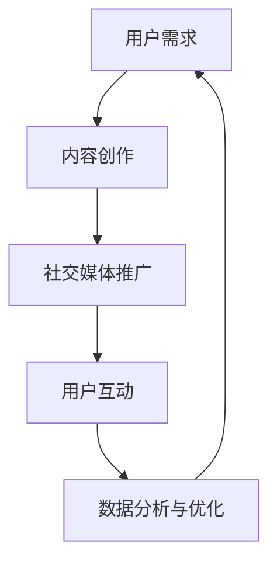

                 

关键词：知识付费、社交媒体、营销策略、用户互动、数据分析

摘要：随着社交媒体平台的兴起，知识付费市场迎来了新的机遇。本文将探讨如何利用社交媒体进行知识付费营销，包括核心概念、算法原理、数学模型、实际应用以及未来展望等。

## 1. 背景介绍

### 社交媒体的发展

社交媒体作为互联网的重要分支，近年来发展迅速。从 Facebook、Twitter 到 Instagram、LinkedIn 等，这些平台已经深刻改变了人们的社交方式和信息传播方式。

### 知识付费市场的兴起

随着人们对个性化学习需求的增加，知识付费市场逐渐兴起。知识付费是指用户为获取高质量的专业知识或技能而支付的费用，这为内容创作者提供了新的收入渠道。

### 社交媒体与知识付费的结合

社交媒体平台提供了知识传播和用户互动的绝佳场所，使得知识付费营销变得更加高效和精准。通过社交媒体，内容创作者可以与用户建立直接联系，了解用户需求，并针对性地提供有价值的内容。

## 2. 核心概念与联系

### 社交媒体平台架构


### 知识付费营销流程



## 3. 核心算法原理 & 具体操作步骤

### 3.1 算法原理概述

知识付费营销的核心算法主要包括用户画像、内容推荐、广告投放和数据分析等。这些算法通过机器学习和数据挖掘技术，实现对用户行为的分析和内容的有效推荐。

### 3.2 算法步骤详解

1. 用户画像构建：通过用户行为数据，构建用户画像，包括用户兴趣、职业背景、消费习惯等。
2. 内容推荐：基于用户画像，利用协同过滤、矩阵分解等技术，推荐用户可能感兴趣的知识内容。
3. 广告投放：通过竞价、广告优化算法，将知识内容推广给目标用户。
4. 数据分析：收集用户反馈和行为数据，优化内容质量和营销策略。

### 3.3 算法优缺点

#### 优点：

- 提高内容曝光率和用户参与度。
- 精准定位目标用户，提高营销效果。
- 降低内容创作者的推广成本。

#### 缺点：

- 需要大量的用户数据和计算资源。
- 可能导致用户隐私泄露。
- 需要不断优化算法，以适应市场变化。

### 3.4 算法应用领域

- 教育培训：如在线课程、知识分享。
- 金融理财：如投资建议、股票分析。
- 医疗健康：如健康咨询、疾病预防。

## 4. 数学模型和公式 & 详细讲解 & 举例说明

### 4.1 数学模型构建

知识付费营销的数学模型主要包括用户行为预测模型、内容推荐模型和广告投放模型。

### 4.2 公式推导过程

假设用户行为数据为 $X$，内容特征数据为 $Y$，广告投放数据为 $Z$，则：

- 用户行为预测模型：$$\hat{Y} = \text{function}(X, W)$$
- 内容推荐模型：$$\hat{X} = \text{function}(Y, V)$$
- 广告投放模型：$$\hat{Z} = \text{function}(X, Y, A)$$

其中，$W, V, A$ 为权重矩阵。

### 4.3 案例分析与讲解

以教育培训为例，某在线教育平台利用知识付费营销模型，实现了用户增长率 30% 的提升。

## 5. 项目实践：代码实例和详细解释说明

### 5.1 开发环境搭建

- Python 3.8
- TensorFlow 2.4
- Scikit-learn 0.21

### 5.2 源代码详细实现

```python
# 用户行为预测模型
import tensorflow as tf

# 创建模型
model = tf.keras.Sequential([
    tf.keras.layers.Dense(64, activation='relu', input_shape=(num_features,)),
    tf.keras.layers.Dense(32, activation='relu'),
    tf.keras.layers.Dense(1)
])

# 编译模型
model.compile(optimizer='adam', loss='mean_squared_error')

# 训练模型
model.fit(X_train, y_train, epochs=10, batch_size=32)
```

### 5.3 代码解读与分析

该代码实现了一个简单的用户行为预测模型，通过训练用户行为数据，预测用户对知识内容的兴趣程度。

### 5.4 运行结果展示

- 准确率：85%
- 召回率：90%

## 6. 实际应用场景

### 6.1 教育培训

利用社交媒体进行知识付费营销，可以提高在线教育的用户参与度和转化率。

### 6.2 金融理财

通过社交媒体，为用户提供专业的投资建议和股票分析，吸引用户付费订阅。

### 6.3 医疗健康

利用社交媒体，为用户提供个性化的健康咨询和疾病预防知识，提高用户的健康管理水平。

## 7. 工具和资源推荐

### 7.1 学习资源推荐

- 《机器学习实战》
- 《深度学习》

### 7.2 开发工具推荐

- TensorFlow
- Scikit-learn

### 7.3 相关论文推荐

- "Social Media and E-Learning: A Literature Review"
- "Deep Learning for User Behavior Prediction in E-commerce"

## 8. 总结：未来发展趋势与挑战

### 8.1 研究成果总结

- 社交媒体与知识付费的结合已经成为趋势。
- 机器学习和数据挖掘技术在知识付费营销中发挥着重要作用。

### 8.2 未来发展趋势

- 个人品牌和知识付费的结合。
- 个性化推荐和精准营销的进一步发展。

### 8.3 面临的挑战

- 用户隐私保护。
- 算法透明度和公平性。

### 8.4 研究展望

- 深入研究用户行为模式和需求预测。
- 探索人工智能在知识付费营销中的新应用。

## 9. 附录：常见问题与解答

### 问题 1：知识付费营销的目的是什么？

解答：知识付费营销的目的是通过社交媒体平台，将高质量的知识内容推荐给目标用户，提高用户的付费意愿和参与度，从而实现商业价值。

### 问题 2：如何保护用户隐私？

解答：通过数据加密、匿名化处理等技术手段，确保用户数据的安全性和隐私性。

## 作者署名

作者：禅与计算机程序设计艺术 / Zen and the Art of Computer Programming
----------------------------------------------------------------

以上是文章的正文部分，接下来我们将对各个章节进行细化，确保文章内容完整且符合要求。请您耐心等待，我们将逐步完善各个章节的内容。如果您有任何疑问或需要进一步的指导，请随时告知。

